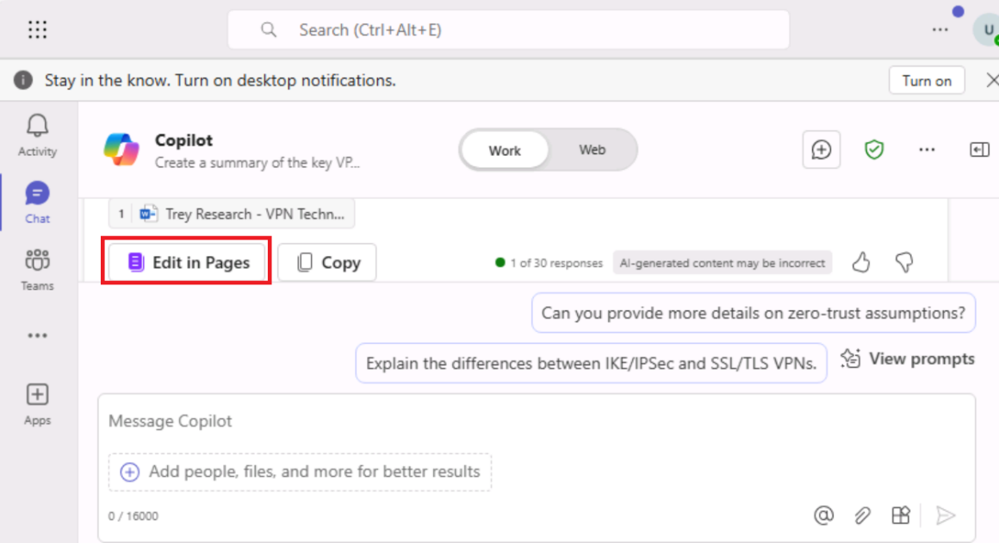

**实验 06：使用 Copilot Pages 增强团队协作和内容创建**

**目标：**

在本实验室中，你将使用 **Microsoft 365 应用**版中的 Microsoft Copilot 来

- 生成和编辑内容。

- 使用 **Microsoft 365 Pages** 功能优化和增强生成的内容。

- 与团队共享和协作 **Microsoft 365 Pages**，实现无缝生产力。

- 从 **Microsoft 365** 中的页面模块重新访问和管理页面。

**场景：**您是 Fabrikam 的 IT 咨询团队的一员。Trey Research
是一家快速发展的制药研究公司，已寻求有关实施虚拟专用网络 （VPN）
的指导，以改善其员工和合作伙伴的安全远程访问。Trey Research
的业务遍及全球，需要可扩展的解决方案来保护敏感的研究数据，同时确保符合行业法规。

您的任务是提供一份执行概述文档，其中总结了 Trey Research 的 VPN
要求、潜在解决方案以及采用 Contoso 建议的 VPN 体系结构的主要优势。

**在实验中要探索的主要功能：**

- **持久内容：** 了解 Copilot Pages 如何让您使 AI
  生成的响应更加持久和可编辑。

- **协作编辑：**观察团队成员与内容交互时的实时变化，演示多人游戏功能。

- **使用“/”菜单构建内容：**使用**“/”菜单**添加不同的内容类型，如标题、表格和图像，帮助有效地构建文档。

**注意：**您将使用 **Trey Research - VPN Technical Overview** 文档作为
Trey Research 共享的参考文档。

**练习 \#1：创建 Copilot 页面**

Trey Research 共享的参考文档包含有关 Trey Research 运营、现有 IT
基础设施和 VPN
需求的关键信息。作为基础设施解决方案顾问，您将参考此文档来起草提案。

**任务 1：获取最近使用的 （MRU） 文件列表中列出的参考文档。**

1.  如果您在 Microsoft Edge 浏览器中打开了 Microsoft 365
    选项卡，请立即选择它; 否则，请打开一个新选项卡并输入以下
    URL：+++ 以转到 Microsoft 365 主页。

**注意：**您需要使用下提供的 **Microsoft 365
凭据**登录（如果出现提示）**  
Resources** （资源） 选项卡。

2.  在 **Microsoft 365** 导航窗格中，选择 **OneDrive** 将其打开。

3.  浏览到 **C：\LabFiles** 文件夹，选择 **Trey Research - VPN Technical
    Overview** 文档的副本并将其上传到 **OneDrive**。

**注意：**如果您已按照**准备实验室执行**部分中的建议将所有实验室资产上传到
**OneDrive**，则可以跳过此步骤。

4.  打开并关闭文件 **Trey Research - VPN Technical
    Overview.docx**（您上传到的文件）  
    OneDrive） 将其放入最近使用的 （MRU） 文件列表中。

**任务 2：访问 Copilot 并开始对话**

1.  如果您在 Microsoft Edge 浏览器中打开了 Microsoft 365
    选项卡，请立即选择它; 否则，请打开一个新选项卡并输入以下
    URL：+++[https://www.office.com+++](https://www.office.com+++/) 以转到
    **Microsoft 365** 主页。

2.  在 **Microsoft 365** 导航窗格中，选择 **Teams** 将其打开。

请稍候，等待设置过程完成。

3.  选择 \*\*Chat\*\* 并打开 \*\*Copilot\*\*

4.  输入以下提示，开始与 **Copilot** 聊天。

++Create a summary of the key VPN needs for Trey Research, focusing on
secure remote access and compliance with industry standards.++

注意：在 **Copilot** 页面上，在页面顶部的 **Work/Web**
切换开关中，默认情况下将选择 **Work**。

5.  现在，您将附上 Trey Research
    共享的参考文档，以开始起草执行摘要的内容。选择 **Attach** （Paper
    clip） 图标以引用文档。

6.  选择文档 **Trey Research – VPN Technical Overview**。

**注意：**如果文件未在弹出列表中列出，请选择 **Attach** 图标

7.  您将在 **提示** 框。单击 **Send** 图标以触发 Copilot 开始生成内容。

8.  Copilot 将梳理参考文档并开始生成内容。

9.  Copilot 完成生成草稿内容后，您将在生成的内容末尾看到“**Edit in
    Pages**”按钮。

10. 聊天中会自动添加对这个新 **Copilot 页面**的引用，以便于访问。

**任务 3：浏览页面功能**

1.  您可以根据需要重命名聊天。

**注意：**Copilot 聊天名称不能超过 30 个字符。

2.  您可以单击**Panel** （折叠/展开）图标以展开 Copilot
    聊天窗格，以腾出空间来查看单独部分中的内容。验证页面是否在右侧与聊天窗格并排打开。响应会自动复制并格式化，包括任何链接预览或代码块。

3.  单击 **Edit in Pages** 按钮，在右侧的单独部分中查看生成的内容。

**练习 \#2：在页面上添加和优化内容**

在本练习中，您将在聊天中继续与 Copilot 互动。生成新分析后，单击 **Edit
in Pages** （在 Pages 中编辑）
以将其添加到当前页面。这些更新将附加到页面底部（您正在聊天窗格右侧查看）

**任务 1：在 Chat 中继续对话**

1.  在聊天窗口中，提供进一步的说明以优化内容。现在您将要求 Copilot
    比较三种 VPN 技术，重点关注它们与 Trey Research
    需求相关的优缺点。输入以下提示，然后单击 **Send**。

++Compare three VPN technologies based on scalability, security, and
cost-effectiveness.++

**注意：**您也可以尝试使用以下提示进行作。

++Create a table comparing three VPN technologies (e.g., MPLS VPN, SSL
VPN, IPsec VPN) based on scalability, security features, ease of
deployment, and cost.++

2.  Copilot
    将通过比较详细信息生成新的见解。 
    

3.  单击 **Edit in Pages**
    将此比较详细信息附加到现有页面。 
    

**任务 2：直接在页面上编辑**

1.  单击页面上的任意位置以开始键入和优化内容。键入 “**/**”
    以打开内容选项菜单，例如标题、项目符号、表格或图像，以获得更结构化和引人入胜的布局。 
    

2.  将鼠标悬停在内容块上，然后选择 Kebab 菜单（平行数组中的 3 个垂直点 -
    类似于串烧项目）以查看 Copy Page link、Move 块和 Delete
    选项。 
    

**任务 3：与团队成员协作**

1.  当您的页面准备好供团队输入时，单击右上角的 **Share 图标**，然后选择
    “**Copy component**” 。

2.  将此链接粘贴到 **Teams 频道**或 **Outlook**
    电子邮件中，以允许团队成员访问该页面并与您协作。

**注意：**此实验室环境在部署时功能受限。因此，您将无法以协作方式使用
Teams 和 Outlook，否则您将无法在公司网络中进行。

**练习 \#3：重新访问和访问已保存的页面Pages**

您可以随时返回到首次创建 Copilot 页面链接的原始聊天消息。

**任务 1：在 Microsoft365.com 中找到您的页面**

1.  转到 **Microsoft365.com** 上的 **Pages** 选项卡。

2.  在这里，您将看到您创建的所有 **Copilot
    页面**，这些页面经过组织以便于访问。 
    

**任务 2：进行其他编辑或共享更新**

打开已保存的页面以进行进一步编辑、添加更新或重新共享页面链接，以便与新的或现有的团队成员继续协作。

1.  当您将鼠标悬停在文本内容上时，您将看到 **Kebab** 菜单和 **Chat**
    图标**\*\***。

2.  现在直接编辑页面。单击页面并键入以添加或更改内容。现在，您将输入以下提示（以插入描述
    VPN 采用率的图表），然后单击 **Send**。

++Insert a chart showing VPN adoption rates in pharmaceutical
industries.++

3.  Copilot 将生成并显示带有代码片段的图表。

4.  关闭 **Copilot 聊**天窗口，然后选择 **Preview**
    以继续。 
    

5.  现在，您将完成草稿，为 Trey Research 的领导团队做好准备。

您将使用以下提示完成文档。

++Format the executive summary to highlight the top three benefits of
Contoso’s VPN recommendation.++

6.  您将使用以下提示完成文档。您将确保所有编辑都已完成，并使用适当的名称保存页面，以便进行演示或共享。

**总结：**

在本实验中，您应用了以下技能：

- 使用 Copilot 有效地创建、优化和共享内容。

- 利用 M365 Pages 的交互式和协作功能来增强团队合作。

通过将 Microsoft 365 Copilot
集成到日常工作流程中，以提高生产力和协作，从而实现真实场景。
