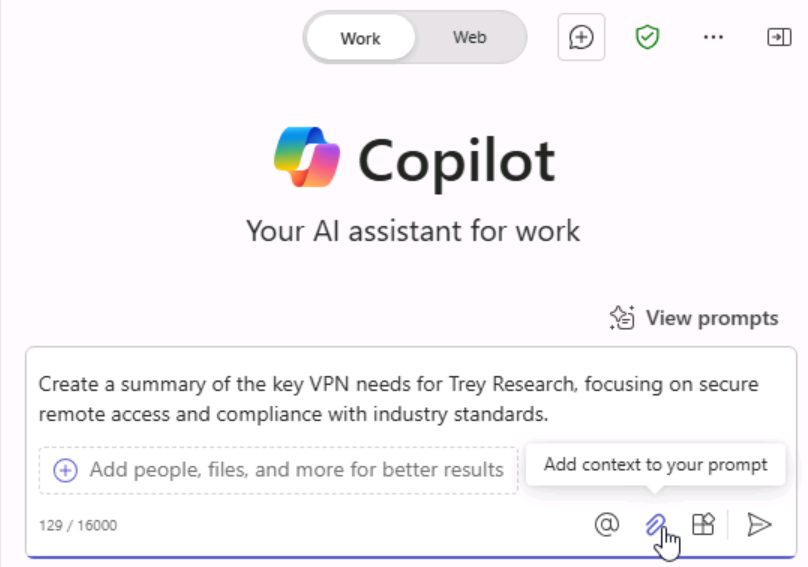
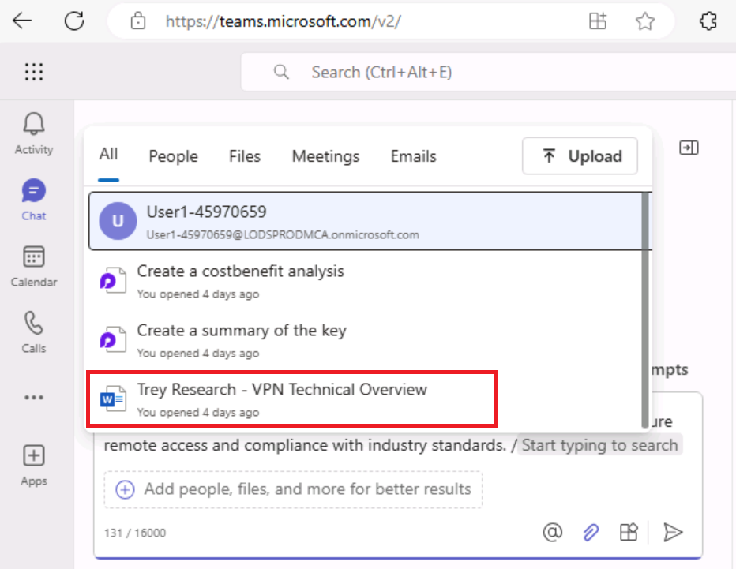
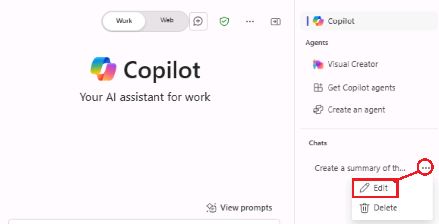
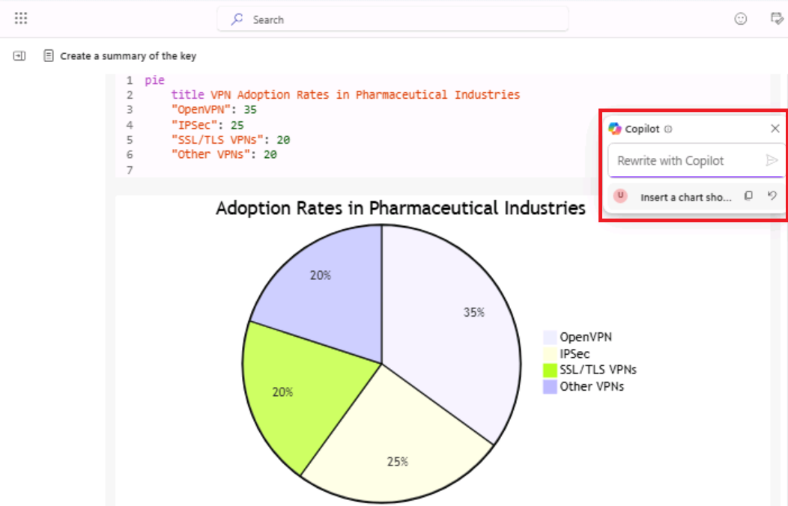
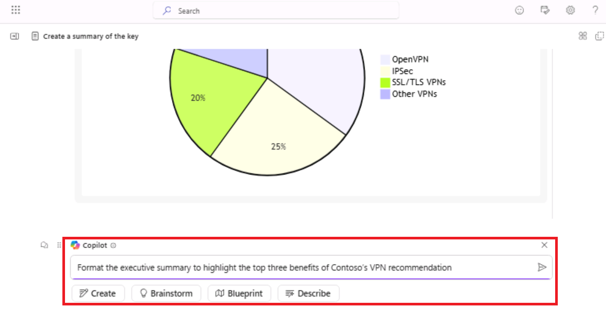

**Lab 06 : Renforcez la collaboration d'équipe et la création de contenu
avec Copilot Pages**

**Objectifs :**

Dans cet atelier, vous allez utiliser Microsoft Copilot dans **Microsoft
365 Apps** pour

- Générez et modifiez du contenu.

- Affinez et améliorez le contenu généré à l'aide des fonctionnalités de
  **Microsoft 365 Pages**.

- Partagez et collaborez sur **Microsoft 365 Pages** avec une équipe
  pour une productivité sans faille.

- Accédez à nouveau aux pages et gérez-les à partir du module Pages dans
  **Microsoft 365**.

**Scénario** : Vous faites partie de l'équipe de conseil en informatique
de Fabrikam. Trey Research, une société de recherche pharmaceutique en
pleine croissance, a demandé des conseils sur la mise en œuvre d'un
réseau privé virtuel (VPN) afin d'améliorer l'accès à distance sécurisé
pour ses employés et partenaires. Trey Research opère à l'échelle
mondiale, nécessitant des solutions évolutives qui protègent les données
de recherche sensibles tout en garantissant la conformité aux
réglementations de l'industrie.

Votre tâche consiste à fournir un document de présentation résumant les
exigences VPN de Trey Research, les solutions potentielles et les
principaux avantages de l'adoption de l'architecture VPN recommandée par
Contoso.

**Principales fonctionnalités à explorer pendant le Lab :**

- **Persistent Content** : Découvrez comment les pages Copilot vous
  permettent de rendre les réponses générées par l'IA plus durables et
  modifiables.

- **Collaborative Editing** : observez les changements en temps réel
  lorsque les membres de l'équipe interagissent avec le contenu,
  démontrant ainsi les capacités multijoueurs.

- **Content Structuring with "/" Menu** : utilisez **"/" Menu** pour
  ajouter différents types de contenu tels que des titres, des tableaux
  et des images, ce qui permet de structurer efficacement le document.

**Remarque** : Vous utiliserez le document **Trey Research - VPN
Technical Overview** comme document de référence partagé par Trey
Research.

**Exercice \#1 : Créer une page Copilot**

Le document de référence partagé par Trey Research contient des
informations clés sur les opérations de Trey Research, l'infrastructure
informatique existante et les besoins en matière de VPN. En tant que
consultant en solutions d'infrastructure, vous vous référerez à ce
document pour rédiger la proposition.

**Tâche 1 : Récupérez le document de référence répertorié dans la liste
des fichiers les plus récemment utilisés (MRU).**

1.  Si vous avez un onglet Microsoft 365 ouvert dans votre navigateur
    Microsoft Edge, sélectionnez-le maintenant ; sinon, ouvrez un nouvel
    onglet et entrez l'URL suivante : +++ accéder à la page d'accueil de
    Microsoft 365.

**Remarque** : Vous devez vous connecter (si vous y êtes invité) à
l'aide des **Microsoft 365 Credentials** fournies sous l'onglet
**Resources** à droite.

2.  Dans le volet de navigation **Microsoft 365**, sélectionnez
    **OneDrive** pour l'ouvrir.

3.  Accédez au dossier **C :\LabFiles** pour sélectionner et télécharger
    une copie du document **Trey Research - VPN Technical Overview** sur
    **OneDrive**.

**Remarque** : Si vous avez déjà téléchargé toutes les ressources du Lab
sur **OneDrive**, comme suggéré dans la section **Preparing for the lab
execution,** vous pouvez ignorer cette étape.

4.  Ouvrez et fermez le fichier **Trey Research - VPN Technical
    Overview.docx** (que vous avez téléchargé surOneDrive) pour
    l'obtenir dans votre liste de fichiers les plus récemment utilisés
    (MRU).

**Tâche 2 : Accéder à Copilot et démarrer une conversation**

1.  Si vous avez un onglet Microsoft 365 ouvert dans votre navigateur
    Microsoft Edge, sélectionnez-le maintenant ; sinon, ouvrez un nouvel
    onglet et entrez l'URL suivante :
    +++[https://www.office.com+++++](https://www.office.com+++/) pour
    accéder à la page d'accueil de **Microsoft 365**.

2.  Dans le volet de navigation **Microsoft 365**, sélectionnez
    **Teams** pour l'ouvrir.

Veuillez patienter pendant que le processus d'installation se termine.

3.  Sélectionnez \*\*Chat\*\* et ouvrez \*\*Copilot\*\*

4.  Commencez une discussion avec **Copilot** en entrant l'invite
    suivante.

++Create a summary of the key VPN needs for Trey Research, focusing on
secure remote access and compliance with industry standards.++

Remarque : Sur la page **Copilot**, dans le commutateur à bascule
**Work/Web** en haut de la page, **Work** sera sélectionné par défaut.

5.  Vous allez maintenant Attach le document de référence partagé par
    Trey Research pour commencer à rédiger le contenu du résumé.
    Sélectionnez l'icône **Attach (trombone)** pour référencer le
    document**.**

6.  Sélectionnez le document **Trey Research – VPN Technical Overview.**

**Remarque** : Si le fichier n'est pas répertorié dans la liste
contextuelle, réessayez en sélectionnant l'icône **Attach**

7.  Le document sélectionné est joint dans la zone **Prompt**. Cliquez
    sur **l**'icône Envoyer pour que Copilot commence à générer le
    contenu.

8.  Copilot passera au peigne fin le document de référence et commencera
    à générer le contenu.

9.  Une fois que Copilot a terminé de générer le contenu du brouillon,
    vous verrez le bouton **Edit in Pages** à la fin du contenu généré.

10. Une référence à cette nouvelle **Copilot Page** est automatiquement
    ajoutée dans le chat pour un accès facile.

**Tâche 3 : Explorer les fonctionnalités de la page**

1.  Vous pouvez renommer le chat selon vos besoins.

**Remarque : le** nom du chat Copilot ne peut pas comporter plus de 30
caractères.

2.  Vous pouvez cliquer sur l’icône **Panel** (Réduire/Développer) pour
    développer le volet de discussion Copilot afin de faire de la place
    pour afficher le contenu dans une section distincte. Vérifiez que la
    page s'ouvre sur la droite, à côté du volet de discussion. La
    réponse est automatiquement copiée et formatée, y compris les
    aperçus de liens ou les blocs de code.

3.  Cliquez sur le bouton **Edit in Pages** pour afficher le contenu
    généré dans une section distincte sur la droite.

**Exercice \#2 : Ajouter et affiner du contenu sur la page**

Dans cet exercice, vous continuerez à interagir avec Copilot dans le
chat. Lorsque de nouvelles informations sont générées, cliquez sur
**Edit in Pages** pour les ajouter à la page actuelle. Ces mises à jour
seront ajoutées au bas de la page (que vous consultez sur le côté droit
du volet de discussion)

**Tâche 1 : Poursuivre la conversation dans le chat**

1.  Dans la fenêtre de discussion, fournissez des instructions
    supplémentaires pour affiner le contenu. Vous allez maintenant
    demander à Copilot de comparer trois technologies VPN, en vous
    concentrant sur leurs avantages et leurs inconvénients par rapport
    aux besoins de Trey Research. Entrez l'invite suivante et cliquez
    sur **Send.**

++Compare three VPN technologies based on scalability, security, and
cost-effectiveness.++

 **Remarque**
: Vous pouvez également essayer à l'aide de l'invite suivante.

++Create a table comparing three VPN technologies (e.g., MPLS VPN, SSL
VPN, IPsec VPN) based on scalability, security features, ease of
deployment, and cost.++

2.  Copilot générera de nouvelles informations avec les détails de la
    comparaison.
    

3.  Cliquez sur **Edit in Pages** pour ajouter ces détails de
    comparaison à la page existante.
    

**Tâche 2 : Modifier directement sur la page**

1.  Cliquez n'importe où sur la page pour commencer à taper et à affiner
    le contenu. Tapez **"/"**  pour ouvrir un menu d'options de contenu,
    telles que des en-têtes, des puces, des tableaux ou des images, pour
    une mise en page plus structurée et attrayante.
    

2.  Passez votre souris sur un bloc de contenu et sélectionnez le menu
    Kebab (3 points verticaux en tableau parallèle - ressemblant à un
    élément en brochette) pour voir les options Copier le lien de la
    page, Déplacer le bloc et Supprimer.
    

**Tâche 3 : Collaborer avec les membres de l'équipe**

1.  Lorsque votre page est prête à être saisie par l'équipe, cliquez sur
    l'icône **Share** dans le coin supérieur droit et sélectionnez
    **‘Copy component’.**

2.  Collez ce lien dans un canal **Teams** ou un e-mail **Outlook**, ce
    qui permet aux membres de l'équipe d'accéder à la page et de
    collaborer avec vous.

**Remarque** : Cet environnement de Lab est déployé avec des
fonctionnalités restreintes. Ainsi, vous ne pourrez pas utiliser Teams
et Outlook de manière collaborative, ce que vous feriez autrement dans
un réseau d'entreprise.

**Exercice \#3 : Visiter et accéder aux pages enregistrées**

À tout moment, vous pouvez revenir au message de chat d'origine où le
lien de la page Copilot a été créé pour la première fois.

**Tâche 1 : Localiser votre page dans Microsoft365.com**

1.  Accédez à l'onglet **Pages** sur **Microsoft365.com**.

2.  Ici, vous verrez toutes les pages **Copilot** que vous avez créées,
    organisées pour un accès facile.
    

**Tâche 2 : Apporter des modifications supplémentaires ou partager les
mises à jour**

Ouvrez la page enregistrée pour apporter d'autres modifications, ajouter
des mises à jour ou partager à nouveau le lien de la page pour
poursuivre la collaboration avec les membres de l'équipe, nouveaux ou
existants.

1.  Lorsque vous survolez le contenu textuel, vous verrez le menu
    **Kebab** et l’icône **de Chat**\*\*.\*\*

2.  Maintenant, modifiez directement la page. Cliquez sur la page et
    tapez pour ajouter ou modifier du contenu. Vous allez maintenant
    entrer l'invite suivante (pour insérer un graphique illustrant les
    taux d'adoption du VPN) et cliquer sur **Send**.

++Insert a chart showing VPN adoption rates in pharmaceutical
industries.++

3.  Copilot générera et affichera le graphique avec l'extrait de code.

4.  Fermez la fenêtre de chat **Copilot chat** et sélectionnez
    **Preview** pour continuer.
    

5.  Vous allez maintenant finaliser le brouillon pour le rendre prêt
    pour l'équipe de direction de Trey Research.

Vous utiliserez l'invite suivante pour finaliser le document.

++Format the executive summary to highlight the top three benefits of
Contoso’s VPN recommendation.++

6.  Vous vous assurerez que toutes les modifications sont terminées et
    enregistrerez la page avec un nom approprié prêt à être présenté ou
    partagé.

**Résumé :**

Dans cet atelier, vous avez appliqué les compétences suivantes :

- Utilisez Copilot pour créer, affiner et partager efficacement du
  contenu.

- Utilisez les fonctionnalités interactives et collaboratives de M365
  Pages pour améliorer le travail d'équipe.

à des scénarios réels en intégrant Microsoft 365 Copilot dans les flux
de travail quotidiens pour la productivité et la collaboration.
