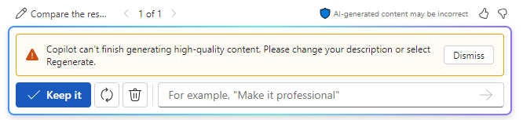

**Lab 07: Potenzia la tua forza lavoro – Copilot – HR**

**Obiettivo:**

Con Copilot per Microsoft 365, i professionisti delle risorse umane
possono semplificare il flusso di lavoro e migliorare la produttività
nei processi aziendali principali, come il reclutamento, l'onboarding,
la gestione delle prestazioni, il coinvolgimento dei dipendenti e la
gestione della conformità.

In questo lab verranno usati:

- Copilot in Word per creare una descrizione del lavoro per un nuovo
  ruolo.

- Copilot in Word per analizzare più curriculum e fornire un rapporto
  che confronta i punti di forza e di debolezza di ciascun candidato,
  classificare i candidata dal più qualificato al meno qualificato e
  formulare una raccomandazione.

- Copilot in Loop per creare una serie di domande di colloquio per
  intervistare i candidata per questo ruolo.

**Esercizio \#1: Creare una descrizione del lavoro utilizzando Copilot
in Word**

In qualità di responsabile delle risorse umane presso il Graphic Design
Institute, hai avviato il processo di assunzione di un nuovo Senior
Animation Designer. Il suoi staff ha creato un documento che delinea
tutte le responsabilità lavorative per questo ruolo. In questo esercizio
utilizzerai Copilot in Word per creare una descrizione del lavoro basata
sulle responsabilità del ruolo in questo documento.

1.  Se hai una scheda di **Microsoft 365** aperta nel suoi browser
    Microsoft Edge, selezionala ora; in caso contrario, apri una nuova
    scheda e inserisci il seguente URL:
    +++[https://www.office.com+++](https://www.office.com+++/) per
    andare alla home page di **Microsoft 365**.

**Nota**: è necessario accedere (se richiesto) utilizzando le di
**Microsoft 365 Credentials** fornite nella scheda **Resources** a
destra.

2.  Nel riquadro di spostamento di **Microsoft 365** selezionare
    **OneDrive** per aprirlo.

3.  Passare alla cartella **C:\LabFiles** per selezionare e caricare una
    copia del documento **Graphic Design Institute - Design Team** in
    **OneDrive**

**Mancia**: apri e chiudi il file per inserirlo nell'elenco dei file
utilizzati più di recente (MRU).

**Nota**: se sono già state caricate tutte le risorse lab in OneDrive,
come suggerito nella sezione **Preparing for the lab execution**, è
possibile ignorare questo passaggio.

4.  Se hai una scheda di Microsoft 365 aperta nel suoi browser Microsoft
    Edge, selezionala ora; in caso contrario, apri una nuova scheda e
    inserisci il seguente URL:
    +++[https://www.office.com+++](https://www.office.com+++/)

5.  Nella home page di **Microsoft 365** selezionare **Microsoft Word**
    e quindi aprire un documento vuoto.

6.  Nella finestra **Draft with Copilot**, immettere il seguente prompt,
    ma non selezionare il pulsante **Generate** fino a quando non si
    collega il file delle responsabilità al prompt nel passaggio
    successivo:

+++ I'm the HR Manager at the Graphic Design Institute. We've currently
started the hiring process for a new Senior Animation Designer. Please
review the attached document that outlines the job responsibilities for
this role and create a job description based on those
responsibilities.+++

7.  Ora devi allegare al prompt il file **di Graphic Design Institute -
    Design Team** **Responsibilities.docx** che hai scaricato. Nella
    finestra **Draft with Copilot**, selezionare il pulsante **Reference
    your content**. Nel menu a tendina che appare, se nell 'elenco dei
    file compare il file **Graphic Design Institute - Design Team
    Responsibilities.docx**, selezionalo.

8.  Selezionare **Browse files from cloud**, selezionare il file dall'
    elenco File **Recent** e quindi selezionare il pulsante **Attach**.
    Se il file non viene visualizzato nell' elenco File **Recent**,
    selezionare **My files** nella parte superiore del riquadro di
    spostamento nella finestra **Pick a file**, passare alla cartella in
    cui è stato archiviato il file, selezionare il file e quindi
    selezionare **Attach**.

9.  Notare come il file viene visualizzato nel prompt e selezionare
    **Generate**.

10. Rivedi la prima bozza del documento di descrizione del lavoro.

11. Si noti che non include molti dei dettagli presenti nel documento
    sulle responsabilità lavorative. Invece, fornisce una o due frasi
    riassuntive per ogni responsabilità. Per correggere questa mancanza,
    immettere il seguente prompt e selezionare la freccia avanti:

+++ While this job description draft is a good start, you failed to
include most of the details found in the job responsibilities document.
Please try again, and this time outline each responsibility area and
select the responsibilities required of a Senior Animation Designer.+++

12. Rivedi la seconda bozza.

13. Ancora una volta, ritieni che Copilot dovrebbe fornire maggiori
    dettagli. Inserisci il seguente prompt per vedere se riesci a
    renderlo più specifico:

+++ This job description draft is better, but it still lacks the details
that I'm looking for. The job responsibilities document outlined
detailed responsibilities for each area. Include those details in this
job description. Be as specific as you can..+++

14. Dopo aver esaminato i risultati, ti viene in mente il detto: "Fai
    attenzione a ciò che desideri" L'elenco delle responsabilità in
    questa terza bozza è lungo; In effetti, forse troppo lungo per un
    documento di descrizione del lavoro praticabile. A questo punto,
    vuoi rivedere le bozze precedenti per vedere se quelle precedenti
    sono forse preferibili a questa più lunga. Nella finestra di
    Copilot, appena sopra il campo del prompt, prendere nota della bozza
    della versione corrente del documento. In questo caso, sei al draft
    3 su 3. Per rivedere una bozza precedente, selezionare la freccia
    indietro (\<) per tornare alla seconda bozza e quindi alla prima.
    Usa le frecce avanti (\>) per tornare alle ultime bozze.

In questo caso, torna alla seconda bozza. Rivedi di nuovo l'elenco delle
responsabilità. Sebbene non sia così ampio come l'elenco nella terza
bozza, sembra più pulito e fornisce comunque informazioni sufficienti
per un candidato per capire cosa ci si aspetta da lui in questo ruolo di
Senior Animation Designer. Decidi che la seconda bozza è preferibile
alla bozza finale, quindi scegli di utilizzare questa. Nella finestra
Copilot, selezionare il pulsante **Keep it**.

15. Sei pronto per andare avanti con questo documento di descrizione del
    lavoro, quindi salvalo nel suoi account OneDrive con il nome file di
    **Graphic Design Institute - Job descriptions.docx.**

**Nota:** è importante salvare questo documento poiché lo utilizzerai
nel prossimo esercizio.

**Esercizio \#2: Analizzare i curriculum e formulare un consiglio
utilizzando Copilot in Word**

Nell'esercizio precedente si è appreso in che modo Copilot in Word può
aiutare i professionisti delle risorse umane a creare una descrizione
del lavoro. In questo esercizio imparerai come automatizzare le fasi
iniziali del processo di screening del curriculum per identificare
rapidamente i candidata più adatti da ampi pool di candidata.

**Nota**: quando si chiede a Copilot di generare un documento o di
applicare un tipo di modifica, a volte potrebbe iniziare a visualizzare
la bozza e quindi interrompersi. Se si verifica questa situazione,
selezionare il pulsante **Regenerate** per generare una nuova bozza
oppure riformulare il prompt e riprovare.

In qualità di responsabile delle risorse umane presso Graphic Design
Institute, hai iniziato a ricevere curriculum da un probabile candidato
per una nuova posizione di Senior Animation Designer in base
all'annuncio di lavoro sul web e al sito web interno dei dipendenti
dell'azienda. A questo punto utilizzerai Copilot in Word per esaminare
un batch di curriculum ricevuti per il ruolo e fornire una
raccomandazione su quale dei candidata si qualifica per un colloquio di
lavoro.

Al termine dell'esercizio precedente, è stato salvato il file di
descrizione del lavoro creato. Ti è stato chiesto di salvare il file
come **Graphic Design Institute - Job descriptions.docx**. Se viene
salvato con un nome di file diverso, ricordate il nome utilizzato in
modo da poter individuare il file in questo esercizio.

1.  Se hai una scheda di **Microsoft 365** aperta nel suoi browser
    Microsoft Edge, selezionala ora; in caso contrario, apri una nuova
    scheda e inserisci il seguente URL:
    +++[https://www.office.com+++](https://www.office.com+++/)

**Nota**: è necessario accedere (se richiesto) utilizzando le di
**Microsoft 365 Credentials** fornite nella scheda **Resources** a
destra.

2.  Nel riquadro di spostamento di **Microsoft 365,** selezionare
    **OneDrive** per aprirlo.

3.  Passare alla cartella **C:\LabFiles** per selezionare e caricare una
    copia dei seguenti documenti su **OneDrive**,

    - **Riassunto - Patti Fernandez**

    - **Curriculum - Nestor Wilke**

    - **Riassunto - Holly Dickson**

    - **Riassunto - Alex Wilber** .

**Nota**: se sono già state caricate tutte le risorse lab in OneDrive,
come suggerito in **Preparing for the lab execution**, è possibile
ignorare questo passaggio.

4.  In questo esercizio si accede ai documenti dall'elenco dei file
    utilizzati più di recente (MRU). Per fare in modo che i file vengano
    visualizzati nell'elenco MRU, aprire ogni documento e quindi
    chiuderlo. Apri e chiudi ciascuno dei quattro file di ripresa in
    OneDrive.

5.  Nel riquadro di spostamento di **Microsoft 365**, selezionare
    **Microsoft Word** e quindi aprire un nuovo documento vuoto.

6.  Nella finestra **Draft with Copilot** visualizzata nella parte
    superiore del documento vuoto, immettere il seguente prompt, ma non
    inviare ancora il prompt. È necessario allegare i file al prompt nel
    passaggio successivo:

+++ I'm the Hiring Manager for Graphic Design Institute. We're hiring
for the position of Senior Animation Designer. Please create a report
that compares the attached resumes to the requirements for a Senior
Animation Designer in the attached job description file and rank the
candidates from most qualified to least qualified. Thank you!+++

7.  A questo punto è necessario allegare al prompt il file **Graphic
    Design Institute - Job descriptions.docx** salvato nell'account
    OneDrive al termine dell'esercizio precedente. Nella finestra
    **Draft with Copilot**, selezionare il pulsante **Reference your
    content**. Nel menu a discesa visualizzato, se il file di
    descrizione del lavoro viene visualizzato nell'elenco dei file,
    selezionalo. In caso contrario, selezionare **Browse files from
    cloud**, individuare il file di descrizione del processo salvato
    nell'account OneDrive nell'esercizio precedente e quindi selezionare
    il pulsante **Attach**. Si noti come il file viene visualizzato nel
    prompt.

8.  Ripeti il passaggio precedente per ciascuno dei quattro curriculum
    che hai scaricato. Si noti cosa accade quando si tenta di allegare
    il terzo curriculum. Copilot visualizza un messaggio che indica che
    è possibile includere solo fino a tre file in un prompt. Poiché è
    necessario includere il file di descrizione del lavoro che fornisce
    a Copilot i requisiti del lavoro, è possibile inviare solo due dei
    curriculum con questo prompt iniziale.

9.  Poiché il file di descrizione del processo è stato allegato e le
    prime due riprese vengono visualizzate al prompt, selezionare
    **Generate**. A questo punto, Copilot estrae le informazioni
    pertinenti dal file di descrizione del lavoro e dai primi due
    curriculum e crea un rapporto di confronto dei curriculum. A questo
    punto, sei in modalità bozza di Copilot.

10. Esamina i risultati di questa prima bozza.

**Nota**: Dai un'occhiata alla finestra **Draft with Copilot** e nota
che non include un pulsante **Attach**. Una volta che sei in modalità
bozza come lo sei attualmente, Copilot non ti consente di allegare altri
file ai prompt successivi. È possibile utilizzare il campo di richiesta
per modificare il documento, ma non è più possibile allegare un altro
file. Tieni presente questo requisito mentre procedi con i passaggi
successivi. Questa bozza attuale confronta solo i primi due curriculum.
Per confrontare i due curriculum rimanenti con i due presenti nella
bozza corrente, è necessario mantenere una bozza di questo report e
quindi creare un secondo report che confronti i due curriculum rimanenti
con il documento appena creato.

11. A questo punto stai esaminando la prima bozza del report che
    confronta i primi due curriculum con il file di descrizione del
    lavoro. Copilot ti dà la possibilità di rigenerare tutte le bozze
    che desideri fino a trovarne una che preferisci. Anche se si ritiene
    che questa prima bozza sia corretta, selezionare il pulsante
    **Regenerate** nella finestra **Draft with Copilot** per fare in
    modo che Copilot crei una seconda bozza.

12. Durante la rigenerazione, è possibile che venga visualizzato il
    messaggio di errore "Qualcosa è andato storto". Chiudere e provare a
    rigenerare il report di confronto fino a quando non si ottiene il
    report rigenerato.

13. Esamina la seconda bozza creata da Copilot. Nel mondo reale, puoi
    ripetere questo processo fino a quando non sei soddisfatto di una
    bozza specifica. Se si desidera tornare a una bozza precedente per
    confrontarla con una bozza più recente, selezionare le frecce avanti
    (\>) e indietro (\<) per scorrere le bozze avanti e indietro.
    Confronta le due bozze che hai creato e assicurati che venga
    visualizzata quella che preferisci (sarà **1 su 2** o **2 su 2**).
    Quando trovi una bozza che desideri utilizzare, seleziona il
    pulsante **Keep it**.

**Nota**: Quando si seleziona **Keep it**, Copilot passa dalla modalità
bozza alla modalità normale di Microsoft Word. Inoltre, salva
automaticamente il documento di **Report Comparison** nell'account
OneDrive.

14. A questo punto è possibile richiedere a Copilot di esaminare gli
    ultimi due curriculum. Tuttavia, come indicato nel passaggio
    precedente, è necessario confrontare i due curriculum rimanenti con
    il documento di **Report Comparison** appena creato che confronta i
    primi due curriculum. Per fare ciò, è necessario aprire un nuovo
    documento di Word. Poiché nel browser è ancora visualizzata la
    scheda **Word** con il documento di **Report Comparison** corrente ,
    selezionare **File** nel menu sopra la barra multifunzione di
    **Word** e quindi nella **Home** page selezionare **Blank document**
    nella sezione **New**. In questo modo si apre una nuova scheda nel
    browser insieme a un nuovo documento di Word.

15. Nella finestra **Draft with** **Copilot**, immettere il seguente
    prompt, ma non inviarlo. Nel passaggio successivo, è necessario
    allegare i due file di curriculum rimanenti e il primo rapporto di
    **Report Comparison** al prompt:

+++ That was a good start. Please create a report that compares the
attached resumes to the prior resume comparison report (attached) and
rank the candidates from most qualified to least qualified. Thank
you!+++

16. A questo punto è necessario allegare il report appena creato che
    confronta i primi due curriculum, insieme ai due curriculum
    rimanenti. Dopo aver immesso il prompt nel passaggio precedente,
    selezionare il pulsante **Reference your content** nella finestra
    **Draft with Copilot**. Nel menu a discesa visualizzato, il
    documento **Report Comparison of Resumes** creato dovrebbe apparire
    nella parte superiore dell'elenco dei file. Selezionare questo
    documento.

17. Nella finestra **Draft with Copilot**, selezionare il pulsante
    **Reference your content**. Nel menu a tendina che appare, è
    necessario allegare uno dei due curriculum rimanenti. Se vedi uno
    dei file nell'elenco dei file, selezionalo. In caso contrario,
    selezionare **Browse files from cloud**, individuare uno dei due
    curriculum rimanenti (dovrebbe essere visualizzato se si scorre l'
    elenco dei file **Recent**), selezionarlo e quindi selezionare il
    pulsante **Attach**. Ripeti questa procedura per selezionare
    l'ultimo curriculum rimasto.

18. Una volta che il primo rapporto di confronto dei rapporti e i due
    curriculum rimanenti sono allegati al prompt, selezionare il
    pulsante **Generate** nella finestra **Draft with Copilot**.

**Nota**: quando generi rapporti di confronto con curriculum successivi,
potresti imbatterti nel messaggio di errore "Qualcosa è andato storto".
Chiudi e prova a generare il rapporto di confronto finché non ricevi il
rapporto.

19. Copilot dovrebbe confrontare i primi due curriculum e gli ultimi due
    curriculum e fornire una graduatoria dei candidata. A questo punto,
    è possibile rigenerare una nuova bozza o chiedere a Copilot di
    apportare eventuali modifiche. Per questo esercizio di formazione,
    decidi di essere soddisfatto del rapporto, quindi seleziona il
    pulsante **Keep it.**

20. A questo punto, Copilot ha generato due documenti di confronto dei
    rapporti, il secondo dei quali è il rapporto finale che mette a
    confronto tutti e quattro i candidata. Tenere presente questo
    scenario se è necessario eseguire un'operazione simile nel mondo
    reale utilizzando Copilot in Word. Puoi chiudere questa scheda nel
    suoi browser Microsoft Edge.

**Esercizio \#3: Creare domande per il colloquio utilizzando Copilot in
Loop**

Con Copilot in Loop, puoi creare aree di lavoro e pagine, utilizzare la
ricerca intelligente e i modelli per aggiungere contenuti pertinenti e
condividere il suoi lavoro con altri utenti. Copilot in Loop può
suggerire idee e aiutare ad avviare progetti, rendendo più facile andare
avanti quando ci si trova bloccati. Può redigere testi, creare tabelle e
persino rispondere rapidamente alle domande.

Copilot in Loop può assistere i professionisti delle risorse umane in
molti aspetti dell'esperienza HR: dal processo di assunzione, alla
gestione dei dipendenti, alla gestione di documenti importanti, alla
gestione delle comunicazioni interne.

In questo esercizio, utilizzerai Copilot in Loop per facilitare il
processo di assunzione per un nuovo ruolo. Mentre nell'esercizio
precedente è stato utilizzato Copilot in Word per selezionare i
curriculum, verrà utilizzato Copilot in Loop per creare un elenco di
domande per il colloquio per i migliori candidata. Durante questo
esercizio, puoi verificare se Copilot in Loop può modificare l'elenco
delle domande in base alla tua direzione.

1.  Se hai **Microsoft 365** aperto in una scheda, procedi al passaggio
    successivo. In caso contrario, apri una nuova scheda nel browser
    **Microsoft Edge** e quindi immetti l'URL seguente:
    +++[https://www.office.com+++](https://www.office.com+++/)

2.  In **Microsoft 365,** selezionare **Loop** se viene visualizzato nel
    riquadro di spostamento a sinistra. Se non viene visualizzato nel
    riquadro di navigazione, selezionare **App Launcher** e nella pagina
    **App** scorrere verso il basso per individuare **Loop,** quindi
    selezionarlo.

3.  Se viene visualizzato il pulsante **Sign-in**, accedi utilizzando le
    credenziali utente.

**Nota**: dopo aver effettuato l'accesso, chiudi la finestra del browser
Loop e apri nuovamente Loop dalla pagina App.

4.  In **Microsoft Loop**, la scheda di **Workspaces** viene
    visualizzata per impostazione predefinita. Si vuole creare una nuova
    area di lavoro per questo progetto, selezionare **+** accanto a
    **Getting started** e quindi, selezionare il pulsante **+New
    workspace**.

5.  Nella finestra **Create a new workspace**, inserisci le **Interview
    questions** per il nome del suoi workspace, quindi seleziona il
    pulsante **Continue** o **Create** che viene visualizzato (a seconda
    della versione del loop).

6.  Nella finestra **Add files to your workspace** (a seconda della
    versione di Loop, questa finestra potrebbe indicare di **Workspace
    Switcher**), seleziona **Create Workspace**.

7.  A questo punto ci si trova nella prima pagina della nuova area di
    lavoro. Il nome della pagina è attualmente **Untitled**. Si noti che
    la pagina (Senza titolo) viene visualizzata anche nel riquadro di
    navigazione a sinistra. Nel corpo principale della pagina, seleziona
    nel campo **Untitled** e modifica il nome della pagina in: **15
    interview questions for the Senior Animation Designer role**. Si
    noti che il nome della pagina viene aggiornato automaticamente nel
    riquadro di spostamento.

8.  Nella sezione **Just start typing...** , immettere una barra
    **(/).**

9.  Nel menu a discesa visualizzato, nella sezione **Copilot** nella
    parte superiore del menu, selezionare **Draft page content**.

10. Nella finestra di **Copilot** visualizzata, immettere il seguente
    prompt e selezionare l' icona **Submit**:

++**Create a list of the 15 best interview questions that should be
asked to candidates applying for a new Senior Animation Designer role at
the Graphic Design** **Institute**.++

**Nota**: A volte, è possibile che la finestra di **Copilot** non venga
visualizzata con le opzioni Crea, Brainstorming, Blueprint e Descrivi.
Se si verificano tali eccezioni, chiudere l'area di lavoro e riprovare.

11. Esamina l'elenco delle domande.

12. Pensi che questo elenco iniziale sia un buon inizio, ma noti che
    mancano alcuni tipi di domande. Nel riquadro Copilot visualizzato,
    immettere il seguente messaggio di richiesta:

++ **Add a question about having failed at a project and what they
learned from it**.++

13. Esamina la nuova domanda creata da Loop.

14. Dopo aver esaminato l'elenco un'ultima volta, ti rendi conto che
    include poche, se non nessuna, domande sulla leadership. Per
    correggere questa situazione, immettere il seguente messaggio di
    richiesta:

++ **As a Senior Animation Designer, the candidate is expected to lead
their design team on projects. Ask them to talk about a couple of their
most significant experiences in leading other design team members, and
what their leadership style is**.++

15. Nota cosa è successo in Loop. Quando si richiede una modifica senza
    richiedere specificamente di aggiornare la pagina corrente, Copilot
    può aprire una nuova pagina e apportare la modifica in tale pagina
    anziché nella pagina corrente, come faceva nel prompt precedente. In
    questo caso, si noti che nel riquadro Copilot vengono monitorati i
    prompt, con il prompt più recente visualizzato nella parte superiore
    del riquadro.

Selezionare un prompt precedente. Si noti che il contenuto della pagina
viene visualizzato con un carattere più chiaro. Provare anche a
selezionare il campo di richiesta **Rewrite with Copilot**. Copilot
disabilita questo campo poiché non è la pagina corrente. La pagina
corrente viene anche definita pagina attiva. Ora seleziona l'ultimo
prompt e nota come il contenuto sia chiaro, indicando che questa pagina
è la pagina corrente o attiva. È possibile modificare solo la pagina
attiva, motivo per cui in questa pagina è possibile selezionare il campo
di richiesta Rewrite with Copilot.

16. Facciamo un altro cambiamento. Non sei sicuro che l'attuale elenco
    di domande sia sufficiente. Per andare sul sicuro, decidi di
    chiedere a Copilot in Loop di consigliarti altre domande. Immettere
    il seguente messaggio di richiesta:

++ **Are there any other questions that you think should be added to the
list**?++

17. Prendi nota dell'elenco finale delle domande generate da Copilot in
    Loop.

18. Ora hai un vasto assortimento di domande tra cui scegliere quando
    intervisti i suoii candidata. E con Loop, sai che gli altri membri
    del suoi team HR possono vedere queste domande in tempo reale sullo
    stesso componente Loop, anche se utilizzano app e dispositivi
    diversi.

**Sommario:**

In questo laboratorio:

- È stata creata una descrizione del lavoro per un nuovo ruolo
  nell'organizzazione utilizzando Copilot in Word.

- Ha analizzato più curriculum e generato un report che confronta i
  punti di forza e di debolezza di ciascun candidato, ha classificato i
  candidata dal più qualificato al meno qualificato e ha formulato una
  raccomandazione utilizzando Copilot in Word.

- Ha redatto una serie di domande per il colloquio con i candidata per
  un ruolo lavorativo utilizzando Copilot in Loop.
