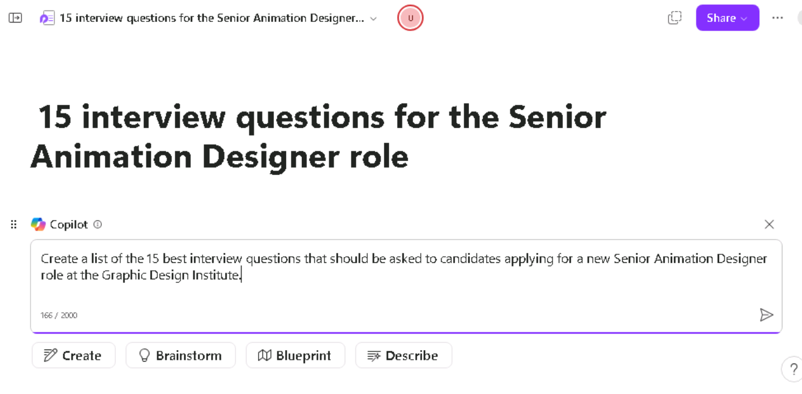

**實驗室 07：為您的員工賦能 – Copilot – HR**

**目的：**

借助適用於 Microsoft 365 的
Copilot，人力資源專業人員可以簡化其工作流程並提高其核心業務流程（如招聘、入職、績效管理、員工敬業度和合規性管理）的生產力。

在本實驗中，您將使用：

- Word 中的 Copilot 為新角色創建職位描述。

- Word 中的 Copilot
  分析多份簡歷並提供一份報告，比較每個候選人的優勢和劣勢，從最合格到最不合格對候選人進行排名，並提出建議。

- Copilot in Loop 創建一組面試問題，用於面試此職位的候選人。

**練習 \#1：在 Word 中使用 Copilot 創建職位描述**

作為 Graphic Design Institute
的人力資源經理，您開始了新高級動畫設計師的招聘流程。您的員工創建了一個文檔，其中概述了此角色的所有工作職責。在本練習中，您將使用
Word 中的 Copilot 根據本文檔中的角色職責創建職位描述。

1.  如果您在 Microsoft Edge 瀏覽器中打開了 **Microsoft 365**
    選項卡，請立即選擇它; 否則，請打開一個新選項卡並輸入以下
    URL：+++[https://www.office.com+++](https://www.office.com+++/) 以轉到
    **Microsoft 365** 主頁。

**注意：**您需要使用右側 “**Resources**” 選項卡下提供的 **Microsoft 365
憑據**登錄（如果出現提示）。

2.  在 **Microsoft 365** 導航窗格中，選擇 **OneDrive** 將其打開。

3.  瀏覽到 **C：\LabFiles** 文件夾以選擇 **Graphic Design Institute -
    Design Team** 文檔並將其副本上傳到 **OneDrive**

**提示：** 打開並關閉文件以將其放入 Most Recently Used （MRU）
文件列表中。

**注意：**如果您已按照**準備實驗室執行**部分中的建議將所有實驗室資產上傳到
OneDrive，則可以跳過此步驟。

4.  如果您在 Microsoft Edge 瀏覽器中打開了 Microsoft 365
    選項卡，請立即選擇它;否則，請打開一個新選項卡並輸入以下
    URL：+++[https://www.office.com+++](https://www.office.com+++/)

5.  在 **Microsoft 365** 主頁中，選擇 **Microsoft
    Word**，然後打開一個空白文檔。

6.  在 **Draft with Copilot** （使用 Copilot 起草）
    窗口中，輸入以下提示，但在下一步中將責任文件鏈接到提示之前，不要選擇
    **Generate** （生成） 按鈕：

+++I'm the HR Manager at the Graphic Design Institute. We've currently
started the hiring process for a new Senior Animation Designer. Please
review the attached document that outlines the job responsibilities for
this role and create a job description based on those
responsibilities.+++ 

7.  現在，您必須將您下載的 **Graphic Design Institute - Design Team
    Responsibilities.docx** 文件附加到提示符中。在 **Draft with
    Copilot** 窗口中，選擇 **Reference your content**
    按鈕。在顯示的下拉菜單中，如果 **Graphic Design Institute - Design
    Team Responsibilities.docx**文件顯示在文件列表中，請選擇該文件。

8.  選擇 **Browse files from cloud**（從雲中瀏覽文件），從 **Recent**
    file （最近打開的文件） 列表中選擇文件，然後選擇 **Attach** （附加）
    按鈕。如果文件未顯示在 **Recent** file （最近打開的文件）
    列表中，請在 **Pick a file** （選取文件） 窗口中選擇導航窗格頂部的
    **My files**
    （我的文件），導航到存儲文件的文件夾，選擇該文件，然後選擇
    **Attach** （附加）。

9.  請注意文件在提示中的顯示方式，然後選擇 **Generate**。

10. 查看職位描述文件的初稿。

11. 您注意到，它不包括 job responsibilities
    文檔中找到的許多詳細信息。相反，它為每個責任提供了一兩個總結性句子。要更正此缺點，請輸入以下提示並選擇前進箭頭：

+++While this job description draft is a good start, you failed to
include most of the details found in the job responsibilities document.
Please try again, and this time outline each responsibility area and
select the responsibilities required of a Senior Animation Designer.+++

12. 審閱第二稿。

13. 同樣，您認為 Copilot
    應該提供更多詳細信息。輸入以下提示，看看是否可以使其更具體：

+++This job description draft is better, but it still lacks the details
that I'm looking for. The job responsibilities document outlined
detailed responsibilities for each area. Include those details in this
job description. Be as specific as you can.+++

14. 查看結果後，您會想起這句話，“小心你的願望”第三稿中的職責清單很長;事實上，對於可行的職位描述文件來說可能太長了。此時，您需要查看以前的草稿，看看較早的草稿是否比較長的草稿更可取。在
    Copilot
    窗口中，就在提示字段上方，記下文檔的當前版本草稿。在本例中，您使用的是
    3 選秀 3。要查看較早的草稿，請選擇後退箭頭 （\<）
    以返回到第二個草稿，然後返回第一個草稿。使用前進箭頭 （\>）
    可返回到最新的草稿。

在這種情況下，請返回到第二稿。再次查看職責列表。雖然它不像第三稿中的列表那樣廣泛，但它看起來更簡潔，並且仍然為求職者提供了足夠的信息，讓他們瞭解這個高級動畫設計師角色對他們的期望。您認為第二稿比最終稿更可取，因此您選擇使用這個稿。在
Copilot 窗口中，選擇 **Keep it** 按鈕。

15. 您已準備好繼續閱讀此職位描述文檔，因此請將其保存到您的OneDrive
    帳戶，文件名為 **Graphic Design Institute - Job
    descriptions.docx**。

**注意：**保存此文檔非常重要，因為您將在下一個練習中使用它。

**練習 \#2：在 Word 中使用 Copilot 分析簡歷並提出建議**

在上一個練習中，您瞭解了 Word 中的 Copilot 如何幫助 HR
專業人員製作職位描述。在本練習中，您將學習如何自動化簡歷篩選過程的初始階段，以便從大量申請人中快速確定最合適的候選人。

**注意：**當您要求 Copilot
生成文檔或應用某種類型的更改時，它有時可能會開始顯示草稿，然後停止。如果您遇到這種情況，請選擇
**Regenerate** （重新生成）
按鈕以使其生成新草稿，或者重新表述您的提示並重試。

作為 Graphic Design Institute 的人力資源經理，您開始根據 Web
和公司內部員工網站上的招聘信息收到新高級動畫設計師職位的潛在候選人的簡歷。現在，您將在
Word 中使用 Copilot
來篩選您收到的一批針對該職位的簡歷，並提供有關哪些候選人有資格參加求職面試的建議。

在上一個練習結束時，您保存了您創建的職位描述文件。系統指示您將文件另存為
**Graphic Design Institute - Job
descriptions.docx**。如果文件是用其他文件名保存的，請記住您所使用的名稱，以便在本練習中找到該文件。

1.  如果您在 Microsoft Edge 瀏覽器中打開了 **Microsoft 365**
    選項卡，請立即選擇它;否則，請打開一個新選項卡並輸入以下
    URL：+++[https://www.office.com+++](https://www.office.com+++/)

**注意：**您需要使用右側 “**Resources**” 選項卡下提供的 **Microsoft 365
憑據**登錄（如果出現提示）。

2.  在 **Microsoft 365** 導航窗格中，選擇 **OneDrive** 將其打開。

3.  瀏覽到 **C：\LabFiles** 文件夾，選擇以下文檔的副本並將其上傳到
    **OneDrive**，

    - **簡歷- Patti Fernandez**

    - **簡歷- Nestor Wilke**

    - **簡歷- Holly Dickson**

    - **簡歷- Alex Wilber** 。

**注意：**如果您已按照**準備實驗室執行**中的建議將所有實驗室資產上傳到
OneDrive，則可以跳過此步驟。

4.  在本練習中，您將從 Most Recently Used （MRU）
    文件列表中訪問文檔。若要使文件顯示在 MRU
    列表中，請打開每個文檔，然後將其關閉。打開和關閉 OneDrive
    中的四個簡歷文件。

5.  在 **Microsoft 365** 導航窗格中，選擇 **Microsoft
    Word，**然後打開一個新的空白文檔。

6.  在空白文檔頂部顯示的 **Draft with Copilot**
    窗口中，輸入以下提示，但暫時不要提交提示。您必須在下一步中將文件附加到提示符中：

+++I'm the Hiring Manager for Graphic Design Institute. We're hiring for
the position of Senior Animation Designer. Please create a report that
compares the attached resumes to the requirements for a Senior Animation
Designer in the attached job description file and rank the candidates
from most qualified to least qualified. Thank you!+++

7.  現在，您必須將您在上一個練習結束時保存到 OneDrive 帳戶的 **Graphic
    Design Institute - Job descriptions.docx** 文件附加到提示中。在
    **Draft with Copilot** 窗口中，選擇 **Reference your content**
    按鈕。在顯示的下拉菜單中，如果任務描述文件顯示在文件列表中，請選擇它。否則，請選擇
    **Browse files from
    cloud**（從雲中瀏覽文件），找到您在上一個練習中保存到 OneDrive
    賬戶的職位描述文件，然後選擇
    **Attach**（附加）按鈕。請注意文件在提示符中的顯示方式。

8.  對您下載的四份簡歷中的每一份重複上一步。請注意當您嘗試附加第三份簡歷時會發生什麼情況。Copilot
    將顯示一條消息，指示您最多只能將三個文件包含在提示符中。由於您必須包含為
    Copilot
    提供工作要求的工作描述文件，因此您只能使用此初始提示提交其中兩份簡歷。

9.  由於您將任務描述文件和前兩個簡歷附加到提示符中，因此請選擇
    **Generate**（生成）。此時，Copilot
    從職位描述文件和前兩個簡歷中提取相關信息，並創建簡歷比較報告。此時，您處於
    Copilot 草稿模式。

10. 查看此初稿的結果。

**注意：**查看 **Draft with Copilot** 窗口，請注意它不包含 **Attach**
按鈕。一旦您像現在一樣處於草稿模式，Copilot
就不允許您將更多文件附加到後續提示中。您可以使用提示字段修改文檔，但不能再附加其他文件。在繼續執行後續步驟時，請牢記此要求。當前草稿僅比較前兩份簡歷。要將剩餘兩份簡歷與當前草稿中的兩份簡歷進行比較，您必須保留此報表的草稿，然後創建第二份報表，將剩餘兩份簡歷與您剛剛創建的文檔進行比較。

11. 您現在正在查看報告的初稿，該草稿將前兩份簡歷與職位描述文件進行了比較。Copilot
    使您能夠重新生成任意數量的草稿，直到找到您喜歡的草稿。即使您認為此初稿看起來不錯，也請選擇
    **Draft with Copilot** 窗口中的 **Regenerate** 按鈕，讓 Copilot
    創建第二個草稿。

12. 重新生成時，您可能會遇到 “Something went wrong”
    錯誤消息。關閉並嘗試重新生成比較報告，直到獲得重新生成的報告。

13. 查看 Copilot
    創建的第二個草稿。在現實世界中，您可以重複此過程，直到您對特定草稿感到滿意為止。如果要返回以前的草稿以將其與較新的草稿進行比較，請選擇前進
    （\>） 和後退 （\<）
    箭頭以在草稿中來回切換。比較您創建的兩個草稿，並確保顯示您喜歡的草稿（它是
    **2 個中的 1 個**或 **2 個中的 2 個**）。找到要使用的草稿後，選擇
    **Keep it** （保留） 按鈕。

**注意：**當您選擇 **Keep it，**Copilot 將從草稿模式變為普通的 Microsoft
Word 模式。它還會自動將 **Report Comparison** 文檔保存到您的 OneDrive
帳戶。

14. 您現在已準備好讓 Copilot
    審核最後兩份簡歷。但是，如前面的步驟所示，您必須將其餘兩份簡歷與您剛剛創建的
    **Report Comparison**
    文檔進行比較，該文檔比較了前兩份簡歷。為此，您必須打開一個新的 Word
    文檔。由於您仍在瀏覽器中的 **Word** 選項卡中，並顯示當前的 **Report
    Comparison** 文檔，因此請在 **Word** 功能區上方的菜單中選擇
    **File**，然後在 **Home** 頁面上，選擇 **New** 部分下的 **Blank
    document**。這樣做會在瀏覽器中打開一個新選項卡以及一個新的 Word
    文檔。

15. 在 **Draft with Copilot** （使用 Copilot 起草）
    窗口中，輸入以下提示，但不要提交。在下一步中，您必須將其餘兩個簡歷文件和第一個
    **Report Comparison** 報告附加到提示中：

+++That was a good start. Please create a report that compares the
attached resumes to the prior resume comparison report (attached) and
rank the candidates from most qualified to least qualified. Thank
you!+++

16. 現在，您必須附加剛剛創建的報告，該報告比較了前兩份簡歷以及其餘兩份簡歷。在上一步中輸入提示後，在
    **Draft with Copilot** 窗口中選擇 **Reference your content**
    按鈕。在顯示的下拉菜單中，您創建的 **Report Comparison of Resumes**
    文檔應顯示在文件列表的頂部。選擇此文檔。

17. 在 **Draft with Copilot** 窗口中，選擇 **Reference your content**
    按鈕。在出現的下拉菜單中，您需要附加其餘兩份簡歷中的一份。如果您在文件列表中看到其中一個文件，請選擇它。否則，請選擇
    **Browse files from
    cloud**（從雲中瀏覽文件），找到其餘兩個簡歷中的一個（如果您滾動瀏覽
    **Recent**
    file（最近打開的文件）列表，您應該會看到它），選擇它，然後選擇
    **Attach**（附加）按鈕。重複此過程以選擇最後剩餘的簡歷。

18. 將第一份報告比較報告和其餘兩份簡歷附加到提示後，選擇 “**Draft with
    Copilot**” 窗口中的 “**Generate**” 按鈕。

**注意：**在生成包含連續簡歷的比較報告時，您可能會遇到 “Something went
wrong” 錯誤消息。關閉並嘗試生成比較報告，直到您獲得報告。

19. Copilot
    應比較前兩份簡歷和最後兩份簡歷，並提供候選人的排名列表。此時，您可以重新生成新草稿或要求
    Copilot
    進行任何更改。對於此培訓練習，您決定對報告感到滿意，因此請選擇
    **Keep it** （保留） 按鈕。

20. 此時，Copilot
    生成了兩個報告比較文件，其中第二個是比較所有四個候選人的最終報告。如果您必須在現實世界中使用
    Word 中的 Copilot 執行類似作，請記住此方案。您可以在 Microsoft Edge
    瀏覽器中關閉此選項卡。

**練習 #3：在 Loop 中使用 Copilot 創建面試問題**

使用 Copilot in
Loop，您可以創建工作區和頁面，使用智能搜索和模板添加相關內容，並與他人共享您的工作。Loop
中的 Copilot
可以提出想法並幫助啟動項目，當您發現自己陷入困境時，可以更輕鬆地開始。它可以起草文本、創建表格，甚至快速回答問題。

Copilot in Loop 可以在人力資源體驗的許多方面協助人力資源專業人員 -
從招聘流程到管理員工，到處理重要文件，再到管理內部通信。

在本練習中，您將使用 Loop 中的 Copilot
來幫助完成新角色的招聘流程。雖然您在上一個練習中使用了 Word 中的 Copilot
來篩選簡歷，但您將使用 Copilot in Loop
為頂級應聘者創建面試問題列表。在本練習中，您可以檢查 Copilot in Loop
是否可以根據您的指示修改問題列表。

1.  如果您在選項卡中打開了 **Microsoft
    365**，請繼續執行下一步。否則，請在 **Microsoft Edge**
    瀏覽器中打開一個新選項卡，然後輸入以下
    URL：+++[https://www.office.com+++](https://www.office.com+++/)

2.  在 **Microsoft 365** 中，如果它出現在左側導航窗格中，請選擇
    **Loop**。如果它未顯示在導航窗格中，請選擇 **App Launcher**，然後在
    **Apps** 頁面上向下滾動以找到 **Loop**，然後選擇它。

3.  如果您看到 **Sign-in** （登錄） 按鈕，請使用用戶憑證登錄。

**注意：**登錄後，關閉 Loop 瀏覽器窗口，然後再次從 Apps 頁面打開 Loop。

4.  在 **Microsoft Loop** 中，默認情況下會顯示 **Workspaces**
    選項卡。要為此項目創建新工作區，請選擇 “**Getting started**” 旁邊的
    “**+**” ，然後選擇 “**+New workspace**”按鈕。

5.  在 **Create a new workspace** （創建新工作區） 窗口中，輸入
    **Interview questions** （訪談問題）
    作為您的工作區名稱，然後選擇顯示的 **Continue** （繼續） 或
    **Create** （創建） 按鈕（取決於您的 Loop 版本）。

6.  在 **Add files to your workspace** （將文件添加到工作區）
    窗口中（根據您的 Loop 版本，此窗口可能會顯示 **Workspace
    Switcher**），選擇 **Create workspace**（創建工作區）。

7.  您現在位於新工作區的第一頁中。頁面名稱當前為
    **Untitled**。請注意，頁面 （Untitled）
    也顯示在左側導航窗格中。在頁面的主體中，選擇 **Untitled** （無標題）
    字段，然後將頁面名稱更改為：**15 interview questions for the Senior
    Animation Designer
    role**。請注意頁面名稱在導航窗格中的自動更新方式。

8.  在 **Just start typing...**字段中，輸入正斜杠 （**/**）。

9.  在顯示的下拉菜單中，在菜單頂部的 **Copilot** 部分下，選擇 **Draft
    page content**。

10. 在出現的 **Copilot** 窗口中，輸入以下提示並選擇 **Submit** 圖標：

++**Create a list of the 15 best interview questions that should be
asked to candidates applying for a new Senior Animation Designer role at
the Graphic Design Institute**.++

**注意：**有時，您可能看不到帶有 Create、Brainstorm、Blueprint 和
Describe 選項的 **Copilot**
窗口。如果您遇到此類異常，請關閉工作區並重試。

11. 查看問題列表。

12. 您覺得這個初始列表是一個好的開始，但您注意到缺少一些類型的問題。在顯示的
    Copilot 窗格中，輸入以下提示：

++**Add a question about having failed at a project and what they
learned from it**.++

13. 查看 Loop 創建的新問題。

14. 在最後一次瀏覽列表後，您意識到它包含的關於領導力的問題很少，如果有的話。要更正此情況，請輸入以下提示符：

++**As a Senior Animation Designer, the candidate is expected to lead
their design team on projects. Ask them to talk about a couple of their
most significant experiences in leading other design team members, and
what their leadership style is**.++

15. 請注意 Loop
    中發生的事情。當您請求更改而沒有明確要求它更新當前頁面時，Copilot
    可能會打開一個新頁面並在其中進行更改，而不是在當前頁面中進行更改，就像在上一個提示中所做的那樣。執行此作時，請注意它在
    Copilot 窗格中如何跟蹤提示，最近的提示顯示在窗格頂部。

選擇上一個提示。請注意頁面上的內容如何以較淺的字體顯示。此外，嘗試選擇
**Rewrite with Copilot** 提示字段。Copilot
禁用此字段，因為它不是當前頁面。當前頁面也稱為活動頁面。現在選擇最新的提示並注意內容的清除方式，指示此頁面是當前頁面或活動頁面。您只能修改活動頁面，因此在此頁面上，您可以選擇
**Rewrite with Copilot** 提示字段。

16. 讓我們再做一個更改。您不確定當前的問題列表是否足夠。為了安全起見，您決定詢問
    Loop 中的 Copilot 推薦更多問題。輸入以下提示：

++**Are there any other questions that you think should be added to the
list**?++

17. 請注意 Copilot in Loop 生成的最終問題列表。

18. 現在，在面試候選人時，您有各種各樣的問題可供選擇。借助
    Loop，您可以知道 HR 團隊中的其他人可以在同一 Loop
    組件上實時查看這些問題，即使他們使用不同的應用程序和設備。.

**總結:**

在本實驗中，您將：

- 在 Word 中使用 Copilot 為組織中的新角色創建職位描述。

- 分析多份簡歷並生成一份報告，比較每位候選人的優勢和劣勢，從最合格到最不合格對候選人進行排名，並使用
  Word 中的 Copilot 提出建議。

- 起草了一組面試問題，用於使用 Copilot in Loop 面試職位的候選人。
