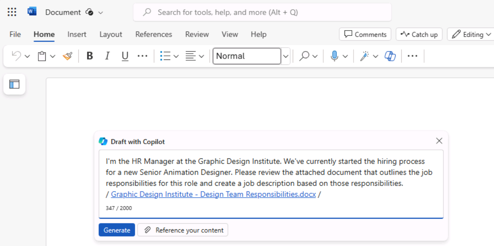

**Laboratorio 07: Empodere a su fuerza de trabajo – Copilot – HR**

**Objetivo:**

Con Copilot para Microsoft 365, los profesionales de RR. HH. pueden
optimizar su flujo de trabajo y mejorar su productividad en los procesos
empresariales fundamentales, como la contratación, la incorporación, la
gestión del rendimiento, el compromiso de los empleados y la gestión del
cumplimiento normativo.

En este laboratorio, utilizará:

- Copilot en Word para crear una descripción de puesto para un nuevo
  puesto.

- Copilot en Word para analizar varios currículos y proporcionar un
  informe que compare las fortalezas y debilidades de cada candidato,
  clasificarlos de más cualificado a menos cualificado y hacer una
  recomendación.

- Copilot en Loop para crear un conjunto de preguntas de entrevista para
  entrevistar a los candidatos para este puesto.

**Ejercicio \#1: Crear una descripción de puesto utilizando Copilot en
Word**

Como gerente de RR. HH. en Graphic Design Institute, ha iniciado el
proceso de contratación de un nuevo diseñador senior de animación. Su
personal ha creado un documento que describe todas las responsabilidades
del puesto. En este ejercicio, utilizará Copilot en Word para crear una
descripción del puesto basada en las responsabilidades del puesto que
figuran en este documento.

1.  Si tiene abierta una pestaña de **Microsoft 365** en el navegador
    Microsoft Edge, selecciónela ahora; de lo contrario, abra una nueva
    pestaña e ingrese la siguiente URL:
    +++[https://www.office.com+++](https://www.office.com+++/) para ir a
    la página de inicio de **Microsoft 365**.

**Nota**: Debe iniciar sesión (si se le solicita) utilizando
las **credenciales de Microsoft 365** proporcionadas en la
pestaña **Resources** a la derecha.

2.  En el panel de navegación de **Microsoft 365**,
    seleccione **OneDrive** para abrirlo.

3.  Navegue hasta la carpeta **C:\LabFiles** para seleccionar y cargar
    una copia del documento **Graphic Design Institute - Design
    Team** en **OneDrive.**

**Consejo**: Abra y cierre el archivo para que aparezca en la lista de
archivos usados recentemente (MRU).

**Nota**: Si ya ha subido todos los recursos del laboratorio a OneDrive
tal y como se sugiere en la sección **Preparación para la ejecución del
laboratorio**, puede omitir este paso.

4.  Si tiene abierta una pestaña de Microsoft 365 en su navegador
    Microsoft Edge, selecciónela ahora; de lo contrario, abra una nueva
    pestaña e ingrese la siguiente
    URL: +++[https://www.office.com+++](https://www.office.com+++/)

5.  En la página de inicio de **Microsoft 365**, seleccione **Microsoft
    Word** y, a continuación, abra un documento en blanco.

6.  En la ventana **Draft with Copilot**, ingrese el siguiente prompt,
    pero no seleccione el botón **Generate** hasta después de vincular
    el archivo de responsabilidades al prompt en el siguiente paso:

+++I'm the HR Manager at the Graphic Design Institute. We've currently
started the hiring process for a new Senior Animation Designer. Please
review the attached document that outlines the job responsibilities for
this role and create a job description based on those
responsibilities.+++ 

7.  Ahora debe adjuntar al prompt el archivo **Graphic Design Institute
    – Design Team Responsabilities.docx** que ha descargado. En la
    ventana **Draft with Copilot**, seleccione el botón **Reference your
    content**. En el menú desplegable que aparece, si el
    archivo **Graphic Design Institute - Design Team
    Responsibilities.docx** aparece en la lista de archivos,
    selecciónelo.

8.  Seleccione **Browse files from cloud**, seleccione el archivo de la
    lista de archivos **Recent** y, a continuación, seleccione el
    botón **Attach**. Si el archivo no aparece en la lista de
    archivos **Recent**, seleccione **My files** en la parte superior
    del panel de navegación de la ventana **Pick a file**, navegue hasta
    la carpeta donde guardó el archivo, seleccione el archivo y, a
    continuación, seleccione **Attach**.

9.  Observe cómo se muestra el archivo en el prompt y
    seleccione **Generate**.

10. Revise el primer borrador del documento con la descripción del
    puesto.

11. Observe que no incluye muchos de los detalles que se encuentran en
    el documento de responsabilidades del puesto. En su lugar,
    proporciona una o dos frases resumidas para cada responsabilidad.
    Para corregir esta deficiencia, ingrese el siguiente prompt y
    seleccione la flecha hacia adelante:

+++While this job description draft is a good start, you failed to
include most of the details found in the job responsibilities document.
Please try again, and this time outline each responsibility area and
select the responsibilities required of a Senior Animation Designer.+++

12. Revise el segundo borrador.

13. Una vez más, considera que Copilot debería proporcionar más
    detalles. Ingrese el siguiente prompt para ver si puede obtener
    información más específica:

+++This job description draft is better, but it still lacks the details
that I'm looking for. The job responsibilities document outlined
detailed responsibilities for each area. Include those details in this
job description. Be as specific as you can.+++

14. Después de revisar los resultados, se le recuerda el dicho "Be
    careful what you wish for". La lista de responsabilidades de este
    tercer borrador es larga; de hecho, quizá demasiado larga para un
    documento de descripción de funciones viable. En este punto, es
    recomendable revisar los borradores anteriores para ver si alguno de
    ellos es preferible a este más extenso. En la ventana Copilot, justo
    encima del campo del prompt, anote el borrador de la versión actual
    del documento. En este caso, está en el borrador 3 de 3. Para
    revisar un borrador anterior, seleccione la flecha hacia atrás (\<)
    para volver al segundo y luego al primer borrador. Utilice las
    flechas hacia adelante (\>) para volver a los últimos borradores.

En este caso, regrese al segundo borrador. Revise nuevamente la lista de
responsabilidades. Aunque no es tan extensa como la lista del tercer
borrador, parece más clara y sigue proporcionando información suficiente
para que un candidato a un puesto de trabajo comprenda lo que se espera
de él en este puesto de diseñador senior de animación. Decide que el
segundo borrador es preferible al borrador final, por lo que opta por
utilizar este. En la ventana Copilot, seleccione el botón **Keep it**.

15. Ya está listo para continuar con este documento de descripción del
    puesto, así que guárdelo en su cuenta de OneDrive con el nombre de
    archivo **Graphic Design Institute - Job descriptions.docx.**

**Nota:** Es importante que guarde este documento, ya que lo utilizará
en el próximo ejercicio.

**Ejercicio \#2: Analizar currículums y hacer una recomendación usando
Copilot en Word**

En el ejercicio anterior, aprendió cómo Copilot en Word puede ayudar a
los profesionales de RR. HH. a redactar una descripción de puesto. En
este ejercicio, aprenderá a automatizar las etapas iniciales del proceso
de selección de curricúlums para identificar rápidamente a los
candidatos más adecuados entre un gran número de solicitantes.

**Nota**: Cuando solicita a Copilot que genere un documento o aplique
algún tipo de cambio, es posible que en ocasiones comience a mostrar el
borrador y luego se detenga. Si se encuentra en esta situación,
seleccione el botón **Regenerate** para que genere un nuevo borrador, o
reformule el prompt e inténtelo de nuevo.

Como gerente de RR. HH. en Graphic Design Institute, ha comenzado a
recibir currículums de posibles candidatos para un nuevo puesto de
diseñador senior de animación, en respuesta a la oferta de empleo
publicada en la web y en el sitio web interno de la empresa. Ahora
utilizará Copilot en Word para examinar un lote de currículums que ha
recibido para el puesto y ofrecer una recomendación sobre los candidatos
que reúnen los requisitos para una entrevista de trabajo.  
Al final del ejercicio anterior, guardó el archivo con la descripción
del puesto que había creado. Se le indicó que guardara el archivo
como **Graphic Design Institute - Job descriptions.docx**. Si lo ha
guardado con un nombre diferente, recuerde el nombre que utilizó para
poder localizar el archivo en este ejercicio.

1.  Si tiene abierta una pestaña de **Microsoft 365** en el navegador
    Microsoft Edge, selecciónela ahora; de lo contrario, abra una nueva
    pestaña e ingrese la siguiente URL:
    +++[https://www.office.com+++](https://www.office.com+++/)

**Nota**: Debe iniciar sesión (si se le solicita) utilizando
las **credenciales de Microsoft 365** proporcionadas en la
pestaña **Resources **a la derecha.

2.  En el panel de navegación de **Microsoft 365**,
    seleccione **OneDrive** para abrirlo.

3.  Acceda a la carpeta **C:\LabFiles** para seleccionar y cargar una
    copia de los siguientes documentos en **OneDrive**,

    - **Resume - Patti Fernandez**

    - **Resume - Nestor Wilke**

    - **Resume - Holly Dickson**

    - **Resume - Alex Wilber** .

**Nota**: Si ya ha subido todos los recursos del laboratorio a OneDrive
tal y como se sugiere en **Preparación para la ejecución del
laboratorio**, puede omitir este paso.

4.  En este ejercicio, accederá a los documentos desde la lista de
    archivos usados recientemente (MRU). Para que los archivos aparezcan
    en la lista MRU, abra cada documento y, a continuación, ciérrelo.
    Abra y cierre cada uno de los cuatro archivos de currículum en su
    OneDrive.

5.  En el panel de navegación de **Microsoft 365**,
    seleccione **Microsoft Word** y, a continuación, abra un nuevo
    documento en blanco.

6.  En la ventana **Draft with Copilot** que aparece en la parte
    superior del documento en blanco, ingrese el siguiente prompt, pero
    no lo envíe todavía. Debe adjuntar los archivos al prompt en el
    siguiente paso:

+++I'm the Hiring Manager for Graphic Design Institute. We're hiring for
the position of Senior Animation Designer. Please create a report that
compares the attached resumes to the requirements for a Senior Animation
Designer in the attached job description file and rank the candidates
from most qualified to least qualified. Thank you!+++

7.  Ahora debe adjuntar al prompt el archivo **Graphic Design
    Institute - Job descriptions.docx** que guardó en su cuenta de
    OneDrive al final del ejercicio anterior. En la ventana **Draft with
    Copilot**, seleccione el botón **Reference your content**. En el
    menú desplegable que aparece, si el archivo de la descripción del
    puesto aparece en la lista de archivos, selecciónelo. De lo
    contrario, seleccione **Browse files from cloud**, localice el
    archivo de descripción del puesto que guardó en su cuenta de
    OneDrive en el ejercicio anterior y, a continuación, seleccione el
    botón **Attach**. Observe cómo se muestra el archivo en el prompt.

8.  Repita el paso anterior para cada uno de los cuatro currículums que
    ha descargado. Observe lo que ocurre cuando intenta adjuntar el
    tercer currículum. Copilot muestra un mensaje indicando que solo
    puede incluir hasta tres archivos en un prompt. Dado que ha tenido
    que incluir el archivo con la descripción del puesto que proporciona
    a Copilot los requisitos del trabajo, solo puede enviar dos de los
    currículums con este prompt inicial.

9.  Dado que ha adjuntado el archivo con la descripción del puesto y los
    dos primeros curricúlums al prompt, seleccione **Generate**. En este
    punto, Copilot extrae la información pertinente del archivo con la
    descripción del puesto y de los dos primeros curricúlums y crea un
    informe de comparación de curricúlums. En este punto, se encuentra
    en el modo borrador de Copilot.

10. Revise los resultados de este primer borrador.

**Nota**: Observe la ventana **Draft with Copilot** y tenga en cuenta
que no incluye un botón **Attach**. Una vez que se encuentra en modo
borrador, como es el caso, Copilot no le permite adjuntar más archivos a
los prompts posteriores. Puede utilizar el campo del prompt para
modificar el documento, pero ya no puede adjuntar otro archivo. Tenga en
cuenta este requisito a medida que avanza en los siguientes pasos. El
borrador actual solo compara los dos primeros currículos. Para comparar
los dos currículos restantes con los dos que se encuentran en el
borrador actual, debe conservar un borrador de este informe y, a
continuación, crear un segundo informe que compare los dos currículums
restantes con el documento que acaba de crear.

11. Ahora está viendo el primer borrador del informe que compara los dos
    primeros curricúlums con el archivo de descripción del puesto.
    Copilot le permite regenerar tantos borradores como desee hasta que
    encuentre uno que le satisfaga. Incluso si considera que este primer
    borrador está bien, seleccione el botón **Regenerate** en la
    ventana **Draft with Copilot** para que Copilot cree un segundo
    borrador.

12. Al regenerar, es posible que aparezca el mensaje de error “Something
    went wrong”. Desconsidere el mensaje e intente regenerar el informe
    comparativo hasta que obtenga el informe regenerado..

13. Revise el segundo borrador creado por Copilot. En la vida real,
    puede repetir este proceso hasta que esté satisfecho con un borrador
    específico. Si desea volver a un borrador anterior para compararlo
    con uno más reciente, seleccione las flechas hacia adelante (\>) y
    hacia atrás (\<) para avanzar y retroceder por los borradores.
    Compare los dos borradores que ha creado y asegúrese de que se
    muestra el que prefiere (será **1 of 2** o **2 of 2**). Cuando
    encuentre el borrador que desea utilizar, seleccione el botón **Keep
    it**.

**Nota**: Al seleccionar **Keep it,** Copilot pasa del modo borrador al
modo normal de Microsoft Word. Además, guarda automáticamente el
documento **Report Comparison** en su cuenta de OneDrive.

14. Ahora está listo para que Copilot revise los dos últimos
    curricúlums. Sin embargo, como se indicó en el paso anterior, debe
    comparar los dos curricúlums restantes con el documento **Report
    Comparison** que acaba de crear y en el que se comparan los dos
    primeros curricúlums. Para ello, debe abrir un nuevo documento de
    Word. Dado que todavía se encuentra en la pestaña **Word** de su
    navegador con el documento **Report Comparison** actual en pantalla,
    seleccione **File** en el menú situado encima de la cinta
    de **Word** y, a continuación, en la página **Home**,
    seleccione **Blank document** en la sección **New**. Al hacerlo, se
    abrirá una nueva pestaña en su navegador junto con un nuevo
    documento de Word.

15. En la ventana **Draft with Copilot**, ingrese el siguiente prompt,
    pero no lo envíe. Debe adjuntar los dos archivos de curricúlums
    restantes y el primer informe **Report Comparison** al prompt en el
    siguiente paso:

+++That was a good start. Please create a report that compares the
attached resumes to the prior resume comparison report (attached) and
rank the candidates from most qualified to least qualified. Thank
you!+++

16. Ahora debe adjuntar el informe que acaba de crear comparando los dos
    primeros curricúlums, junto con los dos restantes. Después de
    introducir el prompt en el paso anterior, seleccione el
    botón **Reference your content** en la ventana **Draft with
    Copilot**. En el menú desplegable que aparece, el documento **Report
    Comparison of Resumes** que ha creado debería aparecer en la parte
    superior de la lista de archivos. Seleccione este documento.

17. En la ventana **Draft with Copilot**, seleccione el
    botón **Reference your content**. En el menú desplegable que
    aparece, debe adjuntar uno de los dos curricúlums restantes. Si ve
    uno de los archivos en la lista de archivos, selecciónelo. De lo
    contrario, seleccione **Browse files from cloud**, localice uno de
    los dos curricúlums restantes (debería verlo si se desplaza por la
    lista de archivos **Recent**), selecciónelo y, a continuación,
    seleccione el botón **Attach**. Repita este proceso para seleccionar
    el último currcúlum restante.

18. Una vez que tenga el primer informe de comparación de informes y los
    dos curricúlums restantes adjuntos al prompt, seleccione el
    botón **Generate** en la ventana **Draft with Copilot**.

**Nota**: Al generar informes comparativos con curricúlums sucesivos, es
posible que aparezca el mensaje de error “Something went wrong”.
Desconsidere el mensaje e intente generar el informe comparativo hasta
que lo obtenga.

19. Copilot debe comparar los dos primeros currúlums y los dos últimos,
    y proporcionar una lista de clasificación de los candidatos. En este
    punto, puede volver a generar un nuevo borrador o solicitar a
    Copilot que realice los cambios necesarios. Para este ejercicio de
    formación, usted decide que está satisfecho con el informe, por lo
    que selecciona el botón **Keep it**.

20. En este punto, Copilot ha generado dos documentos de comparación de
    informes, el segundo de los cuales es el informe final en el que se
    comparan los cuatro candidatos. Tenga presente este escenario si
    debe realizar una tarea similar en el mundo real utilizando Copilot
    en Word. Puede cerrar esta pestaña en el navegador Microsoft Edge.

**Ejercicio \#3: Cree preguntas para una entrevista utilizando Copilot
en Loop**

Con Copilot en Loop, puede crear workspaces y páginas, utilizar la
búsqueda inteligente y plantillas para añadir contenido relevante, y
compartir su trabajo con otras personas. Copilot en Loop puede sugerir
ideas y ayudar a iniciar proyectos, lo que facilita ponerse en marcha
cuando se encuentra bloqueado. Puede redactar borradores de textos,
crear tablas e incluso responder preguntas rápidamente.

Copilot en Loop puede ayudar a los profesionales de RR. HH. en muchos
aspectos de la experiencia de RR. HH., desde el proceso de contratación
hasta la gestión de los empleados, pasando por la gestión de documentos
importantes y las comunicaciones internas.

En este ejercicio, utilizará Copilot en Loop para ayudar en el proceso
de contratación de un nuevo puesto. Mientras que en el ejercicio
anterior utilizó Copilot en Word para seleccionar currículos, en este
utilizará Copilot en Loop para crear una lista de preguntas para las
entrevistas con los mejores candidatos. Durante este ejercicio, podrá
comprobar si Copilot en Loop puede modificar la lista de preguntas según
sus indicaciones.

1.  Si tiene **Microsoft 365** abierto en una pestaña, continúe con el
    siguiente paso. De lo contrario, abra una nueva pestaña en el
    navegador **Microsoft Edge** y, a continuación, ingrese la siguiente
    URL: +++[https://www.office.com+++](https://www.office.com+++/)

2.  En **Microsoft 365**, seleccione **Loop** si aparece en el panel de
    navegación izquierdo. Si no aparece en el panel de navegación,
    seleccione **App Launcher** y, en la página **Apps**, desplácese
    hacia abajo hasta localizar **Loop** y selecciónelo.

3.  Si ve el botón **Sign-in**, inicie sesión con las credenciales de
    usuario.

**Nota**: Después de iniciar sesión, cierre la ventana del navegador
Loop y vuelva a abrir Loop desde la página Apps.

4.  En **Microsoft Loop**, la pestaña **Workspaces** se muestra de forma
    predeterminada. Si desea crear un nuevo workspace para este
    proyecto, seleccione **+** junto a **Getting started** y, a
    continuación, seleccione el botón **+New workspace**.

5.  En la ventana **Create a new workspace**, ingrese **Interview
    questions** como nombre para su workspace y, a continuación,
    seleccione el botón **Continue** o **Create** que aparece
    (dependiendo de su versión de Loop).

6.  En la ventana **Add files to your workspace** (dependiendo de su
    versión de Loop, esta ventana puede aparecer como **Workspace
    Switcher**), seleccione **Create workspace**.

7.  Ahora se encuentra en la primera página de su nuevo workspace. El
    nombre de la página es actualmente **Untitled**. Observe que la
    página (Untitled) también aparece en el panel de navegación de la
    izquierda. En el cuerpo principal de la página, seleccione en el
    campo **Untitled** y cambie el nombre de la página a: **15 interview
    questions for the Senior Animation Designer role**. Observe cómo el
    nombre de la página se actualiza automáticamente en el panel de
    navegación.

8.  En el campo **Just start typing...**, ingrese una barra
    diagonal **(/)**.

9.  En el menú desplegable que aparece, en la sección **Copilot**, en la
    parte superior del menú, seleccione **Draft page content**.

10. En la ventana **Copilot** que aparece, ingrese el siguiente prompt y
    seleccione el icono **Submit**:

++**Create a list of the 15 best interview questions that should be
asked to candidates applying for a new Senior Animation Designer role at
the Graphic Design Institute**.++

**Nota**: En ocasiones, es posible que no vea la ventana **Copilot** con
las opciones Create, Brainstorm, Blueprint y Describe. Si se produce
alguna de estas excepciones, cierre el workspace e inténtelo de nuevo.

11. Revise la lista de preguntas.

12. Considera que esta lista inicial es un buen comienzo, pero observa
    que faltan algunos tipos de preguntas. En el panel Copilot que
    aparece, ingrese el siguiente prompt:

++**Add a question about having failed at a project and what they
learned from it**.++

13. Revise la nueva pregunta que ha creado Loop.

14. Después de revisar la lista por última vez, se da cuenta de que
    incluye pocas o ninguna pregunta sobre liderazgo. Para corregir esta
    situación, ingrese el siguiente prompt:

++**As a Senior Animation Designer, the candidate is expected to lead
their design team on projects. Ask them to talk about a couple of their
most significant experiences in leading other design team members, and
what their leadership style is**.++

15. Observe lo que ha ocurrido en Loop. Cuando solicita un cambio sin
    pedir específicamente que se actualice la página actual, Copilot
    puede abrir una nueva página y realizar el cambio allí en lugar de
    en la página actual, como hizo en el prompt anterior. Cuando lo
    hace, observe cómo en el panel Copilot realiza un seguimiento de los
    prompts, apareciendo el prompt más reciente en la parte superior del
    panel.

Seleccione un prompt anterior. Observe cómo el contenido de la página
aparece en una fuente más clara. Intente también seleccionar el campo
del prompt **Rewrite with Copilot**. Copilot desactiva este campo, ya
que no es la página actual. La página actual también se denomina página
activa. Ahora seleccione el último prompt y observe cómo el contenido es
claro, lo que indica que esta página es la página actual o activa. Solo
puede modificar la página activa, por lo que en esta página puede
seleccionar el campo de prompt **Rewrite with Copilot**.

16. Realicemos un cambio más. No está seguro de si la lista actual de
    preguntas es suficiente. Para mayor seguridad, decide pedirle a
    Copilot en Loop que le recomiende algunas preguntas más. Ingrese el
    siguiente prompt:

++**Are there any other questions that you think should be added to the
list**?++

17. Tenga en cuenta la lista final de preguntas que generó Copilot en
    Loop.

18. Ahora dispone de una amplia variedad de preguntas entre las que
    elegir a la hora de entrevistar a sus candidatos. Y con Loop, sabe
    que el resto de miembros de su equipo de RR. HH. pueden ver estas
    preguntas en tiempo real en el mismo componente de Loop, incluso si
    utilizan diferentes aplicaciones y dispositivos.

**Resumen:**

En este laboratorio, usted:

- Ha creado una descripción del puesto para una nueva función en su
  organización utilizando Copilot en Word.

- Ha analizado varios curricúlums y he generado un informe comparando
  los puntos fuertes y débiles de cada candidato, clasificándolos de más
  cualificados a menos cualificados y haciendo una recomendación
  utilizando Copilot en Word.

- Redactó un conjunto de preguntas para entrevistar a candidatos a un
  puesto de trabajo utilizando Copilot en Loop.
