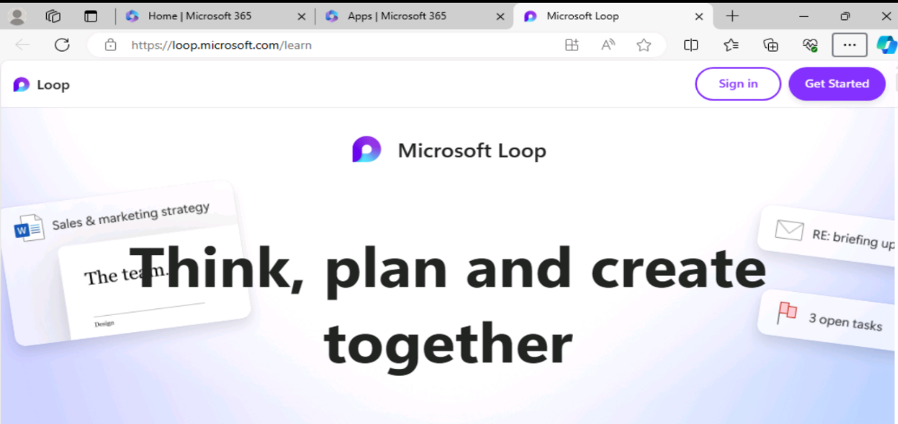
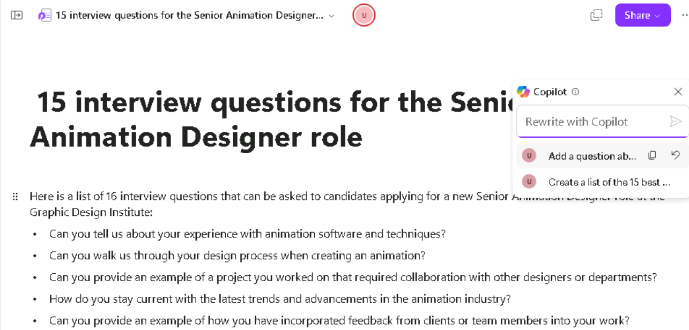

**Laboratório 07: Capacite sua força de trabalho - Copilot - RH**

**Objetivo:**

Com o Copilot for Microsoft 365, os profissionais de RH podem otimizar o
fluxo de trabalho e aumentar a produtividade em seus principais
processos de negócios, como recrutamento, integração, gerenciamento de
desempenho, envolvimento dos funcionários e gerenciamento de
conformidade.

Neste laboratório, você usará:

- Copilot no Word para criar uma descrição de cargo para uma nova
  função.

- Copilot no Word para analisar vários currículos e fornecer um
  relatório comparando os pontos positivos e negativos de cada
  candidato, classificando os candidatos do mais qualificado para o
  menos qualificado e fazendo uma recomendação.

- Copilot in Loop para criar um conjunto de perguntas de entrevista para
  entrevistar candidatos para essa função.

**Exercício 1: Criar uma descrição de cargo usando o Copilot no Word**

Como gerente de RH do Graphic Design Institute, você iniciou o processo
de contratação de um novo designer de animação sênior. Sua equipe criou
um documento que descreve todas as responsabilidades do cargo para essa
função. Neste exercício, você usará o Copilot no Word para criar uma
descrição de cargo com base nas responsabilidades do cargo nesse
documento.

1.  Se você tiver uma guia do **Microsoft 365** aberta no navegador
    Microsoft Edge, selecione-a agora; caso contrário, abra uma nova
    guia e digite a seguinte URL: +++https://www.office.com+++ para
    acessar a página inicial **do Microsoft 365**.

**Observação**: Você precisa fazer login (se solicitado) usando as
**Credenciais do Microsoft 365** fornecidas na guia **Resources** à
direita.

2.  No painel de navegação do **Microsoft 365**, selecione **OneDrive**
    para abri-lo.

3.  Navegue até a pasta **C:\LabFiles** para selecionar e carregar uma
    cópia do documento **Graphic Design Institute - Design Team** no
    **OneDrive**

**Dica**: Abra e feche o arquivo para colocá-lo em sua lista de arquivos
Most Recently Used (MRU) file list.

**Observação**: Se já tiver feito upload de todos os recursos do
laboratório para o OneDrive, conforme sugerido na seção **Preparing for
the lab execution**, você poderá pular esta etapa.

4.  Se você tiver uma guia do Microsoft 365 aberta no navegador
    Microsoft Edge, selecione-a agora; caso contrário, abra uma nova
    guia e insira a seguinte URL: +++https://www.office.com+++

5.  Na página inicial do **Microsoft 365**, selecione **Microsoft Word**
    e abra um documento em branco.

6.  Na janela **Draft with Copilot**, digite o seguinte prompt, mas não
    selecione o botão **Generate** até que você vincule o arquivo de
    responsabilidades ao prompt na próxima etapa:

+++I'm the HR Manager at the Graphic Design Institute. We've currently
started the hiring process for a new Senior Animation Designer. Please
review the attached document that outlines the job responsibilities for
this role and create a job description based on those
responsibilities.+++

7.  Agora você deve anexar ao prompt o arquivo **Graphic Design
    Institute - Design Team Responsibilities.docx** que você baixou. Na
    janela **Draft with Copilot**, selecione o botão **Reference your
    content**. No menu suspenso que aparece, se o arquivo **Graphic
    Design Institute - Design Team Responsibilities.docx** aparecer na
    lista de arquivos, selecione-o.

8.  Selecione **Browse files from cloud**, selecione o arquivo na lista
    de arquivo **Recent** e, em seguida, selecione o botão **Attach**.
    Se o arquivo não aparecer na lista de arquivo **Recent**, selecione
    **My files** na parte superior do painel de navegação na janela
    **Pick a file**, navegue até a pasta onde o arquivo foi armazenado,
    selecione o arquivo e, em seguida, selecione **Attach**.

9.  Observe como o arquivo é exibido no prompt e selecione **Generate**.

10. Revise a primeira versão do documento de descrição do cargo.

11. Você percebe que ele não inclui muitos dos detalhes encontrados no
    documento de responsabilidades do cargo. Em vez disso, ele fornece
    uma ou duas frases resumidas para cada responsabilidade. Para
    corrigir essa falha, digite o prompt a seguir e selecione a seta
    para frente:

+++While this job description draft is a good start, you failed to
include most of the details found in the job responsibilities document.
Please try again, and this time outline each responsibility area and
select the responsibilities required of a Senior Animation Designer.+++ 

12. Revise o segundo rascunho.

13. Novamente, você acha que o Copilot deveria fornecer mais detalhes.
    Digite o prompt a seguir para ver se você consegue que ele seja mais
    específico:

+++This job description draft is better, but it still lacks the details
that I'm looking for. The job responsibilities document outlined
detailed responsibilities for each area. Include those details in this
job description. Be as specific as you can.+++ 

14. Depois de revisar os resultados, você se lembra do ditado: "Cuidado
    com o que você deseja". A lista de responsabilidades nesse terceiro
    rascunho é longa; na verdade, talvez longa demais para um documento
    de descrição de cargo viável. Nesse ponto, você deseja revisar os
    rascunhos anteriores para ver se os primeiros são preferíveis a esse
    mais longo. Na janela Copilot, logo acima do campo de prompt, anote
    o rascunho da versão atual de o documento. Nesse caso, você está no
    rascunho 3 de 3. Para revisar um rascunho anterior, selecione a seta
    para trás (\<) para voltar ao segundo e ao primeiro rascunhos. Use
    as setas para frente (\>) para voltar aos rascunhos mais recentes.

Nesse caso, volte ao segundo rascunho. Revise a lista de
responsabilidades novamente. Embora não seja tão extensa quanto a lista
do terceiro rascunho, ela parece mais limpa e ainda fornece informações
suficientes para que um candidato a emprego entenda o que se espera dele
nessa função de Designer de Animação Sênior. Você decide que o segundo
rascunho é preferível ao rascunho final e, portanto, opta por usá-lo. Na
janela Copilot, selecione o botão **Keep it**.

15. Você está pronto para prosseguir com este documento de descrição de
    cargo, então salve-o em sua conta do OneDrive com o nome de arquivo
    **Graphic Design Institute - Job descriptions.docx.**

**Observação:** É importante que você salve esse documento, pois ele
será usado no próximo exercício.

**Exercício 2: Analisar currículos e fazer uma recomendação usando o
Copilot no Word**

No exercício anterior, você aprendeu como o Copilot no Word pode ajudar
os profissionais de RH a elaborar uma descrição de cargo. Neste
exercício, você aprenderá como automatizar os estágios iniciais do
processo de triagem de currículos para identificar rapidamente os
candidatos mais adequados de grandes grupos de candidatos.

**Observação**: Quando você pede ao Copilot para gerar um documento ou
aplicar algum tipo de alteração, às vezes ele pode começar a exibir o
rascunho e depois parar. Se isso acontecer com você, selecione o botão
**Regenerate** para que ele gere um novo rascunho ou reformule a
solicitação e tente novamente.

Como gerente de RH do Graphic Design Institute, você começou a receber
currículos de prováveis candidatos a um novo cargo de Designer de
Animação Sênior com base na publicação da vaga na Web e no site interno
de funcionários da empresa. Agora você usará o Copilot no Word para
selecionar um lote de currículos que recebeu para a função e fornecerá
uma recomendação sobre qual dos candidatos se qualifica para uma
entrevista de emprego.

No final do exercício anterior, você salvou o arquivo de descrição do
cargo que criou. Você foi instruído a salvar o arquivo como **Graphic
Design Institute - Job descriptions.docx**. Se ele for salvo com um nome
de arquivo diferente, lembre-se do nome que você usou para poder
localizar o arquivo neste exercício.

1.  Se você tiver uma guia do **Microsoft 365** aberta no navegador
    Microsoft Edge, selecione-a agora; caso contrário, abra uma nova
    guia e digite a seguinte URL: +++https://www.office.com+++

**Observação**: Você precisa fazer login (se solicitado) usando as
**Credenciais do Microsoft 365** fornecidas na guia **Resource** à
direita.

2.  No painel de navegação do **Microsoft 365**, selecione **OneDrive**
    para abri-lo.

3.  Navegue até a pasta **C:\LabFiles** para selecionar e carregar uma
    cópia dos seguintes documentos no **OneDrive**,

    - **Resume - Patti Fernandez **

    - **Resume - Nestor Wilke **

    - **Resume - Holly Dickson **

    - **Resume - Alex Wilber**.

**Observação**: Se você já tiver feito upload de todos os recursos do
laboratório para o OneDrive, conforme sugerido em **Preparing for the
lab execution**, poderá pular esta etapa.

4.  Neste exercício, você acessa os documentos da lista de arquivos Most
    Recently Used (MRU). Para que os arquivos apareçam na lista MRU,
    abra cada documento e, em seguida, feche-o. Abra e feche cada um dos
    quatro arquivos de currículo em seu OneDrive.

5.  No painel de navegação do **Microsoft 365**, selecione **Microsoft
    Word** e abra um novo documento em branco.

6.  Na janela **Draft with Copilot** que aparece na parte superior do
    documento em branco, digite o seguinte prompt, mas não envie o
    prompt ainda. Você deve anexar os arquivos ao prompt na próxima
    etapa:

+++I'm the Hiring Manager for Graphic Design Institute. We're hiring for
the position of Senior Animation Designer. Please create a report that
compares the attached resumes to the requirements for a Senior Animation
Designer in the attached job description file and rank the candidates
from most qualified to least qualified. Thank you!+++

7.  Agora você deve anexar ao prompt o arquivo **Graphic Design
    Institute - Job descriptions.docx** que salvou na sua conta do
    OneDrive no final do exercício anterior. Na janela **Draft with
    Copilot**, selecione o botão **eference your content**. No menu
    suspenso que aparece, se o arquivo de descrição do cargo aparecer na
    lista de arquivos, selecione-o. Caso contrário, selecione **Browse
    files from cloud**, localize o arquivo de descrição do trabalho que
    você salvou em sua conta do OneDrive no exercício anterior e, em
    seguida, selecione o botão **Attach**. Observe como o arquivo é
    exibido no prompt.

8.  Repita a etapa anterior para cada um dos quatro currículos que você
    baixou. Observe o que acontece quando você tenta anexar o terceiro
    currículo. O Copilot exibe uma mensagem indicando que você só pode
    incluir até três arquivos em um prompt. Como você teve que incluir o
    arquivo de descrição do cargo que fornece ao Copilot os requisitos
    do cargo, você só pode enviar dois dos currículos com esse prompt
    inicial.

9.  Como você anexou o arquivo de descrição do cargo e os dois primeiros
    currículos ao prompt, selecione **Generate**. Nesse momento, o
    Copilot extrai as informações pertinentes do arquivo de descrição do
    cargo e dos dois primeiros currículos e cria um relatório de
    Comparação de Currículos. Nesse ponto, você está no modo de rascunho
    do Copilot.

10. Analise os resultados desse primeiro rascunho.

**Observação**: dê uma olhada na janela **Draft with Copilot** e observe
que ela não inclui um botão **Attach**. Quando estiver no modo de
rascunho, como está atualmente, o Copilot não permitirá que você anexe
mais arquivos aos prompts subsequentes. Você pode usar o campo de prompt
para modificar o documento , mas não pode mais anexar outro arquivo.
Tenha esse requisito em mente ao prosseguir com as próximas etapas. Este
rascunho atual compara apenas os dois primeiros currículos. Para
comparar os dois currículos restantes com os dois que estão no rascunho
atual, você deve manter um rascunho desse relatório e, em seguida, criar
um segundo relatório que compare os dois currículos restantes com o
documento que você acabou de criar.

11. Agora você está vendo o primeiro rascunho do relatório que compara
    os dois primeiros currículos com o arquivo de descrição do cargo. O
    Copilot permite que você gere novamente quantos rascunhos quiser até
    encontrar um que seja de sua preferência. Mesmo que você ache que
    esse primeiro rascunho está bom, selecione o botão **Regenerate** na
    janela **Draft with Copilot** para que o Copilot crie um segundo
    rascunho.

12. Ao gerar novamente, você pode se deparar com a mensagem de erro
    "Something went wrong". Ignore e tente gerar novamente o relatório
    de comparação até obter o relatório gerado novamente.

13. Revise o segundo rascunho que o Copilot criou. No mundo real, você
    pode repetir esse processo até ficar satisfeito com um rascunho
    específico. Se quiser voltar a um rascunho anterior para compará-lo
    com um rascunho mais recente, selecione as setas para frente (\>) e
    para trás (\<) para ir e voltar pelos rascunhos. Compare os dois
    rascunhos que você criou e verifique se o que você prefere é exibido
    (será **1 de 2** ou **2 de 2**). Quando encontrar um rascunho que
    deseja usar, selecione o botão **Keep it (Manter)**.

**Observação**: Quando você seleciona **Keep it (Manter)**, o Copilot
passa do modo de rascunho para o modo normal do Microsoft Word. Ele
também salva automaticamente o documento **Comparação de relatórios** em
sua conta do OneDrive.

14. Agora você está pronto para que o Copilot revise os dois últimos
    currículos. Entretanto, conforme indicado na etapa anterior, você
    deve comparar os dois currículos restantes com o documento **Report
    Comparison**que acabou de criar e que comparou os dois primeiros
    currículos. Para fazer isso, você deve abrir um novo documento do
    Word. Como você ainda está na guia **Word** do navegador com o
    documento atual **Report Comparison** sendo exibido, selecione
    **File** no menu acima da faixa de opções do **Word** e, na **página
    inicial**, selecione **Blank document **na seção **New**. Isso abre
    uma nova guia no navegador, juntamente com um novo documento do
    Word.

15. Na janela **Draft with Copilot**, digite o seguinte prompt, mas não
    o envie. Você deve anexar os dois arquivos de currículo restantes e
    o primeiro relatório **Report Comparison** ao prompt na próxima
    etapa:

+++That was a good start. Please create a report that compares the
attached resumes to the prior resume comparison report (attached) and
rank the candidates from most qualified to least qualified. Thank
you!+++ 

16. Agora você deve anexar o relatório que acabou de criar e que
    comparou os dois primeiros currículos, juntamente com os dois
    currículos restantes. Após inserir o prompt na etapa anterior,
    selecione o botão **Reference your content** na janela **Draft with
    Copilot**. No menu suspenso que aparece, o documento **Report
    Comparison of Resumes** que você criou deve aparecer no topo da
    lista de arquivos. Selecione esse documento.

17. Na janela **Draft with Copilot**, selecione o botão **Reference your
    content**. No menu suspenso que aparece, você precisa anexar um dos
    dois currículos restantes. Se você vir um dos arquivos na lista de
    arquivos, selecione-o. Caso contrário, selecione **Browse files from
    cloud**, localize um dos dois currículos restantes (você deverá
    vê-lo se percorrer a lista de arquivos **Recents**), selecione-o e,
    em seguida, selecione o botão **Attach**. Repita esse processo para
    selecionar o último currículo restante.

18. Depois de ter o primeiro relatório Report Comparison e os dois
    currículos restantes anexados ao prompt, selecione o botão
    **Generate** na janela **Draft with Copilot**.

**Observação**: Ao gerar relatórios de comparação com currículos
sucessivos, você pode se deparar com a mensagem de erro "Algo deu
errado". Ignore e tente gerar o relatório de comparação até obter o
relatório.

19. O Copilot deve comparar os dois primeiros currículos e os dois
    últimos currículos e fornecer uma lista de classificação dos
    candidatos. Nesse ponto, você pode gerar novamente um novo rascunho
    ou pedir ao Copilot que faça alterações. Para este exercício de
    treinamento, você decidiu que está satisfeito com o relatório,
    portanto, selecione o botão **Keep it**.

20. Nesse ponto, o Copilot gerou dois documentos de comparação de
    relatórios, sendo o segundo o relatório final que compara os quatro
    candidatos. Tenha esse cenário em mente se precisar fazer algo
    semelhante no mundo real usando o Copilot no Word. Você pode fechar
    essa guia em seu navegador Microsoft Edge.

**Exercício 3: Criar perguntas de entrevista usando o Copilot in Loop**

Com o Copilot in Loop, você pode criar espaços de trabalho e páginas,
usar a pesquisa inteligente e modelos para adicionar conteúdo relevante
e compartilhar seu trabalho com outras pessoas. O Copilot in Loop pode
sugerir ideias e ajudar a iniciar projetos, facilitando o andamento
quando você se encontra preso. Ele pode redigir textos, criar tabelas e
até mesmo responder a perguntas rapidamente.

O Copilot in Loop pode ajudar os profissionais de RH em muitos aspectos
da experiência de RH, desde o processo de contratação até o
gerenciamento de funcionários, o manuseio de documentos importantes e o
gerenciamento de comunicações internas.

Neste exercício, você usará o Copilot in Loop para ajudar no processo de
contratação para uma nova função. Embora tenha usado o Copilot in Word
no exercício anterior para selecionar currículos, você usará o Copilot
in Loop para criar uma lista de perguntas de entrevista para os melhores
candidatos. Durante este exercício, você pode verificar se o Copilot in
Loop pode alterar a lista de perguntas com base em sua orientação.

1.  Se você tiver o **Microsoft 365** aberto em uma guia, prossiga para
    a próxima etapa. Caso contrário, abra uma nova guia no navegador
    **Microsoft Edge** e insira a seguinte URL:
    +++https://www.office.com+++

2.  No **Microsoft 365**, selecione **Loop** se ele aparecer no painel
    de navegação à esquerda. Se ele não aparecer no painel de navegação,
    selecione o **App Launcher** e, na página **Apps**, role para baixo
    até localizar o **Loop** e, em seguida, selecione-o.

3.  Se você vir o botão **Sign-in**, faça o login usando as credenciais
    de usuário.

**Observação**: depois de fazer login, feche a janela do navegador do
Loop e abra novamente o Loop na página Aplicativos.

4.  No **Microsoft Loop**, a guia **Workspaces** é exibida por padrão.
    Se quiser criar um novo workspace para este projeto, selecione**+**
    ao lado de **Getting started** e, em seguida, selecione o botão
    **+New workspace**.

5.  Na janela **Create a new workspace**, digite **Interview questions**
    para o nome do workspace e, em seguida, selecione o botão
    **Continue** ou **Create** que aparece (dependendo da versão do
    Loop).

6.  Na janela **Add files to your workspace** (dependendo da sua versão
    do Loop, essa janela pode chamada **Workspace Switcher**), selecione
    **Create workspace**.

7.  Agora você está na primeira página do seu novo workspace. No
    momento, o nome da página é **Untitled**. Observe que a página
    (Untitled) também aparece no painel de navegação à esquerda. No
    corpo principal da página, selecione no campo **Untitled** e altere
    o nome da página para: **15 interview questions for the Senior
    Animation Designer role**. Observe como o nome da página é
    atualizado automaticamente no painel de navegação.

8.  No campo **Just start typing...** digite uma barra **(/)**.

9.  No menu suspenso que aparece, na seção **Copilot** na parte superior
    do menu, selecione **Draft page content**.

10. Na janela do **Copilot** que aparece, digite o seguinte prompt e
    selecione o ícone **Submit**:

++**Create a list of the 15 best interview questions that should be
asked to candidates applying for a new Senior Animation Designer role at
the Graphic Design Institute**.++ 

**Observação**: Às vezes, você pode não ver a janela do **Copilot** com
as opções Create, Brainstorm, Blueprint e Describe. Se estiver
enfrentando essas exceções, feche o workspace e tente novamente.

11. Revise a lista de perguntas.

12. Você acha que essa lista inicial é um bom começo, mas percebe que
    alguns tipos de perguntas estão faltando. No painel do Copilot que
    aparece, digite o seguinte prompt:

++**Add a question about having failed at a project and what they
learned from it**.++ 

13. Revise a nova pergunta que o Loop criou.

14. Depois de examinar a lista uma última vez, você percebe que ela
    inclui poucas ou nenhuma pergunta sobre liderança. Para corrigir
    essa situação, digite o seguinte prompt:

++**As a Senior Animation Designer, the candidate is expected to lead
their design team on projects. Ask them to talk about a couple of their
most significant experiences in leading other design team members, and
what their leadership style is**.++ 

15. Observe o que aconteceu no Loop. Quando você solicita uma alteração
    sem pedir explicitamente para atualizar a página atual, o Copilot
    pode abrir uma nova página e realizar a alteração ali, em vez de
    modificar diretamente a página atual, como ocorreu no prompt
    anterior. Quando ele fizer isso, observe como, no painel do Copilot,
    ele rastreia os avisos, com o aviso mais recente aparecendo na parte
    superior do painel.

Selecione um prompt anterior. Observe como o conteúdo da página aparece
em uma fonte mais clara. Tente também selecionar o campo de prompt
**Rewrite with Copilot**. O Copilot desativa esse campo, pois não se
trata da página ativa. A página atual também é chamada de página ativa.
Selecione o último prompt e observe como o conteúdo está nítido,
indicando que esta é a página ativa. Você só pode alterar a página
ativa, e é por isso que, nessa página, você pode selecionar o campo de
prompt **Rewrite with Copilot**.

16. Vamos fazer mais uma alteração. Você não tem certeza de que a lista
    atual de perguntas é suficiente. Por segurança, você decide pedir ao
    Copilot in Loop que recomende mais algumas perguntas. Digite o
    prompt a seguir:

++**Are there any other questions that you think should be added to the
list**?++ 

17. Observe a lista final de perguntas que o Copilot in Loop gerou.

18. Agora você tem uma grande variedade de perguntas para escolher ao
    entrevistar seus candidatos. E com o Loop, você sabe que outras
    pessoas da sua equipe de RH podem ver essas perguntas em tempo real
    no mesmo componente do Loop, mesmo que estejam usando aplicativos e
    dispositivos diferentes.

**Resumo:**

Neste laboratório, você:

- Criou uma descrição de cargo para uma nova função em sua organização
  usando o Copilot no Word.

- Analisou vários currículos e gerou um relatório comparando os pontos
  positivos e negativos de cada candidato, classificou os candidatos do
  mais qualificado para o menos qualificado e fez uma recomendação
  usando o Copilot no Word.

- Elaborou um conjunto de perguntas de entrevista para entrevistar
  candidatos a um cargo usando o Copilot in Loop.
