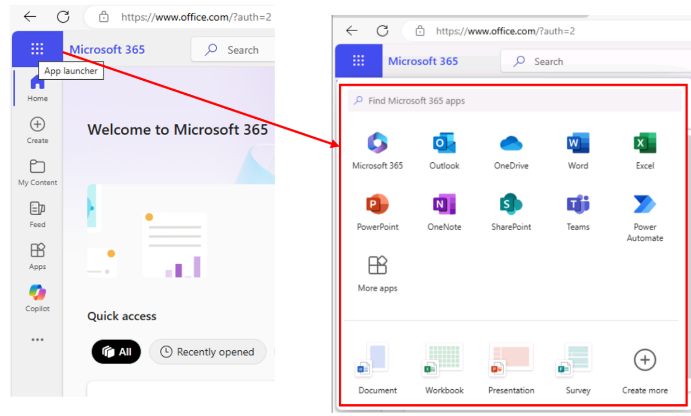
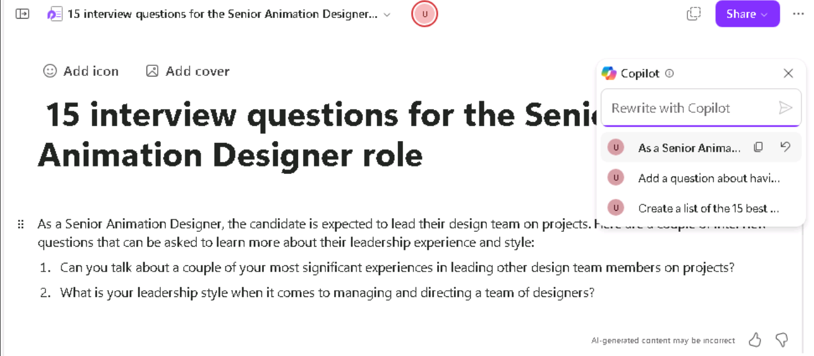

**ラボ 07: 従業員のエンパワーメント – Copilot – HR**

**目的:**

Copilot for Microsoft 365
を使用すると、人事担当者は採用、オンボーディング、パフォーマンス管理、従業員エンゲージメント、コンプライアンス管理といったコアビジネスプロセスにおけるワークフローを効率化し、生産性を向上させることができます。

このラボでは、以下のツールを使用します。

• Word で Copilot を使用して、新しい職種の職務記述書を作成します。

• Word で Copilot
を使用して、複数の履歴書を分析し、各候補者の長所と短所を比較したレポートを作成し、最も適格な候補者から最も適格でない候補者までをランク付けして、候補者を推薦します。

• Loop で Copilot
を使用して、この職種の候補者を面接するための一連の質問を作成します。

演習 1: Word で Copilot を使用して職務記述書を作成します

Graphic Design Institute
の人事マネージャーとして、あなたは新しいシニアアニメーションデザイナーの採用プロセスを開始しました。スタッフは、この職種のすべての職務責任を概説したドキュメントを作成しました。この演習では、Word
で Copilot
を使用して、このドキュメントに記載されている職務責任に基づいて職務記述書を作成します。

1\. Microsoft Edge ブラウザーで Microsoft 365
タブを開いている場合は、今すぐ選択します。そうでない場合は、新しいタブを開き、次の
URL を入力します: +++https://www.office.com+++ で Microsoft 365
ホームページに移動します。

注: サインインを求められた場合は、右側の \[リソース\] タブに表示される
Microsoft 365 資格情報を使用してサインインする必要があります。

2\. Microsoft 365 ナビゲーション ウィンドウで、\[OneDrive\]
を選択して開きます。

3\. C:\LabFiles フォルダーを参照し、Graphic Design Institute - Design
Team ドキュメントのコピーを選択して OneDrive にアップロードします。

ヒント: ファイルを開いて閉じると、最近使用したファイル (MRU)
リストに追加されます。

注: 「Preparing for the lab
execution」セクションで推奨されているように、ラボアセットをすべて
OneDrive にアップロード済みの場合は、この手順を省略できます。

4\. Microsoft Edge ブラウザーで Microsoft 365
タブを開いている場合は、ここで選択します。開いていない場合は、新しいタブを開いて次の
URL を入力します: +++https://www.office.com+++

5\. Microsoft 365 のホームページで Microsoft Word
を選択し、空白のドキュメントを開きます。

6\. 「Draft with
Copilot」ウィンドウで次のプロンプトを入力します。ただし、次の手順で職務内容ファイルをプロンプトにリンクするまで、\[Generate\]
ボタンは選択しないでください。

+++私はグラフィックデザイン研究所の人事マネージャーです。現在、新しいシニアアニメーションデザイナーの採用プロセスを開始しています。この役職の職務内容を概説した添付ドキュメントを確認し、それらの職務内容に基づいて職務記述書を作成してください。+++

7\. ダウンロードした Graphic Design Institute - Design Team
Responsibilities.docx
ファイルをプロンプトに添付する必要があります。「Draft with
Copilot」ウィンドウで、「Reference your
content」ボタンを選択します。表示されるドロップダウン
メニューで、ファイルの一覧に Graphic Design Institute - Design Team
Responsibilities.docx ファイルが表示されている場合は、それを選択します。

8\. 「Browse files from
cloud」を選択し、「最近使用したファイル」リストからファイルを選択して、「Attach」ボタンを選択します。ファイルが「最近使用したファイル」リストに表示されない場合は、「ファイルを選択」ウィンドウのナビゲーション
ウィンドウの上部にある「My
Files」を選択し、ファイルを保存したフォルダーに移動してファイルを選択し、「Attach」を選択します。

9\.
プロンプトにファイルがどのように表示されるかを確認し、「Generate」を選択します。

10\.
職務記述書の初稿を確認します。

11\.
職務内容説明書に記載されている詳細の多くが記載されていないことに気付きました。代わりに、各職務について1～2文の要約が記載されています。この欠点を修正するには、次のプロンプトを入力し、進む矢印を選択してください。

+++この職務内容説明書の草稿は良いスタートですが、職務内容説明書に記載されている詳細のほとんどが記載されていません。もう一度試して、今度は各職務分野の概要を説明し、シニアアニメーションデザイナーに求められる職務を選択してください。+++

12\. 2
回目のドラフトを確認します。

13\. 再び、Copilot
にはもっと詳細な情報を提供してほしいと感じています。次のプロンプトを入力して、より具体的な情報を提供できるかどうか確認してみましょう。

+++この職務記述書の草稿は改善されましたが、まだ私が求めている詳細が不足しています。職務内容文書には、各領域の詳細な責任が概説されています。これらの詳細をこの職務記述書に含めてください。できるだけ具体的に記述してください。+++

14\. 結果を確認した後、「Be careful what you wish
for」ということわざを思い出しました。この3番目の草稿の責任リストは長く、実際、実用的な職務記述書としては長すぎるかもしれません。この時点で、以前の草稿を確認し、以前の草稿の方がこの長い草稿よりも優れているかどうかを確認しましょう。Copilot
ウィンドウのプロンプトフィールドのすぐ上に、現在のバージョンの文書の草稿が表示されます。この場合、3番目の草稿です。以前の草稿を確認するには、前向き矢印
(\<)
を選択して2番目の草稿、そして1番目の草稿に戻ります。最新の下書きに戻るには、前向きの矢印
(\>)
を使用します。

この場合は、第2稿に戻って職務内容のリストを再度確認してください。第3稿ほど詳細ではありませんが、より簡潔な内容で、求職者がこのシニアアニメーションデザイナーの職種で期待される役割を理解するのに十分な情報を提供しています。最終稿よりも第2稿の方が望ましいと判断し、この第2稿を使用することにしました。Copilotウィンドウで「Save」ボタンを選択します。

15\. この職務記述書の作成準備が整いましたので、「Graphic Design
Institute - Job
descriptions.docx」というファイル名でOneDriveアカウントに保存してください。

注: このドキュメントは次の演習で使用するため、必ず保存してください。

演習 2: Word で Copilot を使用して履歴書を分析し、推奨事項を作成する

前の演習では、Word で Copilot
を使用して人事担当者が職務記述書を作成する方法を学びました。この演習では、履歴書の選考プロセスの初期段階を自動化し、多数の応募者の中から最適な候補者を迅速に特定する方法を学びます。

注: Copilot
にドキュメントの生成や何らかの変更を指示すると、下書きの表示が始まってから停止することがあります。このような状況になった場合は、「Regenerate」ボタンをクリックして新しい下書きを生成するか、プロンプトの文言を変更して再試行してください。

> Graphic Design Institute の人事マネージャーとして、Web
> 上の求人情報と社内の従業員向け Web
> サイトに基づき、シニアアニメーションデザイナーの新規採用候補者から履歴書を受け取り始めました。Word
> の Copilot
> を使用して、この職種に応募した履歴書を一括で審査し、どの候補者が面接に適任かを推薦します。
>
> 前回の演習の最後に、作成した職務記述書ファイルを保存しました。ファイルは「Graphic
> Design Institute - Job
> descriptions.docx」という名前で保存するように指示されています。別のファイル名で保存した場合は、この演習でファイルを見つけられるように、使用した名前を覚えておいてください。
>
> 1\. Microsoft Edge ブラウザーで Microsoft 365
> タブを開いている場合は、ここでそれを選択します。開いていない場合は、新しいタブを開き、次の
> URL を入力します: +++https://www.office.com+++
>
> 注: サインインを求められた場合は、右側の \[Resources\]
> タブに表示される Microsoft 365
> 資格情報を使用してサインインする必要があります。
>
> 2\. Microsoft 365 のナビゲーション ウィンドウで、OneDrive
> を選択して開きます。
>
> 3\. C:\Lab Files
> フォルダーを参照して、次のドキュメントのコピーを選択し、OneDrive
> にアップロードします。

- **Resume - Patti Fernandez**

- **Resume - Nestor Wilke**

- **Resume - Holly Dickson**

- **Resume - Alex Wilber** .

注: 「Preparing for the lab
execution」で示されているように、ラボのすべてのアセットを既に OneDrive
にアップロードしている場合は、この手順を省略できます。

4\. この演習では、最近使用したファイル (MRU)
リストからドキュメントにアクセスします。ファイルを MRU
リストに表示するには、各ドキュメントを開いてから閉じます。OneDrive
にある 4 つの履歴書ファイルをそれぞれ開いて閉じます。

5\. Microsoft 365 のナビゲーション ウィンドウで、Microsoft Word
を選択し、新しい空白のドキュメントを開きます。

6\. 空白のドキュメントの上部に表示される「Draft with
Copilot」ウィンドウで、次のプロンプトを入力します。ただし、まだプロンプトを送信しないでください。次の手順で、プロンプトにファイルを添付する必要があります。

+++Graphic Design Institute の採用マネージャーです。シニア
アニメーション
デザイナーのポジションを募集しています。添付の​​履歴書と、添付の求人情報ファイルに記載されているシニア
アニメーション
デザイナーの要件を比較し、候補者を最も適格なものから最も適格でないものの順にランク付けするレポートを作成してください。よろしくお願いいたします。+++

7\. 前回の演習の最後に OneDrive アカウントに保存した Graphic Design
Institute - Job descriptions.docx
ファイルをプロンプトに添付する必要があります。「Draft with
Copilot」ウィンドウで、「Reference your
content」ボタンを選択します。表示されるドロップダウン
メニューで、ファイルの一覧に職務記述書ファイルが表示されている場合はそれを選択します。表示されていない場合は、「Browse
files from cloud」を選択し、前回の演習で OneDrive
アカウントに保存した職務記述書ファイルを見つけて、「Attach」ボタンを選択します。プロンプトにファイルがどのように表示されるかに注意してください。

8\. ダウンロードした 4
つの履歴書それぞれについて、前の手順を繰り返します。3
つ目の履歴書を添付しようとすると何が起こるかに注意してください。Copilot
は、プロンプトに含めることができるファイルは 3
つまでであることを示すメッセージを表示します。Copilot
に職務要件を提供する職務記述書ファイルを含める必要があったため、この最初のプロンプトでは
2
つの履歴書のみを送信できます。

9\.
求人情報ファイルと最初の2つの履歴書をプロンプトに添付したので、「生成」を選択します。この時点で、Copilot
は求人情報ファイルと最初の2つの履歴書から関連情報を抽出し、履歴書比較レポートを作成します。この時点で、Copilot
の下書きモードになっています。

10\.
この最初の下書きの結果を確認します。

注: 「Draft with
Copilot」ウィンドウを見ると、「Attach」ボタンがないことにご注意ください。現在のようにドラフトモードになると、Copilot
では後続のプロンプトにファイルを添付できなくなります。プロンプトフィールドを使用してドキュメントを変更することはできますが、他のファイルを添付することはできません。次の手順に進む際は、この要件に留意してください。現在のドラフトでは、最初の
2 つの履歴書のみが比較されます。残りの 2
つの履歴書を現在のドラフトにある 2
つの履歴書と比較するには、このレポートのドラフトを保存し、残りの 2
つの履歴書と先ほど作成したドキュメントを比較する 2
つ目のレポートを作成する必要があります。

11\. 現在、最初の 2
つの履歴書と求人情報ファイルを比較するレポートの最初のドラフトが表示されています。Copilot
では、満足のいくドラフトが見つかるまで、何度でもドラフトを再生成できます。最初のドラフトに問題がない場合は、「Draft
with Copilot」ウィンドウの「Regenerate」ボタンを選択して、Copilot に 2
つ目のドラフトを作成させてください。

12\. 再生成時に「Something went
wrong」というエラーメッセージが表示される場合があります。このエラーメッセージを無視し、比較レポートを再生成して、再生成されたレポートが表示されるまで繰り返してください。

13\. Copilot
が作成した2番目の下書きを確認します。実際には、特定の下書きに満足するまでこのプロセスを繰り返すことができます。以前の下書きに戻って最近の下書きと比較したい場合は、前向き矢印
(\>) と後ろ向き矢印 (\<)
を選択して下書きを前後に移動します。作成した2つの下書きを比較し、希望する下書きが表示されていることを確認します
(1/2 または 2/2
のいずれかになります)。使用したい下書きが見つかったら、「保存」ボタンを選択します。

注: 「Keep it」を選択すると、Copilot は下書きモードから通常の Microsoft
Word モードに切り替わります。また、レポート比較ドキュメントが OneDrive
アカウントに自動的に保存されます。

14\. これで、Copilot で最後の 2
つの履歴書をレビューする準備が整いました。ただし、前の手順で説明したように、残りの
2 つの履歴書を、先ほど作成した最初の 2
つの履歴書を比較したレポート比較ドキュメントと比較する必要があります。そのためには、新しい
Word 文書を開く必要があります。ブラウザの Word
タブに現在のレポート比較ドキュメントが表示されているため、Word
リボンの上にあるメニューで \[File\] を選択し、ホーム ページで \[New\]
セクションの \[Blank document\]
を選択します。これにより、ブラウザの新しいタブと新しい Word
文書が開きます。

15\. 「Draft with
Copilot」ウィンドウで、次のプロンプトを入力しますが、送信はしないでください。次の手順で、残りの
2
つの履歴書ファイルと最初のレポート比較レポートをプロンプトに添付する必要があります。

+++良いスタートですね。添付の履歴書と以前の履歴書比較レポート（添付）を比較し、候補者を最も適格なものから最も適格でないものの順にランク付けするレポートを作成してください。ありがとうございます！+++

16\.
最初の2つの履歴書を比較した、先ほど作成したレポートと残りの2つの履歴書を添付してください。前の手順でプロンプトを入力した後、「Draft
with Copilot」ウィンドウで「Reference your
content」ボタンを選択します。表示されるドロップダウンメニューで、作成した「Report
Comparison」ドキュメントがファイルリストの一番上に表示されます。このドキュメントを選択してください。

17\. 「Draft with Copilot」ウィンドウで「Reference your
content」ボタンを選択します。表示されるドロップダウンメニューで、残りの2つの履歴書のいずれかを添付する必要があります。ファイルリストにいずれかのファイルが表示されている場合は、それを選択します。表示されない場合は、「Browse
files from
cloud」を選択し、残りの2つの履歴書のいずれか（「最近使用したファイル」リストをスクロールすると表示されます）を見つけて選択し、「添付」ボタンを選択します。このプロセスを繰り返して、残りの最後の履歴書を選択します。

18\.
最初のレポート比較レポートと残りの2つの履歴書をプロンプトに添付したら、「Draft
with Copilot」ウィンドウの「Generate」ボタンを選択します。

注: 連続する履歴書で比較レポートを生成する際に、「Something went
wrong」というエラーメッセージが表示される場合があります。このエラーメッセージを無視し、レポートが生成されるまで比較レポートの生成を試行してください。

19\.
Copilotは最初の2つの履歴書と最後の2つの履歴書を比較し、候補者の順位表を作成します。この時点で、新しい下書きを再生成するか、Copilotに修正を依頼することができます。このトレーニング演習では、レポートに満足しているため、「Keep
it」ボタンを選択します。

19\. この時点で、Copilot は 2
つのレポート比較ドキュメントを生成しました。2 つ目のドキュメントは、4
人の候補者全員を比較した最終レポートです。Word で Copilot
を使用して実際に同様の作業を行う必要がある場合は、このシナリオを念頭に置いてください。Microsoft
Edge ブラウザでこのタブを閉じることができます。

演習 3: Copilot in Loop を使用して面接の質問を作成する

Copilot in Loop
を使用すると、ワークスペースとページを作成し、インテリジェント検索とテンプレートを使用して関連コンテンツを追加し、他のユーザーと作業内容を共有できます。Copilot
in Loop
はアイデアを提案し、プロジェクトの開始を支援するため、行き詰まった場合でも簡単に作業を開始できます。テキストの下書き、表の作成、さらには質問への迅速な回答も可能です。

Copilot in Loop
は、採用プロセスから従業員管理、重要文書の取り扱い、社内コミュニケーションの管理まで、人事担当者の人事業務のさまざまな側面を支援します。

この演習では、Copilot in Loop
を使用して、新しい役職の採用プロセスを支援します。前回の演習ではWordのCopilotを使って履歴書をスクリーニングしましたが、今回はLoopのCopilotを使って、優秀な候補者の面接質問リストを作成します。この演習では、LoopのCopilotが指示に基づいて質問リストを修正できるかどうかを確認します。.

1\. Microsoft 365
をタブで開いている場合は、次の手順に進みます。そうでない場合は、Microsoft
Edge ブラウザーで新しいタブを開き、次の URL を入力します:
+++https://www.office.com+++

2\. Microsoft 365 で、左側のナビゲーション
ウィンドウに「Loop」が表示されている場合は選択します。ナビゲーション
ウィンドウに表示されない場合は、「App
Launcher」を選択し、「Apps」ページで下にスクロールして「Loop」を見つけて選択します。

3\. \[Sign in\]
ボタンが表示されたら、ユーザー資格情報を使用してサインインします。

注: サインイン後、Loop ブラウザウィンドウを閉じ、アプリページから再度
Loop を開いてください。

4\. Microsoft Loop
では、デフォルトで「Workspaces」タブが表示されます。このプロジェクト用に新しいワークスペースを作成するには、「Getting
started」の横にある「+」を選択し、「+ New
workspace」ボタンを選択します。

5\. 「Create a new
workspace」ウィンドウで、ワークスペース名に「Interview
questions」と入力し、表示される「Continue」または「Create」ボタンを選択します（Loop
のバージョンによって異なります）。

6\. 「Add files to your workspace」ウィンドウ（Loop
のバージョンによっては「Workspace
Switcher」と表示される場合があります）で、「Create
workspace」を選択します。

7\.
これで、新しいワークスペースの最初のページが表示されます。ページの名前は現在「Untitled」です。ページ（「Untitled」）は左側のナビゲーションペインにも表示されます。ページのメインボディで、「Untitled」フィールドを選択し、ページ名を「15
interview questions for the Senior Animation Designer
role」に変更します。ナビゲーションペインでページ名が自動的に更新されることに注意してください。

8\. 「Just start typing...」フィールドにスラッシュ (/)
を入力します。

9\.
表示されるドロップダウンメニューの、メニュー上部にある「Copilot」セクションで、「Draft
page content」を選択します。

10\.
表示されるCopilotウィンドウで、次のプロンプトを入力し、「Submit」アイコンを選択します。

++Graphic Design Institute
の新しいシニアアニメーションデザイナーの職に応募する候補者に尋ねるべき、面接で尋ねるべき
15
のベスト質問のリストを作成します。++

注:
作成、ブレインストーミング、ブループリント、説明のオプションを含むコパイロットウィンドウが表示されない場合があります。このような場合は、ワークスペースを閉じてもう一度お試しください。

11\.
質問リストを確認します。

12\.
この最初のリストは良いスタートだと感じましたが、いくつかの種類の質問が欠けていることに気づきました。表示されるCopilotパネルに、次のプロンプトを入力します。

++プロジェクトで失敗した経験と、そこから何を学んだかについての質問を追加します。++

13\. Loop
が作成した新しい質問を確認します。

14\.
リストを最後にもう一度見てみると、リーダーシップに関する質問がほとんど、あるいは全く含まれていないことに気づきます。この状況を改善するには、次の質問を入力します。

++シニアアニメーションデザイナーとして、応募者はプロジェクトにおいてデザインチームを率いることが期待されています。他のデザインチームメンバーを率いた中で最も重要な経験をいくつか、そしてどのようなリーダーシップスタイルを持っているかについて語ってもらいます。++

15\. Loop
で何が起こったかに注目してください。現在のページを更新するように明示的に指示せずに変更をリクエストすると、Copilot
は新しいページを開いて、前のプロンプトのように現在のページではなく、新しいページを開いてそこで変更を行うことがあります。その場合、Copilot
ペインでプロンプトが追跡され、最新のプロンプトがペインの上部に表示されることに注意してください。

前のプロンプトを選択します。ページの内容が薄いフォントで表示されることに注意してください。また、「Rewrite
with Copilot」プロンプト
フィールドを選択してみてください。これは現在のページではないため、Copilot
はこのフィールドを無効にします。現在のページはアクティブ
ページとも呼ばれます。次に、最新のプロンプトを選択し、コンテンツが明確であることに注目してください。これは、このページが現在のページ、つまりアクティブなページであることを示しています。変更できるのはアクティブなページのみであるため、このページでは「Rewrite
with Copilot」プロンプト
フィールドを選択できます。

16\.
もう1つ変更を加えてみましょう。現在の質問リストが十分かどうか確信が持てません。念のため、Copilot
in Loop
にいくつかの質問を推奨してもらうことにしました。次のプロンプトを入力します。

++リストに追加すべきと思われる質問は他に何かありますか？++

17\. Copilot in Loop
が生成した最終的な質問リストを確認します。

18\. 候補者との面接で、豊富な質問から選択できるようになりました。Loop
を使えば、人事チームの他のメンバーが、異なるアプリやデバイスを使用していても、同じ
Loop コンポーネントでこれらの質問をリアルタイムで確認できます。

**概要:**

このラボでは、次のことを行います。

• Copilot in Word
を使用して、組織内の新しい役職の職務記述書を作成しました。

• Copilot in Word
を使用して、複数の履歴書を分析し、各候補者の長所と短所を比較したレポートを生成し、候補者を最も適格なものから最も適格でないものの順にランク付けし、推薦を行いました。

• Copilot in Loop
を使用して、ある役職の候補者を面接するための一連の質問を作成しました。
