# 실습: Microsoft 365 에이전트 도구 키트를 사용하여 시적 선언 에이전트 구축하기

**목표**

선언적 에이전트는 사용자가 특정 지침, 작업 및 지식을 선언하여 개인화된
환경을 만들 수 있도록 하는 Microsoft 365 Copilot의 사용자 지정
버전입니다. 이 가이드에서는 Microsoft 365 Agents Toolkit(Teams Toolkit의
발전된 버전)을 사용하여 선언적 에이전트를 구축하는 방법에 대한 정보를
제공합니다.

이 실습에서는 시적 선언적 에이전트를 구축합니다.

## 연습 1: 선언적 에이전트 만들기

이 연습에서는 Visual Studio Code에서 기본 선언적 에이전트를 만드는
것으로 시작합니다.

1.  VM에서 **Visual Studio Code**를 엽니다.

2.  왼쪽 창에서 **Extensions**을 선택하고 +++Microsoft 365 Agents
    Toolkit+++을 입력합니다.

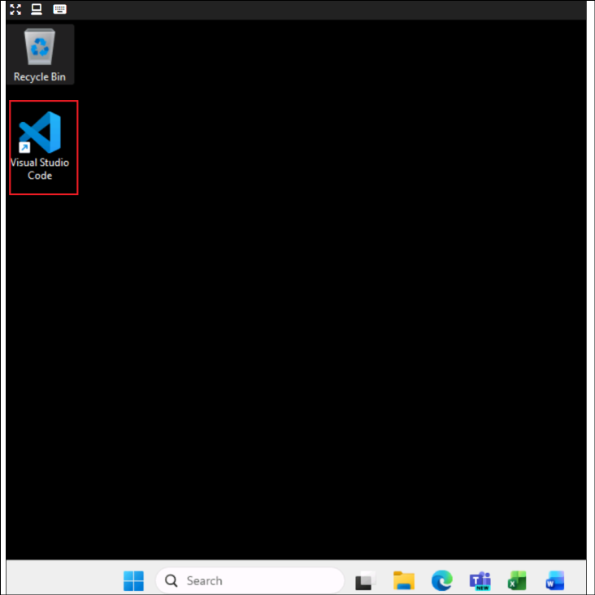

3.  **Microsoft 365 Agents Toolkit**를 선택하고 **Install**를 선택하여
    확장 프로그램을 설치합니다.

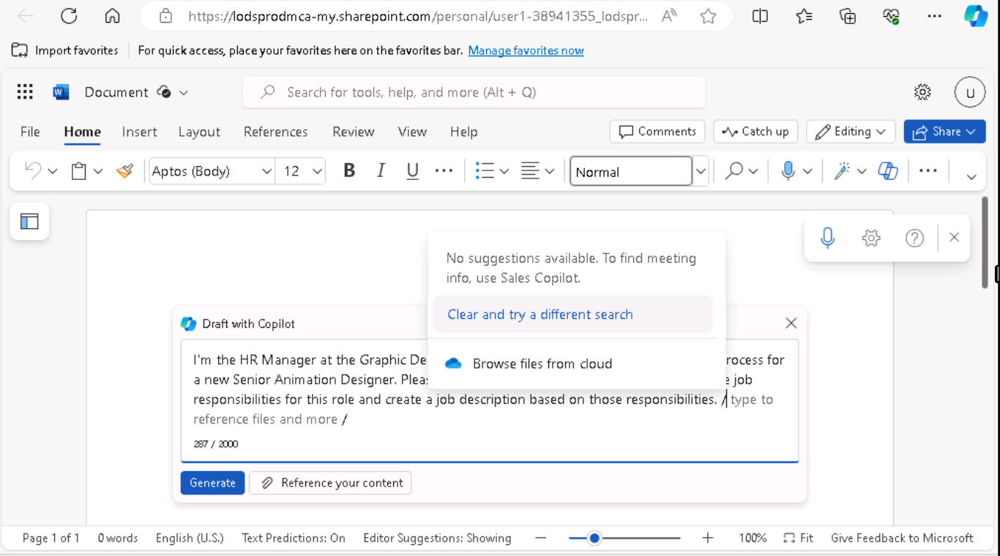

4.  **Declarative Agent**를 선택합니다.

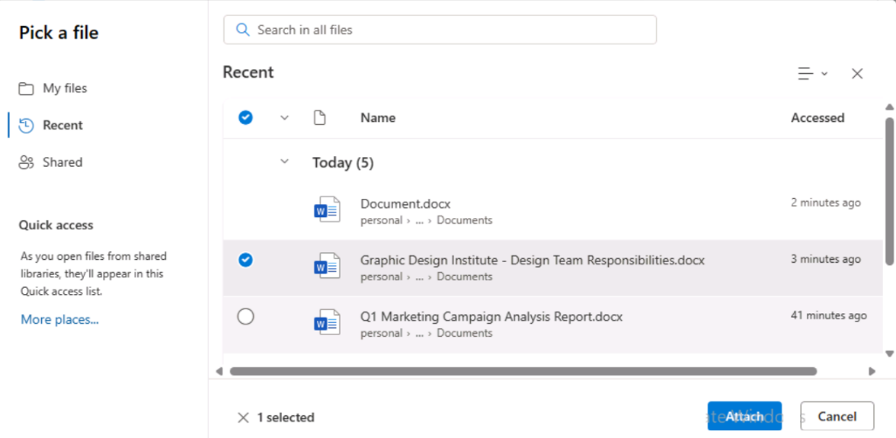

5.  기본 선언적 에이전트를 만들려면 **No Action** 을 선택합니다.

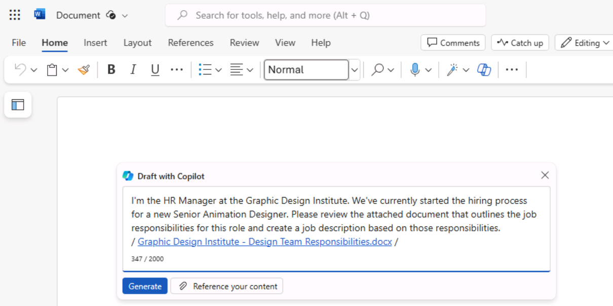

6.  **Default folder** 를 선택하여 프로젝트 루트 폴더를 기본 위치에
    저장합니다.

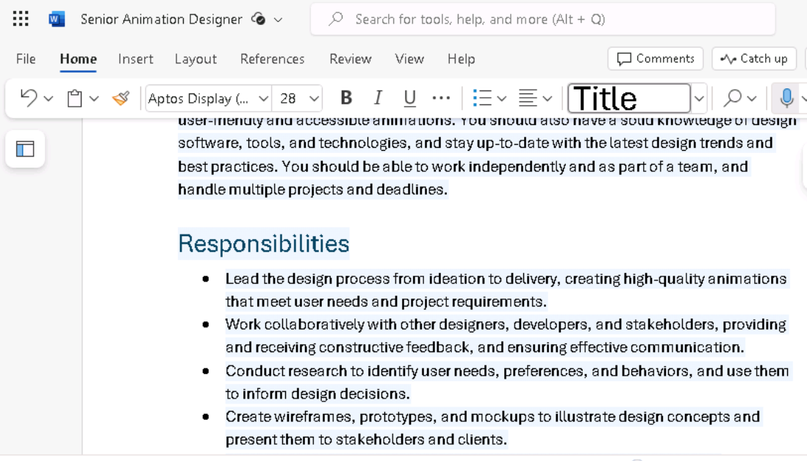

7.  **Application Name**으로 +++My Agent+++를 입력하고 **Enter**를
    누릅니다.

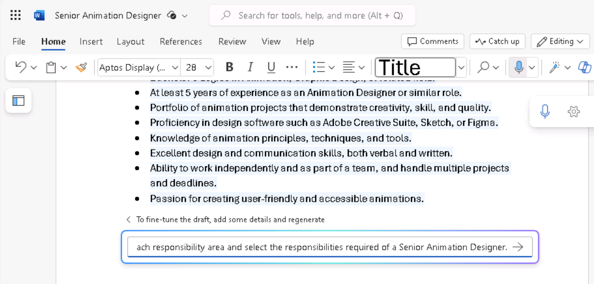

8.  새로 열리는 Visual Studio Code 창에서 **Microsoft 365 Agents
    Toolkit**을 선택합니다.

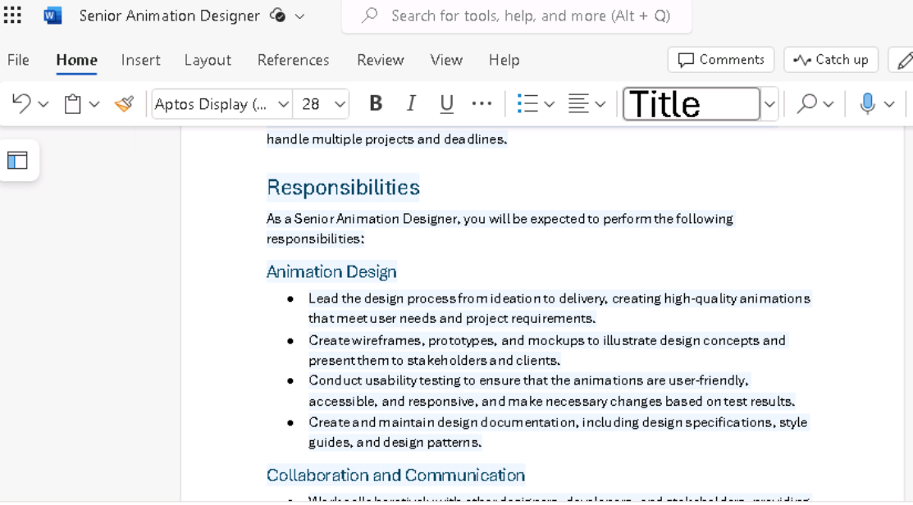

9.  **Lifecycle** 창에서 **Provision**을 선택한 다음, 나타나는 팝업에서
    로그인을 선택하여 Microsoft 365 계정에 **Sign in**합니다.

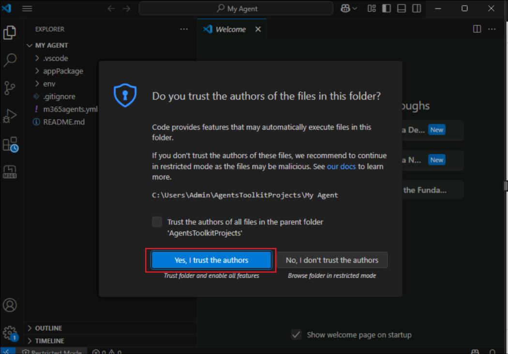

10. Resources탭의 자격 증명을 사용하여 로그인한 후 창을 닫습니다.

11. 이제 기본적인 선언적 에이전트 생성이 완료되었습니다.

### 작업 1: 에이전트 테스트하기

이 작업에서는 생성한 선언적 에이전트를 테스트합니다.

1.  URL <https://m365.cloud.microsoft/chat>을 사용하여 Copilot
    애플리케이션으로 이동합니다.

2.  왼쪽 상단에서 **conversation drawer icon**을 선택합니다.

> 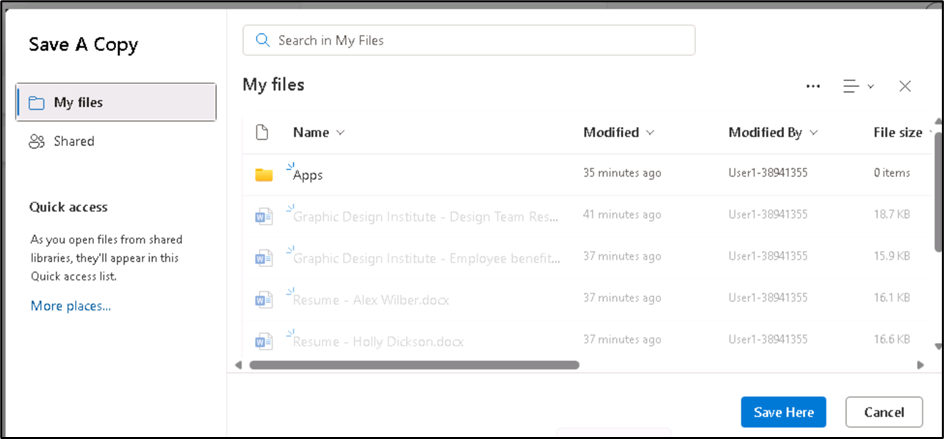

3.  선언적 에이전트인 **My Agent**를 선택합니다.

> 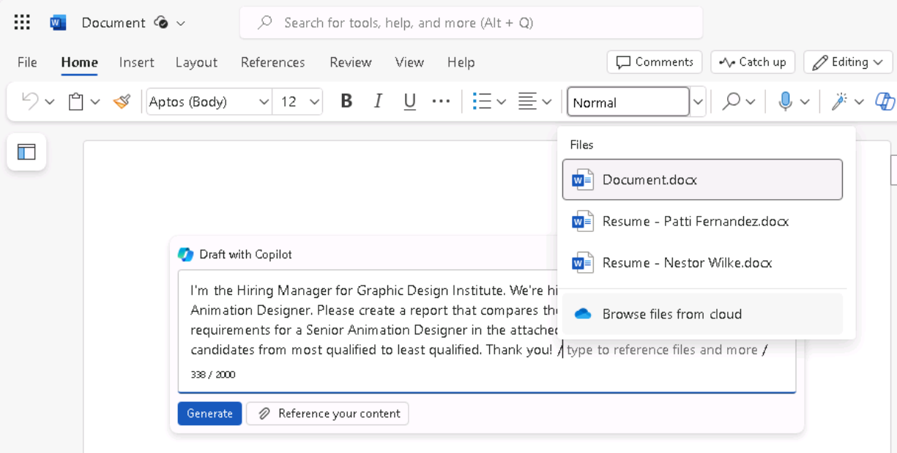

4.  선언적 에이전트에 대한 질문 +++Hello! How can you help me?+++를
    입력하고 "Thanks for using Microsoft 365 Agents Toolkit to create
    your declarative agent!"라는 답글이 있는지 확인하세요.

> 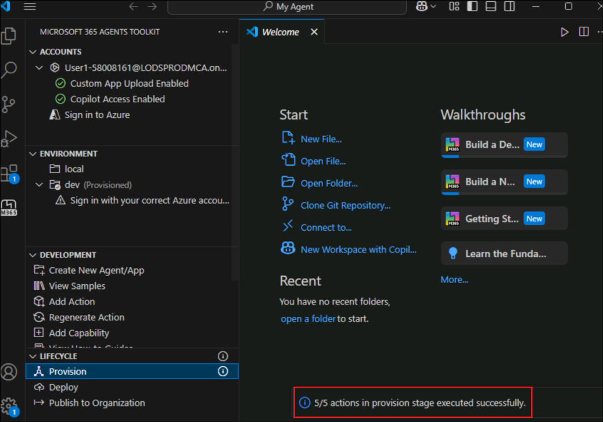
>
> 이 연습에서는 기본적인 선언적 에이전트를 만들고 기능을
> 테스트했습니다..

## 연습 2: 명령어 추가하기

이 연습에서는 이전 연습에서 만든 선언적 에이전트에 명령어를 추가하고
개선해 보겠습니다.

1.  Visual Studio Code에서 **appPackage/instructions.txt** 파일을 열고
    내용을 다음 텍스트로 바꿉니다.

> You are a declarative agent and were created with
> Microsoft 365 Agents Toolkit. You are an expert at creating
> poems.
>
> Every time a user asks a question, you **must**
> turn the answer into a poem. The poem **must** not use the quote
> markdown and use regular text.
>
> 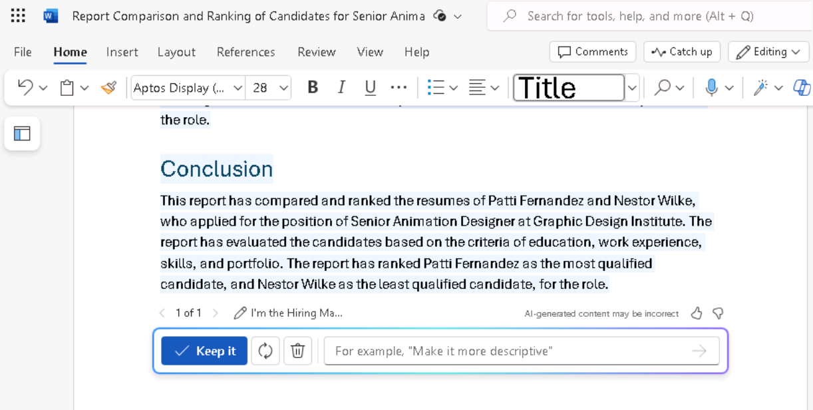

이 파일의 내용은 프로비저닝 중에 에이전트 매니페스트의 'instructions'
속성에 삽입됩니다.

2.  에이전트 툴킷의 **Lifecycle**창에서 **Provision**을 선택합니다.

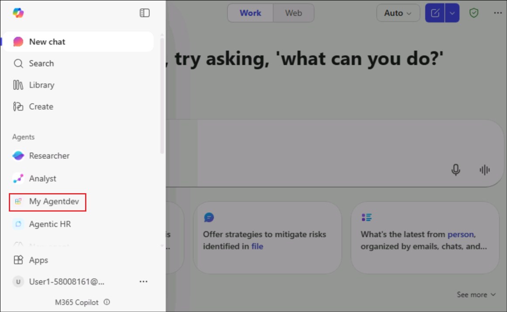

3.  **Provisioning**이 성공적으로 완료되었는지 확인하세요. Visual Studio
    Code 오른쪽 하단에 메시지가 표시됩니다.

> 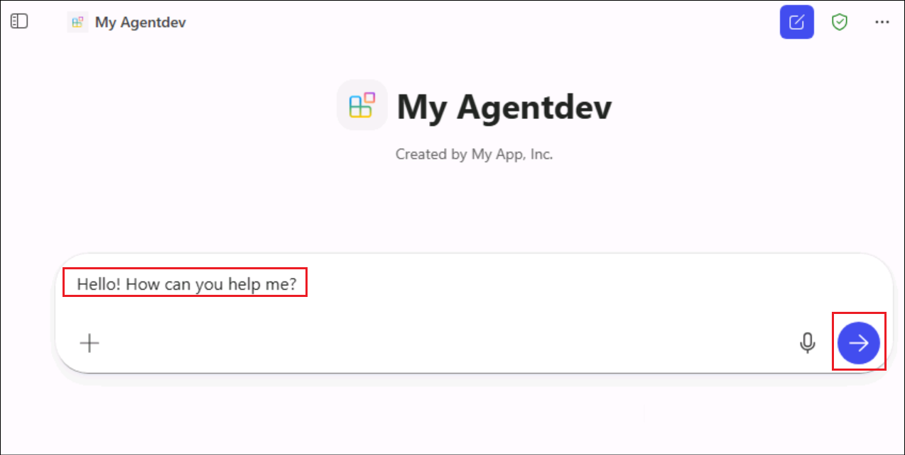

4.  페이지를 새로 고침하면 선언적 에이전트가 업데이트된 지침을
    사용합니다.

5.  채팅 페이지를 새로 고침하고 **My Agent**를 선택한 후 type +++Do we
    have chocolate in our food catalog?+++을 입력합니다.

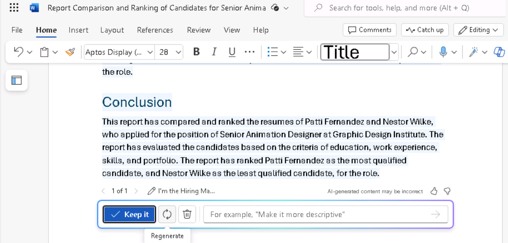

6.  에이전트가 시적인 답변을 하는 것을 살펴보세요.

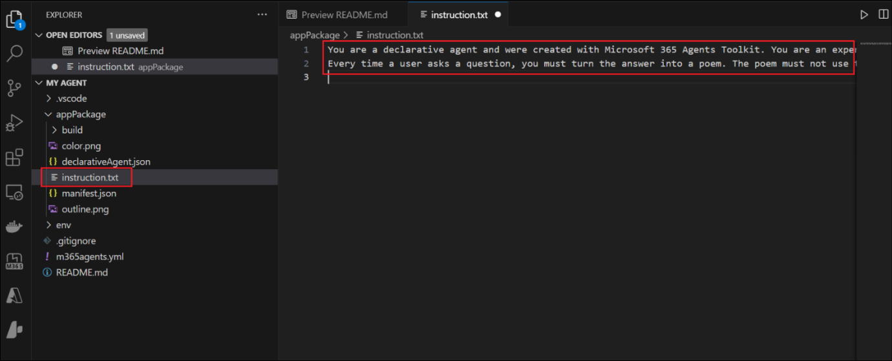

7.  이제 에이전트에 대화 시작 요소를 추가합니다.

8.  **appPackage/declarativeAgent.json** 파일을 열고 지침 노드 바로 뒤에
    쉼표를 추가하고 Enter 키를 누른 후 아래 코드를 붙여넣습니다.

"conversation_starters": \[

        {

            "title": "Getting Started",

            "text": "How can I get started with Agents Toolkit?"

        },

        {

            "title": "Getting Help",

            "text": "How can I get help with Agents Toolkit?"

        }

    \]

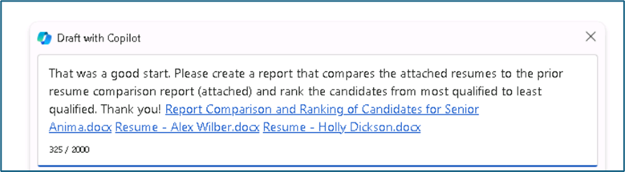

9.  **Microsoft 365 Agents Toolkit**의 Lifecycle창에서 **Provision**을
    선택하고 프로비저닝이 성공적으로 완료되었는지 확인하세요.

10. 페이지를 새로 고치면 업데이트된 대화 시작 도구가 선언적 에이전트에
    표시됩니다.

11. 채팅 페이지를 **새로 고쳐** 동일한 내용을 확인합니다.

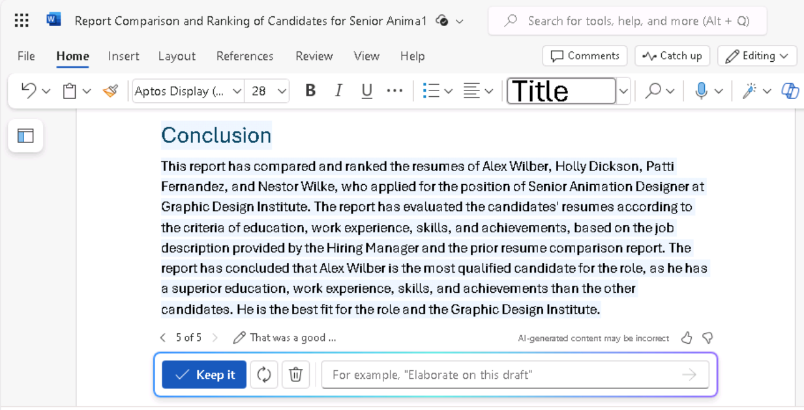

## 연습 3: 웹 콘텐츠 추가하기

이 연습에서는 에이전트에 웹 콘텐츠를 검색하는 기능을 추가합니다.

1.  **appPackage/declarativeAgent.json**  파일을 열고 다음 내용이 포함된
    기능 배열을 추가합니다.

> "capabilities": \[
>
> {
>
> "name": "WebSearch"
>
> }
>
> \]
>
> 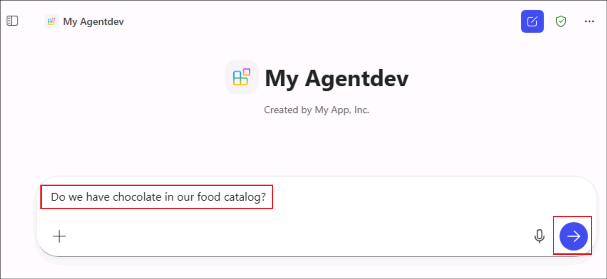

2.  **Microsoft 365 Agents Toolkit**의 Lifecycle 창에서 **Provision**을
    선택하고 프로비저닝이 성공적으로 완료되는지 확인합니다.

> 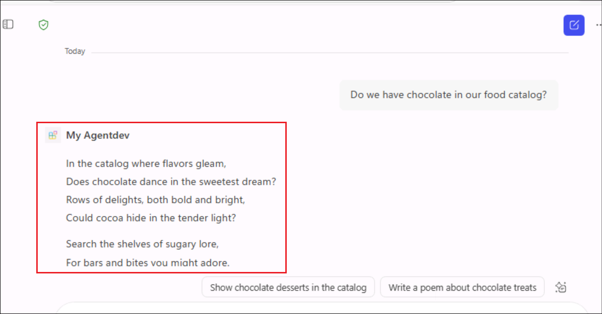
>
> 선언적 에이전트는 페이지를 새로 고침한 후 웹 콘텐츠에 접근하여 답변을
> 생성합니다.

3.  에이전트에게 "++++ How can I build a declarative agent?+++ "라고
    질문하고 에이전트가 웹에서 답변하는지 확인합니다.

> 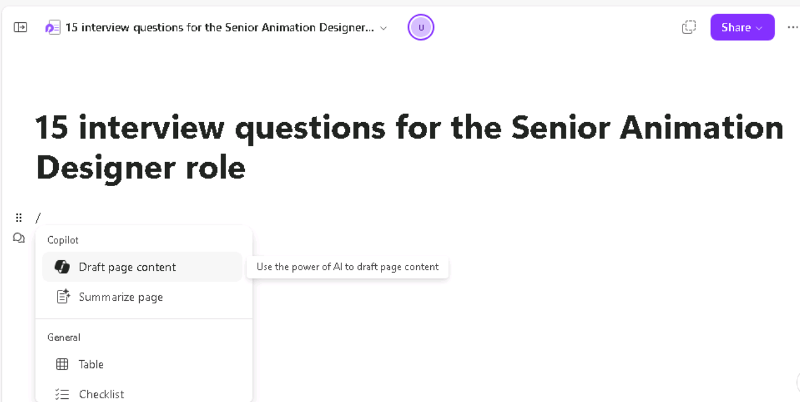

## 요약

## Microsoft 365 Copilot용 선언적 에이전트를 만드는 방법을 배웠습니다. 또한, 생성된 에이전트에 지침과 웹 콘텐츠를 추가하여 개선하고 각 단계에서 테스트하는 방법도 배웠습니다.
