# 실습 8 - 진로 지도 SharePoint 에이전트 만들기

**소개:**

매일 약 20억 개의 문서가 Microsoft 365에 추가됩니다. 빠르게 증가하는
직장 ​​콘텐츠의 양에 따라, 이러한 콘텐츠를 빠르고 정확하게 분석하고 필요한
정보를 얻을 수 있는 방법이 필요합니다. Microsoft SharePoint는 조직의
콘텐츠를 저장, 구성 및 공유하는 데 있어 보안과 효율성을 향상시킵니다.
하지만 그 이상의 기능을 제공합니다. AI 기반 SharePoint 에이전트를
사용하면 워크플로를 간소화하고 팀이나 조직에 적합한 협업을 촉진할 수
있습니다. SharePoint 에이전트는 질문자가 사용 권한을 가진 모든
SharePoint 사이트 또는 문서 라이브러리의 콘텐츠에 대한 질문에 답변할 수
있습니다. SharePoint 사이트에 대한 편집 권한이 있는 경우, 특정 작업을
위한 에이전트를 만들어 팀과 공유할 수도 있습니다.

SharePoint 에이전트

**즉시 사용 가능한 에이전트**

모든 SharePoint 사이트에는 해당 사이트의 콘텐츠에 맞게 자동으로 범위가
설정된 "즉시 사용 가능한 에이전트"가 있습니다. SharePoint 사이트로
범위가 설정된 이러한 에이전트는 사이트 관리자나 사이트 소유자가 별도로
구축할 필요가 없습니다. 이 즉시 사용 가능한 에이전트는 기본적으로
표시됩니다. 

**맞춤형 에이전트**

기성 에이전트의 결과에 만족하지 못하시나요? 사이트 편집 권한을 사용하면
콘텐츠 범위, ID 및 동작을 변경하여 에이전트를 쉽게 만들 수 있습니다.

**목표:**

이 실습에서는 SharePoint 사이트에 업로드된 문서를 사용하는 진로 지도
SharePoint 에이전트를 만들어 보겠습니다.

## 연습 1: SharePoint 홈에서 에이전트 만들기

이전 실습에서 SharePoint 사이트를 만들었습니다. 이 연습에서는 해당
사이트를 기반으로 에이전트를 만듭니다.

알림: 실습 6부터 실습을 계속 진행하는 경우 이 방법이 적용됩니다. 그렇지
않은 경우, **실습 6의 연습 4 - SharePoint 사이트 만들기를** 다시
실행하고 아래 실습 가이드의 단계를 계속 진행합니다.

1.  SharePoint 사이트를 엽니다(이전 실습에서 기록해 둔 URL 사용).

2.  **Home**을 선택합니다.

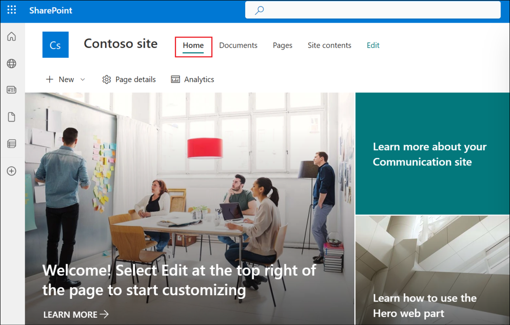

3.  **New** -\> **Agent**를 선택하여 새 에이전트를 만듭니다.

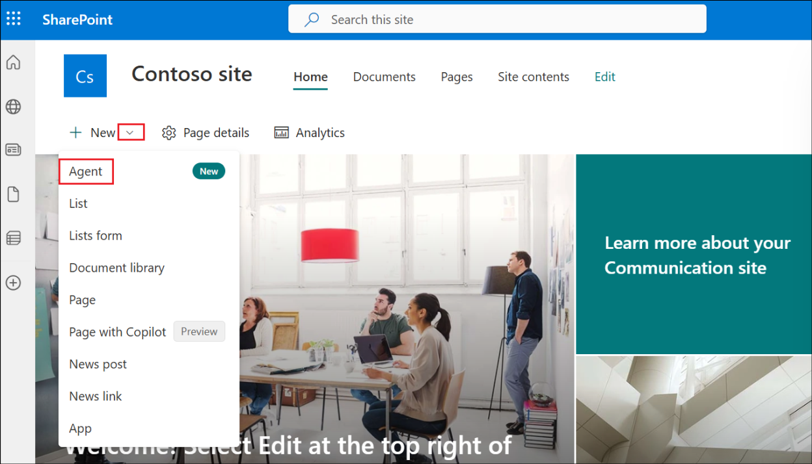

4.  새로운 에이전트가 생성되었으므로 이제 **Open agent**를 선택합니다.

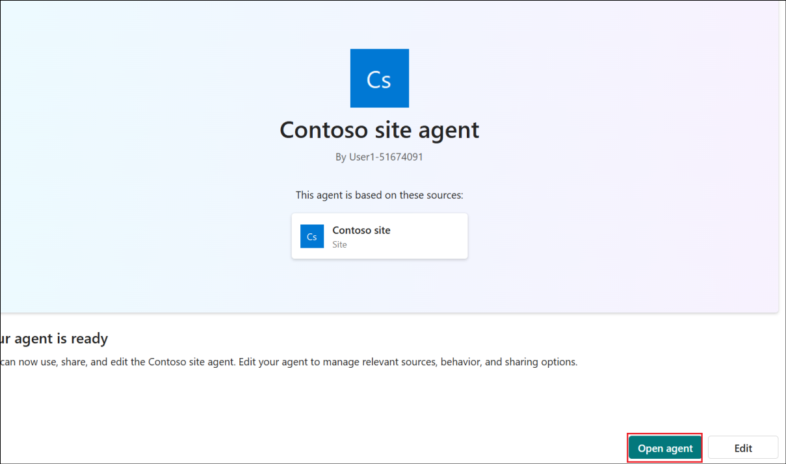

5.  생성된 에이전트가 사이트에 나타납니다.

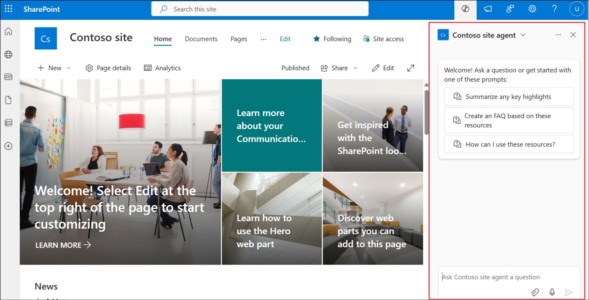

## 연습 2: 문서에서 에이전트 만들기

이 연습에서는 SharePoint 사이트에 문서를 업로드하고 해당 문서에서
에이전트를 만듭니다.

1.  **Documents** 를 선택합니다.

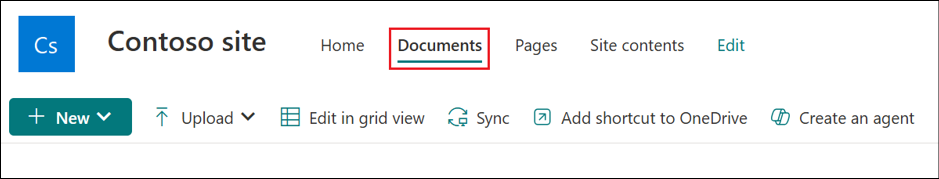

2.  **Upload** 옆에 있는 드롭다운을 선택하고 **Files**을 선택합니다.

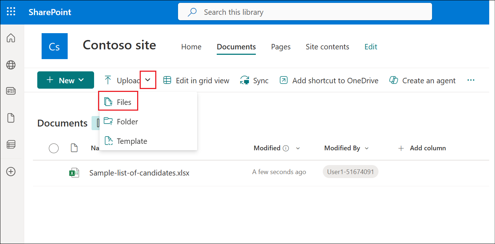

3.  **C:\LabFiles**에서 **Career Path Options in the USA.pdf**와
    **Career Path Options.docx**를 선택하고 **Open**를 선택합니다.

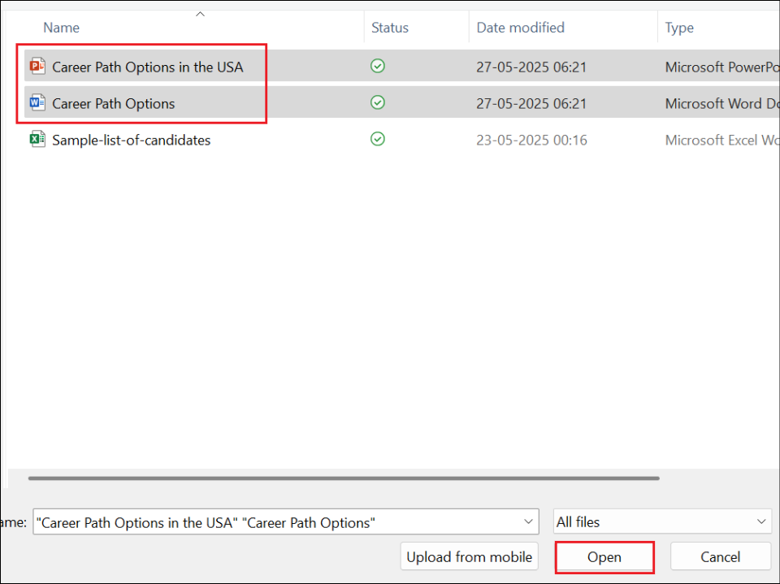

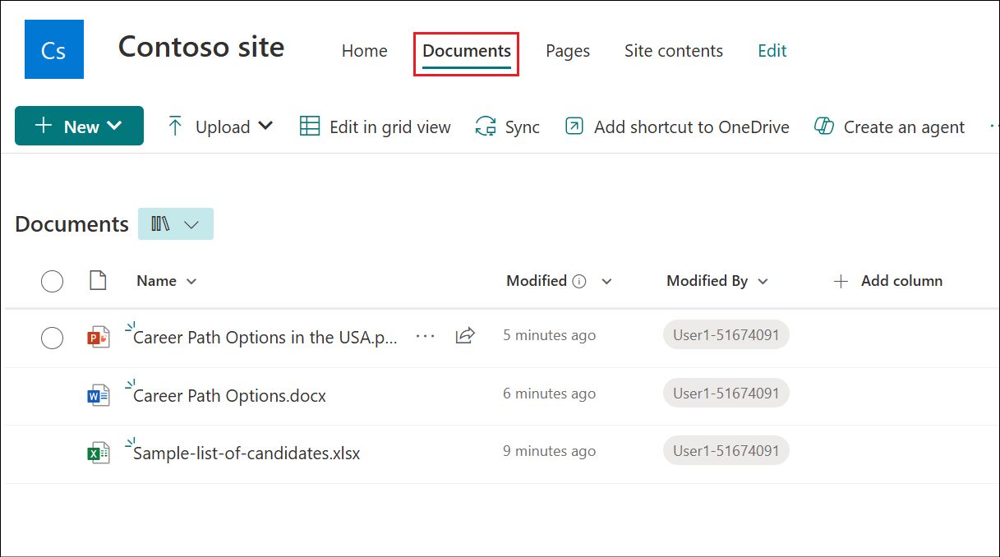

4.  업로드한 두 문서를 모두 선택하고 마우스 오른쪽 버튼을 클릭한 후
    **Create an agent**를 선택합니다.

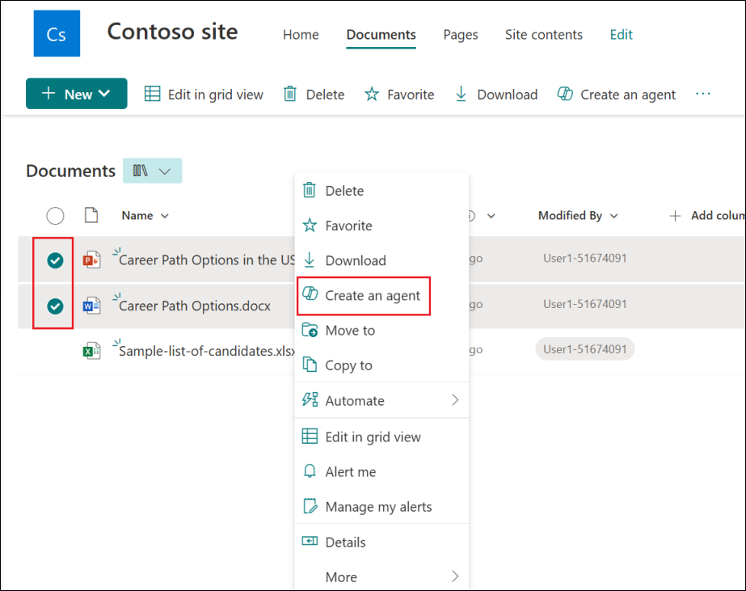

5.  새 에이전트 창에서 **Edit**을 선택하여 에이전트 이름을 편집합니다.

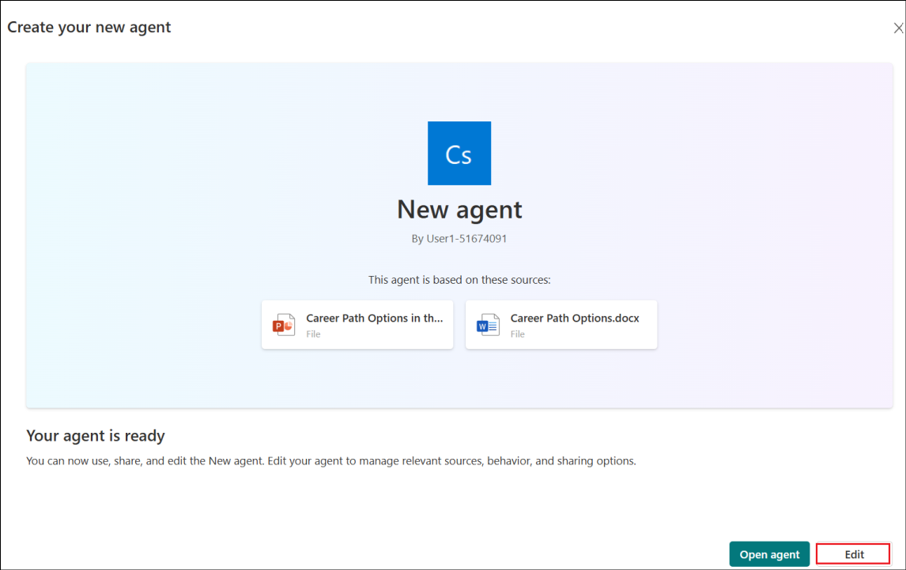

6.  에이전트 이름을 +++ Career Guidance Agent +++로 지정합니다. **Save
    and close**를 선택합니다.

**참고:** Copilot Studio에서 왼쪽 하단의 "Copilot Studio에서 고급 사용자
지정 추가" 옵션을 선택하여 에이전트 사용자 지정할 수 있습니다.

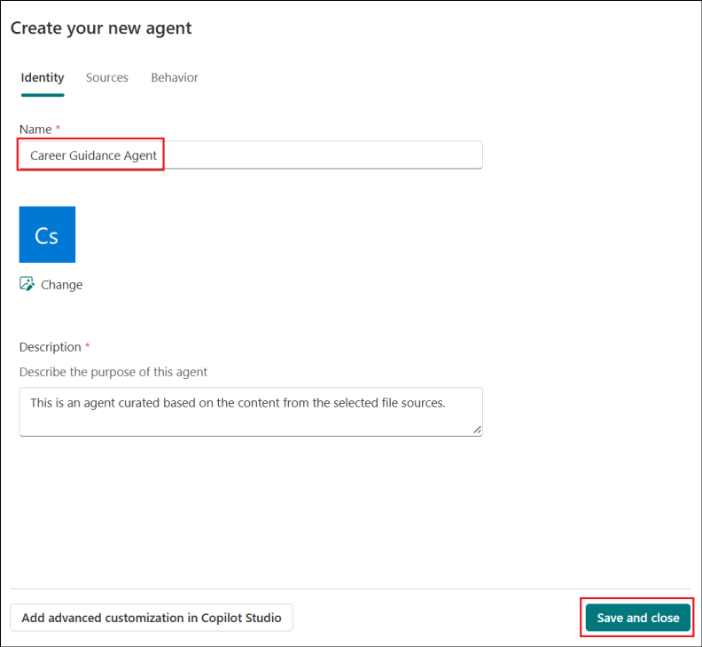

7.  생성된 에이전트가 **Documents** 아래에 나열됩니다. 해당 에이전트를
    선택하여 엽니다.

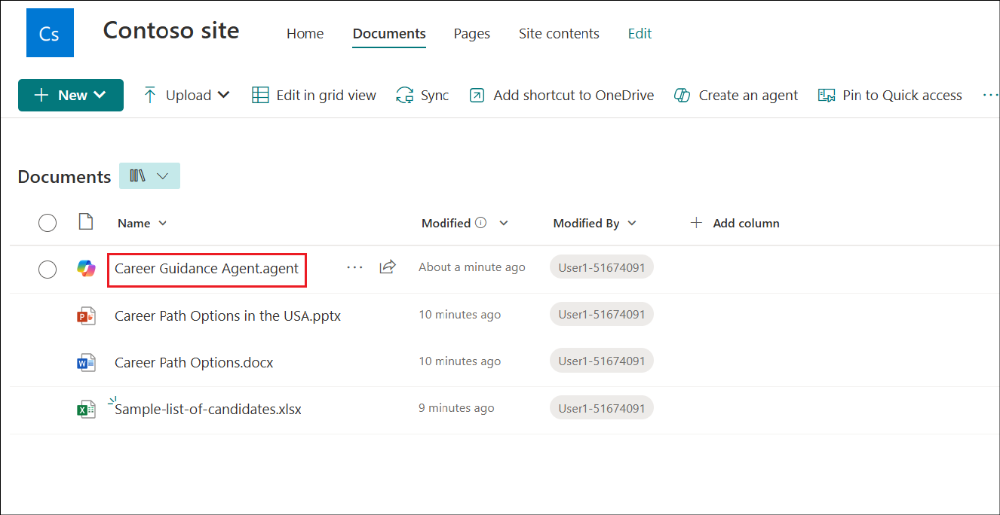

8.  +++ What are the Management career path available in the US?+++을
    입력하여 테스트해 봅니다.

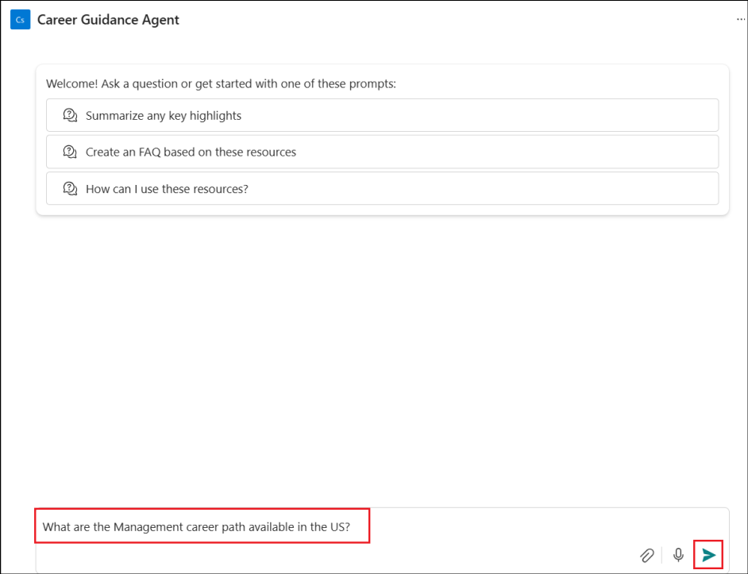

9.  출력과 참조를 관찰봅니다.

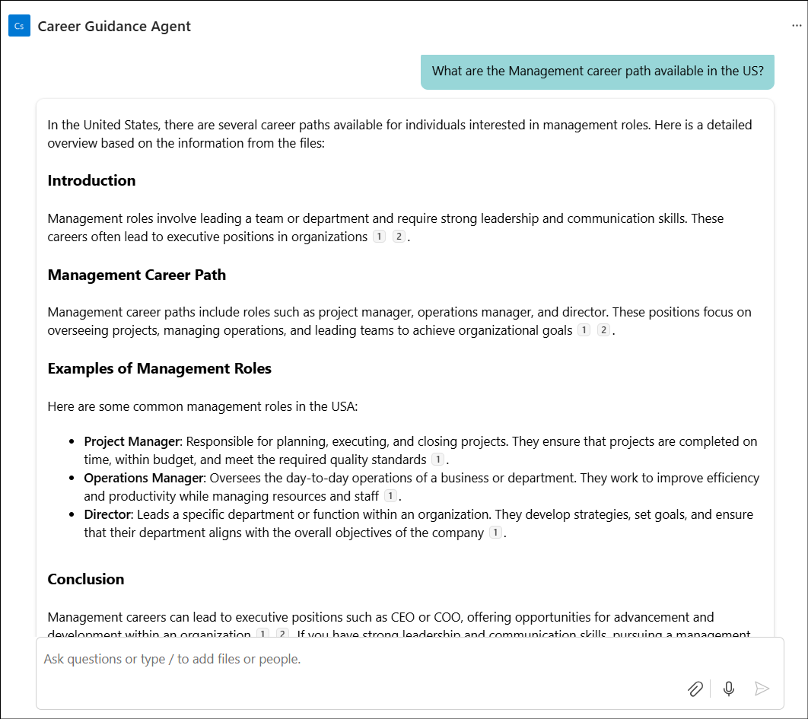

> 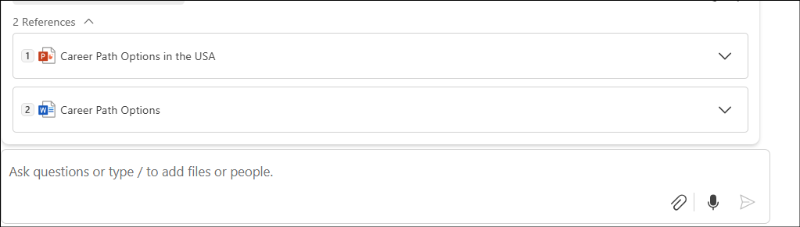

10. **Share -\> Copy link**를 선택합니다.

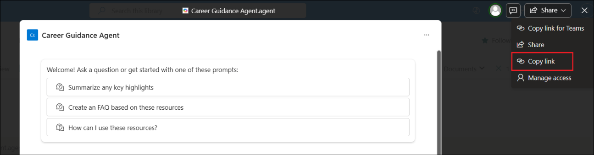

11. 팝업에서 허용을 선택합니다.

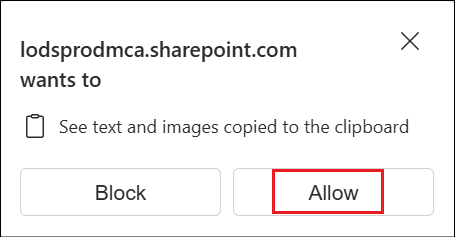

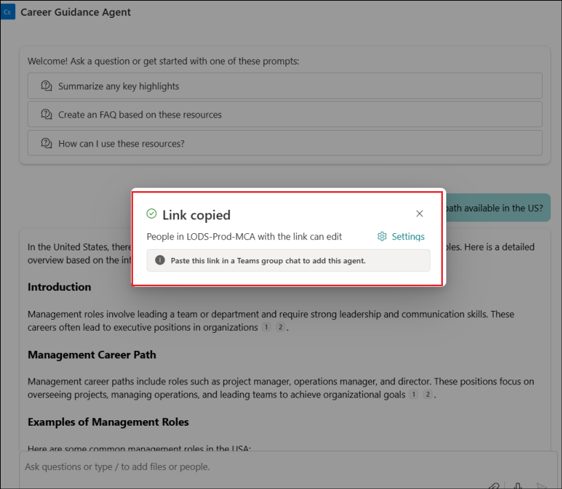

12. 복사 창의 설정에서 에이전트를 누구와 공유할 수 있는지 선택할 수
    있습니다.

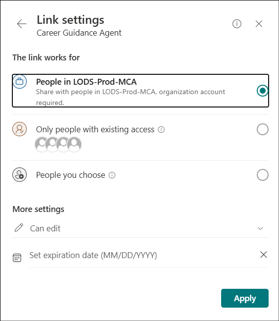

13. 복사한 링크를 사용하여 브라우저에서 에이전트에 액세스합니다.

## 요약

이 실습에서는 사이트 홈과 사이트에 업로드된 문서를 사용하여 SharePoint
에이전트를 만드는 방법을 알아보았습니다..
