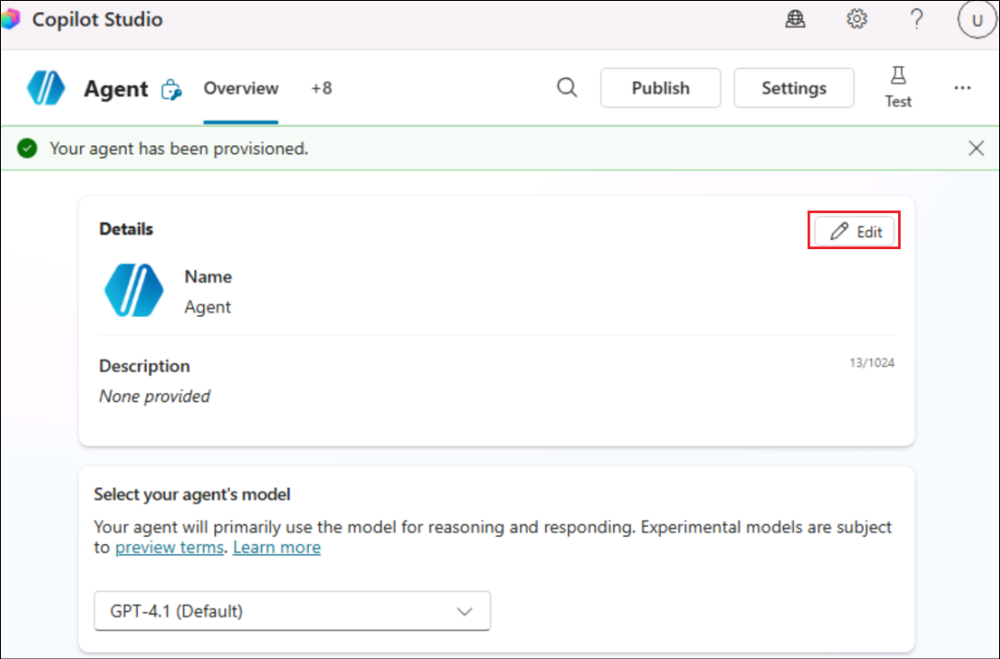

# Laboratorio 8 - Optimización de las operaciones de soporte de TI con un Copilot Agent autónomo mediante Copilot Studio

**Tiempo estimado: 60 minutos**

**Objetivo**

El objetivo de este laboratorio es permitir que los participantes
optimicen las operaciones de soporte de IT en Contoso Solutions mediante
la creación de un Copilot Agent autónomo. Los participantes aprenderán a
configurar Microsoft Copilot Studio, configurar el IT Support Agent,
integrar Power Apps y Dataverse, mejorar las capacidades del bot con una
base de conocimiento y automatizar la creación de tickets mediante Power
Automate. Este laboratorio práctico proporcionará a los usuarios las
habilidades necesarias para mejorar los flujos de trabajo de IT, reducir
el esfuerzo manual y aumentar la eficiencia del soporte.

**Solución**

Los participantes crearán un Contoso IT Support Agent personalizado
mediante Microsoft Copilot Studio, lo configurarán para manejar
problemas comunes de IT y lo integrarán con Dataverse para almacenar
datos de soporte. Configurarán un entorno de desarrollo, agregarán
orígenes de conocimiento y refinarán los flujos de conversación del bot
para mejorar la interacción con el usuario. Mediante Power Apps, los
participantes crearán una tabla de Dataverse para administrar los
registros de soporte de IT. Con Power Automate, automatizarán la
creación de tickets y las notificaciones por correo electrónico para
problemas no resueltos. Finalmente, los participantes probarán el agente
para validar la precisión de la solución de problemas y la
automatización de flujos de trabajo, garantizando operaciones de soporte
de IT sin interrupciones.

## Ejercicio 1: Introducción a Power Apps

Este ejercicio introduce a los participantes a Power Apps y Dataverse.
El objetivo es iniciar sesión en Power Apps, configurar un entorno de
trabajo y crear una tabla de Dataverse importando datos desde un archivo
de Excel. Los participantes aprenderán habilidades esenciales para
trabajar con aplicaciones basadas en datos.

### Tarea 1: Iniciar sesión en Power Apps

1.  Navegue al sitio web de Power Apps
    +++https://www.microsoft.com/en-us/power-platform/products/power-apps+++
    y seleccione el botón **Try for Free**.

        

2.  Ingrese +++@lab.CloudPortalCredential(User1).Username+++. Seleccione
    la **casilla** y seleccione **Start free**. Seleccione el país de
    origen.

        

3.  Ingrese el Temporary Access
    Pass+++@lab.CloudPortalCredential(User1).TAP+++

        

4.  Seleccione **Get Started**.

        

### Tarea 2: Actualizar la configuración del entorno Developer

1.  Desde una nueva pestaña del navegador, abra el Power Platform admin
    center - +++https://admin.powerplatform.microsoft.com/home+++ e
    inicie sesión con sus credenciales si se le solicita.

    - +++@lab.CloudPortalCredential(User1).Username+++
    
    - <+++@lab.CloudPortalCredential(User1).AccessToken>+++

    

2.  Seleccione **Manage** en el panel izquierdo y seleccione **+ New**
    debajo de **Environments**.

   

3.  Proporcione el nombre del entorno como +++Dev One+++, seleccione el
    Type como **Developer** y seleccione **Next**.

    

4.  Seleccione **Save** en el cuadro de diálogo **Add Dataverse**.

    

5.  Una vez que el entorno esté en estado **Ready**, seleccione el
    entorno **Dev One** creado.

    

6.  Seleccione **Edit** para editar la configuración.

    

7.  En el panel **Edit**, cambie **Administration mode** a **ON** y
    seleccione **Save**.

    
    
    
    
    

8.  Una vez guardados los cambios, seleccione **Settings**.

    

9.  Seleccione **Product - Features**.

    

10. Debajo de **Features**, active **Dataverse search**, seleccione
    **Save**, luego active **Single table search** y seleccione
    **Save**.

    

    

### Tarea 3: Configurar una tabla de Dataverse

1.  Regrese a la **página** **de** **Power** **Apps** y seleccione el
    entorno **DevOne** de la lista de entornos.

    

2.  Desde la barra de navegación izquierda, seleccione **Tables**. En la
    barra superior de la sección de tablas, seleccione **+ New table** y
    luego **Create new tables**.

    

3.  Seleccione la opción **Import an Excel file or CSV** para crear una
    nueva tabla.

    

4.  Seleccione **Select** **from** **device** y seleccione el archivo de
    **Excel** **Support** **Ticket**
    desde **C:\LabFiles\Labfiles\Autonomous agent** folder.

    

5.  Seleccione **Import** en la siguiente pantalla.

    

6.  Seleccione la tabla y haga clic en **View data** para ver los datos.

    **Nota:** En este caso, la tabla se llama **Employee Support Ticket**.
El nombre puede variar en cada ejecución. Guarde el nombre de la tabla
para referencia futura. El nombre de la columna también puede variar.

    

7.  Vaya a los datos de la tabla, seleccione el menú desplegable junto
    al campo **Issue Description**, seleccione **Edit column**,
    establezca el tipo de datos como **Text → Multiple line → Plain
    Text** y seleccione **Update**. El nombre de la columna puede ser
    diferente en cada caso.

    **El nombre de la columna puede ser ligeramente diferente**, pero será
similar a la descripción del problema, ya que lo genera Copilot.

    

    

8.  Seleccione el menú desplegable junto al campo **Ticket Status**,
    seleccione **Edit column**, configure las opciones como
    +++Unresolved+++, +++Resolved+++, +++Processing+++. Establezca la
    opción predeterminada como **Unresolved** y seleccione **Update**.

    

9.  En la parte superior derecha, seleccione **Save and exit** para
    guardar la tabla.

    

### Tarea 4: Agregar un archivo a OneDrive -

1.  Desde la parte superior izquierda de la página de Power Apps,
    seleccione el menú y seleccione **OneDrive**.

    

2.  Seleccione **My files** - **+ Create or upload**.

    

3.  Seleccione **Files upload**.

    

4.  Elija **IT Support.xlsx** desde **C:\LabFiles\Labfiles**.

    

5.  Este archivo se utilizará en un ejercicio posterior.

    

**Conclusión**

Al completar este ejercicio, los participantes aprenderán:

- Cómo acceder y navegar Power Apps usando credenciales de administrador
  de Office 365.

- Los pasos para crear y configurar una tabla de Dataverse mediante la
  importación de datos.

- Conocimiento práctico para configurar un entorno que admita flujos de
  trabajo de desarrollo de aplicaciones.

## Ejercicio 2: Crear el Contoso IT Support Agent

Este ejercicio se centra en iniciar sesión en Microsoft Copilot Studio y
crear un Copilot Agent personalizado para las operaciones de soporte de
IT en Contoso. Los participantes obtendrán experiencia práctica
navegando en Copilot Studio, configurando entornos y creando un agente
con IA para optimizar los flujos de trabajo de IT.

### Tarea 1: Crear y configurar el Contoso IT Support Agent

1.  Desde una nueva pestaña, inicie sesión en
    +++https://copilotstudio.microsoft.com+++ con sus credenciales.
    Seleccione **Get Started**.

    

2.  Seleccione **Skip** en la ventana emergente de bienvenida.

    

3.  En la página principal de Copilot Studio, en la parte superior
    derecha, seleccione el **entorno** y elija **DevOne**.

    

    **Importante:** Si Copilot Studio no muestra la opción para seleccionar
el **entorno** como en la captura de pantalla, siga estos pasos.
    
    

    Abra +++https://admin.powerplatform.microsoft.com/+++.
Seleccione **Manage** -\> **Environments** -\> **Dev env** y copie el
valor de **Environment ID**.

    

    Regrese a la pestaña de Copilot Studio y
abra +++https://copilotstudio.microsoft.com/environments/\<
EnvironmentID \>+++ (Reemplace **\< EnvironmentID \>** con el valor
obtenido)

4.  Seleccione **Create an agent**.

    

5.  Seleccione **Edit**.

    

6.  Ingrese **Name** y **Description** como se indica a continuación y
    seleccione **Save**.

    **Name:** +++Contoso IT Support Agent+++

    **Description** (Seleccione **Copy** y **pegue** en el campo **Description**):

    ```
    Create a Contoso IT Support Agent which transforms IT support at Contoso Solutions by providing instant troubleshooting for common issues, automating ticket creation for unresolved problems, and storing all interactions in Dataverse. This solution enhances response times, reduces manual workloads, and boosts employee productivity.
    ```

    

7.  Seleccione **Edit** junto a Instructions para proporcionar las
    instrucciones del agente.

    

8.  Ingrese la **instrucción** y seleccione **Save**.

    **Instruction**(Seleccione **Copy** y **pegue** en el campo
**Instruction**):

    ```
    Create the Copilot Agent and configure it to handle IT support operations. Add a knowledge source containing solutions for common IT issues like hardware troubleshooting, connectivity, and software glitches. Set up a trigger to detect updates to a OneDrive file describing unresolved issues. Create an action to save these technical issues into a Dataverse table, ensuring all details are stored for tracking and reporting. Test the agent to validate its troubleshooting accuracy and ticket automation workflow before deployment.	
    ```

    

9.  Desde la esquina superior derecha del agente, seleccione el botón
    **Settings**.

    

10. Desplácese hacia abajo y desactive la opción **Use** **general**
    **knowledge** en la sección **Knowledge**, luego seleccione
    **Save**.

    

11. Una vez **guardado**, **cierre** el panel Settings.

    

**Conclusión**

Al completar este ejercicio, los participantes aprenderán:

- Cómo acceder y configurar Microsoft Copilot Studio dio.

- Los pasos para crear y configurar un Copilot Agent personalizado.

- Habilidades prácticas para habilitar IA generativa y configuraciones
  de orquestador para el agente.

- Formas de mejorar las operaciones de IT automatizando la creación de
  tickets y aprovechando la IA para la solución de problemas.

## Ejercicio 3: Mejorar las capacidades del bot

Este ejercicio se centra en mejorar las capacidades del Contoso IT
Support Agent mediante la adición de una base de conocimiento y la
personalización de los temas del bot para una mejor interacción. Los
participantes refinarán las respuestas del bot y garantizarán que ayude
eficazmente a los usuarios en la solución de problemas y la escalación.

### Tarea 1: Agregar base de conocimiento

1.  En la página de información general del agente de Contoso,
    desplácese hacia abajo y seleccione el botón **+ Add Knowledge**.
    


2.  Seleccione **Upload file** para agregar el archivo del laboratorio
    **Contoso Common IT Issue.docx** desde el
    folder **C:\LabFiles\Labfiles\Autonomous agent** y luego seleccione
    **Add to agent** para guardar el archivo.

    

    

3.  Nuevamente, vaya a la página de información general del agente,
    desplácese hacia abajo y seleccione **+ Add knowledge.**

    

4.  Seleccione la opción **Dataverse** como origen de datos.

    

5.  Busque +++Employee+++, seleccione la tabla **Employee Support
    Ticket**. Luego seleccione el botón **Add to agent** para agregar el
    origen de conocimiento.

    El **nombre de la tabla puede ser diferente** en su caso, ya que es
generado por Copilot. Intente buscar +++Support Ticket+++ si es
necesario.

    

    **Importante:** Desde la página Knowledge, asegúrese de que el origen de
conocimiento agregado se haya cargado correctamente. Por lo general,
esto tarda entre 10 y 15 30 minutos en completarse.

### Tarea 2: Personalizar el tema Fallback

1.  Desde la opción de la barra superior, seleccione **Topics**, luego
    **System** y después seleccione y abra el tema **Fallback**.

    

2.  Desplácese hacia abajo y vaya al nodo de mensaje. Actualice el
    mensaje como se indica a continuación:

    +++I'm sorry. This information is not available in my system. You can raise the support ticket via mail for this issue. +++

    

3.  Desde la parte superior derecha, seleccione el botón **Save** para
    guardar el tema.

    

**Conclusión**

Al completar este ejercicio, los participantes aprenderán:

- Cómo cargar e integrar una base de conocimiento para mejorar la
  funcionalidad del bot.

- Los pasos para personalizar los mensajes de inicio de conversación y
  lograr una experiencia de usuario más atractiva.

- Técnicas para actualizar las respuestas de fallback y manejar mejor
  las consultas no compatibles.

## Ejercicio 4: Probar el agente

Este ejercicio guía a los participantes a través de la prueba del
Contoso IT Support Agent para validar su funcionalidad. Los
participantes comprobarán cómo el bot maneja los prompts utilizando la
base de conocimiento y los temas de fallback para garantizar una
interacción y escalación sin problemas.

1.  Desde la esquina superior derecha, seleccione el botón **Test**.

    

2.  Ingrese el prompt +++My printer is not working how to fix it+++ .
    Proporciona la solución según el origen de conocimiento.

    

**Conclusión**

Al completar este ejercicio, los participantes aprenderán:

- Cómo probar y activar un agente de IA para la solución de problemas.

- La validación de la capacidad del bot para responder utilizando su
  base de conocimiento.

## Ejercicio 5: Automatizar la creación de tickets de soporte con Power Automate

Este ejercicio demuestra cómo automatizar la creación de tickets de
soporte mediante AgentFlow e integrarlo con el Contoso IT Support Agent.
Los participantes crearán un flujo para optimizar el reporte de
problemas y registrar datos en Dataverse.

1.  Seleccione **Flows** en la barra de menú izquierda del agente.

    

2.  Seleccione **+ New agent flow**.

    

3.  Busque y seleccione el disparador +++**When an agent calls the
    flow**+++ en **Skills**.

    

4.  Seleccione **Add an Input**.

    

5.  Seleccione **Text** como tipo de datos de entrada y cambie el nombre
    de la entrada a +++Name+++.

    

    

6.  Con el mismo procedimiento, cree más entradas según los detalles que
    se indican a continuación.

    | Input Name  |  Data Type |
    |:----|:-----|
    | +++ID+++  | Text  |
    |  +++Email+++ | Text  |
    |  +++Details+++ |  Text |


    

7.  Debajo de **When an agent calls the flow**, seleccione el signo
    **(+)** para **Add an action**.

    

8.  En la barra de búsqueda Add an action, escriba +++Add a new row+++ .
    Luego seleccione **Add a new row** en la sección Microsoft
    Dataverse.

    

**Nota:** En algunos casos, la conexión de Dataverse no se crea
automáticamente. Es posible que deba **iniciar** **sesión** nuevamente
con sus credenciales mediante autenticación **OAuth**. Si se requiere un
nombre de conexión, asígnele +++connect1+++. El navegador también puede
bloquear la ventana emergente inicial; permítala desde la esquina
derecha de la barra de URL.

    

9.  En la sección **Table Name**, busque y seleccione +++Employee
    Support Ticket+++ (o el nombre de la tabla correspondiente que haya
    creado).

    

10. Debajo del nombre de la tabla, seleccione **Show all**, luego haga
    clic en el campo correspondiente y agregue la **entrada** con ayuda
    del botón de **contenido** **dinámico** (**icono** **de** **rayo**)
    según la siguiente tabla.

    Set the **Current Status** field to **Unresolved**.

    | Section  | Input Variable  |
    |:------|:-----|
    |Employee Name   |  Name (Dynamic Input) |
    |  Email Address | Email (Dynamic Input)  |
    |  Employee ID |  ID (Dynamic Input) |
    |  Technical Issue Description | Details (Dynamic Input)  |


    

    

11. Desde la barra superior, seleccione **Save draft** y luego
    **Publish**. Cierre la pestaña de Power Automate.

    

12. Seleccione la pestaña **Overview**.

    

13. Seleccione **Edit** en **Details**, dentro del flujo.

    

14. Asigne al flujo el nombre +++Create an Employee Support Ticket+++ y
    seleccione **Save**.

    

    

15. Desde la página **Overview** **del Contoso IT Support Agent**,
    seleccione **+ Add tool**.

    

16. Seleccione la pestaña **Flows** y seleccione **Create an Employee
    Support Ticket Agent flow**.

    

17. Seleccione **Add and configure** para agregar el flujo.

    

18. Asegúrese de que la **herramienta** se haya **agregado** al agente.

    

**Conclusión**

Al completar este ejercicio, los participantes aprenderán:

- Cómo integrar flujos de agente con un Copilot Agent para la creación
  de tickets.

- Los pasos para recopilar y asignar datos de entrada dinámicamente a
  partir de interacciones del usuario.

- Técnicas para automatizar notificaciones por correo electrónico para
  la escalación de incidencias técnicas.

- La capacidad de configurar flujos de trabajo para una gestión
  eficiente de tickets de soporte.

## Ejercicio 6: Configurar un disparador para acciones automatizadas

Esta continuación de la automatización de la creación de tickets de
soporte se centra en configurar un disparador en el Contoso IT Support
Agent. Cree un **equipo** y un **canal de soporte** en Microsoft Teams.
Cuando se publique un mensaje en el canal de soporte, el disparador debe
activarse. Los participantes configurarán disparadores y finalizarán el
agente para su implementación.

1.  Abra un navegador y abra Teams +++https://teams.microsoft.com/+++.
    Inicie sesión si se le solicita.

2.  Seleccione el icono **New items** y seleccione **New Team**.

    

3.  Ingrese los siguientes detalles y seleccione **Create**.

    - Team name - +++Support Team+++

    - Description - +++This is a team to post about support requests.+++

    - First channel name - +++Support Channel+++

    

4.  Seleccione **Skip** en la pantalla Add members.

    

5.  Desde la página de información general del agente en Copilot Studio,
    desplácese hacia abajo y seleccione **+ Add trigger**.

    

6.  Seleccione el disparador **When a new channel message is added** y
    seleccione **Next**.

    

7.  Una vez que la conexión se haya establecido correctamente,
    seleccione **Next**.

    

8.  Seleccione los siguientes valores y seleccione Create trigger.

    - Team - **Support Team**

    - Channel - **Support Channel**

    

9.  Cierre el cuadro de diálogo **Time to test your trigger**.

    

10. Seleccione **Publish** en la esquina superior derecha para
    **publicar** el agente.

11. Desde la página **Overview** del agente, seleccione los tres puntos
    junto al disparador agregado **When a new channel message is added**
    y seleccione **Edit in Power Automate**.

    

12. Seleccione el símbolo (+) debajo del nodo **When a new channel
    message is added** para agregar una acción. En el panel **Action**,
    busque +++Get a row+++ y seleccione **Get a row** en **Excel Online
    (Business)**.

    

    

13. Una vez agregada la acción, ingrese los siguientes detalles.

    - Location - Select OneDrive for Business

    - Document Library - OneDrive

    - File - ITSupport.xlsx

    - Table - Table1

    - Key Column - ID

    - Key Value - +++ID1234+++

    

14. Seleccione el nodo Seleccione el nodo **Sends a prompt to the
    specified copilot for processing**.

    En Body/message, ingrese +++Run the flow Create an Employee Support Ticket+++ y luego agregue los valores dinámicos Name, ID, Email ID, Description y Status. Después, +++add along with a message "New record added to the Employee Support table"+++
Debe verse similar al de la siguiente captura de pantalla.


    

15. **Guarde** el flujo.

## Ejercicio 7: Probar el agente

1.  Desde el flujo de Power Automate **When a new channel message is
    added**, seleccione **Test**.

    

2.  Seleccione la opción **Manually** y luego **Test**.

    

3.  Abra **Teams** y seleccione **Post in channel** en el equipo
    **Support Channel**.

    

4.  Ingrese un mensaje y seleccione **Post**.

    

5.  De regreso en la página de Power Automate, podrá ver que el flujo
    inició su ejecución y se completó correctamente.

    

6.  Desde la página Overview del agente, seleccione el icono **Test**
    **Trigger**.

    

7.  Seleccione el disparador más reciente y seleccione **Start
    testing**.

    

8.  Se ejecuta el flujo, obtiene los datos del Support tracker y los
    actualiza en la tabla de Dataverse.

    

    

9.  En este caso, hay un detalle de ticket de soporte en el tracker, que
    se agrega a la tabla de Dataverse, creando así un ticket de soporte
    para el usuario.

**Conclusión final de la guía del laboratorio**

Esta guía de laboratorio proporcionó a los participantes una experiencia
práctica en la implementación de un Copilot Agent autónomo para el
service desk de soporte de IT de Contoso Solutions. Al seguir los
ejercicios paso a paso, los participantes pudieron:

1.  **Configurar Copilot Studio**: Los participantes aprendieron a
    iniciar sesión en Copilot Studio, crear y configurar el agente de
    soporte de TI, y habilitar configuraciones esenciales como IA
    generativa y orquestador para una solución de problemas y
    automatización de tickets efectivas.

2.  **Navegar** **Power Apps**: Los participantes adquirieron
    conocimiento práctico al iniciar sesión en Power Apps, configurar
    una tabla de Dataverse e importar datos desde Excel para rastrear y
    administrar tickets de soporte de manera eficiente.

3.  **Mejorar las capacidades del bot**: Los ejercicios se enfocaron en
    agregar una base de conocimiento al bot, personalizar los temas de
    inicio de conversación y fallback para mejorar la interacción con el
    usuario, y garantizar que el bot pudiera manejar una amplia variedad
    de escenarios de soporte de IT.

4.  **Automatizar tareas de soporte de IT**: Los participantes también
    aprendieron a automatizar la creación de tickets de soporte mediante
    Power Automate, mejorando la capacidad del bot para administrar
    incidencias no resueltas y optimizar los flujos de trabajo del
    equipo de IT.

Al completar estos ejercicios, los participantes pudieron implementar un
sistema de soporte autónomo robusto que mejora los tiempos de respuesta,
reduce la carga de trabajo manual y aumenta la productividad general de
las operaciones de soporte de IT. La integración de Copilot Studio,
Power Apps y Dataverse garantiza un flujo de información fluido,
automatiza tareas rutinarias y optimiza los flujos de trabajo de
soporte, proporcionando soluciones inmediatas de solución de problemas a
los empleados y una gestión automatizada de tickets para incidencias no
resueltas.
