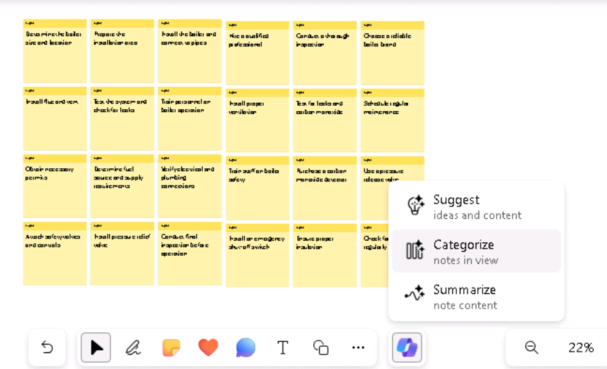
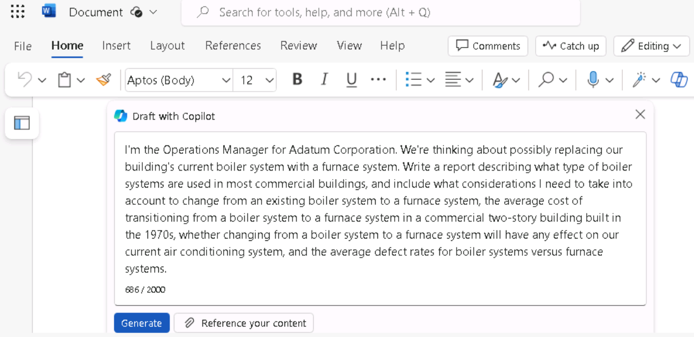
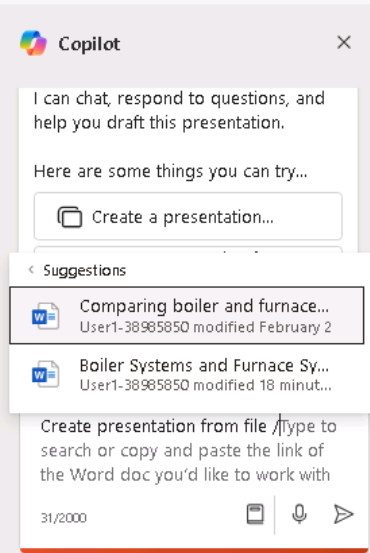
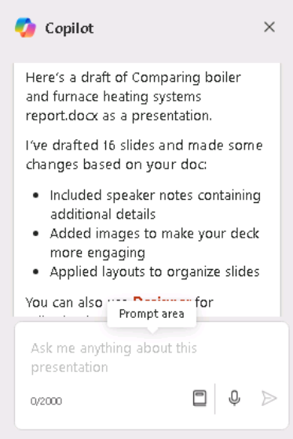
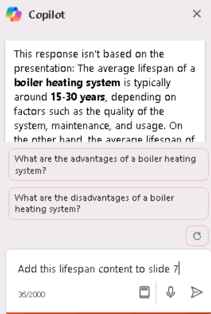

**Laboratorio 08: Empodere a su fuerza de trabajo – Copilot –
Operaciones**

**Objetivo:**

Los gerentes de operaciones pueden utilizar Copilot para Microsoft 365
con el fin de optimizar su flujo de trabajo y mejorar su productividad.

En este laboratorio utilizará:

- Copilot en Whiteboard para intercambiar ideas sobre el plan de
  proyecto para la instalación de un nuevo sistema de calderas.

- Copilot en Word para crear un informe que analice los sistemas de
  calefacción por caldera frente a los sistemas de calefacción por
  horno, al tiempo que compara los tipos de resultados que puede generar
  Copilot.

- Copilot en PowerPoint para crear una presentación basada en el informe
  que ha creado, en el que se analizan los sistemas de calefacción de
  calderas y hornos.

**Ejercicio \#1: Realice una lluvia de ideas para el plan del proyecto
utilizando Copilot en Whiteboard**

Microsoft Whiteboard es un lienzo digital que permite a los usuarios
colaborar en tiempo real, intercambiar ideas y crear contenido con
facilidad. Las características de Whiteboard incluyen dibujo de forma
libre, notas adhesivas y plantillas que se pueden personalizar para
adaptarse a sus necesidades. También proporciona un espacio que se puede
utilizar para proyectos, lluvias de ideas, talleres, retrospectivas,
diseño, planificación estratégica y para resolver problemas que puedan
tener piezas móviles o que requieran más elementos visuales.

Whiteboard puede ayudar a aumentar

- Colaboración al permitir que varios usuarios trabajen simultáneamente
  en un espacio digital, lo que facilita compartir imágenes e ideas.

- Productividad al proporcionar un espacio para hacer bocetos, compartir
  prototipos o recopilar una lista de ideas para nombres de productos.

Como gerente de operaciones de Adatum Corporation, está planeando
instalar una nueva caldera en el sistema de calefacción de su edificio.
Sin embargo, antes de comenzar el proceso de instalación, desea utilizar
Copilot en Whiteboard para sugerir los pasos potenciales que las
empresas suelen completar cuando actualizan su sistema de calefacción.

En este ejercicio, utilizará Copilot en Whiteboard para sugerir los
pasos necesarios para completar dicha instalación. Considere este
ejercicio como un ejercicio de notas adhesivas asistido por IA.

1.  En el navegador Microsoft Edge, abra una nueva pestaña e ingrese la
    siguiente URL para ir a la página de inicio de Microsoft
    365: +++[https://www.office.com+++](https://www.office.com+++/)

2.  En la página de inicio de **Microsoft 365**, si aparece un icono
    de **Whiteboard** en el panel de navegación izquierdo, selecciónelo
    ahora y continúe con el siguiente paso. De lo contrario,
    seleccione **Explore all your Apps** y, en la página **Apps**,
    desplácese hacia abajo hasta la sección **Explore by category** y,
    en la pestaña **Productivity** (que debería aparecer de forma
    predeterminada), seleccione **Whiteboard**.

3.  Inicie sesión en **Microsoft Whiteboard**.

4.  En la página de inicio de **Whiteboard**, seleccione **New
    Whiteboard**.

5.  En la cinta situada en la parte superior de la página, seleccione la
    flecha desplegable **Whiteboard**. En el campo **Board name**,
    ingrese +++**Boiler installation project plan**+++ y, a
    continuación, seleccione el icono de marca de verificación.

6.  Si aparece la ventana **Suggest content with Copilot**, continúe con
    el siguiente paso. De lo contrario, en la bandeja de iconos que
    aparece encima de la barra de tareas en la parte inferior de la
    página, seleccione el icono **Copilot**. En el menú que aparece,
    seleccione **Suggest**.

7.  En la ventana **Suggest content with Copilot**, ingrese el siguiente
    prompt:

++**I'm the Operations Manager for Adatum Corporation. We're installing
a new boiler in our heating system. Please suggest the steps we should
follow to install the new boiler**.++

8.  Si aparece la ventana **Suggest content with Copilot**, continúe con
    el siguiente paso. Sin embargo, si recibe un mensaje que indica
    “**Something went wrong. Please try again.**” o “**Copilot couldn't
    process this prompt. Please rephrase it.**”, seleccione la
    flecha **Generate suggestions** en la esquina inferior de la ventana
    Copilot.

En ocasiones, Copilot completa el proceso en el que está trabajando,
pero se retrasa un poco antes de mostrar los resultados. Cuando vuelve a
seleccionar la flecha **Generate suggestions**, normalmente se muestran
los resultados sin mucho retraso. Sin embargo, si recibe un mensaje
similar por segunda vez, seleccione la flecha **Generate suggestions**
unas cuantas veces más. Si sigue recibiendo este error después de tres o
cuatro intentos, simplifique el prompt introduciendo el siguiente texto:

++**Please suggest the steps we should follow to install a new boiler in
our building's heating system**.++

9.  De forma predeterminada, Copilot genera ideas en grupos de seis. En
    la ventana **Suggest content with Copilot** que aparece, tome nota
    de las primeras seis ideas que ha generado. Copilot le ofrece dos
    opciones: puede adjuntar las ideas a su Whiteboard si está
    satisfecho con las sugerencias, o puede pedir a Copilot que genere
    más sugerencias. Observe cómo el botón **Insert (6)** indica el
    número de ideas que ha generado Copilot, en este caso, 6.

10. Aunque las seis sugerencias son un buen punto de partida, es
    recomendable profundizar en las tareas necesarias para instalar el
    producto de seguridad, así que seleccione el botón **Generate
    more**.

**Nota**: Si Copilot muestra un mensaje de error de cualquier tipo,
seleccione nuevamente el botón \*\*Generate more\*\*. Haga esto cada vez
que reciba un mensaje de error.

11. Observe cómo Copilot ha generado otras seis ideas, por lo que el
    botón **Insert (12)** ahora muestra **12**. Aunque puede seguir
    generando más ideas, por motivos de tiempo, insertaremos las 12
    ideas que se presentan actualmente. Seleccione el botón **Insert
    (12)**.

12. Al seleccionar el botón **Insert**, Copilot adjunta las ideas
    sugeridas a su Whiteboard en forma de notas adhesivas amarillas.

13. Al igual que en una sesión de lluvia de ideas en el mundo real con
    notas adhesivas reales, puede editar una nota concreta, eliminarla,
    bloquearla para que no se pueda eliminar en el futuro, etc. En
    Microsoft Whiteboard, estas actividades se admiten a través de la
    funcionalidad estándar de pizarra.

Si nunca ha utilizado Whiteboard, pruebe a seleccionar (haga doble clic)
una nota específica y, a continuación, en la barra de menú que aparece
encima, puede seleccionar el icono **Edit text** (lápiz) o cualquiera de
las otras opciones. Al seleccionar el icono de tres puntos al final de
la barra de menú, se muestra un menú con más opciones, como eliminar la
nota. Una vez más, la idea detrás de Microsoft Whiteboard es imitar los
ejercicios con notas adhesivas del mundo real. No dude en editar una
nota como desee.

14. Al revisar las ideas sugeridas, considera que no cubren
    adecuadamente la mitigación de riesgos. Seleccione el
    icono **Copilot** en la parte inferior de la página y, a
    continuación, seleccione **Suggest **en el menú.

15. En la ventana **Suggest content with Copilot **que aparece, ingrese
    el siguiente prompt para generar más ideas sobre mitigación de
    riesgos:

++**Suggest ways to mitigate the risks of installing a new boiler into
the building's heating system**.++

16. Revise las seis ideas que le ha sugerido Copilot. Si desea que
    Copilot incluya más detalles, seleccione el botón **Generate more**.

17. Está satisfecho con las 12 ideas para mitigar riesgos, así que
    seleccione el botón **Insert (12)**.

18. Observe cómo se selecciona el bloque de 12 ideas para mitigar
    riesgos (véase el borde exterior).

19. Copilot superpone las 12 ideas de mitigación de riesgos parcialmente
    sobre las 12 ideas originales del plan del proyecto. Puede
    seleccionar este bloque de ideas y moverlo por la pantalla para que
    ya no se superponga a las 12 ideas originales. No se preocupe por
    alinear los dos bloques. Una vez que organice las notas en
    categorías en un paso posterior, quedarán bien ordenadas. Por ahora,
    simplemente organice cada bloque de manera que pueda ver todas las
    ideas. Al hacerlo, tendrá la visibilidad necesaria para ver las
    áreas que Copilot ha propuesto y podrá editar cualquiera de ellas si
    lo desea.

20. Ahora está satisfecho con las sugerencias que ha creado Copilot y ha
    completado todas las modificaciones que quería realizar en las
    notas. Ahora desea que Copilot organice las notas por categorías.
    Copilot determina los nombres de las categorías y organiza
    automáticamente las notas según corresponda. Seleccione el
    icono **Copilot** en la parte inferior de la página y, a
    continuación, seleccione **Categorize** en el menú.

21. Observe lo que ha sucedido. Copilot ha generado un conjunto de
    categorías y ha reorganizado las notas en consecuencia. A cada
    categoría de notas se le ha asignado un color diferente para ayudar
    a identificar las diferencias entre ellas. Si el rectángulo que
    contiene las notas no es tan grande como podría ser y aún así cabe
    en la pantalla, seleccione el icono **Fit to Screen **en la esquina
    inferior derecha de la página. Al hacerlo, se aumentará el tamaño de
    la imagen hasta que ya no sea posible aumentarla más sin que supere
    el tamaño de la pantalla.

22. Observe la bandeja de iconos que aparece debajo del grupo organizado
    de notas. Si no está satisfecho con las categorías, seleccione el
    botón **Regenerate** en la bandeja de iconos que aparece.

**Nota**: Puede seleccionar el botón **Regenerate** tantas veces como
sea necesario hasta que esté satisfecho con las categorías que le ofrece
Copilot. Seleccione este botón varias veces y observe los cambios que
Copilot realiza cada vez. Además de cambiar los nombres de las
categorías, Copilot puede añadir o reducir el número de categorías con
cada regeneración.

23. Después de regenerar las categorías varias veces, se da cuenta de
    que faltan pasos detallados sobre la minimización del tiempo de
    inactividad del sistema. Desea pedirle a Copilot que añada más ideas
    a su sesión de Whiteboard sobre este tema. Además, ha identificado
    una nota que desea eliminar. Sin embargo, como ya ha organizado sus
    ideas, debe volver a poner la sesión de Whiteboard en el modo de
    edición en el que se encontraba antes de categorizar las notas. Para
    ello, seleccione el botón **Revert**.

24. Ahora que ha vuelto al modo de edición, seleccione una nota que ya
    no desee y, a continuación, en la bandeja de iconos que aparece,
    seleccione el icono de tres puntos. Seleccione **Delete** en el menú
    que aparece.

25. Para que Copilot genere más ideas, seleccione el
    icono **Copilot** en la parte inferior de la página y, a
    continuación, seleccione **Suggest** en el menú.

26. En la ventana **Suggest content with Copilot **que aparece, ingrese
    el siguiente prompt para generar más ideas sobre cómo minimizar el
    tiempo de inactividad del sistema:

++**Suggest ways to limit heating system downtime when installing a new
boiler**.++

27. Revise las seis ideas que le ha sugerido Copilot. Si está satisfecho
    con ellas, seleccione el botón **Insert (6)**.

28. Observe cómo el bloque de seis notas está resaltado con una línea
    alrededor. Este bloque de notas se conoce como cuadrícula de notas.
    Puede mover o cambiar el tamaño de una cuadrícula de notas como
    cualquier otro elemento de su Whiteboard. Al cambiar el tamaño de
    una cuadrícula de notas, el tamaño de todas las notas adhesivas que
    contiene se ajusta en consecuencia. Si el bloque de seis notas se
    superpone a uno de los bloques de notas, seleccione una de las
    líneas exteriores que rodean la cuadrícula de notas y arrastre todo
    el bloque de seis notas hacia un lado para que no se superponga a
    ninguna de las notas anteriores. Si se queda sin espacio en la
    pantalla y parte del bloque queda fuera de la pantalla, seleccione
    el icono **Fit to Screen** en la esquina inferior derecha de la
    página.

29. Ya está listo para que Copilot organice las notas adhesivas, que
    incluyen 18 notas: un bloque de 12 notas y otro de seis. Seleccione
    el icono **Copilot** en la parte inferior de la página y, a
    continuación, seleccione **Categorize** en el menú. En la
    ventana **Categorize selected notes**, seleccione el
    botón **Categorize**.

30. En ocasiones, el rectángulo que contiene las notas no tiene el
    tamaño máximo posible, lo que deja un espacio en blanco alrededor
    del lienzo. En este caso, el tamaño del texto de las notas suele ser
    pequeño y difícil de leer. Si se produce este problema de tamaño,
    seleccione el icono **Fit to Screen** situado en la esquina inferior
    derecha de la página. Al hacerlo, se aumenta el tamaño de la imagen.
    Si continúa seleccionando este botón, llegará un punto en el que ya
    no se podrá aumentar el tamaño del rectángulo sin que supere el
    tamaño de la pantalla. Seleccionar este icono de nuevo no tendrá
    ningún efecto sobre el rectángulo.

31. Revise las categorías. En la bandeja del icono Copilot que aparece
    debajo del rectángulo, puede seleccionar el
    botón **Regenerate** para crear un nuevo conjunto de categorías. De
    hecho, seleccione el botón **Regenerate** varias veces para ver cómo
    cambian las categorías. Una vez que esté satisfecho con los
    resultados, seleccione el botón **Keep it**.

32. Observe que cada categoría de notas adhesivas tiene un color
    diferente. Se da cuenta de que le gustaría añadir un breve resumen
    de la sesión de lluvia de ideas al contenido de su Whiteboard. Para
    ello, seleccione el icono **Copilot** en la parte inferior de la
    página y, a continuación, seleccione **Summarize** en el menú.
    Copilot genera un breve resumen de los temas principales de esta
    sesión de Whiteboard. Desplácese hacia abajo para revisar toda la
    ventana **Summary**. Está satisfecho con los resultados, así que
    seleccione **Keep it**.

33. Seleccione el icono **Fit to Screen** en la esquina inferior derecha
    de la página para ajustar todas las notas adhesivas y el resumen de
    la sesión a toda la pantalla.

**Ejercicio \#2: Comparar los resultados de los informes utilizando
Copilot en Word**

Como gerente de operaciones de Adatum Corporation, ha descubierto que el
sistema de calefacción actual del edificio de oficinas de la empresa,
que tiene 50 años de antigüedad, necesita una reparación importante, si
no es que un reemplazo completo. Considera que esta situación puede ser
el momento oportuno para cambiar el sistema de calefacción actual por un
sistema de calderas más eficiente desde el punto de vista energético.
Sin embargo, no está familiarizado con las diferencias entre los dos
tipos de sistemas de calefacción. Desea investigar la situación con
Copilot en Word y crear un informe que pueda presentar a la dirección.

**Nota**: Ha oído que Copilot en Word puede generar informes, pero aún
no lo ha utilizado. Por lo tanto, no está seguro de qué tipo de informes
proporciona. Desea aprovechar esta oportunidad no solo para crear su
informe, sino también para investigar las características de generación
de informes de Copilot. Este es su plan:

- Anteriormente, identificó varias preguntas que desea que Copilot
  investigue en relación con los sistemas de calefacción por caldera y
  por horno.

- Usted planea que Copilot cree un informe que abarque todas esas
  preguntas.

- A continuación, planea formular cada una de esas preguntas a Copilot
  de forma individual para poder ver cada respuesta.

- A continuación, puede comparar el informe creado por Copilot con las
  respuestas individuales que genera para cada pregunta. En este último
  caso, puede copiar y pegar cada respuesta en un documento para crear
  su propio informe, si lo desea, o para complementar un documento ya
  existente.

El objetivo de este ejercicio es mostrar cómo Copilot en Word
proporciona un nivel de respuesta diferente en función de la modalidad
que se utilice, ya sea en el panel Copilot o al crear un documento
nuevo.

1.  Si tiene abierta una pestaña de Microsoft 365 en el navegador Edge,
    selecciónela ahora; de lo contrario, abra una nueva pestaña e
    ingrese la siguiente
    URL: +++[https://www.office.com+++](https://www.office.com+++/)

Nota: Debe iniciar sesión (si se le solicita) utilizando
las **credenciales de Microsoft 365** proporcionadas en la
pestaña **Resources** a la derecha.

2.  Con su plan en mente, decide utilizar primero Copilot en Word para
    crear un informe que responda a todas sus preguntas. En el panel de
    navegación de **Microsoft 365**, seleccione **Microsoft Word** y, a
    continuación, abra un documento en blanco.

3.  En la ventana **Draft with Copilot** que aparece en la parte
    superior del documento en blanco, ingrese el siguiente prompt y
    seleccione el botón **Generate**:

+++I'm the Operations Manager for Adatum Corporation. We're thinking
about possibly replacing our building's current boiler system with a
furnace system. Write a report describing what type of boiler systems
are used in most commercial buildings, and include what considerations I
need to take into account to change from an existing boiler system to a
furnace system, the average cost of transitioning from a boiler system
to a furnace system in a commercial two-story building built in the
1970s, whether changing from a boiler system to a furnace system will
have any effect on our current air conditioning system, and the average
defect rates for boiler systems versus furnace systems.+++

4.  Revise el informe generado por Copilot. Observe el nivel de detalle
    en cada área de interés. Dado que desea guardar este documento para
    el siguiente ejercicio de caso práctico, seleccione el botón **Keep
    it** en la bandeja de Copilot y, a continuación, guarde el
    documento.

**Nota**: Asegúrese de guardar el informe, ya que lo utilizará en el
siguiente ejercicio.

5.  El prompt que introdujo para crear el informe incluía cinco
    solicitudes. Ahora desea hacerle a Copilot cada una de esas cinco
    preguntas individualmente. Seleccione **Copilot** en la cinta de
    Word, lo que abrirá el panel **Copilot**.

6.  En el panel de **Copilot**, en el campo de prompts situado en la
    parte inferior del panel, ingrese la siguiente pregunta y, a
    continuación, seleccione la flecha **Send**:

+++What type of boilers do most buildings use as part of their heating
systems?+++

7.  Revise la respuesta. Aunque puede seleccionar la opción **Copy** si
    desea pegar la respuesta en el documento, para esta formación solo
    va a seleccionar más prompts para ver las respuestas que recibe.

8.  Ingrese prompts separados para cada una de las cuatro preguntas
    restantes:

    - **What considerations do I need to take into account to change
      from an existing boiler system to a furnace system in a commercial
      building?**

    - **What is an average cost for transitioning from a boiler system
      to a furnace system in a commercial two-story building built in
      the 1970s?**

    - **if we change from a boiler system to a furnace system, will it
      have any effect on our current air conditioning system?**

    - **What are the average defect rates for boiler systems versus
      furnace systems?**

9.  Observe cómo Copilot ha respondido a cada una de sus preguntas, pero
    no ha insertado ninguna de las respuestas en el documento actual.
    Aunque puede copiar y pegar cada respuesta en el documento, parece
    evidente que es más eficiente dejar que Copilot cree el informe.

10. A continuación, se incluyen algunos puntos para reflexionar sobre
    las respuestas cuando utilizó Copilot en Word.

    - How does the level of information for each reporting method
      compare to one another?

Compare el nivel de información proporcionado cuando Copilot en Word
creó un informe con las respuestas que proporcionó cuando formuló las
preguntas individualmente en el panel de Copilot.

- What did you notice?

Cuando solicita a Copilot que cree un informe, normalmente proporciona
respuestas más completas que organiza en un informe atractivo. Por el
contrario, cuando solicita a Copilot que responda a preguntas de forma
individual en el panel Copilot, no ofrece el mismo nivel de detalle que
el informe, aunque permite copiar y pegar las respuestas en un
documento. Sin embargo, es posible que sea necesario reformatear las
respuestas insertadas para solucionar cualquier problema de formato.

**Ejercicio \#3: Crear una presentación comparando sistemas de
calefacción utilizando Copilot en PowerPoint**

El dominio de Copilot en PowerPoint es una habilidad estratégica para
los profesionales que desean mejorar el impacto de sus presentaciones.
Copilot en PowerPoint actúa como un colaborador inteligente, ofreciendo
sugerencias y mejoras en tiempo real mientras los directores de
operaciones elaboran sus presentaciones.

Como gerente de operaciones de Adatum Corporation, ha descubierto que el
sistema de calderas actual que calienta el edificio de oficinas de la
empresa, de 50 años de antigüedad, necesita una reparación importante,
si no una sustitución completa. Considera que este puede ser el momento
oportuno para cambiar el sistema de calefacción actual por un sistema de
hornos más eficiente desde el punto de vista energético.

En este ejercicio, solicita a Copilot en PowerPoint que cree una
presentación basada en el informe **Comparing boiler and furnace heating
systems**. Su objetivo es poner al día al equipo directivo de Adatum
sobre los dos tipos de sistemas de calefacción, incluyendo las ventajas
y desventajas de cada uno, antes de ponerse en contacto con una empresa
de calefacción, ventilación y aire acondicionado (HVAC) y comenzar
formalmente este proyecto.

1.  Si tiene abierta una pestaña de **Microsoft 365** en el navegador
    Microsoft Edge, selecciónela ahora; de lo contrario, abra una nueva
    pestaña e ingrese la siguiente URL:
    +++[https://www.office.com+++](https://www.office.com+++/) para ir a
    la página de inicio de Microsoft 365.

**Nota:** Debe iniciar sesión (si se le solicita) utilizando
las **credenciales de Microsoft 365** proporcionadas en la
pestaña **Resources** a la derecha.

2.  En el panel de navegación de **Microsoft 365**,
    seleccione **OneDrive** para abrirlo.

3.  Navegue hasta la carpeta **C:\LabFiles** para seleccionar y cargar
    una copia del documento **Comparing boiler and furnace heating
    systems report** en **OneDrive**.

**Consejo:** abra y cierre el archivo para que aparezca en la lista de
archivos usados recientemente (MRU).

**Nota:** Si ya ha cargado todos los recursos del laboratorio en
OneDrive, tal y como se sugiere en la sección** Preparación para la
ejecución del laboratorio**, puede omitir este paso.

4.  En la página de inicio de **Microsoft 365**, seleccione el icono
    de **PowerPoint** en el panel de navegación de la izquierda.

5.  En **PowerPoint**, abra una nueva presentación en blanco.

6.  Seleccione el icono de **Copilot** (resaltado en rojo, como se
    muestra en la captura de pantalla).

7.  En el panel **Copilot** que aparece, hay varios prompts predefinidos
    entre los que puede elegir. Seleccione el prompt **Create
    presentation from
    file**. 
    

8.  En el campo del prompt situado en la parte inferior del panel
    de **Copilot**, Copilot introduce automáticamente el texto: **Create
    presentation from file /**. La barra diagonal es el indicador
    universal de Copilot para introducir un vínculo a un archivo. En
    este caso, hace que Copilot abra una ventana **Suggestions** que
    muestra los tres archivos usados recientemente.

- Si su archivo aparece aquí, selecciónelo ahora y continúe con el
  siguiente paso.

- Si el archivo no se encuentra entre los tres que se muestran,
  seleccione la flecha derecha (**\>**) en la esquina superior derecha
  de la ventana **Suggestions** para ver una lista ampliada de archivos
  MRU. Si el archivo aparece aquí, selecciónelo ahora y continúe con el
  siguiente paso.

- Si no ve su archivo en la lista MRU ampliada, debe copiar el enlace al
  informe y pegarlo en el campo del prompt. Para ello:

  1.  Seleccione la pestaña del navegador **Microsoft 365** y
      seleccione **Word** en el panel de navegación.

  2.  En la página de inicio de **Word**, en la lista de archivos
      recientes, seleccione el informe para abrirlo en Word.

  3.  En el informe en Word, en la parte superior derecha, encima de la
      cinta, seleccione el botón **Share**. En el menú desplegable que
      aparece, seleccione **Copy Link**. Espere a que aparezca la
      ventana **Link copied**, que le garantiza que el enlace al archivo
      se ha copiado al portapapeles.

  4.  Cambie a la pestaña **PowerPoint** y, en la parte inferior del
      panel **Copilot**, el campo del prompt debería seguir
      mostrando **Create presentation from file /**. Coloque el cursor
      después de la barra diagonal (**/**) y pegue (**Ctrl+V**) el
      enlace al informe.

9.  Observe cómo aparece el archivo en el campo del prompt. Seleccione
    el icono **Send** en el campo del prompt.

10. Este prompt hizo que Copilot creara una presentación de diapositivas
    basada en el documento. Al hacerlo, primero mostró el esquema de la
    presentación en el panel Copilot. A continuación, mostró una ventana
    independiente con una lista con viñetas de algunos de los cambios
    que había realizado en la presentación basándose en el documento.

11. Ahora puede revisar las diapositivas y realizar las actualizaciones
    necesarias. Preste especial atención a los cambios que Copilot ha
    realizado basándose en el documento. Puede utilizar la
    herramienta **Designer** para ajustar los diseños.

12. Revise las notas del orador que Copilot ha añadido a cada
    diapositiva de la presentación. Verifique que mencionan los puntos
    que desea destacar durante la presentación.

13. Intente utilizar Copilot para actualizar la presentación. Comencemos
    añadiendo una imagen a una diapositiva. Busque una diapositiva sin
    imágenes e ingrese el siguiente prompt (no olvide reemplazar
    \[ingrese aquí el número de diapositiva\] con el número de la
    diapositiva que ha seleccionado):

++**Add an image to slide \[enter slide number here\]**. **The image
should contain a picture related to the slide contents**.++

14. También observa que no hay ningún contenido en la presentación
    relacionado con la vida útil prevista para cada tipo de sistema de
    calefacción. Desea que Copilot investigue este tema y lo añada a la
    presentación. Ingrese el siguiente prompt:

++**What is the average lifespan of a boiler heating system versus a
furnace heating system**?++

15. Ahora desea que Copilot agregue este contenido a una diapositiva.
    Seleccione la diapositiva hacia el principio de la presentación que
    enumera los tipos de sistemas de calderas. A continuación, ingrese
    el siguiente prompt (no olvide reemplazar \[ingrese aquí el número
    de diapositiva\] con el número de la diapositiva que seleccionó):

++**Add this lifespan content to slide \[enter slide number here\]**.++

16. ¿Qué hizo Copilot? ¿Añadió "**Lifespan content**" en la parte
    superior de la diapositiva, superponiéndolo al contenido ya
    existente? ¿O hizo algo similar?

17. El prompt no ha funcionado como se esperaba. Por favor, elimine lo
    que se haya añadido a la diapositiva.

18. Ahora inténtelo de nuevo, pero esta vez solicite a Copilot que
    busque el contenido sobre la esperanza de vida y que lo añada a la
    diapositiva, todo en un solo prompt. Esta vez, ingrese el siguiente
    prompt:

++**Add content about the average lifespan of a boiler heating system
versus a furnace heating system to slide \[enter slide number
here\].**++

19. ¿Funcionó mejor? Solo tiene que volver a redactar los prompts si
    Copilot no hace exactamente lo que usted desea.

20. Observe que no hay una diapositiva al final para una sesión de
    preguntas y respuestas (Q&A). Para corregir esta situación, ingrese
    el siguiente prompt:

++**Add a Q&A slide at the very end of the presentation with an
appropriate image**.++

21. Revise la nueva diapositiva que se ha creado. Al ver esta
    diapositiva, le gustaría que Copilot creara una lista de posibles
    preguntas y las añadiera a las notas del ponente para la diapositiva
    de preguntas y respuestas(Q&A). Ingrese el siguiente prompt:

++**Create a list of five questions that may be asked during the Q&A
session and add them to the speaker notes in the Q&A slide**.++

22. ¿Cómo respondió Copilot cuando probó este prompt? ¿Añadió cinco
    preguntas a las notas del orador para la diapositiva de preguntas y
    respuestas? Si es así, ¡felicidades!

**Nota**: Copilot puede mostrar alguna excepción (recuerde que Copilot
aún se encuentra en fase de desarrollo), como la que se muestra a
continuación.

Por favor, intente reformular el prompt o utilice los prompts sugeridos,
como el que aparece a continuación.

23. Seleccione el comando **Add a slide about** y añada el
    siguiente **Q&A at the very end of the presentation** (tal y como se
    muestra en la captura de pantalla).

24. Haga clic en Send para comprobar qué ocurre.

Copilot ha añadido una diapositiva de preguntas y respuestas (Q&A) tal y
como se le ha indicado.

25. Ahora inténtelo con otro prompt:

**Add a slide about** what the audience may ask about the presentation

26. Una vez finalizada la presentación final, puede guardarla para
    futuras referencias o descartarla.

**Resumen:**

En este laboratorio, usted utilizó:

- Copilot en Whiteboard para generar y organizar ideas para el plan de
  proyecto de instalación de un nuevo sistema de calderas, fomentando la
  planificación colaborativa y creativa.

- Copilot en Word para crear un informe detallado y comparar los tipos
  de resultados que puede generar Copilot, demostrando su versatilidad
  en la creación de contenido.
