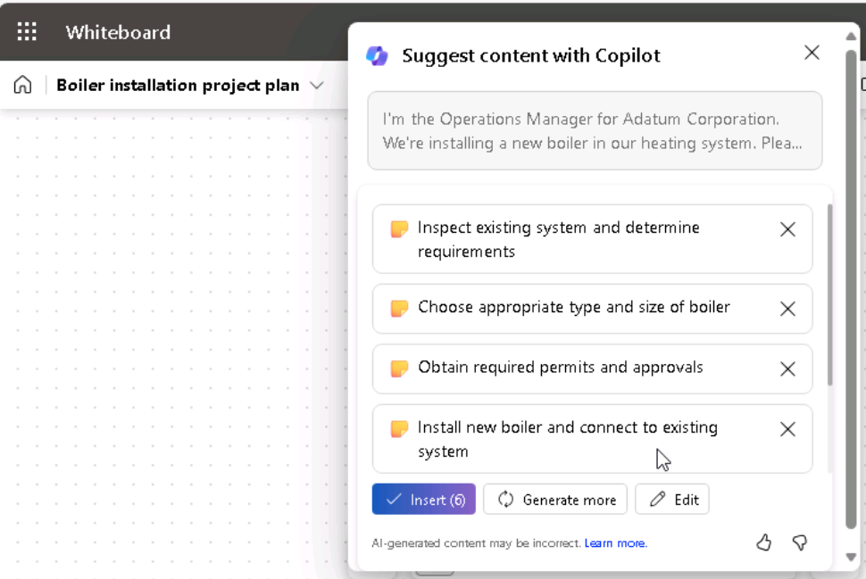
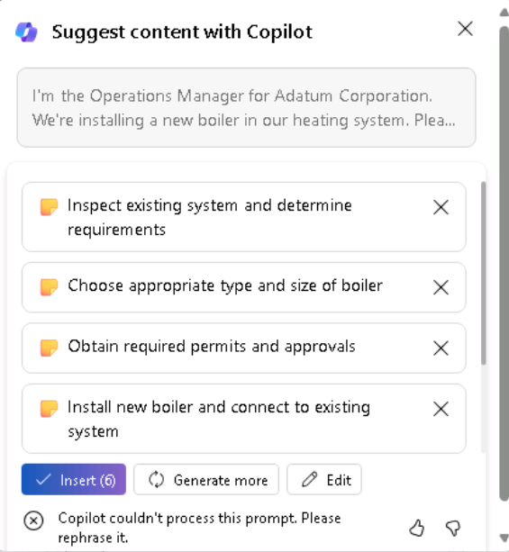

Lab 08: Create conversational actions for Microsoft Copilot (preview) –
Add on lab

Objective:

Microsoft Copilot provides out of the box experiences to engage with
content and resources from across your organization. In some situations,
answers and interaction with external systems are required. With
Microsoft Copilot Studio, you can author a conversational topic that can
be published as a Copilot Plugin. Once your Tenant Admin approves the
Plugin, it can be added to your organization's M365 Chat experiences.

The Plugins will be available in the Microsoft Copilot in production, if
the organization has valid license for the same.

In this lab, we will learn how to create a Conversational action.

## Exercise \#1: Create a Conversational plugin

1.  Login to +++**https://copilotstudio.microsoft.com/**+++ using your
    tenant credentials if not already logged in.

2.  Select **Copilot for Microsoft 365**.

3.  Select **Actions**.

4.  Select **+ Add an action**.

5.  Select **Conversational** in the **New action** pane.

6.  Provide the name for the action as !!**Conversational action**!!.
    Select **Create**.

7.  Once ready, the created action opens in Authoring canvas. Select
    **Topics**.

8.  Name the topic as !!Holidaylist!!

9.  In the Trigger node’s description, provide a clear description of
    how the conversational plugin can help the user and what it can
    do. Let this topic help the user to find the list of holidays in the
    year 2024.

Type +++**This plugin helps to retrieve the list of holidays for the
year 2024.**+++ in the Trigger node’s description.

This description has functional purpose and is used by the Microsoft
Copilot to determine whether to invoke your plugin or not.

10. Add a message node with the list of holidays.

    - New Year's Day - January 1

    - Martin Luther King, Jr.'s Birthday (Third Monday of January) -
      January 15, 2024

    - Washington's Birthday or Presidents' Day (third Monday of
      February) - February 19

    - Memorial Day (last Monday of May) - May 27

    - Juneteenth Day - June 19

    - Independence Day - July 4

    - Labor Day (first Monday of September) - September 2

    - Columbus Day (Second Monday of October) - October 14

    - Veterans Day or Veterans Day - November 11

    - Thanksgiving Day (fourth Thursday of November): November 28

    - Christmas Day - December 25

11. Click on **Save** to save the plugin.

## Exercise \#2: Publishing your conversational action to Microsoft Copilot

1.  Publishing your conversational plugin creates a new plugin in the
    Dataverse registry for your Tenant. Once available there, your
    tenant admin needs to approve your plugin to be available to users
    in the Microsoft Copilot plugins catalog.

2.  Click on **Publish**.

>  alt="A screenshot of a computer Description automatically generated" />

3.  Select **Publish.**

4.  Select **Publish** on **Publish latest content** dialog.

5.  The publish status is shown on the screen.

Note: The publish should complete quickly. The actual availability in
the Microsoft Admin Center can take up to 4 hours.

**Important:** **:** For the admin to get it listed in the admin center,
the company will have to hold a valid Copilot license.

6.  Your Admin can find the **Dataverse and Microsoft Copilot
    Studio** integrated app in the Microsoft Admin Center
    under **Settings**, then **Integrations to be reviewed and
    approved**.

7.  Once your Tenant admin approves the Dataverse and Microsoft Copilot
    Studio integrated app, it should appear in the user's list of
    plugins in their Microsoft Copilot UI.

Summary:

In this lab, we have learnt how to create a conversational action and to
publish it.
