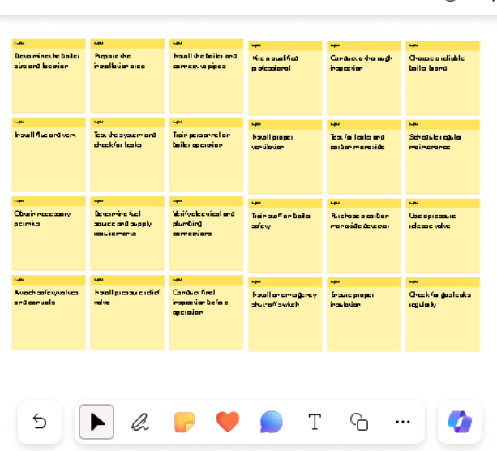

**實驗 08：為您的員工賦能 – Copilot – 運營**

**目的：**

運營經理可以使用適用於 Microsoft 365 的 Copilot
來簡化其工作流程並提高其工作效率。

在本實驗中，您將使用：

- Copilot 在 Whiteboard 中集思廣益，為安裝新鍋爐系統制定項目計劃。

- Word 中的 Copilot 創建一個報告，分析鍋爐與熔爐加熱系統，同時還比較
  Copilot 可以產生的輸出類型。

- PowerPoint 中的
  Copilot，根據您創建的報告創建演示文稿，用於分析鍋爐和熔爐加熱系統。

**練習 #1：使用 Whiteboard 中的 Copilot 集思廣益項目計劃想法**

Microsoft Whiteboard
是一個數字畫布，允許用戶實時協作、集思廣益並輕鬆創建內容。Whiteboard
的功能包括自由格式繪圖、便箋和模板，您可以根據自己的需要對其進行自定義。它還提供了一個空間，您可以將其用於項目、頭腦風暴、研討會、回顧、設計、戰略規劃以及解決可能具有移動部分或需要更多視覺效果的問題。

白板可以幫助提高

- 通過允許多個用戶在數字空間中同時工作來協作，從而輕鬆共享視覺效果和想法。

- 通過提供空間來塗鴉、共享原型草圖或編制產品名稱創意列表，提高工作效率。

作為 Adatum Corporation
的運營經理，您計劃在建築物的供暖系統中安裝一台新鍋爐。但是，在開始安裝過程之前，您需要使用
Whiteboard 中的 Copilot 來建議公司在更新其供暖系統時通常完成的潛在步驟。

在本練習中，您將使用 Whiteboard 中的 Copilot
來建議完成此類安裝所需的步驟。將此練習基本上視為 AI 輔助的便簽練習。

1.  在 Microsoft Edge 瀏覽器中，打開一個新選項卡並輸入以下 URL 以轉到
    Microsoft 365
    主頁：+++[https://www.office.com+++](https://www.office.com+++/)

2.  在 **Microsoft 365** 主頁上，如果左側導航窗格中出現 **Whiteboard**
    圖標，請立即選擇它並繼續下一步。否則，請選擇 “**Explore all your
    Apps**” ，然後在 “**Apps**” 頁上，向下滾動到 “**Explore by
    category**” 部分，然後在 “**Productivity**”
    選項卡（默認情況下應顯示）中選擇 “**Whiteboard**” 。

3.  登錄到 **Microsoft Whiteboard**。

4.  在 **Whiteboard** 主頁上，選擇 **New Whiteboard** （新建白板）。

5.  在頁面頂部的功能區上，選擇 **Whiteboard** 下拉箭頭。在 **Board
    name** 字段中，輸入 **+++Boiler installation project
    plan+++**，然後選擇複選標記圖標。

6.  如果出現 **Suggest content with Copilot**
    窗口，請繼續執行下一步。否則，在頁面底部任務欄上方顯示的圖標託盤中，選擇
    **Copilot** 圖標。在顯示的菜單中，選擇 **Suggest**（建議）。

7.  在 **Suggest content with Copilot** （使用 Copilot 建議內容）
    窗口中，輸入以下提示：

++**I'm the Operations Manager for Adatum Corporation. We're installing
a new boiler in our heating system. Please suggest the steps we should
follow to install the new boiler**.++

8.  如果出現 **Suggest content with Copilot**
    窗口，請繼續執行下一步。但是，如果您收到一條消息，指示 “**Something
    went wrong. Please try again.**“或” **Copilot couldn't process this
    prompt. Please rephrase it.**“，然後選擇 Copilot 窗口下角的
    **Generate suggestions** 箭頭。

有時 Copilot
會完成它正在進行的過程，但在顯示結果之前會有點磕磕絆絆。當您再次選擇
**Generate suggestions** （生成建議）
箭頭時，它通常會毫不延遲地顯示結果。但是，如果您再次收到類似的消息，請再選擇
**Generate suggestions** （生成建議） 箭頭幾次。如果您在嘗試 3 次或 4
次後仍然收到此錯誤，請通過輸入以下文本來簡化提示：

++**Please suggest the steps we should follow to install a new boiler in
our building's heating system**.++

9.  默認情況下，Copilot 以 6 人為一組生成想法。在出現的 **Suggest
    content with Copilot** （使用 Copilot 建議內容）
    窗口中，記下它生成的前六個想法。Copilot 在這裡為您提供了兩個選項 -
    如果您對建議感到滿意，您可以將想法附加到白板上，也可以讓 Copilot
    生成更多建議。請注意**插入 （6）** 按鈕如何指示 Copilot
    生成的想法數量 - 在本例中為 6。

10. 雖然 6
    條建議是一個很好的起點，但您需要更深入地瞭解安裝安全產品所需的任務，因此請選擇
    **Generate more** （生成更多） 按鈕。

**注意：**如果 Copilot 顯示任何類型的錯誤消息，請再次選擇 \*\*Generate
more\*\* 按鈕。每當收到錯誤消息時，請執行此作。

11. 請注意 Copilot 如何生成另外 6 個想法，因此 **Insert （12）**
    按鈕現在顯示
    **12**。雖然您可以不斷產生更多想法，但為了時間，讓我們插入當前提出的
    12 個想法。選擇 **Insert （12）** 按鈕。

12. 當您選擇“**Insert**”按鈕時，Copilot
    會以黃色便簽的形式將建議的想法附加到您的白板上。

13. 與涉及實際便箋的真實頭腦風暴會議一樣，您可以編輯特定便箋、刪除它、鎖定它以備將來刪除等。在
    Microsoft Whiteboard 中，通過標準白板功能支持這些活動。

如果您以前從未使用過
Whiteboard，請嘗試選擇（雙擊）特定筆記，然後在其上方顯示的菜單欄中，您可以選擇
**Edit text** （pencil）
圖標或任何其他選項。選擇菜單欄末尾的省略號圖標將顯示一個包含更多選項的菜單，例如刪除注釋。同樣，Microsoft
Whiteboard
背後的想法是模擬現實世界的便簽練習。您可以根據需要隨意編輯注釋。

14. 在查看建議的想法時，您覺得它們沒有充分涵蓋風險緩解。選擇頁面底部的
    **Copilot** 圖標，然後從菜單中選擇 **Suggest** 。

15. 在出現的 **Suggest content with Copilot** （使用 Copilot 建議內容）
    窗口中，輸入以下提示以生成有關風險緩解的更多想法：

++**Suggest ways to mitigate the risks of installing a new boiler into
the building's heating system**.++

16. 回顧 Copilot 建議的六個想法。您希望 Copilot
    包含更多詳細信息，因此請選擇 **Generate more** （生成更多） 按鈕。

17. 您對 12 個風險緩解想法感到滿意，因此請選擇 **Insert （12）** 按鈕。

18. 請注意 12 個風險緩解想法的塊是如何被選中的（參見外部邊界）。

19. Copilot 將 12 個風險緩解想法部分覆蓋在原來的 12
    個項目計劃想法之上，您可以選擇這個想法塊並在屏幕上移動它，使其不再覆蓋原來的
    12
    個想法。不用擔心將兩個塊排成一排。在後續步驟中將筆記組織成類別後，它們看起來會很漂亮。現在，只需安排每個塊，以便您可以看到所有的想法。這樣做提供了查看
    Copilot
    建議的區域所需的可見性，以便您可以根據需要編輯其中任何一個區域。

20. 現在，您對 Copilot
    創建的建議感到滿意，並且您已完成要對注釋進行的所有編輯。您現在希望
    Copilot 按類別組織注釋。Copilot
    確定類別的名稱並相應地自動組織注釋。選擇頁面底部的 **Copilot**
    圖標，然後從菜單中選擇 **Categorize**。

21. 請注意發生了什麼。Copilot
    生成了一組類別並相應地重新組織了注釋。每個類別的筆記都分配了不同的顏色，以幫助識別類別之間的差異。如果包含注釋的矩形沒有達到應有的大小但仍適合您的屏幕，請選擇頁面右下角的
    **Fit to Screen**
    圖標。這樣做會增加圖像的大小，直到它不能再增加它，而不會超過屏幕大小。

22. 請注意顯示在有序的注釋組下方的圖標託盤。如果您對類別不滿意，請選擇顯示的圖標託盤上的
    **Regenerate** 按鈕。

**注意：**您可以根據需要多次選擇 **Regenerate** 按鈕，直到您對 Copilot
提供的類別感到滿意為止。多次選擇此按鈕，並記下 Copilot
每次所做的更改。除了更改類別名稱外，Copilot
還可以在每次重新生成時添加或減少類別的數量。

23. 在多次重新生成類別後，您意識到您缺少有關最小化系統停機時間的詳細步驟。您想要求
    Copilot
    在您的白板會話中添加更多有關此問題的想法。此外，您確定了一個要刪除的注釋。但是，由於您已經組織了自己的想法，因此必須將白板會話改回對筆記進行分類之前的編輯模式。為此，請選擇
    **Revert** 按鈕。

24. 現在，您已返回到編輯模式，請選擇您不再需要的注釋，然後在顯示的圖標託盤中，選擇省略號圖標。從顯示的菜單中選擇
    **Delete** 。

25. 要讓 Copilot 生成更多想法，請選擇頁面底部的 **Copilot**
    圖標，然後從菜單中選擇 **Suggest**。

26. 在出現的 **Suggest content with Copilot** （使用 Copilot 建議內容）
    窗口中，輸入以下提示以生成有關最大限度地減少系統停機時間的更多想法：

++**Suggest ways to limit heating system downtime when installing a new
boiler**.++

27. 回顧 Copilot 建議的六個想法。您對這些想法感到滿意，因此請選擇
    **Insert （6）** 按鈕。

28. 請注意 6
    個音符的塊是如何用塊周圍有一條線突出顯示的。此注釋塊稱為注釋網格。您可以像白板上的任何其他元素一樣移動筆記網格或調整其大小。調整便箋網格的大小時，其中所有便箋條的大小也會相應調整。如果
    6
    個音符塊覆蓋在其中一個音符塊的頂部，請選擇音符網格周圍的一條外線，然後將整個
    6
    個音符塊拖到一邊，這樣它就不會覆蓋前面的任何音符。如果屏幕上的空間不足，並且塊的一部分從屏幕上掉下來，請選擇頁面右下角的
    **Fit to Screen** 圖標。

29. 您已準備好讓 Copilot 組織便箋，其中包括 18 個便簽 - 一個 12
    個便簽和一個 6 個便簽。選擇頁面底部的 **Copilot**
    圖標，然後從菜單中選擇 **Categorize**。在 **Categorize selected
    notes** （對所選筆記進行分類） 窗口中，選擇 **Categorize** （分類）
    按鈕。

30. 有時，包含注釋的矩形的大小沒有達到應有的大小，從而在畫布周圍留下開放的空白區域。在這種情況下，筆記的文本大小通常很小且難以閱讀。如果出現此大小調整問題，請選擇頁面右下角的
    **Fit to Screen**
    圖標。這樣做會增加圖像的大小。如果繼續選擇此按鈕，它最終會達到一個點，即它無法再增加矩形的大小，而不會超過屏幕大小。進一步選擇此圖標對矩形沒有影響。

31. 查看類別。在矩形下方顯示的 Copilot 圖標託盤中，您可以選擇
    “**Regenerate**” 按鈕以創建一組新的類別。實際上，多次選擇
    **Regenerate** （重新生成）
    按鈕以查看類別如何變化。對結果感到滿意後，選擇 **Keep it** （保留）
    按鈕。

32. 請注意，每個類別的便箋都是不同的顏色。您意識到您希望將頭腦風暴會議的簡短摘要添加到您的白板內容中。為此，請選擇頁面底部的
    **Copilot** 圖標，然後從菜單中選擇 **Summarize**。Copilot
    會生成此白板會話中主要主題的簡短摘要。向下滾動以查看整個 **Summary**
    （摘要） 窗口。您對結果感到滿意，因此請選擇 **Keep it** （保留）。

33. 選擇頁面右下角的 **Fit to Screen**
    圖標，將所有便箋和會話摘要放到整個屏幕上。

**練習 \#2：在 Word 中使用 Copilot 比較報告結果**

作為 Adatum Corporation 的運營經理，您發現當前為該公司擁有 50
年歷史的辦公樓供暖的鍋爐系統需要進行重大維修，甚至徹底更換。您認為這種情況可能是將您的加熱系統從現有鍋爐系統轉換為更節能的爐子系統的合適時機。但是，您不熟悉兩種加熱系統之間的區別。您想在
Word 中使用 Copilot 調查情況並創建可以提交給管理層的報告。

**備註：**您聽說過 Word 中的 Copilot
可以為您生成報告，但您還沒有使用過它。因此，您不確定它提供什麼樣的報告。您不僅想借此機會創建您的報告，還想調查
Copilot 的報告功能。所以，這是您的計劃：

- 您之前確定了希望 Copilot 調查的幾個關於鍋爐與熔爐加熱系統的問題。

- 您計劃讓 Copilot 創建一個涵蓋所有這些問題的報告。

- 然後，您計劃單獨詢問 Copilot 每個問題，以便您可以看到每個回答。

- 然後，您可以將 Copilot
  創建的報告與它為每個問題生成的單個答案進行比較。在後一種情況下，您可以根據需要將每個答案複製並粘貼到文檔中，以創建自己的報表，或補充現有文檔。

本練習的目的是展示 Word 中的 Copilot
如何根據您使用的形式提供不同級別的響應 - 在 Copilot
窗格中或在創建新文檔時。

1.  如果您在 Edge 瀏覽器中打開了 Microsoft 365
    選項卡，請立即選擇它;否則，請打開一個新選項卡並輸入以下
    URL：+++[https://www.office.com+++](https://www.office.com+++/)

注意：您需要使用右側 “**Resources**” 選項卡下提供的 **Microsoft 365
憑據**登錄（如果出現提示）。

2.  考慮到您的計劃，您決定首先在 Word 中使用 Copilot
    來創建解決您所有問題的報告。在 **Microsoft 365** 導航窗格中，選擇
    **Microsoft Word**，然後打開一個空白文檔。

3.  在空白文檔頂部顯示的 **Draft with Copilot**
    窗口中，輸入以下提示並選擇 **Generate** 按鈕：

+++I'm the Operations Manager for Adatum Corporation. We're thinking
about possibly replacing our building's current boiler system with a
furnace system. Write a report describing what type of boiler systems
are used in most commercial buildings, and include what considerations I
need to take into account to change from an existing boiler system to a
furnace system, the average cost of transitioning from a boiler system
to a furnace system in a commercial two-story building built in the
1970s, whether changing from a boiler system to a furnace system will
have any effect on our current air conditioning system, and the average
defect rates for boiler systems versus furnace systems.+++

4.  查看 Copilot
    生成的報告。請注意每個感興趣領域的細節級別。由於您要保存此文檔以供下一個用例練習使用，因此請選擇
    Copilot 託盤上的 **Keep it** 按鈕，然後保存文檔。

**注意：**請確保保存報告，因為您將在下一個練習中使用它。

5.  您輸入的用於創建報告的提示包括 5 個請求。您現在想單獨詢問 Copilot
    這五個問題中的每一個。在 Word 功能區上選擇 **Copilot**，這將打開
    **Copilot** 窗格。

6.  在 **Copilot** 窗格底部的提示字段中，輸入以下問題，然後選擇 **Send**
    箭頭：

+++What type of boilers do most buildings use as part of their heating
systems?+++

7.  查看答案。如果要將響應粘貼到文檔中，可以選擇 **Copy** （複製）
    選項，但對於此培訓，您只需選擇更多提示即可查看收到的響應。

8.  為其餘四個問題中的每一個輸入單獨的提示：

    - **What considerations do I need to take into account to change
      from an existing boiler system to a furnace system in a commercial
      building?**

    - **What is an average cost for transitioning from a boiler system
      to a furnace system in a commercial two-story building built in
      the 1970s?**

    - **if we change from a boiler system to a furnace system, will it
      have any effect on our current air conditioning system?**

    - **What are the average defect rates for boiler systems versus
      furnace systems?**

9.  請注意 Copilot
    如何回答您的每個問題，但它沒有將任何答案插入到當前文檔中。雖然您可以將每個答案複製並粘貼到文檔中，但很明顯，僅讓
    Copilot 創建報告效率更高。

10. 以下是一些提示，可以反映您在 Word 中使用 Copilot 時的響應

    - 每種報告方法的信息水平如何？

將 Word 中的 Copilot 創建報告時提供的信息級別與您在 Copilot
窗格中單獨提問時提供的信息級別進行比較。

- 你注意到了什麼？

當您要求 Copilot
創建報告時，它通常會提供更豐富的響應，並將其組織成一個有吸引力的報告。相反，當您要求
Copilot 在 Copilot
窗格中單獨回答問題時，它不會返回報告的詳細級別，儘管它允許您將響應複製並粘貼到文檔中。但是，這樣做可能需要您重新格式化插入的答案以清理任何格式問題。

**練習 \#3：在 PowerPoint 中使用 Copilot 創建比較供暖系統的演示文稿**

熟練在 PowerPoint 中使用 Copilot
是旨在提升其演示文稿影響力的專業人士的一項戰略技能。PowerPoint 中的
Copilot 充當智能協作者，在運營經理製作演示文稿時提供實時建議和增強功能。

作為 Adatum Corporation 的運營經理，您發現當前為該公司擁有 50
年歷史的辦公樓供暖的鍋爐系統需要進行重大維修，甚至徹底更換。您覺得此時機可能是將您的供暖系統從現有鍋爐系統轉換為更節能的爐子系統的合適時機。

在本練習中，您將要求 PowerPoint 中的 Copilot
根據**比較鍋爐和熔爐加熱系統**報告創建演示文稿。您的目標是讓 Adatum
的管理團隊快速瞭解這兩種類型的供暖系統，包括每種系統的優缺點，然後再聯繫供暖、通風和空調
（HVAC） 公司並正式開始此項目。

1.  如果您在 **Microsoft Edge** 瀏覽器中打開了 Microsoft 365
    選項卡，請立即選擇它; 否則，請打開一個新選項卡並輸入以下
    URL：+++[https://www.office.com+++](https://www.office.com+++/) 以轉到
    Microsoft 365 主頁。

**注意：**您需要使用右側 “**Resources**” 選項卡下提供的 **Microsoft 365
憑據**登錄（如果出現提示）。

2.  在 **Microsoft 365** 導航窗格中，選擇 **OneDrive** 將其打開。

3.  瀏覽到 **C：\LabFiles** 文件夾，選擇比較 **Comparing boiler and
    furnace heating systems report** 文檔並將其副本上傳到 **OneDrive**。

**提示：** 打開並關閉文件以將其放入您的最近使用 （MRU） 文件列表中。

**注意：**如果您已按照**準備實驗室執行**部分中的建議將所有實驗室資產上傳到
OneDrive，則可以跳過此步驟。

4.  在 **Microsoft 365** 主頁上，選擇左側導航窗格中的 **PowerPoint**
    圖標。

5.  在 **PowerPoint** 中，打開一個新的空白演示文稿。

6.  選擇 **Copilot** 圖標（如屏幕截圖所示以紅色突出顯示）..

7.  在顯示的 **Copilot** 窗格中，有幾個預定義的提示可供您選擇。選擇
    **Create presentation from file** 提示。 
    

8.  在 **Copilot** 窗格底部的提示字段中，Copilot
    會自動輸入文本：**Create presentation from file /**。正斜杠是通用的
    Copilot 指示器，用於輸入文件的鏈接。在這種情況下，它會觸發 Copilot
    打開一個 **Suggestions** 窗口，其中顯示最近使用的三個文件。

- 如果您的文件顯示在此處，請立即選擇它並繼續下一步。

- 如果該文件不是顯示的三個文件之一，請選擇 **Suggestions** （建議）
  窗口右上角的向右箭頭 （\>） 以查看展開的 MRU
  文件列表。如果文件顯示在此處，請立即選擇它並繼續下一步。

- 如果您在展開的 MRU
  列表中沒有看到您的文件，則必須複製報告的鏈接並將其粘貼到提示字段中。為此，請執行以下作：

  1.  選擇 **Microsoft 365** 瀏覽器選項卡，然後在導航窗格中選擇
      **Word**。

  2.  在 **Word** 主頁的最近打開的文件列表中，選擇報表以在 Word
      中打開它。

  3.  在 Word 的報表中，在功能區上方的最右側，選擇 “**Share**”
      按鈕。在顯示的下拉菜單中，選擇 **Copy Link**。等待 **Link copied**
      （鏈接已複製）
      窗口出現，這是您確信文件的鏈接已複製到剪貼板的保證。

  4.  切換到 **PowerPoint** 選項卡，在 **Copilot**
      窗格的底部，提示字段應仍顯示 **Create presentation from file
      /**。將光標置於正斜杠 （**/**） 之後，然後粘貼到 （**Ctrl+V**）
      報表的鏈接。

9.  請注意文件在提示字段中的顯示方式。選擇提示字段中的 **Send** 圖標。

10. 此提示觸發 Copilot 根據文檔創建幻燈片演示文稿。在此過程中，它首先在
    Copilot
    窗格中顯示演示文稿的大綱。然後，它顯示一個單獨的窗口，其中顯示了它根據文檔對演示文稿所做的一些更改的項目符號列表。

11. 您現在可以自由地查看幻燈片並進行任何必要的更新。請特別注意 Copilot
    根據文檔所做的更改。您可以使用 **Designer** 工具調整佈局。

12. 查看 Copilot
    添加到演示文稿中每張幻燈片的演講者備註。驗證他們指出了您希望在演示過程中提出的觀點。

13. 嘗試使用 Copilot
    更新演示文稿。讓我們從向幻燈片添加圖像開始。找到一張沒有圖像的幻燈片，然後輸入以下提示（不要忘記將
    \[在此處輸入幻燈片編號\] 替換為您選擇的幻燈片編號）：

++**Add an image to slide \[enter slide number here\]**. **The image
should contain a picture related to the slide contents**.++

14. 您還注意到，演示文稿中沒有任何與每種加熱系統的預期使用壽命相關的內容。您希望
    Copilot 研究此主題，然後將其添加到演示文稿中。輸入以下提示：

++**What is the average lifespan of a boiler heating system versus a
furnace heating system**?++

15. 您現在希望 Copilot
    將此內容添加到幻燈片中。選擇演示文稿開頭的幻燈片，其中列出了鍋爐系統的類型。然後輸入以下提示（不要忘記將
    \[在此處輸入幻燈片編號\] 替換為您選擇的幻燈片編號）：

++**Add this lifespan content to slide \[enter slide number here\]**.++

16. Copilot 是做什麼的？它是否做了一些事情，比如將 “Lifespan content”
    添加到幻燈片的頂部，將其覆蓋在幻燈片上的現有內容之上？還是它做了類似的事情？

17. 提示未按預期工作。刪除添加到幻燈片中的任何內容。

18. 現在再試一次，但這次讓 Copilot
    找到生命週期內容並將其添加到幻燈片中，所有這些都在一個提示中完成。這一次，請輸入以下提示符：

++**Add content about the average lifespan of a boiler heating system
versus a furnace heating system to slide \[enter slide number
here\].**++

19. 這效果更好嗎？如果 Copilot
    沒有完全按照您的要求執行，您只需重新設計提示。

20. 您注意到，問答 （Q&A）
    會話的末尾沒有幻燈片。要更正此情況，請輸入以下提示符：

++**Add a Q&A slide at the very end of the presentation with an
appropriate image**.++

21. 查看已創建的新幻燈片。看到此幻燈片後，您希望 Copilot
    創建一個可能的問題列表，並將它們添加到 Q&A
    幻燈片的演講者備註中。輸入以下提示：

++**Create a list of five questions that may be asked during the Q&A
session and add them to the speaker notes in the Q&A slide**.++

22. 當您嘗試此提示時，Copilot 如何響應？它是否在 Q&A
    幻燈片的演講者備註中添加了五個問題？如果是這樣，那麼恭喜！

**注意：**Copilot 可能會顯示一些異常（請記住，Copilot
仍在進行中），如下所示。

請嘗試改寫提示或使用建議的提示，如下所示。

23. 選擇命令 **Add a slide about** 並在**演示文稿的最後附加以下
    Q&A**（如屏幕截圖所示）

24. 單擊 Send 以檢查會發生什麼。

Copilot 已按照說明添加了 Q&A 幻燈片。

25. 現在嘗試使用另一個提示：

**添加一張幻燈片，**說明觀眾可能會詢問的有關演示文稿的問題

26. 完成最終演示後，您可以保存以備將來參考或放棄此演示文稿。

**總結：**

在本實驗中，您使用了：

- Whiteboard 中的 Copilot
  用於生成和組織安裝新鍋爐系統的項目計劃想法，促進協作和創造性規劃。

- Word 中的 Copilot 創建詳細報告並比較 Copilot
  可以生成的輸出類型，展示其在內容創建方面的多功能性。
