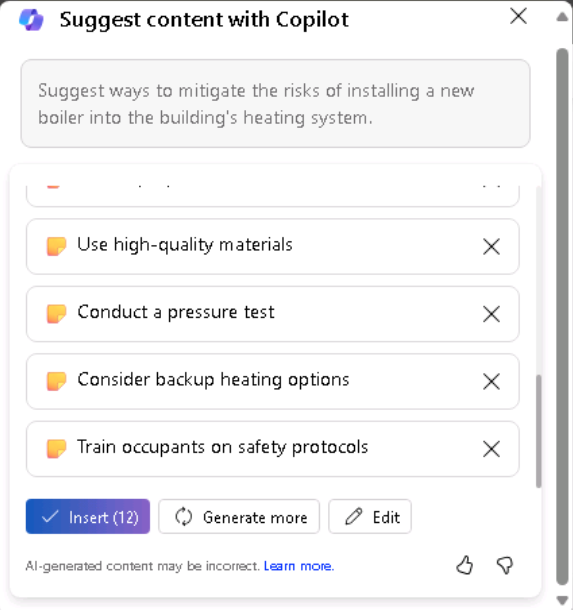
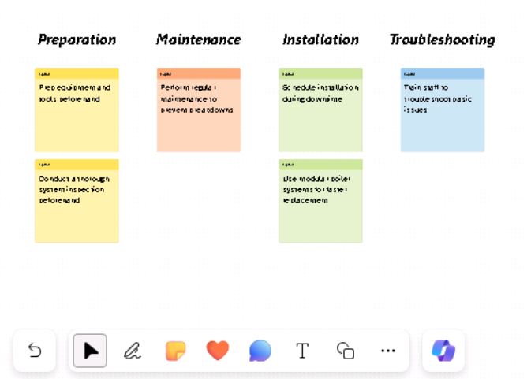
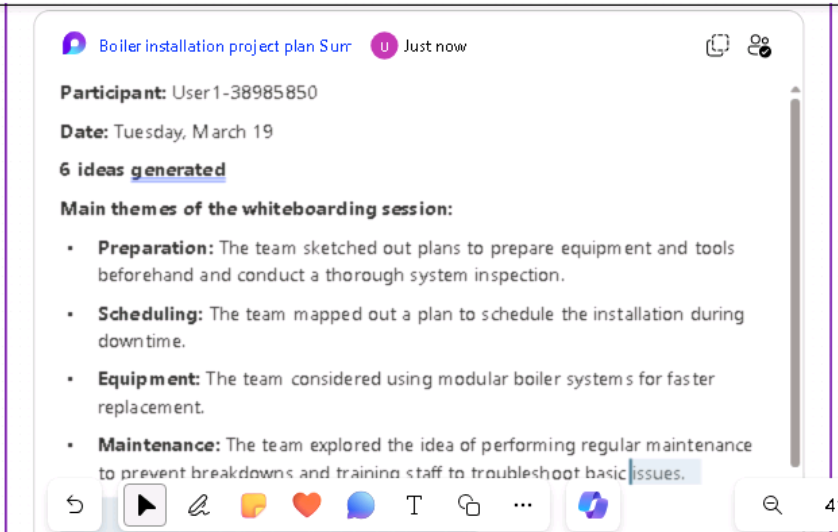
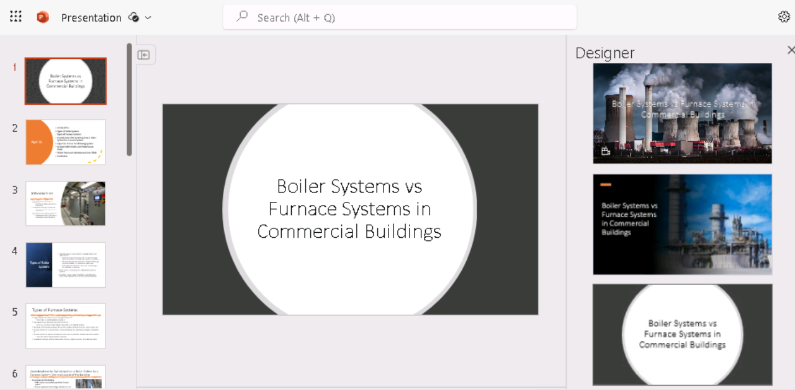
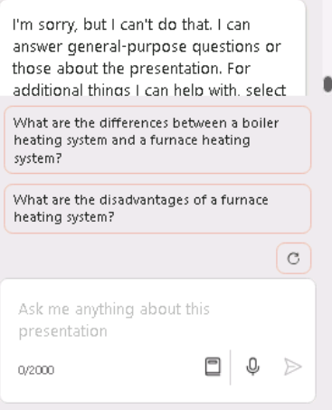

**Lab 08: Potenzia la tua forza lavoro – Copilot – Operazioni**

**Obiettivo:**

I responsabili delle operazioni possono utilizzare Copilot per Microsoft
365 per semplificare il flusso di lavoro e migliorare la produttività.

In questo laboratorio utilizzerai:

- Copilot in Whiteboard per fare un brainstorming di idee di piano di
  progetto per l'installazione di un nuovo sistema di caldaie.

- Copilot in Word per creare un report che analizzi i sistemi di
  riscaldamento della caldaia rispetto a quelli del forno, confrontando
  anche i tipi di output che Copilot può generare.

- Copilot in PowerPoint per creare una presentazione basata sul report
  creato che analizza i sistemi di riscaldamento di caldaie e forni.

**Esercizio \#1: Brainstorming di idee per il piano di progetto
utilizzando Copilot nella lavagna**

Microsoft Whiteboard è un'area di disegno digitale che consente agli
utenti di collaborare in tempo reale, fare brainstorming di idee e
creare contenuti con facilità. Le funzionalità della lavagna includono
disegno a mano libera, note adesive e modelli che puoi personalizzare in
base alle tue esigenze. Fornisce inoltre uno spazio che puoi utilizzare
per progetti, brainstorming, workshop, retrospettive, progettazione,
pianificazione strategica e per risolvere problemi che potrebbero avere
pezzi in movimento o richiedere più immagini.

La lavagna può aiutare ad aumentare

- Collaborazione consentendo a più utenti di lavorare contemporaneamente
  in uno spazio digitale, semplificando la condivisione di immagini e
  idee.

- Produttività fornendo uno spazio per scarabocchiare, condividere
  schizzi di prototipi o compilare un elenco di idee per il nome dei
  prodotti.

In qualità di Operations Manager di Adatum Corporation, stai
pianificando di installare una nuova caldaia nel sistema di
riscaldamento del suoi edificio. Tuttavia, prima di iniziare il processo
di installazione, si desidera utilizzare Copilot in Whiteboard per
suggerire i potenziali passaggi che le aziende in genere completano
durante l'aggiornamento del proprio sistema di riscaldamento.

In questo esercizio, utilizzerai Copilot in Whiteboard per suggerire i
passaggi necessari per completare tale installazione. Pensa a questo
esercizio come fondamentalmente a un esercizio di note adesive assistito
dall AI.

1.  Nel browser Microsoft Edge aprire una nuova scheda e immettere l'URL
    seguente per accedere alla home page di Microsoft 365:
    +++[https://www.office.com+++](https://www.office.com+++/)

2.  Nella home page di **Microsoft 365**, se viene visualizzata un'icona
    della **Whiteboard** nel riquadro di spostamento a sinistra,
    selezionala ora e procedi al passaggio successivo. In caso
    contrario, seleziona **Explore all your Apps** e nella pagina
    **App** scorri verso il basso fino alla sezione **Explore by
    category** e nella scheda **Productivity** (che dovrebbe essere
    visualizzata per impostazione predefinita) seleziona **Whiteboard**.

3.  Accedi a **Microsoft Whiteboard**.

4.  Nella home page della Whiteboard , selezionare **New Whiteboard**.

5.  Sulla barra multifunzione nella parte superiore della pagina
    selezionare la freccia a discesa **Whiteboard**. Nel campo **Board
    name**, inserisci +++**Boiler installation project plan**+++, quindi
    seleziona l'icona del segno di spunta.

6.  Se viene visualizzata la finestra **Suggest content with Copilot**,
    procedere al passaggio successivo. In caso contrario, nella barra
    delle icone visualizzata sopra la barra delle applicazioni nella
    parte inferiore della pagina, selezionare l'icona **Copilot**. Nel
    menu visualizzato, seleziona **Suggest**.

7.  Nella finestra **Suggest content with Copilot**, immettere il
    seguente messaggio di richiesta:

++**I'm the Operations Manager for Adatum Corporation. We're installing
a new boiler in our heating system. Please suggest the steps we should
follow to install the new boiler**.++

8.  Se viene visualizzata la finestra **Suggest content with Copilot**,
    procedere al passaggio successivo. Tuttavia, se ricevi un messaggio
    che indica che "**Something went wrong. Please try again**" o
    "**Copilot couldn't process this prompt. Please rephrase it.**",
    quindi selezionare la freccia **Generate suggestions** nell'angolo
    inferiore della finestra di Copilot.

A volte Copilot completa il processo su cui sta lavorando, ma inciampa
un po' prima di visualizzare i risultati. Quando si seleziona nuovamente
la freccia **Generate suggestions**, in genere vengono visualizzati i
risultati senza molto ritardo. Tuttavia, se ricevi un messaggio simile
una seconda volta, seleziona la freccia **Generate suggestions** ancora
un paio di volte. Se continui a ricevere questo errore dopo tre o
quattro tentativi, semplifica il prompt inserendo il seguente testo:

++**Please suggest the steps we should follow to install a new boiler in
our building's heating system**.++

9.  Per impostazione predefinita, Copilot genera idee in gruppi di sei.
    Nella finestra **Suggest content with Copilot** visualizzata,
    prendere nota delle prime sei idee generate. Copilot ti offre due
    opzioni qui: puoi allegare le idee alla tua lavagna se sei
    soddisfatto dei suggerimenti, oppure puoi fare in modo che Copilot
    generi più suggerimenti. Si noti come il pulsante **Insert (6)**
    indichi il numero di idee generate da Copilot, in questo caso 6.

10. Sebbene sei suggerimenti siano un buon punto di partenza, è
    necessario approfondire le attività necessarie per installare il
    prodotto di sicurezza, quindi selezionare il pulsante **Generate
    more**.

**Nota**: se Copilot visualizza un messaggio di errore di qualsiasi
tipo, selezionare nuovamente il pulsante \*\*Genera altro\*\*. Fallo
ogni volta che ricevi un messaggio di errore.

11. Si noti come Copilot abbia generato altre sei idee, quindi il
    pulsante **Insert (12)** ora visualizza **12**. Anche se puoi
    continuare a generare altre idee, per motivi di tempo, inseriamo le
    12 idee attualmente presentate. Selezionare il pulsante **Insert
    (12).**

12. Quando si seleziona il pulsante **Insert,** Copilot allega le idee
    suggerite alla lavagna sotto forma di note adesive gialle.

13. Come con una sessione di brainstorming nel mondo reale che coinvolge
    note adesive reali, puoi modificare una nota particolare,
    eliminarla, bloccarla dalla rimozione futura e così via. In
    Microsoft Whiteboard, queste attività sono supportate tramite la
    funzionalità di lavagna standard.

Se non hai mai usato Whiteboard prima, prova a selezionare (doppio clic)
una nota specifica, quindi nella barra dei menu che appare sopra di
essa, puoi selezionare l' icona **Edit text** (matita) o una qualsiasi
delle altre opzioni. Selezionando l'icona con i puntini di sospensione
alla fine della barra dei menu viene visualizzato un menu con altre
opzioni, come l'eliminazione della nota. Ancora una volta, l'idea alla
base di Microsoft Whiteboard è quella di imitare gli esercizi di note
adesive del mondo reale. Sentiti libero di modificare una nota come
desideri.

14. Esaminando le idee suggerite, si ha la sensazione che non coprano
    adeguatamente la mitigazione del rischio. Seleziona l' icona
    **Copilot** nella parte inferiore della pagina, quindi seleziona
    **Suggest** dal menu.

15. Nella finestra **Suggest content with Copilot** visualizzata,
    immettere il seguente prompt per generare ulteriori idee sulla
    mitigazione dei rischi:

++**Suggest ways to mitigate the risks of installing a new boiler into
the building's heating system**.++

16. Rivedi le sei idee suggerite da Copilot. Si desidera che Copilot
    includa ulteriori dettagli, quindi selezionare il pulsante
    **Generate more**.

17. Sei soddisfatto delle 12 idee per la mitigazione del rischio, quindi
    seleziona il pulsante **Insert (12**).

18. Si noti come viene selezionato il blocco di 12 idee di mitigazione
    del rischio (vedi il bordo esterno).

19. Copilot sovrappone le 12 idee di mitigazione del rischio
    parzialmente sopra le 12 idee del piano di progetto originali, è
    possibile selezionare questo blocco di idee e spostarlo sullo
    schermo in modo che non si sovrapponga più alle 12 idee originali.
    Non preoccuparti di allineare i due blocchi. Una volta organizzate
    le note in categorie in un passaggio successivo, avranno un aspetto
    bello e carino. Per ora, basta organizzare ogni blocco in modo da
    poter vedere tutte le idee. In questo modo si ottiene la visibilità
    necessaria per vedere quali aree Copilot ha proposto in modo da
    poterle modificare se lo si desidera.

20. A questo punto si è soddisfatti dei suggerimenti creati da Copilot e
    sono state completate tutte le modifiche che si desidera apportare
    alle note. A questo punto si desidera che Copilot organizzi le note
    per categoria. Copilot determina i nomi delle categorie e organizza
    automaticamente le note di conseguenza. Seleziona l' icona
    **Copilot** nella parte inferiore della pagina, quindi seleziona
    **Categorize** dal menu.

21. Notate cosa è successo. Copilot ha generato una serie di categorie e
    ha riorganizzato le note di conseguenza. A ogni categoria di note è
    stato assegnato un colore diverso per aiutare a identificare le
    differenze tra le categorie. Se il rettangolo contenente le note non
    è grande come potrebbe essere e si adatta comunque allo schermo,
    seleziona l' icona **Fit to Screen** nell'angolo in basso a destra
    della pagina. In questo modo si aumenta la dimensione dell'immagine
    fino a quando non è più possibile aumentarla senza che superi le
    dimensioni dello schermo.

22. Notare la barra delle icone che appare sotto il gruppo organizzato
    di note. Se non sei soddisfatto delle categorie, seleziona il
    pulsante **Regenerate** nella barra delle icone che appare.

**Nota**: è possibile selezionare il pulsante **Regenerate** tutte le
volte che è necessario fino a quando non si è soddisfatti delle
categorie fornite da Copilot. Selezionare questo pulsante più volte e
prendere nota delle modifiche apportate da Copilot ogni volta. Oltre a
modificare i nomi delle categorie, Copilot può aggiungere o ridurre il
numero di categorie a ogni rigenerazione.

23. Dopo aver rigenerato le categorie più volte, ci si rende conto che
    mancano passaggi dettagliati relativi alla minimizzazione dei tempi
    di inattività del sistema. Vuoi chiedere a Copilot di aggiungere
    altre idee alla tua sessione sulla lavagna riguardo a questo
    problema. Inoltre, hai identificato una nota che desideri rimuovere.
    Tuttavia, poiché hai già organizzato le tue idee, devi riportare la
    sessione della lavagna alla modalità di modifica in cui ti trovavi
    prima di classificare le note. A tale scopo, selezionare il pulsante
    **Revert**.

24. Ora che sei tornato alla modalità di modifica, seleziona una nota
    che non desideri più, quindi nella barra delle icone visualizzata,
    seleziona l'icona con i puntini di sospensione. Seleziona **Delete**
    dal menu visualizzato.

25. Per fare in modo che Copilot generi altre idee, seleziona l' icona
    **Copilot** nella parte inferiore della pagina, quindi seleziona
    **Suggest** dal menu.

26. Nella finestra **Suggest content with Copilot** visualizzata,
    immettere il seguente prompt per generare ulteriori idee su come
    ridurre al minimo i tempi di inattività del sistema:

++**Suggest ways to limit heating system downtime when installing a new
boiler**.++

27. Rivedi le sei idee suggerite da Copilot. Sei soddisfatto di queste
    idee, quindi seleziona il pulsante **Insert** (6).

28. Si noti come il blocco di sei note sia evidenziato con una linea
    attorno al blocco. Questo blocco di note è noto come griglia di
    note. Puoi spostare o ridimensionare una griglia di note proprio
    come qualsiasi altro elemento sulla lavagna. Quando si ridimensiona
    una griglia di note, le dimensioni di tutte le note adesive al suo
    interno si regolano di conseguenza. Se il blocco di sei note si
    sovrappone a uno dei blocchi di note, seleziona una delle linee
    esterne attorno alla griglia delle note e trascina l'intero blocco
    di sei note di lato in modo che non si sovrapponga a nessuna delle
    note precedenti. Se esaurisci lo spazio sullo schermo e parte del
    blocco cade dallo schermo, seleziona l' icona **Fit to Screen**
    nell'angolo in basso a destra della pagina.

29. Sei pronto per fare in modo che Copilot organizzi le note adesive,
    che includono 18 note: un blocco di 12 note e un blocco di sei note.
    Seleziona l' icona **Copilot** nella parte inferiore della pagina,
    quindi seleziona **Categorize** dal menu. Nella finestra
    **Categorize selected notes**, selezionare il pulsante
    **Categorize**.

30. A volte, il rettangolo contenente le note non è dimensionato come
    potrebbe essere, lasciando uno spazio bianco aperto tutt'intorno
    alla tela. In questa situazione, la dimensione del testo delle note
    è spesso piccola e difficile da leggere. Se si verifica questo
    problema di dimensionamento, seleziona l' icona **Fit to Screen**
    nell'angolo in basso a destra della pagina. In questo modo si
    aumentano le dimensioni dell'immagine. Se si continua a selezionare
    questo pulsante, alla fine raggiunge un punto in cui non è più
    possibile aumentare le dimensioni del rettangolo senza che superi le
    dimensioni dello schermo. Qualsiasi ulteriore selezione di questa
    icona non ha alcun effetto sul rettangolo.

31. Rivedi le categorie. Nella barra delle icone di Copilot visualizzata
    sotto il rettangolo, è possibile selezionare il pulsante
    **Regenerate** per creare un nuovo set di categorie. Infatti,
    seleziona più volte il pulsante **Regenerate** per vedere come
    cambiano le categorie. Una volta che sei soddisfatto dei risultati,
    seleziona il pulsante **Keep it**.

32. Nota come ogni categoria di note adesive sia di un colore diverso.
    Ti rendi conto che vorresti aggiungere un breve riassunto della
    sessione di brainstorming al contenuto della tua lavagna. A tale
    scopo, selezionare l' icona **Copilot** nella parte inferiore della
    pagina, quindi selezionare **Summarize** dal menu. Copilot genera un
    breve riassunto dei temi principali di questa sessione di lavagna.
    Scorri verso il basso per rivedere l'intera finestra **Summarize**.
    Sei soddisfatto dei risultati, quindi seleziona **Keep it**.

33. Seleziona l' icona **Fit to Screen** nell'angolo in basso a destra
    della pagina per adattare tutte le note adesive e il riepilogo della
    sessione all'intero schermo.

**Esercizio \#2: Confrontare i risultati della creazione di report con
Copilot in Word**

In qualità di Operations Manager di Adatum Corporation, hai scoperto che
l'attuale sistema di caldaie che riscalda l'edificio per uffici
dell'azienda, vecchio di 50 anni, necessita di una riparazione
significativa, se non di una sostituzione completa. Senti che questa
situazione potrebbe essere il momento opportuno per convertire il suoi
sistema di riscaldamento dal sistema di caldaie esistente a un sistema
di forni più efficiente dal punto di vista energetico. Tuttavia, non
conosci le differenze tra i due tipi di sistemi di riscaldamento. Vuoi
indagare sulla situazione con Copilot in Word e creare un rapporto che
puoi presentare alla direzione.

**Nota**: Hai sentito che Copilot in Word può generare report per te, ma
non lo hai ancora usato. Pertanto, non sei sicuro del tipo di
reportistica che fornisce. Vuoi cogliere questa opportunità non solo per
creare il suoi report, ma anche per esaminare le funzionalità di
reporting di Copilot. Quindi, ecco il suoi piano:

- In precedenza sono state identificate diverse domande che si desidera
  che Copilot esamini in merito ai sistemi di riscaldamento della
  caldaia rispetto a quelli del forno.

- Prevedi di fare in modo che Copilot crei un report che copra tutte
  queste domande.

- Quindi prevedi di porre a Copilot ciascuna di queste domande
  individualmente in modo da poter vedere ogni risposta.

- È quindi possibile confrontare il report creato da Copilot con le
  singole risposte generate per ogni domanda. In quest'ultimo scenario,
  è possibile copiare e incollare ogni risposta in un documento per
  creare un report personalizzato, se lo si desidera, o per integrare un
  documento esistente.

Lo scopo di questo esercizio è mostrare come Copilot in Word fornisca un
livello di risposta diverso a seconda della modalità utilizzata, nel
riquadro Copilot o durante la creazione di un nuovo documento.

1.  Se hai una scheda di Microsoft 365 aperta nel browser Edge,
    selezionala ora; in caso contrario, apri una nuova scheda e
    inserisci il seguente URL:
    +++[https://www.office.com+++](https://www.office.com+++/)

Nota: è necessario accedere (se richiesto) utilizzando le di **Microsoft
365 Credentials** fornite nella scheda **Resources** a destra.

2.  Tenendo presente il suoi piano, decidi di utilizzare prima Copilot
    in Word per creare un report che risponda a tutte le tue domande.
    Nel riquadro di spostamento di **Microsoft 365** selezionare
    **Microsoft Word,** e quindi aprire un documento vuoto.

3.  Nella finestra **Draft with Copilot** visualizzata nella parte
    superiore del documento vuoto, immettere il seguente messaggio di
    richiesta e selezionare il pulsante **Generate**:

+++I'm the Operations Manager for Adatum Corporation. We're thinking
about possibly replacing our building's current boiler system with a
furnace system. Write a report describing what type of boiler systems
are used in most commercial buildings, and include what considerations I
need to take into account to change from an existing boiler system to a
furnace system, the average cost of transitioning from a boiler system
to a furnace system in a commercial two-story building built in the
1970s, whether changing from a boiler system to a furnace system will
have any effect on our current air conditioning system, and the average
defect rates for boiler systems versus furnace systems +++

4.  Esaminare il report generato da Copilot. Prendi nota del livello di
    dettaglio in ogni area di interesse. Poiché si desidera salvare il
    documento per il successivo esercizio del caso d'uso, selezionare il
    pulsante **Keep it** nella barra delle applicazioni del copilota,
    quindi salvare il documento.

**Nota**: Assicurati di salvare il rapporto poiché lo utilizzerai nel
prossimo esercizio.

5.  La richiesta immessa per creare il report includeva cinque
    richieste. A questo punto è necessario porre a Copilot ciascuna di
    queste cinque domande singolarmente. Selezionare **Copilot** sulla
    barra multifunzione di Word, che apre il riquadro **Copilot**.

6.  Nel riquadro **Copilot**, nel campo del prompt nella parte inferiore
    del riquadro, immettere la seguente domanda e quindi selezionare la
    freccia **Send**:

+++What type of boilers do most buildings use as part of their heating
systems?+++

7.  Rivedi la risposta. Sebbene sia possibile selezionare l' opzione
    **Copy** se si desidera incollare la risposta nel documento, per
    questa formazione è sufficiente selezionare più prompt per
    visualizzare le risposte ricevute.

8.  Inserisci prompt separati per ciascuna delle quattro domande
    rimanenti:

    - **Quali considerazioni devo tenere in considerazione per passare
      da un sistema di caldaie esistente a un sistema di forni in un
      edificio commerciale?**

    - **Qual è il costo medio per il passaggio da un sistema di caldaie
      a un sistema di forni in un edificio commerciale a due piani
      costruito negli anni '1970?**

    - **Se passiamo da un sistema di caldaie a un sistema di forni, avrà
      qualche effetto sul nostro attuale sistema di condizionamento
      dell'aria?**

    - **Quali sono i tassi medi di difetti per i sistemi di caldaie
      rispetto ai sistemi di forni?**

9.  Si noti che Copilot ha risposto a ciascuna delle domande, ma non ha
    inserito alcuna delle risposte nel documento corrente. Sebbene sia
    possibile copiare e incollare ogni risposta nel documento, sembra
    evidente che la creazione del report da parte di Copilot sia più
    efficiente.

10. Di seguito sono riportati alcuni suggerimenti per riflettere sulle
    risposte quando è stato utilizzato Copilot in Word

    - Qual è il livello di informazioni per ciascun metodo di
      segnalazione rispetto all'altro?

Confrontare il livello di informazioni fornite quando Copilot in Word ha
creato un report con le risposte fornite quando sono state poste le
domande singolarmente nel riquadro Copilot.

- Cosa hai notato?

Quando si chiede a Copilot di creare un report, di solito fornisce
risposte più complete che vengono organizzate in un report dall'aspetto
accattivante. Al contrario, quando si chiede a Copilot di rispondere
alle domande singolarmente nel riquadro di Copilot, non viene restituito
il livello di dettaglio del report, anche se consente di copiare e
incollare le risposte in un documento. Tuttavia, in questo modo potrebbe
essere necessario riformattare le risposte inserite per eliminare
eventuali problemi di formattazione.

**Esercizio \#3: Creare una presentazione che confronta i sistemi di
riscaldamento utilizzando Copilot in PowerPoint**

La competenza nell'uso di Copilot in PowerPoint è un'abilità strategica
per i professionisti che mirano ad aumentare l'impatto delle loro
presentazioni. Copilot in PowerPoint funge da collaboratore
intelligente, offrendo suggerimenti e miglioramenti in tempo reale
mentre i responsabili delle operazioni creano le loro presentazioni.

In qualità di Operations Manager di Adatum Corporation, hai scoperto che
l'attuale sistema di caldaie che riscalda l'edificio degli uffici
dell'azienda, vecchio di 50 anni, necessita di una riparazione
significativa, se non di una sostituzione completa. Senti che questo
momento potrebbe essere il momento opportuno per convertire il suoi
sistema di riscaldamento dal sistema di caldaie esistente a un sistema
di forni più efficiente dal punto di vista energetico.

In questo esercizio si chiede a Copilot in PowerPoint di creare una
presentazione basata sul report **Comparing boiler and furnace heating
systems**. Il suoi obiettivo è quello di aggiornare il team di gestione
di Adatum sui due tipi di sistemi di riscaldamento, inclusi i pro e i
contro di ciascuno, prima di contattare un'azienda di riscaldamento,
ventilazione e condizionamento dell'aria (HVAC) e avviare formalmente
questo progetto.

1.  Se hai una scheda di **Microsoft 365** aperta nel suoi browser
    Microsoft Edge, selezionala ora; in caso contrario, apri una nuova
    scheda e inserisci il seguente URL:
    +++[https://www.office.com+++](https://www.office.com+++/) per
    andare alla home page di Microsoft 365.

**Nota**: è necessario accedere (se richiesto) utilizzando le di
**Microsoft 365** **Credentials** fornite nella scheda **Resources** a
destra.

2.  Nel **riquadro di spostamento** di Microsoft 365 selezionare
    **OneDrive** per aprirlo.

3.  Passare alla cartella **C:\LabFiles** per selezionare e caricare una
    copia del documento del report Confronto dei **Comparing boiler and
    furnace heating systems report** in **OneDrive**.

**Mancia**: apri e chiudi il file per inserirlo nell'elenco dei file
utilizzati più di recente (MRU).

**Nota**: se sono già state caricate tutte le risorse lab in OneDrive,
come suggerito nella sezione **Preparing for the lab execution**, è
possibile ignorare questo passaggio.

4.  Nella home page di **Microsoft 365** selezionare l' icona di
    **PowerPoint** nel riquadro di spostamento a sinistra.

5.  In **PowerPoint** aprire una nuova presentazione vuota.

6.  Seleziona l' icona **Copilot** (evidenziata in rosso come mostrato
    nello screenshot).

7.  Nel riquadro **Copilot** visualizzato, sono disponibili diversi
    prompt predefiniti tra cui scegliere. Seleziona il prompt **Create
    presentation from file**.
    

8.  Nel campo del prompt nella parte inferiore del riquadro **Copilot**,
    Copilot inserisce automaticamente il testo: **Create presentation
    from file /**. La barra è l'indicatore universale del Copilot per
    inserire un collegamento a un file. In questo caso, Copilot apre una
    finestra **Suggestions** che visualizza tre dei file utilizzati più
    di recente.

- Se il suoi file appare qui, selezionalo ora e procedi al passaggio
  successivo.

- Se il file non è uno dei tre visualizzati, selezionare la freccia
  destra (**\>**) nell'angolo in alto a destra della finestra
  **Suggestions** per visualizzare un elenco di file MRU espanso. Se il
  file viene visualizzato qui, selezionalo ora e procedi al passaggio
  successivo.

- Se il file non viene visualizzato nell'elenco MRU espanso, è
  necessario copiare il collegamento al report e incollarlo nel campo
  del prompt. Per farlo:

  1.  Seleziona la scheda del browser di **Microsoft 365** e seleziona
      **Word** nel riquadro di spostamento.

  2.  Nella home page di **Word**, nell'elenco dei file recenti,
      selezionare il report per aprirlo in Word.

  3.  Nel report di Word, all'estrema destra sopra la barra
      multifunzione, selezionare il pulsante **Share**. Nel menu a
      discesa visualizzato, seleziona **Copy Link**. Attendi che venga
      visualizzata la finestra **Link copied**, che è la tua garanzia
      che il link al file sia stato copiato negli appunti.

  4.  Passa alla scheda **PowerPoint** e, nella parte inferiore del
      riquadro di **Copilot**, il campo del prompt dovrebbe ancora
      visualizzare **Create presentation from file /**. Posiziona il
      cursore dopo la barra (**/**) e incolla (**Ctrl+V**) il
      collegamento al report.

9.  Notare come il file viene visualizzato nel campo del prompt.
    Selezionare l' icona **Send** nel campo del prompt.

10. Questo prompt ha attivato Copilot per creare una presentazione di
    diapositive basata sul documento. In questo modo, ha prima
    visualizzato il contorno della presentazione nel riquadro Copilot.
    Quindi ha visualizzato una finestra separata che mostrava un elenco
    puntato di alcune delle modifiche apportate alla presentazione in
    base al documento.

11. Ora sei libero di rivedere le diapositive e apportare gli
    aggiornamenti necessari. Presta particolare attenzione alle
    modifiche apportate da Copilot in base al documento. È possibile
    utilizzare lo strumento **Designer** per regolare i layout.

12. Esaminare le note del relatore aggiunte da Copilot a ciascuna
    diapositiva della presentazione. Verifica che richiamino i punti che
    vuoi sottolineare durante la presentazione.

13. Prova a utilizzare Copilot per aggiornare la presentazione. Iniziamo
    aggiungendo un'immagine a una diapositiva. Trova una diapositiva
    senza immagine e inserisci il seguente prompt (non dimenticare di
    sostituire \[inserisci qui il numero della diapositiva\] con il
    numero della diapositiva che hai scelto):

++**Add an image to slide \[enter slide number here\]**. **The image
should contain a picture related to the slide contents**..++

14. Si nota anche che nella presentazione non c'è alcun contenuto
    relativo alla durata prevista per ogni tipo di sistema di
    riscaldamento. Vuoi che Copilot faccia una ricerca su questo
    argomento e poi lo aggiunga alla presentazione. Immettere il
    seguente messaggio di richiesta:

++**What is the average lifespan of a boiler heating system versus a
furnace heating system**?++

15. A questo punto si desidera che Copilot aggiunga questo contenuto a
    una diapositiva. Selezionare la diapositiva verso l'inizio della
    presentazione che elenca i tipi di sistemi di caldaie. Quindi
    inserisci il seguente prompt (non dimenticare di sostituire
    \[inserisci qui il numero della diapositiva\] con il numero della
    diapositiva che hai scelto):

++ **Add this lifespan content to slide \[enter slide number here\]**.++

16. Cosa ha fatto Copilot? Ha fatto qualcosa come aggiungere "**Lifespan
    content**" nella parte superiore della diapositiva, sovrapponendolo
    al contenuto esistente nella diapositiva? O ha fatto qualcosa di
    simile?

17. Il prompt non ha funzionato come previsto. Rimuovi tutto ciò che è
    stato aggiunto alla diapositiva.

18. Ora riprova, ma questa volta chiedi a Copilot di trovare il
    contenuto della durata e di aggiungerlo alla diapositiva tutto in un
    unico prompt. Questa volta, immettere il seguente messaggio di
    richiesta:

++ **Add content about the average lifespan of a boiler heating system
versus a furnace heating system to slide \[enter slide number
here\].**++

19. Ha funzionato meglio? Devi solo rielaborare i suoii prompt se
    Copilot non fa esattamente quello che volevi.

20. Si nota che alla fine non è presente una diapositiva per una
    sessione di domande e risposte (Q&A). Per correggere questa
    situazione, immettere il seguente messaggio di richiesta:

++**Add a Q&A slide at the very end of the presentation with an
appropriate image**.++

21. Esaminare la nuova diapositiva creata. Dopo aver visualizzato questa
    diapositiva, si desidera che Copilot crei un elenco di possibili
    domande e le aggiunga alle note del relatore per la diapositiva di
    domande e risposte. Immettere il seguente messaggio di richiesta:

++**Create a list of five questions that may be asked during the Q&A
session and add them to the speaker notes in the Q&A slide**.++

22. Come ha reagito Copilot quando hai provato questo prompt? Ha
    aggiunto cinque domande alle note del relatore per la diapositiva
    Q&A? Se è così, allora congratulazioni!

**Nota**: Copilot potrebbe visualizzare alcune eccezioni (ricorda che
Copilot è ancora in fase di elaborazione) come quella riportata di
seguito.

Prova a riformulare il prompt o utilizza i suggerimenti suggeriti come
quello qui sotto.

23. Seleziona il comando **Add a slide about** e aggiungi le seguenti
    **Q&A at the very end of the presentation** (come mostrato nella
    schermata)

24. Fai clic su Invia per verificare cosa succede.

Copilot ha aggiunto una diapositiva di domande e risposte come indicato.

25. Ora prova con un altro prompt:

**Add a slide about** ciò che il pubblico potrebbe chiedere sulla
presentazione

26. Una volta terminata la presentazione finale, è possibile salvarla
    per riferimento futuro o scartarla.

**Sommario:**

In questo lab sono stati utilizzati:

- Copilot in Whiteboard per generare e organizzare idee di piano di
  progetto per l'installazione di un nuovo sistema di caldaie,
  promuovendo una pianificazione collaborativa e creativa.

- Copilot in Word per creare un report dettagliato e confrontare i tipi
  di output che Copilot può generare, mostrando la sua versatilità nella
  creazione di contenuti.
