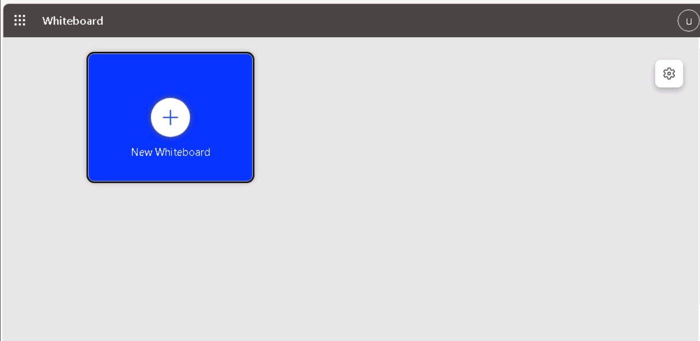
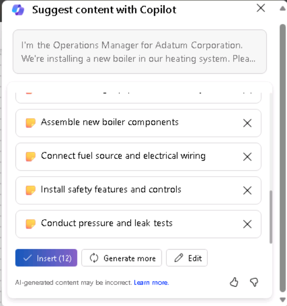
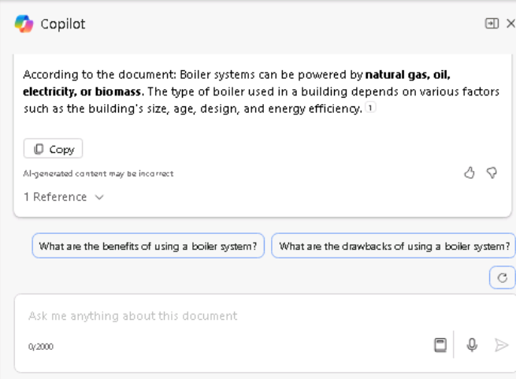
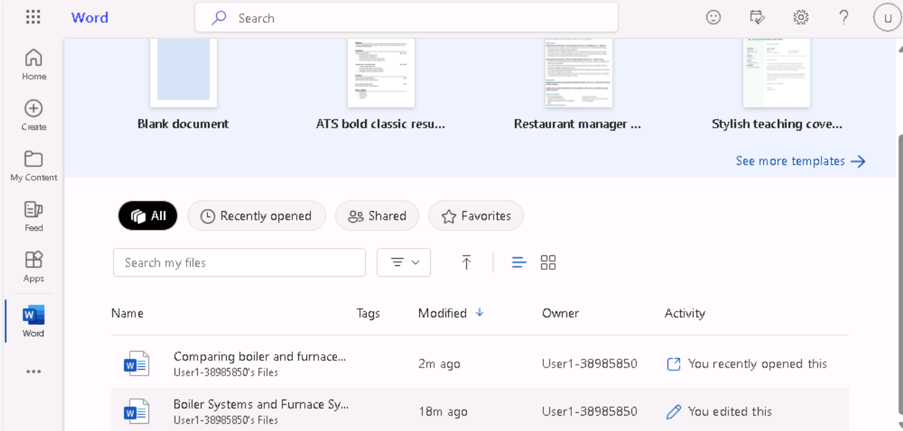

**Laboratório 08: Capacite sua força de trabalho - Copilot - Operações**

**Objetivo:**

Os gerentes de operações podem usar o Copilot for Microsoft 365 para
otimizar seu fluxo de trabalho e aumentar sua produtividade.

Neste laboratório, você usará:

- Copilot no Whiteboard para fazer um brainstorming das ideias do plano
  de projeto para a instalação de um novo sistema de caldeira.

- Copilot no Word para criar um relatório que analisa os sistemas de
  aquecimento de caldeiras e fornos, além de comparar os tipos de saída
  que o Copilot pode gerar.

- Copilot no PowerPoint para criar uma apresentação com base no
  relatório que você criou e que analisa os sistemas de aquecimento de
  caldeiras e fornos.

**Exercício 1: Realizar um brainstorming sobre o plano do projeto usando
o Copilot no Whiteboard**

O Microsoft Whiteboard é uma tela digital que permite que os usuários
colaborem em tempo real, façam brainstorming de ideias e criem conteúdo
com facilidade. Os recursos do Whiteboard incluem desenho de forma
livre, notas adesivas e modelos que você pode personalizar para atender
às suas necessidades. Ele também oferece um espaço que pode ser usado
para projetos, brainstorming, workshops, retrospectivas, design,
planejamento estratégico e para resolver problemas que possam ter peças
móveis ou necessitem de mais recursos visuais.

O whiteboard pode ajudar a aumentar:

- Colaboração ao permitir que múltiplos usuários trabalhem
  simultaneamente em um espaço digital, tornando mais fácil compartilhar
  visuais e ideias.

- Produtividade ao fornecer um espaço para esboçar, compartilhar
  protótipos de design ou compilar uma lista de ideias para nomes de
  produtos.

Como gerente de operações da Adatum Corporation, você está planejando
instalar uma nova caldeira no sistema de aquecimento do seu prédio. No
entanto, antes de iniciar o processo de instalação, você deseja usar o
Copilot no Whiteboard para sugerir possíveis etapas que as empresas
normalmente realizam ao atualizar seu sistema de aquecimento.

Neste exercício, você usará o Copilot no Whiteboard para sugerir as
etapas necessárias para concluir essa instalação. Pense neste exercício
como sendo basicamente um exercício de anotações digitais alimentado por
AI.

1.  No navegador Microsoft Edge, abra uma nova guia e digite a seguinte
    URL para acessar a página inicial do Microsoft 365:
    +++https://www.office.com+++

2.  Na página inicial do **Microsoft 365**, se um ícone do
    **Whiteboard** aparecer no painel de navegação à esquerda,
    selecione-o agora e prossiga para a próxima etapa. Caso contrário,
    selecione **Explore all your Apps** e, na página **Apps**, role para
    baixo até a seção **Explore by category** e, na guia
    **Productivity** (que deve ser exibida por padrão), selecione
    **Whiteboard**.

3.  Faça login no **Microsoft Whiteboard**.

4.  Na página inicial do **Whiteboard**, selecione **New Whiteboard**.

5.  Na faixa de opções na parte superior da página, selecione o menu
    suspenso **Whiteboard**. No campo **Board name**, digite **+++Boiler
    installation project plan+++** e, em seguida, selecione o ícone de
    marca de seleção.

6.  Se a janela **Suggest content with Copilot** for exibida, prossiga
    para a próxima etapa. Caso contrário, no painel de ícones que
    aparece acima da barra de tarefas na parte inferior da página,
    selecione o ícone **Copilot**. No menu que aparecer, selecione
    **Suggest**.

7.  Na janela **Suggest content with Copilot **, digite o seguinte
    prompt:

++**I'm the Operations Manager for Adatum Corporation. We're installing
a new boiler in our heating system. Please suggest the steps we should
follow to install the new boiler**.++ 

8.  Se a janela **Suggest content with Copilot** for exibida, prossiga
    para a próxima etapa. No entanto, se você receber uma mensagem
    indicando que "**"Something went wrong. Please try again." or
    "Copilot couldn't process this prompt. Please rephrase it."**,
    selecione a seta **Generate suggestions **no canto inferior da
    janela do Copilot.

Às vezes, o Copilot conclui o processo em que está trabalhando, mas
apresenta uma pequena demora antes de exibir os resultados. Quando você
seleciona novamente a seta **Generate suggestions**, os resultados
geralmente aparecem sem muita demora. No entanto, se você receber uma
mensagem semelhante pela segunda vez, selecione a seta **Generate
suggestions** mais algumas vezes. Se o erro continuar aparecendo após
três ou quatro tentativas, simplifique o prompt inserindo o seguinte
texto:

9.  ++**Please suggest the steps we should follow to install a new
    boiler in our building's heating system**.++ 

> Por padrão, o Copilot gera ideias em grupos de seis. Na janela
> **Suggest content with Copilot **que aparece, observe as primeiras
> seis ideias que foram geradas. O Copilot oferece duas opções nesse
> momento: você pode anexar as ideias ao seu whiteboard, caso esteja
> satisfeito com as sugestões, ou pode pedir para o Copilot gerar mais
> sugestões. Note como o botão **Insert (6)** indica o número de ideias
> que o Copilot gerou – neste caso, 6.

10. Embora seis sugestões sejam um bom ponto de partida, você deseja se
    aprofundar nas tarefas necessárias para instalar o produto de
    segurança, portanto, selecione o botão **Generate more**.

**Observação**: Se o Copilot exibir uma mensagem de erro de qualquer
tipo, selecione o botão \*\*Generate more\*\* novamente. Faça isso
sempre que receber uma mensagem de erro.

11. Observe como o Copilot gerou outras seis ideias, de modo que o botão
    **Insert (12)** agora exibe o número **12**. Embora você possa
    continuar gerando mais ideias, para economizar tempo, vamos inserir
    as 12 ideias apresentadas atualmente. Selecione o botão **Insert
    (12)**.

12. Quando você seleciona o botão **Insert**, o Copilot anexa as ideias
    sugeridas ao seu whiteboard na forma de notas adesivas amarelas.

13. Assim como em uma sessão de brainstorming no mundo real, usando
    notas adesivas de verdade, você pode editar uma nota específica,
    excluí-la, bloqueá-la contra remoção futura e assim por diante. No
    Microsoft Whiteboard, essas ações são suportadas pelas
    funcionalidades padrão da ferramenta.

> Se você nunca usou o Whiteboard antes, experimente selecionar (clicar
> duas vezes) uma nota específica. Em seguida, na barra de menu que
> aparece acima dela, você pode selecionar o ícone **Edit text** (lápis)
> ou qualquer outra das opções disponíveis. Ao selecionar o ícone de
> reticências no final da barra de menu, será exibido um menu com mais
> opções, como excluir a nota. Mais uma vez, a proposta do Microsoft
> Whiteboard é simular os exercícios com notas adesivas do mundo real.
> Sinta-se à vontade para editar uma nota como quiser.

.

14. Ao analisar as ideias sugeridas, você acha que elas não cobrem
    adequadamente a mitigação de riscos. Selecione o ícone **Copilot**
    na parte inferior da página e, em seguida, selecione **Suggest** no
    menu.

15. Na janela **Suggest content with Copilot** que aparece, digite o
    seguinte prompt para gerar mais ideias sobre a mitigação de riscos:

++**Suggest ways to mitigate the risks of installing a new boiler into
the building's heating system**.++ 

16. Analise as seis ideias que o Copilot sugeriu. Você gostaria que o
    Copilot incluísse mais detalhes, portanto, selecione o botão
    **Generate more**.

17. Você está satisfeito com as 12 ideias de mitigação de risco,
    portanto, selecione o botão **Insert (12)**.

18. Observe como o bloco com as 12 ideias de mitigação de riscos está
    selecionado (veja a borda ao redor).

19. O Copilot sobrepõe parcialmente as 12 ideias de mitigação de riscos
    às 12 ideias originais do plano de projeto. Você pode selecionar
    esse bloco de ideias e movê-lo pela tela para que ele não sobreponha
    mais as ideias originais. Não se preocupe em alinhar os dois blocos
    perfeitamente. Quando você organizar as notas em categorias em uma
    etapa posterior, elas ficarão bem organizadas. Por enquanto, apenas
    organize cada bloco de forma que você consiga ver todas as ideias.
    Isso proporcionará a visibilidade necessária para ver as áreas que o
    Copilot sugeriu, permitindo que você edite qualquer uma delas, se
    desejar.

20. Agora você está satisfeito com as sugestões que o Copilot criou e
    concluiu todas as edições que queria fazer nas notas. Agora, você
    deseja que o Copilot organize as notas por categoria. O Copilot
    determina os nomes das categorias e organiza as notas
    automaticamente de acordo com elas. Selecione o ícone **Copilot** na
    parte inferior da página e, em seguida, selecione **Categorize** no
    menu.

Observe o que aconteceu. O Copilot gerou um conjunto de categorias e
reorganizou as notas de acordo. Cada categoria de notas recebeu uma cor
diferente para ajudar a identificar as diferenças entre as categorias.
Se o retângulo contendo as notas não estiver tão grande quanto poderia
ser, mas ainda couber na tela, selecione o ícone **Fit to Screen** no
canto inferior direito da página. Ao fazer isso, o tamanho da imagem
aumentará até que não seja mais possível aumentá-la sem ultrapassar o
tamanho da tela.

21. Observe o painel de ícones que aparece abaixo do grupo organizado de
    notas. Se você não estiver satisfeito com as categorias, selecione o
    botão **Regenerate** na bandeja de ícones que aparece.

22. **Observação:** Você pode selecionar o botão **Regenerate** quantas
    vezes for necessário até ficar satisfeito com as categorias
    fornecidas pelo Copilot. Selecione esse botão várias vezes e observe
    as mudanças que o Copilot faz a cada vez. Além de alterar os nomes
    das categorias, o Copilot pode adicionar ou reduzir o número de
    categorias a cada regeneração.

23. Após regenerar as categorias várias vezes, você percebe que está
    faltando etapas detalhadas sobre a minimização do tempo de
    inatividade do sistema. Você quer pedir ao Copilot para adicionar
    mais ideias à sua sessão de whiteboard sobre esse assunto. Além
    disso, você identificou uma nota que deseja remover. No entanto,
    como você já organizou suas ideias, precisa retornar sua sessão de
    whiteboard para o modo de edição que estava antes de categorizar as
    notas. Para fazer isso, selecione o botão **Revert**.

24. Agora que você voltou ao modo de edição, selecione a nota que não
    deseja mais e, no painel de ícones que aparece, selecione o ícone de
    reticências. Selecione **Delete** no menu que aparece.

25. Para fazer o Copilot gerar mais ideias, selecione o ícone
    **Copilot** na parte inferior da página e depois selecione
    **Suggest** no menu.

26. Na janela** Suggest content with Copilot** que aparece, insira o
    seguinte prompt para gerar mais ideias sobre a minimização do tempo
    de inatividade do sistema:

++**Suggest ways to limit heating system downtime when installing a new
boiler**.++ 

27. Revise as seis ideias que o Copilot sugeriu. Como você está
    satisfeito com essas ideias, selecione o botão **Insert (6)**.

28. Observe como o bloco de seis notas está destacado com uma linha ao
    redor do bloco. Esse bloco de notas é conhecido como grade de notas.
    Você pode mover ou redimensionar uma grade de notas como qualquer
    outro elemento no seu whiteboard. À medida que você redimensiona a
    grade de notas, o tamanho de todas as notas adesivas dentro dela se
    ajusta automaticamente. Se o bloco de seis notas sobrepor um dos
    blocos de notas, selecione uma das linhas externas ao redor da grade
    de notas e arraste o bloco inteiro de seis notas para o lado, de
    modo que ele não sobreponha nenhuma das notas anteriores. Se você
    ficar sem espaço na tela e parte do bloco sair da tela, selecione o
    ícone **Fit to Screen **no canto inferior direito da página.

29. Agora você está pronto para que o Copilot organize as notas
    adesivas, que incluem 18 notas – um bloco de 12 notas e um bloco de
    seis notas. Selecione o ícone **Copilot** na parte inferior da
    página e, em seguida, selecione **Categorize** no menu. Na janela
    **ategorize selected notes**, selecione o botão **Categorize**.

30. Às vezes, o retângulo contendo as notas não está dimensionado tão
    grande quanto poderia ser, deixando um espaço em branco ao redor da
    tela. Nessa situação, o tamanho do texto das notas geralmente é
    pequeno e difícil de ler. Se isso acontecer, selecione o ícone
    **Ajustar à tela** no canto inferior direito da página. Isso
    aumentará o tamanho da imagem. Se você continuar selecionando esse
    botão, eventualmente ele atingirá um ponto em que não será mais
    possível aumentar o tamanho do retângulo sem ultrapassar o tamanho
    da tela. Qualquer seleção adicional desse ícone não terá efeito no
    retângulo.

31. Revise as categorias. No painel de ícones do Copilot que aparece
    abaixo do retângulo, você pode selecionar o botão **Regenerate**
    para criar um novo conjunto de categorias. Na verdade, selecione o
    botão **Regenerate** várias vezes para ver como as categorias mudam.
    Quando estiver satisfeito com os resultados, selecione o botão
    **Keep it**.

32. Observe como cada categoria de notas adesivas tem uma cor diferente.
    Você percebe que gostaria de adicionar um resumo curto da sessão de
    brainstorming ao conteúdo do seu whiteboard. Para fazer isso,
    selecione o ícone **Copilot** na parte inferior da página e depois
    selecione **Summarize** no menu. O Copilot gera um resumo curto dos
    principais temas desta sessão de whiteboard. Role para baixo para
    revisar a janela de **Summarize** inteira. Como você está satisfeito
    com os resultados, selecione o botão **Keep it**.

33. Selecione o ícone **Fit to Screen** no canto inferior direito da
    página para ajustar todas as notas adesivas e o resumo da sessão na
    tela inteira.

**Exercício 2: Comparar resultados de relatórios usando o Copilot no
Word**

Como Gerente de Operações na Adatum Corporation, você descobriu que o
atual sistema de caldeira que aquece o edifício de 50 anos da empresa
precisa de reparos significativos, se não de substituição completa. Você
acredita que essa situação pode ser uma oportunidade para converter o
sistema de aquecimento atual, passando do sistema de caldeira para um
sistema de forno mais eficiente em termos de energia. No entanto, você
não está familiarizado com as diferenças entre os dois tipos de sistemas
de aquecimento. Você deseja investigar a situação com o Copilot no Word
e criar um relatório que possa apresentar à gestão.

**Observação**: Você ouviu dizer que o Copilot no Word pode gerar
relatórios para você, mas ainda não o utilizou. Sendo assim, você não
tem certeza de que tipo de relatórios ele oferece. Você quer aproveitar
essa oportunidade não apenas para criar seu relatório, mas também para
investigar os recursos de relatórios do Copilot. Portanto, aqui está o
seu plano:

- Você anteriormente identificou várias perguntas que deseja que o
  Copilot investigue sobre os sistemas de caldeira versus os sistemas de
  forno.

- Você planeja pedir ao Copilot para criar um único relatório que aborde
  todas essas perguntas.

- Em seguida, você planeja perguntar ao Copilot cada uma dessas
  perguntas individualmente para poder ver cada resposta.

- Depois, você poderá comparar o relatório criado pelo Copilot com as
  respostas individuais geradas para cada pergunta. Nesse caso, você
  poderia copiar e colar cada resposta em um documento para criar seu
  próprio relatório, se desejar, ou para complementar um documento
  existente.

O objetivo desse exercício é mostrar como o Copilot no Word oferece um
nível diferente de resposta, dependendo da modalidade que você usar –
seja no painel do Copilot ou ao criar um novo documento.

1.  Se você tiver uma guia do Microsoft 365 aberta no navegador Edge,
    selecione-a agora; caso contrário, abra uma nova guia e digite a
    seguinte URL:
    [+++https://www.office.com+++](https://www.office.com+++/)

Observação: Você precisa fazer login (se solicitado) usando as
**Credenciais do Microsoft 365** fornecidas na guia **Resources** à
direita.

2.  Com seu plano em mente, você decide usar primeiro o Copilot no Word
    para criar um relatório que responda a todas as suas perguntas. No
    painel de navegação do **Microsoft 365**, selecione **Microsoft
    Word** e abra um documento em branco.

3.  Na janela **Draft with Copilo** que aparece na parte superior do
    documento em branco, digite o seguinte prompt e selecione o botão
    **Generate**:

+++I'm the Operations Manager for Adatum Corporation. We're thinking
about possibly replacing our building's current boiler system with a
furnace system. Write a report describing what type of boiler systems
are used in most commercial buildings, and include what considerations I
need to take into account to change from an existing boiler system to a
furnace system, the average cost of transitioning from a boiler system
to a furnace system in a commercial two-story building built in the
1970s, whether changing from a boiler system to a furnace system will
have any effect on our current air conditioning system, and the average
defect rates for boiler systems versus furnace systems.+++ 

4.  Revise o relatório gerado pelo Copilot. Observe o nível de detalhe
    em cada área de interesse. Como você deseja salvar este documento
    para o próximo exercício de Caso de Uso, selecione o botão **Keep
    it** no painel do Copilot e, em seguida, salve o documento.

**Observação:** Certifique-se de salvar o relatório, pois você o usará
no próximo exercício.

5.  O prompt que você inseriu para criar o relatório incluiu cinco
    solicitações. Agora, você deseja pedir ao Copilot para responder a
    cada uma dessas cinco perguntas individualmente. Selecione
    **Copilot** na faixa de opções do Word, o que abrirá o painel do
    **Copilot**.

6.  No painel do **Copilot**, no campo de prompt na parte inferior do
    painel, insira a seguinte pergunta e, em seguida, selecione a seta
    de **Send**:

+++What type of boilers do most buildings use as part of their heating
systems?+++ 

7.  Revise a resposta. Embora você possa selecionar a opção **Copy** se
    quiser colar a resposta no documento, para este treinamento você
    apenas selecionará mais prompts para ver as respostas que receberá.

8.  Digite prompts separados para cada uma das quatro perguntas
    restantes:

    - **What considerations do I need to take into account to change
      from an existing boiler system to a furnace system in a commercial
      building? **

    - **What is an average cost for transitioning from a boiler system
      to a furnace system in a commercial two-story building built in
      the 1970s? **

    - **if we change from a boiler system to a furnace system, will it
      have any effect on our current air conditioning system? **

    - **What are the average defect rates for boiler systems versus
      furnace systems?**

9.  Observe como o Copilot respondeu a cada uma de suas perguntas, mas
    ele não inseriu nenhuma das respostas no documento atual. Embora
    você possa copiar e colar cada resposta no documento, fica claro que
    pedir para o Copilot criar o relatório é mais eficiente.

10. Aqui estão algumas dicas para refletir sobre as respostas quando
    você usou o Copilot no Word:

    - Como o nível de informação de cada método de relatório se compara
      entre si?

Compare o nível de informação fornecido quando o Copilot no Word criou
um relatório com as respostas fornecidas quando você fez as perguntas
individualmente no painel do Copilot.

- O que você percebeu?

Quando você pede ao Copilot para criar um relatório, ele geralmente
fornece respostas mais ricas que organiza em um relatório visualmente
atraente. Por outro lado, quando você pede ao Copilot para responder a
perguntas individualmente no painel do Copilot, ele não retorna o mesmo
nível de detalhes que o relatório, embora permita que você copie e cole
as respostas em um documento. No entanto, ao fazer isso, pode ser
necessário reformatar as respostas inseridas para corrigir problemas de
formatação.

**Exercício 3: Criar uma apresentação comparando sistemas de aquecimento
usando o Copilot no PowerPoint**

A proficiência no uso do Copilot no PowerPoint é uma habilidade
estratégica para profissionais que buscam elevar o impacto de suas
apresentações. O Copilot no PowerPoint serve como um colaborador
inteligente, oferecendo sugestões e melhorias em tempo real enquanto os
Gerentes de Operações elaboram suas apresentações.

Como Gerente de Operações na Adatum Corporation, você descobriu que o
atual sistema de caldeira que aquece o edifício de 50 anos da empresa
precisa de reparos significativos, se não de substituição completa. Você
acredita que esse momento pode ser a oportunidade ideal para converter o
seu sistema de aquecimento do sistema de caldeira existente para um
sistema de forno mais eficiente em termos de energia.

Neste exercício, solicite ao Copilot no PowerPoint que crie uma
apresentação com base no relatório **Comparing boiler and furnace
heating systems**. Seu objetivo é colocar a equipe de gerência da Adatum
a par dos dois tipos de sistemas de aquecimento, inclusive com os prós e
contras de cada um, antes de entrar em contato com uma empresa de
Heating, Ventilation, and Air Conditioning (HVAC) e iniciar formalmente
esse projeto.

1.  Se você tiver uma guia do **Microsoft 365** aberta no navegador
    Microsoft Edge, selecione-a agora; caso contrário, abra uma nova
    guia e digite a seguinte URL:
    [+++https://www.office.com+++](https://www.office.com+++/) para
    acessar a página inicial do Microsoft 365.

**Observação**: Você precisa fazer login (se solicitado) usando as
**Credenciais do Microsoft 365** fornecidas na guia **Resources** à
direita.

2.  No painel de navegação do **Microsoft 365**, selecione **OneDrive**
    para abri-lo.

3.  Navegue até a pasta **C:\LabFiles** para selecionar e carregar uma
    cópia do documento **Comparing boiler and furnace heating systems
    report** no **OneDrive**.

**Dica**: abra e feche o arquivo para colocá-lo em sua lista de arquivos
Most Recently Used (MRU).

**Observação**: Se já tiver feito upload de todos os recursos do
laboratório para o OneDrive, conforme sugerido na seção **Preparing for
the lab execution**, você poderá pular esta etapa.

4.  Na página inicial do **Microsoft 365**, selecione o ícone do
    **PowerPoint** no painel de navegação à esquerda.

5.  No **PowerPoint**, abra uma nova apresentação em branco.

6.  Selecione o ícone **Copilot** (destacado em vermelho, conforme
    mostrado na captura de tela).

7.  No painel do **Copilot** que aparece, há vários prompts predefinidos
    disponíveis para você escolher. Selecione o prompt **Create
    presentation from file**.
    

8.  No campo de prompt na parte inferior do painel do **Copilot**, o
    Copilot insere automaticamente o texto: **Create presentation from
    file /**. Neste caso, isso aciona a abertura de uma janela de
    **Suggestions**, exibindo três dos arquivos usados mais
    recentemente.

- Se seu arquivo aparecer aqui, selecione-o agora e prossiga para a
  próxima etapa.

- Se o arquivo não for um dos três que estão sendo exibidos, selecione a
  seta para a direita (**\>** ) no canto superior direito da janela
  **Suggestions** para ver uma lista expandida de arquivos MRU. Se o
  arquivo aparecer aqui, selecione-o agora e prossiga para a próxima
  etapa.

- Se você não vir seu arquivo na lista expandida de MRU, deverá copiar o
  link para o relatório e colá-lo no campo de prompt. Para fazer isso:

  1.  Selecione a guia do navegador do **Microsoft 365** e selecione
      **Word** no painel de navegação.

  2.  Na página inicial do **Word**, na lista de arquivos recentes,
      selecione o relatório para abri-lo no Word.

  3.  No relatório no Word, na extrema direita acima da faixa de opções,
      selecione o botão **Share**. No menu suspenso que aparece,
      selecione **Copy Link**. Aguarde a exibição da janela **Link
      copied**, que é a garantia de que o link para o arquivo foi
      copiado para a área de transferência.

  4.  Mude para a guia **PowerPoint** e, na parte inferior do painel
      **Copilot**, o campo de prompt ainda deve estar exibindo **reate
      presentation from file /**. Posicione o cursor após a barra
      (**/**) e cole (**Ctrl+V**) o link para o relatório.

9.  Observe como o arquivo aparece no campo de prompt. Selecione o ícone
    **Send** no campo de prompt.

10. Esse prompt acionou o Copilot para criar uma apresentação de slides
    com base no documento. Ao fazer isso, ele primeiro exibiu o esboço
    da apresentação no painel do Copilot. Em seguida, exibiu uma janela
    separada com uma lista com marcadores de algumas das alterações
    feitas na apresentação com base no documento.

11. Agora você pode revisar os slides e fazer as atualizações
    necessárias. Preste atenção especial às alterações que o Copilot fez
    com base no documento. Você pode usar a ferramenta **Designer** para
    ajustar os layouts.

12. Revise as anotações do palestrante que o Copilot adicionou a cada
    slide da apresentação. Verifique se elas indicam os pontos que você
    deseja destacar durante a apresentação.

13. Tente usar o Copilot para atualizar a apresentação. Vamos começar
    adicionando uma imagem a um slide. Encontre um slide sem imagem e
    digite o seguinte prompt (não se esqueça de substituir \[insira o
    número do slide aqui\] pelo número do slide que você escolheu):

++**Add an image to slide \[enter slide number here\]**. **The image
should contain a picture related to the slide contents**.++ 

14. Você também percebe que não há nenhum conteúdo na apresentação
    relacionado à expectativa de vida de cada tipo de sistema de
    aquecimento. Você quer que o Copilot pesquise esse tópico e depois o
    adicione à apresentação. Insira o seguinte prompt:

++**What is the average lifespan of a boiler heating system versus a
furnace heating system**?++

15. Agora você deseja que o Copilot adicione esse conteúdo a um slide.
    Selecione o slide no início da apresentação que lista os tipos de
    sistemas de caldeiras. Em seguida, digite o seguinte prompt (não se
    esqueça de substituir \[insira o número do slide aqui\] pelo número
    do slide que você escolheu):

++**Add this lifespan content to slide \[enter slide number here\]**.++

16. O que o Copilot fez? Ele fez algo como adicionar "**Lifespan
    content**" à parte superior do slide, sobrepondo-o ao conteúdo
    existente no slide? Ou fez algo semelhante?

17. O prompt não funcionou como esperado. Remova o que foi adicionado ao
    slide.

18. Agora tente novamente, mas desta vez peça ao Copilot para encontrar
    conteúdo sobre expectativa de vida e adicioná-lo ao slide em um
    único prompt. Desta vez, insira o seguinte prompt:

++**Add content about the average lifespan of a boiler heating system
versus a furnace heating system to slide \[enter slide number
here\].**++ 

19. Isso funcionou melhor? Você só precisa reformular seus prompts se o
    Copilot não fizer exatamente o que você queria.

20. Você percebe que não há um slide no final para uma sessão de
    Perguntas e Respostas (Q&A). Para corrigir essa situação, insira o
    seguinte prompt:

++**Add a Q&A slide at the very end of the presentation with an
appropriate image**.++.

21. Revise o novo slide que foi criado. Ao ver esse slide, você gostaria
    que o Copilot criasse uma lista de possíveis perguntas e as
    adicionasse às anotações do instrutor para o slide de perguntas e
    respostas. Digite o seguinte prompt:

> ++**Create a list of five questions that may be asked during the Q&A
> session and add them to the speaker notes in the Q&A slide**.++ 

22. Como o Copilot respondeu quando você tentou esse prompt? Ele
    adicionou cinco perguntas às anotações do apresentador no slide de
    perguntas e respostas? Se sim, então parabéns!

**Observação**: O Copilot pode exibir alguma exceção (lembre-se de que o
Copilot ainda está em desenvolvimento), como a abaixo.

Tente reformular o prompt ou use os prompts sugeridos, como o abaixo.

23. Selecione o comando **Add a slide about** e anexe as seguintes **Q&A
    at the very end of the presentation** (conforme mostrado na captura
    de tela)

24. Clique em Send para ver o que acontece.

O Copilot adicionou um slide de perguntas e respostas conforme as
instruções.

25. Agora tente com outro prompt:

**Add a slide about** o que o público pode perguntar sobre a
apresentação

26. Quando terminar a apresentação final, você poderá salvar para
    referência futura ou descartar essa apresentação.

**Resumo:**

Neste laboratório, você usou:

- Copilot no Whiteboard para gerar e organizar ideias de planos de
  projeto para a instalação de um novo sistema de caldeira, promovendo o
  planejamento colaborativo e criativo.

- Copilot no Word para criar um relatório detalhado e comparou os tipos
  de resultados que o Copilot pode gerar, demonstrando sua versatilidade
  na criação de conteúdo.
