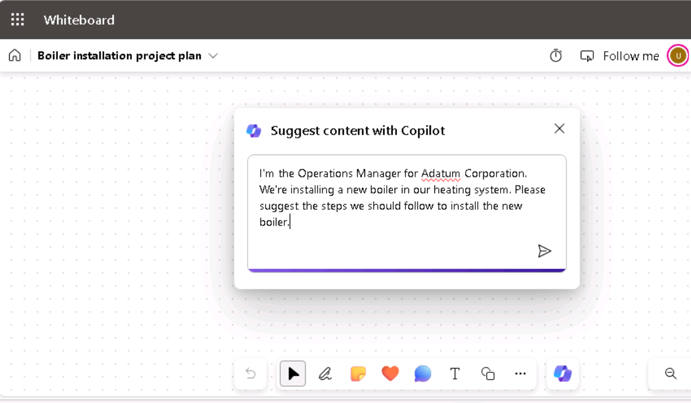
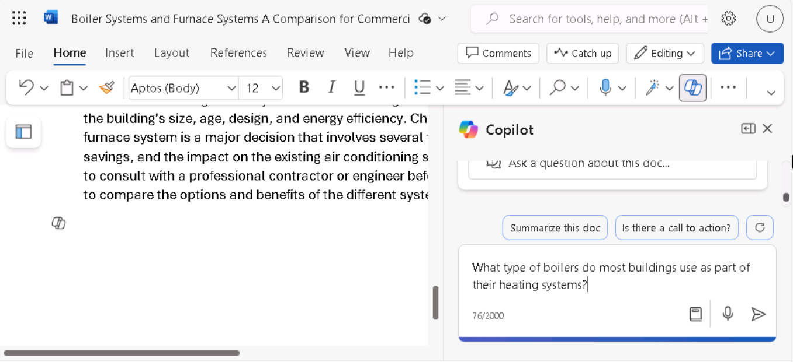
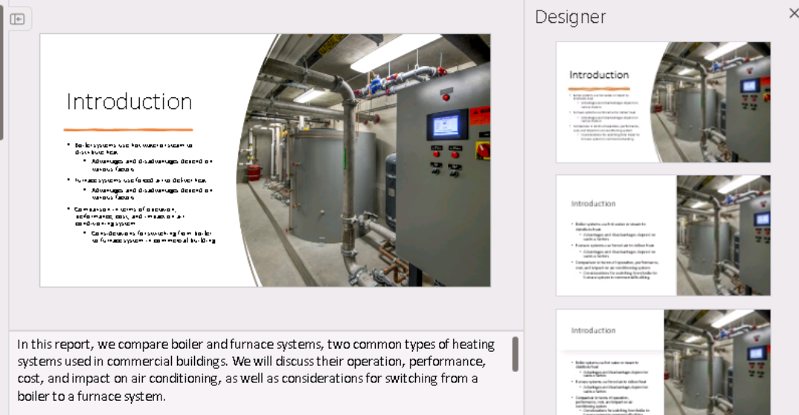

**ラボ 08: 従業員の力を高める – Copilot – オペレーション**

**目的:**

オペレーションマネージャーは、Copilot for Microsoft 365
を使用することで、ワークフローを効率化し、生産性を向上させることができます。

このラボでは、以下のツールを使用します。

• Whiteboard で Copilot
を使用して、新しいボイラーシステムの導入に関するプロジェクト計画のアイデアをブレインストーミングします。

• Word で Copilot
を使用して、ボイラーと炉の暖房システムを分析し、Copilot
で生成できる出力の種類を比較するレポートを作成します。

• PowerPoint で Copilot
を使用して、作成したレポートに基づいて、ボイラーと炉の暖房システムを分析するプレゼンテーションを作成します。

演習 1: Whiteboard の Copilot
を使用してプロジェクト計画のアイデアをブレインストーミングする

Microsoft Whiteboard
は、ユーザーがリアルタイムで共同作業を行い、アイデアをブレインストーミングし、コンテンツを簡単に作成できるデジタル
キャンバスです。Whiteboard
には、自由形式の描画、付箋、ニーズに合わせてカスタマイズできるテンプレートなどの機能があります。また、プロジェクト、ブレインストーミング、ワークショップ、振り返り、設計、戦略計画、そして変動要素やより多くのビジュアルが必要な問題の解決に使用できるスペースも提供します。

Whiteboard は、次のことに役立ちます。

•
複数のユーザーがデジタル空間で同時に作業できるようにすることで、ビジュアルやアイデアを簡単に共有できるため、コラボレーションが向上します。

•
落書き、プロトタイプのスケッチの共有、製品名のアイデアリストの作成などができるスペースを提供することで、生産性が向上します。

Adatum Corporation
の運用マネージャーとして、建物の暖房システムに新しいボイラーを設置する計画を立てています。設置プロセスを開始する前に、Whiteboard
の Copilot
を使用して、企業が暖房システムを更新する際に一般的に実行する手順を提案したいと考えています。

この演習では、WhiteboardのCopilotを使用して、インストールを完了するために必要な手順を提案します。この演習は、基本的にAI支援による付箋作成演習と考えてください。

1\. Microsoft Edge ブラウザーで新しいタブを開き、次の URL を入力して
Microsoft 365 ホームページに移動します: +++https://www.office.com+++

2\. Microsoft 365 ホームページの左側のナビゲーション
ウィンドウにホワイトボード
アイコンが表示されている場合は、それを選択して次の手順に進みます。表示されていない場合は、「Explore
all your Apps」を選択し、「Apps」ページで「Explore by
category」セクションまで下にスクロールし、「Productivity」タブ
(既定で表示されます) で「Whiteboard」を選択します。

3\. Microsoft Whiteboard にサインインします。

4\. Whiteboard ホームページで、「New
Whiteboard」を選択します。

5\.
ページ上部のリボンで、「Whiteboard」ドロップダウン矢印を選択します。「Board
name」フィールドに「+++ Boiler installation project plan
+++」と入力し、チェックマークアイコンを選択します。

6\. 「Suggest content with
Copilot」ウィンドウが表示された場合は、次の手順に進みます。表示されない場合は、ページ下部のタスクバー上部に表示されるアイコントレイから、Copilotアイコンを選択します。表示されるメニューから「Suggest」を選択します。

7\. 「Suggest content with
Copilot」ウィンドウで、次のプロンプトを入力します。

++**I'm the Operations Manager for Adatum Corporation. We're installing
a new boiler in our heating system. Please suggest the steps we should
follow to install the new boiler**.++

8\. 「Suggest content with
Copilot」ウィンドウが表示された場合は、次の手順に進みます。ただし、「Something
went wrong. Please try again.」または「Copilot couldn't process this
prompt. Please rephrase
it.」というメッセージが表示された場合は、Copilotウィンドウの下部にある「Generate
suggestions」矢印を選択してください。

Copilot
は処理を完了しても、結果が表示される前に少しつまずくことがあります。「Generate
suggestions」の矢印をもう一度選択すると、通常はすぐに結果が表示されます。しかし、同様のメッセージが2度目に表示された場合は、「Generate
suggestions」の矢印をもう数回選択してください。3～4回試してもこのエラーが表示される場合は、次のテキストを入力してプロンプトを簡素化してください。

++建物の暖房システムに新しいボイラーを設置するための手順を提案してください。++

9\. デフォルトでは、Copilot はアイデアを 6
つずつグループ分けして生成します。表示される「Suggest content with
Copilot」ウィンドウで、生成された最初の 6
つのアイデアを確認してください。Copilot には 2
つのオプションがあります。提案に満足したらアイデアをホワイトボードに添付するか、Copilot
にさらに提案を生成させることができます。「Insert
(6)」ボタンには、Copilot が生成したアイデアの数 (この場合は 6)
が表示されています。

10\. 6
つの提案は良い出発点ですが、セキュリティ製品のインストールに必要なタスクをさらに詳しく調べたい場合は、\[Generate
more\]
ボタンを選択します。

注: Copilot に何らかのエラーメッセージが表示された場合は、もう一度「\*\*
Generate
more\*\*」ボタンを選択してください。エラーメッセージが表示されるたびに、この操作を行ってください。

11\. Copilot がさらに 6 つのアイデアを生成したため、「Insert
(12)」ボタンに 12
個と表示されていることに注目してください。さらにアイデアを生成することもできますが、時間的な都合上、現在表示されている
12 個のアイデアをInsertしましょう。「Insert
(12)」ボタンを選択してください。

12\. \[Insert\] ボタンを選択すると、Copilot
は提案されたアイデアを黄色の付箋の形でホワイトボードに添付します。

13\. 実際の付箋を使ったブレインストーミング
セッションと同様に、特定のメモを編集したり、削除したり、今後削除できないようにロックしたりすることができます。Microsoft
Whiteboard
では、これらの操作は標準のホワイトボード機能によってサポートされています。

これまで Whiteboard を使用したことがない場合は、特定のメモを選択
(ダブルクリック) し、その上に表示されるメニュー バーでテキスト編集
(鉛筆) アイコンなどのオプションを選択してください。メニュー
バーの末尾にある省略記号アイコンを選択すると、メモの削除などのその他のオプションのメニューが表示されます。繰り返しになりますが、Microsoft
Whiteboard
の背後にあるアイデアは、実際の付箋を使った演習を模倣することです。自由にメモを編集してください。

14\.
提案されたアイデアを見て、リスク軽減が十分にカバーされていないと感じました。ページ下部のCopilotアイコンを選択し、メニューから「Suggest」を選択します。

15\. 表示される「Suggest content with
Copilot」ウィンドウで、次のプロンプトを入力して、リスク軽減に関するアイデアをさらに生成します。

++**Suggest ways to mitigate the risks of installing a new boiler into
the building's heating system**.++

16\. Copilot が提案した 6 つのアイデアを確認します。Copilot
にさらに詳細な情報を追加したい場合は、「Generate
more」ボタンを選択します。

17\. 12 個のリスク軽減アイデアに満足したら、「Insert
(12)」ボタンを選択します。

18\. 12
個のリスク軽減アイデアのブロックがどのように選択されているかに注意してください
(外側の境界線を参照)。

19\. Copilot は、12 個のリスク軽減アイデアを、元の 12
個のプロジェクト計画アイデアの上に部分的に重ねて表示します。このアイデアブロックを選択して画面上で移動させると、元の
12 個のアイデアが重ならなくなります。2
つのブロックを並べる必要はありません。後のステップでメモをカテゴリ別に整理すれば、見栄えが良くなります。今は、各ブロックをすべてのアイデアが見えるように配置します。こうすることで、Copilot
が提案した領域を視覚的に確認でき、必要に応じて編集できるようになります。

20\. Copilot
が作成した提案に満足し、メモに必要な編集作業もすべて完了しました。次に、Copilot
を使ってメモをカテゴリ別に整理します。Copilot
がカテゴリ名を判別し、それに従ってメモを自動的に整理します。ページ下部の
Copilot
アイコンを選択し、メニューから「Categorize」を選択します。

21\. 何が起こったか確認してください。Copilot
はカテゴリのセットを生成し、それに応じてメモを再編成しました。各カテゴリのメモには異なる色が割り当てられ、カテゴリ間の違いを識別しやすくしています。メモを含む長方形が画面に収まらない場合は、ページの右下にある「Fit
to
Screen」アイコンを選択してください。このアイコンをクリックすると、画像のサイズが画面サイズを超えない限り拡大され続けます。

22\.
整理されたメモのグループの下に表示されるアイコントレイに注目してください。カテゴリに満足できない場合は、表示されるアイコントレイの「Regenerate」ボタンを選択してください。

注: Copilot
が提供するカテゴリに満足するまで、必要に応じて何度でも「Regenerate」ボタンを選択できます。このボタンを複数回クリックし、そのたびに
Copilot
によって変更される内容を確認してください。カテゴリ名が変更されるだけでなく、Copilot
は再生成のたびにカテゴリの数を追加または削減する場合があります。

> 22.何度かカテゴリーを再生成した後、システムのダウンタイムを最小限に抑えるための詳細な手順が抜けていることに気付きました。この問題に関して、ホワイトボードセッションにさらにアイデアを追加するようCopilotに依頼したいと考えています。また、削除したいメモを特定しました。しかし、すでにアイデアを整理しているため、ホワイトボードセッションを、メモを分類する前の編集モードに戻す必要があります。そのためには、「Undo」ボタンを選択します。
>
> 23.編集モードに戻ったら、不要になったメモを選択し、表示されるアイコントレイで省略記号アイコンを選択します。表示されるメニューから「Delete」を選択します。
>
> 24\.
> Copilotにさらにアイデアを生成させるには、ページ下部のCopilotアイコンを選択し、メニューから「Confirm」を選択します。
>
> 25.表示される「Confirm Copilot
> content」ウィンドウで、次のプロンプトを入力して、システムのダウンタイムを最小限に抑えるためのアイデアをさらに生成します。
>
> 26.++新しいボイラーを設置する際に、暖房システムのダウンタイムを最小限に抑える方法を提案してください。++
>
> 27\.
> Copilotが提案した6つのアイデアを確認します。これらのアイデアに問題がない場合は、「Insert」(6)
> ボタンを選択します。
>
> 28\. 6
> つのノートのブロックが、ブロックの周囲に線で囲まれてハイライト表示されていることに注目してください。このノートのブロックはノートグリッドと呼ばれます。ホワイトボード上の他の要素と同様に、ノートグリッドを移動したりサイズを変更したりできます。ノートグリッドのサイズを変更すると、その中のすべての付箋のサイズもそれに応じて調整されます。6
> つのノートのブロックがいずれかのノートのブロックの上に重なっている場合は、ノートグリッドの外側の線の
> 1 つを選択し、6
> つのノートのブロック全体を横にドラッグして、前のノートと重ならないようにしてください。画面のスペースが足りなくなり、ブロックの一部が画面からはみ出てしまった場合は、ページの右下にある
> \[Fit to Screen\] アイコンを選択します。
>
> 29\. これで、18 個の付箋（12 個のノートのブロックと 6
> 個のノートのブロック）を Copilot
> で整理する準備が整いました。ページ下部の Copilot
> アイコンを選択し、メニューから \[分類\]
> を選択します。\[選択したノートを分類\] ウィンドウで \[分類\]
> ボタンを選択します。

30\.
メモを囲む四角形のサイズが最大限に拡大されず、キャンバスの周囲に空白が残ることがあります。このような場合、メモの文字サイズが小さくなり、読みにくくなることがよくあります。このようなサイズ変更の問題が発生した場合は、ページの右下にある「Fit
to
Screen」アイコンを選択してください。これにより、画像のサイズが大きくなります。このボタンを選択し続けると、最終的に画面サイズを超えずに四角形のサイズを大きくすることができなくなります。このアイコンをさらに選択しても、四角形には影響しません。

31.カテゴリを確認します。四角形の下に表示されるコパイロットアイコントレイで、「Regenerate」ボタンを選択すると、新しいカテゴリセットを作成できます。実際に、「Regenerate」ボタンを数回クリックして、カテゴリがどのように変化するかを確認してください。結果に満足したら、「Save」ボタンを選択します。

32.付箋の各カテゴリが異なる色になっていることに注目してください。ブレインストーミングセッションの短い要約をホワイトボードコンテンツに追加したいことがわかりました。これを行うには、ページ下部のCopilotアイコンを選択し、メニューから「要約」を選択します。Copilotは、このホワイトボードセッションの主要なテーマの短い要約を生成します。下にスクロールして要約ウィンドウ全体を確認してください。結果に満足したら、「Save」を選択します。

32\. ページの右下にある \[Fit to Screen\]
アイコンを選択して、すべての付箋とセッションの概要を画面全体に表示します。

演習2：Word版Copilotを使ったレポート結果の比較

Adatum社のオペレーションマネージャーとして、築50年のオフィスビルの暖房に使用されている現在のボイラーシステムは、大規模な修理、あるいは完全な交換が必要であることがわかりました。この状況は、既存のボイラーシステムからよりエネルギー効率の高い暖房システムに切り替える絶好の機会だと感じています。しかし、2種類の暖房システムの違いについてはよく分かっていません。Word版Copilotを使って状況を調査し、経営陣に提出できるレポートを作成したいと考えています。

注：Word版Copilotでレポートを作成できると聞いていましたが、まだ使用したことがありませんでした。そのため、どのようなレポート機能が提供されているかよく分かりません。この機会に、レポートを作成するだけでなく、Copilotのレポート機能についても調べてみたいと考えています。そこで、以下の計画を立てました。

- ボイラーと炉の暖房システムに関して、Copilot
  で調査したい質問をいくつか特定しました。

- Copilot
  で、これらの質問すべてを網羅したレポートを1つ作成する予定です。

- 次に、それぞれの質問に対して Copilot
  に個別に質問し、それぞれの回答を確認します。

- その後、Copilot
  が作成したレポートと、各質問に対して生成された個別の回答を比較します。後者の場合、必要に応じて各回答をコピー＆ペーストして独自のレポートを作成したり、既存のドキュメントを補足したりできます。

この演習の目的は、Word の Copilot が、Copilot
パネル内または新規ドキュメント作成時に使用するモードに応じて、どのように異なるレベルの応答を提供するかを示すことです。

1\. Edge ブラウザーで Microsoft 365
タブを開いている場合は、今すぐ選択します。そうでない場合は、新しいタブを開いて次の
URL を入力します: +++https://www.office.com+++

注: サインインを求められた場合は、右側の \[Resources\] タブに表示される
Microsoft 365 資格情報を使用してサインインする必要があります。

2\. 計画を踏まえ、まず Word の Copilot
を使用して、すべての質問に対応するレポートを作成することにしました。Microsoft
365 ナビゲーション パネルで \[Microsoft Word\]
を選択し、空白のドキュメントを開きます。

3\. 空白のドキュメントの上部に表示される \[Draft with Copilot \]
ウィンドウで、次のプロンプトを入力し、\[Generate\] ボタンを選択します。

+++私は Adatum Corporation のオペレーション
マネージャーです。建物の現在のボイラーシステムを炉システムに置き換えることを検討しています。ほとんどの商業ビルで使用されているボイラーシステムの種類、既存のボイラーシステムから炉システムに変更する際に考慮すべき事項、1970年代に建設された2階建ての商業ビルでボイラーシステムから炉システムに移行する場合の平均費用、ボイラーシステムから炉システムへの変更が現在の空調システムに影響を与えるかどうか、ボイラーシステムと炉システムの平均欠陥率などについて記述したレポートを作成してください。+++

4\. Copilot
が生成したレポートを確認します。各関心領域の詳細レベルに注目してください。このドキュメントは次回のユースケース演習のために保存しておく必要があるため、Copilot
トレイの「Save」ボタンを選択してドキュメントを保存します。

注: 次の演習で使用するので、レポートは必ず保存してください。

5\.
レポート作成時に入力したプロンプトには、5つのリクエストが含まれていました。Copilotにこれらの5つの質問をそれぞれ個別に尋ねてみましょう。Wordリボンで「Copilot」を選択すると、「Copilot」ペインが開きます。

6\.
「Copilot」ペインの下部にあるプロンプトフィールドに次の質問を入力し、「Send」矢印を選択します。

+++What type of boilers do most buildings use as part of their heating
systems?+++

7\.
回答を確認します。回答をドキュメントに貼り付けたい場合は「Copy」オプションを選択できますが、このトレーニングでは、追加のプロンプトを選択して、受け取った回答を確認します。

> 8.残りの4つの質問それぞれに個別のプロンプトを入力します:

o
商業ビルで既存のボイラーシステムから炉システムに変更する場合、どのような点に留意する必要がありますか？

o
1970年代に建設された2階建ての商業ビルで、ボイラーシステムから炉システムへの移行にかかる平均費用はいくらですか？

o
ボイラーシステムから炉システムに変更した場合、現在の空調システムに影響はありますか？

o
ボイラーシステムと炉システムの平均欠陥率はどれくらいですか？

> 9.Copilot
> がそれぞれの質問に回答しましたが、現在の文書には回答が一切挿入されていません。それぞれの回答をコピー＆ペーストして文書に貼り付けることもできますが、レポート作成は
> Copilot に任せた方が効率的であることは明らかです。
>
> 10.Copilot in Word
> を使用した際の回答について、いくつかポイントをご紹介します。

o 各レポート作成方法の情報レベルは、どのように比較されますか？

Word で Copilot を使用してレポートを作成した場合の情報レベルと、Copilot
パネルで個別に質問した場合に提供される回答レベルを比較してください。

o 気づいたことはありますか？

Copilot
を使用してレポートを作成すると、通常、より詳細な回答が提供され、魅力的なレポートにまとめられます。一方、Copilot
パネルで個別に質問に回答するように Copilot
に指示した場合、回答をコピーしてドキュメントに貼り付けることはできますが、レポートと同じ詳細レベルは返されません。ただし、回答をコピーしてドキュメントに貼り付けることはできます。ただし、その場合、挿入された回答の書式設定を見直し、書式設定の問題を解消する必要がある場合があります。

演習3：PowerPointでCopilotを使用して暖房システムを比較するプレゼンテーションを作成する

PowerPointでCopilotを使いこなすことは、プレゼンテーションの効果を高めたいプロフェッショナルにとって戦略的なスキルです。PowerPointのCopilotはインテリジェントなコラボレーターとして機能し、オペレーションマネージャーがプレゼンテーションを作成する際にリアルタイムで提案や改善点を提示します。

Adatum
Corporationのオペレーションマネージャーであるあなたは、築50年のオフィスビルの暖房に使用されている現在のボイラーシステムが、大規模な修理、あるいは完全な交換が必要であることを発見しました。あなたは今こそ、既存のボイラーシステムからよりエネルギー効率の高い暖房システムに切り替える絶好の機会だと感じています。

この演習では、PowerPoint の Copilot
に、ボイラーと炉の暖房システムの比較レポートに基づいたプレゼンテーションを作成するように指示します。目標は、暖房、換気、空調
(HVAC) 会社に連絡して正式にこのプロジェクトを開始する前に、Adatum
の管理チームに 2
種類の暖房システムについて、それぞれの長所と短所を含めて理解してもらうことです。

1\. Microsoft Edge ブラウザーで Microsoft 365
タブを開いている場合は、それを選択します。開いていない場合は、新しいタブを開き、次の
URL を入力します: +++https://www.office.com+++ で Microsoft 365
ホームページに移動します。

注: 右側の \[リソース\] タブに表示される Microsoft 365
資格情報を使用して (プロンプトが表示された場合)
サインインする必要があります。

2\. Microsoft 365 ナビゲーション ウィンドウで、OneDrive
を選択して開きます。

3\. C:\LabFiles フォルダーを参照し、「Comparing boiler and furnace
heating systems」レポート ドキュメントのコピーを選択して OneDrive
にアップロードします。

ヒント: ファイルを開いて閉じると、最近使用したファイル (MRU)
リストに追加されます。

注: 「Preparing for the lab
execution」セクションで推奨されているように、ラボのすべてのアセットを既に
OneDrive にアップロードしている場合は、この手順を省略できます。

4\. Microsoft 365 ホームページで、左側のナビゲーション ウィンドウで
PowerPoint アイコンを選択します。

5\. PowerPoint で、新しい空白のプレゼンテーションを開きます。

6\. Copilot アイコン (スクリーンショットに示すように赤くハイライト表示)
を選択します。

> 7.表示されるコパイロットパネルには、いくつかの定義済みプロンプトが用意されており、選択できます。「Create
> presentation from file
> prompt」プロンプトを選択してください。

8\. Copilot パネルの下部にあるプロンプトフィールドに、Copilot
は自動的に「Create presentation from file
/」というテキストを入力します。スラッシュは、Copilot
がファイルへのリンクを入力する際に​​使用する一般的なインジケーターです。この例では、スラッシュを入力すると、最近使用したファイルのうち
3
つが表示される「Suggestions」ウィンドウが開きます。

- ここにファイルが表示されている場合は、今すぐ選択して次の手順に進みます。

- 表示されている3つのファイルのいずれにもファイルが表示されない場合は、「Suggestions」ウィンドウの右上隅にある右矢印
  (\>)
  を選択して、展開されたMRUファイルリストを表示します。ここにファイルが表示されている場合は、今すぐ選択して次の手順に進みます。

- 展開されたMRUリストにファイルが表示されない場合は、レポートへのリンクをコピーしてプロンプトフィールドに貼り付ける必要があります。手順は次のとおりです。

  1.  Microsoft 365 ブラウザータブを選択し、ナビゲーションウィンドウで
      Word を選択します。

  2.  Word
      のホームページの最近使用したファイルの一覧で、レポートを選択して
      Word で開きます。

  3.  Word のレポートで、リボンの右上にある \[共有\]
      ボタンを選択します。表示されるドロップダウンメニューで \[Copy
      link\] を選択します。\[Link copied\]
      ウィンドウが表示されるまで待ちます。このウィンドウが表示されれば、ファイルへのリンクがクリップボードにコピーされたことになります。

  4.  PowerPoint タブに切り替えると、Copilot
      ウィンドウの下部にあるプロンプトフィールドに \[Create presentation
      from file /\] と表示されているはずです。スラッシュ (/)
      の後にカーソルを置き、レポートへのリンクを貼り付けます (Ctrl +
      V)。.

9\.
プロンプトフィールドにファイルがどのように表示されるかを確認してください。プロンプトフィールドで送信アイコンを選択してください。

10\. このプロンプトにより、Copilot
はドキュメントに基づいてスライドプレゼンテーションを作成します。その際、まず
Copilot
ペインにプレゼンテーションのアウトラインが表示されます。次に、ドキュメントに基づいてプレゼンテーションに加えられた変更の一部が箇条書きで表示される別のウィンドウが表示されます。

11\. これでスライドを確認し、必要な更新を行うことができます。Copilot
がドキュメントに基づいて行った変更に特に注意してください。デザイナーツールを使用してレイアウトを調整できます。

12\. Copilot
がプレゼンテーションの各スライドに追加されたスピーカーノートを確認します。プレゼンテーション中に強調したいポイントが明確に示されていることを確認します。

13\. Copilot
を使ってプレゼンテーションを更新してみましょう。まずはスライドに画像を追加してみましょう。画像のないスライドを探し、以下のプロンプトを入力します（\[スライド番号を入力\]
を選択したスライドの番号に置き換えてください）。

++**Add an image to slide \[enter slide number here\]**. **The image
should contain a picture related to the slide contents**.++

14\.
プレゼンテーションには、各暖房システムの予想寿命に関するコンテンツがまったく含まれていないことに気づきます。Copilot
でこのトピックを調査し、プレゼンテーションに追加したいとします。次のプロンプトを入力します。

++**What is the average lifespan of a boiler heating system versus a
furnace heating system**?++

> 15.Copilot
> を使って、このコンテンツをスライドに追加します。プレゼンテーションの冒頭で、ボイラーシステムの種類を一覧にしたスライドを選択します。次に、次のプロンプトを入力します（\[スライド番号を入力\]
> を選択したスライドの番号に置き換えてください）。

++**Add this lifespan content to slide \[enter slide number here\]**.++

16\. Copilot はどのような処理を行いましたか？スライド上部に「Lifespan
content」を追加したり、スライド上の既存のコンテンツの上に重ねたりしましたか？それとも似たような処理を行いましたか？

17\.
プロンプトが期待通りに動作しませんでした。スライドに追加されたコンテンツをすべて削除してください。

18\. もう一度試してみましょう。今回は、Copilot
に寿命コンテンツの検索とスライドへの追加を 1
つのプロンプトで実行させます。今回は次のプロンプトを入力します。

++**Add content about the average lifespan of a boiler heating system
versus a furnace heating system to slide \[enter slide number
here\].**++

19\. これで改善されましたか？Copilot
が期待どおりに動作しない場合は、プロンプトを修正する必要があります。

20\. 最後に質疑応答 (Q&A)
用のスライドがないことに気付きました。この状況を修正するには、次のプロンプトを入力してください。

++**Add a Q&A slide at the very end of the presentation with an
appropriate image**.++

21\.
作成された新しいスライドを確認します。このスライドを確認したら、Copilot
に質問リストを作成してもらい、Q&A
スライドのスピーカーノートに追加してもらいます。次のプロンプトを入力します。

++ Create a list of five questions that may be asked during the Q&A
session and add them to the speaker notes in the Q&A slide++

22\. このプロンプトを試したとき、Copilot はどのように反応しましたか？Q&A
スライドのスピーカーノートに 5
つの質問が追加されましたか？もし追加されていたら、おめでとうございます！

注：Copilot は以下のような例外を表示する場合があります（Copilot
はまだ開発中であることにご注意ください）。

プロンプトを言い換えるか、以下のような提案されたプロンプトを使用してください。

23\. 「Add a
slide」コマンドを選択し、プレゼンテーションの最後に次のQ&Aを追加します（スクリーンショットを参照）。

24\.
「Send」をクリックして、何が起こるかを確認します。

Copilot は指示に従って Q&A スライドを追加しました。

25\. 別のプロンプトを試してみましょう。

聴衆がプレゼンテーションについてどのような質問をするかをまとめたスライ
ドを追加してください。

> 26.最終プレゼンテーションが完成したら、今後の参考のために保存するか、このプレゼンテーションを破棄してください。

**概要:**

このラボでは以下を使用しました:

• Copilot in
Whiteboardを使用し、新しいボイラーシステムの設置に向けたプロジェクト計画のアイデアを生成・整理することで、共同作業と創造的な計画を促進しました。

• Copilot in
Wordを使用し、詳細なレポートを作成し、Copilotで生成できる出力の種類を比較することで、コンテンツ作成におけるCopilotの汎用性を示しました。
