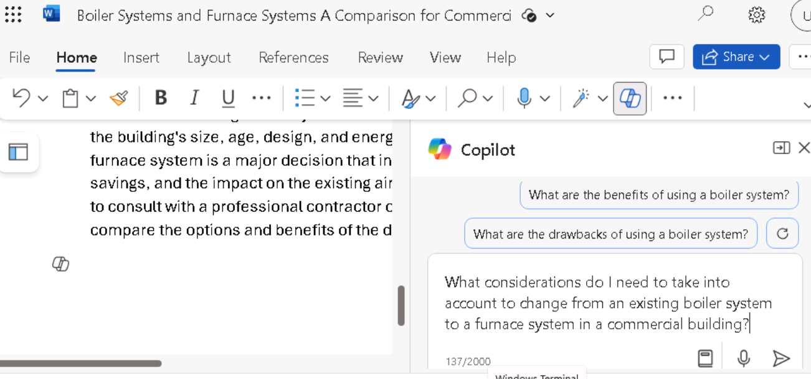

**Lab 08: Stärken Sie Ihre Mitarbeiter – Copilot – Operations**

**Ziel:**

Operations Manager können Copilot für Microsoft 365 verwenden, um ihren
Workflow zu optimieren und ihre Produktivität zu steigern.

In diesem Lab verwenden Sie Folgendes:

- Copilot in Whiteboard zum Brainstorming von Projektplanideen für die
  Installation eines neuen Kesselsystems.

- Copilot in Word, um einen Bericht zu erstellen, der Kessel- und
  Ofenheizungssysteme analysiert und gleichzeitig die Leistungsarten
  vergleicht, die Copilot generieren kann.

- Copilot in PowerPoint, um eine Präsentation auf der Grundlage des von
  Ihnen erstellten Berichts zu erstellen, in dem Kessel- und
  Ofenheizungssysteme analysiert werden.

**Übung #1: Brainstorming von Projektplanideen mit Copilot in Whiteboard**

Microsoft Whiteboard ist eine digitale Leinwand, die es Benutzern
ermöglicht, in Echtzeit zusammenzuarbeiten, Ideen zu entwickeln und
Inhalte mit Leichtigkeit zu erstellen. Zu den Funktionen von Whiteboard
gehören Freiformzeichnungen, Haftnotizen und Vorlagen, die Sie an Ihre
Bedürfnisse anpassen können. Es bietet auch einen Raum, den Sie für
Projekte, Brainstorming, Workshops, Retrospektiven, Design, strategische
Planung und zur Lösung von Problemen nutzen können, die möglicherweise
bewegliche Teile haben oder mehr visuelle Elemente benötigen.

Whiteboard kann helfen, die

- Zusammenarbeit, indem mehrere Benutzer gleichzeitig in einem digitalen
  Raum arbeiten können, was den Austausch von Bildern und Ideen
  erleichtert.

- Produktivität durch Bereitstellung eines Raums zum Kritzeln, Teilen
  von Prototyp-Skizzen oder Zusammenstellen einer Liste mit Ideen für
  Produktnamen.

Als Operations Manager bei der Adatum Corporation planen Sie, einen
neuen Heizkessel in das Heizungssystem Ihres Gebäudes einzubauen. Bevor
Sie jedoch mit der Installation beginnen, sollten Sie Copilot in
Whiteboard verwenden, um mögliche Schritte vorzuschlagen, die
Unternehmen in der Regel ausführen, wenn sie ihr Heizungssystem
aktualisieren.

In dieser Übung verwenden Sie Copilot in Whiteboard, um die Schritte
vorzuschlagen, die zum Abschließen einer solchen Installation
erforderlich sind. Stellen Sie sich diese Übung im Grunde als eine
KI-gestützte Haftnotizübung vor.

1.  Öffnen Sie in Ihrem Microsoft Edge-Browser einen neuen Tab und geben
    Sie die folgende URL ein, um zur Microsoft 365-Startseite zu
    gelangen: +++[https://www.office.com+++](https://www.office.com+++/)

2.  Wenn auf der **Microsoft 365-Startseite** ein **Whiteboard**-Symbol
    im linken Navigationsbereich angezeigt wird, wählen Sie es jetzt
    aus, und fahren Sie mit dem nächsten Schritt fort. Andernfalls
    wählen Sie **Explore all your Apps** aus, und scrollen Sie auf der
    Seite **Apps** nach unten zum Abschnitt **Explore by category**, und
    wählen Sie auf der Registerkarte **Productivity** (die standardmäßig
    angezeigt werden sollte) die Option **Whiteboard** aus.

3.  Melden Sie sich bei **Microsoft Whiteboard** an.

4.  Wählen Sie auf der **Startseite des Whiteboards** die Option **New
    Whiteboard**.

5.  Wählen Sie im Menüband oben auf der Seite den Dropdown-Pfeil
    Whiteboard aus. Geben Sie im Feld **Board-Name**+++**Boiler
    installation project plan**+++ und wählen Sie dann das
    Häkchen-Symbol aus.

6.  Wenn das Fenster **Suggest content with Copilot** angezeigt wird,
    fahren Sie mit dem nächsten Schritt fort. Andernfalls wählen Sie in
    der Symbolleiste mit Symbolen, die über der Taskleiste am unteren
    Rand der Seite angezeigt wird, das **Copilot**-Symbol aus. Wählen
    Sie im angezeigten Menü die Option **Suggest** aus.

7.  Geben Sie im Fenster **Suggest content with Copilot** die folgende
    Eingabeaufforderung ein:

++**I'm the Operations Manager for Adatum Corporation. We're installing
a new boiler in our heating system. Please suggest the steps we should
follow to install the new boiler**.++

8.  Wenn das Fenster **Suggest content with Copilot** angezeigt wird,
    fahren Sie mit dem nächsten Schritt fort. Wenn Sie jedoch eine
    Meldung erhalten, die darauf hinweist, dass "**Something went wrong.
    Please try again.**" oder "**Copilot couldn't process this prompt.
    Please rephrase it.**" wählen Sie dann die Schaltfläche **Generate
    suggestions** Pfeil in der unteren Ecke des Copilot-Fensters.

Manchmal schließt Copilot den Prozess ab, an dem es arbeitet, stolpert
aber ein wenig, bevor die Ergebnisse angezeigt werden. Wenn Sie den
Pfeil **Generate suggestions** erneut auswählen, werden die Ergebnisse
in der Regel ohne große Verzögerung angezeigt. Wenn Sie jedoch ein
zweites Mal eine ähnliche Meldung erhalten, wählen Sie den Pfeil
**Generate suggestions** noch einige Male aus. Wenn Sie diesen Fehler
nach drei oder vier Versuchen weiterhin erhalten, vereinfachen Sie die
Eingabeaufforderung, indem Sie den folgenden Text eingeben:

++**Please suggest the steps we should follow to install a new boiler in
our building's heating system**.++

9.  Standardmäßig generiert Copilot Ideen in Sechsergruppen. Notieren
    Sie sich im angezeigten Fenster **Suggest content with Copilot** die
    ersten sechs Ideen, die dabei generiert wurden. Copilot bietet Ihnen
    hier zwei Möglichkeiten: Entweder können Sie die Ideen an Ihr
    Whiteboard anhängen, wenn Sie mit den Vorschlägen zufrieden sind,
    oder Sie können Copilot weitere Vorschläge generieren lassen.
    Beachten Sie, dass die Schaltfläche **Insert (6)** die Anzahl der
    von Copilot generierten Ideen anzeigt – in diesem Fall 6.

10. Obwohl sechs Vorschläge ein guter Ausgangspunkt sind, möchten Sie
    sich eingehender mit den Aufgaben befassen, die für die Installation
    des Sicherheitsprodukts erforderlich sind, also wählen Sie die
    Schaltfläche **Generate more** aus.

**Hinweis**: Wenn Copilot eine Fehlermeldung anzeigt, wählen Sie erneut
die Schaltfläche \*\*Mehr generieren\*\* aus. Tun Sie dies jederzeit,
wenn Sie eine Fehlermeldung erhalten.

11. Beachten Sie, dass Copilot weitere sechs Ideen generiert hat, sodass
    auf der Schaltfläche **Insert (12)"** jetzt **12** angezeigt wird.
    Sie können zwar immer mehr Ideen generieren, aber lassen Sie uns aus
    Zeitgründen die 12 derzeit vorgestellten Ideen einfügen. Wählen Sie
    die Schaltfläche **Insert** **(12)** aus.

12. Wenn Sie auf die Schaltfläche **Insert** klicken, hängt Copilot die
    vorgeschlagenen Ideen in Form von gelben Haftnotizen an Ihr
    Whiteboard an.

13. Wie bei einer realen Brainstorming-Sitzung mit echten Haftnotizen
    können Sie eine bestimmte Notiz bearbeiten, löschen, für eine
    zukünftige Entfernung sperren und so weiter. In Microsoft Whiteboard
    werden diese Aktivitäten durch standardmäßige
    Whiteboarding-Funktionen unterstützt.

Wenn Sie Whiteboard noch nie verwendet haben, versuchen Sie, eine
bestimmte Notiz auszuwählen (doppelklicken Sie darauf), und wählen Sie
dann in der darüber angezeigten Menüleiste das Symbol **Edit text**
(Bleistift) oder eine der anderen Optionen aus. Wenn Sie das
Auslassungszeichen am Ende der Menüleiste auswählen, wird ein Menü mit
weiteren Optionen angezeigt, z. B. das Löschen der Notiz. Auch hier
besteht die Idee hinter Microsoft Whiteboard darin, reale
Haftnotizübungen nachzuahmen. Fühlen Sie sich frei, eine Notiz nach
Belieben zu bearbeiten.

14. Wenn man sich die vorgeschlagenen Ideen ansieht, hat man das Gefühl,
    dass sie die Risikominderung nicht ausreichend abdecken. Wählen Sie
    das **Copilot-**Symbol unten auf der Seite und dann im Menü
    **Suggest** aus.

15. Geben Sie im angezeigten Fenster **Suggest content with Copilot**
    die folgende Eingabeaufforderung ein, um weitere Ideen zur
    Risikominderung zu generieren:

++**Suggest ways to mitigate the risks of installing a new boiler into
the building's heating system**.++

16. Sehen Sie sich die sechs Ideen an, die Copilot vorgeschlagen hat.
    Wenn Sie möchten, dass Copilot weitere Details enthält, wählen Sie
    die Schaltfläche **Generare More** aus.

17. Wenn Sie mit den 12 Ideen zur Risikominderung zufrieden sind, wählen
    Sie die Schaltfläche **Insert (12)**.

18. Beachten Sie, wie der Block mit 12 Ideen zur Risikominderung
    ausgewählt wird (siehe Außengrenze).

19. Copilot überlagert die 12 Ideen zur Risikominderung teilweise über
    die ursprünglichen 12 Projektplanideen, Sie können diesen Ideenblock
    auswählen und ihn über den Bildschirm verschieben, sodass er die
    ursprünglichen 12 Ideen nicht mehr überlagert. Machen Sie sich keine
    Sorgen, die beiden Blöcke aneinanderzureihen. Sobald Sie die Notizen
    in einem späteren Schritt in Kategorien einteilen, sehen sie schön
    und hübsch aus. Ordnen Sie vorerst einfach jeden Block so an, dass
    Sie alle Ideen sehen können. Auf diese Weise erhalten Sie die
    erforderliche Transparenz, um zu sehen, welche Bereiche Copilot
    vorgeschlagen hat, sodass Sie jeden von ihnen bearbeiten können,
    wenn Sie möchten.

20. Sie sind jetzt mit den von Copilot erstellten Vorschlägen zufrieden
    und haben alle Änderungen an den Notizen vorgenommen. Sie möchten
    nun, dass Copilot die Notizen nach Kategorien organisiert. Copilot
    ermittelt die Namen der Kategorien und organisiert die Notizen
    automatisch entsprechend. Wählen Sie unten auf der Seite das
    **Copilot**-Symbol aus und wählen Sie dann im Menü **Categorize**
    aus.

21. Notieren Sie, was passiert ist. Copilot generierte eine Reihe von
    Kategorien und organisierte die Notizen entsprechend neu. Jeder
    Kategorie von Notizen wurde eine andere Farbe zugewiesen, um die
    Unterschiede zwischen den Kategorien zu erkennen. Wenn das Rechteck
    mit den Notizen nicht so groß ist, wie es sein könnte, und trotzdem
    auf Ihren Bildschirm passt, wählen Sie das Symbol **Fit to
    Screen** in der unteren rechten Ecke der Seite aus. Dadurch wird das
    Bild so lange vergrößert, bis es nicht mehr vergrößert werden kann,
    ohne dass es die Bildschirmgröße überschreitet.

22. Beachten Sie die Symbolleiste, die unter der organisierten Gruppe
    von Notizen angezeigt wird. Wenn Sie mit den Kategorien nicht
    zufrieden sind, wählen Sie die Schaltfläche **Regenerate** in der
    angezeigten Symbolleiste aus.

**Hinweis**: Sie können die Schaltfläche **Regenerate** so oft wie nötig
auswählen, bis Sie mit den von Copilot bereitgestellten Kategorien
zufrieden sind. Wählen Sie diese Schaltfläche mehrmals aus und notieren
Sie sich die Änderungen, die Copilot jedes Mal vornimmt. Neben der
Änderung von Kategorienamen kann Copilot bei jeder Regeneration die
Anzahl der Kategorien hinzufügen oder verringern.

23. Nachdem Sie die Kategorien mehrmals neu generiert haben, stellen Sie
    fest, dass Ihnen detaillierte Schritte zur Minimierung von
    Systemausfallzeiten fehlen. Sie möchten Copilot bitten, Ihrer
    Whiteboard-Sitzung weitere Ideen zu diesem Thema hinzuzufügen.
    Außerdem haben Sie eine Notiz identifiziert, die Sie entfernen
    möchten. Da Sie Ihre Ideen jedoch bereits organisiert haben, müssen
    Sie Ihre Whiteboard-Sitzung wieder in den Bearbeitungsmodus
    versetzen, in dem Sie sich vor dem Kategorisieren der Notizen
    befanden. Wählen Sie dazu die Schaltfläche **Revert**.

24. Jetzt, da Sie sich wieder im Bearbeitungsmodus befinden, wählen Sie
    eine Notiz aus, die Sie nicht mehr benötigen, und wählen Sie dann in
    der angezeigten Symbolleiste das Auslassungszeichen aus. Wählen Sie
    im angezeigten Menü die Option **Delete** aus.

25. Wenn Sie möchten, dass Copilot weitere Ideen generiert, wählen Sie
    unten auf der Seite das Copilot-Symbol und dann im Menü die Option
    **Suggest** aus.

26. Geben Sie im angezeigten Fenster **Suggest content with Copilot**
    die folgende Eingabeaufforderung ein, um weitere Ideen zur
    Minimierung von Systemausfallzeiten zu generieren:

++**Suggest ways to limit heating system downtime when installing a new
boiler**.++

27. Sehen Sie sich die sechs Ideen an, die Copilot vorgeschlagen hat.
    Wenn Sie mit diesen Ideen zufrieden sind, wählen Sie die
    Schaltfläche **Insert** (6).

28. Beachten Sie, wie der Block mit sechs Noten mit einer Linie um den
    Block herum hervorgehoben wird. Dieser Block von Notizen wird als
    Notenraster bezeichnet. Sie können ein Notizraster wie jedes andere
    Element auf Ihrem Whiteboard verschieben oder in der Größe ändern.
    Wenn Sie die Größe eines Notizrasters ändern, werden die Größen
    aller darin enthaltenen Haftnotizen entsprechend angepasst. Wenn der
    Block mit sechs Noten einen der Notenblöcke überlagert, wählen Sie
    eine der äußeren Linien um das Notenraster aus und ziehen Sie den
    gesamten Block mit sechs Noten zur Seite, sodass er keine der
    vorherigen Noten überlagert. Wenn der Platz auf dem Bildschirm knapp
    wird und ein Teil des Blocks vom Bildschirm fällt, wählen Sie das
    Symbol **Fit to Screen** in der unteren rechten Ecke der Seite aus.

29. Sie können die Haftnotizen von Copilot organisieren lassen, die 18
    Notizen umfassen - einen Block mit 12 Notizen und einen Block mit
    sechs Notizen. Wählen Sie unten auf der Seite das Copilot-Symbol
    aus, und wählen Sie dann im Menü **Categorize** aus. Wählen Sie im
    Fenster **Categorize** **selected Notes** die Schaltfläche
    **Categorize** aus.

30. Manchmal ist das Rechteck mit den Notizen nicht so groß wie möglich,
    sodass überall auf der Leinwand freier Leerraum bleibt. In dieser
    Situation ist die Textgröße der Notizen oft klein und schwer zu
    lesen. Wenn dieses Größenproblem auftritt, wählen Sie das Symbol
    **Fit to Screen** in der unteren rechten Ecke der Seite aus. Dadurch
    wird das Bild vergrößert. Wenn Sie diese Schaltfläche immer wieder
    auswählen, erreicht sie schließlich einen Punkt, an dem sie die
    Größe des Rechtecks nicht mehr vergrößern kann, ohne dass sie die
    Bildschirmgröße überschreitet. Eine weitere Auswahl dieses Symbols
    hat keine Auswirkung auf das Rechteck.

31. Überprüfen Sie die Kategorien. In der Copilot-Symbolleiste, die
    unter dem Rechteck angezeigt wird, können Sie die Schaltfläche
    **Regenerate** auswählen, um einen neuen Satz von Kategorien zu
    erstellen. Wählen Sie die Schaltfläche **Regenerate** mehrmals aus,
    um zu sehen, wie sich die Kategorien ändern. Wenn Sie mit den
    Ergebnissen zufrieden sind, wählen Sie die Schaltfläche **Keep it**
    aus.

32. Beachten Sie, dass jede Kategorie von Haftnotizen eine andere Farbe
    hat. Sie stellen fest, dass Sie eine kurze Zusammenfassung der
    Brainstorming-Sitzung zu Ihrem Whiteboard-Inhalt hinzufügen möchten.
    Wählen Sie dazu das **Copilot-**Symbol am unteren Rand der Seite
    aus, und wählen Sie dann im Menü **Summarize** aus. Copilot erstellt
    eine kurze Summary der Hauptthemen aus dieser Whiteboarding-Sitzung.
    Scrollen Sie nach unten, um das gesamte Zusammenfassungsfenster zu
    sehen. Sie sind mit dem Ergebnis zufrieden, also wählen Sie **Keep
    it** aus.

33. Wählen Sie das Symbol **Fit to Screen** in der unteren rechten Ecke
    der Seite aus, um alle Haftnotizen und die Sitzungszusammenfassung
    auf dem gesamten Bildschirm anzuzeigen.

**Übung \#2: Vergleichen von Berichtsergebnissen mit Copilot in Word**

Als Betriebsleiter der Adatum Corporation haben Sie festgestellt, dass
das derzeitige Kesselsystem, mit dem das 50 Jahre alte Bürogebäude des
Unternehmens beheizt wird, erheblich repariert, wenn nicht sogar
vollständig ersetzt werden muss. Sie haben das Gefühl, dass diese
Situation der richtige Zeitpunkt sein könnte, um Ihre Heizungsanlage von
der bestehenden Kesselanlage auf eine energieeffizientere Ofenanlage
umzustellen. Sie kennen die Unterschiede zwischen den beiden Arten von
Heizsystemen jedoch nicht. Sie möchten die Situation mit Copilot in Word
untersuchen und einen Bericht erstellen, den Sie dem Management vorlegen
können.

**Hinweis**: Sie haben gehört, dass Copilot in Word Berichte für Sie
generieren kann, aber Sie haben es noch nicht verwendet. Daher sind Sie
sich nicht sicher, welche Art von Berichterstattung es bietet. Sie
möchten diese Gelegenheit nutzen, um nicht nur Ihren Bericht zu
erstellen, sondern auch die Berichtsfunktionen von Copilot zu
untersuchen. Also, hier ist Ihr Plan:

- Sie haben zuvor mehrere Fragen identifiziert, die Copilot in Bezug auf
  Kessel- und Ofenheizungssysteme untersuchen soll.

- Sie planen, dass Copilot einen Bericht erstellt, der alle diese Fragen
  abdeckt.

- Anschließend planen Sie, Copilot jede dieser Fragen einzeln zu
  stellen, damit Sie jede Antwort sehen können.

- Anschließend können Sie den von Copilot erstellten Bericht mit den
  einzelnen Antworten vergleichen, die für jede Frage generiert werden.
  Im letzteren Szenario können Sie jede Antwort kopieren und in ein
  Dokument einfügen, um bei Bedarf einen eigenen Bericht zu erstellen
  oder ein vorhandenes Dokument zu ergänzen.

In dieser Übung soll gezeigt werden, wie Copilot in Word je nach
verwendeter Modalität – entweder im Copilot-Bereich oder beim Erstellen
eines neuen Dokuments – eine unterschiedliche Antwortebene bietet.

1.  Wenn Sie einen Microsoft 365-Tab im Edge-Browser geöffnet haben,
    wählen Sie ihn jetzt aus. Andernfalls öffnen Sie einen neuen Tab und
    geben Sie die folgende URL ein:
    +++[https://www.office.com+++](https://www.office.com+++/)

Hinweis: Sie müssen sich (falls Sie dazu aufgefordert werden) mit den
**Microsoft 365-Anmeldeinformationen** anmelden, die auf der
Registerkarte **"Ressourcen**" auf der rechten Seite bereitgestellt
werden.

2.  Mit Ihrem Plan im Hinterkopf entscheiden Sie sich zunächst für die
    Verwendung von Copilot in Word, um einen Bericht zu erstellen, der
    alle Ihre Fragen beantwortet. Wählen Sie im **Microsoft
    365-**Navigationsbereich **Microsoft Word** aus, und öffnen Sie dann
    ein leeres Dokument.

3.  Geben Sie im Fenster **Entwurf mit Copilot**, das am oberen Rand des
    leeren Dokuments angezeigt wird, die folgende Eingabeaufforderung
    ein, und wählen Sie die Schaltfläche **Generate** aus:

+++I'm the Operations Manager for Adatum Corporation. We're thinking
about possibly replacing our building's current boiler system with a
furnace system. Write a report describing what type of boiler systems
are used in most commercial buildings, and include what considerations I
need to take into account to change from an existing boiler system to a
furnace system, the average cost of transitioning from a boiler system
to a furnace system in a commercial two-story building built in the
1970s, whether changing from a boiler system to a furnace system will
have any effect on our current air conditioning system, and the average
defect rates for boiler systems versus furnace systems.+++

4.  Überprüfen Sie den Bericht, den Copilot erstellt hat. Notieren Sie
    sich den Detaillierungsgrad in jedem Interessenbereich. Da Sie
    dieses Dokument für die nächste Anwendungsfallübung speichern
    möchten, wählen Sie die Schaltfläche **Keep it** in der
    Copilot-Ablage aus und speichern Sie dann das Dokument.

**Hinweis**: Stellen Sie sicher, dass Sie den Bericht speichern, da Sie
ihn in der nächsten Übung verwenden werden.

5.  Die Eingabeaufforderung, die Sie zum Erstellen des Berichts
    eingegeben haben, umfasste fünf Anforderungen. Sie möchten Copilot
    nun jede dieser fünf Fragen einzeln stellen. Wählen Sie **Copilot**
    auf dem Word-Menüband aus, wodurch der Bereich **Copilot** geöffnet
    wird.

6.  Geben Sie im Bereich **Copilot** im Eingabeaufforderungsfeld am
    unteren Rand des Fensters die folgende Frage ein, und wählen Sie
    dann den Pfeil **Send** aus:

+++What type of boilers do most buildings use as part of their heating
systems?+++

7.  Überprüfen Sie die Antwort. Sie können zwar die Option **Copy**
    auswählen, wenn Sie die Antwort in das Dokument einfügen möchten,
    aber für dieses Training wählen Sie einfach weitere
    Eingabeaufforderungen aus, um die Antworten anzuzeigen, die Sie
    erhalten.

8.  Geben Sie für jede der verbleibenden vier Fragen separate
    Eingabeaufforderungen ein:

    - **What considerations do I need to take into account to change
      from an existing boiler system to a furnace system in a commercial
      building?**

    - **What is an average cost for transitioning from a boiler system
      to a furnace system in a commercial two-story building built in
      the 1970s?**

    - **if we change from a boiler system to a furnace system, will it
      have any effect on our current air conditioning system?**

    - **What are the average defect rates for boiler systems versus
      furnace systems?**

9.  Beachten Sie, wie Copilot jede Ihrer Fragen beantwortet hat, aber
    keine der Antworten in das aktuelle Dokument eingefügt hat. Sie
    können zwar jede Antwort kopieren und in das Dokument einfügen, aber
    es scheint offensichtlich, dass es effizienter ist, den Bericht
    einfach durch Copilot erstellen zu lassen.

10. Hier sind einige Hinweise, um über die Antworten nachzudenken, wenn
    Sie Copilot in Word verwendet haben

    - Wie ist der Informationsstand der einzelnen Berichtsmethoden im
      Vergleich zueinander?

Vergleichen Sie den Informationsstand, der beim Erstellen eines Berichts
durch Copilot in Word bereitgestellt wurde, mit den Antworten, die Sie
erhalten haben, wenn Sie die Fragen einzeln im Copilot-Bereich gestellt
haben.

- Was ist Ihnen aufgefallen?

Wenn Sie Copilot bitten, einen Bericht zu erstellen, werden in der Regel
ausführlichere Antworten bereitgestellt, die in einem ansprechend
aussehenden Bericht zusammengefasst werden. Wenn Sie Copilot hingegen
bitten, Fragen einzeln im Copilot-Bereich zu beantworten, wird nicht die
Detailgenauigkeit des Berichts zurückgegeben, obwohl Sie die Antworten
kopieren und in ein Dokument einfügen können. Dies kann jedoch
erforderlich sein, dass Sie die eingefügten Antworten neu formatieren,
um Formatierungsprobleme zu beheben.

**Übung \#3: Erstellen Sie eine Präsentation zum Vergleich von
Heizungssystemen mit Copilot in PowerPoint**

Die Beherrschung der Verwendung von Copilot in PowerPoint ist eine
strategische Fähigkeit für Fachleute, die die Wirkung ihrer
Präsentationen steigern möchten. Copilot in PowerPoint dient als
intelligenter Kollaborateur und bietet Vorschläge und Verbesserungen in
Echtzeit, während Operation Manager ihre Präsentationen erstellen.

Als Betriebsleiter der Adatum Corporation haben Sie festgestellt, dass
das derzeitige Kesselsystem, mit dem das 50 Jahre alte Bürogebäude des
Unternehmens beheizt wird, erheblich repariert, wenn nicht sogar
komplett ersetzt werden muss. Sie haben das Gefühl, dass dieser Moment
der richtige Zeitpunkt sein könnte, um Ihre Heizungsanlage von der
bestehenden Kesselanlage auf eine energieeffizientere Ofenanlage
umzustellen.

In dieser Übung bitten Sie Copilot in PowerPoint, eine Präsentation zu
erstellen, die auf dem **Bericht Vergleichen von Kessel- und
Ofenheizungssystemen basiert**. Ihr Ziel ist es, das Managementteam von
Adatum mit den beiden Arten von Heizungssystemen vertraut zu machen,
einschließlich der Vor- und Nachteile der einzelnen Systeme, bevor Sie
sich an ein Heizungs-, Lüftungs- und Klimaunternehmen (HVAC) wenden und
dieses Projekt offiziell starten.

1.  Wenn Sie ein **Microsoft 365-Tab** in Ihrem Microsoft Edge-Browser
    geöffnet haben, wählen Sie ihn jetzt aus. Andernfalls öffnen Sie
    einen neuen Tab, und geben Sie die folgende URL ein:
    +++[https://www.office.com++](https://www.office.com+++/), um zur
    Microsoft 365-Startseite zu gelangen.

**Hinweis**: Sie müssen sich (falls Sie dazu aufgefordert werden) mit
den **Microsoft 365-Anmeldeinformationen** anmelden, die auf der
Registerkarte **Resources** auf der rechten Seite bereitgestellt werden.

2.  Wählen Sie im **Microsoft 365-**Navigationsbereich **OneDrive**
    aus**,** um es zu öffnen.

3.  Navigieren Sie zum Ordner **C:\LabFiles**, um eine Kopie des
    Berichtsdokuments Vergleichen von **Comparing boiler and furnace
    heating systems report** und auf **OneDrive** hochzuladen.

**Tip**: open and close the file to get it in your Most Recently Used
(MRU) file list.

**Hinweis**: Wenn Sie bereits alle Lab-Objekte auf OneDrive hochgeladen
haben, wie im Abschnitt **Preparing for the lab execution,** können Sie
diesen Schritt überspringen.

4.  Wählen Sie auf dem Microsoft **365-Startseite** das
    **PowerPoint**-Symbol im Navigationsbereich auf der linken Seite
    aus.

5.  Öffnen Sie in **PowerPoint** eine neue leere Präsentation.

6.  Wählen Sie das **Copilot-**Symbol aus (rot hervorgehoben, wie im
    Screenshot gezeigt).

7.  Im angezeigten **Copilot**-Bereich stehen mehrere vordefinierte
    Eingabeaufforderungen zur Auswahl. Wählen Sie die **Create
    presentation from
    file** aus. 
    

8.  In das Eingabeaufforderungsfeld am unteren Rand des
    **Copilot-**Fensters gibt Copilot automatisch den Text ein**: Create
    presentation from file**. Der Schrägstrich ist der universelle
    Copilot-Indikator, um einen Link zu einer Datei einzugeben. In
    diesem Fall wird Copilot dazu veranlasst, eine **Suggestion** zu
    öffnen, in dem drei der zuletzt verwendeten Dateien angezeigt
    werden.

- Wenn Ihre Datei hier erscheint, wählen Sie sie jetzt aus und fahren
  Sie mit dem nächsten Schritt fort.

- Wenn es sich bei der Datei nicht um eine der drei angezeigten Dateien
  handelt, wählen Sie den Pfeil nach rechts (**\>**) in der oberen
  rechten Ecke des Fensters **Suggestions** aus, um eine erweiterte
  MRU-Dateiliste anzuzeigen. Wenn die Datei hier erscheint, wählen Sie
  sie jetzt aus und fahren Sie mit dem nächsten Schritt fort.

<!-- -->

- Wenn die Datei nicht in der erweiterten MRU-Liste angezeigt wird,
  müssen Sie den Link zum Bericht kopieren und in das
  Eingabeaufforderungsfeld einfügen. Um dies zu tun:

  1.  Wählen Sie die Registerkarte **Microsoft 365** Browser aus, und
      wählen Sie im Navigationsbereich **Word** aus.

  2.  Wählen Sie auf der **Word-**Startseite in der Liste der zuletzt
      verwendeten Dateien den Bericht aus, um ihn in Word zu öffnen.

  3.  Wählen Sie im Bericht in Word ganz rechts über dem Menüband die
      Schaltfläche **Share** aus. Wählen Sie im angezeigten
      Dropdown-Menü die Option **copy Link** aus. Warten Sie, bis das
      Fenster **Link copied** angezeigt wird, in dem Sie sicherstellen
      können, dass der Link zu der Datei in die Zwischenablage kopiert
      wurde.

  4.  Wechseln Sie zu Ihrer **PowerPoint-**Registerkarte, und am unteren
      Rand des **Copilot-**Fensters sollte das Eingabeaufforderungsfeld
      weiterhin **Create presentation from file** / erstellen anzeigen.
      Positionieren Sie den Cursor hinter dem Schrägstrich (**/**) und
      fügen Sie dann den Link zum Bericht ein (Strg+V).

9.  Beachten Sie, wie die Datei im Eingabeaufforderungsfeld angezeigt
    wird. Wählen Sie das Symbol **Send** im Eingabeaufforderungsfeld
    aus.

10. Diese Eingabeaufforderung veranlasste Copilot, eine
    Folienpräsentation basierend auf dem Dokument zu erstellen. Dabei
    wurde zunächst die Gliederung der Präsentation im Copilot-Bereich
    angezeigt. Dann wurde ein separates Fenster mit einer Aufzählung
    einiger der Änderungen angezeigt, die an der Präsentation basierend
    auf dem Dokument vorgenommen wurden.

11. Sie können jetzt die Folien überprüfen und alle erforderlichen
    Aktualisierungen vornehmen. Achten Sie besonders auf die Änderungen,
    die Copilot auf der Grundlage des Dokuments vorgenommen hat. Sie
    können das **Designer**-Werkzeug verwenden, um die Layouts
    anzupassen.

12. Überprüfen Sie die Sprechernotizen, die Copilot zu jeder Folie in
    der Präsentation hinzugefügt hat. Stellen Sie sicher, dass die
    Punkte, die Sie während der Präsentation ansprechen möchten,
    hervorgehoben werden.

13. Versuchen Sie, die Präsentation mit Copilot zu aktualisieren.
    Beginnen wir mit dem Hinzufügen eines Bildes zu einer Folie. Suchen
    Sie eine Folie ohne Bild und geben Sie die folgende
    Eingabeaufforderung ein (vergessen Sie nicht, \[Foliennummer hier
    eingeben\] durch die Nummer der ausgewählten Folie zu ersetzen):

++**Add an image to slide \[enter slide number here\]**. **The image
should contain a picture related to the slide contents**.++

14. Sie stellen auch fest, dass es in der Präsentation keinen Inhalt
    gibt, der sich auf die erwartete Lebensdauer für jede Art von
    Heizungssystem bezieht. Sie möchten, dass Copilot dieses Thema
    recherchiert und es dann in die Präsentation einfügt. Geben Sie die
    folgende Eingabeaufforderung ein:

++**What is the average lifespan of a boiler heating system versus a
furnace heating system**?++

15. Sie möchten nun, dass Copilot diesen Inhalt zu einer Folie
    hinzufügt. Wählen Sie die Folie am Anfang der Präsentation aus, auf
    der die Arten von Kesselsystemen aufgeführt sind. Geben Sie dann die
    folgende Eingabeaufforderung ein (vergessen Sie nicht,
    \[Foliennummer hier eingeben\] durch die Nummer der ausgewählten
    Folie zu ersetzen):

++**Add this lifespan content to slide \[enter slide number here\]**.++

16. Was hat Copilot getan? Hat es so etwas wie das Hinzufügen von
    "**Lifespan content** " am oberen Rand der Folie gemacht und es über
    den vorhandenen Inhalt auf der Folie gelegt? Oder hat es etwas
    Ähnliches getan?

17. Die Eingabeaufforderung funktionierte nicht wie erwartet. Entfernen
    Sie alles, was der Folie hinzugefügt wurde.

18. Versuchen Sie es nun erneut, aber bitten Sie dieses Mal Copilot, den
    Inhalt der Lebensdauer zu finden und ihn der Folie in einer
    Eingabeaufforderung hinzuzufügen. Geben Sie dieses Mal die folgende
    Eingabeaufforderung ein:

++**Add content about the average lifespan of a boiler heating system
versus a furnace heating system to slide \[enter slide number
here\].**++

19. Hat das besser funktioniert? Sie müssen nur Ihre
    Eingabeaufforderungen überarbeiten, wenn Copilot nicht genau das
    tut, was Sie wollten.

20. Sie stellen fest, dass am Ende einer Frage-und-Antwort-Sitzung keine
    Folie vorhanden ist. Um diese Situation zu korrigieren, geben Sie
    die folgende Eingabeaufforderung ein:

++**Add a Q&A slide at the very end of the presentation with an
appropriate image**.++

21. Überprüfen Sie die neue Folie, die erstellt wurde. Wenn Sie diese
    Folie sehen, möchten Sie, dass Copilot eine Liste möglicher Fragen
    erstellt und diese zu den Vortragsnotizen für die Q&A-Folie
    hinzufügt. Geben Sie die folgende Eingabeaufforderung ein:

++**Create a list of five questions that may be asked during the Q&A
session and add them to the speaker notes in the Q&A slide**.++

22. Wie hat Copilot reagiert, als Sie diese Eingabeaufforderung
    ausprobiert haben? Wurden den Vortragsnotizen für die Frage- und
    Antwortfolie fünf Fragen hinzugefügt? Wenn ja, dann herzlichen
    Glückwunsch!

**Hinweis**: Copilot kann eine Ausnahme anzeigen (denken Sie daran, dass
Copilot noch in Arbeit ist), wie die folgende.

Please try rephrasing the prompt or use the suggested prompts like the
one below.

23. Wählen Sie den Befehl **Add a slide about** aus, und fügen Sie
    Folgendes an: **Q&A at the very end of the presentation** (wie im
    Screenshot gezeigt)

24. Klicken Sie auf Senden, um zu überprüfen, was passiert.

Copilot hat wie angewiesen eine Q&A-Folie hinzugefügt.

25. Versuchen Sie es nun mit einer anderen Eingabeaufforderung:

**Fügen Sie eine Folie hinzu**, auf der erläutert wird, was das Publikum
über die Präsentation fragen könnte

26. Sobald Sie mit der endgültigen Präsentation fertig sind, können Sie
    sie zum späteren Nachschlagen speichern oder diese Präsentation
    verwerfen.

**Zusammenfassung:**

In diesem Lab haben Sie Folgendes verwendet:

- Copilot in Whiteboard zur Generierung und Organisation von
  Projektplanideen für die Installation eines neuen Kesselsystems und
  zur Förderung der kollaborativen und kreativen Planung.

- Copilot in Word, um einen detaillierten Bericht zu erstellen, und
  verglich die Arten von Ausgaben, die Copilot generieren kann, um seine
  Vielseitigkeit bei der Erstellung von Inhalten zu demonstrieren.
