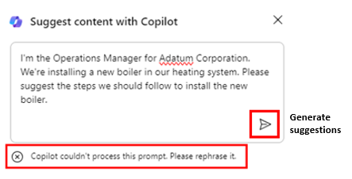
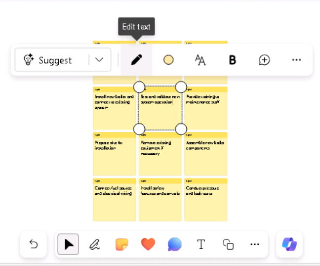
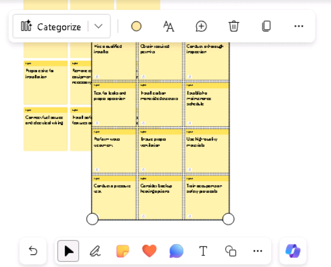
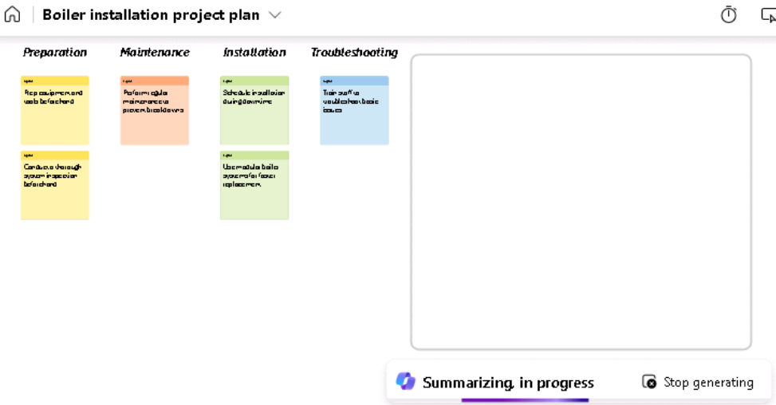

**Lab 08 : Responsabilisez votre personnel – Copilot – Opérations**

**Objectif :**

Les responsables des opérations peuvent utiliser Copilot pour Microsoft
365 afin de rationaliser leur flux de travail et d'améliorer leur
productivité.

Dans cet atelier, vous allez utiliser :

- Copilot dans Whiteboard pour réfléchir à des idées de plan de projet
  pour l'installation d'un nouveau système de chaudière.

- Copilot dans Word pour créer un rapport qui analyse les systèmes de
  chauffage de chaudière par rapport aux systèmes de chauffage, tout en
  comparant les types de production que Copilot peut générer.

- Copilot dans PowerPoint pour créer une présentation basée sur le
  rapport que vous avez créé qui analyse les systèmes de chauffage des
  chaudières et des fournaises.

**Exercice \#1 : Réfléchir à des idées de plan de projet à l'aide de
Copilot dans Whiteboard**

Microsoft Whiteboard est un canevas numérique qui permet aux
utilisateurs de collaborer en temps réel, de réfléchir à des idées et de
créer du contenu en toute simplicité. Les fonctionnalités de Whiteboard
comprennent des dessins de forme libre, des notes autocollantes et des
modèles que vous pouvez personnaliser en fonction de vos besoins. Il
fournit également un espace que vous pouvez utiliser pour des projets,
des brainstormings, des ateliers, des rétrospectives, la conception, la
planification stratégique et pour résoudre des problèmes qui peuvent
avoir des pièces mobiles ou nécessiter plus de visuels.

Whiteboard peut aider à augmenter

- Collaboration en permettant à plusieurs utilisateurs de travailler
  simultanément dans un espace numérique, ce qui facilite le partage de
  visuels et d'idées.

- Productivité en fournissant un espace pour griffonner, partager des
  croquis de prototypes ou compiler une liste d'idées de noms de
  produits.

En tant que Directeur des Opérations chez Adatum Corporation, vous
envisagez d'installer une nouvelle chaudière dans le système de
chauffage de votre bâtiment. Toutefois, avant de commencer le processus
d'installation, vous devez utiliser Copilot dans Whiteboard pour
suggérer les étapes potentielles que les entreprises effectuent
généralement lors de la mise à jour de leur système de chauffage.

Dans cet exercice, vous allez utiliser Copilot dans Whiteboard pour
suggérer les étapes nécessaires à la réalisation d'une telle
installation. Considérez cet exercice comme un exercice de post-it
assisté par l'IA.

1.  Dans votre navigateur Microsoft Edge, ouvrez un nouvel onglet et
    entrez l'URL suivante pour accéder à la page d'accueil de Microsoft
    365 : +++[https://www.office.com+++++](https://www.office.com+++/)

2.  Sur la page d'accueil de **Microsoft 365**, si une icône de
    **Whiteboard** apparaît dans le volet de navigation de gauche,
    sélectionnez-la maintenant et passez à l'étape suivante. Sinon,
    sélectionnez **Explore all your Apps**, et sur la page **Apps**,
    faites défiler jusqu'à la section **Explore by category**, et dans
    l'onglet **Productivity** (qui doit s'afficher par défaut),
    sélectionnez **Whiteboard**.

3.  Connectez-vous au **Microsoft Whiteboard**.

4.  Sur la page d'accueil de **Whiteboard**, sélectionnez **New
    Whiteboard**.

5.  Sur le ruban en haut de la page, sélectionnez la flèche déroulante
    **Whiteboard**. Dans le champ **Board name**, entrez +++**Boiler
    installation project plan**+++, puis sélectionnez l'icône de coche.

6.  Si une fenêtre **Suggest content with Copilot** s'affiche, passez à
    l'étape suivante. Sinon, dans la barre d'icônes qui s'affiche
    au-dessus de la barre des tâches en bas de la page, sélectionnez
    l'icône **Copilot**. Dans le menu qui s'affiche, sélectionnez
    **Suggest**.

7.  Dans la fenêtre **Suggest content with Copilot**, entrez l'invite
    suivante :

++**I'm the Operations Manager for Adatum Corporation. We're installing
a new boiler in our heating system. Please suggest the steps we should
follow to install the new boiler**.++

8.  Si une fenêtre **Suggest content with Copilot** s'affiche, passez à
    l'étape suivante. Cependant, si vous recevez un message indiquant
    que "**Something went wrong. Please try again.**" ou "**Copilot
    couldn't process this prompt. Please rephrase it.**" puis
    sélectionnez la flèche **Generate suggestions** dans le coin
    inférieur de la fenêtre du Copilot.

Parfois, Copilot termine le processus sur lequel il travaille, mais
trébuche un peu avant d'afficher les résultats. Lorsque vous
sélectionnez à nouveau la flèche **Generate suggestions**, elle affiche
généralement les résultats sans trop de délai. Toutefois, si vous
recevez un message similaire une deuxième fois, sélectionnez la flèche
**Generate suggestions** plusieurs fois**.** Si vous continuez à
recevoir cette erreur après trois ou quatre tentatives, simplifiez
l'invite en saisissant le texte suivant :

++**Please suggest the steps we should follow to install a new boiler in
our building's heating system**.++

9.  Par défaut, Copilot génère des idées par groupes de six. Dans la
    fenêtre **Suggest content with Copilot** qui s'affiche, notez les
    six premières idées qu'il a générées. Copilot vous offre deux
    options ici : vous pouvez soit joindre les idées à votre Whiteboard
    si vous êtes satisfait des suggestions, soit demander à Copilot de
    générer plus de suggestions. Notez que le bouton **Insert (6)**
    indique le nombre d'idées générées par Copilot - dans ce cas, 6.

10. Bien que six suggestions constituent un bon point de départ, vous
    souhaitez approfondir les tâches nécessaires à l'installation du
    produit de sécurité, alors sélectionnez le bouton **Generate more**.

**Remarque** : Si Copilot affiche un message d'erreur de quelque nature
que ce soit, sélectionnez à nouveau le bouton \*\***Generate more**\*\*.
Faites-le chaque fois que vous recevez un message d'erreur.

11. Notez comment Copilot a généré six autres idées, de sorte que le
    bouton **Insert (12)** en affiche maintenant **12**. Bien que vous
    puissiez continuer à générer plus d'idées, pour gagner du temps,
    insérons les 12 idées actuellement présentées. Sélectionnez le
    bouton **Insert** (12).

12. Lorsque vous sélectionnez le bouton **Insert**, Copilot joint les
    idées suggérées à votre Whiteboard sous la forme de post-it jaunes.

13. Comme pour une session de brainstorming dans le monde réel
    impliquant de véritables post-its, vous pouvez modifier une note
    particulière, la supprimer, la verrouiller pour qu'elle ne soit plus
    supprimée ultérieurement, etc. Dans Microsoft Whiteboard, ces
    activités sont prises en charge par la fonctionnalité standard de
    Whiteboard.

Si vous n'avez jamais utilisé Whiteboard auparavant, essayez de
sélectionner (double-cliquez) une note spécifique, puis dans la barre de
menu qui s'affiche au-dessus, vous pouvez sélectionner l’icône **Edit
text** (crayon) ou l'une des autres options. La sélection de l'icône
représentant des points de suspension à la fin de la barre de menus
affiche un menu contenant d'autres options, telles que la suppression de
la note. Encore une fois, l'idée derrière Microsoft Whiteboard est
d'imiter les exercices de post-it du monde réel. N'hésitez pas à
modifier une note comme vous le souhaitez.

14. En examinant les idées suggérées, vous estimez qu'elles ne couvrent
    pas suffisamment l'atténuation des risques. Sélectionnez l’icône
    **Copilot** en bas de la page, puis sélectionnez **Suggest** dans le
    menu.

15. Dans la fenêtre **Suggest content with Copilot** qui s'affiche,
    entrez l'invite suivante pour générer plus d'idées sur l'atténuation
    des risques :

++**Suggest ways to mitigate the risks of installing a new boiler into
the building's heating system**.++

16. Passez en revue les six idées suggérées par Copilot. Si vous
    souhaitez que Copilot inclue plus de détails, sélectionnez le bouton
    **Generate more**.

17. Vous êtes satisfait des 12 idées d'atténuation des risques, alors
    sélectionnez le bouton **Insert** **(12)**.

18. Notez comment le bloc de 12 idées d'atténuation des risques est
    sélectionné (voir la bordure extérieure).

19. Copilot superpose partiellement les 12 idées d'atténuation des
    risques sur les 12 idées de plan de projet d'origine, vous pouvez
    sélectionner sur ce bloc d'idées et le déplacer sur l'écran afin
    qu'il ne superpose plus les 12 idées d'origine. Ne vous inquiétez
    pas d'aligner les deux pâtés de maisons. Une fois que vous aurez
    organisé les notes en catégories dans une étape ultérieure, elles
    seront belles et jolies. Pour l'instant, il suffit d'organiser
    chaque bloc de manière à voir toutes les idées. Cela vous donne la
    visibilité nécessaire pour voir quelles zones Copilot a proposées,
    afin que vous puissiez modifier n'importe laquelle d'entre elles si
    vous le souhaitez.

20. Vous êtes maintenant satisfait des suggestions créées par Copilot et
    vous avez terminé toutes les modifications que vous souhaitez
    apporter aux notes. Vous souhaitez maintenant que Copilot organise
    les notes par catégorie. Copilot détermine les noms des catégories
    et organise automatiquement les notes en conséquence. Sélectionnez
    l’icône **Copilot** en bas de la page, puis sélectionnez
    **Categorize** dans le menu.

21. Notez ce qui s'est passé. Copilot a généré un ensemble de catégories
    et réorganisé les notes en conséquence. Chaque catégorie de notes a
    été attribuée à une couleur différente pour aider à identifier les
    différences entre les catégories. Si le rectangle contenant les
    notes n'est pas aussi grand qu'il peut l'être et qu'il s'adapte
    toujours à votre écran, sélectionnez l’icône **Fit to Screen** dans
    le coin inférieur droit de la page. Cela augmente la taille de
    l'image jusqu'à ce qu'elle ne puisse plus l'augmenter sans qu'elle
    ne dépasse la taille de l'écran.

22. Notez la barre d'icônes qui apparaît sous le groupe de notes
    organisé. Si vous n'êtes pas satisfait des catégories, sélectionnez
    le bouton **Regenerate** dans la barre d'icônes qui s'affiche.

**Remarque** : Vous pouvez sélectionner le bouton **Regenerate** autant
de fois que nécessaire jusqu'à ce que vous soyez satisfait des
catégories fournies par Copilot. Sélectionnez ce bouton plusieurs fois
et notez les modifications apportées par Copilot à chaque fois. En plus
de changer les noms des catégories, Copilot peut ajouter ou réduire le
nombre de catégories à chaque régénération.

23. Après avoir régénéré les catégories plusieurs fois, vous vous rendez
    compte qu'il vous manque des étapes détaillées concernant la
    minimisation des temps d'arrêt du système. Vous souhaitez demander à
    Copilot d'ajouter d'autres idées à votre session de Whiteboard
    concernant ce problème. De plus, vous avez identifié une note que
    vous souhaitez supprimer. Cependant, puisque vous avez déjà organisé
    vos idées, vous devez remettre votre session de Whiteboard dans le
    mode d'édition où vous étiez avant de catégoriser les notes. Pour ce
    faire, sélectionnez le bouton **Revert**.

24. Maintenant que vous êtes de retour en mode édition, sélectionnez une
    note dont vous ne voulez plus, puis dans la barre d'icônes qui
    s'affiche, sélectionnez l'icône de points de suspension.
    Sélectionnez **Delete** dans le menu qui s'affiche.

25. Pour que Copilot génère plus d'idées, sélectionnez l’icône
    **Copilot** en bas de la page, puis sélectionnez **Suggest** dans le
    menu.

26. Dans la fenêtre **Suggest content with Copilot** qui s'affiche,
    entrez l'invite suivante pour générer plus d'idées sur la réduction
    des temps d'arrêt du système :

++**Suggest ways to limit heating system downtime when installing a new
boiler**.++

27. Passez en revue les six idées suggérées par Copilot. Vous êtes
    satisfait de ces idées, alors sélectionnez le bouton **Insert**
    **(6)**.

28. Notez comment le bloc de six notes est mis en évidence par une ligne
    autour du bloc. Ce bloc de notes est connu sous le nom de grille de
    notes. Vous pouvez déplacer ou redimensionner une grille de notes
    comme n'importe quel autre élément de votre Whiteboard. Lorsque vous
    redimensionnez une grille de notes, la taille de tous les post-it
    qu'elle contient s'ajuste en conséquence. Si le bloc de six notes se
    superpose à l'un des blocs de notes, sélectionnez l'une des lignes
    extérieures autour de la grille de notes et faites glisser
    l'ensemble du bloc de six notes sur le côté afin qu'il ne superpose
    aucune des notes précédentes. Si vous manquez d'espace à l'écran et
    qu'une partie du bloc tombe de l'écran, sélectionnez l’icône **Fit
    to Screen** dans le coin inférieur droit de la page.

29. Vous êtes prêt à demander à Copilot d'organiser les post-its, qui
    comprennent 18 notes - un bloc de 12 notes et un bloc de six notes.
    Sélectionnez l’icône **Copilot** en bas de la page, puis
    sélectionnez **Categorize** dans le menu. Dans la fenêtre
    **Categorize selected notes**, sélectionnez le bouton
    **Categorize**.

30. Parfois, le rectangle contenant les notes n'est pas aussi grand
    qu'il peut l'être, laissant un espace blanc ouvert tout autour de
    votre toile. Dans cette situation, la taille du texte des notes est
    souvent petite et difficile à lire. Si ce problème de
    dimensionnement se produit, sélectionnez l’icône **Fit to Screen**
    dans le coin inférieur droit de la page. Cela augmente la taille de
    l'image. Si vous continuez à sélectionner ce bouton, il finit par
    atteindre un point où il ne peut plus augmenter la taille du
    rectangle sans dépasser la taille de l'écran. Toute sélection
    ultérieure de cette icône n'a aucun effet sur le rectangle.

31. Passez en revue les catégories. Dans la barre d'icônes Copilot qui
    apparaît sous le rectangle, vous pouvez sélectionner le bouton
    **Regenerate** pour créer un nouvel ensemble de catégories. En fait,
    sélectionnez le bouton **Regenerate** plusieurs fois pour voir
    comment les catégories changent. Une fois que vous êtes satisfait
    des résultats, sélectionnez le bouton **Keep it**.

32. Notez que chaque catégorie de post-it est d'une couleur différente.
    Vous vous rendez compte que vous souhaitez qu'un court résumé de la
    session de brainstorming soit ajouté au contenu de votre Whiteboard.
    Pour ce faire, sélectionnez l’icône **Copilot** en bas de la page,
    puis sélectionnez **Summarize** dans le menu. Copilot génère un bref
    résumé des principaux thèmes de cette session de Whiteboard. Faites
    défiler l'écran vers le bas pour afficher l'intégralité de la
    fenêtre **Summary**. Vous êtes satisfait du résultat, alors
    sélectionnez **Keep it**.

Sélectionnez l’icône **Fit to Screen** dans le coin inférieur droit de
la page pour faire tenir tous les post-it et le résumé de la session sur
l'ensemble de l'écran.

**Exercice \#2 : Comparer les résultats des rapports à l'aide de Copilot
dans Word**

En tant que directeur des opérations chez Adatum Corporation, vous avez
découvert que le système de chaudière actuel qui chauffe l'immeuble de
bureaux de l'entreprise, vieux de 50 ans, a besoin d'importantes
réparations, voire d'un remplacement pur et simple. Vous estimez que
cette situation est peut-être le moment opportun pour convertir votre
système de chauffage du système de chaudière existant à un système de
fournaise plus économe en énergie. Cependant, vous n'êtes pas familier
avec les différences entre les deux types de systèmes de chauffage. Vous
souhaitez examiner la situation avec Copilot dans Word et créer un
rapport que vous pouvez présenter à la direction.

**Remarque** : Vous avez entendu dire que Copilot dans Word peut générer
des rapports pour vous, mais vous ne l'avez pas encore utilisé. En tant
que tel, vous n'êtes pas sûr du type de rapport qu'il fournit. Vous
souhaitez profiter de cette occasion non seulement pour créer votre
rapport, mais aussi pour examiner les fonctionnalités de rapport de
Copilot. Alors, voici votre plan :

- Vous avez précédemment identifié plusieurs questions que vous
  souhaitez que Copilot étudie concernant les systèmes de chauffage par
  chaudière par rapport aux systèmes de chauffage de fournaise.

- Vous prévoyez de demander à Copilot de créer un rapport qui couvre
  toutes ces questions.

- Vous prévoyez ensuite de poser à Copilot chacune de ces questions
  individuellement afin de pouvoir voir chaque réponse.

- Vous pouvez ensuite comparer le rapport créé par Copilot aux réponses
  individuelles qu'il génère pour chaque question. Dans ce dernier
  scénario, vous pouvez copier-coller chaque réponse dans un document
  pour créer votre propre rapport si vous le souhaitez, ou pour
  compléter un document existant.

L'objectif de cet exercice est de montrer comment Copilot dans Word
fournit un niveau de réponse différent selon la modalité que vous
utilisez, soit dans le volet Copilot, soit lors de la création d'un
document.

1.  Si vous avez un onglet Microsoft 365 ouvert dans le navigateur Edge,
    sélectionnez-le maintenant ; sinon, ouvrez un nouvel onglet et
    entrez l'URL suivante :
    +++[https://www.office.com+++++](https://www.office.com+++/)

Remarque : Vous devez vous connecter (si vous y êtes invité) à l'aide
des **Microsoft 365 Credentials** fournies sous l'onglet **Resources** à
droite.

2.  Avec votre plan à l'esprit, vous décidez d'abord d'utiliser Copilot
    dans Word pour créer un rapport qui répond à toutes vos questions.
    Dans le volet de navigation **Microsoft 365**, sélectionnez
    **Microsoft Word**, puis ouvrez un document vierge.

3.  Dans la fenêtre **Draft with Copilot** qui s'affiche en haut du
    document vierge, entrez l'invite suivante et sélectionnez le bouton
    **Generate** :

+++I'm the Operations Manager for Adatum Corporation. We're thinking
about possibly replacing our building's current boiler system with a
furnace system. Write a report describing what type of boiler systems
are used in most commercial buildings, and include what considerations I
need to take into account to change from an existing boiler system to a
furnace system, the average cost of transitioning from a boiler system
to a furnace system in a commercial two-story building built in the
1970s, whether changing from a boiler system to a furnace system will
have any effect on our current air conditioning system, and the average
defect rates for boiler systems versus furnace systems.+++

4.  Examinez le rapport généré par Copilot. Notez le niveau de détail
    dans chaque zone d'intérêt. Puisque vous souhaitez enregistrer ce
    document pour le prochain exercice de cas d'utilisation,
    sélectionnez le bouton **Keep it** dans la barre d'état Copilot,
    puis enregistrez le document.

**Remarque** : Assurez-vous d'enregistrer le rapport, car vous
l'utiliserez dans l'exercice suivant.

5.  L'invite que vous avez saisie pour créer le rapport comprenait cinq
    demandes. Vous devez maintenant poser à Copilot chacune de ces cinq
    questions individuellement. Sélectionnez **Copilot** sur le ruban
    Word, qui ouvre le volet **Copilot**.

6.  Dans le volet **Copilot**, dans le champ d'invite en bas du volet,
    entrez la question suivante, puis sélectionnez la flèche **Send** :

+++What type of boilers do most buildings use as part of their heating
systems?+++

7.  Examinez la réponse. Bien que vous puissiez sélectionner l'option
    **Copy** si vous souhaitez coller la réponse dans le document, pour
    cette formation, vous allez simplement sélectionner d'autres invites
    pour voir les réponses que vous recevez.

8.  Entrez des invites distinctes pour chacune des quatre questions
    restantes :

    - **What considerations do I need to take into account to change
      from an existing boiler system to a furnace system in a commercial
      building?**

    - **What is an average cost for transitioning from a boiler system
      to a furnace system in a commercial two-story building built in
      the 1970s?**

    - **if we change from a boiler system to a furnace system, will it
      have any effect on our current air conditioning system?**

    - **What are the average defect rates for boiler systems versus
      furnace systems?**

9.  Notez comment Copilot a répondu à chacune de vos questions, mais il
    n'a inséré aucune des réponses dans le document actuel. Bien que
    vous puissiez copier et coller chaque réponse dans le document, il
    semble évident que le simple fait de demander à Copilot de créer le
    rapport est plus efficace.

10. Voici quelques conseils pour réfléchir aux réponses lorsque vous
    avez utilisé Copilot dans Word

    - Comment le niveau d'information de chaque méthode de déclaration
      se compare-t-il les uns aux autres ?

Comparez le niveau d'informations fourni lors de la création d'un
rapport par Copilot dans Word par rapport aux réponses fournies lorsque
vous avez posé les questions individuellement dans le volet Copilot.

- Qu'avez-vous remarqué ?

Lorsque vous demandez à Copilot de créer un rapport, il fournit
généralement des réponses plus riches qu'il organise dans un rapport
attrayant. À l'inverse, lorsque vous demandez à Copilot de répondre à
des questions individuellement dans le volet Copilot, il ne renvoie pas
le niveau de détail du rapport, bien qu'il vous permette de copier et
coller les réponses dans un document. Cependant, cela peut vous obliger
à reformater les réponses insérées pour résoudre tout problème de
formatage.

**Exercice \#3 : Créer une présentation comparant les systèmes de
chauffage à l'aide de Copilot dans PowerPoint**

La maîtrise de l'utilisation de Copilot dans PowerPoint est une
compétence stratégique pour les professionnels qui souhaitent augmenter
l'impact de leurs présentations. Copilot dans PowerPoint sert de
collaborateur intelligent, offrant des suggestions et des améliorations
en temps réel pendant que les responsables des opérations élaborent
leurs présentations.

En tant que directeur des opérations chez Adatum Corporation, vous avez
découvert que le système de chaudière actuel qui chauffe l'immeuble de
bureaux de l'entreprise, vieux de 50 ans, a besoin d'importantes
réparations, voire d'un remplacement pur et simple. Vous pensez que le
moment est peut-être opportun pour passer de votre système de chauffage
à un système de chauffage plus économe en énergie.

Dans cet exercice, vous allez demander à Copilot dans PowerPoint de
créer une présentation basée sur le rapport **Comparing boiler and
furnace heating systems**. Votre objectif est de mettre l'équipe de
direction d'Adatum au courant des deux types de systèmes de chauffage, y
compris les avantages et les inconvénients de chacun, avant de contacter
une entreprise de chauffage, de ventilation et de climatisation (CVC) et
de lancer officiellement ce projet.

1.  Si vous avez un onglet **Microsoft 365** ouvert dans votre
    navigateur Microsoft Edge, sélectionnez-le maintenant ; sinon,
    ouvrez un nouvel onglet et entrez l'URL suivante :
    +++[https://www.office.com+++++](https://www.office.com+++/) pour
    accéder à la page d'accueil de Microsoft 365.

**Remarque** : Vous devez vous connecter (si vous y êtes invité) à
l'aide des **Microsoft 365 Credentials** fournies sous l'onglet
**Resources** à droite.

2.  Dans le volet de navigation **Microsoft 365**, sélectionnez
    **OneDrive** pour l'ouvrir.

3.  Accédez au dossier **C :\LabFiles** pour sélectionner et télécharger
    une copie du document de rapport **Comparing boiler and furnace
    heating systems** sur **OneDrive**.

**Astuce** : ouvrez et fermez le fichier pour l'intégrer dans votre
liste de fichiers les plus récemment utilisés (MRU).

**Remarque** : Si vous avez déjà téléchargé toutes les ressources du Lab
sur OneDrive, comme suggéré dans **la section Préparation de l'exécution
du Lab,** vous pouvez ignorer cette étape.

4.  Sur la page d’**accueil de Microsoft 365**, sélectionnez l’icône
    **PowerPoint** dans le volet de navigation à gauche.

5.  Dans **PowerPoint**, ouvrez une nouvelle présentation vierge.

6.  Sélectionnez l’icône **Copilot** (en surbrillance rouge comme
    indiqué dans la capture d'écran).

7.  Dans le volet **Copilot** qui s'affiche, vous pouvez choisir parmi
    plusieurs invites prédéfinies. Sélectionnez l’invite **Create
    presentation from file**.
    

8.  Dans le champ d'invite situé en bas du volet **Copilot**, Copilot
    saisit automatiquement le texte : **Create presentation from file
    /**. La barre oblique est l'indicateur universel du Copilot pour
    entrer un lien vers un fichier. Dans ce cas, il déclenche
    l'ouverture d’une fenêtre de **Suggestions** par Copilot qui affiche
    trois des derniers fichiers utilisés.

- Si votre fichier apparaît ici, sélectionnez-le maintenant et passez à
  l'étape suivante.

- Si le fichier n'est pas l'un des trois fichiers affichés, sélectionnez
  la flèche droite (**\>**) dans le coin supérieur droit de la fenêtre
  **Suggestions** pour afficher une liste de fichiers MRU développée. Si
  le fichier apparaît ici, sélectionnez-le maintenant et passez à
  l'étape suivante.

- Si vous ne voyez pas votre fichier dans la liste MRU développée, vous
  devez copier le lien vers le rapport et le coller dans le champ
  d'invite. Pour ce faire :

  1.  Sélectionnez l'onglet du navigateur **Microsoft 365** et
      sélectionnez **Word** dans le volet de navigation.

  2.  Dans la page d'accueil de **Word**, dans la liste des fichiers
      récents, sélectionnez le rapport pour l'ouvrir dans Word**.**

  3.  Dans le rapport dans Word, à l'extrême droite au-dessus du ruban,
      sélectionnez le bouton **Share**. Dans le menu déroulant qui
      s'affiche, sélectionnez **Copy Link**. Attendez que la fenêtre
      **Link copied** s'affiche, ce qui vous assure que le lien vers le
      fichier a été copié dans votre presse-papiers.

  4.  Basculez vers votre onglet **PowerPoint** et, en bas du volet
      **Copilot**, le champ d'invite doit toujours afficher **Create
      presentation from file /**. Placez votre curseur après la barre
      oblique (**/**), puis collez (**Ctrl+V**) le lien vers le rapport.

9.  Notez comment le fichier apparaît dans le champ d'invite.
    Sélectionnez l’icône **Send** dans le champ d'invite.

10. Cette invite a incité Copilot à créer une présentation de
    diapositives basée sur le document. Ce faisant, il a d'abord affiché
    le plan de la présentation dans le volet Copilot. Ensuite, il a
    affiché une fenêtre distincte montrant une liste à puces de
    certaines des modifications qu'il a apportées à la présentation en
    fonction du document.

11. Vous êtes maintenant libre d'examiner les diapositives et
    d'effectuer les mises à jour nécessaires. Portez une attention
    particulière aux modifications apportées par Copilot sur la base du
    document. Vous pouvez utiliser l’outil **Designer** pour ajuster les
    mises en page.

12. Passez en revue les notes du présentateur que Copilot a ajoutées à
    chaque diapositive de la présentation. Vérifiez qu'ils mentionnent
    les points que vous souhaitez faire valoir pendant la présentation.

13. Essayez d'utiliser Copilot pour mettre à jour la présentation.
    Commençons par ajouter une image à une diapositive. Recherchez une
    diapositive sans image et entrez l'invite suivante (n'oubliez pas de
    remplacer \[entrez le numéro de la diapositive ici\] par le numéro
    de la diapositive que vous avez sélectionnée) :

++**Add an image to slide \[enter slide number here\]**. **The image
should contain a picture related to the slide contents**.++

14. Vous remarquerez également qu'il n'y a pas de contenu dans la
    présentation lié à la durée de vie prévue pour chaque type de
    système de chauffage. Vous souhaitez que Copilot effectue des
    recherches sur ce sujet, puis l'ajoute à la présentation. Entrez
    l'invite suivante :

++**What is the average lifespan of a boiler heating system versus a
furnace heating system**?++

15. Vous souhaitez maintenant que Copilot ajoute ce contenu à une
    diapositive. Sélectionnez la diapositive vers le début de la
    présentation qui énumère les types de systèmes de chaudière. Entrez
    ensuite l'invite suivante (n'oubliez pas de remplacer \[entrez le
    numéro de la diapositive ici\] par le numéro de la diapositive que
    vous avez sélectionnée) :

++**Add this lifespan content to slide \[enter slide number here\]**.++

16. Qu'a fait Copilot ? A-t-il fait quelque chose comme ajouter
    "**Lifespan content**" en haut de la diapositive, en le superposant
    au contenu existant sur la diapositive ? Ou a-t-il fait quelque
    chose de similaire ?

17. L'invite n'a pas fonctionné comme prévu. Supprimez tout ce qui a été
    ajouté à la diapositive.

18. Maintenant, essayez à nouveau, mais cette fois-ci, demandez à
    Copilot de trouver le contenu sur la durée de vie et de l'ajouter à
    la diapositive en une seule invite. Cette fois, entrez l'invite
    suivante :

++**Add content about the average lifespan of a boiler heating system
versus a furnace heating system to slide \[enter slide number
here\].**++

19. Cela a-t-il mieux fonctionné ? Il vous suffit de retravailler vos
    invites si Copilot ne fait pas exactement ce que vous vouliez.

20. Vous remarquez qu'il n'y a pas de diapositive à la fin pour une
    session de questions-réponses (Q&R). Pour corriger cette situation,
    entrez l'invite suivante :

++**Add a Q&A slide at the very end of the presentation with an
appropriate image**.++

21. Examinez la nouvelle diapositive qui a été créée. Après avoir vu
    cette diapositive, vous souhaitez que Copilot crée une liste de
    questions possibles et les ajoute aux notes du présentateur pour la
    diapositive de questions-réponses. Entrez l'invite suivante :

++**Create a list of five questions that may be asked during the Q&A
session and add them to the speaker notes in the Q&A slide**.++

22. Comment Copilot a-t-il réagi lorsque vous avez essayé cette invite ?
    A-t-il ajouté cinq questions aux notes du présentateur pour la
    diapositive de questions et réponses ? Si c'est le cas, alors
    félicitations !

**Remarque** : Copilot peut afficher une exception (rappelez-vous que
Copilot est toujours un travail en cours) comme celle ci-dessous.

Veuillez essayer de reformuler l'invite ou d'utiliser les invites
suggérées comme celle ci-dessous.

23. Sélectionnez la commande **Add a slide about** et ajoutez **Q&A at
    the very end of the presentation** (comme indiqué dans la capture
    d'écran)

24. Cliquez sur Envoyer pour vérifier ce qui se passe.

Copilot a ajouté une diapositive de questions-réponses comme indiqué.

25. Essayez maintenant avec une autre invite :

**Ajoutez une diapositive sur (Add a slide about)** ce que le public
peut demander à propos de la présentation

26. Une fois que vous avez terminé la présentation finale, vous pouvez
    l'enregistrer pour référence future ou la supprimer.

**Résumé :**

Dans cet atelier, vous avez utilisé :

- Copilot dans Whiteboard pour générer et organiser des idées de plans
  de projet pour l'installation d'un nouveau système de chaudière,
  favorisant ainsi une planification collaborative et créative.

- Copilot dans Word pour créer un rapport détaillé et comparer les types
  de résultats que Copilot peut générer, mettant en valeur sa
  polyvalence dans la création de contenu.
