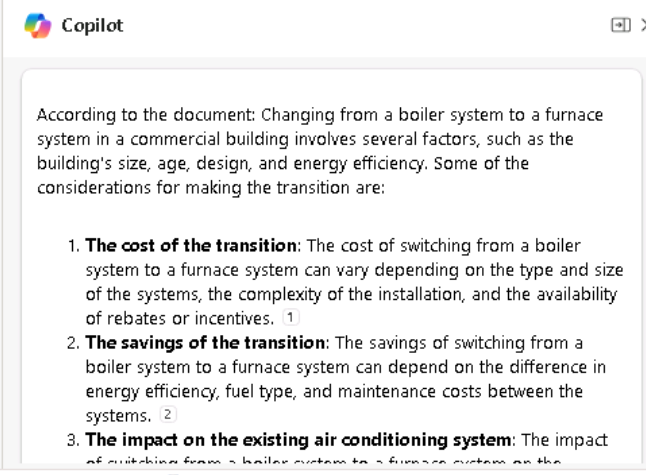

**실습 08: 직원 역량 강화 – Copilot – 운영**

**목표:**

운영 관리자는 Copilot for Microsoft 365를 사용하여 워크플로를 간소화하고
생산성을 향상시킬 수 있습니다.

이 실습에서는 다음을 사용합니다:

- Whiteboard의 Copilot은 새로운 보일러 시스템을 설치하기 위한 프로젝트
  계획 아이디어를 브레인스토밍하기.

- Word의 Copilot에서 사용하여 보일러 난방 시스템과 용광로 난방 시스템을
  분석하는 동시에 Copilot이 생성할 수 있는 출력 유형을 비교하는 보고서를
  생성할 수 있습니다.

- PowerPoint의 Copilot - 보일러 및 용광로 난방 시스템을 분석하기 위해
  만든 보고서를 기반으로 프레젠테이션을 생성하기.

**연슴 #1: Whiteboard의 Copilot을 사용하여 프로젝트 계획 아이디어브레인스토밍하기**

Microsoft Whiteboard는 사용자가 실시간으로 공동 작업하고, 아이디어를
브레인스토밍하고, 콘텐츠를 쉽게 만들 수 있는 디지털 캔버스입니다.
Whiteboard의 기능에는 자유 형식 그리기, 스티커 메모 및 필요에 맞게
사용자 지정할 수 있는 템플릿이 포함됩니다. 또한 프로젝트, 브레인스토밍,
워크샵, 회고전, 디자인, 전략 계획 및 움직이는 부분이 있거나 더 많은 시각
자료가 필요할 수 있는 문제를 해결하는 데 사용할 수 있는 공간을
제공합니다.

Whiteboard는 다음을 늘리는 데 도움이 될 수 있습니다.

- 여러 사용자가 디지털 공간에서 동시에 작업할 수 있도록 하여 시각적
  개체와 아이디어를 쉽게 공유할 수 있도록 하여 협업하기.

- 낙서하거나, 프로토타입 스케치를 공유하거나, 제품 이름 아이디어 목록을
  작성할 수 있는 공간을 제공하여 생산성 향상하기.

Adatum Corporation의 운영 관리자로서 건물의 난방 시스템에 새 보일러를
설치할 계획입니다. 그러나 설치 프로세스를 시작하기 전에 Whiteboard에서
Copilot을 사용하여 회사가 난방 시스템을 업데이트할 때 일반적으로
완료하는 잠재적 단계를 제안하려고 합니다.

이 연습에서는 Whiteboard의 Copilot을 사용하여 이러한 설치를 완료하는 데
필요한 단계를 제안합니다. 이 연습은 기본적으로 AI의 도움을 받는 스티커
메모 연습이라고 생각하면 됩니다.

1.  Microsoft Edge 브라우저에서 새 탭을 열고 다음 URL을 입력하여
    Microsoft 365 홈페이지로
    이동하세요: +++[https://www.office.com+++](https://www.office.com+++/)

2.  **Microsoft 365** 홈페이지에서 **Whiteboard** 아이콘이 왼쪽 탐색
    창에 나타나면 지금 선택하고 다음 단계로 진행하세요. 그렇지 않으면
    **Explore all your Apps**을 선택하고 **Apps** 페이지에서 **Explore
    by category** 섹션까지 아래로 스크롤한 후 생산성 탭(기본적으로
    표시되어야 함)에서 **Whiteboard**를 선택하세요

3.  **Microsoft Whiteboard**로 로그인하세요.

4.  **Whiteboard** 홈페이지에서 **New Whiteboard**를 선택하세요.

5.  페이지 맨 위에 있는 리본에서 **Whiteboard**  드롭다운 화살표를
    선택하세요. **Board name**에 +++**Boiler installation project
    plan**+++을 입력한 후 확인 표시 아이콘을 선택하세요.

6.  **Suggest content with Copilot** 창이 나타나면 다음 단계로
    진행하세요. 그렇지 않으면 페이지 아래쪽의 작업 표시줄 위에 표시되는
    아이콘 트레이에서 **Copilot** 아이콘을 선택하세요. 표시되는 메뉴에서
    **Suggest**을 선택하세요.

7.  **Suggest content with Copilot** 창에서 다음 프롬프트를 입력하세요:

++**I'm the Operations Manager for Adatum Corporation. We're installing
a new boiler in our heating system. Please suggest the steps we should
follow to install the new boiler**.++

8.  **Suggest content with Copilot** 창이 나타나면 다음 단계로
    진행하세요. 그러나 다음과 같은 메시지가 "**Something went wrong.
    Please try again.**" 또는 "**Copilot couldn't process this prompt.
    Please rephrase it.**" 표시되는 경우 Copilot 창의 아래쪽 모서리에
    있는 **Generate suggestions** 화살표를 선택하세요.

때때로 Copilot은 작업 중인 프로세스를 완료했지만 결과를 표시하기 전에
약간 비틀거립니다. **Generate suggestions**화살표를 다시 선택하면
일반적으로 많은 지연 없이 결과가 표시됩니다. 그러나 유사한 메시지를 두
번 받으면 **Generate suggestions**화살표를 몇 번 더 선택하세요. 3-4회
시도 후에도 이 오류가 계속 발생하면 다음 텍스트를 입력하여 프롬프트를
단순화하세요:

++**Please suggest the steps we should follow to install a new boiler in
our building's heating system**.++

9.  기본적으로 Copilot은 6개의 그룹으로 아이디어를 생성하세요. 표시되는
    **Suggest content with Copilot**창에서 생성된 처음 6개의 아이디어를
    기록해 두세요. Copilot은 여기에서 두 가지 옵션을 제공합니다 - 제안에
    만족하는 경우 Whiteboard에 아이디어를 첨부하거나 Copilot이 더 많은
    제안을 생성하도록 할 수 있습니다. **Insert (6)** 버튼이 Copilot이
    생성한 아이디어의 수(이 경우 6)를 나타내는 방식을 주목하세요.

10. 6가지 제안이 좋은 시작점이지만 보안 제품을 설치하는 데 필요한 작업을
    더 자세히 살펴보고 싶다면 **Generate more**버튼을 선택하세요.

**참고**: Copilot에 어떤 종류의 오류 메시지가 표시되면 \*\* Generate
more\*\* 버튼을 다시 선택하세요. 오류 메시지가 나타날 때마다 이 작업을
수행하세요.

11. Copilot이 또 다른 6개의 아이디어를 생성했기 때문에 **Insert (12)**
    버튼에 이제 **12**가 표시됩니다. 더 많은 아이디어를 계속 생성할 수
    있지만 시간 관계상 현재 제시된 12가지 아이디어를 삽입해 보겠습니다.
    **Insert (12)** 버튼을 선택하세요.

12. **Insert** 버튼을 선택하면 Copilot이 제안된 아이디어를 노란색 스티커
    메모 형태로 Whiteboard에 첨부합니다.

13. 실제 스티커 메모와 관련된 실제 브레인스토밍 세션과 마찬가지로 특정
    메모를 편집하거나, 삭제하거나, 나중에 제거하지 못하도록 잠그는 등의
    작업을 수행할 수 있습니다. Microsoft Whiteboard에서 이러한 활동은
    표준 Whiteboard 기능을 통해 지원됩니다.

이전에 Whiteboard를 사용한 적이 없는 경우 특정 노트를 선택(두 번 클릭)한
후 그 위에 나타나는 메뉴 표시줄 에서 **Edit text** (연필) 아이콘 또는
다른 옵션을 선택할 수 있습니다. 메뉴 표시줄 끝에 있는 줄임표 아이콘을
선택하면 메모 삭제와 같은 추가 옵션 메뉴가 표시됩니다. 다시 말하지만,
Microsoft Whiteboard의 기본 아이디어는 실제 스티커 메모 연습을 모방하는
것입니다. 원하는 대로 메모를 자유롭게 편집하세요.

14. 제안된 아이디어를 살펴보면 위험 완화를 적절하게 다루지 않는다고
    느낍니다. 페이지 아래쪽에서 **Copilot** 아이콘을 선택한 후 메뉴에서
    **Suggest **을 선택하세요.

15. 표시되는 ** Suggest content with Copilot **창에서 다음 프롬프트를
    입력하여 위험 완화에 대한 더 많은 아이디어를 생성하세요:

++**Suggest ways to mitigate the risks of installing a new boiler into
the building's heating system**.++

16. Copilot이 제안한 6가지 아이디어를 검토하세요. Copilot에 더 많은 세부
    정보를 포함하려면 **Generate more**버튼을 선택하세요.

17. 12가지 위험 완화 아이디어에 만족했으므로 **Insert (12)** 버튼을
    선택하세요.

18. 12가지 위험 완화 아이디어 블록이 어떻게 선택되는지 확인하세요 (외부
    테두리 참조).

19. Copilot은 원래 12개의 프로젝트 계획 아이디어 위에 12개의 위험 완화
    아이디어를 부분적으로 오버레이하며, 이 아이디어 블록을 선택하고
    화면에서 이동하여 원래 12개의 아이디어가 더 이상 오버레이되지 않도록
    할 수 있습니다. 두 블록을 정렬하는 것에 대해 걱정하지 마세요. 나중
    단계에서 메모를 범주로 정리하면 멋지고 예쁘게 보일 것입니다. 지금은
    모든 아이디어를 볼 수 있도록 각 블록을 정렬하세요. 이렇게 하면
    Copilot이 제안한 영역을 확인하는 데 필요한 가시성을 얻을 수 있으므로
    원하는 경우 해당 영역을 편집할 수 있습니다.

20. 이제 Copilot에서 만든 제안에 만족했으며 노트에 대해 원하는 모든
    편집을 완료했습니다. 이제 Copilot이 범주별로 메모를 구성하려고
    합니다. Copilot은 범주의 이름을 결정하고 그에 따라 메모를 자동으로
    구성합니다. 페이지 아래쪽에서 **Copilot** 아이콘을 선택한 후
    메뉴에서 **Categorize **를 선택하세요.

21. 무슨 일이 일어났는지 주목하세요. Copilot은 일련의 범주를 생성하고
    그에 따라 메모를 재구성했습니다. 노트의 각 범주에는 범주 간의
    차이점을 식별하는 데 도움이 되도록 다른 색상이 할당되었습니다.
    노트가 포함된 사각형이 가능한 한 크지 않고 여전히 화면에 맞는 경우
    페이지의 오른쪽 아래 모서리에 있는 **Fit to Screen**아이콘을
    선택하세요. 이렇게 하면 화면 크기를 초과하지 않고 더 이상 늘릴 수
    없을 때까지 이미지 크기가 증가합니다.

22. 정리된 메모 그룹 아래에 나타나는 아이콘 트레이를 확인하세요. 범주가
    만족스럽지 않으면 나타나는 아이콘 트레이에서 **Regenerate** 버튼을
    선택하세요.

**참고** Copilot이 제공하는 범주에 만족할 때까지 필요한 만큼
**Regenerate**버튼을 선택할 수 있습니다. 이 버튼을 여러 번 선택하고
Copilot이 매번 변경하는 사항을 확인합니다. 범주 이름을 변경하는 것
외에도 Copilot은 재생성할 때마다 범주 수를 추가하거나 줄일 수 있습니다.

23. 범주를 여러 번 다시 생성한 후 시스템 가동 중지 시간 최소화와 관련된
    자세한 단계가 누락되었음을 알게 됩니다. Copilot에게 이 문제와 관련된
    Whiteboard 세션에 더 많은 아이디어를 추가하도록 요청하려고 합니다.
    또한 제거하려는 메모를 식별했습니다. 그러나 이미 아이디어를 정리했기
    때문에 Whiteboard 세션을 메모를 분류하기 전의 편집 모드로 다시
    변경해야 합니다. 이렇게 하려면 **Revert** 버튼을 선택하세요.

24. 이제 편집 모드로 돌아왔으므로 더 이상 원하지 않는 노트를 선택한 후
    나타나는 아이콘 트레이에서 줄임표 아이콘을 선택합니다. 표시되는
    메뉴에서 **Delete** 를 선택하세요.

25. Copilot이 더 많은 아이디어를 생성하도록 하려면 페이지 아래쪽에 있는
    **Copilot** 아이콘을 선택한 후 메뉴에서 **Suggest**을 선택하세요.

26. 표시되는 **Suggest content with Copilot**창에서 다음 프롬프트를
    입력하여 시스템 가동 중지 시간을 최소화하는 방법에 대한 추가
    아이디어를 생성하세요:

++**Suggest ways to limit heating system downtime when installing a new
boiler**.++

27. Copilot이 제안한 6가지 아이디어를 검토하세요. 이러한 아이디어에
    만족하면 **Insert (6)** 버튼을 선택하세요.

28. 6개의 음표로 구성된 블록이 블록 주위에 선으로 강조 표시되는 방식을
    주목하십시오. 이 음표 블록을 음표 격자라고 합니다. Whiteboard의 다른
    요소와 마찬가지로 노트 그리드를 이동하거나 크기를 조정할 수
    있습니다. 메모 격자의 크기를 조정하면 그 안에 있는 모든 스티커
    메모의 크기가 그에 따라 조정됩니다. 6개의 음표 블록이 음표 블록 중
    하나의 위에 오버레이되는 경우 음표 격자 주위의 바깥쪽 선 중 하나를
    선택하고 6개의 음표로 구성된 전체 블록을 옆으로 드래그하여 이전
    음표가 겹치지 않도록 합니다. 화면의 공간이 부족하여 블록의 일부가
    화면에서 떨어지는 경우 페이지의 오른쪽 아래 모서리에 있는 **Fit to
    Screen** 아이콘을 선택하세요.

29. Copilot이 12개의 음표 블록과 6개의 음표 블록으로 구성된 18개의
    음표를 포함하는 스티커 메모를 정리할 준비가 되었습니다. 페이지
    아래쪽에서 **Copilot** 아이콘을 선택한 후 메뉴에서 **Categorize** 를
    선택하세요. **Categorize selected notes**
    창에서**Categorize** 버튼을 선택하세요

30. 때로는 노트를 포함하는 사각형의 크기가 가능한 한 크지 않아 캔버스
    주위에 빈 공간이 남습니다. 이 경우 메모의 텍스트 크기가 작고 읽기
    어려운 경우가 많습니다. 이 크기 조정 문제가 발생하면 페이지의 오른쪽
    아래 모서리에 있는 **Fit to Screen**아이콘을 선택합니다. 이렇게 하면
    이미지 크기가 커집니다. 이 버튼을 계속 선택하면 결국 화면 크기를
    초과하지 않고 사각형의 크기를 더 이상 늘릴 수 없는 지점에
    도달합니다. 이 아이콘을 더 이상 선택해도 사각형에는 영향을 주지
    않습니다.

31. 범주를 검토합니다. 사각형 아래에 나타나는 Copilot 아이콘 트레이에서
    **Regenerate **버튼을 선택하여 새 범주 집합을 만들 수 있습니다.
    실제로 **Regenerate **버튼을 여러 번 선택하여 범주가 어떻게
    변경되는지 확인합니다. 결과에 만족하면 **Keep it** 버튼을
    선택하세요.

32. 스티커 메모의 각 범주가 어떻게 다른 색상인지 확인하세요.
    브레인스토밍 세션에 대한 간단한 요약을 Whiteboard 콘텐츠에 추가하고
    싶다는 것을 알게 되었습니다. 이렇게 하려면 페이지 아래쪽에서
    **Copilot** 아이콘을 선택한 후 메뉴에서 **Summarize** 을 선택하세요.
    Copilot은 이 Whiteboard 세션의 주요 주제에 대한 간략한 요약을
    생성하세요. 아래로 스크롤하여 전체 **Summary** 창을 검토하세요.
    결과에 만족하면 **Keep it**를 선택하세요

33. 모든 스티커 메모와 세션 요약을 전체 화면에 맞추기 위해 페이지의
    오른쪽 아래 모서리에 있는 **Fit to Screen** 아이콘을 선택하세요.

**연습 \#2: Word에서 Copilot을 사용하여 보고 결과 비교하기**

Adatum Corporation의 운영 관리자로서 귀하는 회사의 50년 된 사무실 건물을
가열하는 현재 보일러 시스템이 완전한 교체는 아니더라도 상당한 수리가
필요하다는 것을 알게 되었습니다. 이 상황이 난방 시스템을 기존 보일러
시스템에서 더 에너지 효율적인 용광로 시스템으로 전환할 수 있는 적절한
시기일 수 있다고 생각합니다. 그러나 두 가지 유형의 난방 시스템 간의
차이점에 익숙하지 않습니다. Word에서 Copilot을 사용하여 상황을 조사하고
경영진에게 제시할 수 있는 보고서를 생성하려고 합니다.

**참고**: Word의 Copilot이 보고서를 생성할 수 있다고 들었지만 아직
사용해 보지는 않았습니다. 따라서 어떤 종류의 보고를 제공하는지 확신할 수
없습니다. 이 기회를 통해 보고서를 만들 뿐만 아니라 Copilot의 보고 기능을
조사하려고 합니다. 여기 계획입니다:

- 이전에 Copilot이 보일러 대 용광로 난방 시스템과 관련하여 조사하기를
  원하는 몇 가지 질문을 식별했습니다.

- Copilot이 이러한 모든 질문을 다루는 하나의 보고서를 생성도록 할
  계획입니다.

- 각 응답을 볼 수 있도록 Copilot에게 각 질문을 개별적으로 질문할
  계획입니다.

- Copilot에서 생성하는 보고서와 각 질문에 대해 생성하는 개별 답변을
  비교할 수 있습니다. 후자의 시나리오에서는 원하는 경우 각 답변을
  복사하여 문서에 붙여넣어 고유한 보고서를 생성하거나 기존 문서를 보완할
  수 있습니다.

이 연습의 목적은 Copilot 창에서 또는 새 문서를 만들 때 사용하는 형식에
따라 Word의 Copilot가 다른 수준의 응답을 제공하는 방법을 보여 주는
것입니다.

1.  Edge 브라우저에서 Microsoft 365 탭이 열려 있는 경우 지금 선택하세요.
    그렇지 않으면 새 탭을 열고 다음 URL을
    입력하세요: +++[https://www.office.com+++](https://www.office.com+++/)

참고: 오른쪽의 **Resources **탭 아래에 제공된 **Microsoft 365
Credentials**을** **사용하여 로그인(메시지가 표시되는 경우)해야 합니다.

2.  계획을 염두에 두고 먼저 Word에서 Copilot을 사용하여 모든 질문을
    해결하는 보고서를 만들기로 결정합니다. **Microsoft 365** 탐색 창에서
    **Microsoft Word**를 선택한 후 빈 문서를 여세요.

3.  빈 문서의 맨 위에 표시되는 **Draft with Copilot** 창에서 다음
    프롬프트를 입력하고 **Generate** 버튼을 선택하세요:

+++I'm the Operations Manager for Adatum Corporation. We're thinking
about possibly replacing our building's current boiler system with a
furnace system. Write a report describing what type of boiler systems
are used in most commercial buildings, and include what considerations I
need to take into account to change from an existing boiler system to a
furnace system, the average cost of transitioning from a boiler system
to a furnace system in a commercial two-story building built in the
1970s, whether changing from a boiler system to a furnace system will
have any effect on our current air conditioning system, and the average
defect rates for boiler systems versus furnace systems.+++

4.  Copilot에서 생성한 보고서를 검토하세요. 각 관심 영역의 세부 정보
    수준을 확인하세요. 다음 사용 사례 연습을 위해 이 문서를 저장하려면
    Copilot 트레이에서 **Keep it** 버튼을 선택한 후 문서를 저장하세요.

**참고**: 다음 연습에서 사용할 것이므로 보고서를 저장해야 합니다.

5.  보고서를 만들기 위해 입력한 프롬프트에는 5개의 요청이 포함되어
    있습니다. 이제 Copilot에게 이 5가지 질문을 각각 개별적으로
    물어보려고 합니다. **Copilot** 창을 여는 Word 리본에서 **Copilot**을
    선택하세요.

6.  **Copilot** 창의 창 아래쪽에 있는 프롬프트 필드에 다음 질문을 입력한
    후 **Send **화살표를 선택하세요:

+++What type of boilers do most buildings use as part of their heating
systems?+++

7.  답변을 검토하세요. 응답을 문서에 붙여 넣으려는 경우 **Copy** 옵션을
    선택할 수 있지만 이 교육에서는 받은 응답을 보기 위해 더 많은
    프롬프트를 선택하면 됩니다.

8.  나머지 4개의 질문 각각에 대해 별도의 프롬프트를 입력하세요:

    - **What considerations do I need to take into account to change
      from an existing boiler system to a furnace system in a commercial
      building?**

    - **What is an average cost for transitioning from a boiler system
      to a furnace system in a commercial two-story building built in
      the 1970s?**

    - **if we change from a boiler system to a furnace system, will it
      have any effect on our current air conditioning system?**

    - **What are the average defect rates for boiler systems versus
      furnace systems?**

9.  Copilot이 각 질문에 어떻게 답변했는지 확인했지만 현재 문서에 답변을
    삽입하지 않았습니다. 각 답변을 복사하여 문서에 붙여넣을 수 있지만
    Copilot이 보고서를 만드는 것이 더 효율적이라는 것은 분명해 보입니다.

10. 다음은 Word에서 Copilot을 사용할 때의 응답을 반영하기 위한 몇 가지
    지침입니다

    - 각 보고 방법에 대한 정보 수준은 서로 어떻게 비교됩니까?

Word의 Copilot이 보고서를 생성할 때 제공된 정보 수준과 Copilot 창에서
개별적으로 질문할 때 제공된 대답을 비교하세요.

- 무엇을 알아차렸습니까?

Copilot에게 보고서 작성을 요청하면 일반적으로 더 풍부한 응답을 제공하여
매력적인 보고서로 구성합니다. 반대로, Copilot 창에서 Copilot에
개별적으로 질문에 답변하도록 요청하면 응답을 복사하여 문서에 붙여넣을
수는 있지만 세부 정보 수준이 보고서로 반환되지는 않습니다. 그러나 이렇게
하면 서식 문제를 해결하기 위해 삽입된 답변의 서식을 다시 지정해야 할 수
있습니다.

**연습 \#3: PowerPoint에서 Copilot을 사용하여 난방 시스템을 비교하는
프레젠테이션 생성하기**

PowerPoint에서 Copilot을 능숙하게 사용하는 것은 프레젠테이션의 영향력을
높이려는 전문가를 위한 전략적 기술입니다. PowerPoint의 Copilot은 지능형
공동 작업자 역할을 하여 운영 관리자가 프레젠테이션을 작성할 때 실시간
제안 및 개선 사항을 제공합니다.

Adatum Corporation의 운영 관리자로서 귀하는 회사의 50년 된 사무실 건물을
난방하는 현재 보일러 시스템이 완전한 교체는 아니더라도 상당한 수리가
필요하다는 것을 알게 되었습니다. 지금이 난방 시스템을 기존 보일러
시스템에서 더 에너지 효율적인 용광로 시스템으로 전환할 수 있는 적절한
시기라고 생각합니다.

이 연습에서는 PowerPoint의 Copilot에게 **Comparing boiler and furnace
heating systems report**를 기반으로 프레젠테이션을 생성하도록
요청합니다. 귀하의 목표는Heating, Ventilation, and Air Conditioning
(HVAC) 회사에 연락하여 이 프로젝트를 공식적으로 시작하기 전에 Adatum의
관리 팀이 각각의 장단점을 포함하여 두 가지 유형의 난방 시스템에 대한
속도를 높이는 것입니다.

1.  Microsoft Edge 브라우저에서 Microsoft 365 **탭이 열려 있는 경우**
    지금 선택하고, 그렇지 않으면 새 탭을 열고
    +++[https://www.office.com++ URL](https://www.office.com+++/)을
    입력하여 Microsoft 365 홈페이지로 이동하세요.

**참고**: 오른쪽의 **Resources **탭 아래에 제공된 **Microsoft 365
Credentials **을 사용하여 로그인(메시지가 표시되는 경우)해야 합니다.

2.  **Microsoft 365** 탐색 창에서 열기 위해 **OneDrive**를 선택하세요.

3.  **C:\LabFiles** 폴더로 이동하여 **Comparing boiler and furnace
    heating systems report** 문서의 복사본을 선택하고 **OneDrive**에
    업로드하세요.

**팁**: 파일을 열고 닫아 Most Recently Used (MRU) 파일 목록에
가져오세요.

**참고**: **Preparing for the lab execution section**섹션에 제안된 대로
모든 실습 자산을 OneDrive에 이미 업로드한 경우 이 단계를 건너뛸 수
있습니다.

4.  **Microsoft 365** 홈페이지의 왼쪽 탐색 창에서 **PowerPoint**
    아이콘을 선택하세요.

5.  **PowerPoint**에서 비어 있는 새 프레젠테이션을 여세요.

6.  Copilot **아이콘(스크린샷과 같이 빨간색으로 강조 표시됨)**을
    선택하세요.

7.  표시되는 **Copilot** 창에서 선택할 수 있는 몇 가지 미리 정의된
    프롬프트를 사용할 수 있습니다. **Create presentation from
    file **프롬프트를
    선택하세요. 
    

8.  Copilot 창 **아래쪽의 프롬프트 필드에** Copilot은 텍스트를 자동으로
    입력하세요: **Create presentation from file /**. 슬래시는 파일에
    대한 링크를 입력하기 위한 범용 Copilot 표시기입니다. 이 경우
    Copilot이 가장 최근에 사용한 파일 중 세 개를 표시하는
    **Suggestions**창을 열도록 트리거합니다.

- 파일이 여기에 나타나면 지금 선택하고 다음 단계로 진행하세요.

- 파일이 표시되는 세 가지 중 하나가 아닌 경우 **Suggestions **창의
  오른쪽 위 모서리에 있는 오른쪽 화살표(**\>**)를 선택하여 확장된 MRU
  파일 목록을 확인하세요. 파일이 여기에 나타나면 지금 선택하고 다음
  단계로 진행하세요.

- 확장된 MRU 목록에 파일이 표시되지 않으면 보고서에 대한 링크를 복사하여
  프롬프트 필드에 붙여 넣어야 합니다. 이렇게 하려면:

  1.  **Microsoft 365** 브라우저 탭을 선택하고 탐색 창에서 **Word**를
      선택하세요.

  2.  **Word** 홈 페이지의 최근 파일 목록에서 보고서를 선택하여 Word에서
      여세요.

  3.  Word의 보고서에서 리본 메뉴 위의 맨 오른쪽에 있는 **Share **버튼을
      선택하세요.

  4.  표시되는 드롭다운 메뉴에서 **Copy Link**를 선택하세요. 파일에 대한
      링크가 클립보드에 복사되었음을 보증하는 **Link copied** 창이
      나타날 때까지 기다리세요.

  5.  **PowerPoint** 탭으로 전환하고 **Copilot** 창 아래쪽의 프롬프트
      필드에 여전히 **Create presentation from file /**가 표시되어야
      합니다. 슬래시(/) 뒤에 커서를 놓고 보고서에 대한 링크를
      붙여넣으세요 **(Ctrl+V**).

9.  파일이 프롬프트 필드에 어떻게 나타나는지 확인하세요. 프롬프트
    필드에서 **Send** 아이콘을 선택하세요.

10. 이 프롬프트는 Copilot이 문서를 기반으로 슬라이드 프레젠테이션을
    만들도록 트리거했습니다. 이 과정에서 먼저 Copilot 창에
    프레젠테이션의 개요가 표시되었습니다. 문서를 기반으로 프레젠테이션에
    대한 몇 가지 변경 사항의 글머리 기호 목록을 보여주는 별도의 창을
    표시했습니다.

11. 이제 자유롭게 슬라이드를 검토하고 필요한 업데이트를 수행할 수
    있습니다. 문서를 기반으로 Copilot이 변경한 사항에 특히 주의하세요.
    **Designer** 도구를 사용하여 레이아웃을 조정할 수 있습니다.

12. Copilot이 프레젠테이션의 각 슬라이드에 추가한 발표자 노트를
    검토하세요. 프레젠테이션 중에 전달하고자 하는 요점을 언급하는지
    확인하세요.

13. Copilot을 사용하여 프레젠테이션을 업데이트해 보세요. 슬라이드에
    이미지를 추가하는 것부터 시작하겠습니다. 이미지가 없는 슬라이드를
    찾아 다음 프롬프트를 입력하세요 (\[여기에 슬라이드 번호 입력\]을
    선택한 슬라이드 번호로 바꾸는 것을 잊지 마세요):

++**Add an image to slide \[enter slide number here\]**. **The image
should contain a picture related to the slide contents**.++

14. 또한 프레젠테이션에 각 난방 시스템 유형의 예상 수명과 관련된 내용이
    없다는 것을 알 수 있습니다. Copilot이 이 주제를 조사한 후
    프레젠테이션에 추가하도록 합니다. 다음 프롬프트를 입력하세요:

++**What is the average lifespan of a boiler heating system versus a
furnace heating system**?++

15. 이제 Copilot에서 이 콘텐츠를 슬라이드에 추가하려고 합니다.
    프리젠테이션 시작 부분에 있는 보일러 시스템 유형을 나열하는
    슬라이드를 선택하세요. 다음 프롬프트를 입력하세요 (\[여기에 슬라이드
    번호 입력\]을 선택한 슬라이드 번호로 바꾸는 것을 잊지 마세요).:

++**Add this lifespan content to slide \[enter slide number here\]**.++

16. Copilot은 무엇을 했나요? 슬라이드 맨 위에 "**Lifespan content**"를
    추가하여 슬라이드의 기존 콘텐츠 위에 오버레이하는 것과 같은 작업을
    수행했습니까? 아니면 비슷한 일을 했습니까?

17. 프롬프트가 예상대로 작동하지 않았습니다. 슬라이드에 추가된 모든 항목
    제거하세요.

18. 이제 다시 시도하되 이번에는 Copilot에게 수명 콘텐츠를 찾아 하나의
    프롬프트에서 슬라이드에 추가하도록 요청하세요. 이번에는 다음
    프롬프트를 입력하세요:

++**Add content about the average lifespan of a boiler heating system
versus a furnace heating system to slide \[enter slide number
here\].**++

19. 이 작업이 더 잘 되었습니까? Copilot이 원하는 것을 정확히 수행하지
    않는 경우 프롬프트를 다시 작업하면 됩니다.

20. Question-and-Answer (Q&A) 세션의 끝에 슬라이드가 없다는 것을 알 수
    있습니다. 이 상황을 해결하려면 다음 프롬프트를 입력하세요:

++**Add a Q&A slide at the very end of the presentation with an
appropriate image**.++

21. 생성된 새 슬라이드를 검토하세요. 이 슬라이드를 보시면 Copilot이
    가능한 질문 목록을 생성하고 Q&A 슬라이드의 발표자 노트에 추가해
    주시기 바랍니다. 다음 프롬프트를 입력하세요:

++**Create a list of five questions that may be asked during the Q&A
session and add them to the speaker notes in the Q&A slide**.++

22. 이 프롬프트를 시도했을 때 Copilot은 어떻게 응답했습니까? Q&A
    슬라이드의 발표자 노트에 5개의 질문을 추가했나요? 그렇다면
    축하합니다!

**참고**: Copilot은 아래와 같은 몇 가지 예외를 표시할 수
있습니다(Copilot은 아직 진행 중인 작업임을 기억하세요).

프롬프트를 바꾸거나 아래와 같이 제안된 프롬프트를 사용해 보세요.

23. **Add a slide about** 를 선택하고 **Q&A at the very end of the
    presentation**를 추가하세요 (스크린샷 참조).

24. Send를 클릭하여 무슨 일이 일어나는지 확인하세요.

Copilot은 지시에 따라 Q&A 슬라이드를 추가했습니다.

25. 이제 다른 프롬프트로 시도하세요:

청중이 프레젠테이션에 대해 질문할 수 있는 내용에 **대한 슬라이드를
추가합니다**.

26. 최종 프리젠테이션이 끝나면 나중에 참조할 수 있도록 저장하거나 이
    프리젠테이션을 버릴 수 있습니다.

**요약:**

이 실습에서는 다음을 사용했습니다.:

- Whiteboard의 Copilot은 새로운 보일러 시스템 설치를 위한 프로젝트 계획
  아이디어를 생성하고 구성하여 협업 및 창의적인 계획을 촉진했습니다.

- Word의 Copilot을 사용하여 자세한 보고서를 작성하고 Copilot이 생성할 수
  있는 출력 유형을 비교하여 콘텐츠 제작의 다양성을 보여주었습니다.
