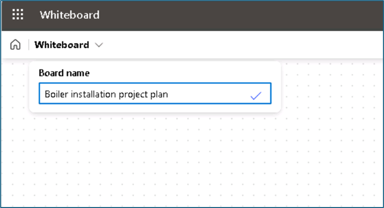
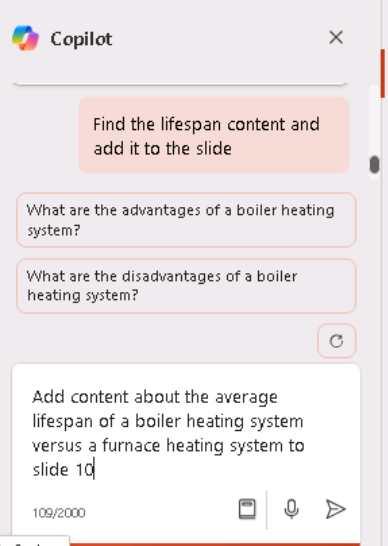

**实验 08：为您的员工赋能 – Copilot – 运营**

**目的：**

运营经理可以使用适用于 Microsoft 365 的 Copilot
来简化其工作流程并提高其工作效率。

在本实验中，您将使用：

- Copilot 在 Whiteboard 中集思广益，为安装新锅炉系统制定项目计划。

- Word 中的 Copilot 创建一个报告，分析锅炉与熔炉加热系统，同时还比较
  Copilot 可以产生的输出类型。

- PowerPoint 中的
  Copilot，根据您创建的报告创建演示文稿，用于分析锅炉和熔炉加热系统。

**练习 \#1：使用 Whiteboard 中的 Copilot 集思广益项目计划想法**

Microsoft Whiteboard
是一个数字画布，允许用户实时协作、集思广益并轻松创建内容。Whiteboard
的功能包括自由格式绘图、便笺和模板，您可以根据自己的需要对其进行自定义。它还提供了一个空间，您可以将其用于项目、头脑风暴、研讨会、回顾、设计、战略规划以及解决可能具有移动部分或需要更多视觉效果的问题。

白板可以帮助提高

- 通过允许多个用户在数字空间中同时工作来协作，从而轻松共享视觉效果和想法。

- 通过提供空间来涂鸦、共享原型草图或编制产品名称创意列表，提高工作效率。

作为 Adatum Corporation
的运营经理，您计划在建筑物的供暖系统中安装一台新锅炉。但是，在开始安装过程之前，您需要使用
Whiteboard 中的 Copilot 来建议公司在更新其供暖系统时通常完成的潜在步骤。

在本练习中，您将使用 Whiteboard 中的 Copilot
来建议完成此类安装所需的步骤。将此练习基本上视为 AI 辅助的便签练习。

1.  在 Microsoft Edge 浏览器中，打开一个新选项卡并输入以下 URL 以转到
    Microsoft 365
    主页：+++[https://www.office.com+++](https://www.office.com+++/)

2.  在 **Microsoft 365** 主页上，如果左侧导航窗格中出现 **Whiteboard**
    图标，请立即选择它并继续下一步。否则，请选择 “**Explore all your
    Apps**” ，然后在 “**Apps**” 页上，向下滚动到 “**Explore by
    category**” 部分，然后在 “**Productivity**”
    选项卡（默认情况下应显示）中选择 “**Whiteboard**” 。

3.  登录到 **Microsoft Whiteboard**。

4.  在 **Whiteboard** 主页上，选择 **New Whiteboard** （新建白板）。

5.  在页面顶部的功能区上，选择 **Whiteboard** 下拉箭头。在 **Board
    name** 字段中，输入 **+++Boiler installation project
    plan+++**，然后选择复选标记图标。

6.  如果出现 **Suggest content with Copilot**
    窗口，请继续执行下一步。否则，在页面底部任务栏上方显示的图标托盘中，选择
    **Copilot** 图标。在显示的菜单中，选择 **Suggest**（建议）。

7.  在 **Suggest content with Copilot** （使用 Copilot 建议内容）
    窗口中，输入以下提示：

++**I'm the Operations Manager for Adatum Corporation. We're installing
a new boiler in our heating system. Please suggest the steps we should
follow to install the new boiler**.++

8.  如果出现 **Suggest content with Copilot**
    窗口，请继续执行下一步。但是，如果您收到一条消息，指示 “**Something
    went wrong. Please try again.**“或” **Copilot couldn't process this
    prompt. Please rephrase it.**“，然后选择 Copilot 窗口下角的
    **Generate suggestions** 箭头。

有时 Copilot
会完成它正在进行的过程，但在显示结果之前会有点磕磕绊绊。当您再次选择
**Generate suggestions** （生成建议）
箭头时，它通常会毫不延迟地显示结果。但是，如果您再次收到类似的消息，请再选择
**Generate suggestions** （生成建议） 箭头几次。如果您在尝试 3 次或 4
次后仍然收到此错误，请通过输入以下文本来简化提示：

++**Please suggest the steps we should follow to install a new boiler in
our building's heating system**.++

9.  默认情况下，Copilot 以 6 人为一组生成想法。在出现的 **Suggest
    content with Copilot** （使用 Copilot 建议内容）
    窗口中，记下它生成的前六个想法。Copilot 在这里为您提供了两个选项 -
    如果您对建议感到满意，您可以将想法附加到白板上，也可以让 Copilot
    生成更多建议。请注意**插入 （6）** 按钮如何指示 Copilot
    生成的想法数量 - 在本例中为 6。

10. 虽然 6
    条建议是一个很好的起点，但您需要更深入地了解安装安全产品所需的任务，因此请选择
    **Generate more** （生成更多） 按钮。

**注意：**如果 Copilot 显示任何类型的错误消息，请再次选择 \*\*Generate
more\*\* 按钮。每当收到错误消息时，请执行此作。

11. 请注意 Copilot 如何生成另外 6 个想法，因此 **Insert （12）**
    按钮现在显示
    **12**。虽然您可以不断产生更多想法，但为了时间，让我们插入当前提出的
    12 个想法。选择 **Insert （12）** 按钮。

12. 当您选择“**Insert**”按钮时，Copilot
    会以黄色便签的形式将建议的想法附加到您的白板上。

13. 与涉及实际便笺的真实头脑风暴会议一样，您可以编辑特定便笺、删除它、锁定它以备将来删除等。在
    Microsoft Whiteboard 中，通过标准白板功能支持这些活动。

如果您以前从未使用过
Whiteboard，请尝试选择（双击）特定笔记，然后在其上方显示的菜单栏中，您可以选择
**Edit text** （pencil）
图标或任何其他选项。选择菜单栏末尾的省略号图标将显示一个包含更多选项的菜单，例如删除注释。同样，Microsoft
Whiteboard
背后的想法是模拟现实世界的便签练习。您可以根据需要随意编辑注释。

14. 在查看建议的想法时，您觉得它们没有充分涵盖风险缓解。选择页面底部的
    **Copilot** 图标，然后从菜单中选择 **Suggest** 。

15. 在出现的 **Suggest content with Copilot** （使用 Copilot 建议内容）
    窗口中，输入以下提示以生成有关风险缓解的更多想法：

++**Suggest ways to mitigate the risks of installing a new boiler into
the building's heating system**.++

16. 回顾 Copilot 建议的六个想法。您希望 Copilot
    包含更多详细信息，因此请选择 **Generate more** （生成更多） 按钮。

17. 您对 12 个风险缓解想法感到满意，因此请选择 **Insert （12）** 按钮。

18. 请注意 12 个风险缓解想法的块是如何被选中的（参见外部边界）。

19. Copilot 将 12 个风险缓解想法部分覆盖在原来的 12
    个项目计划想法之上，您可以选择这个想法块并在屏幕上移动它，使其不再覆盖原来的
    12
    个想法。不用担心将两个块排成一排。在后续步骤中将笔记组织成类别后，它们看起来会很漂亮。现在，只需安排每个块，以便您可以看到所有的想法。这样做提供了查看
    Copilot
    建议的区域所需的可见性，以便您可以根据需要编辑其中任何一个区域。

20. 现在，您对 Copilot
    创建的建议感到满意，并且您已完成要对注释进行的所有编辑。您现在希望
    Copilot 按类别组织注释。Copilot
    确定类别的名称并相应地自动组织注释。选择页面底部的 **Copilot**
    图标，然后从菜单中选择 **Categorize**。

21. 请注意发生了什么。Copilot
    生成了一组类别并相应地重新组织了注释。每个类别的笔记都分配了不同的颜色，以帮助识别类别之间的差异。如果包含注释的矩形没有达到应有的大小但仍适合您的屏幕，请选择页面右下角的
    **Fit to Screen**
    图标。这样做会增加图像的大小，直到它不能再增加它，而不会超过屏幕大小。

22. 请注意显示在有序的注释组下方的图标托盘。如果您对类别不满意，请选择显示的图标托盘上的
    **Regenerate** 按钮。

**注意：**您可以根据需要多次选择 **Regenerate** 按钮，直到您对 Copilot
提供的类别感到满意为止。多次选择此按钮，并记下 Copilot
每次所做的更改。除了更改类别名称外，Copilot
还可以在每次重新生成时添加或减少类别的数量。

23. 在多次重新生成类别后，您意识到您缺少有关最小化系统停机时间的详细步骤。您想要求
    Copilot
    在您的白板会话中添加更多有关此问题的想法。此外，您确定了一个要删除的注释。但是，由于您已经组织了自己的想法，因此必须将白板会话改回对笔记进行分类之前的编辑模式。为此，请选择
    **Revert** 按钮。

24. 现在，您已返回到编辑模式，请选择您不再需要的注释，然后在显示的图标托盘中，选择省略号图标。从显示的菜单中选择
    **Delete** 。

25. 要让 Copilot 生成更多想法，请选择页面底部的 **Copilot**
    图标，然后从菜单中选择 **Suggest**。

26. 在出现的 **Suggest content with Copilot** （使用 Copilot 建议内容）
    窗口中，输入以下提示以生成有关最大限度地减少系统停机时间的更多想法：

++**Suggest ways to limit heating system downtime when installing a new
boiler**.++

27. 回顾 Copilot 建议的六个想法。您对这些想法感到满意，因此请选择
    **Insert （6）** 按钮。

28. 请注意 6
    个音符的块是如何用块周围有一条线突出显示的。此注释块称为注释网格。您可以像白板上的任何其他元素一样移动笔记网格或调整其大小。调整便笺网格的大小时，其中所有便笺条的大小也会相应调整。如果
    6
    个音符块覆盖在其中一个音符块的顶部，请选择音符网格周围的一条外线，然后将整个
    6
    个音符块拖到一边，这样它就不会覆盖前面的任何音符。如果屏幕上的空间不足，并且块的一部分从屏幕上掉下来，请选择页面右下角的
    **Fit to Screen** 图标。

29. 您已准备好让 Copilot 组织便笺，其中包括 18 个便签 - 一个 12
    个便签和一个 6 个便签。选择页面底部的 **Copilot**
    图标，然后从菜单中选择 **Categorize**。在 **Categorize selected
    notes** （对所选笔记进行分类） 窗口中，选择 **Categorize** （分类）
    按钮。

30. 有时，包含注释的矩形的大小没有达到应有的大小，从而在画布周围留下开放的空白区域。在这种情况下，笔记的文本大小通常很小且难以阅读。如果出现此大小调整问题，请选择页面右下角的
    **Fit to Screen**
    图标。这样做会增加图像的大小。如果继续选择此按钮，它最终会达到一个点，即它无法再增加矩形的大小，而不会超过屏幕大小。进一步选择此图标对矩形没有影响。

31. 查看类别。在矩形下方显示的 Copilot 图标托盘中，您可以选择
    “**Regenerate**” 按钮以创建一组新的类别。实际上，多次选择
    **Regenerate** （重新生成）
    按钮以查看类别如何变化。对结果感到满意后，选择 **Keep it** （保留）
    按钮。

32. 请注意，每个类别的便笺都是不同的颜色。您意识到您希望将头脑风暴会议的简短摘要添加到您的白板内容中。为此，请选择页面底部的
    **Copilot** 图标，然后从菜单中选择 **Summarize**。Copilot
    会生成此白板会话中主要主题的简短摘要。向下滚动以查看整个 **Summary**
    （摘要） 窗口。您对结果感到满意，因此请选择 **Keep it** （保留）。

33. 选择页面右下角的 **Fit to Screen**
    图标，将所有便笺和会话摘要放到整个屏幕上。

**练习 \#2：在 Word 中使用 Copilot 比较报告结果**

作为 Adatum Corporation 的运营经理，您发现当前为该公司拥有 50
年历史的办公楼供暖的锅炉系统需要进行重大维修，甚至彻底更换。您认为这种情况可能是将您的加热系统从现有锅炉系统转换为更节能的炉子系统的合适时机。但是，您不熟悉两种加热系统之间的区别。您想在
Word 中使用 Copilot 调查情况并创建可以提交给管理层的报告。

**备注：**您听说过 Word 中的 Copilot
可以为您生成报告，但您还没有使用过它。因此，您不确定它提供什么样的报告。您不仅想借此机会创建您的报告，还想调查
Copilot 的报告功能。所以，这是您的计划：

- 您之前确定了希望 Copilot 调查的几个关于锅炉与熔炉加热系统的问题。

- 您计划让 Copilot 创建一个涵盖所有这些问题的报告。

- 然后，您计划单独询问 Copilot 每个问题，以便您可以看到每个回答。

- 然后，您可以将 Copilot
  创建的报告与它为每个问题生成的单个答案进行比较。在后一种情况下，您可以根据需要将每个答案复制并粘贴到文档中，以创建自己的报表，或补充现有文档。

本练习的目的是展示 Word 中的 Copilot
如何根据您使用的形式提供不同级别的响应 - 在 Copilot
窗格中或在创建新文档时。

1.  如果您在 Edge 浏览器中打开了 Microsoft 365
    选项卡，请立即选择它;否则，请打开一个新选项卡并输入以下
    URL：+++[https://www.office.com+++](https://www.office.com+++/)

注意：您需要使用右侧 “**Resources**” 选项卡下提供的 **Microsoft 365
凭据**登录（如果出现提示）。

2.  考虑到您的计划，您决定首先在 Word 中使用 Copilot
    来创建解决您所有问题的报告。在 **Microsoft 365** 导航窗格中，选择
    **Microsoft Word**，然后打开一个空白文档。

3.  在空白文档顶部显示的 **Draft with Copilot**
    窗口中，输入以下提示并选择 **Generate** 按钮：

+++I'm the Operations Manager for Adatum Corporation. We're thinking
about possibly replacing our building's current boiler system with a
furnace system. Write a report describing what type of boiler systems
are used in most commercial buildings, and include what considerations I
need to take into account to change from an existing boiler system to a
furnace system, the average cost of transitioning from a boiler system
to a furnace system in a commercial two-story building built in the
1970s, whether changing from a boiler system to a furnace system will
have any effect on our current air conditioning system, and the average
defect rates for boiler systems versus furnace systems.+++

4.  查看 Copilot
    生成的报告。请注意每个感兴趣领域的细节级别。由于您要保存此文档以供下一个用例练习使用，因此请选择
    Copilot 托盘上的 **Keep it** 按钮，然后保存文档。

**注意：**请确保保存报告，因为您将在下一个练习中使用它。

5.  您输入的用于创建报告的提示包括 5 个请求。您现在想单独询问 Copilot
    这五个问题中的每一个。在 Word 功能区上选择 **Copilot**，这将打开
    **Copilot** 窗格。

6.  在 **Copilot** 窗格底部的提示字段中，输入以下问题，然后选择 **Send**
    箭头：

+++What type of boilers do most buildings use as part of their heating
systems?+++

7.  查看答案。如果要将响应粘贴到文档中，可以选择 **Copy** （复制）
    选项，但对于此培训，您只需选择更多提示即可查看收到的响应。

8.  为其余四个问题中的每一个输入单独的提示：

    - **What considerations do I need to take into account to change
      from an existing boiler system to a furnace system in a commercial
      building?**

    - **What is an average cost for transitioning from a boiler system
      to a furnace system in a commercial two-story building built in
      the 1970s?**

    - **if we change from a boiler system to a furnace system, will it
      have any effect on our current air conditioning system?**

    - **What are the average defect rates for boiler systems versus
      furnace systems?**

9.  请注意 Copilot
    如何回答您的每个问题，但它没有将任何答案插入到当前文档中。虽然您可以将每个答案复制并粘贴到文档中，但很明显，仅让
    Copilot 创建报告效率更高。

10. 以下是一些提示，可以反映您在 Word 中使用 Copilot 时的响应

    - 每种报告方法的信息水平如何？

将 Word 中的 Copilot 创建报告时提供的信息级别与您在 Copilot
窗格中单独提问时提供的信息级别进行比较。

- 你注意到了什么？

当您要求 Copilot
创建报告时，它通常会提供更丰富的响应，并将其组织成一个有吸引力的报告。相反，当您要求
Copilot 在 Copilot
窗格中单独回答问题时，它不会返回报告的详细级别，尽管它允许您将响应复制并粘贴到文档中。但是，这样做可能需要您重新格式化插入的答案以清理任何格式问题。

**练习 \#3：在 PowerPoint 中使用 Copilot 创建比较供暖系统的演示文稿**

熟练在 PowerPoint 中使用 Copilot
是旨在提升其演示文稿影响力的专业人士的一项战略技能。PowerPoint 中的
Copilot 充当智能协作者，在运营经理制作演示文稿时提供实时建议和增强功能。

作为 Adatum Corporation 的运营经理，您发现当前为该公司拥有 50
年历史的办公楼供暖的锅炉系统需要进行重大维修，甚至彻底更换。您觉得此时机可能是将您的供暖系统从现有锅炉系统转换为更节能的炉子系统的合适时机。

在本练习中，您将要求 PowerPoint 中的 Copilot
根据**比较锅炉和熔炉加热系统**报告创建演示文稿。您的目标是让 Adatum
的管理团队快速了解这两种类型的供暖系统，包括每种系统的优缺点，然后再联系供暖、通风和空调
（HVAC） 公司并正式开始此项目。

1.  如果您在 **Microsoft Edge** 浏览器中打开了 Microsoft 365
    选项卡，请立即选择它; 否则，请打开一个新选项卡并输入以下
    URL：+++[https://www.office.com+++](https://www.office.com+++/) 以转到
    Microsoft 365 主页。

**注意：**您需要使用右侧 “**Resources**” 选项卡下提供的 **Microsoft 365
凭据**登录（如果出现提示）。

2.  在 **Microsoft 365** 导航窗格中，选择 **OneDrive** 将其打开。

3.  浏览到 **C：\LabFiles** 文件夹，选择比较 **Comparing boiler and
    furnace heating systems report** 文档并将其副本上传到 **OneDrive**。

**提示：** 打开并关闭文件以将其放入您的最近使用 （MRU） 文件列表中。

**注意：**如果您已按照**准备实验室执行**部分中的建议将所有实验室资产上传到
OneDrive，则可以跳过此步骤。

4.  在 **Microsoft 365** 主页上，选择左侧导航窗格中的 **PowerPoint**
    图标。

5.  在 **PowerPoint** 中，打开一个新的空白演示文稿。

6.  选择 **Copilot** 图标（如屏幕截图所示以红色突出显示）..

7.  在显示的 **Copilot** 窗格中，有几个预定义的提示可供您选择。选择
    **Create presentation from file**
    提示。 
    

8.  在 **Copilot** 窗格底部的提示字段中，Copilot
    会自动输入文本：**Create presentation from file /**。正斜杠是通用的
    Copilot 指示器，用于输入文件的链接。在这种情况下，它会触发 Copilot
    打开一个 **Suggestions** 窗口，其中显示最近使用的三个文件。

- 如果您的文件显示在此处，请立即选择它并继续下一步。

- 如果该文件不是显示的三个文件之一，请选择 **Suggestions** （建议）
  窗口右上角的向右箭头 （\>） 以查看展开的 MRU
  文件列表。如果文件显示在此处，请立即选择它并继续下一步。

- 如果您在展开的 MRU
  列表中没有看到您的文件，则必须复制报告的链接并将其粘贴到提示字段中。为此，请执行以下作：

  1.  选择 **Microsoft 365** 浏览器选项卡，然后在导航窗格中选择
      **Word**。

  2.  在 **Word** 主页的最近打开的文件列表中，选择报表以在 Word
      中打开它。

  3.  在 Word 的报表中，在功能区上方的最右侧，选择 “**Share**”
      按钮。在显示的下拉菜单中，选择 **Copy Link**。等待 **Link copied**
      （链接已复制）
      窗口出现，这是您确信文件的链接已复制到剪贴板的保证。

  4.  切换到 **PowerPoint** 选项卡，在 **Copilot**
      窗格的底部，提示字段应仍显示 **Create presentation from file
      /**。将光标置于正斜杠 （**/**） 之后，然后粘贴到 （**Ctrl+V**）
      报表的链接。

9.  请注意文件在提示字段中的显示方式。选择提示字段中的 **Send** 图标。

10. 此提示触发 Copilot 根据文档创建幻灯片演示文稿。在此过程中，它首先在
    Copilot
    窗格中显示演示文稿的大纲。然后，它显示一个单独的窗口，其中显示了它根据文档对演示文稿所做的一些更改的项目符号列表。

11. 您现在可以自由地查看幻灯片并进行任何必要的更新。请特别注意 Copilot
    根据文档所做的更改。您可以使用 **Designer** 工具调整布局。

12. 查看 Copilot
    添加到演示文稿中每张幻灯片的演讲者备注。验证他们指出了您希望在演示过程中提出的观点。

13. 尝试使用 Copilot
    更新演示文稿。让我们从向幻灯片添加图像开始。找到一张没有图像的幻灯片，然后输入以下提示（不要忘记将
    \[在此处输入幻灯片编号\] 替换为您选择的幻灯片编号）：

++**Add an image to slide \[enter slide number here\]**. **The image
should contain a picture related to the slide contents**.++

14. 您还注意到，演示文稿中没有任何与每种加热系统的预期使用寿命相关的内容。您希望
    Copilot 研究此主题，然后将其添加到演示文稿中。输入以下提示：

++**What is the average lifespan of a boiler heating system versus a
furnace heating system**?++

15. 您现在希望 Copilot
    将此内容添加到幻灯片中。选择演示文稿开头的幻灯片，其中列出了锅炉系统的类型。然后输入以下提示（不要忘记将
    \[在此处输入幻灯片编号\] 替换为您选择的幻灯片编号）：

++**Add this lifespan content to slide \[enter slide number here\]**.++

16. Copilot 是做什么的？它是否做了一些事情，比如将 “Lifespan content”
    添加到幻灯片的顶部，将其覆盖在幻灯片上的现有内容之上？还是它做了类似的事情？

17. 提示未按预期工作。删除添加到幻灯片中的任何内容。

18. 现在再试一次，但这次让 Copilot
    找到生命周期内容并将其添加到幻灯片中，所有这些都在一个提示中完成。这一次，请输入以下提示符：

++**Add content about the average lifespan of a boiler heating system
versus a furnace heating system to slide \[enter slide number
here\].**++

19. 这效果更好吗？如果 Copilot
    没有完全按照您的要求执行，您只需重新设计提示。

20. 您注意到，问答 （Q&A）
    会话的末尾没有幻灯片。要更正此情况，请输入以下提示符：

++**Add a Q&A slide at the very end of the presentation with an
appropriate image**.++

21. 查看已创建的新幻灯片。看到此幻灯片后，您希望 Copilot
    创建一个可能的问题列表，并将它们添加到 Q&A
    幻灯片的演讲者备注中。输入以下提示：

++**Create a list of five questions that may be asked during the Q&A
session and add them to the speaker notes in the Q&A slide**.++

22. 当您尝试此提示时，Copilot 如何响应？它是否在 Q&A
    幻灯片的演讲者备注中添加了五个问题？如果是这样，那么恭喜！

**注意：**Copilot 可能会显示一些异常（请记住，Copilot
仍在进行中），如下所示。

请尝试改写提示或使用建议的提示，如下所示。

23. 选择命令 **Add a slide about** 并在**演示文稿的最后附加以下
    Q&A**（如屏幕截图所示）

24. 单击 Send 以检查会发生什么。

Copilot 已按照说明添加了 Q&A 幻灯片。

25. 现在尝试使用另一个提示：

**添加一张幻灯片，**说明观众可能会询问的有关演示文稿的问题

26. 完成最终演示后，您可以保存以备将来参考或放弃此演示文稿。

**总结：**

在本实验中，您使用了：

- Whiteboard 中的 Copilot
  用于生成和组织安装新锅炉系统的项目计划想法，促进协作和创造性规划。

- Word 中的 Copilot 创建详细报告并比较 Copilot
  可以生成的输出类型，展示其在内容创建方面的多功能性。
