# Lab 9 - Streamlining IT Support Operations with Autonomous Copilot Agent using Copilot Studio

**Estimate Time: 60 mins**

**Objective**

The objective of this lab is to enable participants to streamline IT
support operations at Contoso Solutions by creating an autonomous
Copilot agent. Participants will learn to set up Microsoft Copilot
Studio, configure the IT Support Agent, integrate Power Apps and
Dataverse, enhance the bot’s capabilities with a knowledge base, and
automate ticket creation using Power Automate. This hands-on lab will
equip users with the skills to improve IT workflows, reduce manual
effort, and enhance support efficiency.

**Solution**

Participants will create a customized Contoso IT Support Agent using
Microsoft Copilot Studio, configure it to handle common IT issues, and
integrate it with Dataverse for storing support data. They will set up a
development environment, add knowledge sources, and refine the bot's
conversation flows for better user interaction. By leveraging Power
Apps, participants will create a Dataverse table to manage IT support
records. Using Power Automate, they will automate ticket creation and
email notifications for unresolved issues. Finally, participants will
test the agent to validate its troubleshooting accuracy and workflow
automation, ensuring seamless IT support operations.

## Exercise 1: Getting Started with Power Apps

This exercise introduces participants to Power Apps and Dataverse. The
goal is to log in to Power Apps, set up a working environment, and
create a Dataverse table by importing data from an Excel file.
Participants will learn essential skills for working with data-driven
applications.

### Task 1: Logging into Power Apps

1.  Navigate to power apps website
    +++https://www.microsoft.com/en-us/power-platform/products/power-apps+++ and
    click on the **Try for Free** button.

    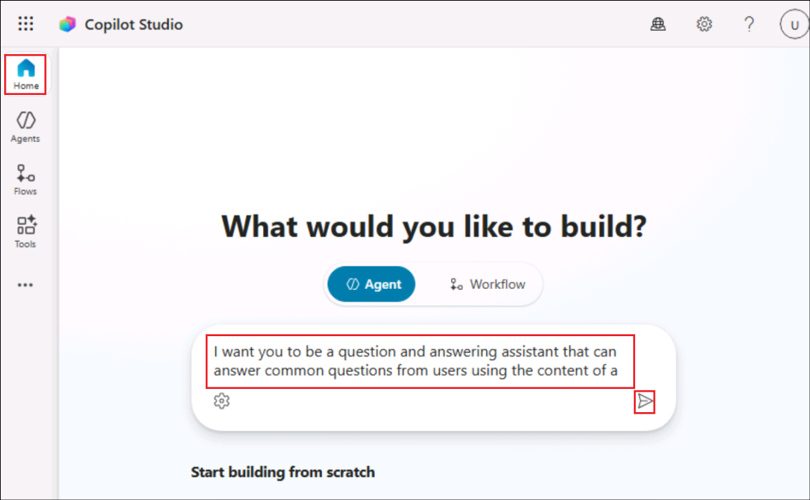

2.  Enter the **Administrative Username** from the **Office 365
    Tenant** section of the **Resources** tab into the email
    field, **select** the **checkbox** and click on the **Start
    free** button.

    

3.  Enter the **Administrative Password** and you will be taken to the
    Power Apps Home page.

4.  Select **Yes** in the Stay Signed in dialog and **Got it** for the
    Save password prompt and select **No, Thanks** in the Sign in to
    Microsoft Edge pop up.

    >[!Note] **Note:** If it agains prompts for the user name, password or
any information to login, please provide the same and login.

### Task 2: Setting Up a Dataverse Table

1.  Ensure that the **Dev One** environment is selected. Select it if
    not done already.

    

2.  From the left navigation bar select **Tables.** In the tables
    section top bar click on the **+ New table** and then
    select **Create new tables**.

    

3.  Select **Import an Excel file or CSV** option to create a new table.

    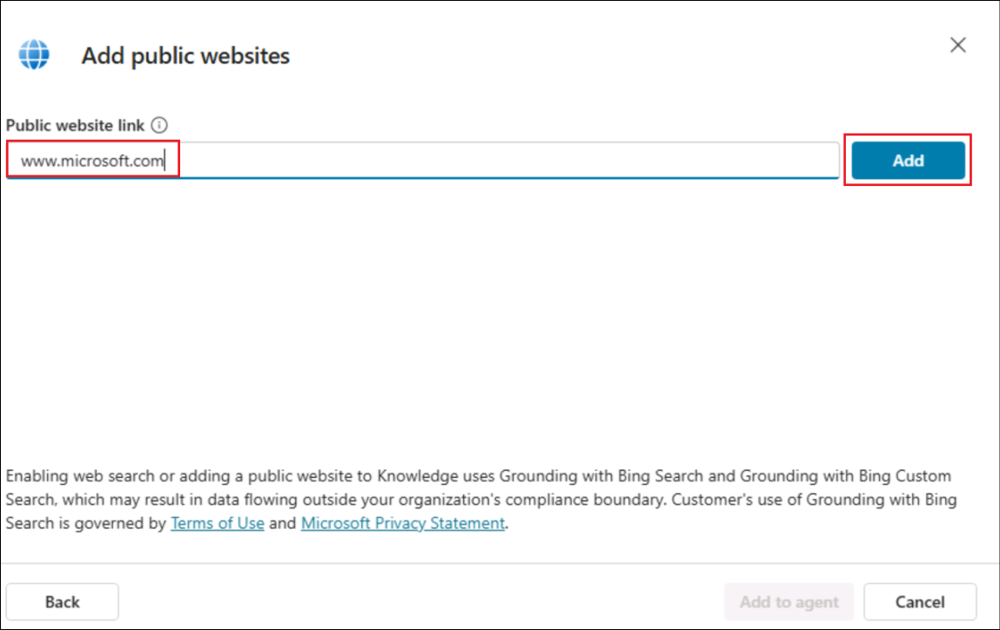

4.  Click on the **Select form device** option and select **Support
    Ticket** excel file from **C:\LabFiles** folder.

    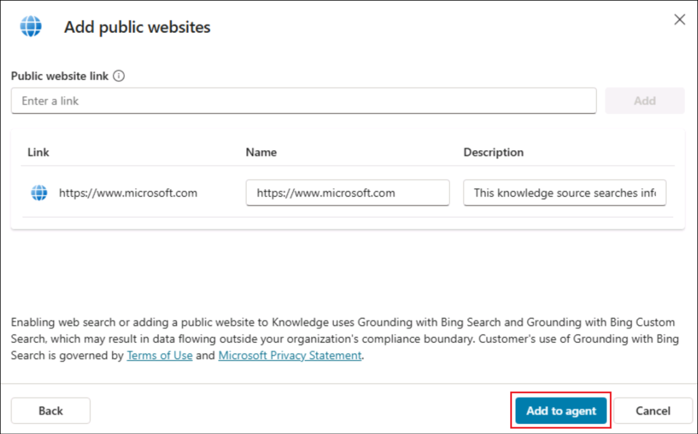

5.  Select the table and click on **View data** to see the table.

    >[!Note] **Note:** In this case, the table is named *Employee Technical
Support Record*. The name may vary with each execution. Please save the
table name for future reference. The column name may also vary in the
execution.

    

6.  Go to table data, select the drop down next to the **Technical Issue
    Description** field, select **Edit column**, Set the data type
    as **Text** 🡪 **Multiple line** 🡪 **Plain Text** and click on
    the **Update**. The column name may be different in each case.

    >[!Note] **Note:** The **column name might be slightly different**, but
it will be something similar to the issue description since it is
Copilot generated.

    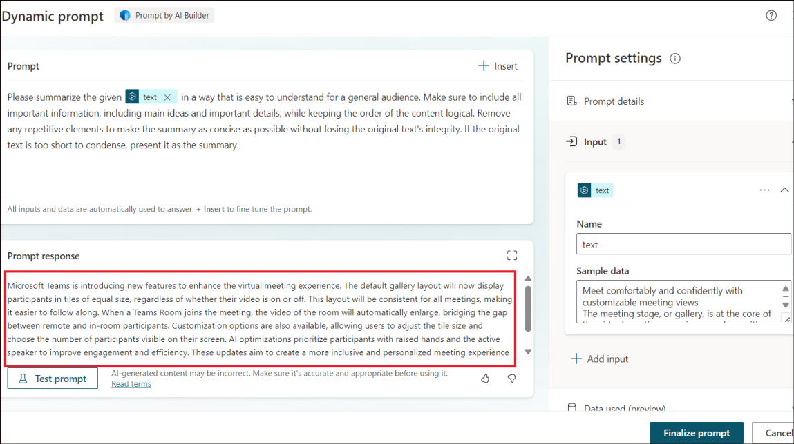

    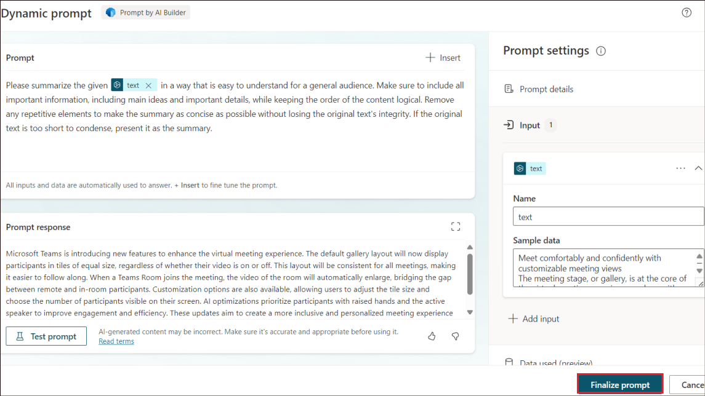

7.  Select drop down next to the **Current Status** field, select **Edit
    column**, Set the Choices as +++**Unresolved**+++,
    +++**Resolved**+++, +++**Processing**+++. Set Default choice
    as **Unresolved** and click on the **Update**.

    

8.  From top right side click on **Save and exit** to save the table.

    

**Conclusion**

By completing this exercise, participants will learn:

- How to access and navigate Power Apps using office 365 admin tenant
  credentials.

- Steps to create and configure a Dataverse table by importing data.

- Practical knowledge of setting up an environment to support app
  development workflows.

## Exercise 2: Creating the Contoso IT Support Agent

This exercise focuses on logging into Microsoft Copilot Studio and
creating a customized Copilot agent tailored for IT support operations
at Contoso. Participants will gain hands-on experience navigating
Copilot Studio, configuring environments, and building an AI-powered
agent to streamline IT workflows.

### Task 1: Creating and Configuring Contoso IT Support Agent

1.  In Copilot Studio home section from top right, select
    the **environment** and choose **DevOne** environment.

    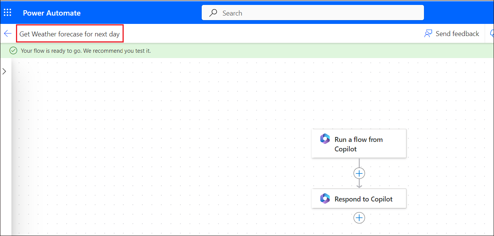

2.  On welcome copilot studio tab, click on the **Skip** to move
    forward.

    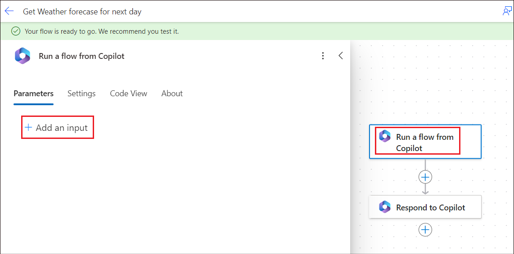

3.  From left navigation bar select **Create** and then select **New
    agent** to start creating new agent.

    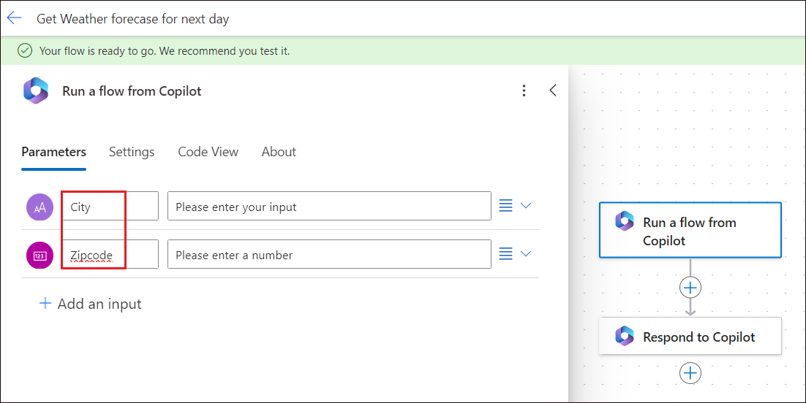

4.  From top right corner click on **Skip to configure** button.

    

5.  Enter **Name, Description and Instruction** of the agent as given
    below and click on **Create** button.

    **Name:** +++Contoso IT Support Agent+++
    
    **Description:** +++Create a Contoso IT Support Agent which transforms IT support at Contoso Solutions by providing instant troubleshooting for common issues, automating ticket creation for unresolved problems, and storing all interactions in Dataverse. This solution enhances response times, reduces manual workloads, and boosts employee productivity.+++
    
    **Instruction:** +++Create the Copilot Agent and configure it to handle IT support operations. Add a knowledge source containing solutions for common IT issues like hardware troubleshooting, connectivity, and software glitches. Set up a trigger to detect incoming emails from employees describing unresolved issues. Create an action to save these technical issues into a Dataverse table, ensuring all details are stored for tracking and reporting. Test the agent to validate its troubleshooting accuracy and ticket automation workflow before deployment.+++


    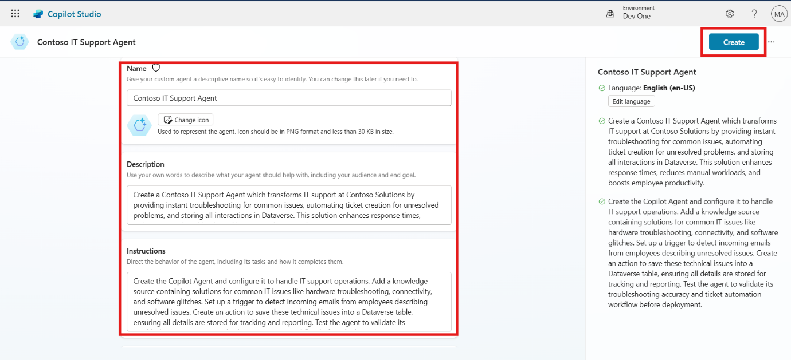

6.  On the overview page of Contoso IT Support Agent, **Enable** the
    orchestrator for the agent.

    

7.  On the overview page of the agent, **Disable** the “**Allow the AI
    to use its own general knowledge**” option.

    

8.  From top right corner of the agent, click on
    the **Settings** button.

    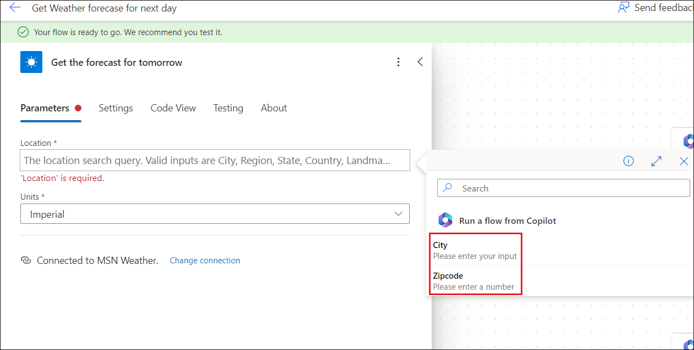

9.  Then go to **Generative AI** section, select **Generative**, set
    content moderation as **Medium** and click on **Save** to save the
    setting.

    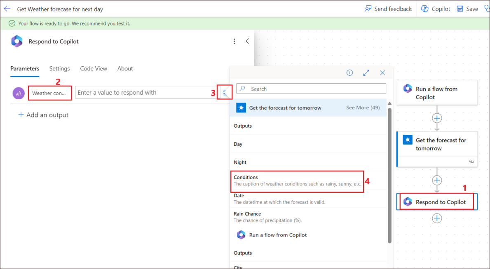

**Conclusion**

By completing this exercise, participants will learn:

- How to access and set up Microsoft Copilot Studio.

- Steps to create and configure a custom Copilot agent.

- Practical skills in enabling generative AI and orchestrator settings
  for the agent.

- Ways to enhance IT operations by automating ticket creation and
  leveraging AI for troubleshooting.

## Exercise 3: Enhancing Bot Capabilities

This exercise focuses on enhancing the capabilities of the Contoso IT
Support Agent by adding a knowledge base and customizing bot topics for
improved interaction. Participants will refine the bot's responses and
ensure it effectively assists users in troubleshooting and escalation.

### Task 1: Add Knowledge Base

1.  On the Contoso agent overview page, scroll down and click on **+ Add
    Knowledge** button.

    

2.  Select **Upload file** to add the lab file **Contoso Common IT
    Issue.docx** from **C:\LabFiles** folder and then click
    on **Add** to save the file.

    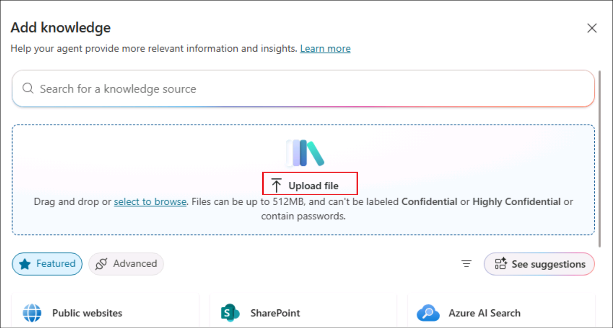

    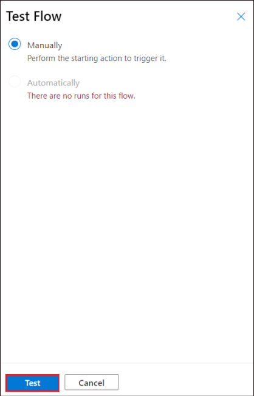

3.  Again, go to agent overview page, scroll down and click on **+ Add
    knowledge.**

    

4.  Select **Dataverse (preview)** option as data source.

    

5.  In top right corner search bar, enter and search for
    +++**Employee**+++ and select **Employee Technical Support
    Record** table. Then click on the **Next, Next** and **Add** button
    to add the knowledge source.

    >[!Note] **Note:** The **table name might be different** in your case since it is
a Copilot generated one.

    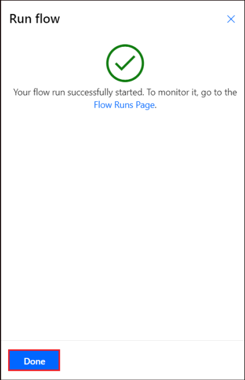

    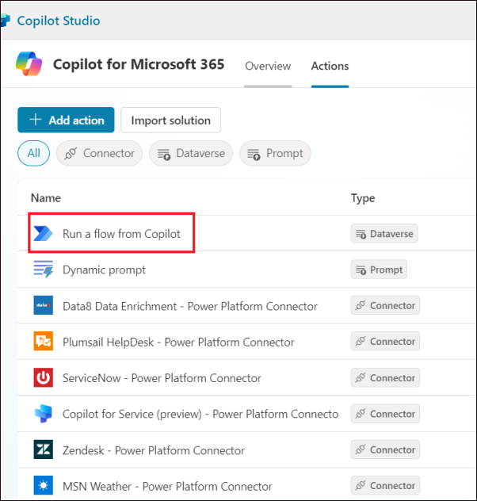

    >[!Alert] **Important:** From the Knowledge page, ensure that the added
knowledge source has been successfully uploaded. This will generally
take 10 to 15 minutes to complete.

### Task 2: Customize the Conversation Start Topic

1.  From the top bar option click on **Topics** and then click and
    open **Conversation Start** topic.

    

2.  Scroll down and go to message node. Update the message after bot
    name as given below:

    Hello. I’m Bot Name, a virtual assistant. +++How can I help you?+++

    

3.  From top click on the **Save** to save the topic.

    

### Task 3: Update the Fallback Topic

1.  From the top bar option click on **Topics** and then open
    the **Fallback** topic.

    

2.  Scroll down and go to message node. Update the message as given
    below:

    +++I’m sorry. This information is not available in my system. You can raise the support ticket via mail for this issue.+++

    

3.  From top right side click on the **Save** button to save the topic.

    

**Conclusion**

By completing this exercise, participants will learn:

- How to upload and integrate a knowledge base to enhance the bot's
  functionality.

- Steps to customize conversation start messages for a more engaging
  user experience.

- Techniques to update fallback responses for better handling of
  unsupported queries.

## Exercise 4: Test the agent

This exercise guides participants through testing the Contoso IT Support
Agent to validate its functionality. Participants will check how the bot
handles prompts using the knowledge base and fallback topics to ensure
seamless interaction and escalation.

1.  From top right corner click on the **Test** button. Then in test
    section click on **Map** turn it **On** and then click **Refresh**.

    

2.  Enter the prompt +++**My printer is not working how to fix it**+++ .
    It gives the solution as per knowledge source.

    

3.  Again, give the prompt +++**Two factor Authentication (2FA)
    issue**+++ .

    

4.  The 2FA issue and solution is not available in the knowledge source
    so it will go to fallback topic and return prompt related to Raise
    Ticket.

    

**Conclusion**

By completing this exercise, participants will learn:

- How to test and activate an AI agent for troubleshooting.

- Validation of the bot’s ability to respond using its knowledge base.

- How fallback topics handle unsupported queries and redirect users
  effectively.

## Exercise 5: Automating Support Ticket Creation with Power Automate

This exercise demonstrates how to automate support ticket creation using
Power Automate and integrate it with the Contoso IT Support Agent.
Participants will create a flow to streamline issue reporting, record
data in Dataverse, and notify support engineers via email.

1.  Go to overview page of the agent, scroll down and click on **+ Add
    action**.

    

2.  In choose an action window, From top left side click on the **+ New
    Action** and select **New Power Automate Flow** .

    

3.  In Power automate flow, click on **When an agent calls the
    flow** and then select **Add an Input**.

    

    

4.  Select **Text** as data type of input and rename the input as
    +++**Name**+++.

    

    

5.  With same procedure create more input as per given below details.

    |  **Input Name**  |  **Data Type**  |
    |:-----|:------|
    | +++ID+++   | Text   |
    |  +++Email+++  |  Text  |
    |  +++Details+++  |  Text  |
    
    

6.  Below **When an agent calls the flow**, click on **(+)** sign and
    select **Add an action**.

    

7.  In Add an action search bar, enter +++**Add a new row**+++ . Then
    select **Add a new row** from Microsoft Dataverse section.

    

    >[!Note] **Note:** Sometimes, a Dataverse connection is not created automatically.
You may need to **sign in** again with your
credentials **OAuth** authentication.

    

8.  In **Table Name** section search and select +++**Employee Technical
    Support Record**+++ (or your corresponding table name created).

    

9.  Below table name select **Show all**, then click on the particular
    field and add input with the help of dynamic content button (Thunder
    bolt) as per the below table. The **Current Status** field should be
    selected with drop down as **Unresolved**.

    |  **Section**  |   **Input Variable** |
    |:-----|:-------|
    | Employee Name   |  Name (Dynamic Input)  |
    |  Email Address  | Email (Dynamic Input)   |
    |  Employee ID  |  ID (Dynamic Input)  |
    |  Technical Issue Description  |  Details (Dynamic Input)  |

    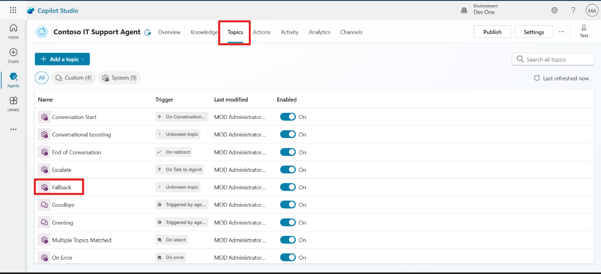

    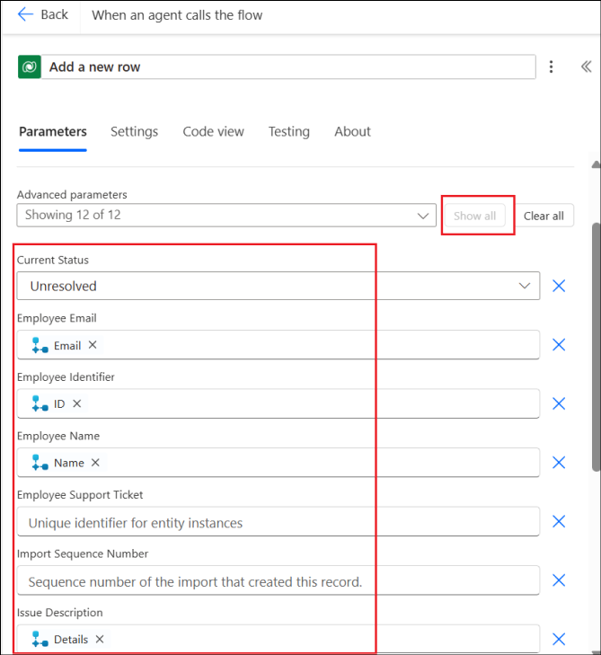

11. Below Add a new row action click on (+) and select **Add an
    action**.

    

11. In add an action section, enter +++**Send an email**+++ in the
    search bar and select **send an email (V2)** from office 365 outlook
    section.

    


12. In send an email section, Enter the below given detail in the respected section:
    
    Replace the place holders for Name, ID, Details with the variables using dynamic content

    **To**
    
    
    Enter support engineer email (**Use any email ID** - It will be to this id, the mail will be sent by the agent to when Support Ticket is raised) 


    **Subject**
    
    ```
    New Technical Support Ticket Raised 
    ```

    **Body**

    ```
    A new technical support ticket has been raised and requires your attention. Please find details below:
    
    Employee Name: < Name >
    Employee ID: < ID > 
    Technical Issue: < Details >
    
    Thank you for your prompt attention to this matter.'
    
    Best Regards
    ```

    

13. From top left corner rename the flow as +++**Create an Employee
    Support Ticket**+++.

    

14. From top bar click on **Save draft** and then
    click **Publish**. **Close** the Power automate tab.

    

15. Go back to Copilot window and click on **Refresh** button.

    

16. In Choose an action window, select **Create an Employee Support
    Ticket** flow.

    

17. Click on **Add action** button to add a flow.

    

18. From the **Overview** page of the agent, under
    the **Action** section, select **Edit** to Edit the parameters of
    the action. Select the **Inputs** section.

    

    

19. Enter the given description in the respected input field, after
    entering the description click on **Save** button.

    | Section | Details |
    |----|----|
    | Name -- Description | +++Enter the name of the employee.+++ |
    | ID -- Description | +++Enter the employee ID in the field.+++ |
    | Email -- Description | +++Enter the email address of the employee from whom the email is received.+++ |
    | Details -- Description | +++Enter the email details of the employee.+++ |

    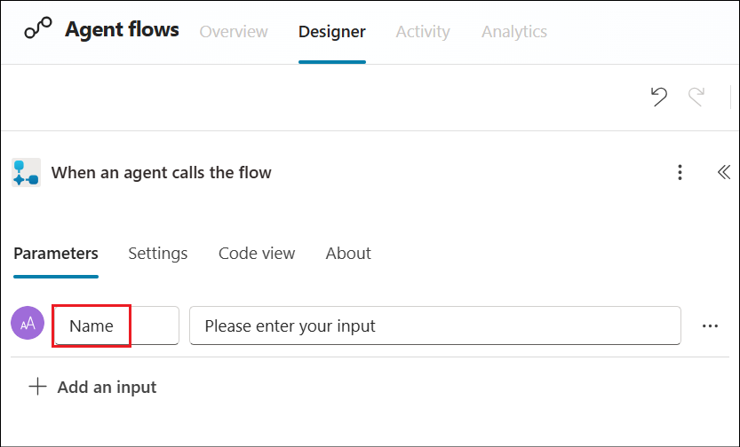

    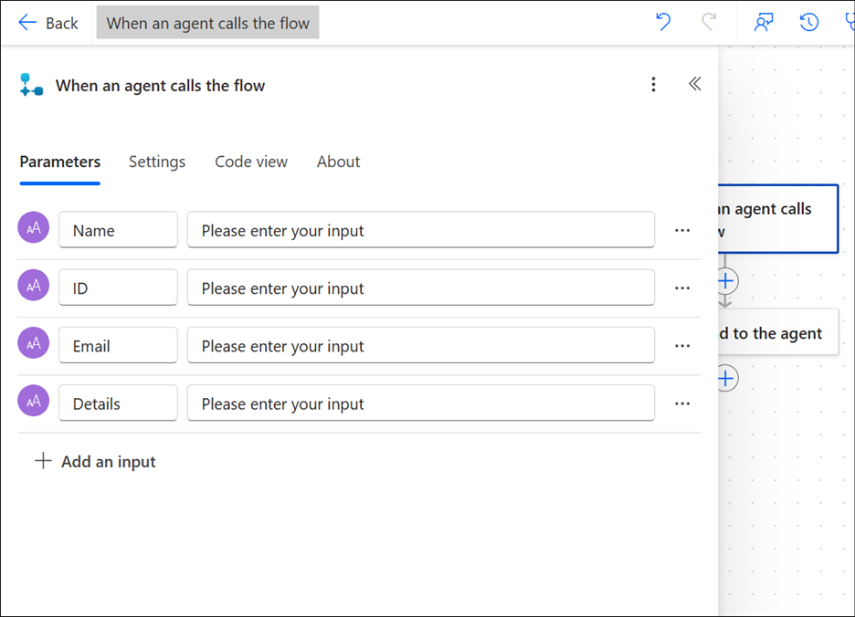

**Conclusion**

By completing this exercise, participants will learn:

- How to integrate Power Automate flows with a Copilot agent for ticket
  creation.

- Steps to collect and map input data dynamically from user
  interactions.

- Techniques to automate email notifications for technical issue
  escalation.

- The ability to configure workflows for efficient support ticket
  management.

## Exercise 6: Configuring an Email-Based Trigger for Automated Actions

This continuation of automating support ticket creation focuses on
setting up a trigger in the Contoso IT Support Agent to link email
inputs with the automated Power Automate flow. Participants will
configure triggers and finalize the agent for deployment.

1.  Go to overview page of the agent, scroll down and click on **+ Add
    trigger**.

    

2.  Then from Add trigger window, select **When a new email arrives
    (V3)** trigger.

    

3.  After successful connection of copilot and outlook and green tick
    appears click on **Next** button.

    

4.  In folder field select folder icon and select **Inbox** folder and
    then select **Create trigger**.

    

    

5.  Close the **Time to test your trigger** prompt. On Support agent
    overview page scroll down, on trigger section click on three
    dots **(…)** and select **Edit in Power Automate.**

    

6.  Right click on When a new email arrives trigger and
    select **Delete**.

    

7.  Then click on Add a trigger, search for +++**When new email
    arrives**+++ and select **When a new email arrives** trigger
    from **Office 365 outlook** section.

    

8.  Click on **Send a prompt to the specified copilot for processing**,
    in body/message section enter the prompt, +++**Run Create an
    Employee Support Ticket flow and use content from Body From.**+++
    Replace **Body** and **From** as dynamic content variable.

    

9.  **Save** and **Publish** the flow, close power automate window and
    go back to copilot window.

    

10. Go to overview section and from top right corner click
    on **Publish** and again click **Publish** to publish the copilot.

    

    

**Conclusion**

By completing this exercise, participants will learn:

- How to set up triggers in Copilot to automate workflows based on email
  inputs.

- Steps to dynamically map email content to Power Automate flows.

- The process of publishing and finalizing the AI agent for operational
  use.

- Practical skills in linking communication tools like Outlook with
  automated workflows.

## Exercise 7: Test the agent

This exercise focuses on testing the integration of the Contoso IT
Support Agent with Power Automate and Outlook. Participants will verify
the agent's ability to process emails, create support tickets, and
trigger automated workflows effectively.

1.  Go to overview page of agent, scroll down, click on **(…)** on
    trigger and select **Edit in power automate**.

    

2.  It will navigate to power automate flow, from top bar click
    on **Test** button and then select **Manually** and again click
    on **Test**.

    

    

3.  **Send an email** to the 365 admin tenant mail id from any other
    mail box in order to **trigger the action**. The mail should be
    describing an issue and should have your details like employee id in
    it, similar to the one in the below screenshot. Example content is
    as below

    ```
    Hi Support Team,
    
    I hope this message finds you well.
    Iam Mark Brown, working as a Software Engineer at Contoso. My employee ID is CONTOSO099
    Issue: Monitor is completely balank and not functioning.
    Kindly raise a support ticket and assist in resolving this issue at the earlierst.
    Thank you for your support.

    Best Regards,
    Mark Brown
    ```

    

    

4.  Navigate to copilot agent overview page, scroll down and
    select **Test trigger**.

    

5.  Click on **Start testing**, it will start testing.

    

6.  In test section click on the **Connect**, it will open the
    connection window.

    

7.  Click on the **Connect** again and then select **Submit.**

    

    

8.  Navigate to copilot studio window and re run the **Test**.

    

9.  The support request is automatically generated.

    

10. Navigate to power apps and go to Employee support ticket record
    table, and check the details.

    

11. Check the Support mail which we configure in power automate flow to
    send an email. The email is automatically sent to the support team.

    

12. Go to test window and writer query as user +++**Mark Brown Ticket
    Current Status**+++ . It gives the status of the issue as
    unresolved.

    

13. As Support Engineer, write a prompt in the test section. +++**I want
    to know about all Unresolved ticket**+++ .

    

**Conclusion**

By completing this exercise, participants will learn:

- How to test the agent's functionality by simulating real-world
  scenarios.

- Steps to validate email-triggered workflows and ticket generation in
  Power Automate.

- How to review generated records in Dataverse and ensure notifications
  are sent to the support team.

- Practical insights into debugging and finalizing automation workflows.

**Final Conclusion of the Lab Guide**

This lab guide provided participants with a hands-on experience in
deploying an Autonomous Copilot Agent for Contoso Solutions' IT support
service desk. By following the step-by-step exercises, participants were
able to:

1.  **Set Up Copilot Studio**: Participants learned how to log into
    Copilot Studio, create and configure the IT support agent, and
    enable essential settings like generative AI and orchestrator for
    effective troubleshooting and ticket automation.

2.  **Navigate Power Apps**: Participants gained practical knowledge in
    logging into Power Apps, setting up a Dataverse table, and importing
    data from Excel to track and manage support tickets efficiently.

3.  **Enhance Bot Capabilities**: The exercises focused on adding a
    knowledge base to the bot, customizing the conversation start and
    fallback topics to improve user interaction, and ensuring the bot
    could handle a wide range of IT support scenarios.

4.  **Automate IT Support Tasks**: Participants also learned how to
    automate the creation of support tickets using Power Automate,
    enhancing the bot's capability to manage unresolved issues and
    improve IT team workflows.

By completing these exercises, participants were able to implement a
robust autonomous support system that improves response times, reduces
manual workload, and enhances overall productivity for IT support
operations. The integration of Copilot Studio, Power Apps, and Dataverse
ensures a seamless flow of information, automates routine tasks, and
optimizes support workflows, providing immediate troubleshooting
solutions to employees and automated ticket management for unresolved
issues.
