# 실습 9 - Copilot Studio를 사용하여 Autonomous Copilot Agent로 IT 지원 운영 간소화

**예상 소요 시간: 60분**

**목표**

이 실습의 목표는 참가자가 자율 Copilot 에이전트를 생성하여 Contoso
Solutions의 IT 지원 운영을 간소화할 수 있도록 지원하는 것입니다.
참가자는 Microsoft Copilot Studio 설정, IT 지원 에이전트 구성, Power
Apps와 Dataverse 통합, 지식 기반을 통한 봇 기능 향상, Power Automate를
활용한 티켓 생성 자동화 방법을 배우게 됩니다. 이 실습 실습을 통해
사용자는 IT 워크플로를 개선하고, 수동 작업을 줄이며, 지원 효율성을
향상시키는 기술을 습득할 수 있습니다.

**해결책**

참가자는 Microsoft Copilot Studio를 사용하여 맞춤형 Contoso IT 지원
에이전트를 만들고, 일반적인 IT 문제를 처리하도록 구성하고, 지원 데이터
저장을 위해 Dataverse와 통합합니다. 개발 환경을 설정하고, 지식 소스를
추가하고, 더 나은 사용자 상호 작용을 위해 봇의 대화 흐름을 개선합니다.
Power Apps를 활용하여 IT 지원 기록을 관리하기 위한 Dataverse 테이블을
만듭니다. Power Automate를 사용하여 티켓 생성 및 미해결 문제에 대한
이메일 알림을 자동화합니다. 마지막으로, 참가자는 에이전트를 테스트하여
문제 해결 정확도와 워크플로 자동화를 검증하고 원활한 IT 지원 운영을
보장합니다.

## 연습 1: Power Apps 시작하기

이 연습에서는 참가자에게 Power Apps와 Dataverse를 소개합니다. 목표는
Power Apps에 로그인하고, 작업 환경을 설정하고, Excel 파일에서 데이터를
가져와 Dataverse 테이블을 만드는 것입니다. 참가자는 데이터 기반
애플리케이션 작업에 필수적인 기술을 배우게 됩니다.

### 작업 1: Power Apps에 로그인하기

1.  Power Apps 웹사이트로 이동하세요
    +++<https://www.microsoft.com/en-us/power-platform/products/power-apps+++>
    그리고 **Try for Free** 버튼을 클릭합니다.

2.  **Resources** 탭의 **Office 365 Tenant** 섹션에서 **Administrative
    Username**을 이메일 필드에 입력하고 **확인란**을 **선택**한 후
    **Start free**버튼을 클릭합니다.

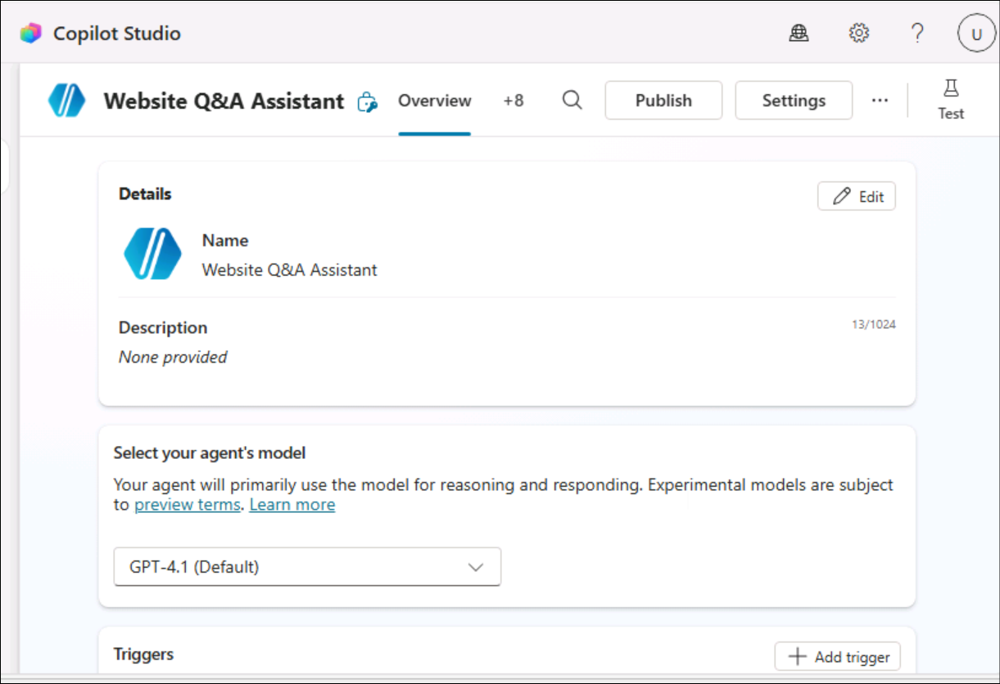

3.  **Administrative Password** 를 입력하면 Power Apps 홈페이지로
    이동합니다.

4.  Stay Signed in대화 상자에서 **Yes**를 선택하고, **Got it** 대화
    상자에서 Sign in to Microsoft Edge 팝업에서 **No, Thanks**를
    선택합니다.

참고: 로그인을 위해 사용자 이름, 비밀번호 또는 기타 정보를 다시
입력하라는 메시지가 표시되면 동일한 정보를 입력하고 로그인하세요.

### 작업 2: 개발자 환경 설정 업데이트하기

1.  로그인 자격 증명을 사용하여
    +++https://admin.powerplatform.microsoft.com/home+++에서 Power
    Platform 관리 센터에 로그인합니다.

2.  왼쪽 창에서 **Manage**를 선택하고 **Environments**아래에서 **+
    New**를 선택합니다.

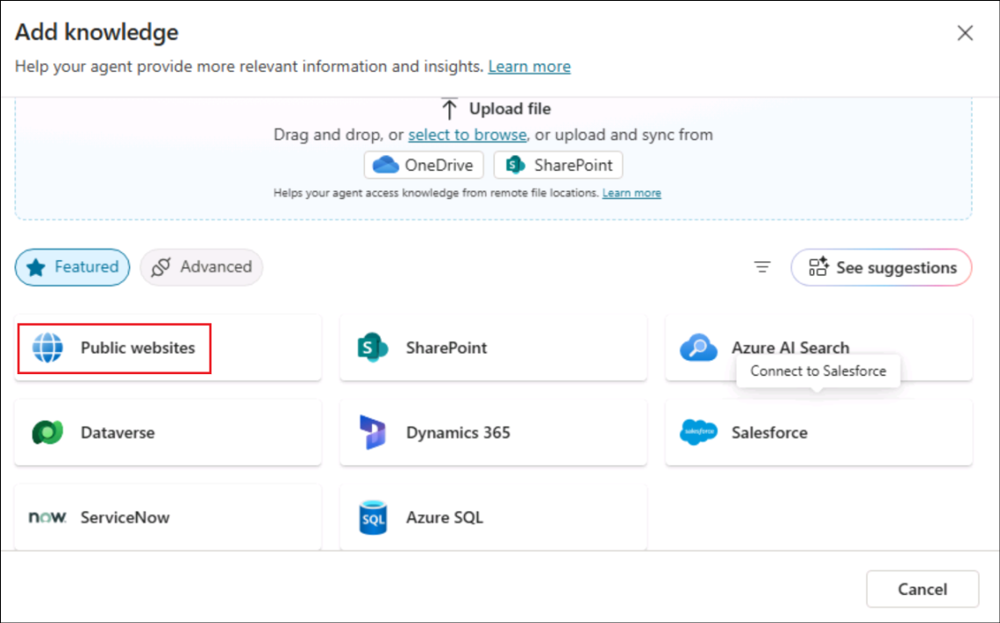

3.  환경 이름을 +++**Dev One**+++로 입력하고 유형을 **Developer**로
    선택한 후 **Next**를 선택합니다.

4.  **Add Dataverse**대화 상자에서 **Save**을 선택합니다.

5.  환경이 **준비되면** 생성된 **Dev One** 환경을 선택합니다.

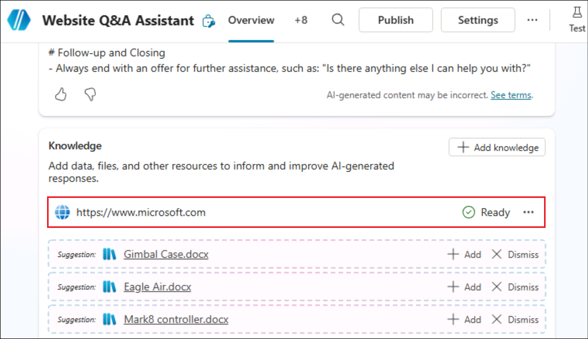

6.  **Edit**을 클릭하여 설정을 편집합니다.

7.  편집 창에서 **Administration mode**를 **ON**으로 전환하고 **Save**을
    선택합니다.

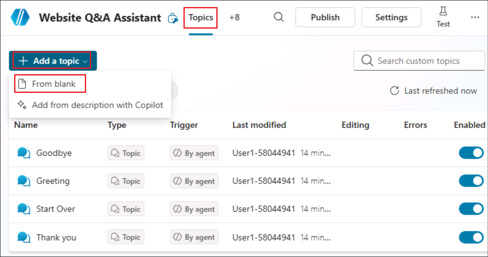

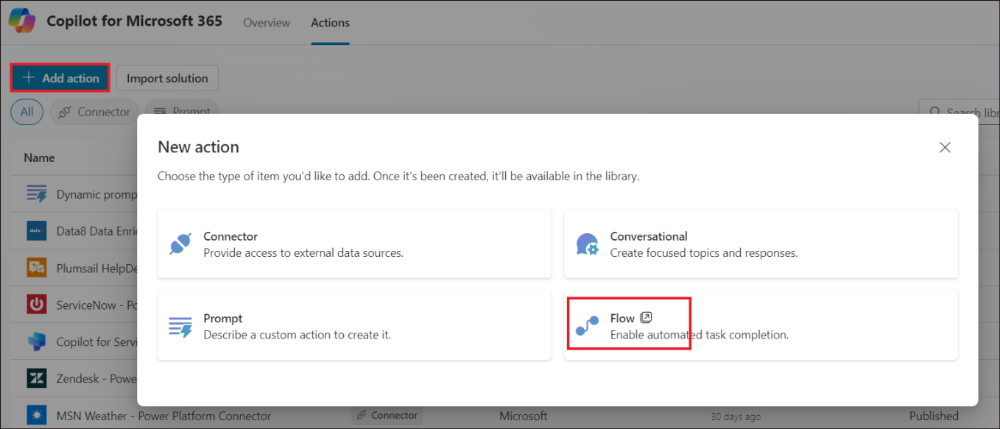

8.  편집한 변경 사항을 저장한 후 **Settings**을 선택합니다.

9.  **Product -\> Features**를 선택합니다.

10. **Features**에서 **Dataverse search** 및 **Single table search**
    옵션을 켜짐으로 설정하고 **Save**을 선택합니다.

### 작업 3: Dataverse 테이블 설정하기

1.  오른쪽 상단에서 **Dev One** 환경을 선택합니다.

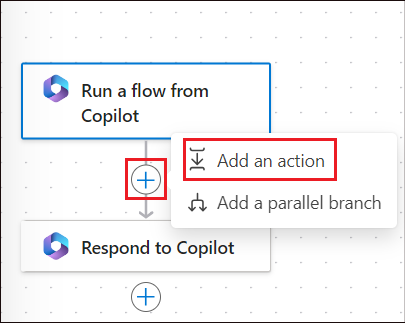

2.  왼쪽 탐색 모음에서 **Tables**을 선택합니다. 상단 바의 tables
    섹션에서 **+ New table** 을 클릭한 다음 **Create new tables**를
    선택합니다.

3.  **Import an Excel file or CSV**옵션을 선택하여 새 표를 만듭니다.

4.  **Select form device** 옵션을 클릭하고 **C:\LabFiles** 폴더에서
    **Support Ticket** 엑셀 파일을 선택합니다.

5.  다음 화면에서 **Import**를 선택합니다.

6.  테이블을 선택하고 **View data**를 클릭하여 테이블을 확인합니다.

**참고**: 이 경우 테이블 이름은 *Employee Technical Support
Record*입니다. 이름은 실행마다 다를 수 있습니다. 나중에 참조할 수 있도록
테이블 이름을 저장해 두세요. 열 이름도 실행마다 다를 수 있습니다.

7.  테이블 데이터로 이동하여 **Technical Issue Description** 필드 옆의
    드롭다운을 선택하고, **Edit column**을 선택한 후, 데이터 유형을
    **Text** 🡪 **Multiple line** 🡪 **Plain Text** 으로 설정하고
    **Update**를 클릭합니다. 열 이름은 경우에 따라 다를 수 있습니다.

**참고**: **열 이름은 약간 다를 수 있지만**, Copilot에서 생성되므로 문제
설명과 유사합니다.

> 

8.  **Current Status** 필드 옆 드롭다운 메뉴를 선택하고, **Edit
    column**을 선택한 후, 선택 항목을 +++**Unresolved**+++,
    +++**Resolved**+++, +++**Processing**+++로 설정합니다. 기본 선택
    항목을 **Unresolved**로 설정하고 **Update**를 클릭합니다.

9.  오른쪽 상단에서 **Save and exit** 를 클릭하여 표를 저장합니다.

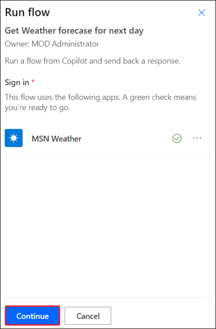

### 작업 4: OneDrive에 파일 추가하기

1.  Power Apps 페이지 왼쪽 상단에서 메뉴를 선택하고 OneDrive를
    선택합니다.

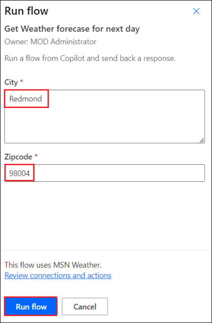

2.  **My files** -\> **+ Add new**를 선택합니다.

> 

3.  **Files upload**를 선택합니다.

4.  **C:\LabFiles**에서 **IT Support.xlsx**를 선택합니다.

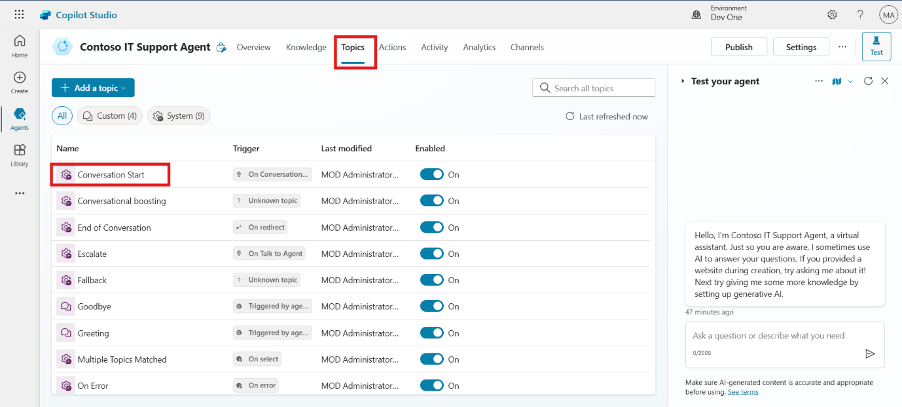

5.  이 파일은 이후의 연습에서 사용될 것입니다.

> **결론**
>
> 이 연습을 완료하면 참가자는 다음을 학습하게 됩니다:

- Office 365 관리자 테넌트 자격 증명을 사용하여 Power Apps에 액세스하고
  탐색하는 방법

- 데이터를 가져와 Dataverse 테이블을 만들고 구성하는 단계

- 앱 개발 워크플로를 지원하는 환경 설정에 대한 실무 지식

## 연습 2: Contoso IT 지원 에이전트 만들기

이 연습은 Microsoft Copilot Studio에 로그인하고 Contoso의 IT 지원 운영에
맞춰 사용자 지정된 Copilot 에이전트를 만드는 데 중점을 둡니다. 참가자는
Copilot Studio 탐색, 환경 구성, IT 워크플로 간소화를 위한 AI 기반
에이전트 구축을 직접 경험하게 됩니다.

### 작업 1: Contoso IT 지원 에이전트 만들기 및 구성하기

1.  로그인 자격 증명을 사용하여
    +++https://copilotstudio.microsoft.com+++에 로그인합니다.

2.  Copilot Studio 홈 섹션에서 오른쪽 상단의 **environment** 을 선택하고
    **DevOne** 환경을 선택합니다.

3.  Welcome copilot studio탭에서 **Skip**를 클릭하여 계속 진행합니다.

4.  왼쪽 탐색 모음에서 **Create**를 선택한 다음 **New agent**를 선택하여
    새 에이전트를 만듭니다.

5.  오른쪽 상단 모서리에서 **Skip to configure** 버튼을 클릭합니다.

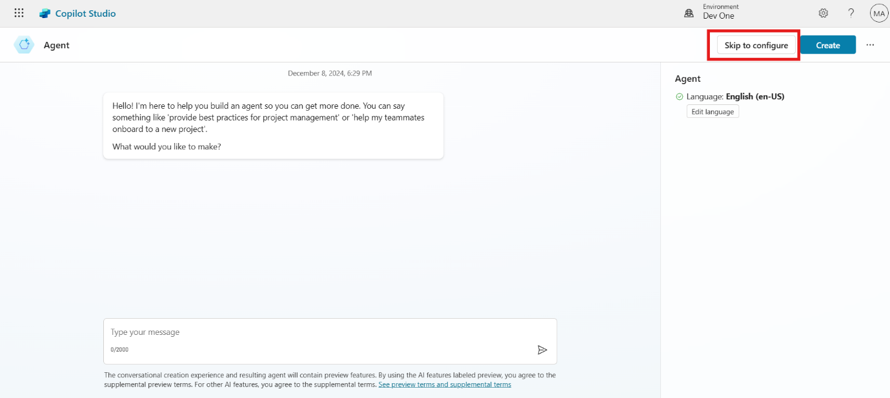

6.  아래에 나와 있는 대로 에이전트의 **Name, Description and
    Instruction** 을 입력하고 **Create** 버튼을 클릭합니다.

> **Name:** +++Contoso IT Support Agent+++
>
> **Description:** +++Create a Contoso IT Support Agent which transforms
> IT support at Contoso Solutions by providing instant troubleshooting
> for common issues, automating ticket creation for unresolved problems,
> and storing all interactions in Dataverse. This solution enhances
> response times, reduces manual workloads, and boosts employee
> productivity.+++
>
> **Instruction:** +++Create the Copilot Agent and configure it to
> handle IT support operations. Add a knowledge source containing
> solutions for common IT issues like hardware troubleshooting,
> connectivity, and software glitches. Set up a trigger to detect
> updates to a OneDrive file describing unresolved issues. Create an
> action to save these technical issues into a Dataverse table, ensuring
> all details are stored for tracking and reporting. Test the agent to
> validate its troubleshooting accuracy and ticket automation workflow
> before deployment.+++

7.  Contoso IT 지원 에이전트의 개요 페이지에서 에이전트에 대한
    오케스트레이터를 활성화합니다.

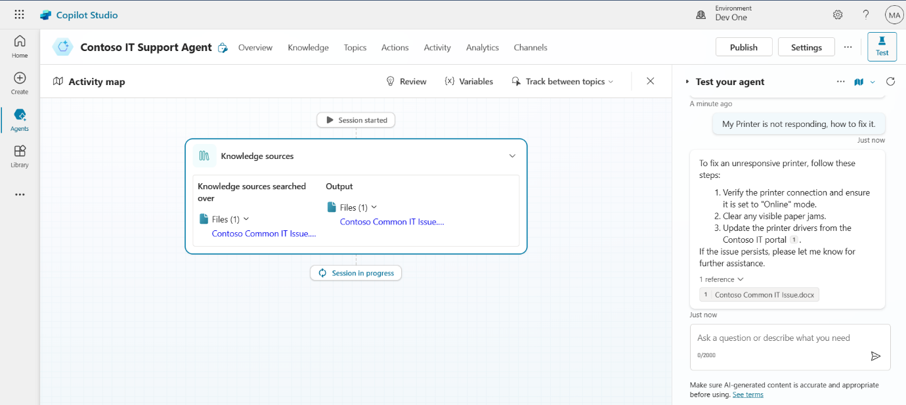

8.  에이전트의 오른쪽 상단에서 **Settings** 버튼을 클릭합니다.

9.  그런 다음 **Generative AI** 섹션으로 이동하여 **Generative**를
    선택하고 콘텐츠 검토를 **Medium**으로 설정한 후 **Save**를 클릭하여
    설정을 저장합니다.

10. 저장 후 설정 창을 닫습니다.

11. 에이전트 개요 페이지에서 “**Allow the AI to use its own general
    knowledge**” 옵션을 비활성화합니다.

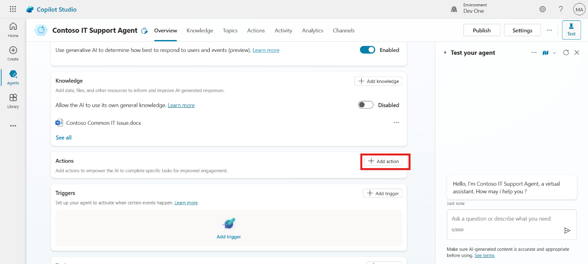

> **결론**
>
> 이 연습을 완료하면 참가자는 다음을 학습하게 됩니다:

- Microsoft Copilot Studio에 액세스하고 설정하는 방법

- 사용자 지정 Copilot 에이전트를 만들고 구성하는 단계

- 에이전트에 생성적 AI 및 오케스트레이터 설정을 활성화하는 실무 기술

- 티켓 생성을 자동화하고 AI를 활용하여 문제 해결을 통해 IT 운영을
  개선하는 방법

## 연습 3: 봇 기능 향상하기

이 연습은 지식 베이스를 추가하고 봇 주제를 사용자 지정하여 상호 작용
개선을 통해 Contoso IT 지원 에이전트의 역량을 향상시키는 데 중점을
둡니다. 참가자는 봇의 응답을 개선하고 사용자의 문제 해결 및
에스컬레이션을 효과적으로 지원할 수 있도록 합니다.

### 작업 1: 지식 베이스 추가하기

1.  Contoso 에이전트 개요 페이지에서 아래로 스크롤하여 **+ Add
    Knowledge** 버튼을 클릭합니다.

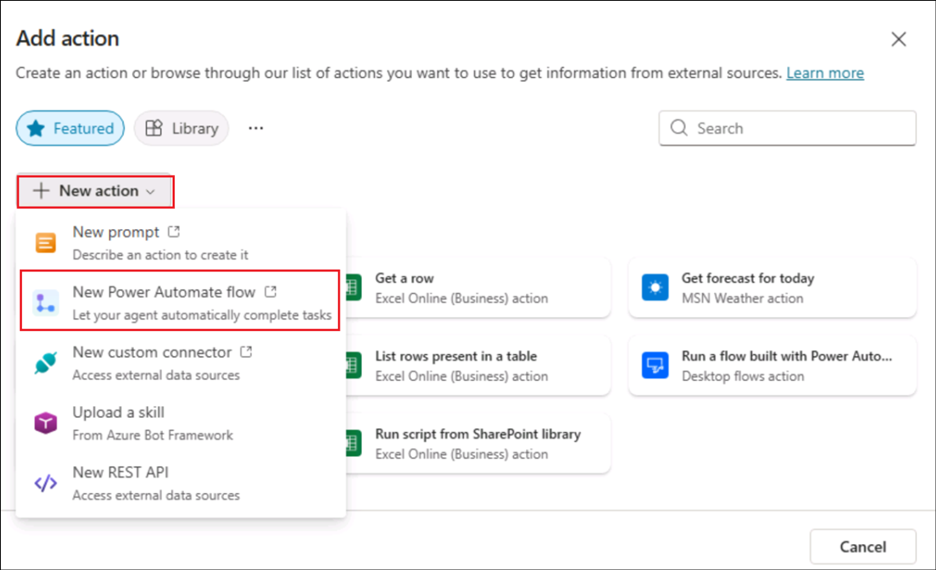

2.  **Upload file**선택하여 **C:\LabFiles** 폴더에서 **Contoso Common IT
    Issue.docx** 랩 파일을 추가한 다음 **Add**를 클릭하여 파일을
    저장합니다.

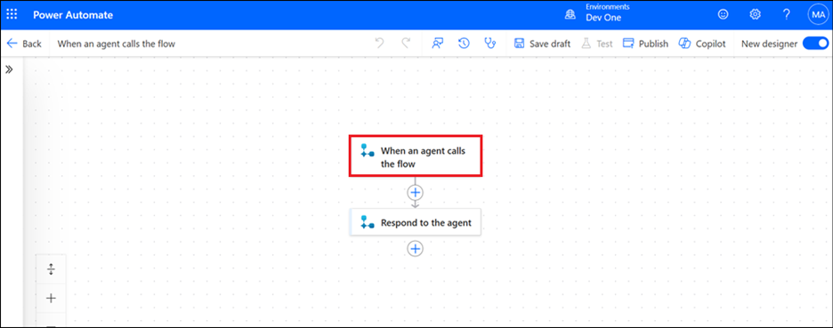

>  

3.  다시 에이전트 개요 페이지로 가서 아래로 스크롤하여 **+ Add
    knowledge**를 클릭합니다.

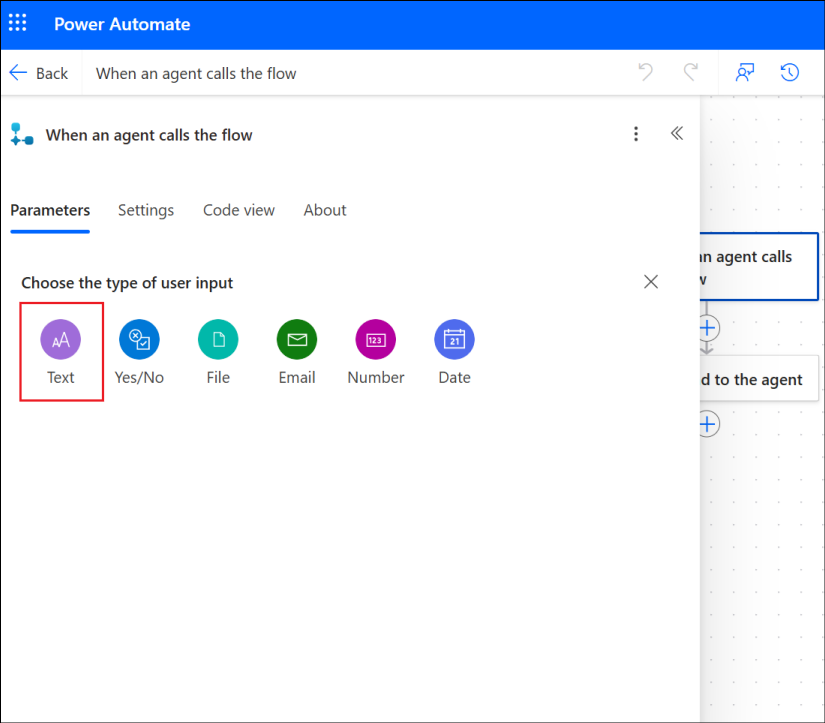

4.  데이터 소스로 **Dataverse (preview)** 옵션을 선택합니다.

5.  오른쪽 상단 검색창에 +++ **Employee**+++를 입력하고 검색한 후
    **Employee Technical Support Record** 테이블을 선택합니다. 그런 다음
    **Next** , **Next** , **Add** 버튼을 클릭하여 지식 소스를
    추가합니다.

**참고**: Copilot에서 생성한 테이블이므로 테이블 이름이 다를 수
있습니다.

> 

\[!알림\] **중요**: 지식 페이지에서 추가된 지식 소스가 성공적으로
업로드되었는지 확인하세요. 완료하는 데 일반적으로 10~15분 정도
소요됩니다.

### 작업 2: 대화 시작 주제 사용자 지정하기

1.  상단 바 옵션에서 **Topics**를 클릭하고 **System**을 선택한 다음,
    **Conversation Start** 주제를 클릭하여 엽니다.

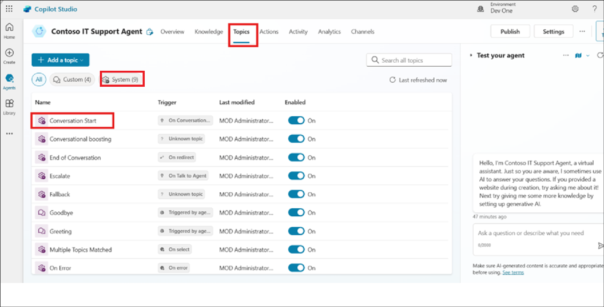

2.  아래로 스크롤하여 메시지 노드로 이동합니다. 아래와 같이 봇 이름 뒤에
    메시지를 업데이트합니다.

Hello. I’m Bot Name, a virtual assistant. +++How can I help you?+++

3.  상단의 **Save**을 클릭하여 주제를 저장합니다.

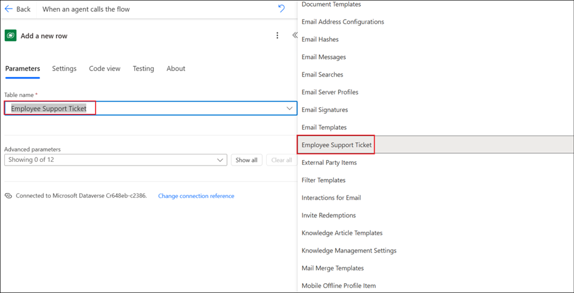

### 작업 3: 대체 주제 업데이트하기

1.  상단 바 옵션에서 **Topics**를 클릭한 다음 **Fallback** 주제를
    엽니다.

2.  아래로 스크롤하여 메시지 노드로 이동합니다. 아래와 같이 메시지를
    업데이트합니다.

+++I’m sorry. This information is not available in my system. You can
raise the support ticket via mail for this issue.+++

3.  오른쪽 상단의 **Save** 버튼을 클릭하여 주제를 저장합니다.

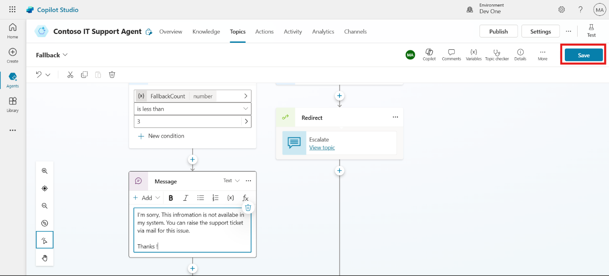

> **결론**
>
> 이 연습을 완료하면 참가자는 다음을 학습하게 됩니다:

- 봇 기능을 향상시키기 위해 지식 베이스를 업로드하고 통합하는 방법

- 더욱 매력적인 사용자 경험을 위해 대화 시작 메시지를 맞춤 설정하는 단계

- 지원되지 않는 쿼리를 더 효과적으로 처리하기 위한 대체 응답 업데이트
  기술

## 연습 4: 에이전트 테스트하기

이 연습에서는 Contoso IT 지원 에이전트를 테스트하여 기능을 검증하는
방법을 안내합니다. 참가자는 지식 기반 및 대체 주제를 사용하여 봇이
프롬프트를 어떻게 처리하는지 확인하고 원활한 상호작용과 에스컬레이션을
보장합니다.

1.  오른쪽 상단의 **Test** 버튼을 클릭합니다. 테스트 섹션에서 **Map**을
    클릭하고 켜기를 설정한 후 **Refresh**를 클릭합니다.

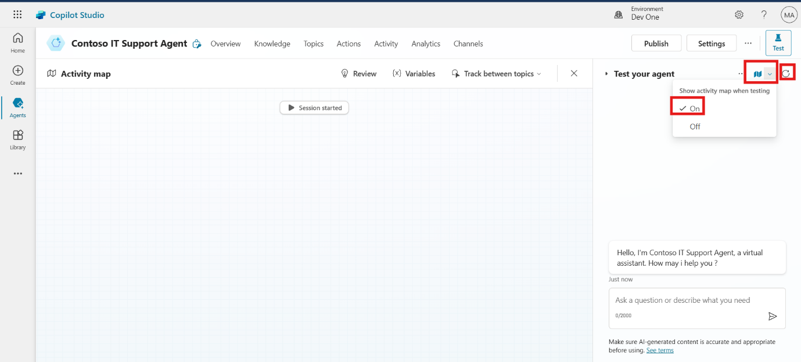

2.  +++ **My printer is not working how to fix it**?+++ 프롬프트를
    입력하세요. 지식 출처에 따른 해결책을
    제공합니다.

3.  다시 한번 +++ **Two factor Authentication (2FA) issue**+++라는
    프롬프트를 표시합니다.

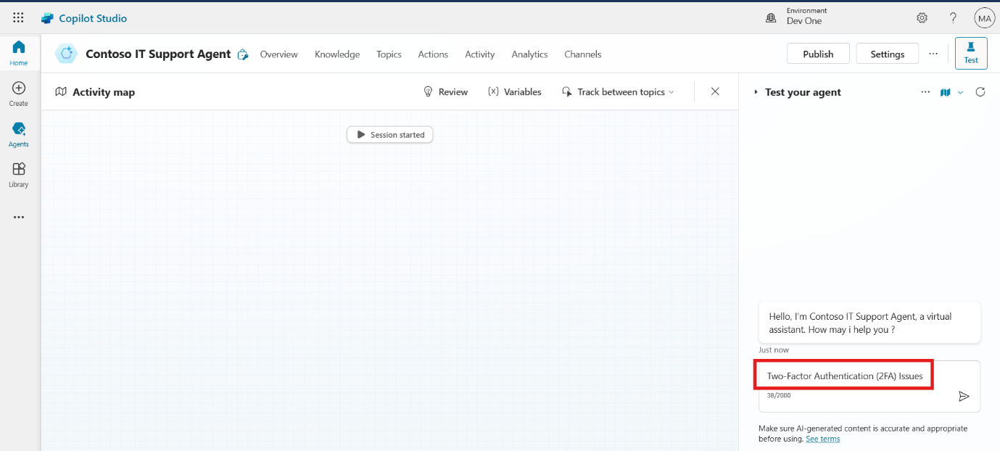

4.  2FA 문제와 해결책이 지식 소스에 없으므로 대체 주제로 이동하여 티켓
    생성과 관련된 프롬프트가 반환됩니다.

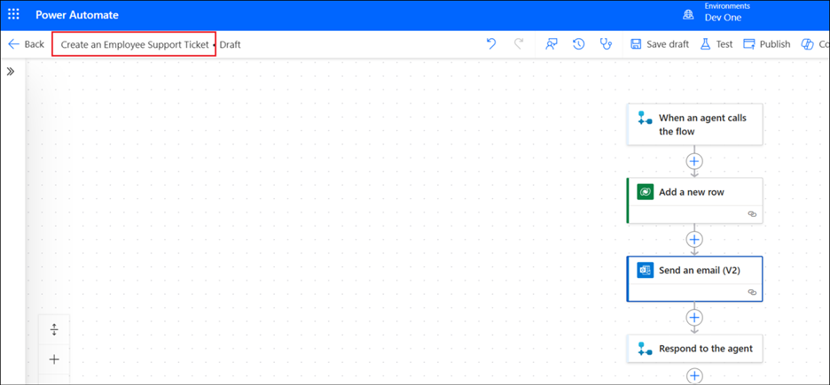

> **결론**
>
> 이 연습을 완료하면 참가자는 다음을 학습하게 됩니다:

- 문제 해결을 위해 AI 에이전트를 테스트하고 활성화하는 방법

- 봇이 지식 기반을 사용하여 응답하는 능력 검증

- 대체 주제에서 지원되지 않는 쿼리를 처리하고 사용자를 효과적으로
  리디렉션하는 방법

## 연습 5: Power Automate를 사용하여 지원 티켓 생성 자동화하기

이 연습에서는 AgentFlow를 사용하여 지원 티켓 생성을 자동화하고 Contoso
IT 지원 에이전트와 통합하는 방법을 보여줍니다. 참가자는 Dataverse에 문제
보고 및 데이터 기록 흐름을 간소화합니다.

1.  에이전트의 왼쪽 메뉴 막대에서 **Flows**를 선택합니다.

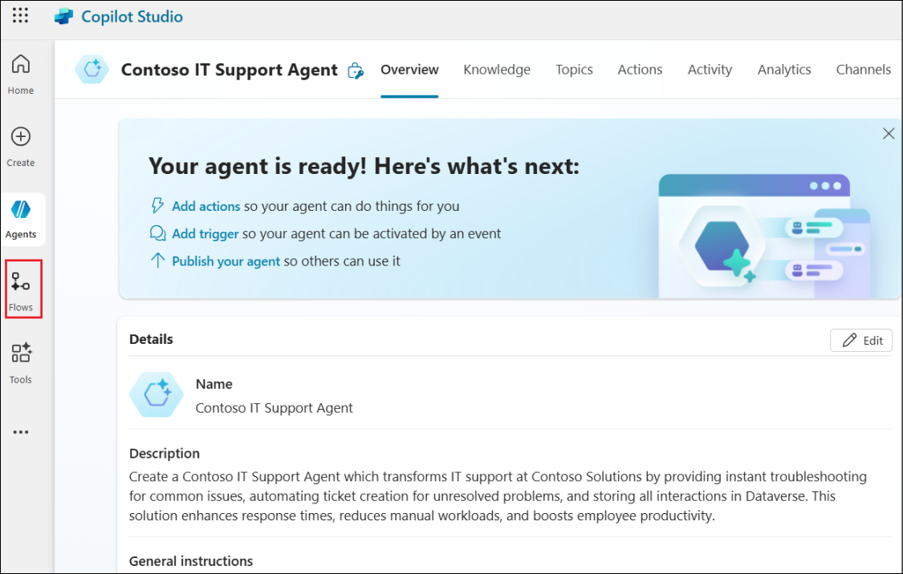

2.  **Start in designer**를 선택합니다.

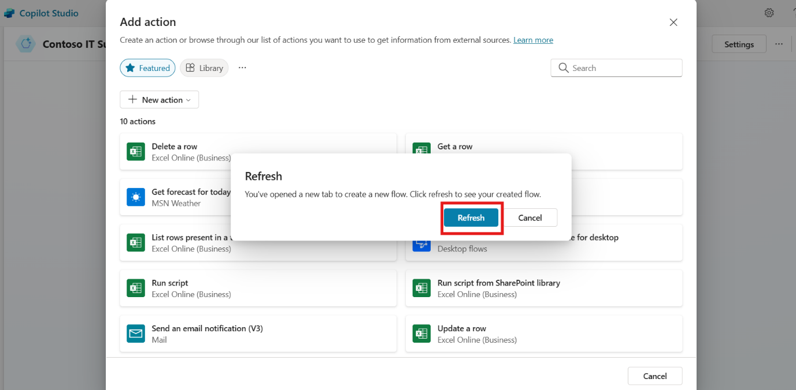

3.  **Add a trigger**를 선택한 다음 **When an agent calls the flow**를
    선택합니다.

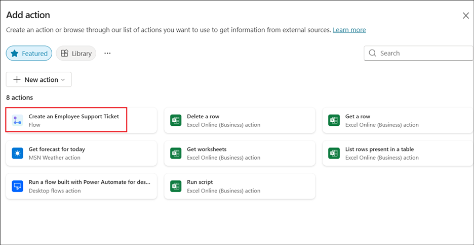

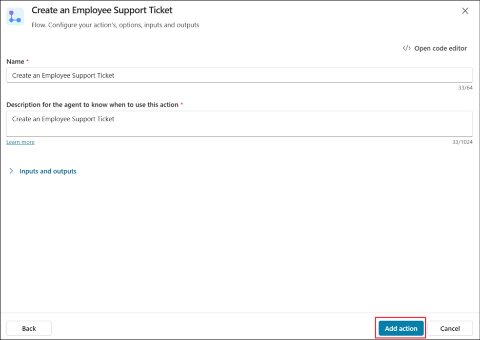

4.  추가된 트리거인 **When an agent calls the flow**를 선택한 다음 **Add
    an Input**를 선택합니다.

5.  입력 데이터 유형으로 **Text**를 선택하고 입력 이름을 +++ **Name**
    +++으로 변경합니다.

6.  동일한 절차로 아래에 주어진 세부 정보에 따라 추가 입력을 생성합니다.

| **Input Name** | **Data Type** |
|----------------|---------------|
| +++ID+++       | Text          |
| +++Email+++    | Text          |
| +++Details+++  | Text          |

> 

7.  **When an agent calls the flow**아래에서 (+) 기호를 클릭하고 **Add
    an action**를 선택합니다.

8.  **Add an action** 검색 창에 +++**Add a new row**+++를 입력합니다.
    그런 다음 Microsoft Dataverse에서 **Add a new row**를 선택합니다.

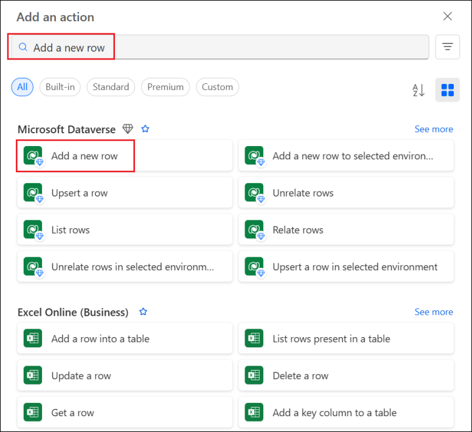

참고: 경우에 따라 Dataverse 연결이 자동으로 생성되지 않을 수 있습니다.
**OAuth** 인증 자격 증명을 사용하여 다시 로그인해야 할 수 있습니다.

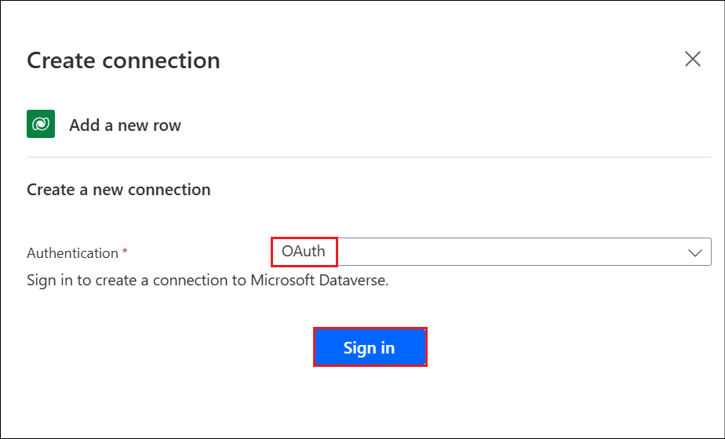

9.  **Table Name**섹션에서 +++ **Employee Technical Support Record**
    +++(또는 생성된 해당 테이블 이름)를 검색하여 선택합니다.

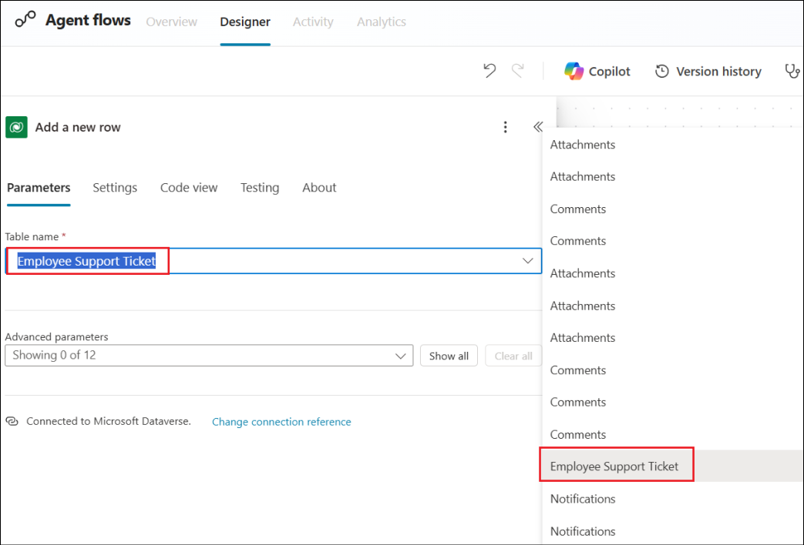

10. 아래 표 이름에서 **Show all**를 선택한 다음 특정 필드를 클릭하고
    아래 표에 따라 **dynamic content**버튼(**Thunder bolt**)을 사용하여
    입력을 추가합니다.

> **Current Status**필드를 **Unresolved**로 설정합니다.

| **섹션**                    | **입력 변수**           |
|-----------------------------|-------------------------|
| Employee Name               | Name (Dynamic Input)    |
| Email Address               | Email (Dynamic Input)   |
| Employee ID                 | ID (Dynamic Input)      |
| Technical Issue Description | Details (Dynamic Input) |

> 
>
> 

11. 상단 바에서 **Save draft** 을 클릭한 다음 **Publish**를 클릭합니다.
    Power Automate 탭을 **닫습니다**.

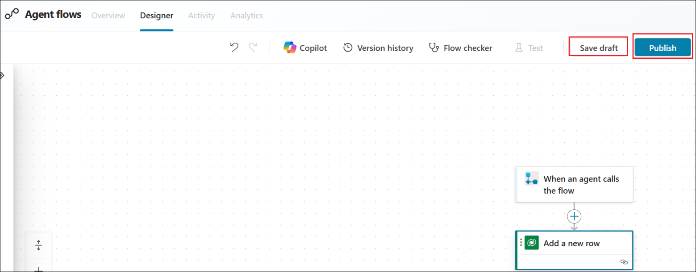

12. 왼쪽 메뉴 막대에서 **Flows**을 선택한 다음 **Untitled** 흐름(방금
    만든 흐름)을 선택합니다.

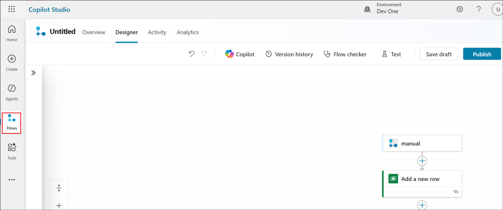

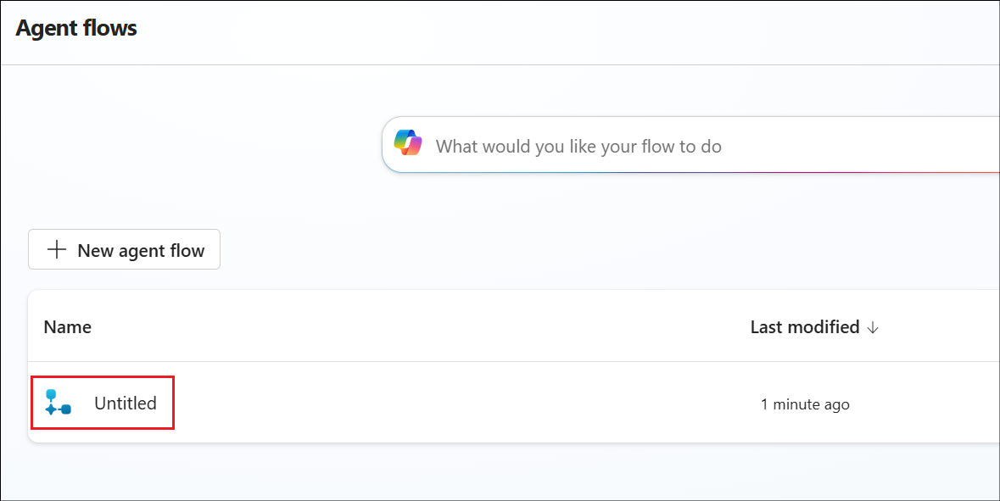

13. 흐름에서 **Edit**을 선택합니다.

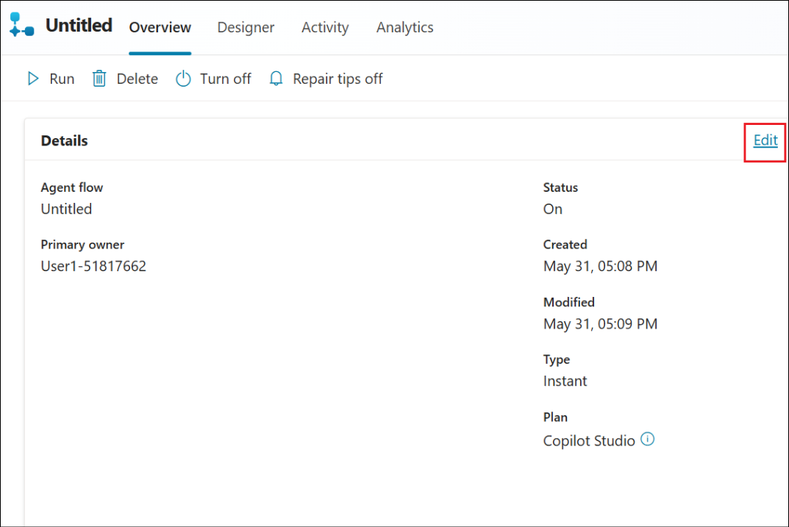

14. 흐름의 이름을 +++ **Create an Employee Support Ticket** +++로
    지정하고 **Save**을 선택합니다.

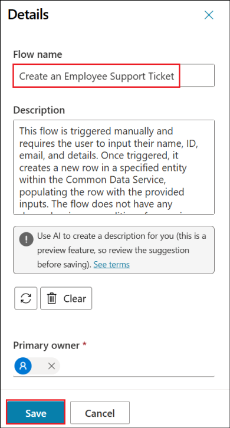

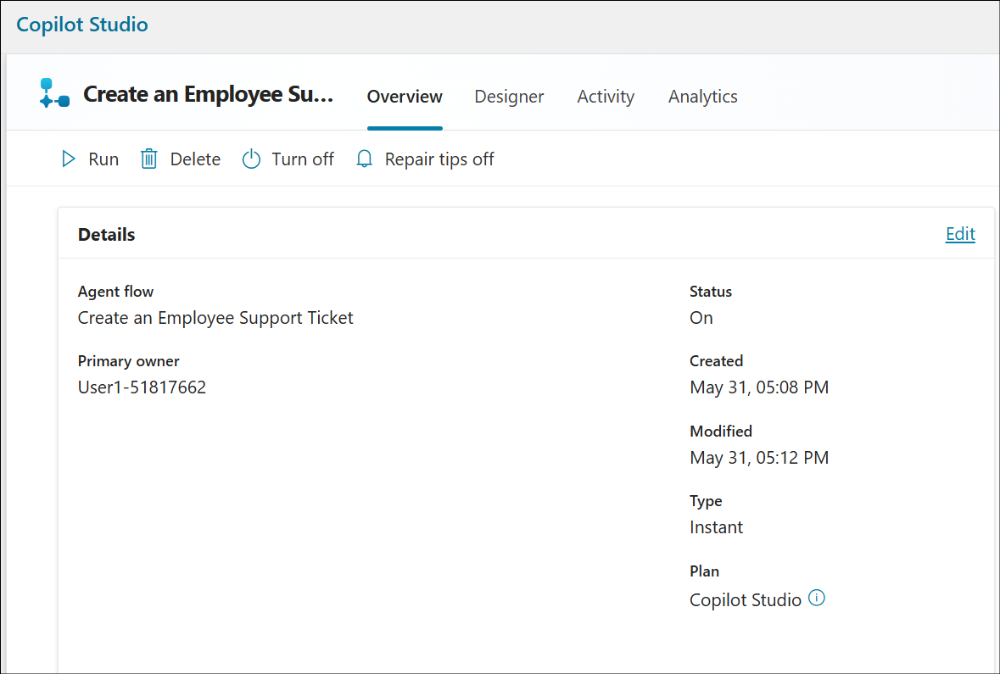

15. **Contoso IT Support Agent** **Overview** 페이지에서 **+ Add
    action**를 선택합니다.

> 

16. **Create an Employee Support Ticket**  흐름을 선택합니다.

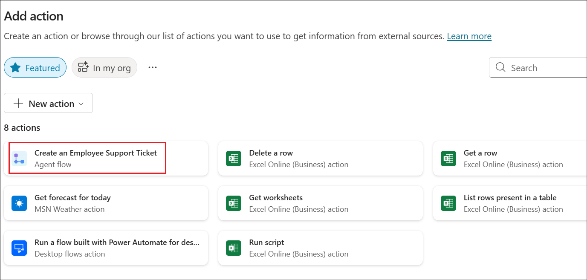

17. 흐름을 추가하려면 **Add action** 버튼을 클릭합니다.

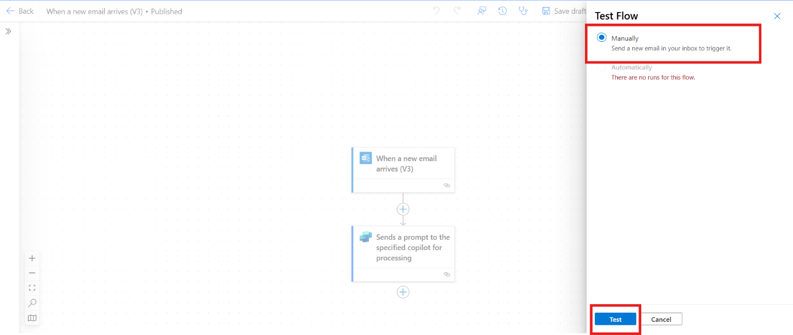

18. 에이전트의 **Overview** 페이지에서 **Action** 섹션 아래에 있는
    **Edit**을 선택하여 작업 매개변수를 편집합니다. **Inputs**섹션을
    선택합니다.

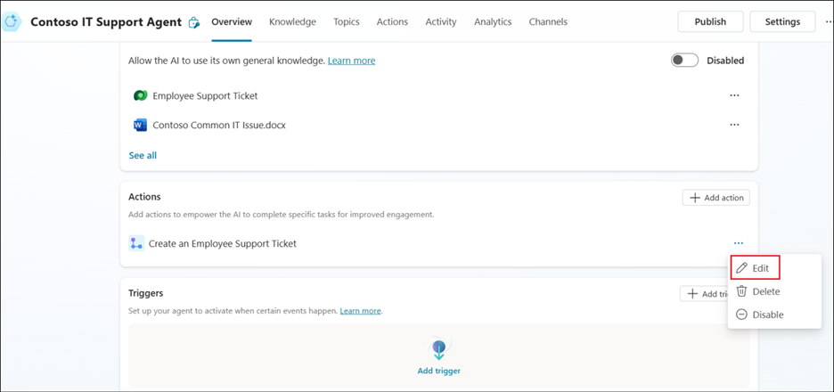

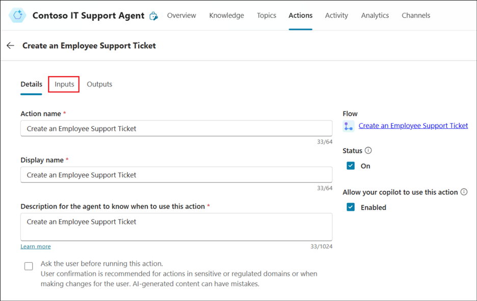

19. 해당 입력 필드에 주어진 설명을 입력하고, 설명을 입력한 후 **Save**
    버튼을 클릭합니다.

| **섹션** | **세부 정보** |
|----|----|
| Name -- Description | +++Enter the name of the employee.+++ |
| ID -- Description | +++Enter the employee ID in the field.+++ |
| Email -- Description | +++Enter the email address of the employee from whom the email is received.+++ |
| Details -- Description | +++Enter the email details of the employee.+++ |

> 
>
> 
>
> **결론**
>
> 이 연습을 완료하면 참가자는 다음을 학습하게 됩니다:

- 티켓 생성을 위해 Agent 흐름을 Copilot 에이전트와 통합하는 방법

- 사용자 상호작용에서 입력 데이터를 동적으로 수집하고 매핑하는 단계

- 기술 문제 에스컬레이션을 위한 이메일 알림을 자동화하는 기술

- 효율적인 지원 티켓 관리를 위한 워크플로 구성 기능

## 연습 6: 자동화된 작업 트리거 구성하기

지원 티켓 생성 자동화에 대한 이 후속 학습에서는 Contoso IT 지원
에이전트에서 자동화된 Power Automate 흐름을 통해 OneDrive에 파일을
생성하도록 트리거를 설정하는 방법에 중점을 둡니다. 참가자는 트리거를
구성하고 에이전트 배포를 완료합니다.

1.  에이전트 개요 페이지로 이동하여 아래로 스크롤하여 **+ Add
    trigger**를 클릭합니다.

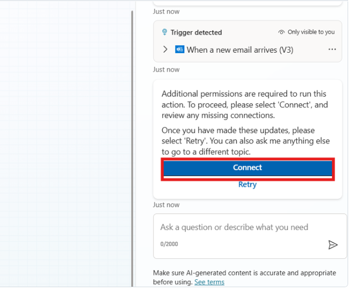

2.  **When a file is created**트리거를 선택하고 **Next**을 클릭합니다.

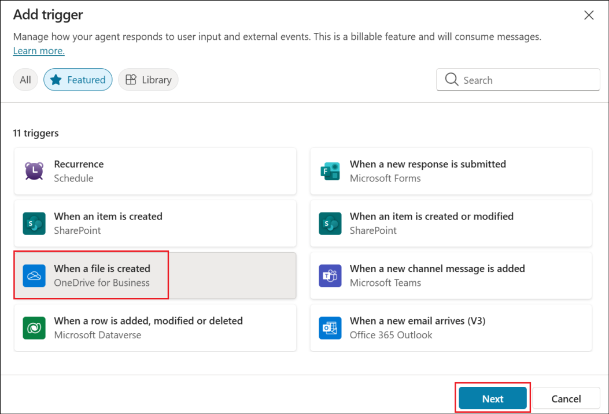

3.  연결이 성공적으로 완료되면 **Next**을 선택합니다.

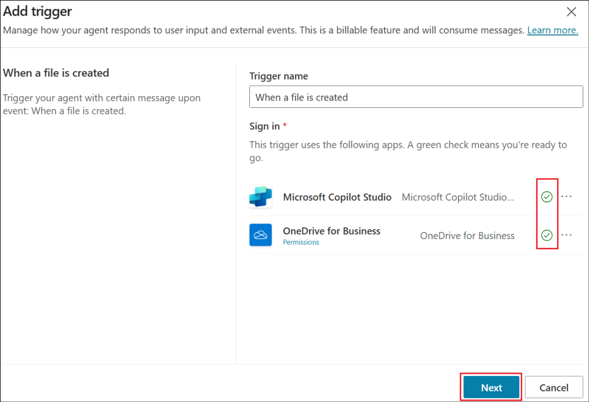

4.  **Folder**에 대해 **Root**를 선택하고, **Include Subfolders**에 대해
    예를 선택한 다음 **Create trigger**를 클릭합니다.

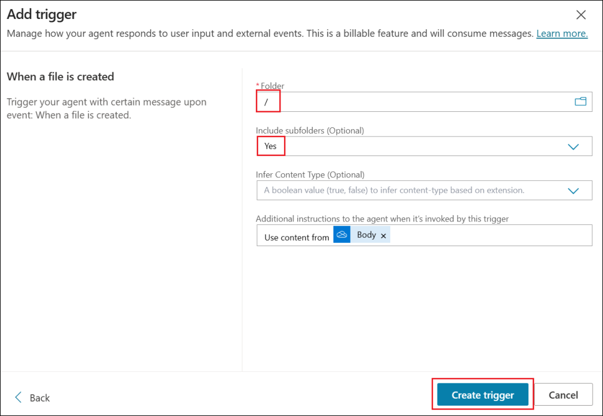

5.  트리거 테스트 대화 상자를 **닫습니다.**

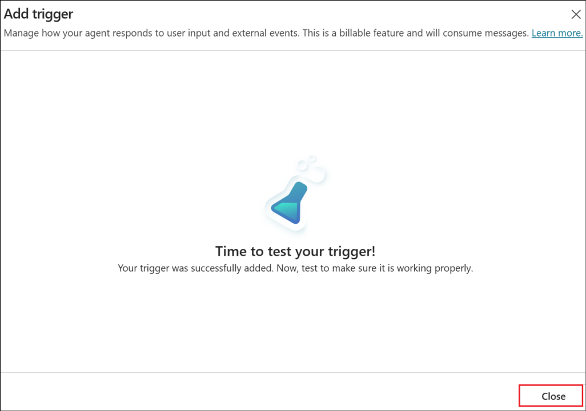

6.  에이전트의 개요 페이지에서 추가된 트리거 옆에 있는 세 개의 점-
    **When a file is created**을 선택하고 **Edit in Power Automate**을
    선택합니다.

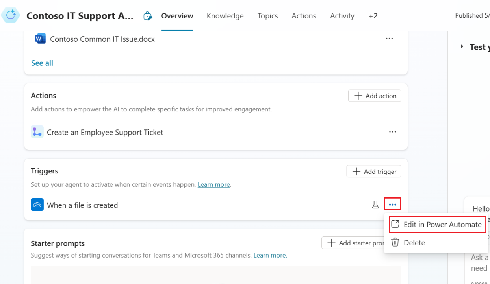

7.  When a file is created노드 아래의 + 기호를 선택하여 동작을
    추가합니다. 동작 창에서 +++ **Get a row** +++를 검색하고 **Excel
    Online (Business)**아래에서 행 가져오기를 선택합니다.

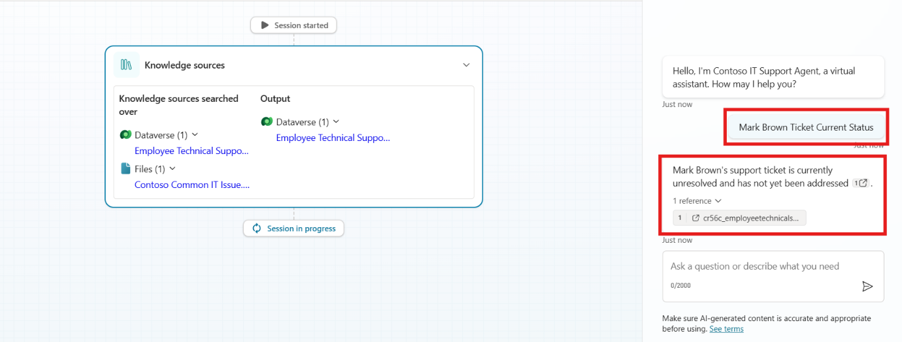

8.  액션을 추가한 후 아래 세부 정보를 추가합니다.

- Location – Select OneDrive for Business

- Document Library – OneDrive

- File – ITSupport.xlsx

- Table – Table1

- Key Column – ID

- Key Value – +++ID1234+++

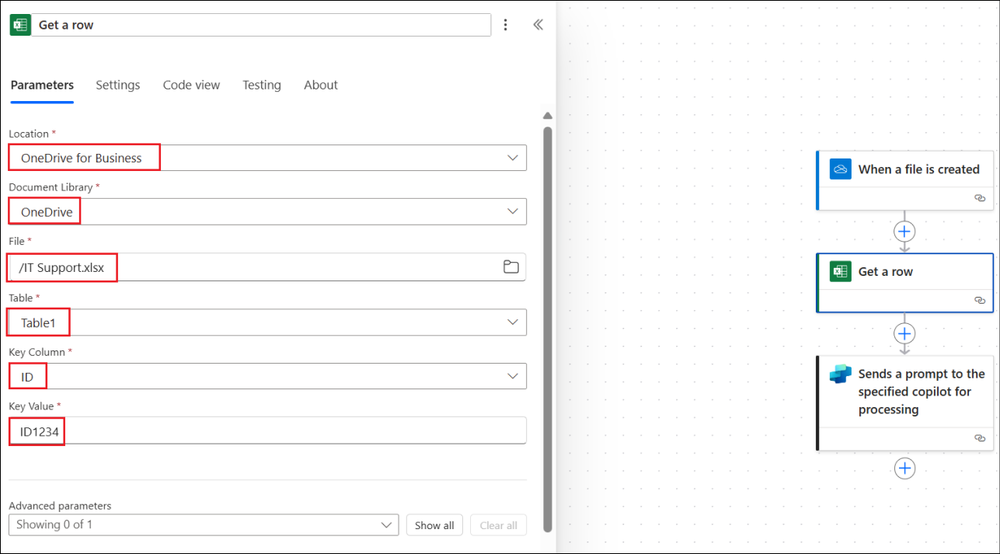

9\. **Sends a prompt to the specified copilot for processing** 노드를
선택합니다.

본문/메시지 아래에 +++Run the flow Create an Employee Support
Ticket+++을 입력한 후 이름, ID, 이메일 ID, 설명, 상태 등 동적 값을
추가합니다. 그런 다음 +++along with a message "New record added to the
Employee Support table"+++

아래 스크린샷과 비슷한 화면일 것입니다.

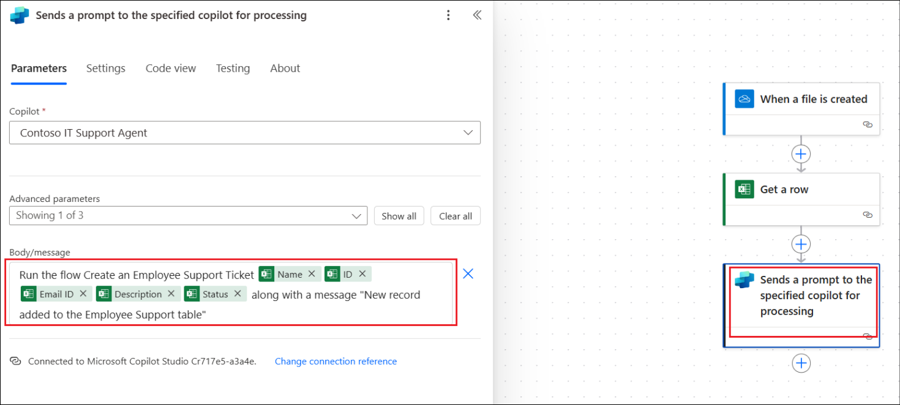

9.  이제 **Save Draft**을 클릭하여 흐름을 저장한 다음 **Publish**를
    클릭하여 흐름을 게시합니다.

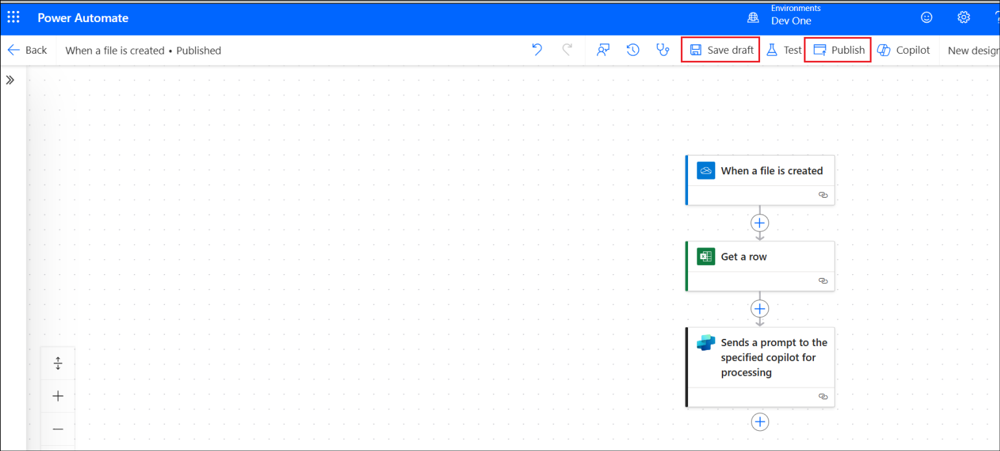

10. Copilot Studio로 돌아와서 에이전트를 게시합니다.

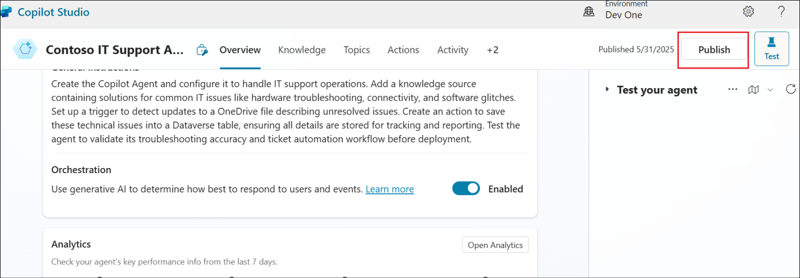

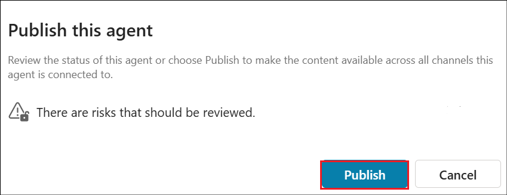

## 연습 7: 에이전트 테스트하기

1.  Power Automate 흐름에서 **파일이 생성되면** **Test**를 선택합니다.

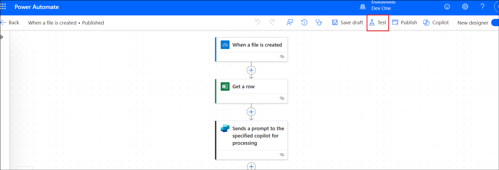

2.  **Manually**옵션을 선택하고 **Test**를 선택합니다.

> 

3.  **OneDrive** 페이지를 엽니다. **My files**에서 **+ Add new**를
    선택하고 **Word 문서**를 선택합니다.

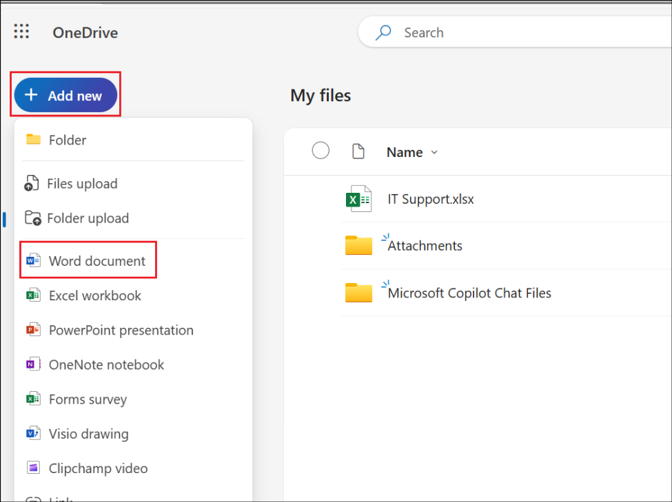

4.  Power Automate 페이지로 돌아가면 흐름이 실행을 시작하고 통과한 것을
    볼 수 있습니다.

> 

5.  Agent Overview페이지에서 **Test Trigger**아이콘을 선택합니다.

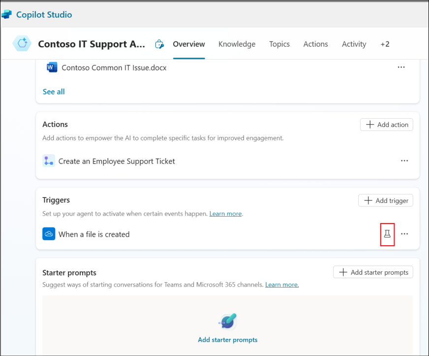

6.  최신 트리거를 선택하고 **Start testing**을 선택합니다.

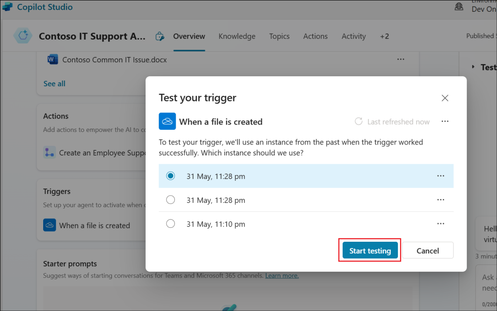

7.  흐름을 실행하고, 지원 추적기에서 데이터를 가져와 Dataverse 테이블에
    업데이트합니다.

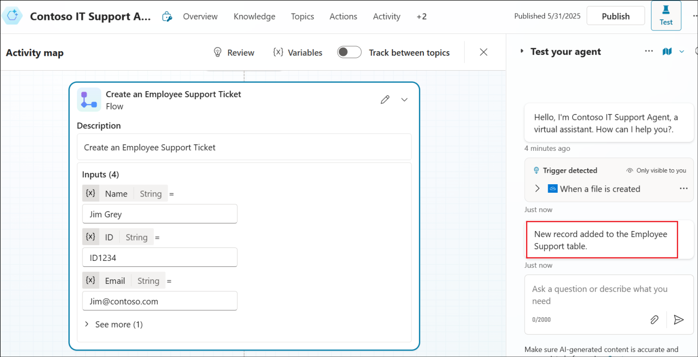

8.  이 경우 추적기에 하나의 지원 티켓 세부 정보가 있으며, 이 정보는
    Dataverse 테이블에 추가되어 사용자에 대한 지원 티켓을 생성합니다.

9.  사용자로부터 문제 관련 이메일을 수신할 경우 이메일 생성 기능이 더
    적합합니다. 테넌트 권한 제한으로 인해 이메일 구성 부분은 여기서
    수행할 수 없습니다. 권한이 있는 테넌트가 있는 경우 다음 작업을
    고려해 보세요.

## 프로덕션 환경에서 수행해야 할 작업

프로덕션 환경에서는 지원 티켓 생성이 주로 메일 기반으로 진행됩니다.

테넌트가 메일 계정 사용에 제한을 받으므로 이 작업은 이 테스트 환경에서는
수행할 수 **없습니다**. 메일을 주고받을 수 있는 테넌트가 있는 경우,
**"연습 5: Power Automate를 사용하여 지원 티켓 생성 자동화"**의 10단계
이후에 이 단계를 흐름에 추가할 수 있습니다.

이 실행에서는 이 작업을 무시하십시오. 이는 메일 생성 부분을 학습하고
이해하고, 수신 메일을 IT 지원 운영에서 중요한 역할을 하는 트리거로
설정한 후 에이전트를 테스트하기 위해 추가되었습니다.

1.  새 행 작업 추가 아래에서 (+)를 클릭하고 **Add an action**를
    선택합니다.

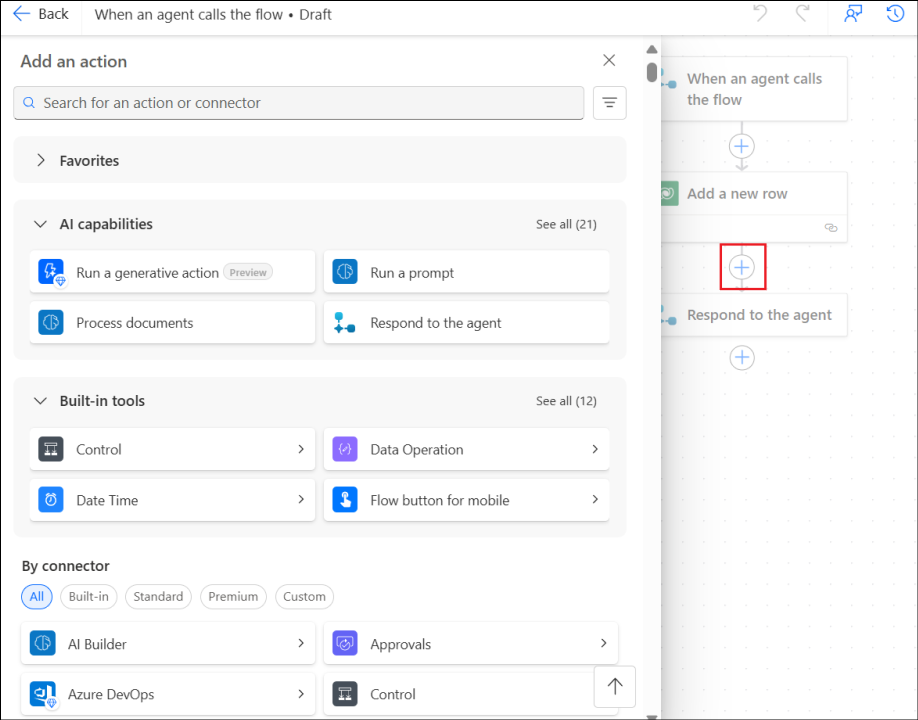

2.  작업 추가 섹션에서 검색 창에 +++ **Send an email** +++를 입력하고
    Office 365 Outlook 섹션에서 **send an email (V2)** 를 선택합니다.

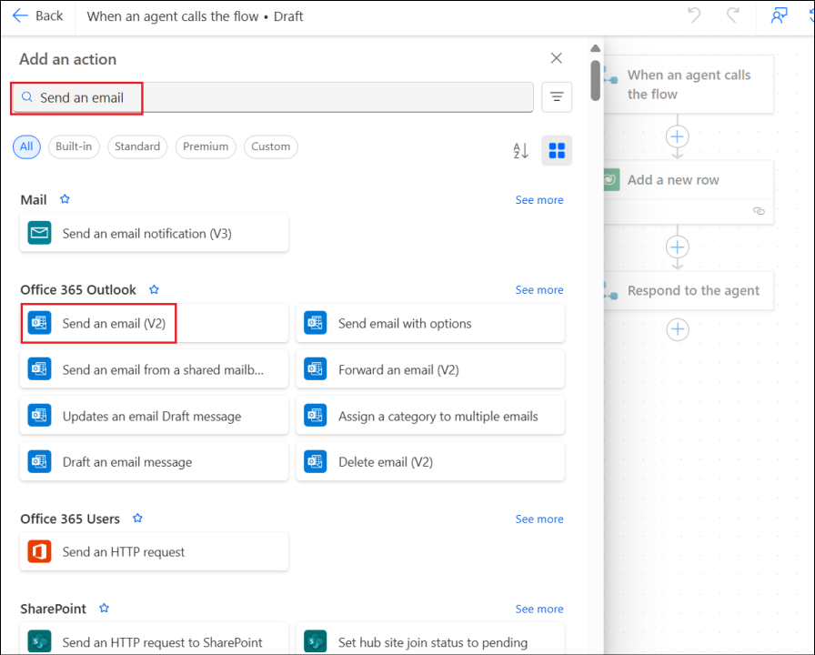

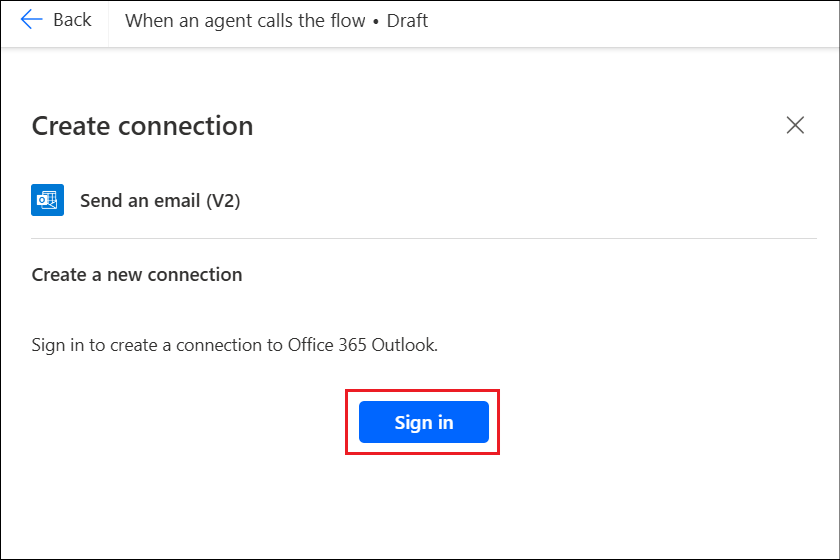

> 3\. 이메일 보내기 섹션에서 아래 정보를 해당 섹션에 입력합니다.
>
> 이름, ID, 세부 정보 자리 표시자를 동적 콘텐츠를 사용하는 변수로
> 바꿉니다.
>
> **To**
>
> 지원 엔지니어 이메일을 입력하세요(모든 이메일 ID를 사용하세요. 이 ID로
> 전송되며, 지원 티켓이 제출되면 에이전트가 해당 이메일로 메일을
> 보냅니다)
>
> **Subject**
>
> New Technical Support Ticket Raised
>
> **Body**
>
> A new technical support ticket has been raised and requires your
> attention. Please find details below:
>
> Employee Name: \< Name \>
>
> Employee ID: \< ID \>
>
> Technical Issue: \< Details \>
>
> Thank you for your prompt attention to this matter.'
>
> Best Regards

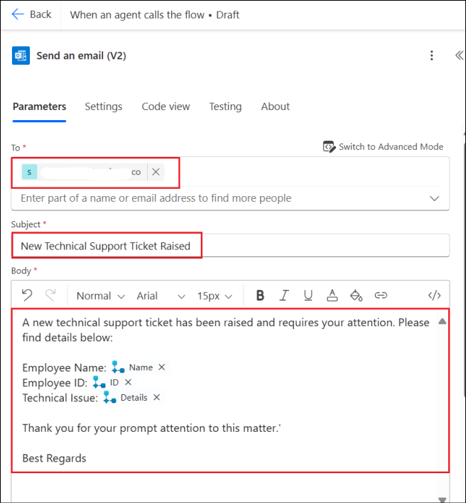

3.  왼쪽 상단 모서리에서 흐름 이름을 +++ **Create an Employee Support
    Ticket** +++로 변경합니다.

4.  흐름을 저장하고 게시합니다.

5.  에이전트의 개요 페이지로 이동하여 아래로 스크롤하여 **+ Add
    trigger**를 클릭합니다.

6.  그런 다음 트리거 추가 창에서 **When a new email arrives
    (V3)**트리거를 선택합니다.

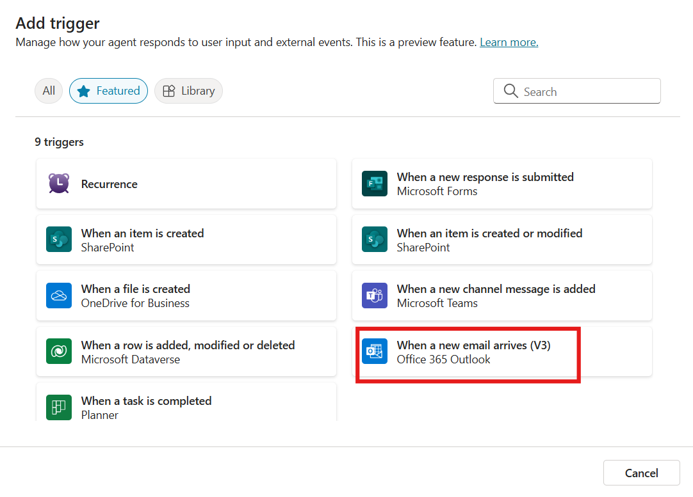

7.  Copilot과 Outlook이 성공적으로 연결되고 녹색 체크 표시가 나타나면
    **Next** 버튼을 클릭합니다.

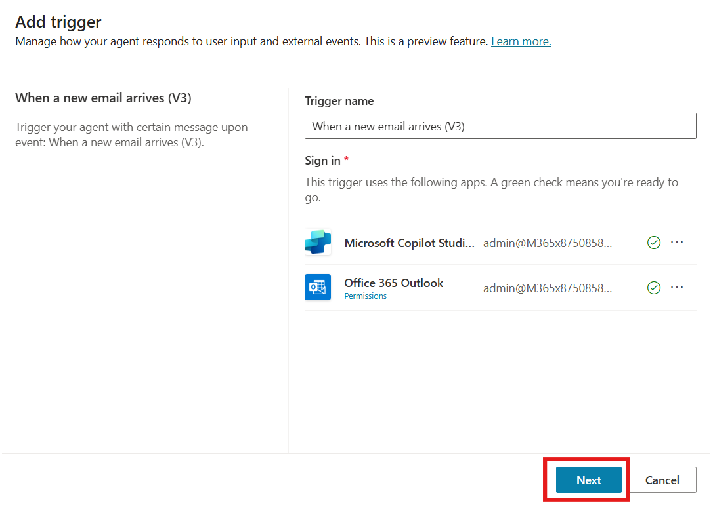

8.  Folder 필드에서 폴더 아이콘을 선택하고 받은 **Inbox** 폴더를 선택한
    다음 **Create trigger**를 선택합니다.

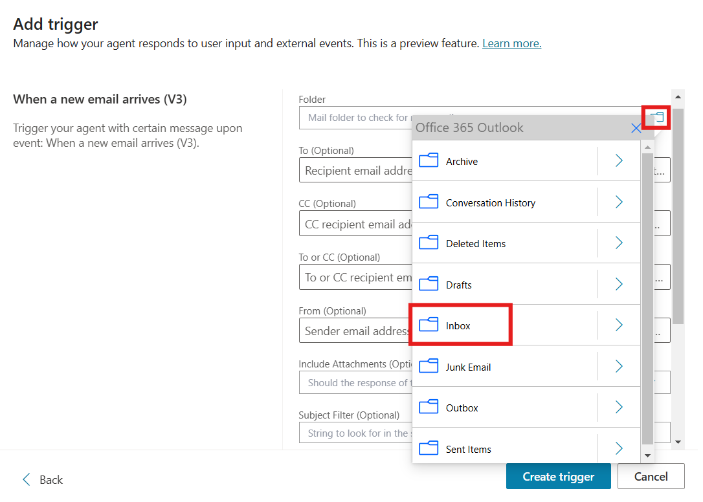

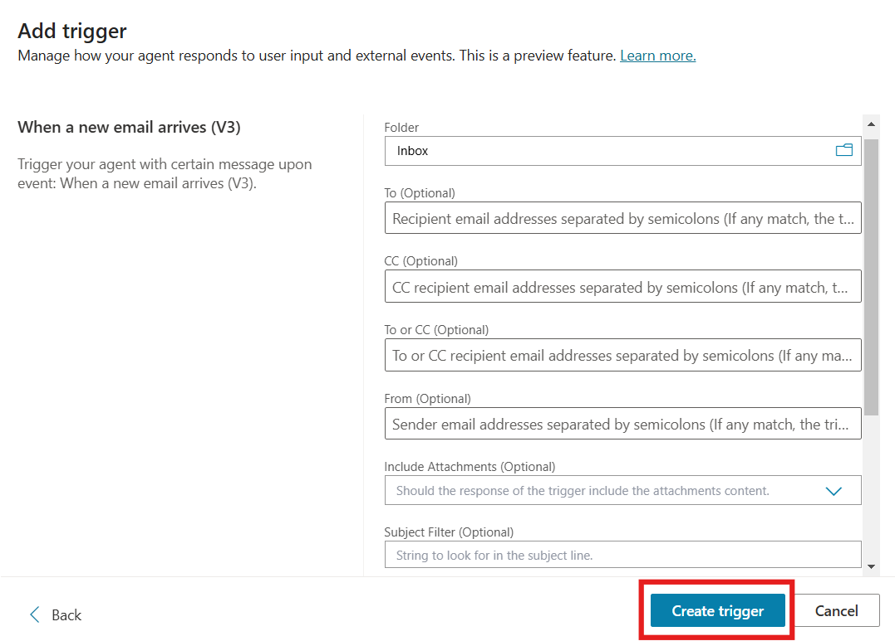

9.  **Time to test your trigger** 프롬프트를 닫습니다. 지원 담당자 개요
    페이지에서 아래로 스크롤하여 트리거 섹션에서 세 개의 점(…)을 **Edit
    in Power Automate**을 선택합니다.

10. 새 이메일이 도착하면 트리거를 마우스 오른쪽 버튼으로 클릭하고
    **Delete**를 선택합니다.

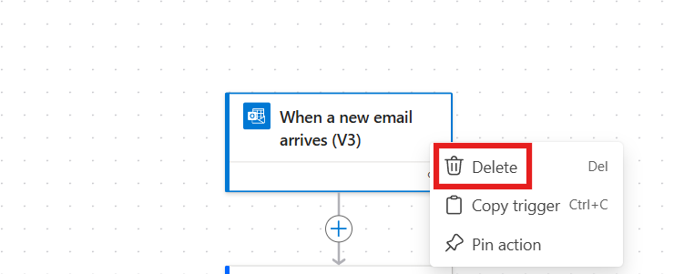

11. 그런 다음 트리거 추가를 클릭하고 +++ **When new email arrives**
    +++를 검색한 다음 **Office 365 Outlook** 섹션에서 **When a new email
    arrives** 트리거를 선택합니다.

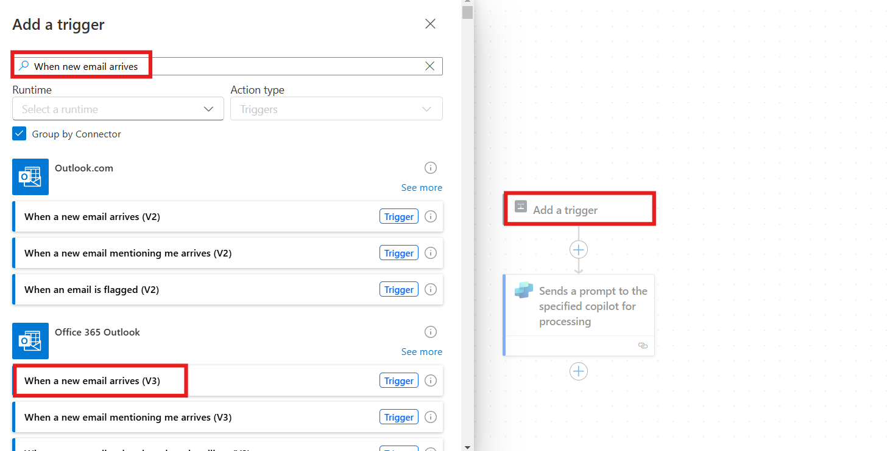

12. **Send a prompt to the specified copilot for processing**를 클릭하고
    본문/메시지 섹션에 프롬프트를 입력합니다. +++**Run Create an
    Employee Support Ticket flow and use content from Body From.**+++
    **Body** 과 **From** 을 동적 콘텐츠 변수로 바꿉니다.

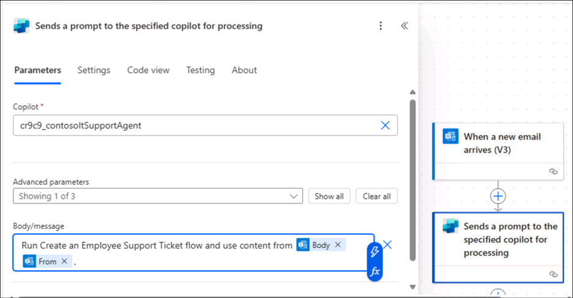

13. 흐름을 **저장하고 게시한** 후, Power Automate 창을 닫고 Copilot
    창으로 돌아갑니다.

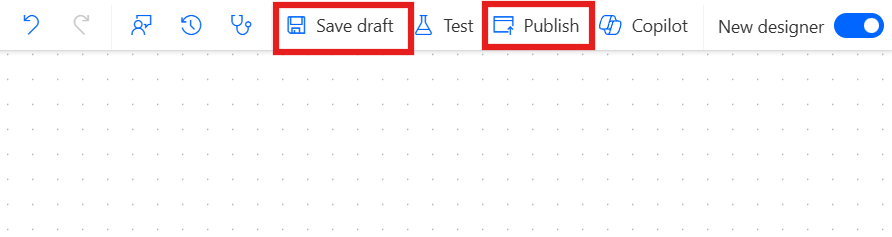

14. 개요 섹션으로 가서 오른쪽 상단 모서리에서 **Publish**를 클릭하고
    다시 **Publish**를 클릭하여 copilot를 게시합니다.

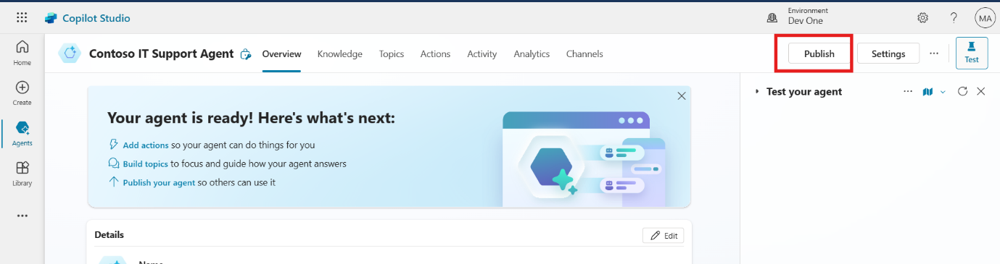

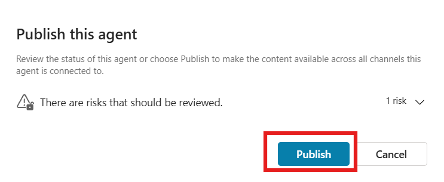

> **결론**
>
> 이 연습을 완료하면 참가자는 다음을 학습하게 됩니다:

- 기술 문제 에스컬레이션을 위한 이메일 알림을 자동화하는 기술

- 이메일 입력을 기반으로 워크플로를 자동화하기 위해 Copilot에서 트리거를
  설정하는 방법

- 이메일 콘텐츠를 Power Automate 흐름에 동적으로 매핑하는 단계

- 운영을 위해 AI 에이전트를 게시하고 완료하는 프로세스

- Outlook과 같은 커뮤니케이션 도구를 자동화된 워크플로와 연결하는 실무
  기술

**에이전트 테스트하기**

이 연습은 Contoso IT 지원 에이전트와 Power Automate 및 Outlook의 통합을
테스트하는 데 중점을 둡니다. 참가자는 에이전트가 이메일을 처리하고, 지원
티켓을 생성하고, 자동화된 워크플로를 효과적으로 트리거하는 능력을
검증합니다.

1.  에이전트 개요 페이지로 이동하여 아래로 스크롤하여 트리거의 (…)를
    클릭하고 **Edit in power automate**을 선택합니다.

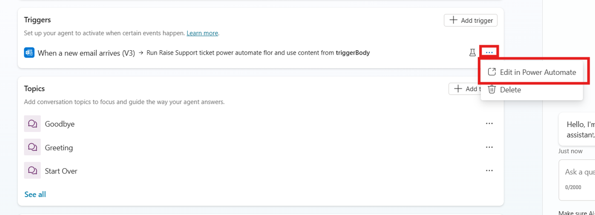

2.  Power automate 흐름으로 이동한 후 상단 바에서 **Test**  버튼을
    클릭하고 수동을 선택한 다음 다시 **Test** 를 클릭합니다.

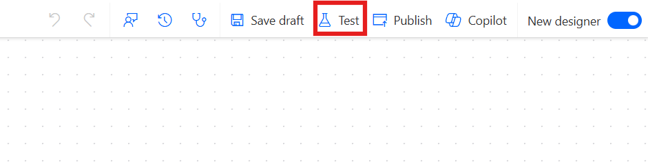

3.  다른 메일함에서 365 관리자 테넌트 메일 ID로 **이메일을 보내** 작업을
    트리거합니다. 메일에는 아래 스크린샷과 같이 문제를 설명하고 직원
    ID와 같은 세부 정보가 포함되어야 합니다. 예시 내용은 다음과
    같습니다.

> Hi Support Team,
>
> I hope this message finds you well.
>
> Iam Mark Brown, working as a Software Engineer at Contoso. My employee
> ID is CONTOSO099
>
> Issue: Monitor is completely balank and not functioning.
>
> Kindly raise a support ticket and assist in resolving this issue at
> the earlierst.
>
> Thank you for your support.
>
> Best Regards,
>
> Mark Brown

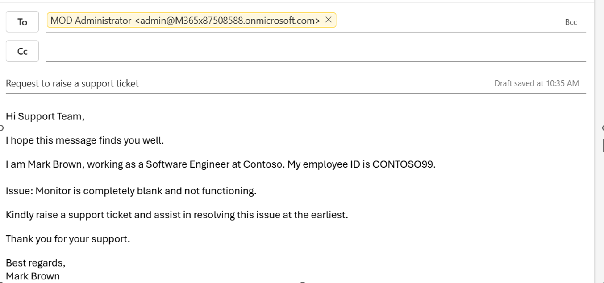

4.  Copilot 에이전트 개요 페이지로 이동하여 아래로 스크롤하여 **Test
    trigger**를 선택합니다.

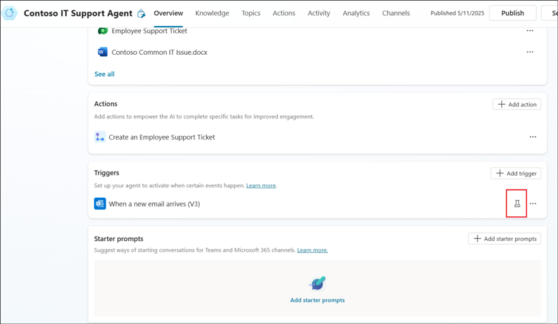

5.  **Start testing**을 클릭하면 테스트가 시작됩니다.

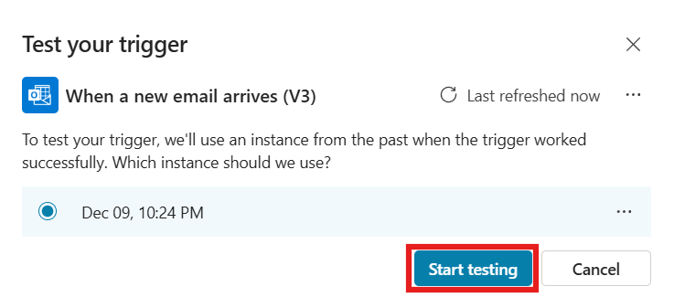

6.  테스트 섹션에서 **Connect**을 클릭하면 연결 창이 열립니다.

7.  **Connect**을 다시 클릭한 다음 **Submit**을 선택합니다.

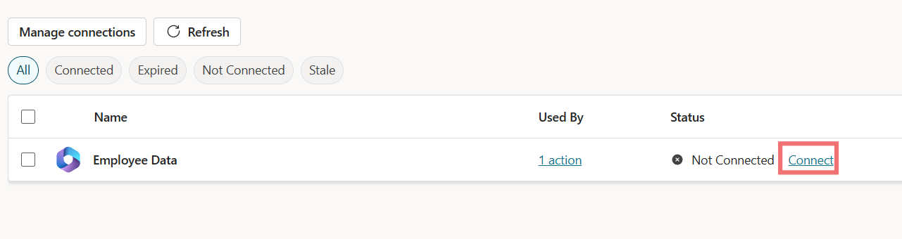

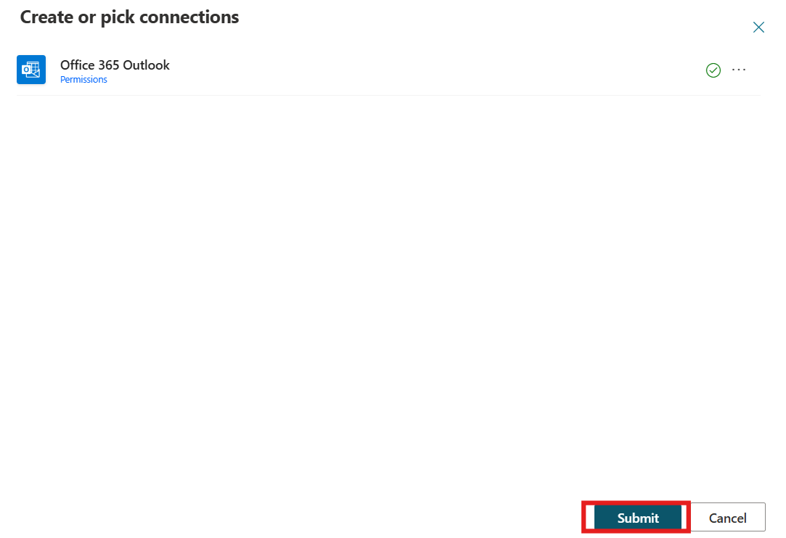

8.  Copilot 스튜디오 창으로 이동하여 **Test**를 다시 실행합니다.

9.  지원 요청이 자동으로 생성됩니다.

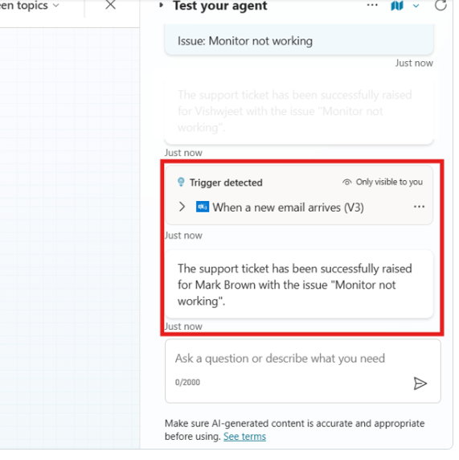

10. Power Apps로 이동하여 직원 지원 티켓 기록 표로 이동한 다음 세부
    정보를 확인합니다.

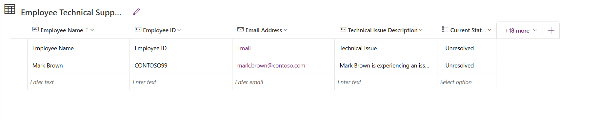

11. Power Automate Flow에서 이메일을 발송하도록 설정한 지원 메일을
    확인하세요. 이메일이 지원팀으로 자동 전송됩니다.

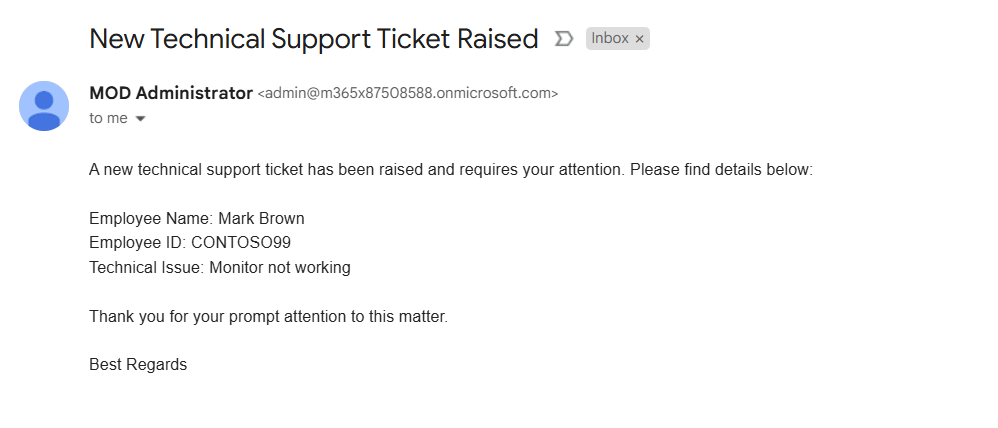

12. 테스트 창으로 이동하여 사용자 이름 +++ **Mark Brown Ticket Current
    Status** +++로 쿼리를 작성합니다. 문제 상태가 unresolved로
    표시됩니다.

13. 지원 엔지니어로서 테스트 섹션에 프롬프트를 작성하세요. +++ **I want
    to know about all Unresolved ticket** +++.

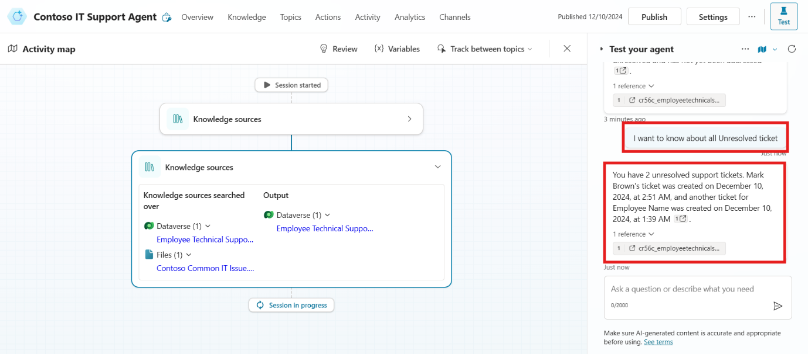

> **결론**
>
> 이 연습을 완료하면 참가자는 다음을 배울 것입니다:

- 실제 시나리오를 시뮬레이션하여 에이전트 기능을 테스트하는 방법

- Power Automate에서 이메일 트리거 워크플로 및 티켓 생성을 검증하는 단계

- Dataverse에서 생성된 레코드를 검토하고 지원팀에 알림이 전송되는지
  확인하는 방법

- 자동화 워크플로 디버깅 및 완료에 대한 실질적인 통찰력.

**랩 가이드의 최종 결론**

이 랩 가이드는 Contoso Solutions의 IT 지원 서비스 데스크에 Autonomous
Copilot Agent를 배포하는 실무 경험을 참가자들에게 제공했습니다. 단계별
연습을 통해 참가자들은 다음과 같은 역량을 갖추게 되었습니다:

1.  **Copilot Studio 설정:** 참가자들은 Copilot Studio에 로그인하고, IT
    지원 에이전트를 생성 및 구성하고, 효과적인 문제 해결 및 티켓
    자동화를 위해 생성형 AI 및 오케스트레이터와 같은 필수 설정을
    활성화하는 방법을 학습했습니다.

2.  **Power Apps 탐색:** 참가자들은 Power Apps 로그인, Dataverse 테이블
    설정, Excel에서 데이터를 가져와 지원 티켓을 효율적으로 추적하고
    관리하는 방법에 대한 실질적인 지식을 습득했습니다.

3.  **봇 기능 향상:** 이 연습은 봇에 지식 기반을 추가하고, 대화 시작 및
    대체 주제를 사용자 지정하여 사용자 상호 작용을 개선하고, 봇이 다양한
    IT 지원 시나리오를 처리할 수 있도록 하는 데 중점을 두었습니다.

4.  **IT 지원 작업 자동화:** 참가자들은 또한 Power Automate를 사용하여
    지원 티켓 생성을 자동화하는 방법을 학습하여 봇의 미해결 문제 관리
    기능을 강화하고 IT 팀 워크플로를 개선했습니다.

이 연습을 통해 참가자들은 응답 시간을 개선하고, 수동 작업량을 줄이며, IT
지원 운영의 전반적인 생산성을 향상시키는 강력한 자율 지원 시스템을
구현할 수 있었습니다. Copilot Studio, Power Apps, Dataverse의 통합은
원활한 정보 흐름을 보장하고, 일상적인 작업을 자동화하며, 지원 워크플로를
최적화하여 직원들에게 즉각적인 문제 해결 솔루션을 제공하고, 해결되지
않은 문제에 대한 티켓 관리를 자동화합니다.
