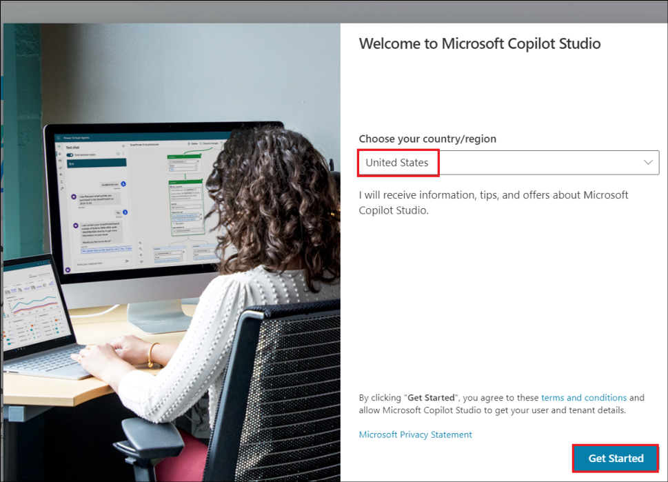
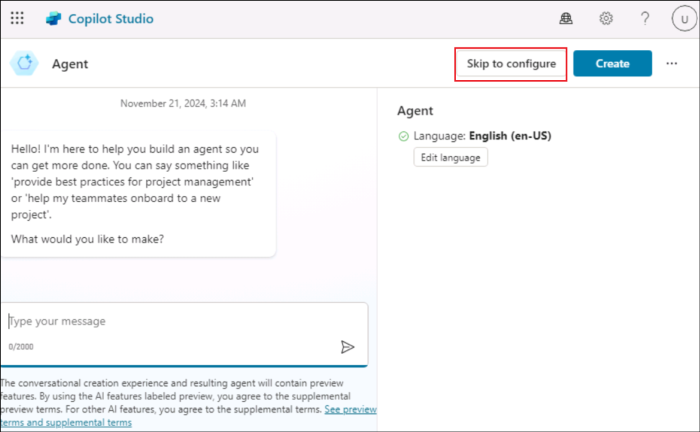
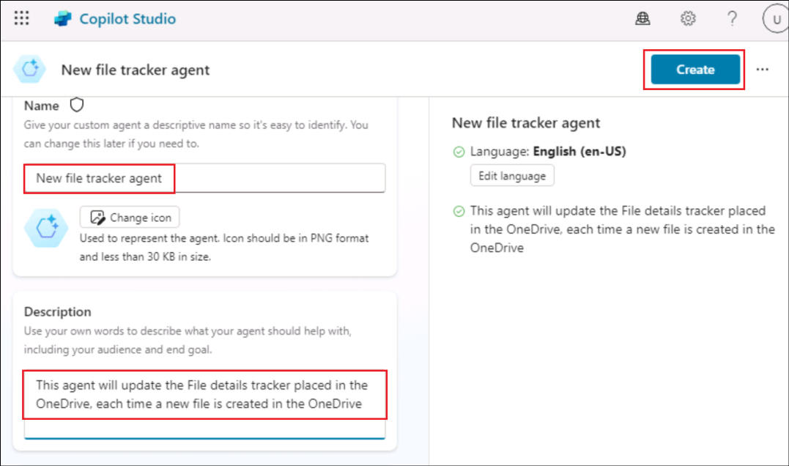
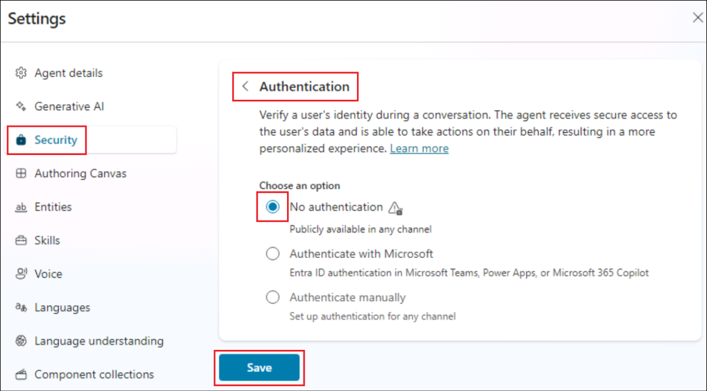

# 实验 09：构建自治代理来跟踪在 OneDrive 中创建的新文件

**介绍**

组织的 OneDrive For Business
一直在其中创建多个文件，管理员很难跟踪它们。

**目的**

构建一个自治代理，将新添加的文件的详细信息输入到 File Details
（文件详细信息） 跟踪器中。这解决了跟踪文件添加的问题，并且 File details
（文件详细信息） 跟踪器将包含所有新创建文件的详细信息。

## 练习 1：设置环境

### 任务 1：设置 OneDrive 

1.  打开浏览器并导航到+++。使用 **Resources** （资源）
    选项卡中的凭证**登录**

2.  从左侧菜单中选择 **OneDrive**。

3.  单击左上角的 **+** 符号，然后选择 **Files upload**。

4.  从 **C：\LabFiles** 中选择文件 **File details.xlsx** 并选择
    **Open**。

5.  上传文件后，窗口中会弹出一条成功消息。

6.  单击左侧菜单中的 **My files**，您可以看到新文件在那里可用。

### 任务 2：启用 Copilot Studio 试用版

1.  在新选项卡中，打开
    +++[https://copilotstudio.microsoft.com/+++](https://copilotstudio.microsoft.com/**+++)。

2.  使用实验室 VM 的 “**Resources**” 选项卡下提供的**凭据**登录。

3.  登录后，**Welcome to Microsoft Copilot Studio**
    页面，将国家/地区保留为 **United States** ，然后单击 “**Get
    Started**” 。

4.  在 **Welcome** （欢迎） 屏幕中选择 **Skip** （跳过）。

## 练习 2：构建和测试自治代理

### 任务 1：从 Copilot Studio 创建代理

1.  单击打开的 Agent creation 页面中的 **Skip to configure** 选项。

2.  在代理创建窗格中，输入以下详细信息，然后单击 **Create**。

    - 名字- +++New file tracker agent+++

    - 描述- +++This agent will update the File details tracker placed in
      the OneDrive, each time a new file is created in the OneDrive+++

### 任务 2：向代理添加触发器

1.  创建代理后，向下滚动以找到 **Trigger** 部分。选择 **+ Add
    trigger**。

2.  在 **Turn on generative orchestration to
    continue**（打开生成式编排以继续）对话框中，选择 **Turn it
    on**（打开它）。我们需要将此选项设置为 on 才能添加触发器。

3.  从 Add trigger 菜单中，选择 **When a file is created** 触发器。

4.  在 **Add trigger** （添加触发器） 屏幕中，选择 Continue （继续）。

5.  在下一个屏幕中，请注意 **Trigger name** 已填充。等待与 **Microsoft
    Copilot Studio** 和 **OneDrive for Business**
    建立**连接**（每个连接器都有一个绿色勾号）。

然后，单击 **Next**。

6.  选择以下详细信息。

    - **文件夹**– Root

    - **包括子文件夹**– Yes

将其他字段保留为默认字段，然后选择 **Create trigger**（创建触发器）。

7.  创建触发器后，将显示 **Time to test your trigger**
    消息。**关闭**它。我们将稍微调整触发器的基本流程以实现功能，然后对其进行测试。

### 任务 3：向触发器添加逻辑

1.  在 **New file track agent** （新建文件跟踪代理）
    页面中，向下滚动到触发器部分。

2.  单击触发器 **When a file is created** （创建文件时） 上的 3
    个点，然后选择 **Edit in Power Automate**（在 Power Automate
    中编辑）。

3.  选择 **+** 图标 **When the file is created** 和 **Sends a prompt
    action** ，然后选择 **Add an action**。

4.  搜索 +++add a row+++，然后选择 **Add a row into the table**。

5.  为每行选择以下值，然后单击 **Save** 。

|              |                              |
|--------------|------------------------------|
| 财产         | 价值                         |
| 位置         | OneDrive for Business        |
| 文档库       | OneDrive                     |
| 文件         | File details.xlsx            |
| 桌子         | Table1                       |
| 日期时间格式 | 序号                         |
| 文件ID       | 选择变量 **File identifier** |
| 文件 名      | 选择变量 **File name**       |
| 文件 路径    | 选择变量 **File path**       |

>

6.  该流现在将类似于以下屏幕截图中的流。

7.  单击 **New designer 切换**。

8.  选择 **Save draft** （保存草稿）。

9.  选择 **Publish** （发布） 以发布流程

### 任务 4：发布触发器

1.  返回 Copilot Studio，选择 **Settings**。

2.  选择 **Generative AI -\> Using generative AI in
    conversations**（在对话中使用生成式 AI）。如果尚未选择，请选择
    **Generative** （生成），然后单击 **Save** （保存）。

3.  选择 **Security -\> Authentication -\> No authentication**，然后单击
    **Save**。

4.  在确认对话框中选择 **Save**。

5.  关闭 Settings （设置） 窗格。

6.  现在，选择 **Publish** （发布） 以发布代理。

7.  在确认对话框中选择 **Publish**。

### 任务 5：测试触发器

1.  在浏览器中导航回 **OneDrive**。点击 + 并选择 **Word document**。

2.  为文档**命名**，然后选择 **Create**。

3.  单击 **Close** 关闭隐私选项。

4.  以类似方式添加更多文件。

5.  现在，从 OneDrive **打开 File details.xlsx**
    并观察所创建文件的详细信息是否已添加到跟踪器中。**注意**：根据需要使用
    Resources （资源） 选项卡中的凭证登录。

6.  在 OneDrive
    中创建文件时，将调用触发器，该触发器反过来会在**添加文件时**执行流并更新跟踪器。

7.  您还可以在 Copilot Studio 的 Activity （活动）
    选项卡中查看自治代理的详细信息。

**总结**

在本实验中，我们学习了如何从 Copilot Studio 创建、发布和测试自主代理。

