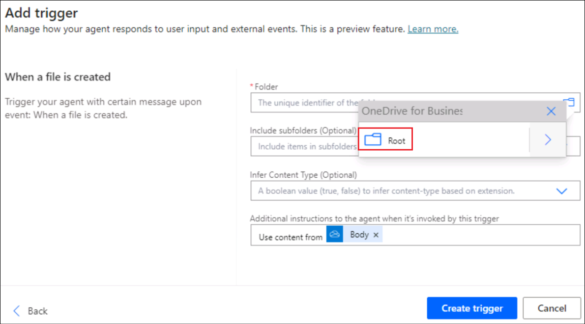

# Lab 09: Creare un agente autonomo per tenere traccia dei nuovi file creati in OneDrive

**Introduzione**

OneDrive For Business di un'organizzazione ha ottenuto più file creati
al suo interno ed è diventato difficile per l'amministratore tenerne
traccia.

**Obiettivo**

Crea un agente autonomo per inserire i dettagli del file appena aggiunto
nel tracker Dettagli file. Questo risolve il problema del tracciamento
delle aggiunte di file e il tracker dei dettagli del file avrà i
dettagli di tutti i file appena creati.

## Esercizio 1: Configurare l'ambiente

### Attività 1: Configurare OneDrive

1.  Apri un browser e vai a +++[https://office.com+++](). **Sign in**
    utilizzando le credenziali della scheda **Resources**.

2.  Seleziona **OneDrive** dal menu a sinistra.

3.  Fare clic sul simbolo**+** in alto a sinistra e selezionare **Files
    upload**.

4.  Seleziona il file **File details.xlsx** da **C:\LabFiles** e
    seleziona **Open**.

5.  Una volta caricato il file, nella finestra viene visualizzato un
    messaggio di esito positivo.

6.  Fai clic su **My** **files** dal menu a sinistra e puoi vedere che
    il nuovo file è disponibile lì.

### Attività 2: Abilitare la versione di prova di Copilot Studio

1.  In una nuova scheda, apri +++[https://copilotstudio.microsoft.com/+++]

2.  Accedere con le **Credentials** fornite nella scheda **Resources**
    della lab VM.

3.  Una volta effettuato l'accesso, la pagina **Welcome to Microsoft
    Copilot Studio**, lascia il paese come **United States** e fai clic
    su **Get started.**

4.  Seleziona **Skip** nella schermata di **Welcome**.

## 

## Esercizio 2: Costruire e testare un agente autonomo

### Attività 1: Creare un agente da Copilot Studio

1.  Fare clic sull' opzione **Skip to configure** nella pagina di
    creazione dell'agente che si apre.

2.  Nel riquadro di creazione dell'agente, inserisci i dettagli seguenti
    e fai clic su **Create**.

    - **Name** - +++New File tracker agent+++

    - **Description** - +++This agent will update the File details
      tracker placed in the OneDrive, each time a new file is created in
      the OneDrive+++

### Attività 2: Aggiungere il trigger all'agente

1.  Una volta creato l'agente, scorri verso il basso per trovare la
    sezione **Trigger**. Seleziona **+ Add trigger.**

2.  Nella finestra di dialogo **Turn on generative orchestration to
    continue**, selezionare **Turn it.** Abbiamo bisogno che questa
    opzione sia impostata su on per aggiungere un trigger.

3.  Dal menu Aggiungi trigger, selezionare **When a file is created.**

4.  Nella schermata **Add trigger**,seleziona **Continue**.

5.  Nella schermata successiva, si noti che il **Trigger name** è
    popolato. Attendere fino a quando non vengono stabilite le
    **connections** a **Microsoft Copilot Studio** e **OneDrive for
    Business** (viene visualizzato un segno di spunta verde per ciascuno
    di questi connettori).

Quindi, fai clic su **Next.**.

6.  Seleziona i dettagli seguenti.

    - **Folder** – **Root**

    - **Include subfolders** – **Yes**

Lascia gli altri campi come predefiniti e seleziona **Create trigger**.

7.  Una volta creato il trigger, viene visualizzato il messaggio **Time
    to test your trigger**. **Close it**. Modificheremo un po' il flusso
    di base del trigger per ottenere la funzionalità implementata e poi
    lo testeremo.

> 

### 

### Attività 3: Aggiungere logica al trigger

1.  Nella pagina di **New file track agent**, scorrere verso il basso
    fino alla sezione trigger.

2.  Fare clic sui 3 punti contro il trigger **When a file is created** e
    selezionare **Edit in Power Automate**.

3.  Seleziona l'icona **+** tra **When the file is created** e **Sends a
    prompt action** e seleziona **Add an action**.

4.  Cerca +++add a row +++ e seleziona **Add a row into the table**.

5.  Seleziona i valori sottostanti per ogni riga e fai clic su **Save**.

|                  |                                         |
|------------------|-----------------------------------------|
| Property         | Value                                   |
| Location         | OneDrive for Business                   |
| Document Library | OneDrive                                |
| File             | File details.xlsx                       |
| Table            | Tabella 1                               |
| Date Time Format | Serial Number                           |
| File ID          | Select the variable **File identifier** |
| File Name        | Select the variable **File Name**       |
| File Path        | Select the variable **File Path**       |

> 
>
> 

6.  Il flusso sarà ora simile a quello nello screenshot qui sotto.

7.  Fare clic sull **New designer toggle.**

8.  Seleziona **Save draft**.

9.  Seleziona **Publish** per pubblicare il flusso

### Attività 4: Pubblicare il trigger

1.  Torna a Copilot Studio, seleziona **Settings**.

2.  Seleziona **Generative AI** -\> **Using generative AI in
    conversations**. Se non è già selezionato, selezionare
    **Generative** e quindi fare clic su **Save**.

3.  Seleziona **Security** -\> **Authentication**-\>**No
    authentication** e quindi fai clic su **Save**.

4.  Seleziona **Save** nella finestra di dialogo di conferma.

5.  Chiudere il riquadro Impostazioni.

6.  A questo punto, selezionare **Publish** per pubblicare l'agente.

7.  Seleziona **Publish** nella finestra di dialogo di conferma.

### Attività 5: Testare il trigger

1.  Torna a **OneDrive** nel browser. Fare clic su **+** e selezionare
    **Word document.**

2.  Assegna un **name** al documento e seleziona **Create**.

3.  Fare clic su **Close** per chiudere l'opzione privacy.

4.  Aggiungi alcuni altri file in modo simile.

5.  Ora Open il **File** **details.xlsx** File da OneDrive e osserva che
    i dettagli dei file creati vengono aggiunti al tracker.

> **Nota**: Accedi utilizzando le tue credenziali dalla scheda Risorse
> come richiesto.

6.  Quando il file viene creato in OneDrive, viene richiamato il trigger
    che a sua volta esegue il flusso **When a file is added** e aggiorna
    il tracker.

7.  Puoi anche controllare i dettagli dell'agente autonomo nella scheda
    Attività in Copilot Studio.

**Sommario**

In questo laboratorio, abbiamo imparato a creare, pubblicare e testare
un agente autonomo da Copilot Studio.
