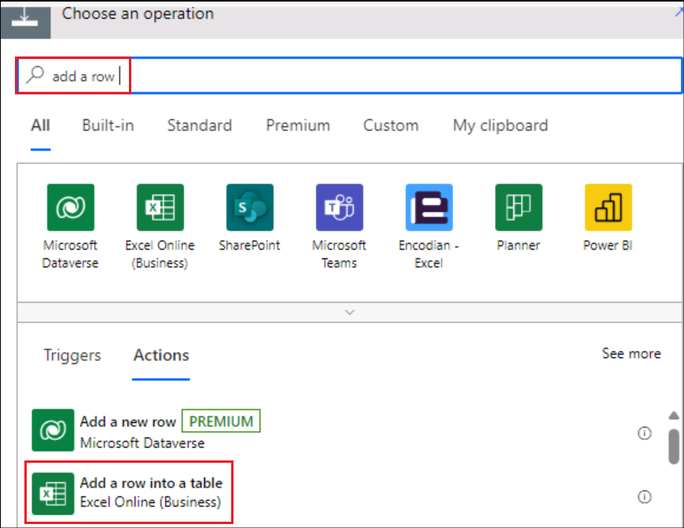
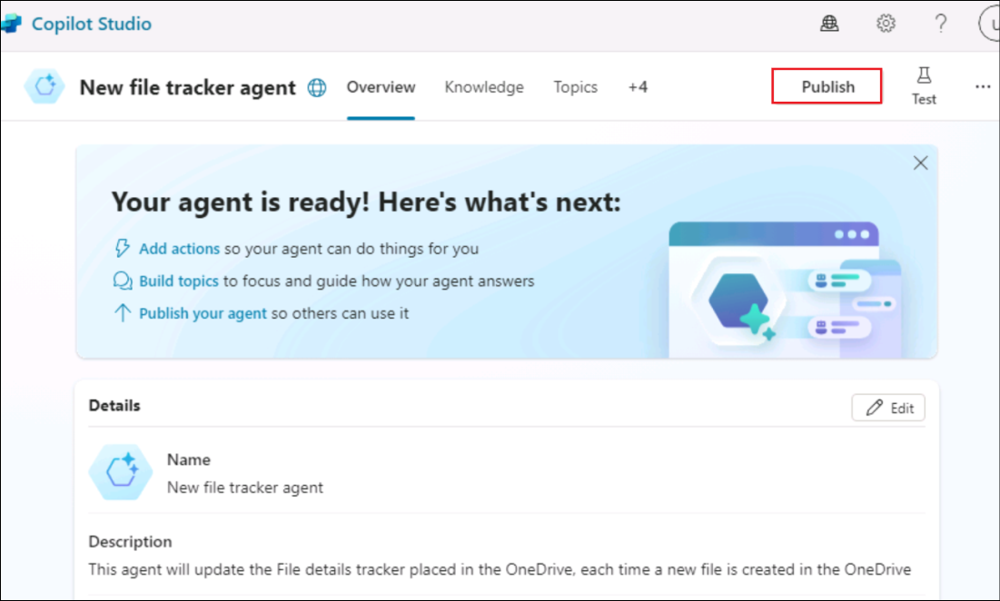

# Lab 09: Build an autonomous agent to track new files created in OneDrive

**Introduction**

OneDrive For Business of an organization has been getting multiple files
created in it and it has become difficult for the admin to keep track of
them.

**Objective**

Build an autonomous agent to enter the details of the newly added file
to the File Details tracker. This resolves the issue of tracking the
file additions and the File details tracker will have the details of all
the newly created files.

## Exercise 1: Set up the environment

### Task 1: Setup OneDrive

1.  Open a browser and navigate to +++**https://office.com**+++. **Sign
    in** using the credentials from the **Resources** tab

    

2.  Select **OneDrive** from the left menu.

    

3.  Click on the **+** symbol on the top left and select **Files
    upload**.

    

4.  Select the file **File details.xlsx** from **C:\LabFiles** and select
    **Open**.

    

5.  Once the file is uploaded, a success message pops up in the window.

    

6.  Click on **My files** from the left menu and you can see that the
    new file is available there.

    

### Task 2 : Create a development environment

1.  Login to +++https://admin.powerplatform.microsoft.com+++ using
    you tenant details from the Resources tab.

2.  Select **Environments** from the left navigation pane and click on
    **+ New.**

    

3.  In the New environment window that opens, fill in the below details
    and click on **Next**.

    |	|	|
    |:----|:-----|
    | +++Property+++	| +++Value+++	|
    | Name	| +++Dev env+++	|
    | Region	| United States - Default	|
    | Type	| Developer	|

    

    

4.  In the **Add Dataverse** window, accept the defaults and click on
    **Save**.

    

5.  The newly created environment gets listed in the admin center with
    its status in the Environments pane.

6.  Once the **status** is **ready**, the environment is ready to use.
    We will use this environment in the upcoming exercises.

    

### Task 3: Enable Copilot Studio trial

1.  In a new tab, open +++**https://copilotstudio.microsoft.com/**+++.

2.  Sign in with the **Credentials** provided under the **Resources**
    tab of your Lab VM.

    

3.  Once logged in, the **Welcome to Microsoft Copilot Studio** page,
    leave the country as **United States** and click on **Get Started**.

    

4.  Select **Skip** in the **Welcome** screen.

    

## Exercise 2: Build and test an autonomous agent

### Task 1: Create an agent from Copilot Studio

1.  Click on the **Skip to configure** option in the Agent creation page
    that opens up.

    

2.  In the agent creation pane, enter the below details and click on
    **Create**.

    - **Name** - +++New file tracker agent+++

    - **Description** - +++This agent will update the File details tracker
    placed in the OneDrive, each time a new file is created in the
    OneDrive+++

    

### Task 2: Add trigger to the agent

1.  Once the agent is created, scroll down to find the **Trigger**
    section. Select **+ Add trigger.**

    

2.  In the dialog **Turn on generative orchestration to continue**,
    select **Turn it on**. We need to have this option set to on in
    order to add a trigger.

    

3.  From the Add trigger menu, select **When a file is created**
    trigger.

    

4.  In the **Add trigger** screen, select Continue.

    

5.  In the next screen, notice that the **Trigger name** is populated.
    Wait until the **connections** to the **Microsoft Copilot Studio**
    and **OneDrive for Business** are established (You get a green tick
    against each of these connectors).

    Then, click on **Next**.

    

6.  Select the below details.

    - **Folder** – Root

    - **Include subfolders** – Yes

    Leave the other fields as default and select **Create trigger**.

    

    

7.  Once the trigger is created, **Time to test your trigger** message
    is displayed. **Close** it. We will tweak the basic flow of the
    trigger a bit to get out functionality implemented and then will
    test it.

    

    

### Task 3: Add logic to the trigger

1.  In the **New file track agent** page, scroll down to the trigger
    section.

2.  Click on the 3 dots against the trigger **When a file is created**,
    and select **Edit in Power Automate**.

    

3.  Select the **+** icon between **When the file is created** and
    **Sends a prompt action** and select **Add an action**.

    

4.  Search for +++add a row+++ and select **Add a row into the table**.

    

5.  Select the below values for each row and click on **Save**.

    |	|	|
    |:----|:-----|
    | +++Property+++	| +++Value+++	|
    | Location	| OneDrive for Business	|
    | Document Library	| OneDrive	|
    | File	| File details.xlsx	|
    | Table	| Table1	|
    | Date Time Format	| Serial Number	|
    | File ID	| Select the variable **File identifier**	|
    | File Name	| Select the variable  **File name**	|
    | File Path	| Select the variable **File path**	|

	
    

    

6.  The flow will now look like the one in the below screenshot.

    

7.  Save the flow and **publish** it.

### Task 4: Publish the trigger

1.  Back in the Copilot Studio, select **Settings**.

    

2.  Select **Generative AI** -> **Using generative AI in conversations**. Select **Generative (preview)**  
    and then click on **Save**.

    
    
3.  Select **Security** -\> **Authentication** -\> **No authentication**
    and then click on **Save**.

    

4.  Select **Save** in the confirmation dialog.

    

5.  Now, select **Publish** to publish the agent.

    

6.  Select **Publish** in the confirmation dialog.

    

### Task 5: Test the trigger

1.  Navigate back to the **OneDrive** in the browser. Click on **+** and
    select **Word document.**

    

2.  Give a **name** to the document and select **Create**.

    

3.  Click on **Close** to close the privacy option.

    

4.  Add few more files similarly.

5.  Now, **open** the **File details.xlsx** from OneDrive and observe that the
    details of the files created are added to the tracker.
    **Note**: Login using your credentials from the Resources tab as requried. 

    

7.  When the file is created in OneDrive, the trigger is invoked which
    in turn executes the flow **When a file is added** and updates the
    tracker.

8.  You can also check the details of the autonomous agent in the
    Activity tab in Copilot Studio.

**Summary**

In this lab, we have learnt to create, publish and test an autonomous
agent from Copilot Studio.

