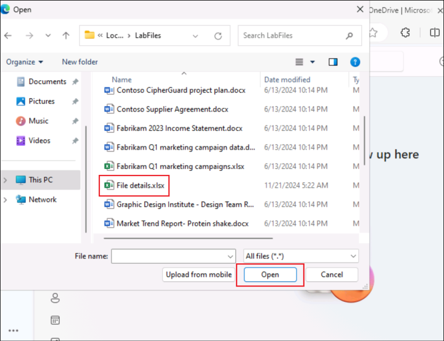
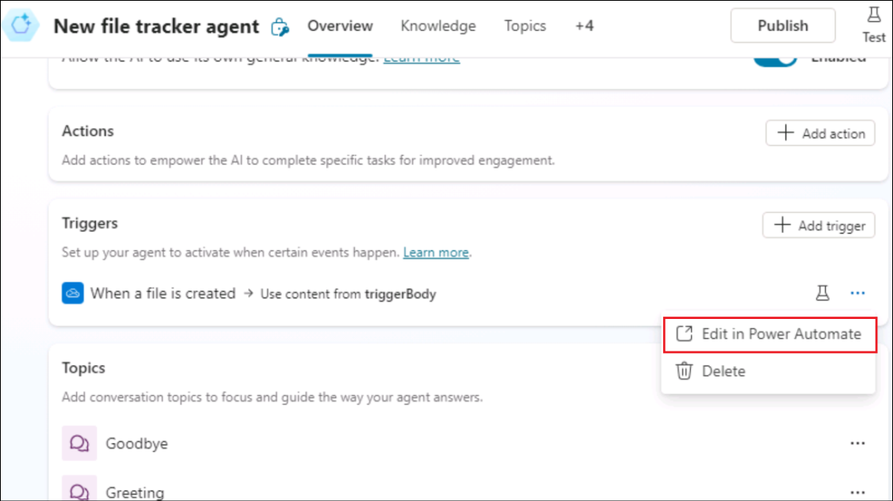

# 실습 09: OneDrive에서 생성된 새 파일을 추적하는 자율 에이전트 빌드하기

**소개**

조직의 Business용 OneDrive에서 여러 파일이 생성되어 관리자가 파일을
추적하기가 어려워졌습니다.

**목표**

새로 추가된 파일의 세부 정보를 파일 세부 정보 추적기에 입력하는 자율
에이전트를 빌드합니다. 이렇게 하면 파일 추가 추적 문제가 해결되고 파일
세부 정보 추적기에 새로 생성된 모든 파일의 세부 정보가 표시됩니다.

## 연습 1: 환경을 설정하기

### 작업1: OneDrive를 설정하기

1.  브라우저를 열고 +++로 이동하세요. **Resources** 탭에서 자격 증명을
    사용하여 **Sign in** 하세요

2.  왼쪽 메뉴에서 **OneDrive**를 선택하세요.

3.  왼쪽 상단의 **+** 기호를 클릭하고**Files upload**를 선택하세요.

4.  **C:\LabFiles**에서 **File details.xlsx** 파일을 선택하고**Open**를
    선택하세요.

5.  파일이 업로드되면 창에 성공 메시지가 나타납니다.

6.  왼쪽 메뉴에서 **My files**을 클릭하면 새 파일을 사용할 수 있음을
    확인할 수 있습니다.

### 작업 2: Copilot Studio 시험을 활성화하기

1.  새 탭에서
    +++[https://copilotstudio.microsoft.com/+++](https://copilotstudio.microsoft.com/**+++)를
    여세요

2.  실습 VM에서 **Resources** 탭에 제공된 **Credentials** 로
    로그인하세요.

3.  로그인한 후 **Welcome to Microsoft Copilot Studio**페이지에서 국가를
    **United States**로 그대로 두고 **Get Started**을 클릭하세요.

4.  **Welcome** 화면에서 **Skip** 를 선택하세요.

## 연습 2: 자율 에이전트 구축하고 테스트하기

### 작업 1: Copilot Studio에서 에이전트를 생성하기

1.  열리는 에이전트 생성 페이지에서 **Skip to configure** 옵션을
    클릭하세요.

2.  에이전트 생성 창에서 아래 세부 정보를 입력하고 **Create**을
    클릭하세요.

    - **Name** - +++New file tracker agent+++

    - **Description** - +++This agent will update the File details
      tracker placed in the OneDrive, each time a new file is created in
      the OneDrive+++

### 작업 2: 에이전트에 트리거를 추가하기

1.  에이전트가 생성되면 아래로 스크롤하여 **Trigger **섹션을 찾으세요.
    **+ Add trigger**를 선택하세요.

2.  **Turn on generative orchestration to continue** 대화상자에서**Turn
    it on**를 선택하세요. 트리거를 추가하려면 이 옵션을 켜기로 설정해야
    합니다.

3.  Add trigger 메뉴에서 **When a file is created** 트리거를 선택하세요.

4.  **Add trigger** 화면에Continue를 선택하세요.

5.  다음 화면에서 **Trigger name** 이 채워져 있는지 확인하세요.
    **Microsoft Copilot Studio** 및 **OneDrive for Business** 대한
    **connections** 이 설정될 때까지 기다리세요 (이러한 각 커넥터에 대해
    녹색 체크 표시가 표시됨).

**Next**를 클릭하세요.

6.  다음 세부 정보를 선택하세요.

    - **Folder** – Root

    - **Include subfolders** – Yes

다른 필드는 기본값으로 두고 **Create trigger**를 선택하세요.

7.  트리거가 생성해지면 **Time to test your trigger**메시지가
    표시됩니다. **Close**. 구현된 기능을 가져오기 위해 트리거의 기본
    흐름을 약간 조정한 다음 테스트할 것입니다.

### 작업 3: 트리거에 로직을 추가하기

1.  **New file track agent** 페이지에서 트리거 섹션으로 스크롤하세요.

2.  **When a file is created**트리거에 대한 점 3개를 클릭하고 **Edit in
    Power Automate**을 선택하세요

3.  **When the file is created** 와 **Sends a prompt action** 사이의
    **+** 아이콘을 선택하고 **Add an action**를 선택하세요.

4.  +++add a row+++를 찾고**Add a row into the table**를 선택하세요.

5.  각 행에 대해 아래 값을 선택하고 **Save**을 클릭하세요.

|                  |                                       |
|------------------|---------------------------------------|
| Property         | Value                                 |
| Location         | OneDrive for Business                 |
| Document Library | OneDrive                              |
| File             | File details.xlsx                     |
| Table            | Table1                                |
| Date Time Format | Serial Number                         |
| File ID          |  **File identifier**변수를 선택하세요 |
| File Name        | **File name**변수를 선택하세요        |
| File Path        | **File path**변수를 선택하세요        |

>

6.  이제 흐름이 아래 스크린샷과 같이 표시됩니다.

7.  **New designer toggle**를 클릭하세요.

8.  **Save draft**를 선택하세요.

9.  플로우를 게시하기 위해 **Publish**를 선택하세요

### 작업 4: 트리거를 게시하기

1.  Copilot Studio로 돌아가서 **Settings**을 선택하세요.

2.  **Generative AI** -\> **Using generative AI in conversations**를
    선택하세요. 아직 선택하지 않은 경우 **Generative**를 선택한
    후**Save**를 클릭하세요.

3.  **Security** -\> **Authentication** -\> **No authentication**를
    선택하고**Save**를 클릭하세요.

4.  확인 대화 상자에서 **Save **을 선택하세요.

5.  Settings창을 닫으세요.

6.  이제 에이전트를 게시하기 위해 **Publish **를 선택하세요.

7.  확인 대화 상자에서 **Publish**를 선택하세요.

### 작업 5: 트리거를 테스트하기

1.  브라우저에서 **OneDrive**로 이동하세요. **+**를 클릭하고 **Word
    document**를 선택하세요**.**

2.  문서에 **name**을 지정하고 **Create**를 선택하세요.

3.  개인 정보 보호 옵션을 닫기 위해 **Close**를 클릭하세요.

4.  이와 비슷하게 몇 개의 파일을 더 추가하세요.

5.  이제 OneDrive**에서 File details.xlsx 열고** 생성된 파일의 세부
    정보가 추적기에 추가되었는지 확인하세요. **참고**: 필요에 따라
    Resources 탭에서 자격 증명을 사용하여 로그인하세요.

6.  OneDrive에서 파일이 생성해지면 트리거가 호출되어 **파일이 추가**되고
    추적기가 업데이트될 때 흐름을 실행하세요.

7.  Copilot Studio의 활동 탭에서 자율 에이전트의 세부 정보를 확인할 수도
    있습니다.

**요약**

이 실습에서는 Copilot Studio에서 자율 에이전트를 생성, 게시 및
테스트하는 방법을 배웠습니다.
