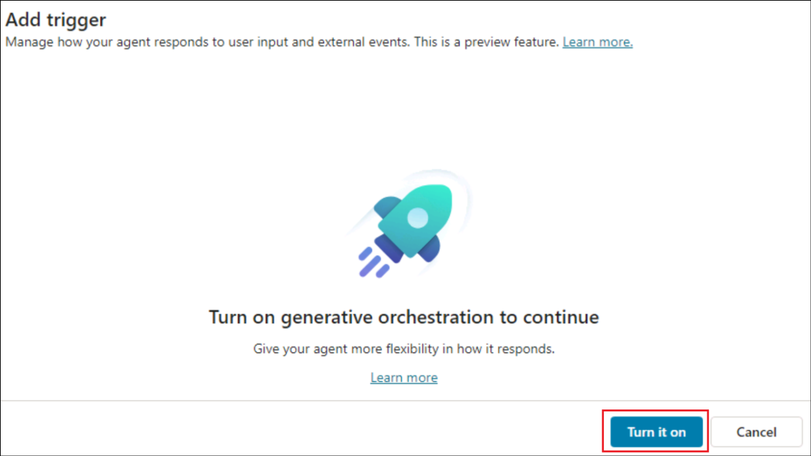
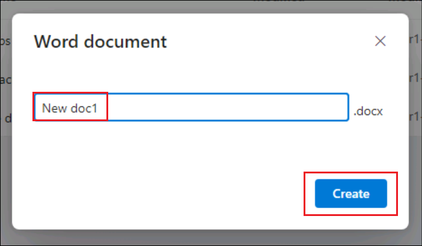

# Lab 09: Erstellen eines autonomen Agents zum Nachverfolgen neuer Dateien, die in OneDrive erstellt wurden

**Einleitung**

OneDrive For Business einer Organisation hat mehrere Dateien darin
erstellt, und es ist für den Administrator schwierig geworden, den
Überblick zu behalten.

**Ziel**

Erstellen Sie einen autonomen Agenten, um die Details der neu
hinzugefügten Datei in den Dateidetails-Tracker einzugeben. Dadurch wird
das Problem der Nachverfolgung der hinzugefügten Dateien behoben, und
der Dateidetail-Tracker enthält die Details aller neu erstellten
Dateien.

## Übung 1: Einrichten der Umgebung

### Aufgabe 1: Einrichten von OneDrive

1.  Öffnen Sie einen Browser, und navigieren Sie zu +++. **Melden Sie
    sich** mit den Anmeldeinformationen auf der Registerkarte
    **Resources** an.

2.  Wählen Sie **OneDrive** aus dem linken Menü aus.

3.  Klicken Sie auf das +-Symbol oben links und wählen Sie **Files
    upload**.

4.  Wählen Sie die Datei **details.xlsx** aus **C:\LabFiles aus und**
    wählen Sie **Open**.

5.  Sobald die Datei hochgeladen wurde, wird eine Erfolgsmeldung im
    Fenster angezeigt.

6.  Klicken Sie im linken Menü auf **My files** und Sie können sehen,
    dass die neue Datei dort verfügbar ist.

### Aufgabe 2: Aktivieren der Copilot Studio-Testversion

1.  Öffnen Sie in einem neuen Tab
    +++[https://copilotstudio.microsoft.com/+++](https://copilotstudio.microsoft.com/**+++).

2.  Melden Sie sich mit den **Anmeldeinformationen** an, die auf der
    Registerkarte **Resources** Ihrer Lab-VM bereitgestellt werden.

3.  Sobald Sie angemeldet sind, auf der Seite **Willkommen bei Microsoft
    Copilot Studio**, verlassen Sie das Land als **United States** und
    klicken Sie auf **Get started**.

4.  Wählen Sie auf dem **Begrüßungsbildschirm** die Option Skip aus.

## Übung 2: Erstellen und Testen eines autonomen Agents

### Aufgabe 1: Erstellen eines Agenten in Copilot Studio

1.  Klicken Sie auf die Option **Skip to configure** auf der sich
    öffnenden Seite zur Agentenerstellung.

2.  Geben Sie im Bereich zur Agentenerstellung die folgenden Details ein
    und klicken Sie auf **Create**.

    - **Name** - +++New file tracker agent+++

    - **Description** - +++This agent will update the File details
      tracker placed in the OneDrive, each time a new file is created in
      the OneDrive+++

### Aufgabe 2: Hinzufügen eines Triggers zum Agent

1.  Nachdem der Agent erstellt wurde, scrollen Sie nach unten, um den
    Abschnitt **Trigger** zu finden. Wählen Sie **+ add Trigger**
    aus**.**

2.  Wählen Sie im Dialogfeld **Turn on generative orchestration to
    continue,** die Option **Turn it on** aus. Wir müssen diese Option
    auf ON setzen, um einen Auslöser hinzuzufügen.

3.  Wählen Sie im Menü Add Trigger den Trigger **When a file is
    created** aus.

4.  Wählen Sie im Bildschirm **Add** **Trigger** die Option Continue
    aus.

5.  Beachten Sie, dass im nächsten Bildschirm der **Trigger
    name** ausgefüllt ist. Warten Sie, bis die **Verbindungen** zu
    **Microsoft Copilot Studio** und **OneDrive for Business**
    hergestellt sind (für jeden dieser Konnektoren wird ein grünes
    Häkchen angezeigt.).

Klicken Sie dann auf **Next**.

6.  Wählen Sie die folgenden Details aus.

    - **Folder** – Root

    - **Include subfolders** – Yes

Lassen Sie die anderen Felder als Standard und wählen Sie **Create
trigger**.

7.  Nachdem der Trigger erstellt wurde, wird die Meldung **Time to test
    your trigger** angezeigt. **Schließen** Sie es. Wir werden den
    grundlegenden Ablauf des Triggers ein wenig optimieren, um die
    Funktionalität zu implementieren, und sie dann testen.

> 

### Aufgabe 3: Hinzufügen von Logik zum Trigger

1.  Scrollen Sie auf der Seite **New file track agent** nach unten zum
    Abschnitt Auslöser.

2.  Klicken Sie auf die 3 Punkte neben dem Trigger **When a file is
    created**, und wählen Sie **Edit in Power Automate** aus.

3.  Wählen Sie das **+**-Symbol zwischen **When the file is
    created** und **Sends a prompt action** und wählen Sie **Add an
    action** aus.

4.  Suchen Sie nach +++add a row+++ und wählen Sie **Add a row into the
    table** aus.

5.  Wählen Sie für jede Zeile die folgenden Werte aus und klicken Sie
    auf **Save**.

|                  |                                         |
|------------------|-----------------------------------------|
| Property         | Value                                   |
| Location         | OneDrive for Business                   |
| Document Library | OneDrive                                |
| File             | File details.xlsx                       |
| Table            | Table1                                  |
| Date Time Format | Serial Number                           |
| File ID          | Select the variable **File identifier** |
| File Name        | Select the variable **File name**       |
| File Path        | Select the variable **File path**       |

> 
>
> 

6.  Der Ablauf sieht nun wie im folgenden Screenshot aus.

7.  Klicken Sie auf das Symbol **New designer toggle**.

8.  Wählen Sie **Save draft** aus.

9.  Wählen Sie **Publish** aus, um den Flow zu veröffentlichen.

### Aufgabe 4: Veröffentlichen des Triggers

1.  Wählen Sie im Copilot Studio **Settings** aus.

2.  Wählen Sie **Generative AI** -\> **Using generative AI in
    conversations**. Falls noch nicht ausgewählt, wählen Sie
    **Generativ** und klicken Sie dann auf **Save**.

3.  Wählen Sie **Security** -\> **Authentication** -\> **No
    authentication** und klicken Sie dann auf **Save**.

4.  Wählen Sie im Bestätigungsdialog **Save** aus.

5.  Schließen Sie den Bereich Settings.

6.  Wählen Sie nun **Publish** aus, um den Agenten zu veröffentlichen.

7.  Wählen Sie im Bestätigungsdialog **Publish** aus.

### Aufgabe 5: Testen des Triggers

1.  Navigieren Sie im Browser zurück zu **OneDrive**. Klicken Sie auf
    **+** und wählen Sie **Word-Dokument** aus.

2.  Geben Sie dem Dokument einen **Namen**, und wählen Sie **Create**
    aus.

3.  Klicken Sie auf **Close**, um die Datenschutzoption zu schließen.

4.  Fügen Sie auf ähnliche Weise einige weitere Dateien hinzu.

5.  **Öffnen Sie** nun die **Datei details.xlsx** von OneDrive und
    beobachten Sie, dass die Details der erstellten Dateien zum Tracker
    hinzugefügt werden. **Hinweis**: Melden Sie sich mit Ihren
    Anmeldeinformationen auf der Registerkarte "Ressourcen" an, wie
    erforderlich.

6.  Wenn die Datei in OneDrive erstellt wird, wird der Trigger
    aufgerufen, der wiederum den Flow ausführt, **When a file is
    added** und den Tracker aktualisiert.

7.  Sie können die Details des autonomen Agenten auch auf der
    Registerkarte "Aktivität" in Copilot Studio überprüfen.

**Zusammenfassung**

In diesem Lab haben wir gelernt, einen autonomen Agenten aus Copilot
Studio zu erstellen, zu veröffentlichen und zu testen.
