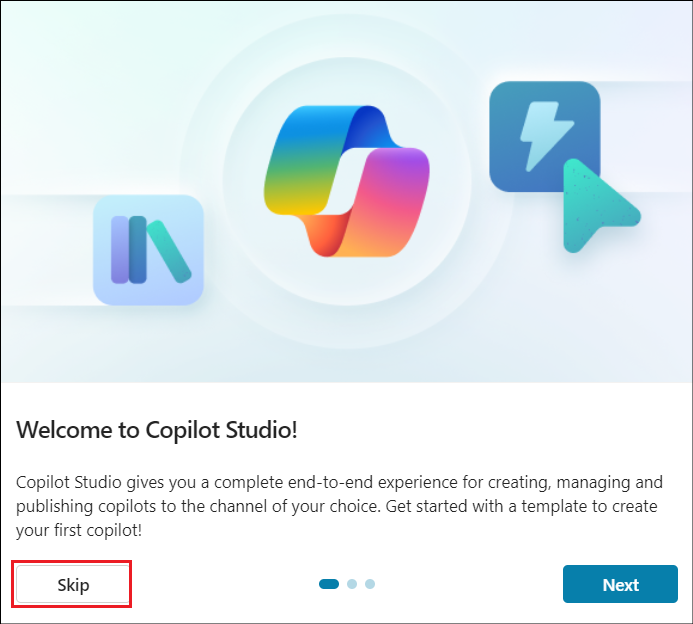

# Laboratorio 09: Crear un agente autónomo para rastrear archivos nuevos creados en OneDrive 

**Introducción**

El OneDrive for Business de la organización ha estado recibiendo
múltiples archivos creados en él, y se ha vuelto difícil para el
administrador llevar un control de los mismos.

**Objetivo**

Crear un agente autónomo para introducir los detalles del archivo recién
añadido al rastreador de detalles de archivos. Esto resuelve el problema
del seguimiento de las adiciones de archivos y el rastreador de detalles
de archivos tendrá los detalles de todos los archivos recién creados.

## Ejercicio 1: Configurar el entorno 

### Tarea 1: Configurar OneDrive

1.  Abra un navegador y vaya a +++. **Inicie sesión** utilizando las
    credenciales de la pestaña **Resources**.

2.  Seleccione **OneDrive** en el menú de la izquierda.

3.  Haga clic en el símbolo **+** situado en la parte superior izquierda
    y seleccione **Files upload**.

4.  Seleccione el archivo **File details.xlsx** en **C:\LabFiles** y
    seleccione **Open**.

5.  Una vez que se ha subido el archivo, aparecerá un mensaje de éxito
    en la ventana.

6.  Haga clic en **My files** en el menú de la izquierda y verá que el
    nuevo archivo está disponible allí.

### Tarea 2: Habilitar la versión de prueba de Copilot Studio 

1.  En una nueva pestaña, abra
    +++[https://copilotstudio.microsoft.com/+++](https://copilotstudio.microsoft.com/**+++).

2.  Inicie sesión con las **credenciales** proporcionadas en la
    pestaña **Resources** de su máquina virtual de laboratorio.

3.  Una vez que haya iniciado sesión, en la página **Welcome to
    Microsoft Copilot Studio**, mantenga el país como **United
    States** y haga clic en **Get Started**.

4.  Seleccione **Skip** en la pantalla **Welcome**.

## Ejercicio 2: Crear y probar un agente autónomo 

### Tarea 1: Crear un agente desde Copilot Studio 

1.  Haga clic en la opción **Skip to configure** en la página de
    creación del agente que se abre.

2.  En el panel de creación de agentes, ingrese los siguientes datos y
    haga clic en **Create**.

    - **Name** - +++New file tracker agent+++

    - **Description** - +++This agent will update the File details
      tracker placed in the OneDrive, each time a new file is created in
      the OneDrive+++

### Tarea 2: Añadir desencadenante al agente 

1.  Una vez creado el agente, desplácese hacia abajo hasta encontrar la
    sección **Trigger**. Seleccione **+ Add trigger.**

2.  En el cuadro de diálogo **Turn on generative orchestration to
    continue**, seleccione **Turn it on**. Debemos activar esta opción
    para poder agregar un desencadenador.

3.  En el menú Add trigger menu, seleccione el desencadenador **When a
    file is created**.

4.  En la pantalla **Add trigger**, seleccione Continue.

5.  En la siguiente pantalla, observe que se rellena el campo **Trigger
    name**. Espere hasta que se establezcan
    las **conexiones** con **Microsoft Copilot Studio** y **OneDrive for
    Business** (aparecerá una marca verde junto a cada uno de estos
    conectores).

A continuación, haga clic en **Next**.

6.  Seleccione los siguientes datos.

    - **Folder** – Root

    - **Include subfolders** – Yes

Deje los demás campos como están y seleccione **Create trigger**.

7.  Una vez creado el activador, aparecerá el mensaje **Time to test
    your trigger**. Cierre la ventana. Modificaremos ligeramente el
    flujo básico del activador para implementar la funcionalidad y, a
    continuación, lo probaremos.

### Tarea 3: Añadir lógica al desencadenador 

1.  En la página **New file track agent**, desplácese hacia abajo hasta
    la sección de desencadenantes.

2.  Haga clic en los tres puntos situados junto al desencadenador **When
    a file is created** y seleccione **Edit in Power Automate**.

3.  Seleccione el icono **+** entre **When the file is
    created** y **Sends a prompt action **y seleccione **Add an
    action**.

4.  Busque +++add a row+++ y seleccione **Add a row into the table**.

5.  Seleccione los siguientes valores para cada fila y haga clic
    en **Save**.

|                  |                                            |
|------------------|--------------------------------------------|
| Propiedad        | Valor                                      |
| Location         | OneDrive for Business                      |
| Document Library | OneDrive                                   |
| File             | File details.xlsx                          |
| Table            | Table1                                     |
| Date Time Format | Serial Number                              |
| File ID          | Seleccione la variable **File identifier** |
| File Name        | Seleccione la variable **File name**       |
| File Path        | Seleccione la variable **File path**       |

> 
>
> 

6.  El flujo se verá ahora como el de la siguiente captura de pantalla.

7.  Haga clic en la opción **New designer**.

8.  Seleccione **Save draft**.

9.  Seleccione **Publish** para publicar el flujo.

### Tarea 4: Publicar el desencadenante 

1.  De vuelta en Copilot Studio, seleccione **Settings**.

2.  Seleccione **Generative AI** -\> **Using generative AI in
    conversations**. Si aún no está seleccionado,
    seleccione **Generative** y, a continuación, haga clic en **Save**.

3.  Seleccione **Security** -\> **Authentication** -\> **No
    authentication** y, a continuación, haga clic en **Save**.

4.  Seleccione **Save** en el cuadro de diálogo de confirmación.

5.  Cierre el panel de Settings.

6.  Ahora, seleccione **Publish **para publicar el agente.

7.  Seleccione **Publish** en el cuadro de diálogo de confirmación.

### Tarea 5: Probar el desencadenante 

1.  Vuelva a **OneDrive** en el navegador. Haga clic en **+** y
    seleccione **Word document.**

2.  Asigne un **nombre** al documento y seleccione **Create**.

3.  Haga clic en **Close** para cerrar la opción de privacidad.

4.  Añada algunos archivos más de la misma manera.

5.  Ahora, **abra** el archivo **File details.xlsx** desde OneDrive y
    observe que los detalles de los archivos creados se añaden al
    rastreador. **Nota**: Inicie sesión con sus credenciales desde la
    pestaña Resources según sea necesario.

6.  Cuando se crea el archivo en OneDrive, se activa el desencadenador,
    que a su vez ejecuta el flujo **When a file is added** y actualiza
    el rastreador.

7.  También puede consultar los detalles del agente autónomo en la
    pestaña Activity de Copilot Studio.

**Resumen**

En este laboratorio, hemos aprendido a crear, publicar y probar un
agente autónomo desde Copilot Studio.
