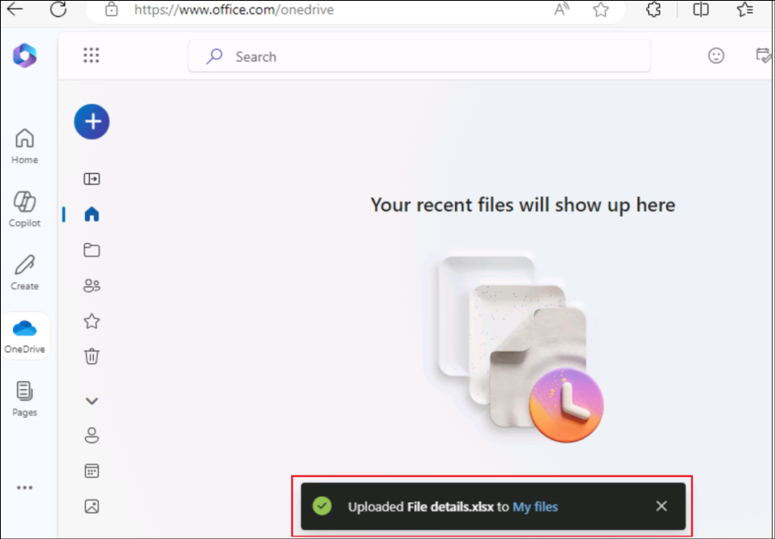
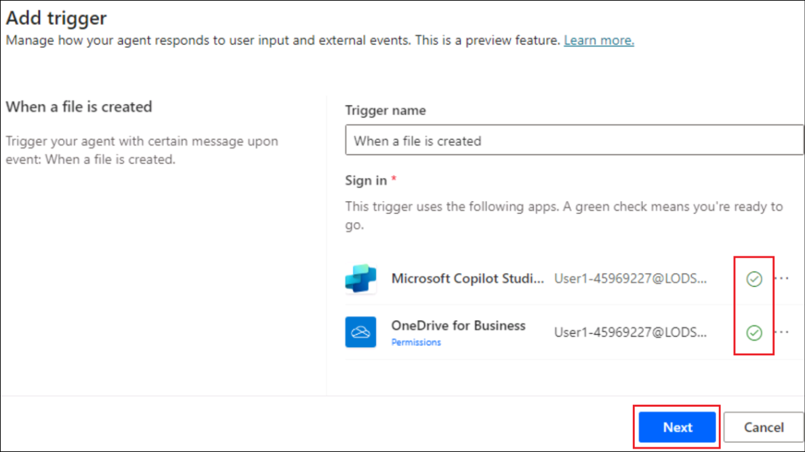
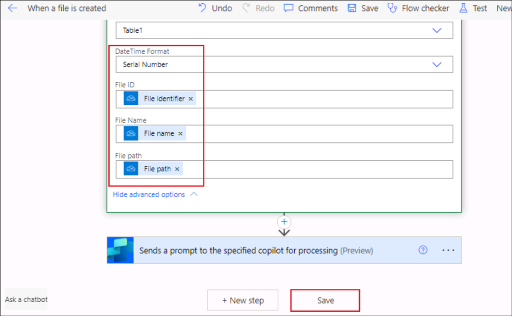

Laboratório 09: crie um agente autônomo para rastrear novos arquivos
criados no OneDrive

**Introdução**

O OneDrive for Business de uma organização tem recebido múltiplos
arquivos sendo criados, tornando-se difícil para o administrador
acompanhar todos eles.

**Objetivo**

Crie um agente autônomo para registrar os detalhes dos arquivos
recém-adicionados no rastreador de detalhes de arquivos. Isso resolve o
problema de acompanhamento das adições de arquivos, garantindo que o
rastreador tenha os detalhes de todos os novos arquivos criados.

Exercício 1: Configurar o ambiente

Tarefa 1: Configurar o OneDrive

1.  Abra um navegador e navegue até [+++https://office.com+++](). **Faça
    login** usando as credenciais da guia **Resources.**

2.  Selecione **OneDrive** no menu à esquerda.

3.  Clique no símbolo**+** no canto superior esquerdo e selecione
    **Files upload**.

4.  Selecione o arquivo **File details.xlsx** em **C:\LabFiles** e
    selecione **Open**.

5.  Depois que o arquivo é carregado, uma mensagem de sucesso é exibida
    na janela.

6.  Clique em **My files** no menu à esquerda e você verá que o novo
    arquivo está disponível lá.

Tarefa 2: Ativar a avaliação do Copilot Studio

1.  Em uma nova guia, abra
    [+++https://copilotstudio.microsoft.com/+++](https://copilotstudio.microsoft.com/**+++).

2.  Faça login com as **credenciais** fornecidas na guia **Resources**
    de sua VM de laboratório.

3.  Após fazer login, na página **Welcome to Microsoft Copilot Studio**,
    **mantenha o país como Estados Unidos** e clique em **Get Started**.

4.  Selecione **Skip** na tela de **Welcome**.

Exercício 2: Crie e teste um agente autônomo

Tarefa 1: Criar um agente no Copilot Studio

1.  Clique na opção **Skip to configure** na página de criação do agente
    que está aberta.

2.  No painel de criação do agente, insira os detalhes abaixo e clique
    em **Create**.

    - **Name -** +++New file tracker agent+++ 

    - **Description -** +++This agent will update the File details
      tracker placed in the OneDrive, each time a new file is created in
      the OneDrive+++

Tarefa 2: Adicionar trigger ao agente

1.  Depois que o agente for criado, role para baixo para encontrar a
    seção **Trigger**. Selecione **+ Add trigger.**

2.  Na caixa de diálogo **Turn on generative orchestration to
    continue**, selecione **Turn it on.** Precisamos ter essa opção
    ativada para adicionar um trigger.

3.  No menu Add trigger, selecione o trigger **When a file is created.**

4.  Na tela **Add trigger**, selecione Continue.

5.  Na próxima tela, observe que o **Trigger name** está preenchido.
    Aguarde até que as **conexões** com o **Microsoft Copilot Studio** e
    o **OneDrive for Business** sejam estabelecidas (você verá uma marca
    verde em cada um desses conectores).

Em seguida, clique em **Next**.

6.  Selecione os detalhes abaixo.

    - **Folder –** Root

    - **Include subfolders –** Yes** **

Deixe os outros campos como padrão e selecione **Create trigger**.

7.  Depois que o trigger é criado, é exibida a mensagem **Time to test
    your trigger**. Feche-a. Ajustaremos um pouco o fluxo básico do
    trigger para implementar a funcionalidade e depois o testaremos.

Tarefa 3: Adicionar lógica ao trigger

1.  Na página **New file track agent**, role para baixo até a seção
    trigger.

2.  Clique nos três pontos próximo ao trigger** When a file is
    created,** e selecione ** Edit in Power Automate**.

3.  Selecione o ícone**+** entre **When the file is created** e ** Sends
    a prompt action** e selecione **Add an action**.

4.  Procure por +++add a row+++ e selecione **Add a row into the
    table**.

5.  Selecione os valores abaixo para cada linha e clique em **Save**.

|                   |                        |
|-------------------|------------------------|
| Property          | Value                  |
| Location          | OneDrive for Business  |
| Document Library  | OneDrive               |
| File              | File details.xlsx      |
| Table             | Table1                 |
| Date Time Format  | Serial Number          |

| File ID    | Selecione a variável **File identifier**  |
|------------|-------------------------------------------|
| File Name  | Selecione a variável **File name**        |
| File Path  | Select the variable **File path**         |

6.  O fluxo agora será parecido com o da captura de tela abaixo.

7.  Clique no botão **New designer toggle**.

8.  Selecione ** Save draft**.

9.  Selecione **Publish** para publicar o fluxo

Tarefa 4: Publicar o trigger

1.  De volta ao Copilot Studio, selecione **Settings**.

2.  Selecione **Generative AI** -\> **Using generative AI in
    conversations**. Se ainda não estiver selecionado, selecione
    **Generative** e, em seguida, clique em **Save**.

3.  Selecione **Security** -\> **Authentication** -\> **No
    authentication** e, em seguida, clique em **Save**.

4.  Selecione **Save** na caixa de diálogo de confirmação.

5.  Feche o painel Settings.

6.  Agora, selecione **Publish** para publicar o agente.

7.  Selecione **Publicar** na caixa de diálogo de confirmação.

Tarefa 5: Testar o trigger

1.  Navegue de volta para o **OneDrive** no navegador. Clique em**+** e
    selecione **Word document.**

2.  Dê um **nome** ao documento e selecione **Create**.

3.  Clique em **Close** para fechar a opção de privacidade.

4.  Adicione mais alguns arquivos de forma semelhante.

5.  Agora, **open** o **File details.xlsx** do OneDrive e observe que os
    detalhes dos arquivos criados foram adicionados ao rastreador.
    **Observação**: Faça login usando suas credenciais da guia
    Resources, conforme solicitado.

6.  Quando o arquivo é criado no OneDrive, o trigger é acionado, o que,
    por sua vez, executa o fluxo **When a file is added** e atualiza o
    rastreador.

7.  Você também pode verificar os detalhes do agente autônomo na guia
    Atividade do Copilot Studio.

**Resumo**

Neste laboratório, aprendemos a criar, publicar e testar um agente
autônomo no Copilot Studio.
