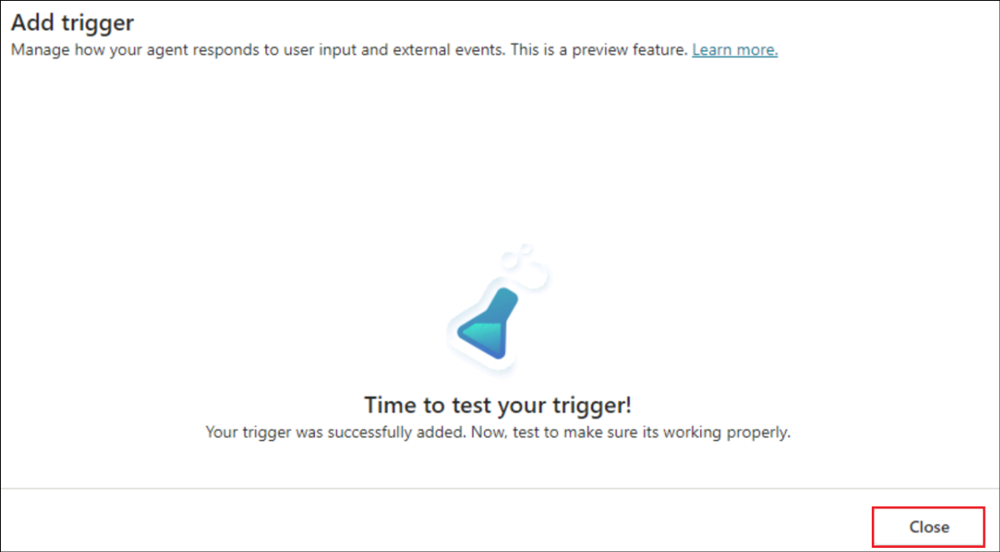
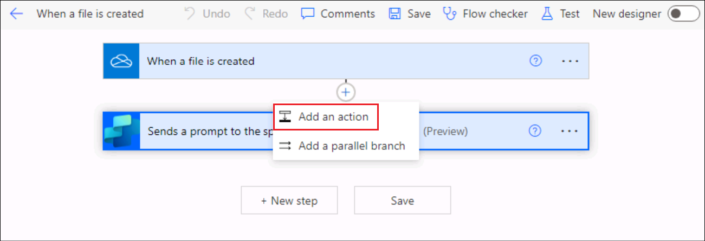

# ラボ 09: OneDrive で作成された新しいファイルを追跡する自律エージェントを構築する

**紹介**

ある組織のOneDrive For
Businessでは、複数のファイルが作成されており、管理者がそれらを追跡することが困難になっています。

目標

新しく追加されたファイルの詳細をファイル詳細トラッカーに入力する自律エージェントを構築します。これにより、ファイルの追加を追跡する問題が解決され、ファイル詳細トラッカーには新しく作成されたすべてのファイルの詳細が記録されます。

## 演習1: 環境を設定する

### タスク 1: OneDrive のセットアップ

1\. ブラウザを開き、+++https://office.com+++
にアクセスします。Resourcesタブの資格情報を使用してサインインします。

2\. 左側のメニューから OneDrive
を選択します。

3\. 左上の + 記号をクリックし、「Files
upload」を選択します。

4\. C:\LabFiles からファイル details.xlsx を選択し、\[Open\]
を選択します。

5\.
ファイルがアップロードされると、ウィンドウに成功メッセージが表示されます。

6\. 左側のメニューから「My
Files」をクリックすると、新しいファイルがそこに表示されていることを確認できます。

### タスク 2: Copilot Studio のトライアルを有効にする

1\. 新しいタブで、+++https://copilotstudio.microsoft.com/+++
を開きます。

2\. ラボ VM の \[Resources\]
タブで提供されている資格情報を使用してサインインします。

3\. ログインしたら、「Welcome to Microsoft Copilot
Studio」ページで国を米国のままにして、「Get
started」をクリックします。

4\.
ようこそ画面で「Skip」を選択します。

## エクササイズ 2: 自律エージェントの構築とテスト

### タスク 1: Copilot Studioからエージェントを作成する

1\. 開いたエージェント作成ページで、「Skip to
configure」オプションをクリックします。

> ２．エージェント作成ペインで以下の詳細を入力し、「Create」をクリックします。

- **Name** - +++New file tracker agent+++

- **Description** - +++This agent will update the File details tracker
  placed in the OneDrive, each time a new file is created in the
  OneDrive+++

### タスク 2: エージェントにトリガーを追加する

1\.
エージェントを作成したら、下にスクロールして「Trigger」セクションを見つけ、「+
Add
trigger」を選択します。

2\. 「Turn on generative orchestration to continue」ダイアログで、「Turn
it
on」を選択します。トリガーを追加するには、このオプションをオンにする必要があります。

3\. \[Add trigger\] メニューから、\[When a file is created\]
トリガーを選択します。

4\. 「Add trigger
」画面で、「Continue」を選択します。

5\. 次の画面で、トリガー名が入力されていることを確認します。Microsoft
Copilot Studio と OneDrive for Business
への接続が確立されるまでお待ちください（各コネクタに緑色のチェックマークが表示されます）。「Next」をクリックします。

> 6.以下の詳細を選択してください。

- **Folder** – Root

- **Include subfolders** – Yes

Leave the other fields as default and select **Create trigger**.

7\. トリガーが作成されると、「Time to test your
trigger」というメッセージが表示されます。このメッセージを閉じてください。トリガーの基本フローを少し調整して機能を実装し、テストを行います。

### タスク 3: トリガーにロジックを追加する

1\. 「New file track agent」ページで、トリガー
セクションまで下にスクロールします。

2\. 「When a file is created」というトリガーの横にある 3
つのドットをクリックし、「Edit in Power
Automate」を選択します。

3\. 「When the file is created」と「Sends a prompt」アクションの間の +
アイコンを選択し、「Add an
action」を選択します。

4\. +++add a
row+++を検索し、テーブルに行を追加を選択します。

> 5.各行に対して以下の値を選択し、「Save」をクリックします。

|                  |                                         |
|------------------|-----------------------------------------|
| Property         | Value                                   |
| Location         | OneDrive for Business                   |
| Document Library | OneDrive                                |
| File             | File details.xlsx                       |
| Table            | Table1                                  |
| Date Time Format | Serial Number                           |
| File ID          | Select the variable **File identifier** |
| File Name        | Select the variable **File name**       |
| File Path        | Select the variable **File path**       |

>

6\.
フローは以下のスクリーンショットのようになります。

1.  Click on the **New designer toggle**.

7\. 「Save
draft」を選択します。

8\.
フローを公開するには「Publish」を選択します

### タスク 4: トリガーを公開する

1\. Copilot Studio
に戻り、「Settings」を選択します。

2\. 「Generative AI」→「Using generative AI in
conversations」を選択します。まだ選択されていない場合は「Generative」を選択し、「Save」をクリックします。

3\. 「Security -\> Authentication -\> No
authentication」を選択し、「Save」をクリックします。

4\. 確認ダイアログで「Save」を選択します。

5\. Settingsパネルを閉じます。

6\.
次に、「Publish」を選択してエージェントを公開します。

7\.
確認ダイアログで「Publish」を選択します。

### タスク 5: トリガーをテストする

1\.
ブラウザでOneDriveに戻り、「+」をクリックしてWord文書を選択します。

2\.
ドキュメントに名前を付けて、「Create」を選択します。

3\. 「Close」をクリックしてプライバシー
オプションを閉じます。

4\. 同様に、さらにいくつかのファイルを追加します。

5\. OneDriveからファイル details.xlsx
を開き、作成されたファイルの詳細がトラッカーに追加されていることを確認します。注:
必要に応じて、「Resources」タブから資格情報を使用してログインしてください。

1\. OneDrive
にファイルが作成されると、トリガーが呼び出され、ファイルが追加されたときのフローが実行され、トラッカーが更新されます。

2\. Copilot Studio の \[Activity\]
タブで自律エージェントの詳細を確認することもできます。

**概要**

このラボでは、Copilot Studio
から自律エージェントを作成、公開、テストする方法を学習しました。
