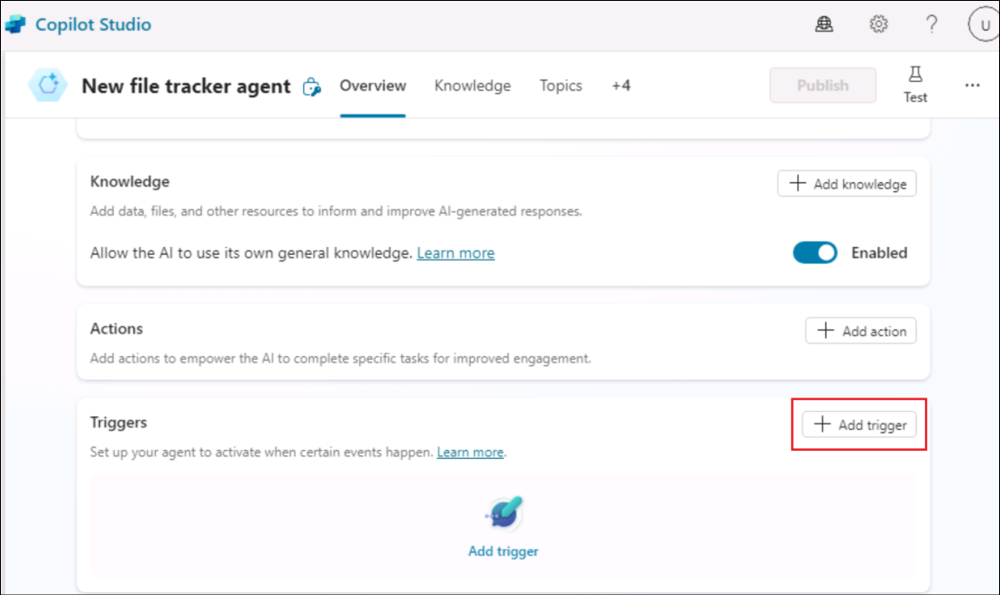
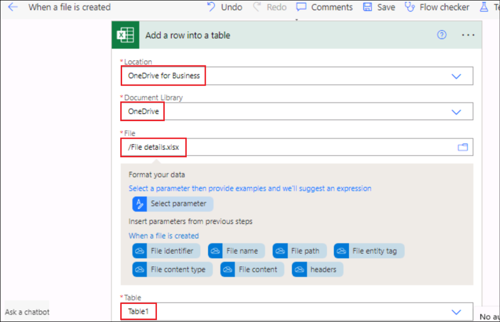

# Lab 09 : Création d'un agent autonome pour le suivi des nouveaux fichiers créés dans OneDrive

**Introduction**

OneDrive For Business d'une organisation a été créé plusieurs fichiers
et il est devenu difficile pour l'administrateur de les suivre.

**Objectif**

Créez un agent autonome pour entrer les détails du fichier nouvellement
ajouté dans l'outil de suivi des détails du fichier. Cela résout le
problème du suivi des ajouts de fichiers et le suivi des détails du
fichier aura les détails de tous les fichiers nouvellement créés.

## Exercice 1 : Mettre en place l'environnement

### Tâche 1 : Configurer OneDrive

1.  Ouvrez un navigateur et accédez à +++. **Sign in** à l'aide des
    informations d'identification de l'onglet **Resources**

2.  Sélectionnez **OneDrive** dans le menu de gauche.

3.  Cliquez sur le symbole **+** en haut à gauche et sélectionnez
    **Files upload**.

4.  Sélectionnez le fichier **File details.xlsx** dans **C :\LabFiles**
    et sélectionnez **Open**.

5.  Une fois le fichier téléchargé, un message de réussite s'affiche
    dans la fenêtre.

6.  Cliquez sur **My files** dans le menu de gauche et vous pouvez voir
    que le nouveau fichier y est disponible.

### Tâche 2 : Activer l'essai de Copilot Studio

1.  Dans un nouvel onglet, ouvrez
    +++[https://copilotstudio.microsoft.com/+++](https://copilotstudio.microsoft.com/**+++).

2.  Connectez-vous à l'aide des **Credentials** fournies sous l'onglet
    **Resources** de votre machine virtuelle Lab.

3.  Une fois connecté, rendez-vous sur la page **Welcome to Microsoft
    Copilot Studio**, quittez le pays en tant que **United States** et
    cliquez sur **Get Started**.

4.  Sélectionnez **Skip** dans l'écran **Welcome.**

## Exercice 2 : Générer et tester un agent autonome

### Tâche 1 : Créer un agent à partir de Copilot Studio

1.  Cliquez sur l'option **Skip to configure** dans la page de création
    de l'agent qui s'ouvre.

2.  Dans le volet de création de l'agent, entrez les détails ci-dessous
    et cliquez sur **Create**.

    - **Name** - +++New file tracker agent+++

    - **Description** - +++This agent will update the File details
      tracker placed in the OneDrive, each time a new file is created in
      the OneDrive+++

### Tâche 2 : Add trigger à l'agent

1.  Une fois l'agent créé, faites défiler vers le bas pour trouver la
    section **Trigger**. Sélectionnez **+ Add trigger.**

2.  Dans la boîte de dialogue **Turn on generative orchestration to
    continue**, sélectionnez **Turn it**. Nous devons avoir cette option
    définie sur on afin d'ajouter un déclencheur.

3.  Dans le menu Ajouter un déclencheur, sélectionnez **When a file is
    created**.

4.  Dans l'écran **Add trigger**, sélectionnez Continuer.

5.  Dans l'écran Next, notez que le **Add trigger** est renseigné.
    Attendez que les **connections** à **Microsoft** **Copilot Studio**
    et **OneDrive for Business** soient établies (vous obtenez une coche
    verte pour chacun de ces connecteurs).

Ensuite, cliquez sur **Next**.

6.  Sélectionnez les détails ci-dessous.

    - **Folder** – Root

    - **Include subfolders** – Yes

Laissez les autres champs par défaut et sélectionnez **Create trigger**.

7.  Une fois le déclencheur créé, **Time to test your trigger**
    s'affiche. Fermez-le (**Close**). Nous allons modifier un peu le
    flux de base du déclencheur pour obtenir la fonctionnalité
    implémentée, puis nous la testerons.

> 

### Tâche 3 : Ajouter une logique au déclencheur

1.  Sur la page **New file track agent**, faites défiler jusqu'à la
    section Déclencheur.

2.  Cliquez sur les 3 points en regard du déclencheur **When a file is
    created**, puis sélectionnez **Edit in Power Automate**.

3.  Sélectionnez l'icône **+** entre **When the file is created** et
    **Sends a prompt action,** puis sélectionnez **Add an action**.

4.  Recherchez +++ add an action +++ et sélectionnez **Add a row into
    the table**.

5.  Sélectionnez les valeurs ci-dessous pour chaque ligne et cliquez sur
    **Save**.

|                  |                                         |
|------------------|-----------------------------------------|
| Property         | Value                                   |
| Location         | OneDrive for Business                   |
| Document Library | OneDrive                                |
| File             | Serial Number                           |
| Table            | Table 1                                 |
| Date Time Format | Serial Number                           |
| File ID          | Select the variable **File identifier** |
| File Name        | Select the variable **File name**       |
| File Path        | Select the variable **File path**       |

> 
>
> 

6.  Le flux ressemblera maintenant à celui de la capture d'écran
    ci-dessous.

7.  Cliquez sur le bouton **New designer toggle**.

8.  Sélectionnez **Save draft**.

9.  Sélectionnez **Publish** pour publier le flux

### Tâche 4 : Publier le déclencheur

1.  De retour dans Copilot Studio, sélectionnez **Settings**.

2.  Sélectionnez **Generative AI** -\> **Using generative AI in
    conversations**. Si ce n'est pas déjà fait, sélectionnez
    **Génératif**, puis cliquez sur **Save**.

3.  Sélectionnez **Security** -\> **Authentication** -\> **No
    authentication**, puis cliquez sur **Save**.

4.  Sélectionnez **Save** dans la boîte de dialogue de confirmation.

5.  Fermez le volet Paramètres.

6.  Maintenant, sélectionnez **Publish** pour publier l'agent.

7.  Sélectionnez **Publish** dans la boîte de dialogue de confirmation.

### Tâche 5 : Tester le déclencheur

1.  Revenez à **OneDrive** dans le navigateur. Cliquez sur **+** et
    sélectionnez **Word document.**

2.  Donnez un **name** au document et sélectionnez **Create**.

3.  Cliquez sur **Close** pour fermer l'option de confidentialité.

4.  Ajoutez quelques fichiers supplémentaires de la même manière.

5.  Maintenant, **open** le **File details.xlsx** à partir de OneDrive
    et observez que les détails des fichiers créés sont ajoutés au
    traqueur. **Remarque** : Connectez-vous à l'aide de vos informations
    d'identification à partir de l'onglet Ressources, selon vos besoins.

6.  Lorsque le fichier est créé dans OneDrive, le déclencheur est appelé
    qui à son tour exécute le flux **When a file is added** et met à
    jour le suivi de l'utilisateur.

7.  Vous pouvez également vérifier les détails de l'agent autonome dans
    l'onglet Activité de Copilot Studio.

**Résumé**

Dans ce Lab, nous avons appris à créer, publier et tester un agent
autonome à partir de Copilot Studio.
