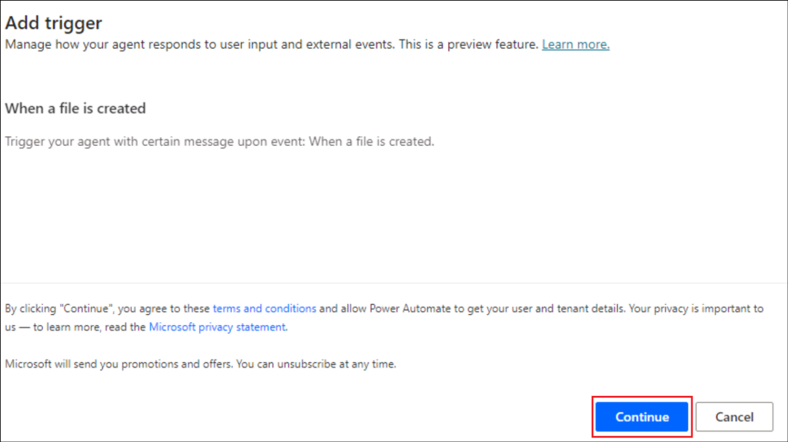
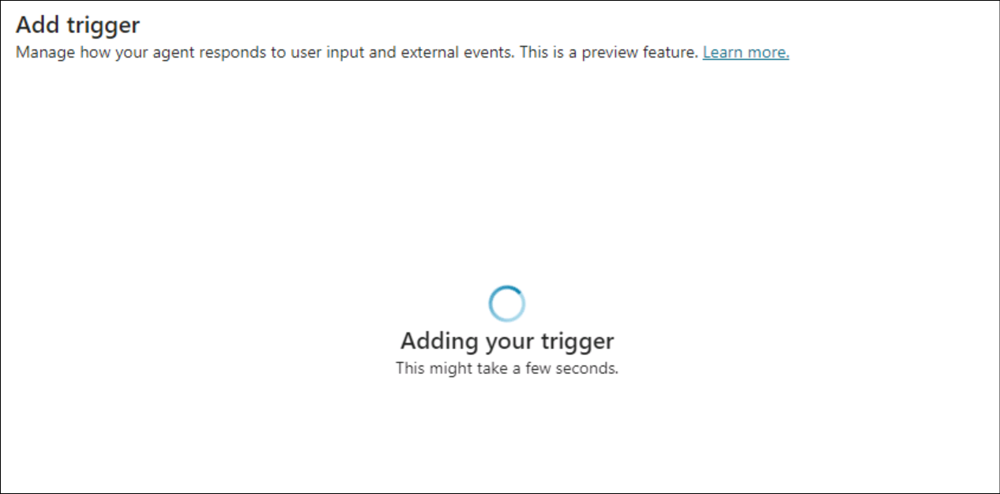
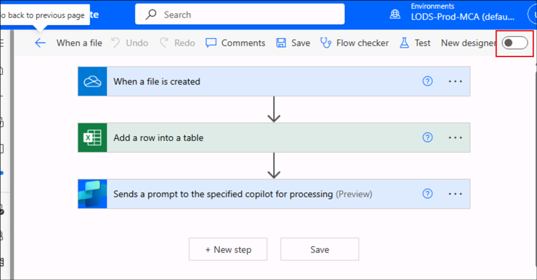

# 實驗 09：構建自治代理來跟蹤在 OneDrive 中創建的新文件

**介紹**

組織的 OneDrive For Business
一直在其中創建多個文件，管理員很難跟蹤它們。

**目的**

構建一個自治代理，將新添加的文件的詳細信息輸入到 File Details
（文件詳細信息） 跟蹤器中。這解決了跟蹤文件添加的問題，並且 File details
（文件詳細信息） 跟蹤器將包含所有新創建文件的詳細信息。

## 練習 1：設置環境

### 任務 1：設置 OneDrive 

1.  打開瀏覽器並導航到+++。使用 **Resources** （資源）
    選項卡中的憑證**登錄**

2.  從左側菜單中選擇 **OneDrive**。

3.  單擊左上角的 **+** 符號，然後選擇 **Files upload**。

4.  從 **C：\LabFiles** 中選擇文件 **File details.xlsx** 並選擇
    **Open**。

5.  上傳文件後，窗口中會彈出一條成功消息。

6.  單擊左側菜單中的 **My files**，您可以看到新文件在那裡可用。

### 任務 2：啟用 Copilot Studio 試用版

1.  在新選項卡中，打開
    +++[https://copilotstudio.microsoft.com/+++](https://copilotstudio.microsoft.com/**+++)。

2.  使用實驗室 VM 的 “**Resources**” 選項卡下提供的**憑據**登錄。

3.  登錄後，**Welcome to Microsoft Copilot Studio**
    頁面，將國家/地區保留為 **United States** ，然後單擊 “**Get
    Started**” 。

4.  在 **Welcome** （歡迎） 屏幕中選擇 **Skip** （跳過）。

## 練習 2：構建和測試自治代理

### 任務 1：從 Copilot Studio 創建代理

1.  單擊打開的 Agent creation 頁面中的 **Skip to configure** 選項。

2.  在代理創建窗格中，輸入以下詳細信息，然後單擊 **Create**。

    - 名字- +++New file tracker agent+++

    - 描述- +++This agent will update the File details tracker placed in
      the OneDrive, each time a new file is created in the OneDrive+++

### 任務 2：向代理添加觸發器

1.  創建代理後，向下滾動以找到 **Trigger** 部分。選擇 **+ Add
    trigger**。

2.  在 **Turn on generative orchestration to
    continue**（打開生成式編排以繼續）對話框中，選擇 **Turn it
    on**（打開它）。我們需要將此選項設置為 on 才能添加觸發器。

3.  從 Add trigger 菜單中，選擇 **When a file is created** 觸發器。

4.  在 **Add trigger** （添加觸發器） 屏幕中，選擇 Continue （繼續）。

5.  在下一個屏幕中，請注意 **Trigger name** 已填充。等待與 **Microsoft
    Copilot Studio** 和 **OneDrive for Business**
    建立**連接**（每個連接器都有一個綠色勾號）。

然後，單擊 **Next**。

6.  選擇以下詳細信息。

    - **文件夾**– Root

    - **包括子文件夾**– Yes

將其他字段保留為默認字段，然後選擇 **Create trigger**（創建觸發器）。

7.  創建觸發器後，將顯示 **Time to test your trigger**
    消息。**關閉**它。我們將稍微調整觸發器的基本流程以實現功能，然後對其進行測試。

### 任務 3：向觸發器添加邏輯

1.  在 **New file track agent** （新建文件跟蹤代理）
    頁面中，向下滾動到觸發器部分。

2.  單擊觸發器 **When a file is created** （創建文件時） 上的 3
    個點，然後選擇 **Edit in Power Automate**（在 Power Automate
    中編輯）。

3.  選擇 **+** 圖標 **When the file is created** 和 **Sends a prompt
    action** ，然後選擇 **Add an action**。

4.  搜索 +++add a row+++，然後選擇 **Add a row into the table**。

5.  為每行選擇以下值，然後單擊 **Save** 。

|              |                              |
|--------------|------------------------------|
| 財產         | 價值                         |
| 位置         | OneDrive for Business        |
| 文檔庫       | OneDrive                     |
| 文件         | File details.xlsx            |
| 桌子         | Table1                       |
| 日期時間格式 | 序號                         |
| 文件ID       | 選擇變量 **File identifier** |
| 文件 名      | 選擇變量 **File name**       |
| 文件 路徑    | 選擇變量 **File path**       |

>

6.  該流現在將類似於以下屏幕截圖中的流。

7.  單擊 **New designer 切換**。

8.  選擇 **Save draft** （保存草稿）。

9.  選擇 **Publish** （發佈） 以發佈流程

### 任務 4：發佈觸發器

1.  返回 Copilot Studio，選擇 **Settings**。

2.  選擇 **Generative AI -\> Using generative AI in
    conversations**（在對話中使用生成式 AI）。如果尚未選擇，請選擇
    **Generative** （生成），然後單擊 **Save** （保存）。

3.  選擇 **Security -\> Authentication -\> No authentication**，然後單擊
    **Save**。

4.  在確認對話框中選擇 **Save**。

5.  關閉 Settings （設置） 窗格。

6.  現在，選擇 **Publish** （發佈） 以發佈代理。

7.  在確認對話框中選擇 **Publish**。

### 任務 5：測試觸發器

1.  在瀏覽器中導航回 **OneDrive**。點擊 + 並選擇 **Word document**。

2.  為文檔**命名**，然後選擇 **Create**。

3.  單擊 **Close** 關閉隱私選項。

4.  以類似方式添加更多文件。

5.  現在，從 OneDrive **打開 File details.xlsx**
    並觀察所創建文件的詳細信息是否已添加到跟蹤器中。**注意**：根據需要使用
    Resources （資源） 選項卡中的憑證登錄。

6.  在 OneDrive
    中創建文件時，將調用觸發器，該觸發器反過來會在**添加文件時**執行流並更新跟蹤器。

7.  您還可以在 Copilot Studio 的 Activity （活動）
    選項卡中查看自治代理的詳細信息。

**總結**

在本實驗中，我們學習了如何從 Copilot Studio 創建、發佈和測試自主代理。
