# Lab 10 : Implémentation d'une action d'invite pour le sujet d'un agent de génération de quiz

## Exercice 1 : Utiliser le langage naturel pour créer un agent

1.  Ouvrez un navigateur et connectez-vous à
    +++<https://copilotstudio.microsoft.com/+++> et connectez-vous avec
    les informations d'identification de l'onglet Ressources si vous
    n'êtes pas déjà sur cette page.

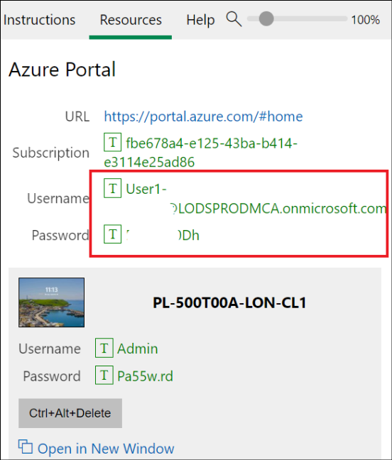

2.  Si vous êtes déjà sur la page Copilot Studio, cliquez sur **Home**
    pour accéder à la page d'accueil.

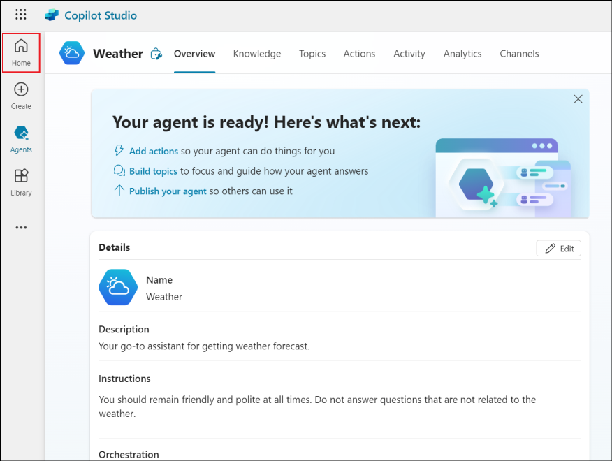

3.  Sur la page d'accueil, dans la zone de texte sous Décrivez votre
    agent pour le créer, entrez +++I want you to be a question and
    answering assistant that can answer common questions from users
    using the content of a website+++ et cliquez sur **Send**.

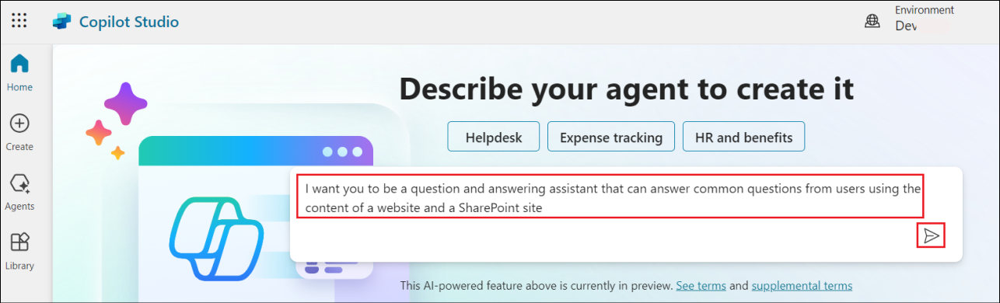

4.  Il peut suggérer un nom pour l'agent. Acceptez-le ou indiquez votre
    propre nom.

5.  Donnez d'autres détails concernant les fonctions de l'agent comme
    ci-dessous.

> +++help answer common product and support questions using the content
> of a website, and help answer HR questions from an uploaded file+++

6.  Indiquez +++[www.microsoft.com+++++](http://www.microsoft.com+++/)
    pour le site Web qui sera utilisé comme source de connaissance.

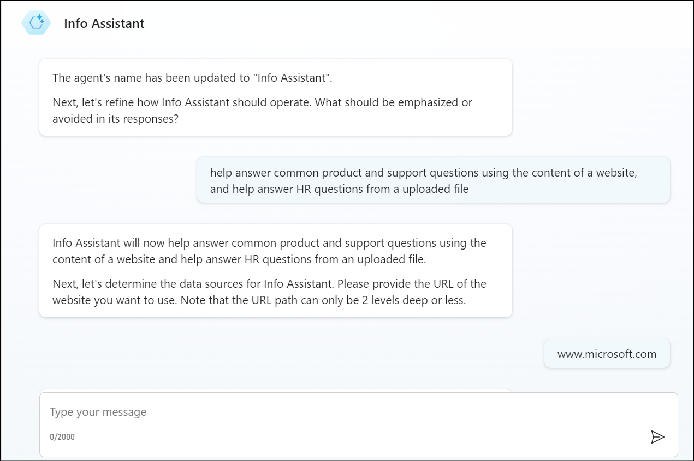

7.  Une fois que vous avez terminé de donner des instructions, cliquez
    sur **Create** pour créer votre agent.

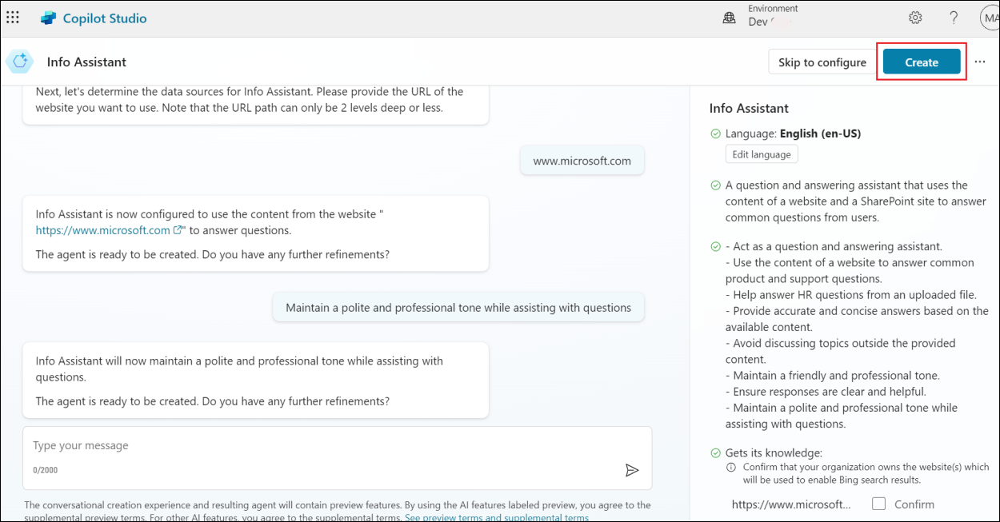

8.  L'agent est créé et s'ouvre avec les détails. Faites défiler la page
    pour comprendre que l'agent a été créé avec les instructions que
    vous lui avez fournies.

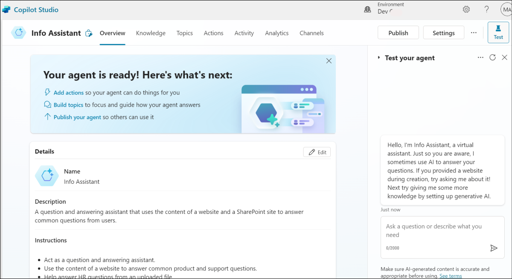

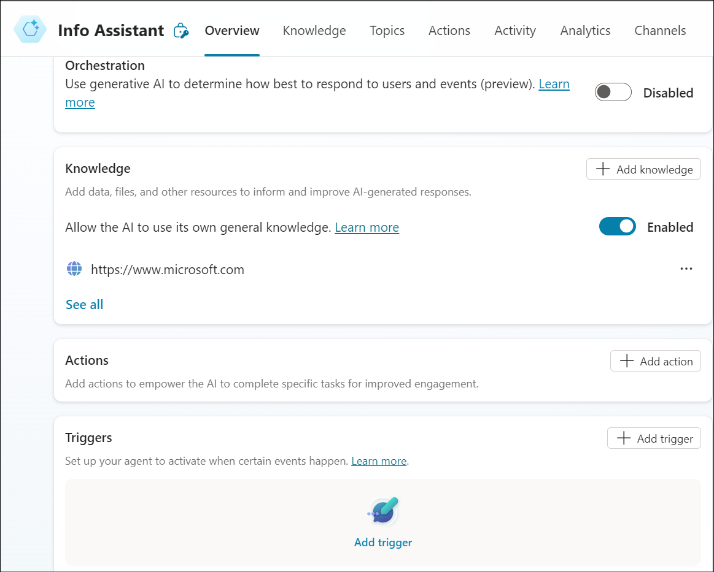

9.  Cliquez sur l’icône Tester pour tester l'agent. Entrez +++What is
    Copilot Studio+++ et appuyez sur **Enter**.

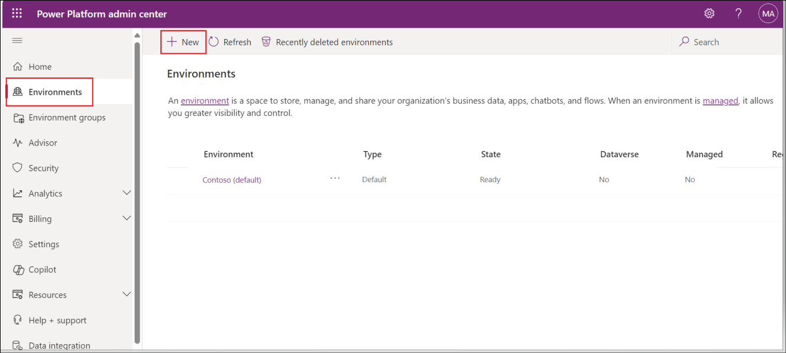

10. Entrez +++What is the latest xbox model?+++

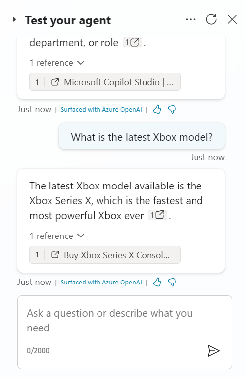

Pour les deux étapes ci-dessus, vous obtiendrez une réponse de l'agent
qui sera générique puisque l'agent utilisera ses connaissances
générales.

## Exercice 2 : Créer une action d'invite pour un sujet de réponses génératives

Les actions peuvent être utilisées pour étendre les capacités des
agents. Vous pouvez ajouter plusieurs types d'actions à vos agents dans
Microsoft Copilot Studio :

- **Prebuilt connector action**, qui utilise les connecteurs Power
  Platform pour accéder aux données d'autres systèmes, tels que les
  produits d'entreprise populaires tels que Salesforce, Zendesk,
  MailChimp et GitHub.

- **Custom connector action**, où un connecteur peut être créé pour
  accéder aux données à partir d'API publiques ou privées.

- **Power Automate cloud flow**, qui utilisent les flux de cloud Power
  Automate pour effectuer des actions, récupérer et utiliser des
  données.

- **AI Builder prompts**, qui utilisent AI Builder et la compréhension
  du langage naturel pour cibler des scénarios et des flux de travail
  spécifiques au sein de votre entreprise.

- **Bot Framework skill**, qui utilise le manifeste de compétence qui
  décrit les actions que la compétence peut effectuer, y compris ses
  paramètres d'entrée et de sortie, les points de terminaison de la
  compétence et les modèles de distribution pour la compétence.

Dans cet exercice, vous allez apprendre à ajouter une invite à l'action
à un nœud de rubrique

1.  Dans votre agent, sélectionnez l'onglet **Topics**, sélectionnez **+
    Add a topic**, puis sélectionnez **From blank**.

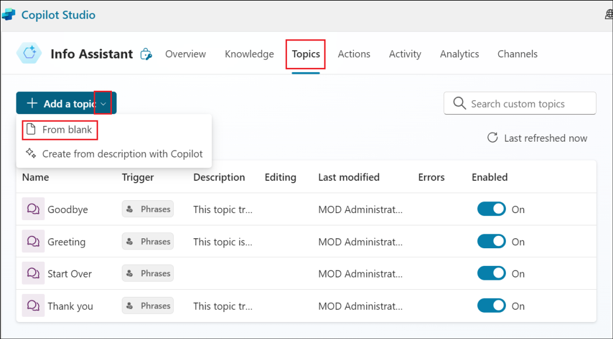

2.  Entrez le nom du sujet comme +++ Generate questions for a quiz +++.
    Sélectionnez le lien hypertexte **Edit** sous Phrases dans le
    déclencheur. Un minimum de 5 phrases déclencheurs doit être saisi

> Ajoutez les phrases ci-dessous une par une. Ajoutez chaque phrase et
> sélectionnez l'option + pour ajouter le déclencheur.
>
> +++create a number of questions for a quiz based on a topic and format
> the quiz based on the instruction provided+++
>
> +++creates a quiz with a number of questions based on the topic
> provided and formats the quiz+++
>
> +++generate a quiz with a number of questions using the topic provide
> and format the questions+++
>
> +++creates questions for a quiz on a specific topic and format+++
>
> +++format a quiz by a number of questions based on the topic
> provided+++
>
> Sélectionnez **Save** en haut à droite pour enregistrer la rubrique.

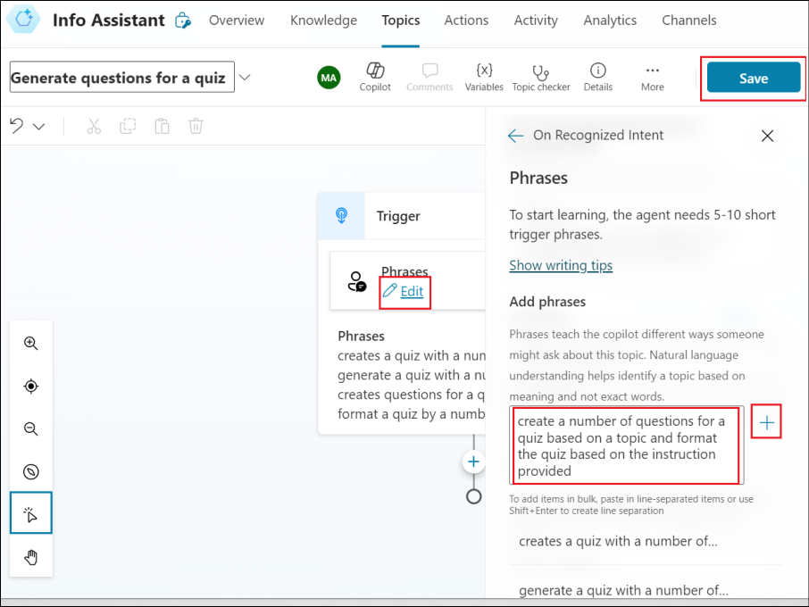

3.  Cliquez sur le symbole **+** sous le nœud Déclencheur. Sélectionnez
    l'option **Add an action**, puis sélectionnez l’option **New prompt
    (default AI model)** en dessous.

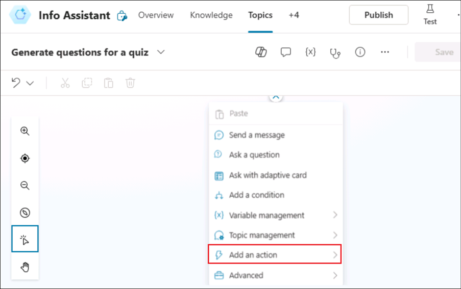

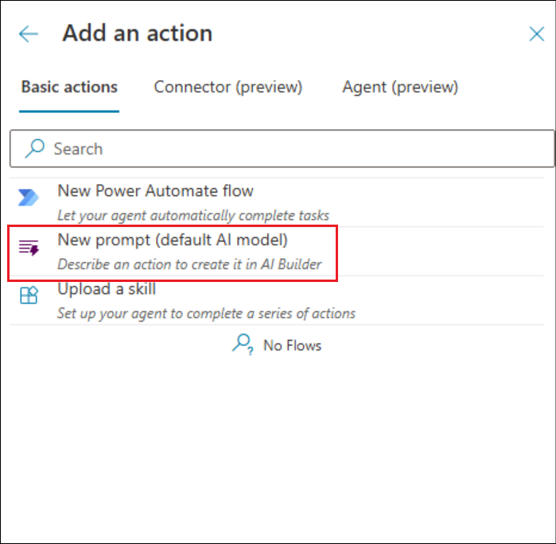

4.  La boîte de dialogue Invite s'affiche et un menu volant s'affiche
    pour vous guider dans la création de votre invite. Sélectionnez
    **Next** pour parcourir le guide.

5.  Nous allons créer une invite qui générera des questions pour un
    quiz. Entrez le nom de l'invite comme +++ Quiz Generator +++.

6.  Collez le contenu ci-dessous dans le champ Invite.

> +++Generate a quiz with \[number\] questions to cover this \[topic\].
> Decide on the format, such as multiple-choice questions or true/false
> statements. Use this \[format\]. Designate the correct answer within
> parentheses.+++
>
> Développez la section **Input** et sélectionnez **+ Add input**.

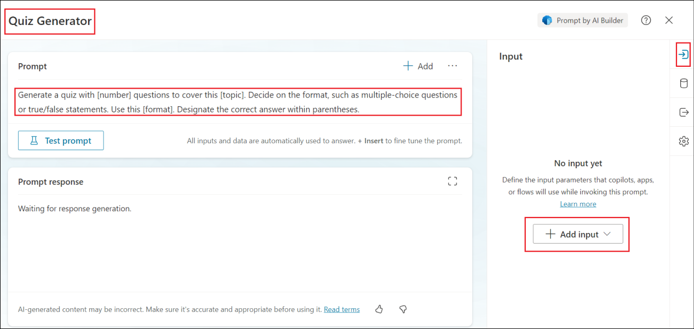

7.  Sélectionnez **Text** sous l'option **Add input**.

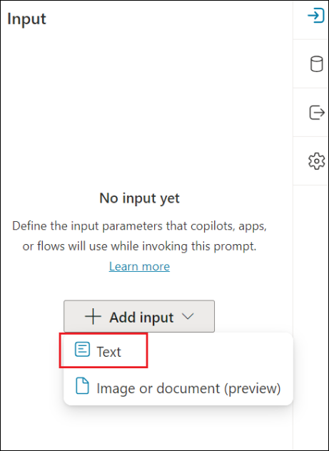

8.  Entrez le nom sous la forme +++ number+++ et entrez des exemples de
    données tels que +++5+++. Sélectionnez **+ Add input** -\> **Text**
    pour ajouter l'entrée suivante.

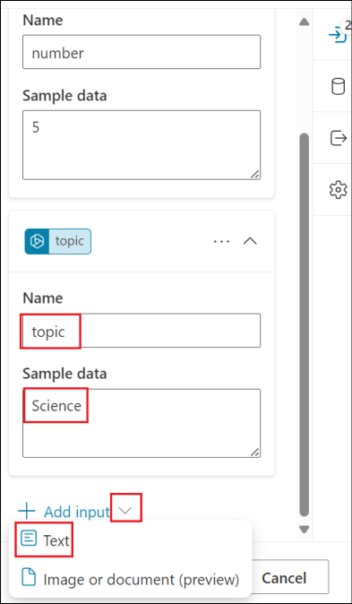

9.  Entrez le nom sous la forme +++topic+++ et entrez des exemples de
    données tels que +++Science+++, puis sélectionnez **+ Add input**
    -\> **Text** pour ajouter l'entrée suivante.

\

11. Entrez le nom sous la forme +++format+++ et entrez des exemples de
    données tels que +++bullet points+++

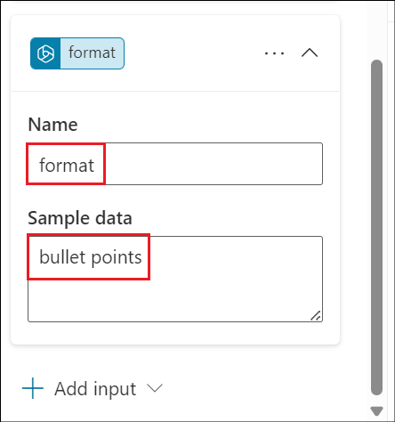

12. Maintenant que nous avons ajouté les noms d'entrée et les données
    d'exemple. Ensuite, les entrées doivent être insérées dans l'invite.
    Dans l'invite, mettez en surbrillance **\[number\]** et sélectionnez
    **+ Add**, puis sélectionnez **number** sous **In your prompt**.
    L'entrée du nombre a maintenant été ajoutée à l'invite en tant
    qu'entrée.

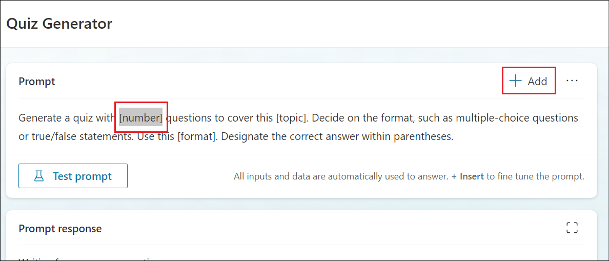

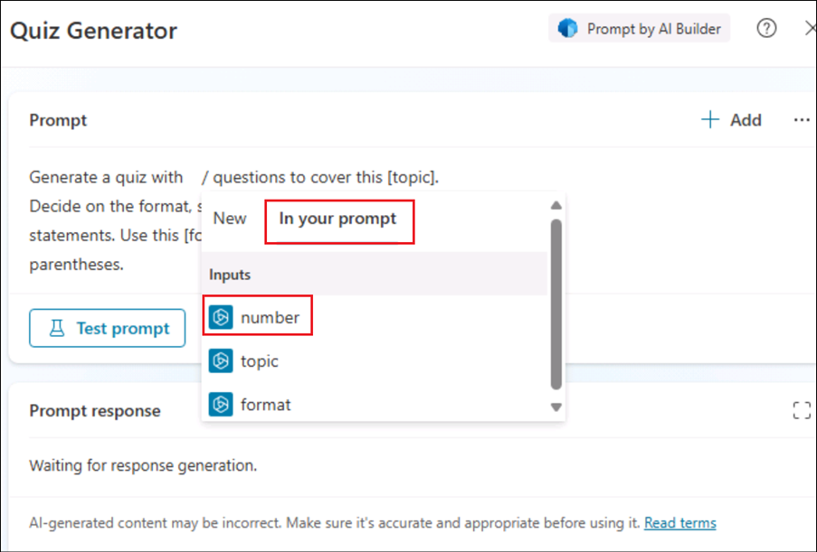

13. Répétez les mêmes étapes pour les autres entrées.

14. Une fois que toutes les entrées sont ajoutées à l'invite, cliquez
    sur **In your prompt** et observez la réponse de l'invite.

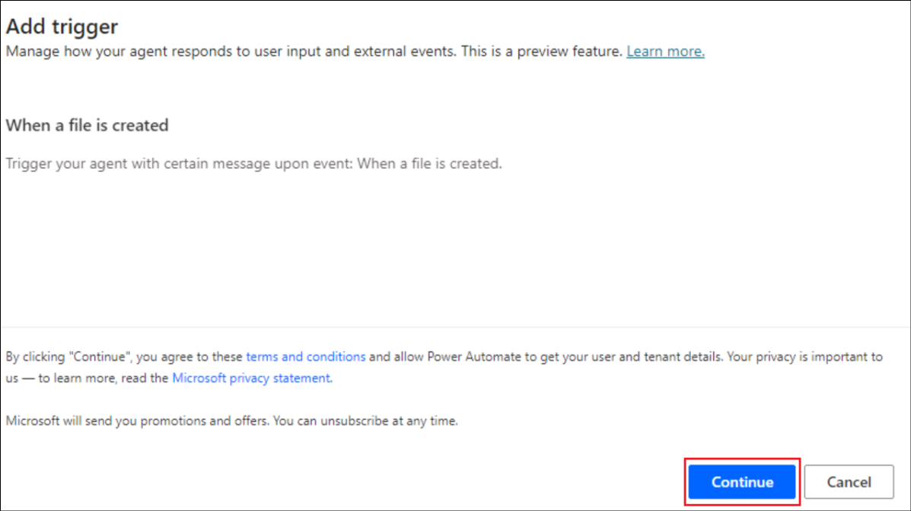

15. Sélectionnez **Save** pour enregistrer l'invite.

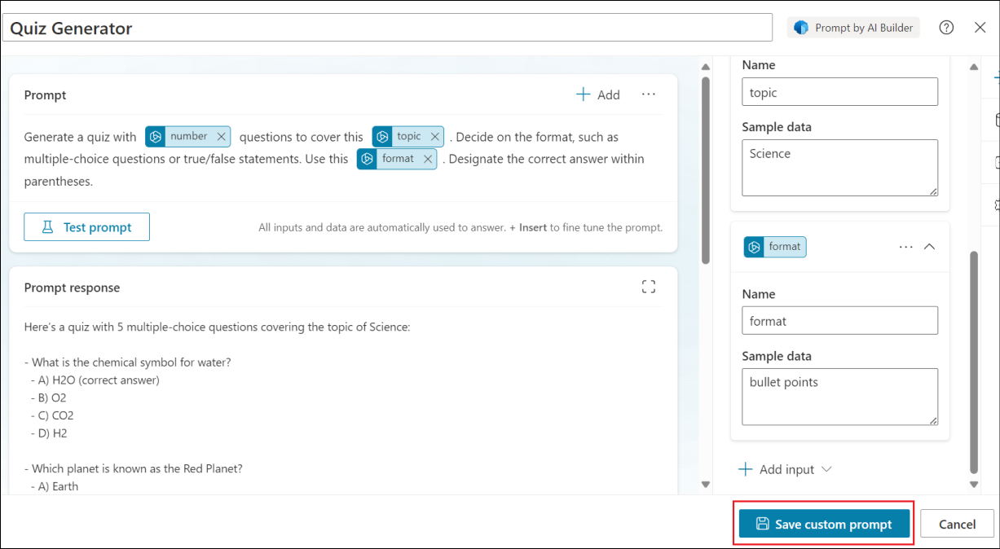

16. Le nœud d'action d'invite apparaît désormais dans le canevas de
    création de la rubrique. Ensuite, les valeurs du paramètre d'entrée
    doivent être définies pour que l'agent puisse les remplir.
    Sélectionnez l'**icon** \>

17. Sélectionnez l'onglet **System** et sélectionnez **Acivity.Text**
    comme valeur d'entrée pour l'action afin d'utiliser l'intégralité de
    la réponse de l'utilisateur et d'identifier la valeur de format.

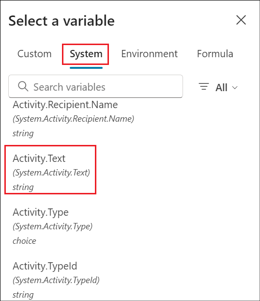

18. Répétez la même opération pour les autres paramètres d'entrée de
    l'action d'invite.

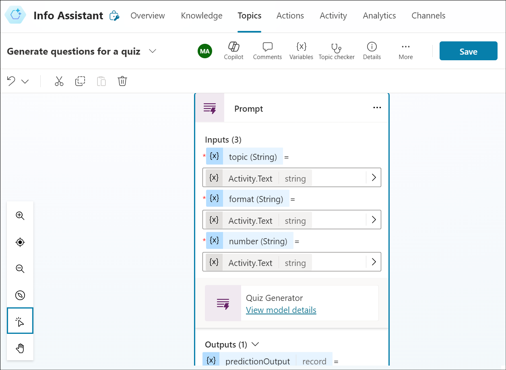

19. Ensuite, nous devons définir la variable de sortie de l'action
    d'invite. Cela permet de référencer la réponse en aval dans la
    rubrique. Sélectionnez l'icon **\>** et, dans l'onglet **Custom**,
    sélectionnez **Create New** et nommez la variable
    +++**VarQuizQuestionsResponse**+++.

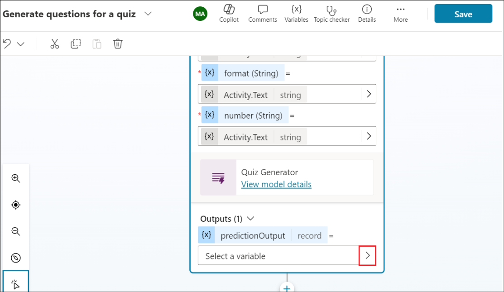

20. Sous l'action Inviter, sélectionnez l’icôn **+** pour ajouter un
    nouveau nœud et sélectionnez **Send a message**. Sélectionnez
    l'icône de la variable **{x}**.

21. Sélectionnez la variable **VarQuizQuestionsResponse.text**. Cela
    ajoutera la propriété text de la réponse à l'action d'invite au nœud
    Envoyer un message. Sélectionnez **Save** pour enregistrer votre
    sujet.

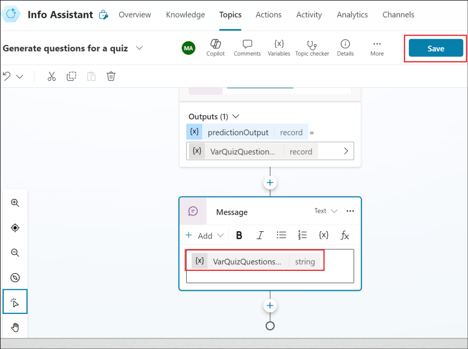

22. Les détails du sujet doivent ensuite être mis à jour et seront
    utilisés par votre agent pour associer le sujet à l'intention de
    l'utilisateur lorsque le mode génératif est activé. Sélectionnez
    **Détails** et entrez ce qui suit.

    - Display name - +++generate questions for a quiz+++

    - Description - +++This topic creates questions for a quiz based on
      the number of questions, the topic and format provided by the
      user+++

> Sélectionnez **Save** pour enregistrer votre sujet.

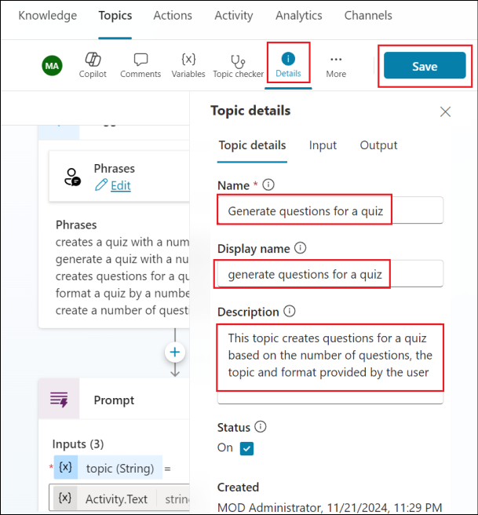

23. Maintenant, le **Generative mode** doit être activé pour que l'agent
    puisse appeler la rubrique avec l'action d'invite. Sélectionnez
    **Settings** de votre agent.

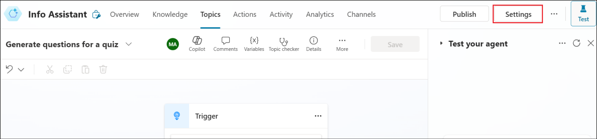

24. Sélectionnez le paramètre **Generative AI,** puis sélectionnez
    **Generative AI,** puis **Save**.

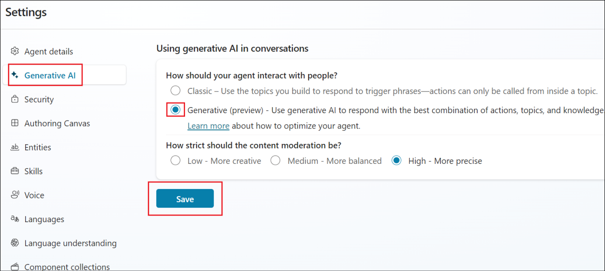

25. Nous sommes maintenant prêts à tester l'agent. Dans le volet de
    test, sélectionnez l'icône **refresh**. Entrez ensuite la question
    suivante et observez le résultat.

+++Create 5 questions for a quiz based on geography and format the quiz
as multi choice+++

> 

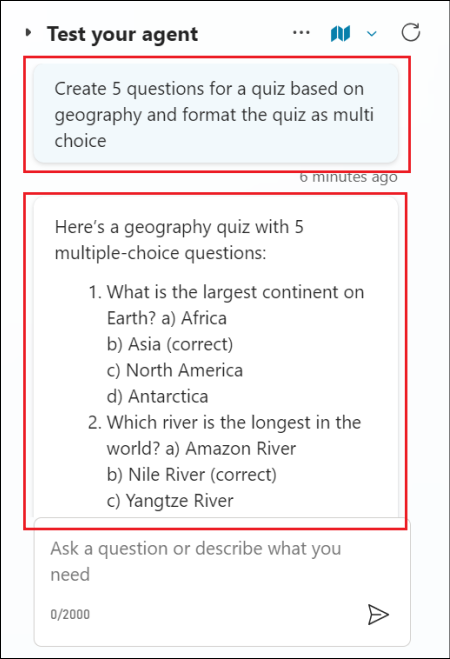

**Résumé**

Dans cet atelier, nous avons appris à créer une action d'invite pour un
sujet en créant une invite personnalisée et en la testant.

