# Laboratorio 10: Implemente acción de prompt para el tema de un agente de generación de cuestionarios

**Objetivo:**

Las acciones de Prompt son una de las formas de ampliar Microsoft
Copilots. Para ello, crean acciones de lenguaje natural específicas de
la empresa. El modelo GPT interpreta las acciones para realizar la
acción necesaria según las instrucciones. Estas acciones se encapsulan
dentro de una definición de plugin de IA, que los copilots pueden
invocar en tiempo de ejecución cuando se encuentra una intención o
expresión coincidente.

En este laboratorio, aprenderá a crear una acción de prompt para un tema
de generación de cuestionarios que generará preguntas de cuestionario
basadas en un tema determinado.

## Ejercicio 1: Use el lenguaje natural para crear un agente

1.  Abra un navegador e inicie sesión en
    +++<https://copilotstudio.microsoft.com/+++> e inicie sesión con las
    credenciales de la pestaña Resources si aún no está en esa página.

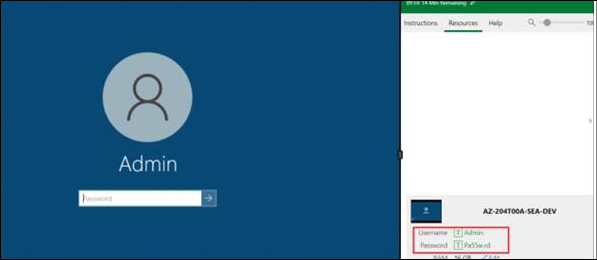

2.  Si ya está en la página de Copilot Studio, haga clic en **Home**
    para ir a la página de inicio.

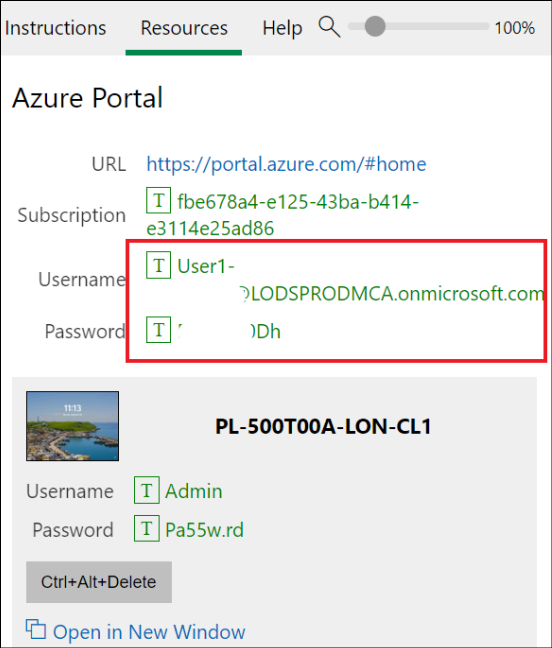

3.  En la página de inicio, en el área de texto debajo de Describe your
    agent to create it, introduzca +++I want you to be a question and
    answering assistant that can answer common questions from users
    using the content of a website+++ y haga clic en **Send**.

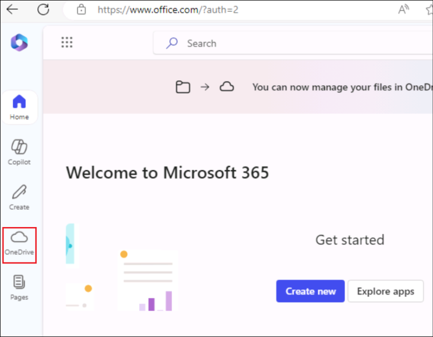

4.  Podría sugerir un nombre para el agente. Acéptelo o proporcione su
    propio nombre.

5.  Proporcione otros detalles sobre las funciones del agente como se
    muestra a continuación.

> +++help answer common product and support questions using the content
> of a website, and help answer HR questions from an uploaded file+++

6.  Proporcione
    +++[www.microsoft.com+++](http://www.microsoft.com+++/) Para el
    sitio web que se utilizará, una fuente de conocimiento.

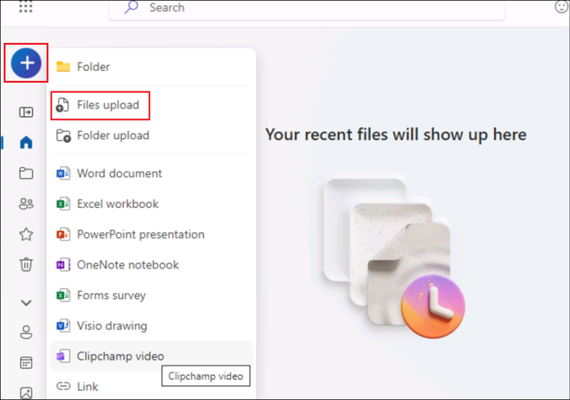

7.  Una vez que hayas terminado de dar instrucciones, haga clic en
    **Create** para crear su agente.

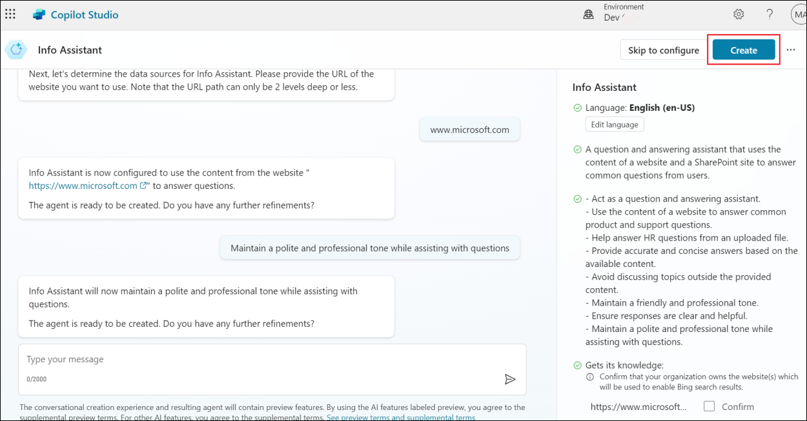

8.  El agente se crea y se abre con los detalles. Desplácese por la
    página para comprender que el agente se ha creado con las
    instrucciones que le ha proporcionado.

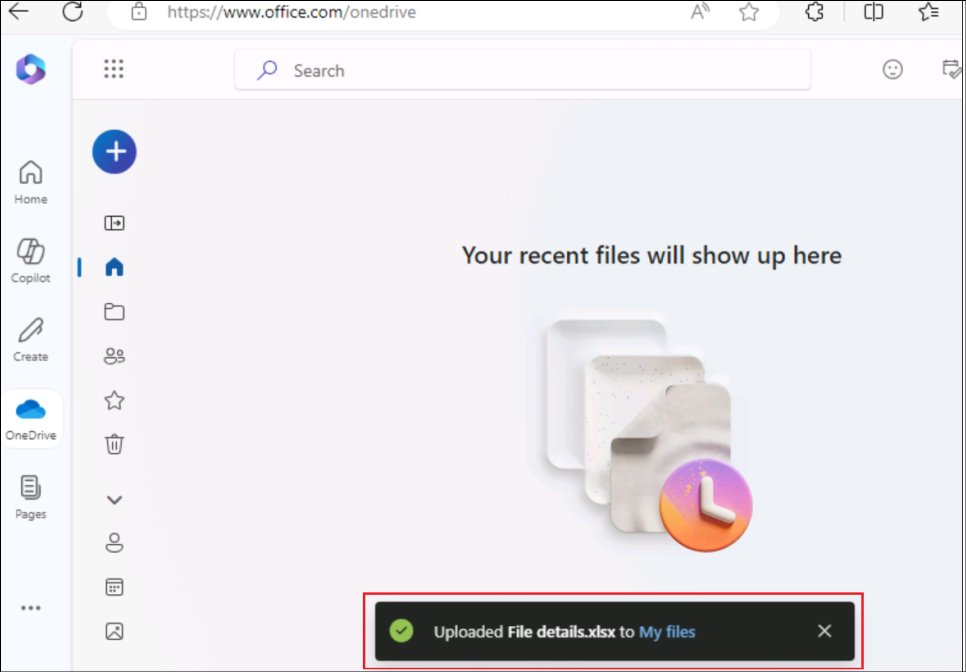

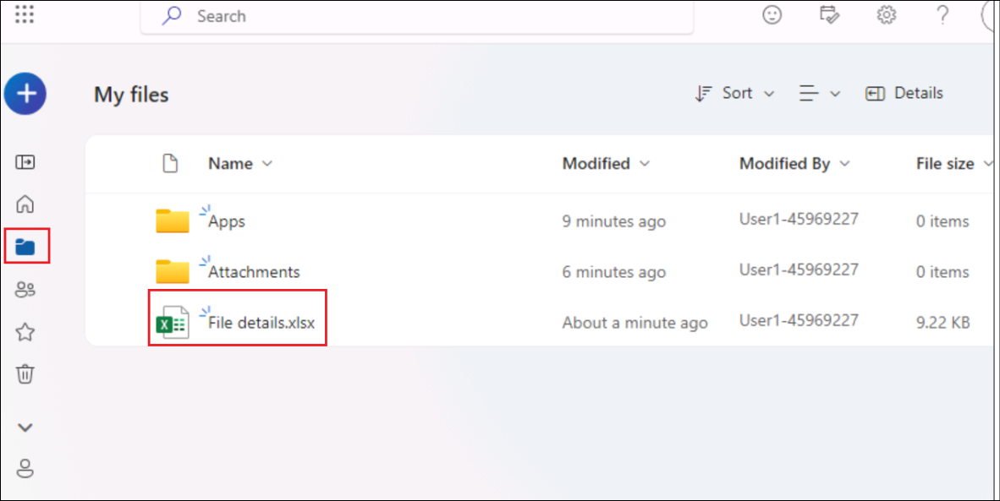

9.  Haga clic en el icono **Test** para Test the agent. Introduzca
    +++What is Copilot Studio+++ y presione **Enter**.

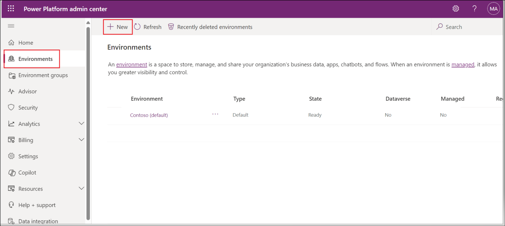

10. Introduzca +++What is the latest xbox model?+++

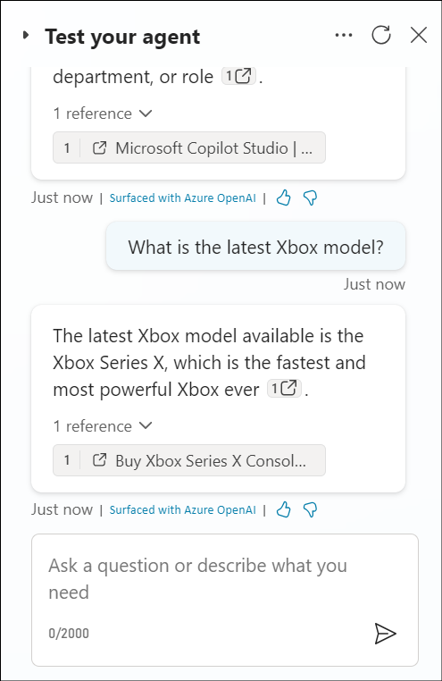

> Para los dos pasos anteriores, obtendrá una respuesta del agente que
> será genérica, ya que el agente utilizará sus conocimientos generales.

## Ejercicio 2: Cree un Prompt action para un Topic de respuestas generativas

Las acciones se pueden utilizar para ampliar las capacidades de los
agentes. Puede agregar varios tipos de acciones a sus agentes en
Microsoft Copilot Studio:

- **Prebuilt connector action**, que utilizan conectores de Power
  Platform para acceder a datos de otros sistemas, como productos
  empresariales populares como Salesforce, Zendesk, MailChimp y GitHub.

- **Custom connector action**, donde se puede crear un conector para
  acceder a datos de API públicas o privadas.

- **Power Automate cloud flow**, que usan flujos de nube de Power
  Automate para realizar acciones, recuperar y trabajar con datos.

- **AI Builder prompts**, que utilizan AI Builder y la comprensión del
  lenguaje natural para dirigirse a los escenarios y flujos de trabajo
  específicos dentro de su empresa.

- **Bot Framework skill**, que utilizan el skill manifest que describe
  las acciones que puede realizar la aptitud, incluidos sus parámetros
  de entrada y salida, los puntos finales de la aptitud y los modelos de
  envío de la aptitud.

En este ejercicio, aprenderá a agregar un prompt a la acción a un topic
node

1.  En su agente seleccione la pestaña **Topics**, seleccione **+ Add a
    topic** y seleccione **From blank**.

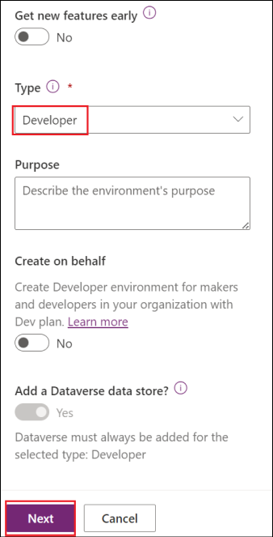

2.  Introduzca el nombre de Topic como +++Generate questions for a
    quiz+++. Seleccione el **Edit** hyperlink en Phrases en el trigger.
    Se debe ingresar un mínimo de 5 frases de trigger

> Agregue las siguientes frases una por una. Agregue cada frase y
> seleccione la opción + para agregar el disparador.
>
> +++create a number of questions for a quiz based on a topic and format
> the quiz based on the instruction provided+++
>
> +++creates a quiz with a number of questions based on the topic
> provided and formats the quiz+++
>
> +++generate a quiz with a number of questions using the topic provide
> and format the questions+++
>
> +++creates questions for a quiz on a specific topic and format+++
>
> +++format a quiz by a number of questions based on the topic
> provided+++
>
> Seleccione **Save** en la parte superior derecha para guardar el tema.

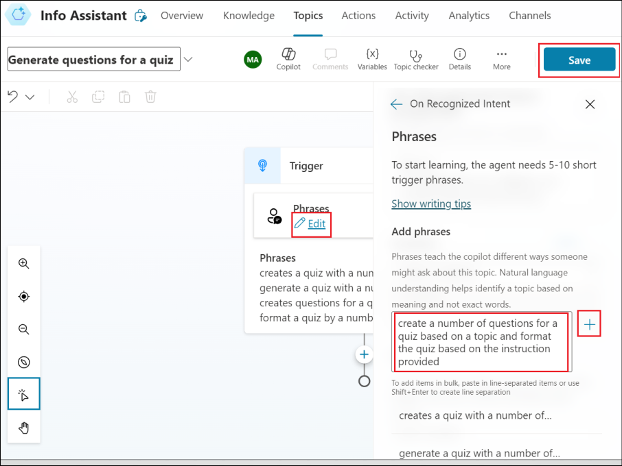

3.  Haga clic en el **símbolo +** debajo del nodo Trigger. Seleccione la
    opción **Add an action** y seleccione **New prompt (default AI
    model)** en ella.

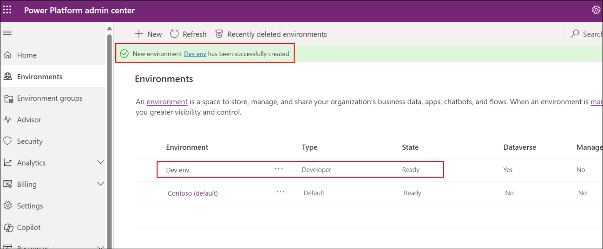

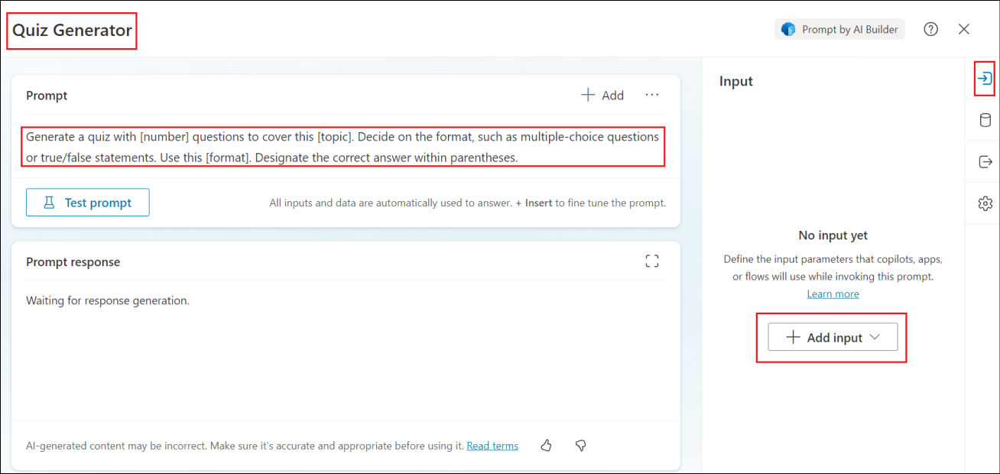

4.  Aparecerá el dialógo Prompt, Y es posible que vea aparecer un
    control flotante que le guiará sobre cómo crear su prompt.
    Seleccione **Next** para ir a la guía.

5.  Crearemos un mensaje que generará preguntas para un cuestionario.
    Introduzca el nombre de prompt como +++Quiz Generator+++.

6.  Pegue el siguiente contenido en el campo Prompt.

> +++Generate a quiz with \[number\] questions to cover this \[topic\].
> Decide on the format, such as multiple-choice questions or true/false
> statements. Use this \[format\]. Designate the correct answer within
> parentheses.+++
>
> Expanda la sección **Input** y seleccione **+ Add input**.

7.  Seleccione **Text** en la opción **Add input**.

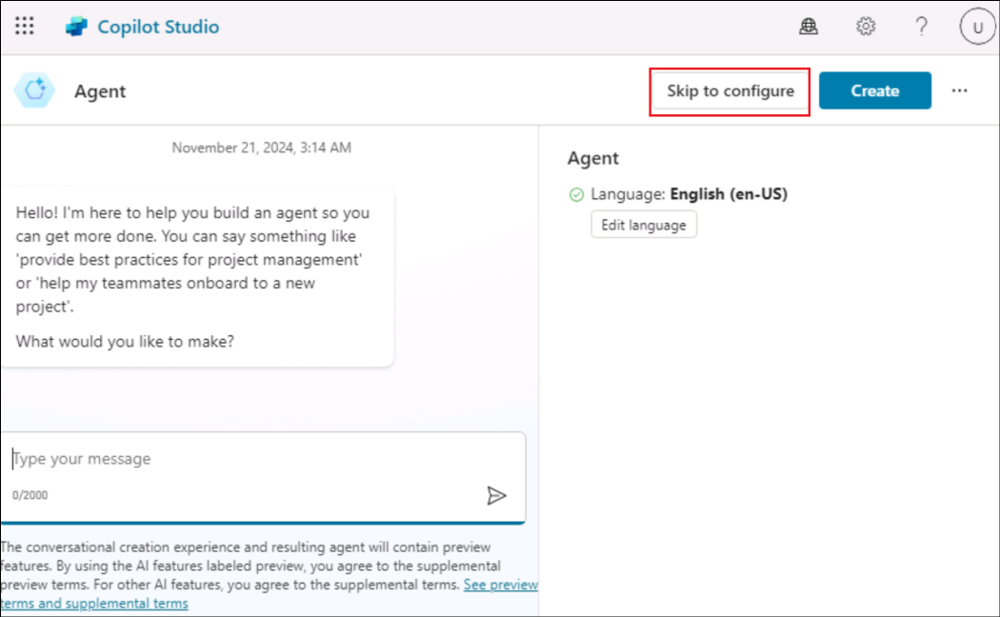

8.  Introduzca el nombre como +++number+++ e introduzca datos de muestra
    como +++5+++. Seleccione **+ Add input** -\> **Text** para agregar
    la siguiente entrada.

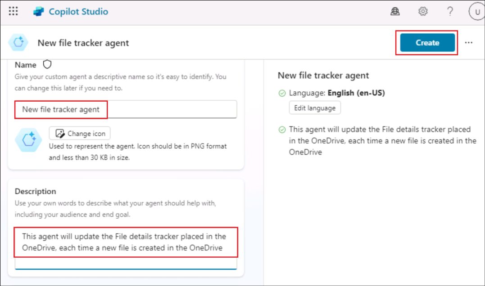

9.  Introduzca el nombre como +++topic+++ e introduzca datos de muestra
    como +++Science+++ and then select **+ Add input** -\> **Text** para
    agregar la siguiente entrada.

\

11. Introduzca el nombre como +++format+++ e introduzca datos de muestra
    como +++bullet points+++

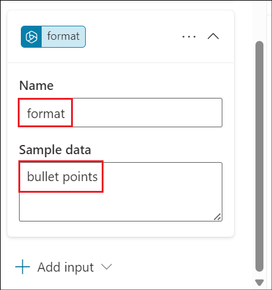

12. Ahora que hemos agregado los nombres de entrada y los datos de
    ejemplo. A continuación, las entradas deben insertarse en el prompt.
    En el Prompt, destaque **\[number\]** y seleccione **+ Add** y
    seleccione **number** en **In your prompt**. La entrada de number
    ahora se ha agregado a prompt como una entrada.

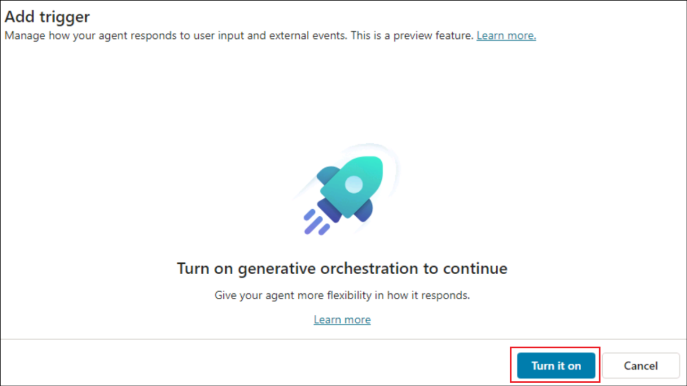

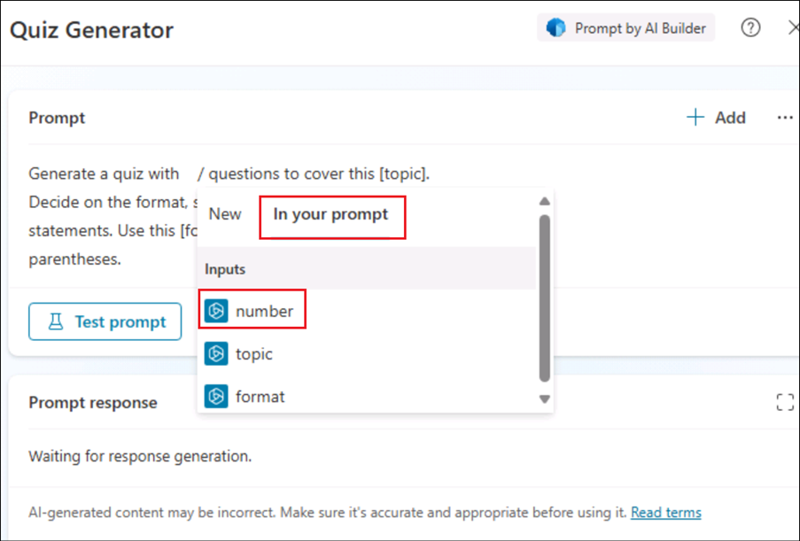

13. Repita los mismos pasos para las entradas restantes.

14. Una vez que se hayan agregado todas las entradas al prompt, haga
    clic en **Test prompt** y observe la respuesta del prompt.

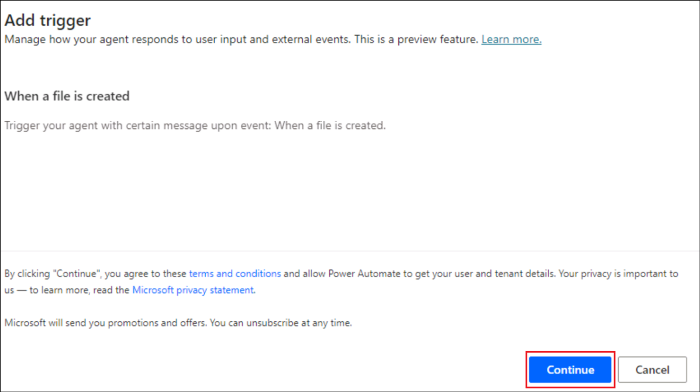

15. Seleccione **Save** para guardar el prompt.

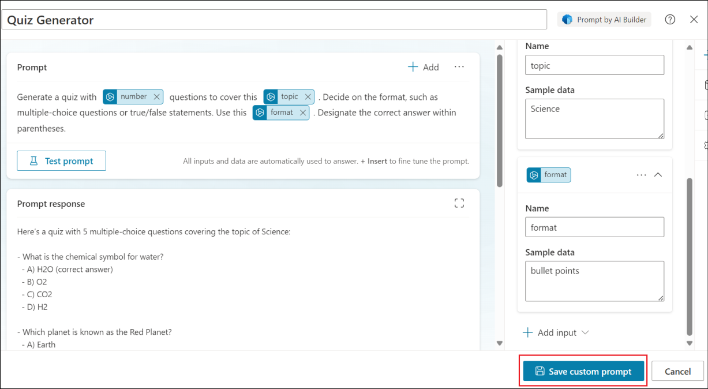

16. El nodo de acción de prompt aparecerá ahora en el lienzo de creación
    del tema. A continuación, se deben definir los valores del parámetro
    de entrada para que el agente los rellene. Seleccione el **icono**
    \>

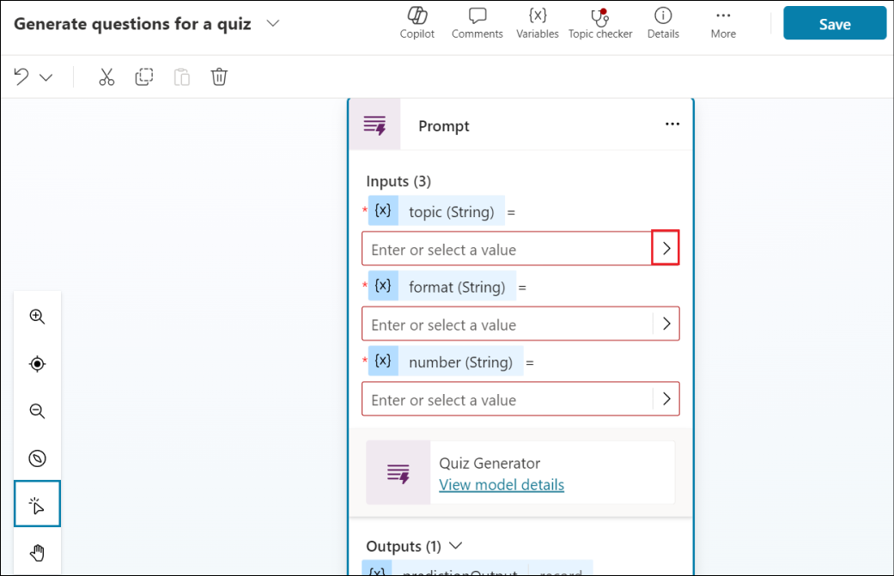

17. Seleccione la pestaña **System** y seleccione **Acivity.Text** como
    valor de entrada de la acción para utilizar toda la respuesta del
    usuario e identificar el valor de formato.

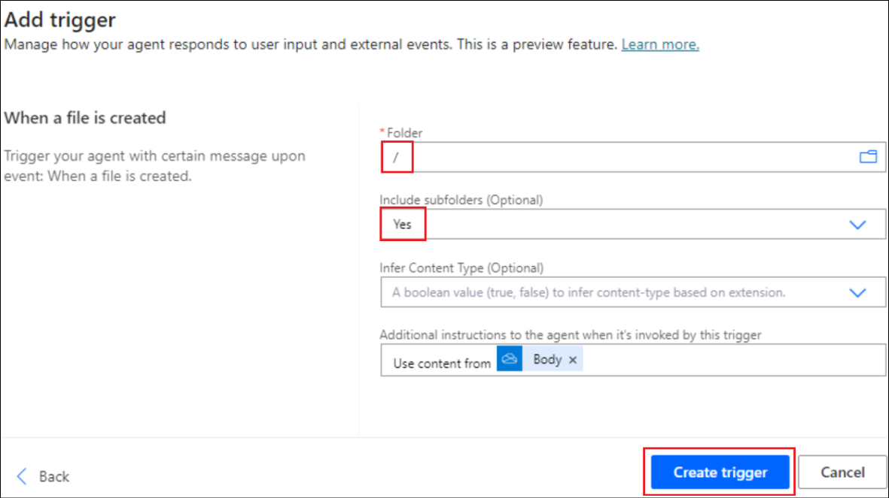

18. Repita lo mismo para los parámetros de entrada restantes de la
    acción de prompt.

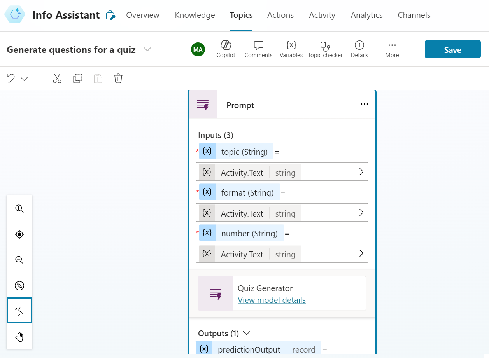

19. A continuación, debemos definir la variable de salida de la acción
    de propmt. Esto es para que se pueda hacer referencia a la respuesta
    más adelante en el tema. Seleccione el icono **\>** y en la
    pestaña **Custom**, seleccione **Create new** y nombra la variable
    como +++**VarQuizQuestionsResponse**+++.

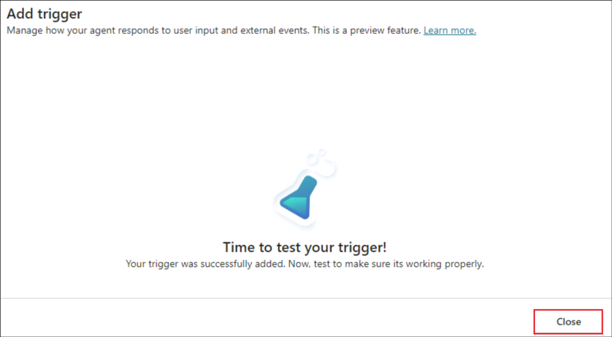

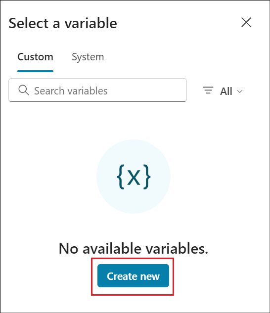

20. Debajo de Prompt action, Seleccione el **icono +** para agregar un
    nuevo nodo y seleccione **Send a message**. Seleccione el icono de
    variable **{x}** .

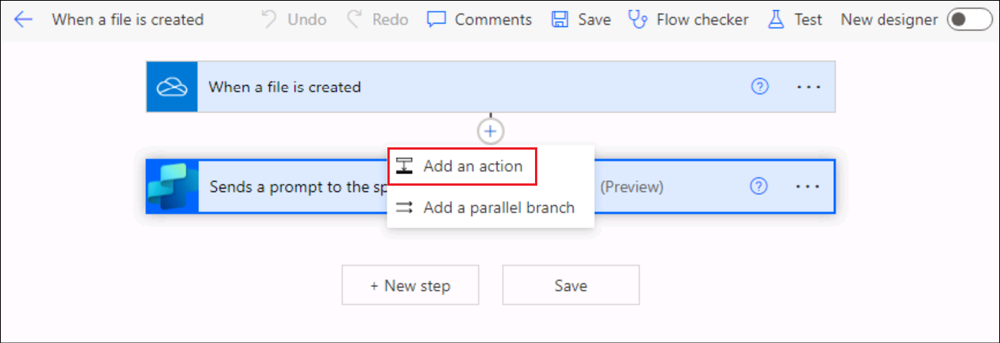

21. Seleccione la variable **VarQuizQuestionsResponse.text**. Esto
    agregará la propiedad text de la respuesta de acción de prompt al
    nodo enviar un mensaje. Seleccione **Save** para guardar el tema.

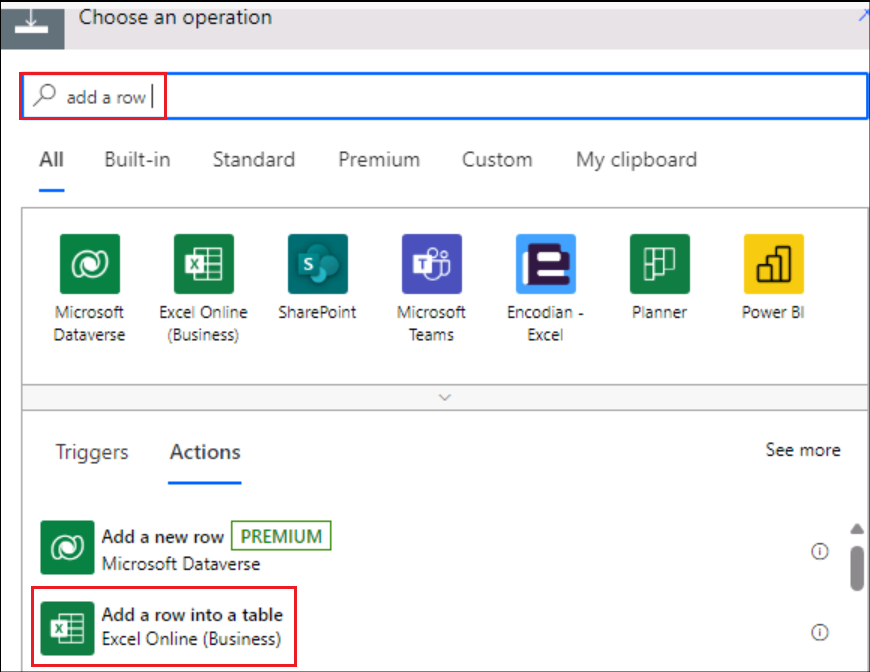

22. A continuación, se deben actualizar los detalles del tema, que
    utilizará el agente para asociar el tema con la intención del
    usuario cuando el modo Generative esté habilitado.
    Seleccione **Details** e introduzca lo siguiente.

    - Display name - +++generate questions for a quiz+++

    - Description - +++This topic creates questions for a quiz based on
      the number of questions, the topic and format provided by the
      user+++

Seleccione **Save** para guardar el tema.

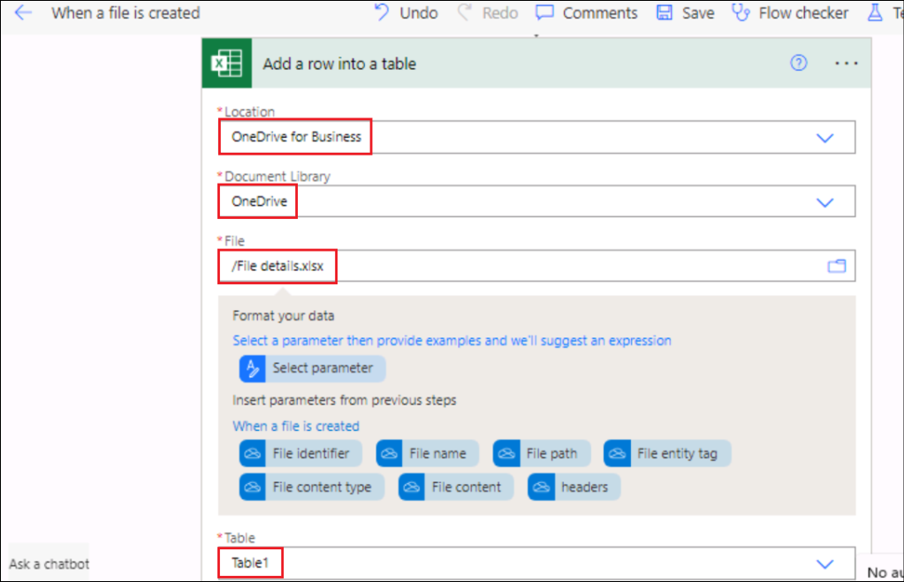

23. Ahora, el **Generative mode** debe estar habilitado para que el
    agente llame al tema con la acción de propmt. Seleccione
    **Settings** para su agente.

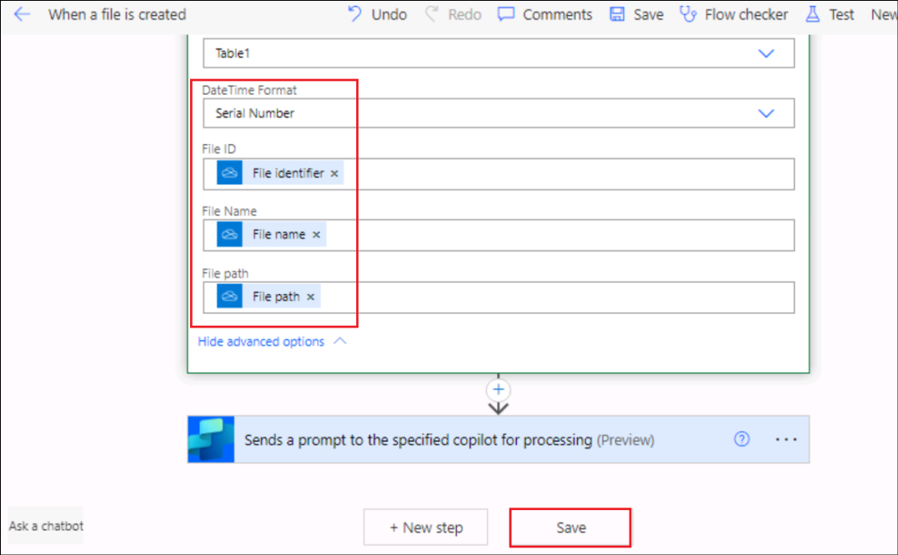

24. Seleccione el **Generative AI** y seleccione **Generate
    (preview)** a continuación, seleccione **Save**.

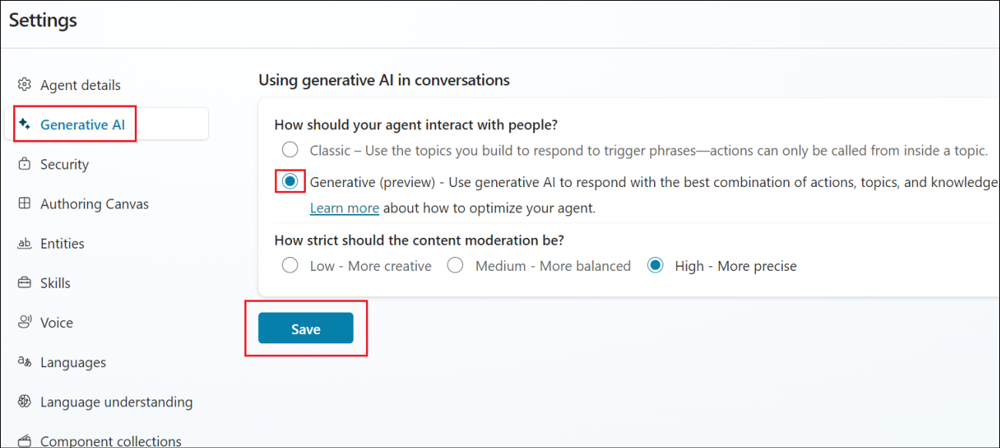

25. Ahora estamos listos para probar el agente. En el panel de prueba,
    seleccione el icono de **actualización**. A continuación, introduzca
    la siguiente pregunta y observe el resultado.

+++Create 5 questions for a quiz based on geography and format the quiz
as multi choice+++

> 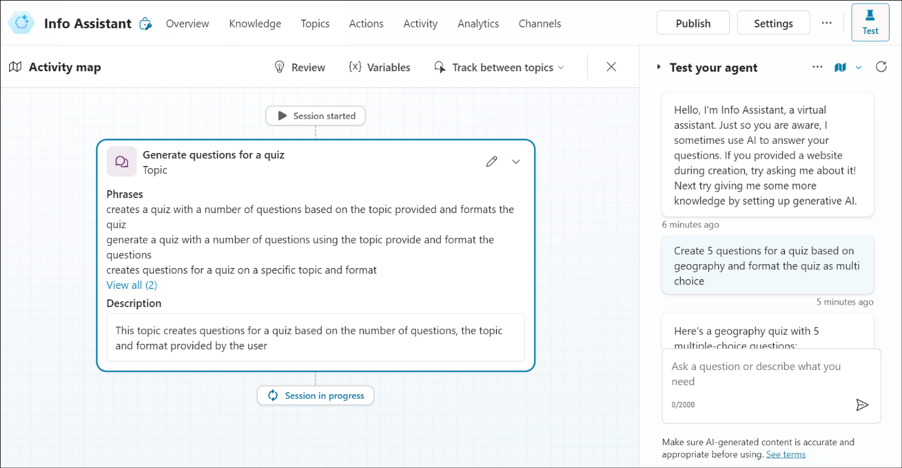
>
> 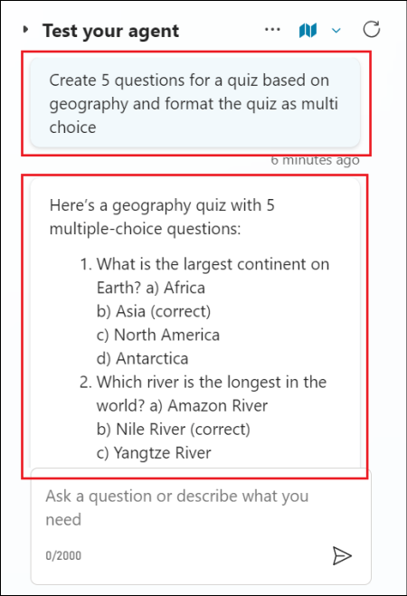

**Resumen**

En este laboratorio, hemos aprendido a crear una acción de prompt para
un tema mediante la creación de un prompt personalizado y probarlo.

m365cpltdeplextdepth/Instructions/Lab 10/Lab10.md at
m365cpltdeplextdepth-Dec2K24 · technofocus-pte/m365cpltdeplextdepth

 
