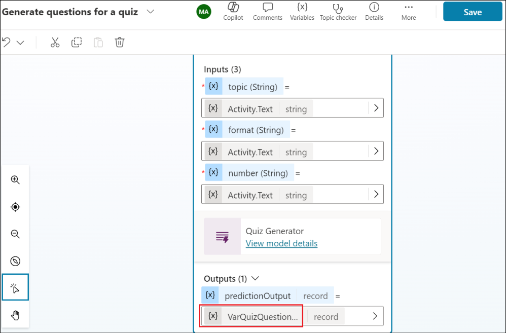
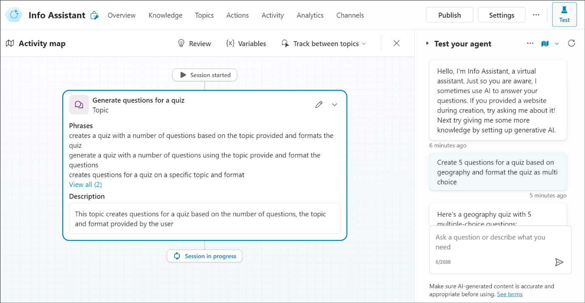

Laboratorio 10: Implementar acción inmediata para un agente de
generación de cuestionarios sobre temas

## Ejercicio 1: Utilizar lenguaje natural para crear un agente

1.  Abra un navegador e inicie sesión en
    +++<https://copilotstudio.microsoft.com/+++> e inicie sesión con las
    credenciales de la pestaña Resources si aún no se encuentra en esa
    página.

2.  Si ya se encuentra en la página de Copilot Studio, haga clic en
    **Home** para ir a la página de inicio.

3.  En la página de inicio, en el área de texto debajo de Describe your
    agent to create it, ingrese +++I want you to be a question and
    answering assistant that can answer common questions from users
    using the content of a website+++ y haga clic en **Send**.

4.  Podría sugerir un nombre para el agente. Acepte el sugerido o
    proporcione uno propio.

5.  Proporcione otros detalles sobre las funciones del agente, como se
    indica a continuación.

> +++help answer common product and support questions using the content
> of a website, and help answer HR questions from an uploaded file+++

6.  Proporcione +++www.microsoft.com+++ para el sitio web que se
    utilizará como fuente de conocimiento.

7.  Una vez que haya terminado de dar las instrucciones, haga clic
    en **Create** para crear su agente.

8.  El agente se crea y se abre con los detalles. Desplácese por la
    página para comprender que el agente se ha creado con las
    instrucciones que ha proporcionado.

9.  Haga clic en el icono **Test** para probar el agente. Ingrese
    +++What is Copilot Studio+++ y presione **Enter**.

10. Ingrese +++What is the latest xbox model?+++

Para ambos pasos anteriores, recibirá una respuesta del agente, que será
genérica, ya que el agente utilizará sus conocimientos generales.

## Ejercicio 2: Crear una acción de prompt para generar respuestas sobre un tema 

Las acciones se pueden utilizar para ampliar las características de los
agentes. Puede agregar varios tipos de acciones a sus agentes en
Microsoft Copilot Studio:

- **Prebuilt connector action**, que utilizan conectores de Power
  Platform para acceder a datos de otros sistemas, como productos
  empresariales populares como Salesforce, Zendesk, MailChimp y GitHub.

- **Custom connector action**, donde se puede crear un conector para
  acceder a datos desde APIs públicas o privadas.

- **Power Automate cloud flow**, que utilizan flujos en la nube de Power
  Automate para realizar acciones, recuperar datos y trabajar con ellos.

- **AI Builder prompts**, que utilizan AI Builder y la comprensión del
  lenguaje natural para adaptarse a los escenarios y flujos de trabajo
  específicos de su negocio.

- **Bot Framework skill**, que utilizan el manifiesto de habilidades que
  describe las acciones que puede realizar la habilidad, incluidos sus
  parámetros de entrada y salida, los endpoints de la habilidad y los
  modelos de envío para la habilidad.

En este ejercicio, aprenderá a añadir un prompt de acción a un nodo de
tema.

1.  En su agente, seleccione la pestaña **Topics**, seleccione **+ Add a
    topic** y seleccione **From blank**.

2.  Ingrese el nombre del tema como +++Generate questions for a quiz+++.
    Seleccione el hipervínculo **Edit** debajo de Phrases en el
    desencadenador. Es necesario ingresar un mínimo de 5 frases
    desencadenadoras.

> Añada las frases siguientes una por una. Añada cada frase y seleccione
> la opción + para añadir el desencadenante.
>
> +++create a number of questions for a quiz based on a topic and format
> the quiz based on the instruction provided+++
>
> +++creates a quiz with a number of questions based on the topic
> provided and formats the quiz+++
>
> +++generate a quiz with a number of questions using the topic provide
> and format the questions+++
>
> +++creates questions for a quiz on a specific topic and format+++
>
> +++format a quiz by a number of questions based on the topic
> provided+++
>
> Seleccione **Save** en la parte superior derecha para guardar el tema.

3.  Haga clic en el símbolo **+** situado bajo el nodo Trigger.
    Seleccione la opción **Add an action** y, debajo, la opción **New
    prompts (default AI model)**.

4.  Aparecerá el cuadro de diálogo del prompt, y puede que vea aparecer
    un flyout que le guiará sobre cómo crear su prompt.
    Seleccione **Next** para seguir la guía.

5.  Crearemos prompts que generarán preguntas para un cuestionario.
    Ingrese el nombre para el prompt como +++Quiz Generator+++.

6.  Pegue el siguiente contenido en el campo Prompt.

> +++Generate a quiz with \[number\] questions to cover this \[topic\].
> Decide on the format, such as multiple-choice questions or true/false
> statements. Use this \[format\]. Designate the correct answer within
> parentheses.+++
>
> Amplíe la sección **Input** y seleccione **+ Add input**.

7.  Seleccione **Text** en la opción **Add input**.

8.  Ingrese el nombre como +++number+++ e ingrese datos de muestra como
    +++5+++. Seleccione **+ Add input** -\> **Text** para añadir la
    siguiente entrada.

9.  Ingrese el nombre como +++topic+++ e ingrese datos de muestra como
    +++Science+++ y luego seleccione **+ Add input** -\> **Text** para
    agregar la siguiente entrada.

\

11. Ingrese el nombre como +++format+++ e ingrese datos de muestra como
    +++bullet points +++

12. Ahora que hemos añadido los nombres de las entradas y los datos de
    ejemplo. A continuación, hay que insertar los datos de entrada en el
    prompt. En el prompt, resalte **\[number \]** y seleccione **+
    Add** y seleccione **number** en **In your prompt**. La entrada de
    número se ha añadido ahora al prompt como entrada.

13. Repita los mismos pasos para las entradas restantes.

14. Una vez añadidas todas las entradas al prompt, pulse sobre **Test
    prompt** y observe la respuesta del prompt.

15. Seleccione **Save** para guardar el prompt.

16. El nodo de acción de prompt aparecerá ahora en el lienzo de autoría
    del Topic. A continuación, es necesario definir los valores del
    parámetro de entrada para que el agente los rellene. Seleccione el
    icono **\>**.

17. Seleccione la pestaña **System** y seleccione **Acivity.Text** como
    valor de entrada de la acción para utilizar la respuesta completa
    del usuario e identificar el valor de formato.

18. Repita lo mismo para el resto de parámetros de entrada de la acción
    de prompt.

19. A continuación, tenemos que definir la variable de salida de la
    acción de prompt. Esto es para que la respuesta pueda ser
    referenciada aguas abajo en el tema. Seleccione el icono **\>** y en
    la pestaña **Custom**, seleccione **Create new** y y nombre la
    variable como **+++VarQuizQuestionsResponse**+++.

20. Debajo de la acción Prompt, seleccione el icono **+** para añadir un
    nuevo nodo y seleccione **Send a message**. Seleccione el icono de
    variable **{x}**.

21. Seleccione la variable **VarQuizQuestionsResponse.text**. Esto
    añadirá la propiedad text de la respuesta de la acción prompt al
    nodo de enviar un mensaje. Seleccione **Save** para guardar su tema.

22. A continuación debe actualizar los detalles del tema, que serán
    utilizados por su agente para asociar el tema a la intención del
    usuario cuando se active el modo generativo.
    Seleccione **Details** e ingrese lo siguiente.

    - Display name - +++generate questions for a quiz+++

    - Description - +++This topic creates questions for a quiz based on
      the number of questions, the topic and format provided by the
      user+++

> Seleccione **Save** para guardar su topic (tema).

23. Ahora, es necesario activar el ajuste **Generative mode** para que
    el agente llame al tema con la acción de prompt.
    Seleccione **Settings** para su agente.

24. Seleccione el ajuste **Generative AI** y seleccione **Generate
    (preview)** seguido de **Save**.

25. Ahora estamos listos para probar el agente. En el panel de prueba,
    seleccione el icono de **refresh**. A continuación, ingrese la
    siguiente pregunta y observe el resultado.

+++Create 5 questions for a quiz based on geography and format the quiz
as multi choice+++

> 

**Resumen**

En este laboratorio, hemos aprendido a crear una acción de prompt para
un tema creando un prompt personalizado y probándolo.
