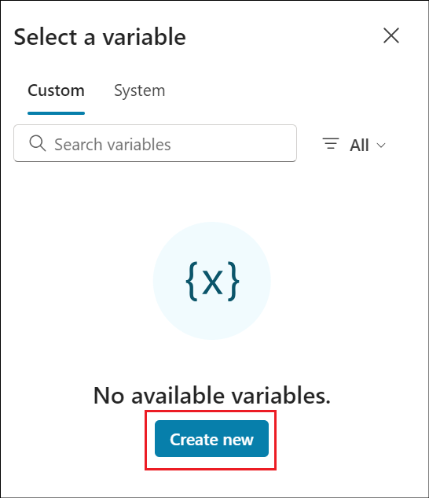

# 실습 10: 퀴즈 생성 에이전트의 주제에 대한 프롬프트 작업 구현하기

## 연습1: 자연어를 사용하여 에이전트 생성하기

1.  브라우저를 열고
    +++[https://copilotstudio.microsoft.com/++에](https://copilotstudio.microsoft.com/+++)
    로그인한 후 해당 페이지에 아직 없는 경우 Resources탭의 자격 증명으로
    로그인하세요.

2.  이미 Copilot Studio 페이지에 있는 경우 **Home** 을 클릭하여 홈
    페이지로 이동하세요.

3.  Home 페이지의 Describe your agent to create it 아래의 텍스트
    영역에+++I want you to be a question and answering assistant that
    can answer common questions from users using the content of a
    website+++를 입력하고**Send**를 클릭하세요.

4.  에이전트의 이름을 제안할 수 있습니다. 수락하거나 자신의 이름을
    제공하세요.

5.  에이전트의 기능에 대한 기타 세부 정보는 다음과 같습니다..

> +++help answer common product and support questions using the content
> of a website, and help answer HR questions from an uploaded file+++

6.  지식 소스로 사용할 웹 사이트에 대해
    [+++](http://www.microsoft.com+++/)www.microsoft.com+++를
    제공하세요.

7.  지침 제공이 완료되면 **Create**를 클릭하여 에이전트를 생성하세요.

8.  에이전트가 생성되고 세부 정보가 열리세요. 페이지를 스크롤하여
    에이전트가 제공된 지침에 따라 생성되었는지 확인하세요.

9.  **Test **아이콘을 클릭하여 에이전트를 테스트하세요. +++What is
    Copilot Studio+++를 입력하고**Enter**를 클릭하세요.

10. +++What is the latest xbox model?+++를 입력하세요

위의 두 단계 모두에 대해 에이전트가 일반 지식을 사용하기 때문에 일반적인
답변이 될 에이전트로부터 답변을 얻을 수 있습니다.

## 연습 2: 생성적 답변의 주제에 대한 프롬프트 작업을 생성하기

작업을 사용하여 에이전트의 기능을 확장할 수 있습니다. Microsoft Copilot
Studio에서 에이전트에 여러 유형의 작업을 추가할 수 있습니다:

- **Power Platform 커넥터를** 사용하여 Salesforce, Zendesk, MailChimp 및
  GitHub와 같은 인기 있는 엔터프라이즈 제품과 같은 다른 시스템의
  데이터에 액세스하는 사전 빌드된 커넥터 작업입니다.

- **사용자 지정 커넥터 작업**: 공용 또는 개인 API의 데이터에 액세스하기
  위해 커넥터를 빌드할 수 있습니다.

- **Power Automate 클라우드 플로우는** Power Automate 클라우드 흐름을
  사용하여 작업을 수행하고, 데이터를 검색하고, 작업합니다.

- **AI Builder 프롬프트** - AI Builder 및 자연어 이해를 사용하여
  비즈니스 내의 특정 시나리오 및 워크플로를 대상으로 합니다.

- **Bot Framework 기술** - 입력 및 출력 매개 변수, 기술의 엔드포인트 및
  기술에 대한 디스패치 모델을 포함하여 기술이 수행할 수 있는 작업을
  간략하게 설명하는 기술 매니페스트를 사용합니다.

이 연습에서는 주제 노드에 프롬프트 투 액션을 추가하는 방법을 학습합니다

1.  에이전트에서**Topics** 탭을 선택하고 **+ Add a topic**를
    선택하고**From blank**를 선택하세요.

2.  주제의 이름을 +++ Generate questions for a quiz +++으로 입력하세요.
    트리거의 문구 아래에서 **Edit** 하이퍼링크를 선택하세요. 최소 5개의
    트리거 문구를 입력해야 합니다.

> 아래 문구를 하나씩 추가하세요. 각 구문을 추가하고 + 옵션을 선택하여
> 트리거를 추가하세요.
>
> +++create a number of questions for a quiz based on a topic and format
> the quiz based on the instruction provided+++
>
> +++creates a quiz with a number of questions based on the topic
> provided and formats the quiz+++
>
> +++generate a quiz with a number of questions using the topic provide
> and format the questions+++
>
> +++creates questions for a quiz on a specific topic and format+++
>
> +++format a quiz by a number of questions based on the topic
> provided+++
>
> 오른쪽 위에서 **Save**을 선택하여 주제를 저장하세요.

3.  Trigger 노드 아래에 있는 **+** 기호를 클릭하세요. **Add an
    action** 옵션을 선택하고 해당 아래에서 **New prompt (default AI
    model)** 옵션을 선택하세요.

4.  프롬프트 대화 상자가 나타나고 프롬프트를 만드는 방법을 안내하는
    플라이아웃이 나타날 수 있습니다. **Next** 을 선택하여 가이드를
    진행하세요.

5.  퀴즈에 대한 질문을 생성하는 프롬프트를 생성할 것입니다. 프롬프트
    이름을 +++Quiz Generator++++로 입력하세요.

6.  아래 내용을 Prompt 필드에 붙여넣으세요.

> +++Generate a quiz with \[number\] questions to cover this \[topic\].
> Decide on the format, such as multiple-choice questions or true/false
> statements. Use this \[format\]. Designate the correct answer within
> parentheses.+++
>
> **Input** 섹션을 확장하고 **+ Add input**를 선택하세요.

7.  **Add input** 옵션에서 **Text**를 선택하세요.

8.  이름을 +++ number+++로 입력하고 샘플 데이터 (예: +++5+++)를
    입력하세요. 텍스트 입력을 추가하기 위해 **+ Add
    input** -\> **Text**를 선택하세요.

9.  이름을 +++topic+++로 입력하고 샘플 데이터(예: +++Science+++)를
    입력하고 다음 입력을 추가하기 위해 **+ Add input** -\> **Text**를
    선택하세요.

\

11. 이름을 +++format+++로 입력하고 샘플 데이터(예: +++ bullet
    points+++)를 입력하세요.

12. 이제 입력 이름과 예제 데이터를 추가했으므로 다음과 같습니다.
    다음으로, 프롬프트에 입력을 삽입해야 합니다. 프롬프트에서
    \[**number**\]를 강조 표시하고 + **Add** 를 선택한 **In your
    prompt**에서 **number** 를 선택하세요. 이제 숫자 입력이 프롬프트에
    입력으로 추가되었습니다.

13. 나머지 입력에 대해 동일한 단계를 반복하세요.

14. 모든 입력이 프롬프트에 추가되면 **Test prompt**를 클릭하고 프롬프트
    응답을 관찰하세요.

15. 프롬프트를 저장하기 위해 **Save**을 선택하세요.

16. 이제 프롬프트 작업 노드가 주제의 작성 캔버스에 나타납니다. 다음으로,
    에이전트가 채울 수 있도록 입력 매개 변수의 값을 정의해야 합니다.
    **\>** 아이콘을 선택하세요

17. **System** 탭을 선택하고 **Activity**를 선택하세요**. Text**를
    사용자의 전체 응답을 사용하고 형식 값을 식별하기 위한 작업에 대한
    입력 값으로 사용합니다.

18. 프롬프트 작업의 나머지 입력 매개 변수에 대해 동일한 작업을
    반복하세요.

19. 다음으로 프롬프트 액션의 출력 변수를 정의해야 합니다. 이렇게 하면
    응답이 주제의 다운스트림으로 참조될 수 있습니다. \> 아이콘을
    선택하고 **Custom** 탭에서 **Create new**를 선택하고 변수 이름을
    +++**VarQuizQuestionsResponse**+++로 지정하세요.

20. 프롬프트 작업 아래에서 + 아이콘을 선택하여 새 노드를 추가하고 **Send
    a message**를 선택하세요. **{x}** 변수 아이콘을 선택하세요.

21. **VarQuizQuestionsResponse.text** 변수를 선택하세요. 이렇게 하면
    프롬프트 작업 응답의 text 속성이 send a message 노드에 추가됩니다.
    주제를 저장하기 위해 **Save**를 선택하세요.

22. 다음으로 주제 세부 정보를 업데이트해야 하며, 이는 생성 모드가
    활성화되었을 때 에이전트가 주제를 사용자의 의도와 연결하는 데
    사용합니다. **Details**를 선택하고 다음을 입력하세요.

    - Display name - +++generate questions for a quiz+++

    - Description - +++This topic creates questions for a quiz based on
      the number of questions, the topic and format provided by the
      user+++

> 주제를 저장하기 위해**Save**를 선택하세요.

23. 이제 에이전트가 프롬프트 작업으로 주제를 호출할 수 있도록
    **Generative mode** 설정을 활성화해야 합니다. 에이전트에 대한
    Settings을 선택하세요.

24. **Generative AI** 설정을 선택하고 **Generate (preview)**를 선택한 후
    **Save**를 선택하세요.

25. 이제 에이전트를 테스트할 준비가 되었습니다. 테스트 창에서
    **refresh **아이콘을 선택하새요. 다음 질문을 입력하고 출력을
    관찰하새요.

+++Create 5 questions for a quiz based on geography and format the quiz
as multi choice+++

**요약**

이 실습에서는 사용자 지정 프롬프트를 만들어 주제에 대한 프롬프트 작업을
만들고 테스트하는 방법을 배웠습니다.

