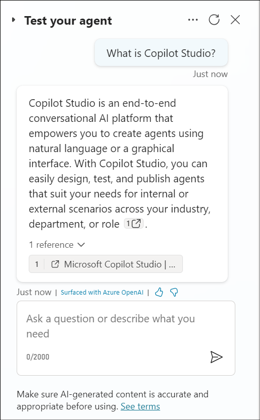

# Lab 10: Implementare un'azione tempestiva per l'argomento di un agente di generazione di quiz

## Esercizio 1: Utilizzare il linguaggio naturale per creare un agente

1.  Apri un browser e accedi a
    +++<https://copilotstudio.microsoft.com/+++> e accedi con le
    credenziali dalla **Resources tab** se non sei già in quella pagina.

2.  Se sei già sulla pagina di Copilot Studio, fai clic su **Home** per
    andare alla pagina Home.

3.  Nella Home page, nell'area di testo sotto Descrivi il suoi agente
    per crearlo, inserisci +++I want you to be a question and answering
    assistant that can answer common questions from users using the
    content of a website+++ e fai clic su **Send**.

4.  Potrebbe suggerire un nome per l'agente. Accettalo o fornisci il
    suoi nome.

5.  Fornisci altri dettagli sulle funzioni dell'agente come di seguito.

> +++help answer common product and support questions using the content
> of a website, and help answer HR questions from an uploaded file +++

6.  Fornisci +++[www.microsoft.com+++](http://www.microsoft.com+++/) per
    il sito web che verrà utilizzato come fonte di conoscenza.

7.  Una volta terminate le istruzioni, fai clic su **Create** per creare
    il suoi agente.

8.  L'agente viene creato e si apre con i dettagli. Scorri la pagina per
    capire che l'agente è stato creato con le istruzioni che hai fornito
    per esso.

9.  Fare clic sull 'icona **Test** per testare l'agente. Immettere
    +++What is Copilot Studio+++ e premere **Enter**.

10. Entra +++What is the latest xbox model?+++

Per entrambi i passaggi precedenti, riceverai una risposta dall'agente
che sarà generica poiché l'agente utilizzerà la sua conoscenza generale.

## Esercizio 2: Creazione di un'azione di richiesta per un argomento per le risposte generative

Le azioni possono essere utilizzate per estendere le funzionalità degli
agenti. È possibile aggiungere più tipi di azioni agli agenti in
Microsoft Copilot Studio:

- **Azione connettore predefinita**, che utilizza i connettori Power
  Platform per accedere ai data da altri sistemi, ad esempio i prodotti
  aziendali più diffusi come Salesforce, Zendesk, MailChimp e GitHub.

- **Azione connettore personalizzata**, in cui è possibile creare un
  connettore per accedere ai data da API pubbliche o private.

- **Flusso cloud Power Automate**, che utilizza i flussi cloud Power
  Automate per eseguire azioni, recuperare e lavorare con i data.

- **Prompt di AI Builder**, che usano AI Builder e la comprensione del
  linguaggio naturale per individuare gli scenari e i flussi di lavoro
  specifici all'interno dell'azienda.

- **Competenza Bot Framework**, che usa il manifesto della competenza
  che delinea le azioni che la competenza può eseguire, inclusi i
  parametri di input e output, i punti finali della competenza e i
  modelli di invio per la competenza.

In questo esercizio verrà illustrato come aggiungere una richiesta di
azione a un nodo dell'argomento

1.  Nell'agente selezionare la scheda **Topics**, selezionare **+ Add a
    topic** e selezionare **From blank**.

2.  Inserisci il nome dell'argomento come +++Generate questions for a
    quiz+++. Selezionare il collegamento ipertestuale **Edit** in Frasi
    nel trigger. È necessario inserire un minimo di 5 frasi trigger

> Aggiungi le frasi seguenti una per una. Aggiungi ogni frase e
> seleziona l'opzione + per aggiungere il trigger.
>
> +++create a number of questions for a quiz based on a topic and format
> the quiz based on the instruction provided+++ 
>
> +++creates a quiz with a number of questions based on the topic
> provided and formats the quiz+++ 
>
> +++generate a quiz with a number of questions using the topic provide
> and format the questions+++ 
>
> +++creates questions for a quiz on a specific topic and format+++ 
>
> +++format a quiz by a number of questions based on the topic
> provided+++ 

Seleziona **Save** in alto a destra per salvare l'argomento.

3.  Fare clic sul simbolo **+** sotto il nodo Trigger. Seleziona
    l'opzione **Add an action** e seleziona l'opzione **New prompt
    (default AI model)** sotto di essa.

4.  Verrà visualizzata la finestra di dialogo Prompt e potrebbe essere
    visualizzato un riquadro a comparsa che guiderà l'utente su come
    creare il prompt. Seleziona **Next** per scorrere il Pannello.

5.  Creeremo un prompt che genererà domande per un quiz. Inserisci il
    nome del prompt come +++Quiz Generator +++.

6.  Incolla il contenuto seguente nel campo Prompt.

> +++Generate a quiz with \[number\] questions to cover this \[topic\].
> Decide on the format, such as multiple-choice questions or true/false
> statements. Use this \[format\]. Designate the correct answer within
> parentheses.+++
>
> Espandi la sezione **Input** e seleziona **+ Add input**.

7.  Seleziona **Text** sotto l'opzione **Add input**.

8.  Immettere il nome come +++number+++ e immettere data di esempio come
    +++5+++. Seleziona **+ Add input** -\> **Text** per aggiungere
    l'input successivo.

9.  Immettere il nome come +++topic+++ e immettere data di esempio come
    +++Science+++, quindi selezionare **+ Add input** -\> **Text** per
    aggiungere l'input successivo.

! \[\](./media/image16.png)

11. Inserisci il nome come +++format+++ e inserisci data di esempio come
    +++bullet points+++

12. Ora che abbiamo aggiunto i nomi di input e i data di esempio.
    Successivamente, gli input devono essere inseriti nel prompt. Nel
    prompt, evidenzia **\[number\]** e seleziona **+ Add** e seleziona
    il **number** in **In your prompt**. L'input del numero è stato ora
    aggiunto al prompt come input.

13. Ripetere gli stessi passaggi per gli input rimanenti.

14. Una volta aggiunti tutti gli input al prompt, fare clic su **Test
    prompt** e osservare la risposta rapida.

15. Selezionare **Save** per salvare il prompt.

16. Il nodo dell'azione rapida verrà ora visualizzato nell'area di
    disegno di creazione dell'argomento. Successivamente, è necessario
    definire i valori del parametro di input affinché l'agente possa
    popolarli. Seleziona l' **icon** \>

17. Selezionare la scheda **System** e selezionare **Acivity.Text** come
    valore di input per l'azione per utilizzare l'intera risposta
    dell'utente e identificare il valore del formato.

18. Ripetere la stessa operazione per i parametri di input rimanenti
    dell'azione di richiesta.

19. Successivamente, dobbiamo definire la variabile di output
    dell'azione di prompt. In questo modo è possibile fare riferimento
    alla risposta a valle nell'argomento. Seleziona l' **icona \>** e
    nella scheda **Custom** seleziona **Create new** e e assegna alla
    variabile il nome +++**VarQuizQuestionsResponse**+++.

20. Sotto l'azione Prompt selezionare l' icona **+** per aggiungere un
    nuovo nodo e selezionare **Send a message**. Seleziona l'icona della
    variable **{x}**.

21. Seleziona la variabile **VarQuizQuestionsResponse.text**. In questo
    modo verrà aggiunta la proprietà text della risposta all'azione
    rapida al nodo invia un messaggio. Seleziona **Save** per salvare
    l'argomento.

22. I dettagli dell'argomento devono essere aggiornati successivamente,
    che verranno utilizzati dall'agente per associare l'argomento
    all'intento dell'utente quando la modalità generativa è abilitata.
    Selezionare **Details** e immettere quanto segue.

    - Display name - +++generate questions for a quiz+++

    - Description-+++ This topic creates questions for a quiz based on
      the number of questions, the topic and format provided by the
      user+++

> Seleziona **Save** per salvare l'argomento.

23. A questo punto, l'impostazione **Generative mode** deve essere
    abilitata per consentire all'agente di chiamare l'argomento con
    l'azione rapida. Selezionare **Settings** per l'agente.

24. Seleziona l' impostazione **Generative AI** e seleziona **Generate
    (preview),** quindi seleziona **Save**.

25. Ora siamo pronti per testare l'agente. Nel riquadro di test
    selezionare l'icona di **refresh**. Quindi inserisci la seguente
    domanda e osserva l'output.

+++Create 5 questions for a quiz based on geography and format the quiz
as multi choice+++

> 

**Sommario**

In questo lab abbiamo imparato come creare un'azione di prompt per un
argomento creando un prompt personalizzato e testandolo.

