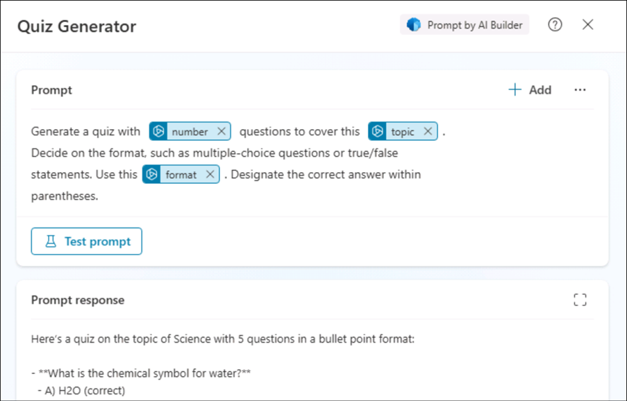
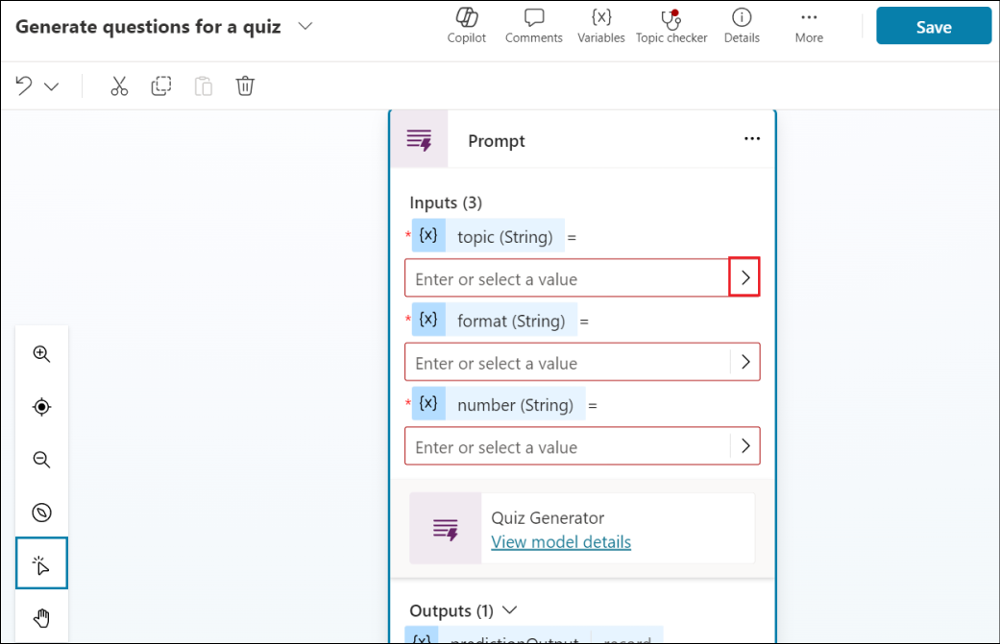

# ラボ 10: クイズ生成エージェントのトピックにプロンプ​​トアクションを実装する

## エクササイズ1: Natural Languageを使用してエージェントを作成する

1\. ブラウザを開き、+++https://copilotstudio.microsoft.com/+++
にログインします。そのページにまだアクセスしていない場合は、\[Resources\]
タブの資格情報を使用してログインします。

2\. すでに Copilot Studio
ページを開いている場合は、「Home」をクリックしてホーム
ページに移動します。

3\. ホーム ページの \[Describe your agent to create it\]
の下のテキスト領域に、「+++ I want you to be a question and answering
assistant that can answer common questions from users using the content
of a website +++」と入力し、\[Send\]
をクリックします。

4\.
エージェントの名前が提案される場合があります。そのまま使用するか、独自の名前を入力してください。

5\.
エージェントの機能に関するその他の詳細を、以下のように入力してください。

+++ help answer common product and support questions using the content
of a website, and help answer HR questions from an uploaded file +++

6\. ナレッジソースとして使用するWebサイトとして、+++www.microsoft.com+++
を入力してください。

7\.
指示を入力し終わったら、「Create」をクリックしてエージェントを作成します。

8\.
エージェントが作成され、詳細が表示されます。ページをスクロールして、エージェントが指定した手順で作成されたことを確認します。

9\. テストアイコンをクリックしてエージェントをテストします。「+++What is
Copilot
Studio+++」と入力してEnterキーを押します。

10\. +++ What is the latest xbox model?+++
と入力します。

上記の両方の手順では、エージェントは一般的な知識を使用するため、エージェントからは一般的な回答が返されます。

## エクササイズ2: トピックにプロンプ​​トアクションを作成して、回答を生成する

アクションを使用してエージェントの機能を拡張できます。Microsoft Copilot
Studio では、エージェントに複数の種類のアクションを追加できます。

• 事前構築済みコネクタアクション: Power Platform
コネクタを使用して、Salesforce、Zendesk、MailChimp、GitHub
などの一般的なエンタープライズ製品などの他のシステムからデータにアクセスします。

• カスタムコネクタアクション:
コネクタを作成して、パブリックまたはプライベート API
からデータにアクセスします。

• Power Automate クラウドフロー: Power Automate
クラウドフローを使用してアクションを実行し、データを取得して操作します。

• AI Builder プロンプト: AI Builder
と自然言語理解を使用して、ビジネス内の特定のシナリオとワークフローをターゲットにします。

• Bot Framework スキル:
スキルが実行できるアクション（入力パラメーターと出力パラメーター、スキルのエンドポイント、スキルのディスパッチモデルなど）の概要を示すスキルマニフェストを使用します。

この演習では、トピックノードにプロンプ​​トアクションを追加する方法を学習します。

1\. エージェントで \[Topics\] タブを選択し、\[+Add a topic\] を選択して
\[From blank\] を選択します。

> 2\. トピック名を「+++ Generate questions for a quiz
> +++」と入力します。トリガーの「Phrases」の下にある「Edit」ハイパーリンクを選択します。トリガーフレーズは最低5つ入力する必要があります。以下のフレーズを1つずつ追加してください。各フレーズを追加し、「+」オプションを選択してトリガーを追加します。
>
> +++create a number of questions for a quiz based on a topic and format
> the quiz based on the instruction provided+++
>
> +++creates a quiz with a number of questions based on the topic
> provided and formats the quiz+++
>
> +++generate a quiz with a number of questions using the topic provide
> and format the questions+++
>
> +++creates questions for a quiz on a specific topic and format+++
>
> +++format a quiz by a number of questions based on the topic
> provided+++

トピックを保存するには、右上の \[Save\]
を選択します。

3\. トリガーノードの下にある「+」記号をクリックします。「Add an
action」オプションを選択し、その下の「New prompt (default AI
model)」オプションを選択します。

> 3\.
> 「Prompt」ダイアログが表示され、プロンプトの作成方法を案内するポップアップが表示される場合があります。「Next」を選択してガイドに従ってください。
>
> 4\.
> クイズの質問を生成するプロンプトを作成します。プロンプトの名前を「+++Quiz
> Generator+++」と入力してください。
>
> 5\. 以下の内容を「Prompt」フィールドに貼り付けてください。
>
> +++Generate a quiz with \[number\] questions to cover this \[topic\].
> Decide on the format, such as multiple-choice questions or true/false
> statements. Use this \[format\]. Designate the correct answer within
> parentheses.+++

入力セクションを展開し、+ Add
inputを選択します。

6\. 「Add
input」オプションで「Text」を選択します。

7\.
名前を「+++number+++」と入力し、サンプルデータ（例：+++5+++）を入力します。「+
Add input -\>
Text」を選択して、次の入力を追加します。

8\.
名前に「+++topic+++」と入力し、サンプルデータ（例：+++Science+++）を入力します。次に、「+
Add input -\> Text」を選択して、次の入力項目を追加します。

\

9\. 名前に「+++format+++」と入力し、サンプルデータ（例：+++bullet
points+++）を入力します。

10\.
これで入力名とサンプルデータが追加されました。次に、入力をプロンプトに挿入する必要があります。プロンプトで\[number\]をハイライトし、「+
Add」を選択して、「プロンプト内」で「number」を選択します。これで、numberという入力がプロンプトに入力として追加されました。

11\. 残りの入力についても同じ手順を繰り返します。

12\. すべての入力がプロンプトに追加されたら、「Test
prompt」をクリックし、プロンプトの応答を確認します。

13\.
「Save」を選択してプロンプトを保存します。

14\.
トピックのオーサリングキャンバスにプロンプ​​トアクションノードが表示されます。次に、エージェントが入力できるように入力パラメータの値を定義する必要があります。「\>」アイコンを選択します。

> 15.Systemタブを選択し、アクションの入力値としてActivity.Textを選択して、ユーザーのレスポンス全体を使用し、フォーマット値を識別します。

16\.
プロンプトアクションの残りの入力パラメータに対して同じ手順を繰り返します。

17\.
次に、プロンプトアクションの出力変数を定義します。これにより、トピックの下流でレスポンスを参照できるようになります。「\>」アイコンを選択し、「Custom」タブで「Create
new」を選択し、変数名を「+++VarQuizQuestionsResponse+++」とします。

11. Below the Prompt action, select the **+** icon to add a new node and
    select **Send a message**. Select the **{x}** variable icon.

11\.
変数「VarQuizQuestionsResponse.text」を選択します。これにより、プロンプトアクションのレスポンスのテキストプロパティがメッセージ送信ノードに追加されます。「Save」を選択してトピックを保存します。

19\.
次にトピックの詳細を更新する必要があります。これは、ジェネレーティブモードが有効な場合に、エージェントがトピックとユーザーのインテントを関連付けるために使用されます。「詳細」を選択し、以下の情報を入力してください。

o Display name - +++generate questions for a quiz+++

o Description - +++This topic creates questions for a quiz based on the
number of questions, the topic and format provided by the user+++

\[Save\]
を選択してトピックを保存します。

20\.
エージェントがプロンプトアクションでトピックを呼び出すには、生成モード設定を有効にする必要があります。エージェントの「Settings」を選択します。

21\. Generative AI 設定を選択し、「Generate
(preview)」を選択してから「Save」を選択します。

22\.
これでエージェントをテストする準備が整いました。テストペインで更新アイコンを選択します。次の質問を入力して、出力を確認します。

+++Create 5 questions for a quiz based on geography and format the quiz
as multi choice+++

**概要**

このラボでは、カスタムプロンプトを作成してテストすることで、トピックのプロンプトアクションを作成する方法を学習しました。
