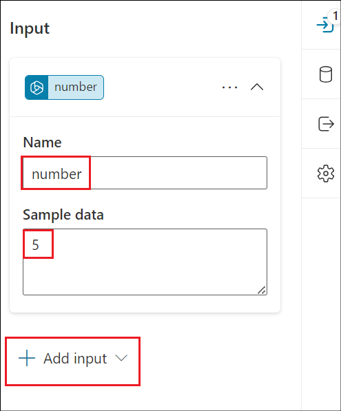
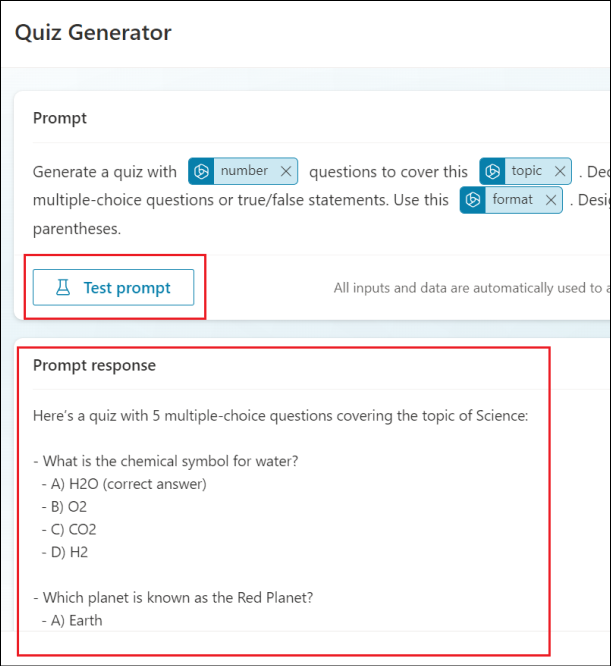

# 實驗 10：為測驗生成代理的主題實施提示作

## 練習 1：使用自然語言創建代理

1.  打開瀏覽器並登錄到
    +++<https://copilotstudio.microsoft.com/+++>，並使用 Resources
    （資源） 選項卡中的憑據登錄（如果您尚未進入該頁面）。

2.  如果您已經在 Copilot Studio 頁面上，請單擊**Home** 以轉到主頁。

3.  在主頁上，在 描述您的代理 創建它的文本區域中，輸入 +++I want you to
    be a question and answering assistant that can answer common
    questions from users using the content of a website+++，然後單擊
    **Send**。

4.  它可能會建議代理的名稱。要麼接受它，要麼提供你自己的名字。

5.  提供有關代理功能的其他詳細信息，如下所示。

> +++help answer common product and support questions using the content
> of a website, and help answer HR questions from an uploaded file+++

6.  為將用作 sknowledge 源的網站提供 +++<u>www.microsoft.com+++</u> 。

7.  完成提供說明後，單擊 **Create** 創建您的代理。

8.  代理隨即創建並打開詳細信息。滾動頁面以瞭解代理已根據您提供的說明創建。

9.  單擊 **Test** 圖標以測試代理。輸入 ++What is Copilot
    Studio+++，然後按 **Enter**。

10. 輸入 +++What is the latest xbox model?+++

對於上述兩個步驟，您將從代理那裡獲得一個通用的答案，因為代理將使用其常識。

## 練習 2：為生成式答案的主題創建提示作

作可用於擴展代理的功能。您可以在 Microsoft Copilot Studio
中向代理添加多種類型的作：

- **預構建的連接器作，**使用 Power Platform
  連接器訪問來自其他系統的數據，例如 Salesforce、Zendesk、MailChimp 和
  GitHub 等流行的企業產品。

- **預構建的連接器作，**使用 Power Platform
  連接器訪問來自其他系統的數據，例如 Salesforce、Zendesk、MailChimp 和
  GitHub 等流行的企業產品。

- **Power Automate 雲端流，**使用 Power Automate
  雲端流來執行作、檢索和處理數據。

- **AI Builder 提示，**它使用 AI Builder
  和自然語言理解來定位您業務中的特定場景和工作流。

- **Bot Framework
  技能，**它使用概述技能可以執行的作的技能清單，包括其輸入和輸出參數、技能的終結點以及技能的調度模型。

在本練習中，您將學習如何向主題節點添加作提示

1.  在您的代理中，選擇 **Topics** 選項卡，選擇 **+ Add a topic** 並選擇
    **From blank**。

2.  將主題的名稱輸入為 +++Generate questions for a quiz +++。在觸發器的
    Phrases 下選擇 **Edit** 超鏈接。至少需要輸入 5 個觸發短語

> 逐個添加以下短語。添加每個短語，然後選擇 + 選項以添加觸發器。
>
> +++create a number of questions for a quiz based on a topic and format
> the quiz based on the instruction provided+++
>
> +++creates a quiz with a number of questions based on the topic
> provided and formats the quiz+++
>
> +++generate a quiz with a number of questions using the topic provide
> and format the questions+++
>
> +++creates questions for a quiz on a specific topic and format+++
>
> +++format a quiz by a number of questions based on the topic
> provided+++
>
> 選擇右上角的 **Save** 以保存主題。

3.  單擊 Trigger 節點下方的 **+** 符號。選擇 **Add an action**
    選項，然後選擇 **New prompt （default AI model）** 選項。

4.  此時將顯示 Prompt （提示）
    對話框，並且您可能會看到一個浮出控件，該浮出控件將指導您如何創建提示。選擇
    **Next** 瀏覽指南。

5.  我們將創建提示，該提示將為測驗生成問題。將提示的名稱輸入為 +++Quiz
    Generator+++。

6.  將以下內容粘貼到 Prompt 字段中。

> +++Generate a quiz with \[number\] questions to cover this \[topic\].
> Decide on the format, such as multiple-choice questions or true/false
> statements. Use this \[format\]. Designate the correct answer within
> parentheses.+++
>
> 展開 **Input** 部分，然後選擇 **+ Add input**。

7.  選擇 **Text** 在下面 **Add input** 選項。

8.  輸入名稱 +++number+++，然後輸入示例數據，例如 +++5+++。選擇 **+ Add
    input -\> Text** 以添加下一個輸入。

9.  將名稱輸入為 +++topic+++ 並輸入示例數據，例如
    +++Science+++，然後選擇 **+ Add input -\> Text** 以添加下一個輸入。

\

11. 輸入名稱 +++format+++ 並輸入示例數據，例如 +++bullet points+++

12. 現在，我們已經添加了輸入名稱和示例數據。接下來，需要將輸入插入到提示符中。在提示符中，突出顯示
    **\[number\]** 並選擇 **+ Add** ，然後**在提示符下**選擇
    **number**。number 的輸入現已作為輸入添加到提示符中。

13. 對其餘輸入重複相同的步驟。

14. 將所有輸入添加到提示符後，單擊 **Test
    prompt**（測試提示符）並觀察提示符響應。

15. 選擇 **Save** 以保存提示。

16. 提示作節點現在將顯示在 Topic 的創作畫布中。接下來，需要定義 input
    參數的值，以便代理程序填充它們。選擇**\>**圖標

17. 選擇 **System** 選項卡，然後選擇 **Acivity.Text**
    作為作的輸入值，以使用用戶的整個響應並標識格式值。

18. 對提示作的其餘輸入參數重複相同的作。

19. 接下來，我們需要定義 prompt作的 output
    變量。這樣，就可以在主題的下游引用響應。選擇 **\>** 圖標，然後在
    **自定義** 選項卡中，選擇 **Create new** 並將變量命名為
    +++**VarQuizQuestionsResponse**+++。

20. 在 Prompt作下，選擇 + 圖標以添加新節點，然後選擇 **Send a
    message**。選擇 {**x**} 變量圖標。

21. 選擇變量 **VarQuizQuestionsResponse.text**。這會將提示作響應的 text
    屬性添加到 send a message 節點。選擇 **Save** （保存）
    以保存您的主題。

22. 接下來需要更新 Topic details （主題詳細信息）
    ，當啟用生成模式時，您的代理將使用該詳細信息將主題與用戶的意圖相關聯。選擇
    **Details** （詳細信息） 並輸入以下內容。

    - 顯示名稱 - +++generate questions for a quiz+++

    - 描述 - +++This topic creates questions for a quiz based on the
      number of questions, the topic and format provided by the user+++

> 選擇 **Save** （保存） 以保存您的主題。

23. 現在，需要啟用 **Generative mode** （生成模式）
    設置，代理才能使用提示作調用主題。為您的代理選擇
    **Settings**（設置）。

24. 選擇 **Generative AI** （生成式 AI） 設置，然後選擇 Generate
    （preview） （生成（預覽）），然後選擇 **Save** （保存）。

25. 現在我們準備好測試代理。在測試窗格中，選擇**refresh**
    圖標。然後輸入以下問題並觀察輸出。

+++Create 5 questions for a quiz based on geography and format the quiz
as multi choice+++

**總結**

在本實驗中，我們學習了如何通過創建自定義提示來為主題創建提示作並對其進行測試。

