# Lab 11 - Implement prompt action for a quiz generation agent’s topic

## Exercise 1: Use natural language to create an agent

1.  Open a browser and login to +++https://copilotstudio.microsoft.com/+++ and login with the
    credentials from the Resources tab if you are not in that page
    already.

    

2.  If you are already on the Copilot Studio page, click on **Home** to
    go to the Home page.

    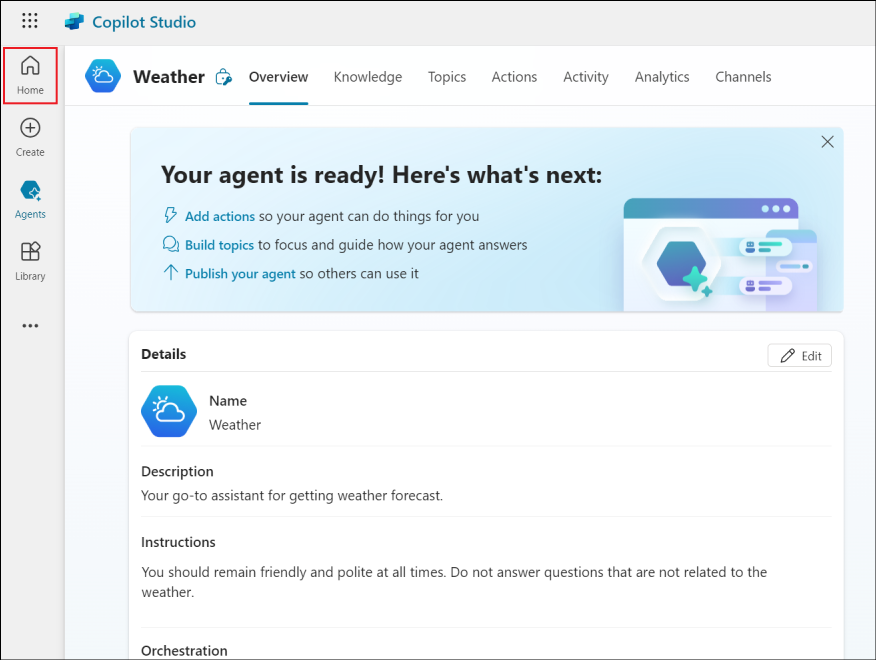

3.  On the Home page, in the text area under Describe your agent to
    create it, enter +++I want you to be a question and answering
    assistant that can answer common questions from users using the
    content of a website and a SharePoint site+++ and click on **Send**.

    

4.  It might suggest a name for the agent. Either accept it or provide
    your own name.

5.  Give other details regarding the functions of the agent like below.

    +++help answer common product and support questions using the content of
a website, and help answer HR questions from an uploaded file+++

6.  Provide +++www.microsoft.com+++ for the website that will be used a
    sknowledge source.

    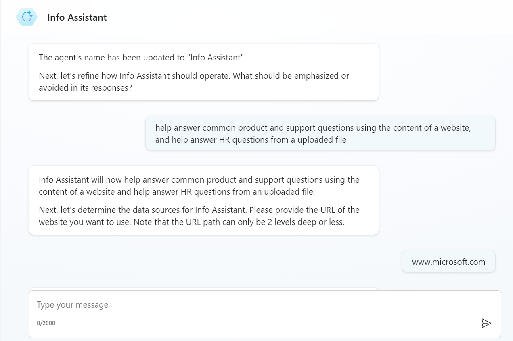

7.  Once done with giving instructions, click on **Create** to create
    your agent.

    

8.  The agent gets created and opens up with the details. Scroll through
    the page to understand that the agent has been created with the
    instructions you have provided for it.

    

    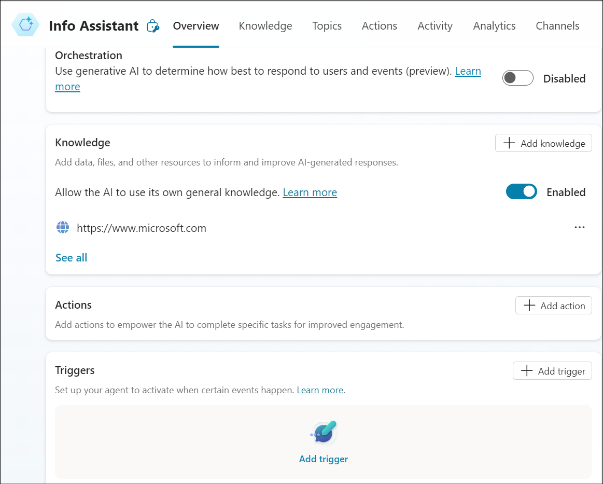

9.  Click on **Test** icon to Test the agent. Enter +++What is Copilot
    Studio+++ and hit **Enter**.

    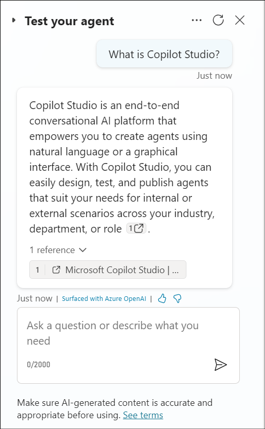

10. Enter +++What is the latest xbox model?+++

    

For both the above steps, you will get an answer from the agent which
will be a generic one since the agent will be using its general
knowledge.

## Exercise 2: Create a Prompt action for a Topic for generative answers

Actions can be used to extend the capabilities of agents. You can add
multiple types of actions to your agents in Microsoft Copilot Studio:

- **Prebuilt connector action**, which use Power Platform connectors to
  access data from other systems, such as popular enterprise products
  like Salesforce, Zendesk, MailChimp, and GitHub.

- **Custom connector action**, where a connector can be built to access
  data from public or private APIs.

- **Power Automate cloud flow**, which use Power Automate cloud flows to
  perform actions, retrieve and work with data.

- **AI Builder prompts**, which use AI Builder and natural language
  understanding to target the specific scenarios and workflows within
  your business.

- **Bot Framework skill**, which use the skill manifest that outlines
  the actions the skill can perform, including its input and output
  parameters, the skill's endpoints, and dispatch models for the skill.

In this exercise, you will learn how to add a prompt to action to a
topic node

1.  In your agent select the **Topics** tab, select **+ Add a
    topic** and select **From blank**.

    

2.  Enter the name for the Topic as +++Generate questions for a quiz+++.
    Select the **Edit** hyperlink under Phrases in the trigger. A
    minimum of 5 trigger phrases needs to be entered

    Add the below phrases one by one. Add each phrase and select + option to
add the trigger.

    +++create a number of questions for a quiz based on a topic and format the quiz based on the instruction provided+++

    +++creates a quiz with a number of questions based on the topic provided and formats the quiz+++

    +++generate a quiz with a number of questions using the topic provide and format the questions+++

    +++creates questions for a quiz on a specific topic and format+++

    +++format a quiz by a number of questions based on the topic provided+++

    Select **Save** on the top right to save the topic.

    

3.  Click on the **+** symbol below the Trigger node. Select The **Call
    an action** option and select **Create a prompt** option under that.

    

4.  The Prompt dialog will appear, and you may see a flyout appear that
    will guide you on how to create your prompt. Select **Next** to go
    through the guide.

5.  We'll create prompt that will generate questions for a quiz. Enter
    the name for the prompt as +++Quiz Generator+++.

6.  Paste the below content in the Prompt field.

    +++Generate a quiz with [number] questions to cover this [topic].
Decide on the format, such as multiple-choice questions or true/false
statements. Use this [format]. Designate the correct answer within
parentheses.+++

    Expand the **Input** section and select **+ Add input**.

    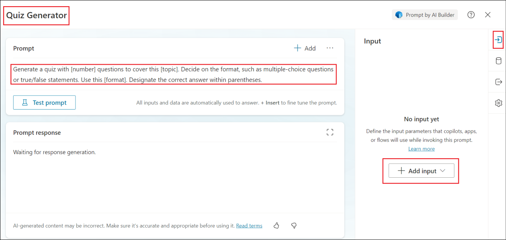

7.  Select **Text** under the **Add input** option.

    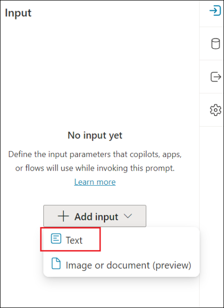

8.  Enter the name as +++number+++ and enter sample data such as
    +++5+++. Select **+ Add input** -\> **Text** to add the next input.

    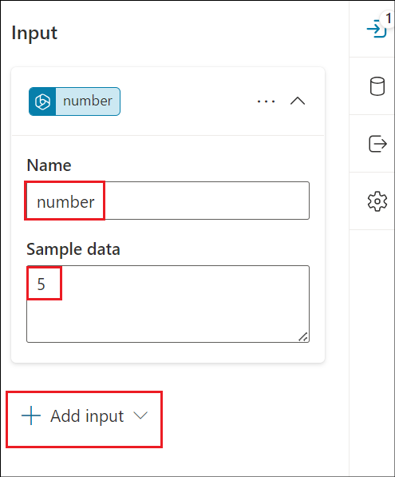

9.  Enter the name as +++topic+++ and enter sample data such as
    +++Science+++ and then select **+ Add input** -\> **Text** to add
    the next input.

    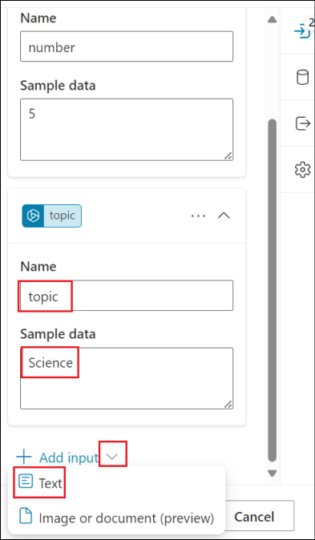

10. Enter the name as +++format+++ and enter sample data such as
    +++bullet points+++

    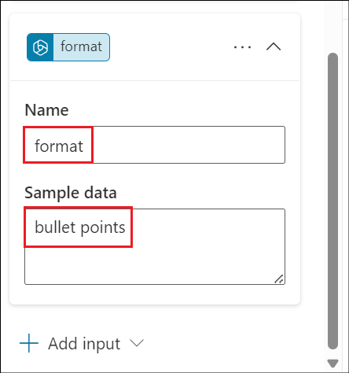

11. Now that we have added the input names and example data. Next, the
    inputs need to be inserted into the prompt. In the Prompt, highlight
    **\[number\]** and select **+ Add** and select number. The input of
    number has now been added to the prompt as an input.

    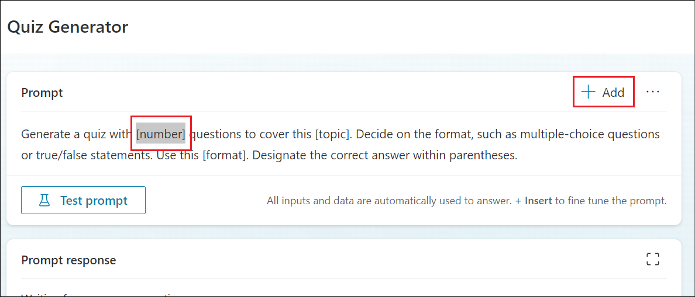

    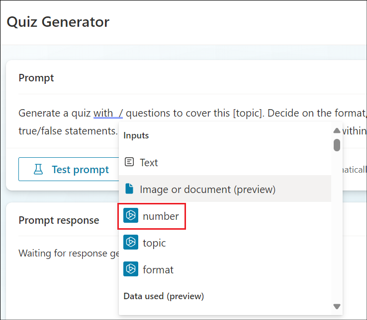

12. Repeat the same steps for the remaining inputs.

13. Once all the inputs are added to the prompt, click on **Test
    prompt** and observe the prompt response.

    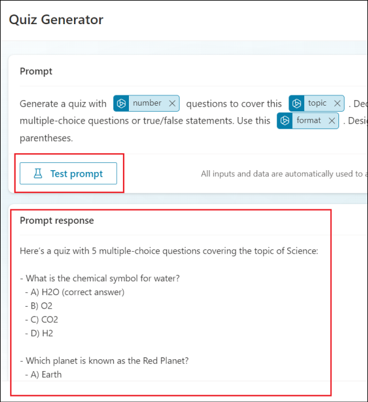

14. Select Save custom prompt to save the prompt.

    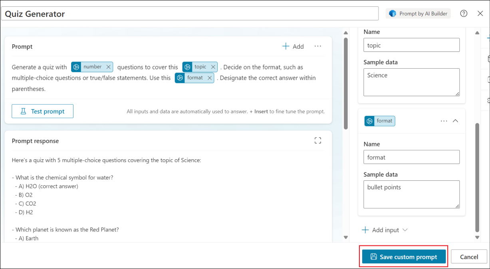

15. The prompt action node will now appear in the authoring canvas of
    the Topic. Next, the values of the input parameter need to be
    defined in order for the agent to populate them. Select
    the **\>** icon

    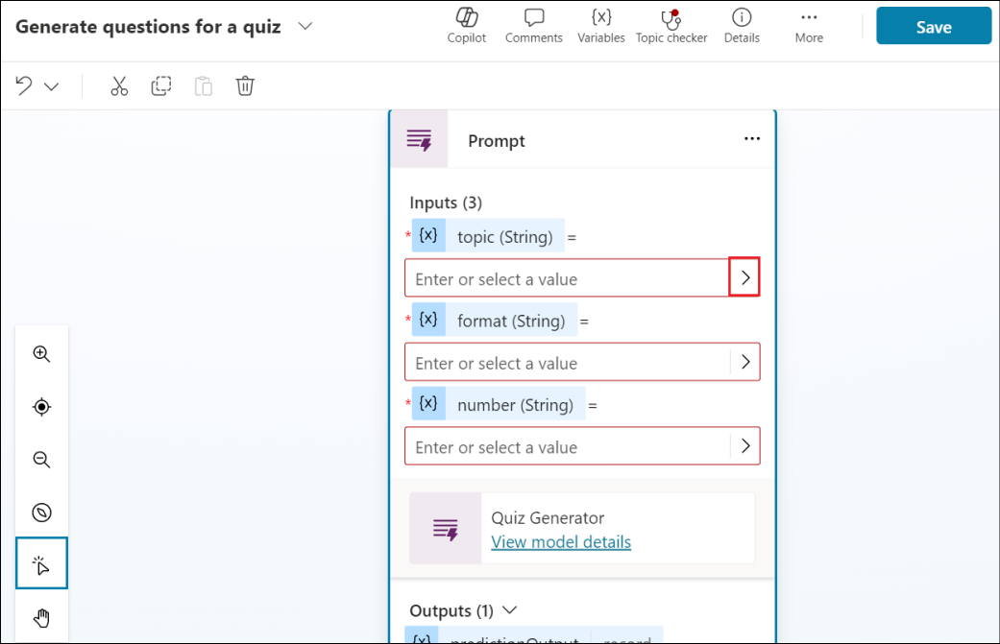

16. Select the **System** tab and select the **Acivity.Text** as the
    input value for the action to use the user’s entire response and
    identify the format value.

    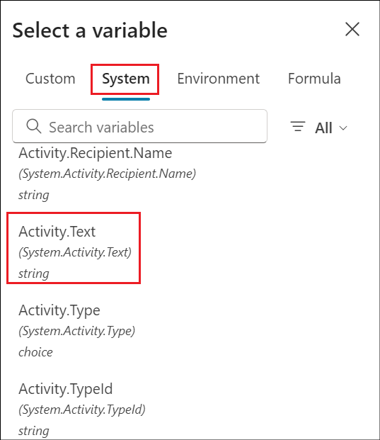

17. Repeat the same for the remaining input parameters of the prompt
    action.

    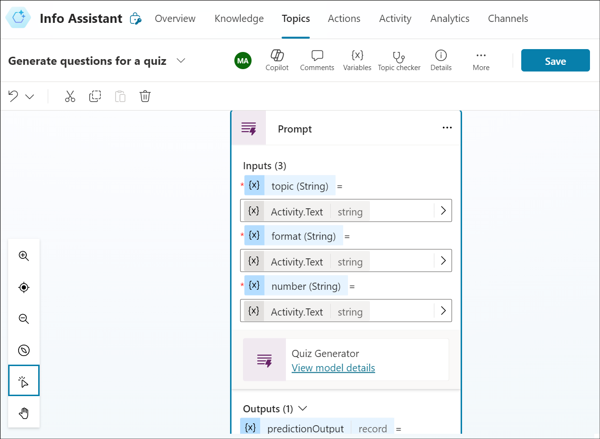

18. Next, we need to define the output variable of the prompt action.
    This is so that the response can be referenced downstream in the
    topic. Select the **\>** icon and in the **Custom** tab,
    select **Create new**

    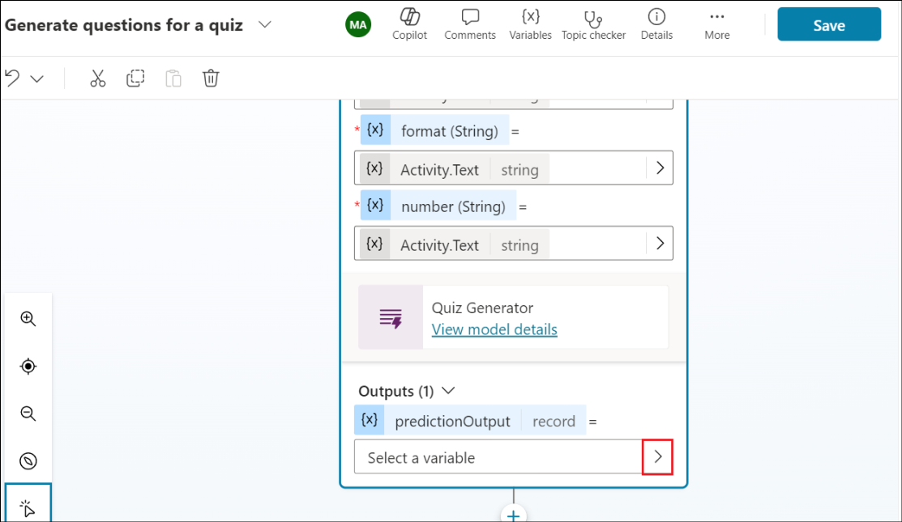

    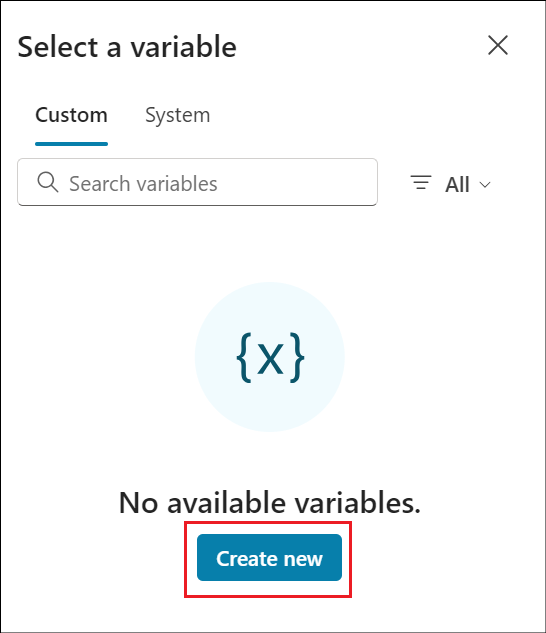

19. Below the Prompt action, select the **+** icon to add a new node and
    select **Send a message**. Select the **{x}** variable icon.

    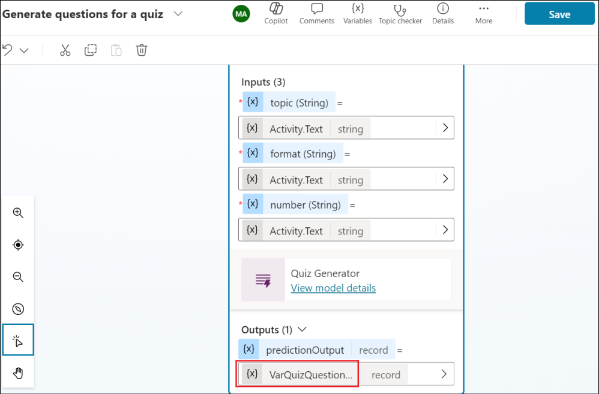

20. Select the variable **VarQuizQuestionsResponse.text**. This will add
    the text property of the prompt action response to the send a
    message node. Select **Save** to save your topic.

    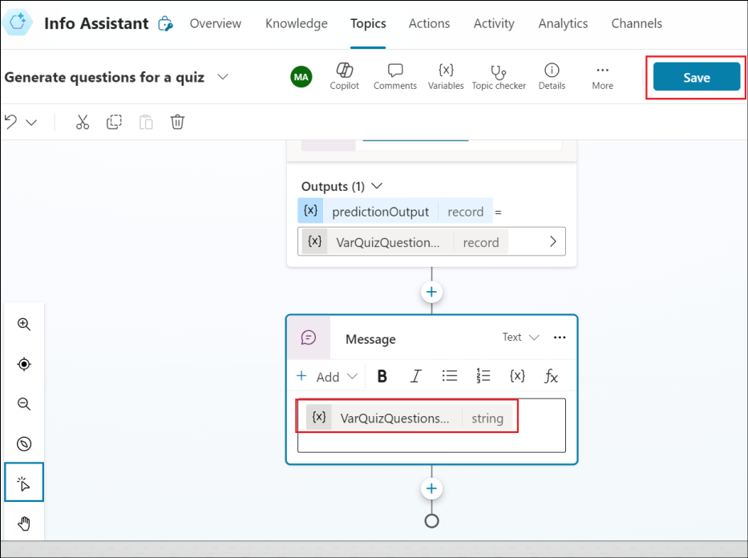

21. The Topic details needs to be updated next which will be used by
    your agent to associate the topic with the user's intent when
    Generative mode is enabled. Select **Details** and for the **Display
    name** enter the following.

    - Display name - +++ generate questions for a quiz+++

    - Description - +++ This topic creates questions for a quiz based on the
  number of questions, the topic and format provided by the user+++

    elect **Save** to save your topic.

    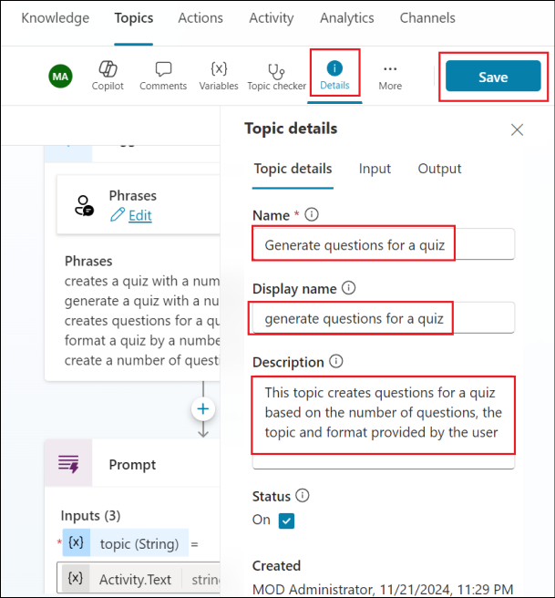

22. Now, the **Generative mode** setting needs to be enabled for the
    agent to call the topic with the prompt action. Select **Settings**
    for your agent.

    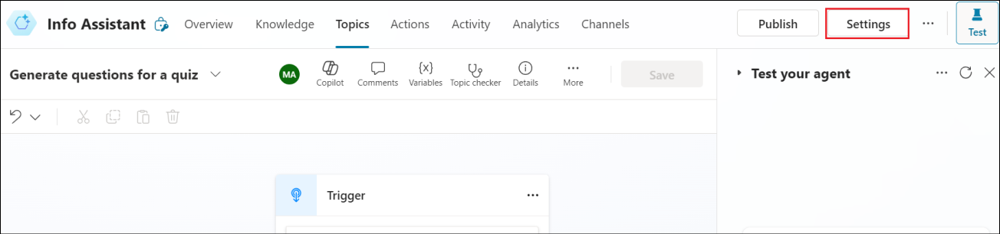

23. Select the **Generative AI** setting and select **Generate
    (preview)** followed by selecting **Save**.

    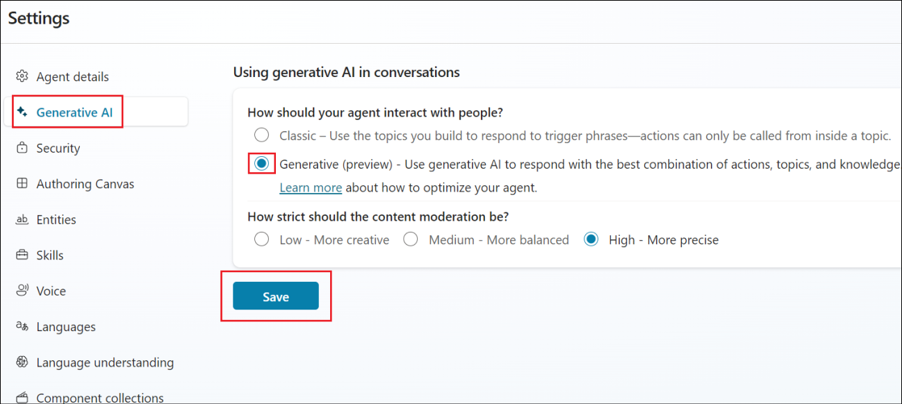

24. Now we are ready to test the agent. In the test pane, select
    the **refresh** icon. Then enter the following question and observe
    the output.

    +++Create 5 questions for a quiz based on geography and format the quiz
as multi choice+++

    

    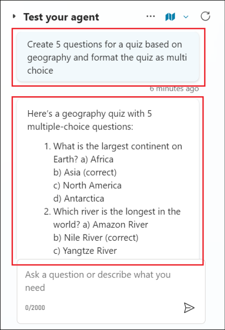

Summary

In this lab, we have learnt how to create a prompt action for a topic by
creating a custom prompt and test it.
