# Lab 01: Empower your workforce – Copilot - Executives

In this lab, you will

- Use Copilot in Word to create a speech you plan to deliver to company
  shareholders.

- Use Copilot in PowerPoint to create a PowerPoint presentation based on
  the speech you created.

**Exercise 1**: Create a speech using Copilot in Word

In this exercise, you direct Copilot in Word to write a speech for you
based on your company's Income Statement, which is stored as a Word
document.
> [!NOTE]
When you need to reference a file (such as
your company's Income Statement) into a Copilot prompt, the file MUST be
saved in a OneDrive account. You can't link to a locally stored file on
your PC.
You can reference/link a file into the Copilot prompt
using one of the following methods:
- Select the file from the Most Recently Used (MRU)
  file list.
- Open the file and copy its path using
  the **Share** option, then paste the path into the prompt following
  the forward slash (/).
- Copy the file's path from File Explorer and paste
  it into the prompt following the forward slash (/).
In this exercise, you select the company's Income
Statement from the MRU file list.

If you have a Microsoft 365 tab open in your Edge browser, then select
it now; otherwise, open a new tab and enter the following
URL: **https://www.office.com.**
On the Microsoft 365 navigation pane, select OneDrive to open it.

Browse to the **Downloads** folder to select and upload a copy of
Fabrikam's 2023 Income Statement document to OneDrive.

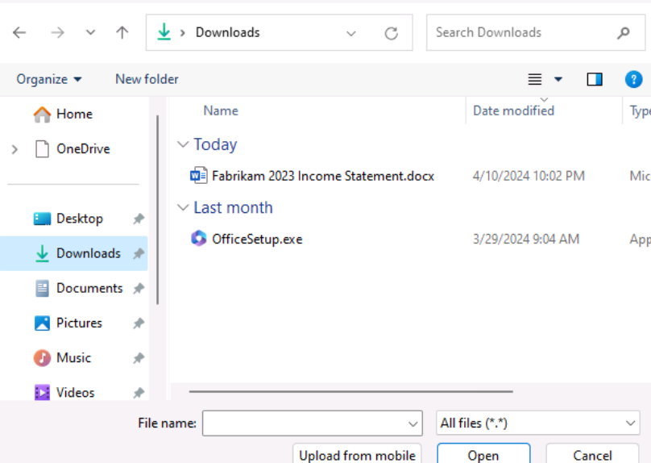

In Microsoft 365, open Microsoft Word, and then open a new blank
document.

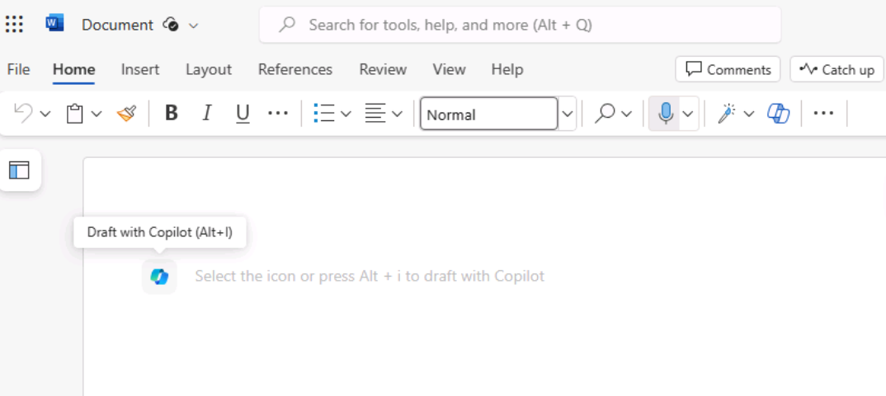

In the **Draft with Copilot** window that appears at the top of the
blank document, enter the following prompt:

**Write a speech for the Fabrikam stakeholders that
summarizes the results of the company's 2023 income statement found in
the attached file**.

In the **Draft with Copilot** window, select the **Reference your
content** button. In the drop-down menu that appears, select **Browse
files from cloud**.

If, for some reasons the file is not displayed in the **Browse files
from cloud** pop up window, please use the following steps to select the
file for referencing.

In the **Pick a file** window that appears, under the **Recent** file
list, select the **Fabrikam 2023 Income Statement.docx** file and then
select the **Attach** button. Note how the file is displayed in the
prompt.

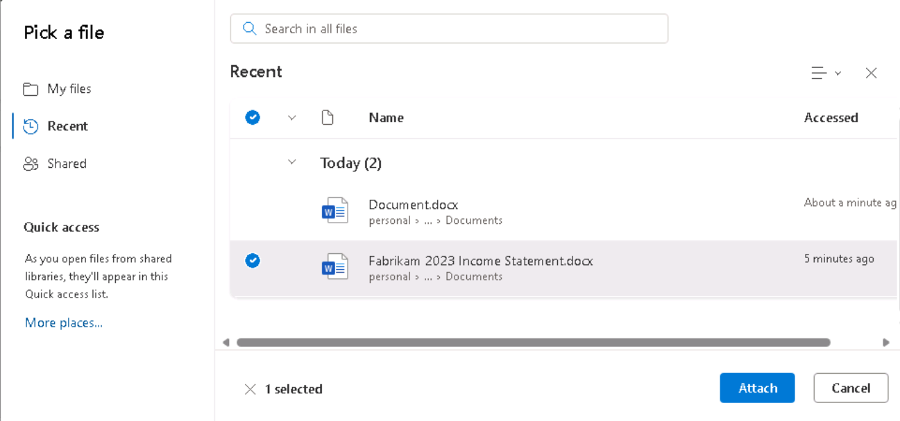

Select **Generate**. At this point, Copilot extracts the financial
results from the Income Statement and drafts a speech.

After reviewing the speech, you decide that it's a good starting point,
although there are a few areas that you want to modify.

In the Copilot window at the end of the speech, select the **Keep
it** button.

Note: You will be able to see the **Editor** icon, in
the Classic Ribbon and not in the Single line ribbon.

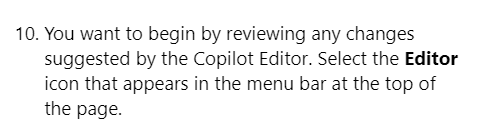

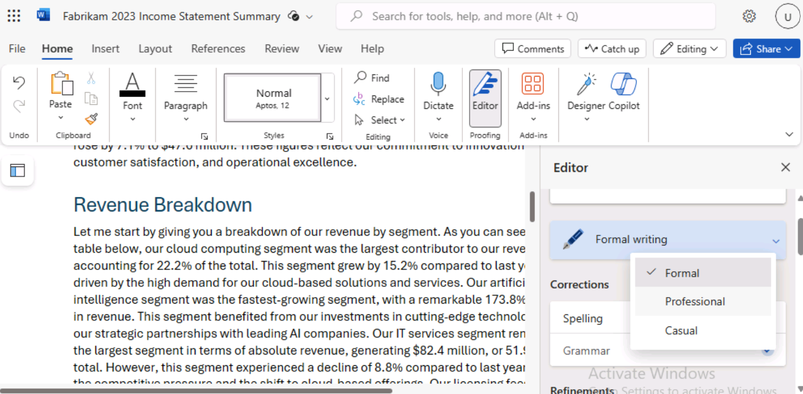

You want to begin by reviewing any changes suggested by the Copilot
Editor. Select the **Editor** icon that appears in the menu bar at the
top of the page.

In the **Editor** pane that appears, note the categories that appear
under the **Corrections** or **Refinements** sections that display a
number (indicating the number of issues for that category). These issues
are often linked to the tone of the writing style used in the document.

Below the **Editor Score** is a field that allows you to select the tone
used when writing the speech. It currently displays **Formal writing**,
which is the default tone that Copilot used when writing this speech.
When you don't indicate what writing style to use in your
prompt, **Formal writing** is the default tone that Copilot uses. Select
this field to see your options. You prefer a professional sounding tone,
so select **Professional** from the drop-down menu. Note whether
the **Editor Score** changes.

In the categories that appear under
the **Corrections** or **Refinements** sections, you can review the
changes that occurred in the categories based on changing the writing
style from Formal to Professional. Select each category that displays a
number (indicating the number of issues for that category). Doing so
enables you to review the suggestions throughout the document for that
category. For each suggestion, select either the suggested change or
select **Ignore**. Repeat this process until all categories display a
check mark.

For curiosity sake, change the writing style to **Casual**. Note whether
the **Editor Score** changes. If any categories display a number, review
the category and see what the Editor flagged. You want to keep the
writing style as Professional, so select **Ignore** any suggested
changes. Review all the suggested changes to see the differences that
were flagged between Professional and Casual styles.

Ex \#2: Create a slide presentation using Copilot in PowerPoint

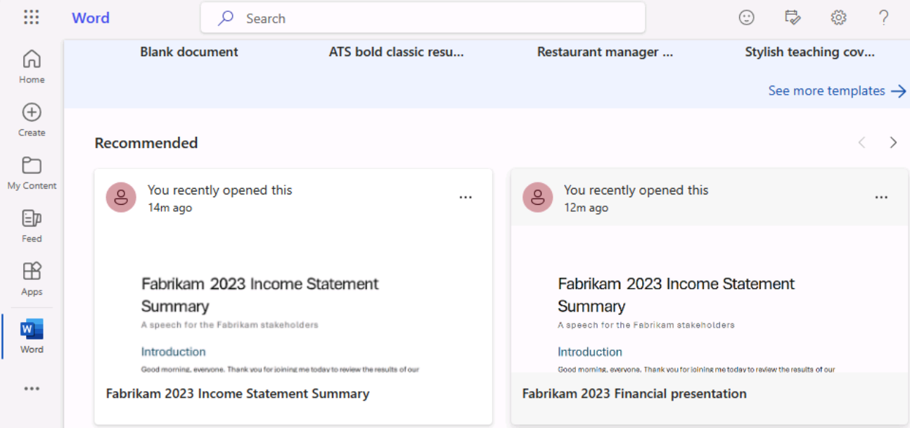

Screenshot is not getting populated.

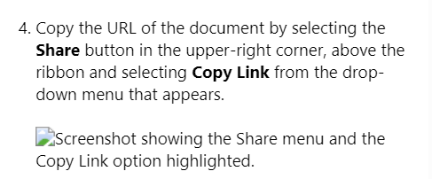

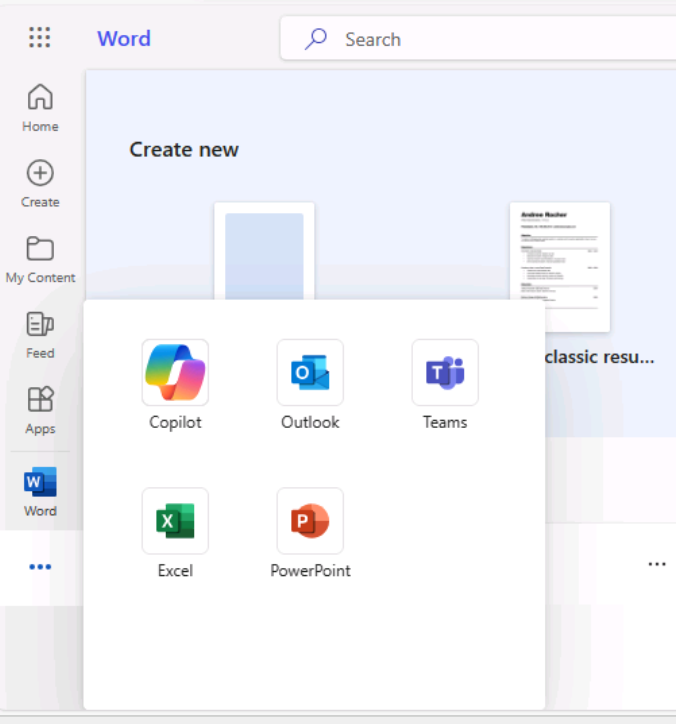

Screenshot is not getting populated.

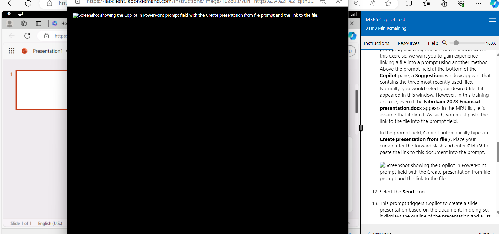

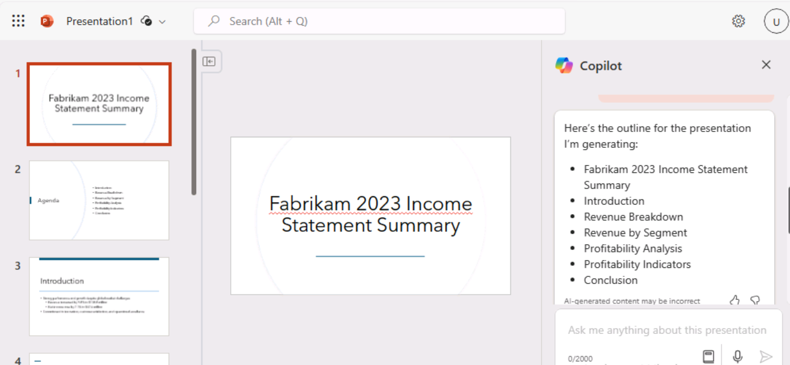

No reference to the speaker is noticed.

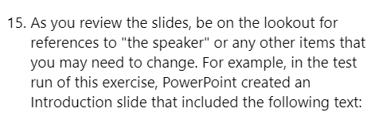

After the end of the instructions, when clicked Next, it brings up an
empty page and then **Back to start** page comes up.

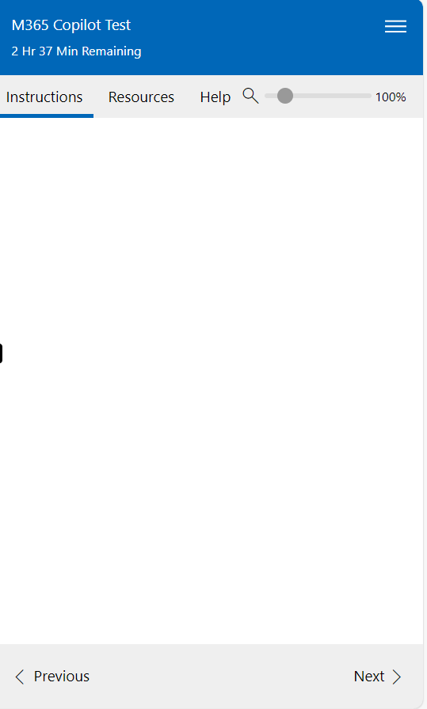
